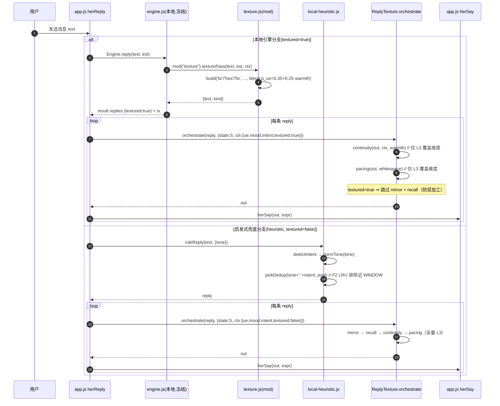
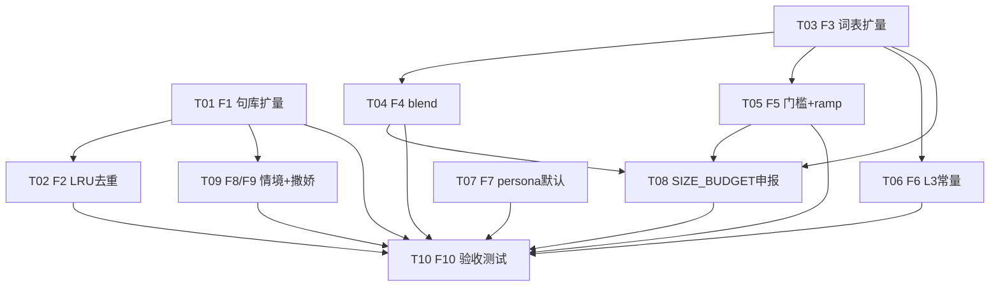

# 心屿 · 候选 F · 系统架构设计 + 任务分解

> 架构师：高见远（Gao）｜中转：主理人 齐活林（Qi）｜上游：许清楚 PRD（候选 F 真人感精调）
> 定位：在候选 E（回答系统真人感）体系之上做**精调**——文案库扩量为地基、参数精调为刻度；不重新搭体系、不引入新模块边界。
> 硬纪律全程生效：① 小暖不更名 ② 隐私零上报 ③ 前端零新增 npm 依赖 ④ 冻结四文件字节精确零交集 ⑤ 改动面仅四文件+测试、不新增顶层模块。

---

## 1 · 实现方案 + 框架选型

### 1.1 技术选型
- **语言/运行态**：原生 JavaScript（浏览器 PWA），无构建步骤、无打包、无 TypeScript。延续既有 `IIFE + window 全局门面` 模式。
- **依赖**：**零新增 npm 依赖**（硬约束③）。所有改动走纯函数 + 字符串逻辑，仅用 `Date.now()` / `Math.random()`，不引入任何库。
- **架构模式**：延续候选 E 已落地的 **L1/L2/L3/L4 四层管道**（后处理编排，非生成）：
  - **L1 · 微行为层**（`texture.js`，经 `Engine.mod("texture")` 挂载，仅本地引擎分支调用）：犹豫词/口头禅/断句/手误错别字。
  - **L2 · 启发式兜底句库层**（`local-heuristic.js`，`window.LocalHeuristic`）：按 `(tone, intent)` 选句的兜底回复；F1/F2/F8/F9 在此。
  - **L3 · 质感编排层**（`reply-texture-orchestrator.js`，`window.ReplyTexture`）：节奏分段/情绪镜像/记忆引用/话题连贯；全 provider 出口统一生效。
  - **L4 · 配置与挂载层**（`app.js`）：`persona` 默认值 + `herSay` 前唯一挂载点 `ReplyTexture.orchestrate`。
- **不触碰**：`engine.js` / `sw.js` / `memory.js` / `test/baseline.js`（字节精确零交集）；不改 prompt、不改情绪识别、不重写生成算法、不改 E 的防双加工契约。

### 1.2 难点与对策
| 难点 | 对策 |
|------|------|
| 30 轮 verbatim 重复（G1<15%） | **方向①地基**：F1 三池各 intent 扩到 6–8 条（总≥200）+ F2 进程内 LRU（同池近 8 条排除）。CRITICAL：F2 仅运行期内存、不写 S、刷新即忘、零外发。 |
| 默认回复"过干净"无微行为（G2∈[35%,65%]） | F3 扩微行为词表（TIC/UE_TIC/HES/MIRROR/BRIDGE）+ F4 修复 playful 忽略情绪的 tic 偏置（blend `p_ue=0.35+0.25·warmth`）+ F5 抬 `texturePass` 门槛 0.25→0.32 与 ramp floor 0.6→0.7。 |
| 参数中庸缺数据校验 | F6 L3 常量微调（mirror 0.28→0.30、continuity 0.22→0.24，recall 不动）+ F7 `persona.warmth 0.55→0.6` / `proactivity 0.5→0.45`。 |
| 撒娇无承载 | Q1 裁定=嵌入 clingy/playful 池（F9），不新增独立 tone、零 UI 变更。 |

### 1.3 关键算法约定
- **F4 blend（`build('tic')`）**：`p_ue = 0.35 + 0.25·warmth`。`warmth` 取自 `O(O(st).persona).warmth`（运行时，F7 后默认 0.6 ⇒ `p_ue=0.50`）。当 `UE_TIC[ueType]` 存在且 `CW(p_ue, rng)` 命中 ⇒ 走情绪 tic 池，否则走 tone tic 池（`playful→tsundere`、`clingy→clingy`、其他→`soft`）。⚠️ 因 F3 把 `UE_TIC` 扩为「每情绪 2–3 条数组」，`build('tic')` 须兼容数组形态：`Array.isArray(UE_TIC[ueType]) ? UE_TIC[ueType] : [UE_TIC[ueType]]`。
- **F2 LRU（进程内）**：模块级 `recentUsed = {}`，键 `poolKey = tone + ':' + intent`（DEFAULT_POOL 用固定键 `'default'`），值为最近选用回复数组，长度截取到 `WINDOW=8`。选句时先排除近 `WINDOW` 条，全排除则回退全池。不写 S、不落盘、刷新即忘。
- **防双加工契约（守 E）**：`ctx.textured===true` ⇒ L3 跳过 `mirror`+`recall`；`hasMicro(text)` 为真 ⇒ 不再补微行为。`warmth/proactivity/whitespace≤0.2` 的既有跳过守则保持。

---

## 2 · 文件列表（相对路径）

| 文件 | 角色 | 候选 F 改动 |
|------|------|------------|
| `texture.js` | L1 微行为模块（Engine.mod 挂载） | F3（TIC/UE_TIC/HES 扩表）、F4（build blend）、F5（门槛+ramp） |
| `local-heuristic.js` | L2 兜底句库 + 意图识别 | F1（三池扩量）、F2（LRU）、F8（时间窗+affection 分桶）、F9（撒娇嵌入） |
| `reply-texture-orchestrator.js` | L3 编排管道 | F3（MIRROR/BRIDGE 扩表）、F6（mirror/continuity 常量） |
| `app.js` | L4 配置 + herSay 挂载 | F7（defaultState + load 兜底 persona 默认值） |
| `test/wiring-scan.js` | 体积预算真源（SIZE_BUDGET） | 体积预算申报：texture.js 5277→6177 + 级联 moduleSumMax/totalMax（见 §9） |
| `test/qa-f-acceptance.test.js` | **新增** 验收测试 | F10：30 轮剧本 G1/G2 + 跨池不互窜 + 防双加工 + L3 路径 |
| `test/_f_browser_check.py` | **新增** 双视口真机（复用 E12） | F10/Q7-A：复刻 `_e12_browser_check.py`，加 G1/G2 可观察断言 |

> 冰冻四文件 `engine.js`/`sw.js`/`memory.js`/`test/baseline.js` **不在上表**（零交集）。

---

## 3 · 数据结构与接口（类图 + 关键函数签名）

```mermaid
classDiagram
    class TextureMod {
        +DAY const
        +CAP = 6
        +TYCAP = 2
        +TIC_TABLE object   // 每 tone 5 条（F3：3→5）
        +UE_TIC object      // 每情绪 2-3 条数组（F3：1→2-3）
        +HES string[]       // 6 条（F3：4→6）
        +TYPO_TABLE Array
        +KEY RegExp
        +textureAllow(state, ctx) Object
        +build(k, t, st, rng) Object
        +texturePass(text, state, ctx) Object
        +textureAfterTurn(state, hit) Object
    }
    class LocalHeuristic {
        +INTENT_POOL object          // 每 intent 6-8 条，总≥200（F1）
        +INTENT_POOL_TSUNDERE object // 同左（F1）
        +INTENT_POOL_CLINGY object   // 同左 + 撒娇风子风格（F1/F9）
        +DEFAULT_POOL string[]
        +recentUsed Map~string,string[]~  // F2 LRU（进程内）
        +WINDOW = 8
        +normTone(t) string
        +detectIntent(text) string
        +ruleReply(text, ctx) string
        +pickDedup(poolKey, pool) string
    }
    class ReplyTexture {
        +cfg Object   // {warmth, proactivity, whitespace, maxRecall}
        +MIRROR object  // 每情绪 3-4 条（F3：2→3-4）
        +BRIDGE string[] // 5 条（F3：3→5）
        +orchestrate(text, opts) string
        +mirror(text, ctx, warmth, rng) string   // 0.30·warmth（F6）
        +continuity(text, ctx, warmth, rng) string // 0.24·warmth（F6）
        +pacing(text, ws, rng) string
        +recall(text, state, proactivity, rng) string // 0.32·proactivity 不动
        +getParam(state, key, fallback) number
    }
    class AppState {
        +persona Object   // {tone, warmth, proactivity, whitespace, ...}
        +affection number
        +ue Object         // {type}
        +tex Object
        +mem Array
        +dayLife Object
    }
    TextureMod ..> AppState : 读 persona/ue（build/tic blend）
    LocalHeuristic ..> AppState : 读 tone/affection（F2/F8）
    ReplyTexture ..> AppState : 经 getParam 读 persona
```

### 3.1 关键函数签名（增量口径）

**`texture.js` — `build(k, t, st, rng)`（F4 改造后）**
```js
// k === "tic" 分支（blend 修复 playful 忽略情绪的偏置）
function build(k, t, st, rng) {
  if (k === "tic") {
    const p = O(O(st).persona) || {};
    const tone = p.tone || "playful";
    const warmth = (typeof p.warmth === "number") ? p.warmth : 0.6;
    const ueType = O(O(st).ue).type;
    const ueArr = UE_TIC[ueType];                       // F3 后为数组
    const useUE = Array.isArray(ueArr) && ueArr.length && CW(0.35 + 0.25 * warmth, rng);
    const tk = useUE ? "ue" : ({ playful: "tsundere", clingy: "clingy" }[tone] || "soft");
    const pool = tk === "ue" ? ueArr : TIC_TABLE[tk];
    return { text: PW(pool, rng) + "，" + t };
  }
  /* hes / fix / frag / typo / drift 分支保持 E 原貌 */
}
```

**`texture.js` — `texturePass(text, state, ctx)`（F5 改造）**
```js
const g = textureAllow(st, c);
if (!g.ok || E.detectCrisis(t).level !== "none") return null;
const rng = RG(c);
if (!CW(.32 * g.ramp * g.en, rng)) return null;   // 0.25 → 0.32
/* pool 选择、build、长度/破墙闸保持；返回 {text, kind, split} */
```
`textureAllow` 内 ramp floor：`Math.min(1, .7 + .2 * (lv - 1))`（0.6→0.7）；`CAP=6`/`TYCAP=2`/`KEY`/typo 冷却 20 轮**不动**。

**`local-heuristic.js` — `pickDedup` / `ruleReply`（F2 改造）**
```js
var WINDOW = 8;                       // 同池近 8 条排除；进程内、不写 S
var recentUsed = {};                  // 键: tone+':'+intent / 'default'
function pickDedup(poolKey, pool) {
  var recent = recentUsed[poolKey] || [];
  var avail = pool.filter(function (s) { return recent.indexOf(s) < 0; });
  var chosen = pick(avail.length ? avail : pool);
  recent.push(chosen);
  if (recent.length > WINDOW) recent = recent.slice(recent.length - WINDOW);
  recentUsed[poolKey] = recent;
  return chosen;
}
// ruleReply 中：reply = pool ? pickDedup(tone+':'+intent, pool) : pickDedup('default', DEFAULT_POOL);
```

**`reply-texture-orchestrator.js`（F3/F6）**
```js
var MIRROR = { sad:[3-4条], tired:[3-4条], lonely:[3-4条], anxious:[3-4条], happy:[3-4条], excited:[3-4条] }; // F3 2→3-4
var BRIDGE = ['对了','话说','诶，说起这个', /* +2 */]; // F3 3→5
function mirror(text, ctx, warmth, rng) {
  /* ... */
  if (!chance(0.30 * clamp01(warmth), rng)) return text;   // 0.28 → 0.30（F6）
}
function continuity(text, ctx, warmth, rng) {
  /* ... */
  if (!chance(0.24 * clamp01(warmth), rng)) return text;   // 0.22 → 0.24（F6）
}
// recall 保持 0.32·proactivity（F6 不动）
```

**`app.js`（F7）**
```js
// defaultState() + load() 兜底，两处同步：
persona: { gender:"female", tone:"playful", theme:"sakura", card:"xiaonuan",
           warmth: 0.6, proactivity: 0.45, whitespace: 0.5 }  // 0.55→0.6 / 0.5→0.45
// tone 默认仍 "playful"，不新增 tone；herSay 前唯一挂载点（~app.js:1412 ReplyTexture.orchestrate）零改动
```

---

## 4 · 程序调用流程（时序图 · textured 分支为主）



> 说明：`texturePass` 的实际调用点在冻结的 `engine.js` 内部（`Engine.mod("texture").texturePass`），模块代码（texture.js）可自由改动而不触碰冻结字节——这是候选 E 既有的挂载契约，F 沿用。

---

## 5 · 任务列表（有序 + 依赖，映射到 F1–F10）

> 编排原则（PRD 风险 §7）：**扩库先、参数后，各自带守门指标**。两波合入：波① = T01/T02/T03/T07/T08（地基 + 配置 + 预算闸，先合入验收）；波② = T04/T05/T06（参数/算法叠加）；P1 = T09/T10。

| Task | 名称 | 映射 | 源文件 | 依赖 | 优先级 |
|------|------|------|--------|------|--------|
| **T01** | 句库扩量（三池各 intent 6–8 条，总≥200，跨 intent 不互窜 + 危机词回避） | F1 | `local-heuristic.js` | — | P0 |
| **T02** | 进程内 LRU 去重（同池近 8 条排除，不写 S，刷新即忘，零外发） | F2 | `local-heuristic.js` | T01 | P0 |
| **T03** | 微行为词表扩量（TIC_TABLE 3→5/tone、UE_TIC 1→2-3/emotion、HES 4→6；MIRROR 2→3-4/emotion、BRIDGE 3→5） | F3 | `texture.js`, `reply-texture-orchestrator.js` | — | P0 |
| **T04** | `build('tic')` blend 修复（p_ue=0.35+0.25·warmth，兼容 UE_TIC 数组形态） | F4 | `texture.js` | T03 | P0 |
| **T05** | `texturePass` 门槛 0.25→0.32、ramp floor 0.6→0.7（CAP/TYCAP/typo 冷却不动） | F5 | `texture.js` | T03 | P0 |
| **T06** | L3 常量微调（mirror 0.28→0.30、continuity 0.22→0.24；recall 不动） | F6 | `reply-texture-orchestrator.js` | T03 | P0 |
| **T07** | `app.js` persona 默认（warmth 0.55→0.6、proactivity 0.5→0.45；tone 仍 playful） | F7 | `app.js` | — | P0 |
| **T08** | 体积预算申报更新（SIZE_BUDGET：texture.js 5277→6177，级联 moduleSumMax/totalMax） | 预算闸 | `test/wiring-scan.js` | T03,T04,T05 | P0 |
| **T09** | 情境维度轻扩（时间窗+affection 分桶）+ 撒娇风嵌入 clingy 三高频 intent | F8,F9 | `local-heuristic.js` | T01 | P1 |
| **T10** | 验收测试（qa-f-acceptance.test.js 30 轮 G1/G2 + 跨池不互窜 + 防双加工 + L3 路径；_f_browser_check.py 双视口） | F10 | `test/qa-f-acceptance.test.js`, `test/_f_browser_check.py` | T01–T07 | P1 |

### 5.1 任务依赖图



---

## 6 · 依赖包列表

**零新增依赖。** 项目为原生 JS PWA，`package.json` 维持无 `dependencies`（候选 E 已验证 E3）。本候选所有改动仅用语言内建 `Date.now()` / `Math.random()` / 数组与字符串操作，不引入任何第三方库、不新增 `<script>` 标签、不改 `index.html` 装载序。

```
（无 —— 不新增任何 npm 包 / CDN / 模块导入）
```

---

## 7 · 共享知识（跨文件约定，工程师必读）

- **persona 字段**：`S.persona = { gender, tone, theme, card, warmth, proactivity, whitespace }`。`tone ∈ {playful, tsundere, clingy}`（历史 `gentle/soft/cute` 经 `normTone` 优雅降级到 `playful`）。
- **warmth 读取方式**：
  - L3（`reply-texture-orchestrator.js`）：`getParam(state, 'warmth', cfg.warmth)` —— 优先 `state.persona.warmth`，回退 `cfg.warmth`。
  - L1（`texture.js` `build('tic')`）：`O(O(st).persona).warmth`（运行时值，F7 后默认 0.6）。
- **tone 归一化**：`normTone()` 在 `local-heuristic.js` 与 `reply-texture-orchestrator.js` **两处均有相同映射**，改一处的映射表须同步另一处。
- **关键常量名**：
  - `texture.js`：`CAP=6`（日微行为上限）、`TYCAP=2`（日错字上限）、`DAY=864e5`、`KEY`（关键信息禁错字正则）、`OFF`（总开关关闭态）。
  - `local-heuristic.js`（新增）：`WINDOW=8`（LRU 窗口）、`recentUsed`（模块级 Map）。
  - `reply-texture-orchestrator.js`：`cfg={warmth,proactivity,whitespace,maxRecall}`、`MIRROR`、`BRIDGE`。
- **防双加工契约（守 E）**：`ctx.textured===true` ⇒ L3 跳过 `mirror`+`recall`；`hasMicro(text)`（语气词前缀/波浪号/省略号）⇒ 不补微行为。`warmth/proactivity/whitespace≤0.2` 的跳过守则保持。
- **隐私零上报**：四改动文件 + 新增测试均不得出现 `fetch`/`XMLHttpRequest`/`WebSocket`/`sendBeacon`/`new URL`/`http(s)://`；AuditProbe 零上报护栏保留（E4 静态扫描 0 命中）。
- **冻结线字节闸**：`engine.js 251068 / sw.js 13723 / memory.js 13333 / test/baseline.js 2646` 字节精确，零交集；`size/wc -c` 自检后再合入。
- **小暖不更名**：触碰文件须保留「小暖」出现次数（E5 护栏下限 `>=45`）；不得改写 `applyPersonaStyle`、不得改 prompt、不得改情绪识别。
- **跨 intent 不互窜 + 危机词回避**：F1 扩库时同一 intent 文案句式须有差异（有/无 emoji、句长、动词变体），不得把 `sad` 的"过来我陪你"放入 `bye`；不得出现自我伤害线索（走 `E.detectCrisis` 守门）。

---

## 8 · 待明确事项（Unclear）

1. **F2 LRU 窗口取 6 还是 8**：PRD 给 6–8。建议默认 `WINDOW=8`（最强去重，30 轮内同句连发率更低），如需更"像人"的偶发重复可降到 6；实现为常量，便于灰度。
2. **F8 分桶实现形态**：建议 `(tone, intent)` 下再挂 `{ timeBucket: [...], affBucket: [...] }` 子结构，选择器先定桶再走 F2 的 LRU；与现有扁平数组兼容（旧池作为默认桶）。需工程师在 T09 落定时确认结构，避免破坏 F1 已扩的扁平池语义。
3. **F8 时间窗来源**：`Date.now()` 取小时分桶（早 6–11 / 午 12–17 / 晚 18–23 / 深夜 0–5）；affection 分桶阈值沿用 PRD（<2 / 2–4 / ≥5），来源只读 `S.affection`。
4. **F10 / G3 盲评分工**：Q4-A 裁定由 QA 严过关组织 5 人盲评（约 1 人日，金标），**不属工程师代码任务**；T10 仅交付自动化 G1/G2 + 双视口真机（`_f_browser_check.py`）与防双加工/L3 路径断言。盲评样本可与 T10 剧本共用。
5. **SIZE_BUDGET 为预测天花板**：§9 申报的 `texture.js=6177` 是 +900 上限（按 PRD 上沿）。**工程师须将 texture.js 落地字节控制在 ≤6177**；若实测实际落点（如 ~5880）低于天花板，最终 baselining（同 E 流程）再钉为实测值即可。若**超出 6177**，必须重新走配额评审（同 v21/v22 路径），不得就地放宽。
6. **local-heuristic / orchestrator / app.js 不计入 SIZE_BUDGET**：三者不在 `wiring-scan.js` 的 `mods=["memory.js","presence.js","texture.js","contingency.js"]` 列表内，其增长**不级联** moduleSumMax/totalMax；但仍受零外发 / 不重写生成算法等硬约束，且不得触碰冻结四文件。
7. **F11/F12/F13 不在本交付范围**：F11（typo 按 affection 自适应）、F12（回归问候 >6h）、F13（favicon，Q6-B 留给后续）均为 P2，本期不做不交付。

---

## 9 · 体积预算申报（相对冻结线外的增量预算）

### 9.1 真源与级联
`test/wiring-scan.js` 的 `SIZE_BUDGET` 是体积真源。候选 F 触碰的四文件中，**仅 `texture.js` 落在 `SIZE_BUDGET.mods` 列表内**（本地引擎微行为模块，经 `Engine.mod("texture")` 装载）。`local-heuristic.js` / `reply-texture-orchestrator.js` / `app.js` **不在**该列表，其增长不计入 `moduleSum` / `total`，故无需级联。

### 9.2 候选 F 增量预算（建议新数值）

| 字段 | E 基线（候选 E 重 baselining） | 候选 F 申报 | Δ | 说明 |
|------|-------------------------------|------------|----|------|
| `engineBase` | 245737 | 245737 | 0 | 冻结，永不动 |
| `engineNetMax` | 7379 | 7379 | 0 | 冻结 |
| `engineMax` | 253116 | 253116 | 0 | 派生 = engineBase+engineNetMax |
| `memory.js` | 13352 | 13352 | 0 | 冻结字节闸（13333 实测，缓冲 19） |
| `presence.js` | 3585 | 3585 | 0 | 冻结 |
| **`texture.js`** | **5277** | **6177** | **+900** | F3+F4+F5 词表+blend+门槛；+600~900 预测的上沿天花板 |
| `contingency.js` | 6682 | 6682 | 0 | 冻结（余量 18） |
| **`moduleSumMax`** | **28896** | **29796** | **+900** | = 13352+3585+6177+6682 |
| **`totalMax`** | **282012** | **282912** | **+900** | = moduleSumMax + engineMax |

### 9.3 四锁恒等式复算（scanSizes 直驱）
```
① engineMax 253116 = 245737 + 7379                                  ✓
② 13352 + 3585 + 6177 + 6682 = 29796 = moduleSumMax                 ✓（严格等式）
③ 245737 + 7379 + 29796 = 282912 = totalMax                        ✓（间隙恒 0，270KB 承诺仍守）
④ 13352>13333(19) / 3585>3566(19) / 6177 > 实测(待落地,缓冲=6177-实测) / 6682>6664(18)  ✓
```
> 实施要求：T08 在 `wiring-scan.js` 的 `SIZE_BUDGET` 中同步翻转上述三处真源值（`texture.js` / `moduleSumMax` / `totalMax`），并在审批块追加「候选 F 预算 gating 轮 · 主理人 Qi 批准」注释（沿用 v14~候选E 的历史块格式，旧块逐字不动）。texture.js 落地字节须 ≤6177；若实测低于天花板，最终 baselining 再钉实测值（同 E 流程）。

---

## 10 · 交付判定（进 QA 验收硬门槛，复用 PRD §6.3）
- ✅ G1（同池 verbatim 重复率 <15%）、G2（微行为覆盖率 [35%,65%]）、G3（5 人盲评 ≥4.0/5.0）同时达成；
- ✅ 冻结四文件字节精确零交集（自动化工序）；
- ✅ E 套件 13/13 + 核心回复功能测试 0 回归；
- ✅ 双视口真机不白屏、危机/首轮/降级护栏全绿；
- ✅ 隐私零外发（E4 静态扫描 + 浏览器实测）；
- ✅ 改动面仅 `texture.js` / `local-heuristic.js` / `reply-texture-orchestrator.js` / `app.js`（最小 persona 默认值）+ 新增 `test/qa-f-acceptance.test.js` 与 `test/_f_browser_check.py`，无新增顶层业务模块；
- ✅ `texture.js` 落地字节 ≤6177（SIZE_BUDGET 闸）。
