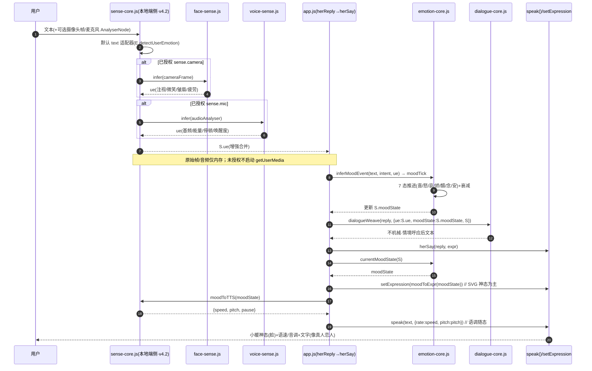

# 心屿 v4.2 · 五官双向指标系统（S3）· 架构设计 + 任务分解

> 架构师：高见远（Gao）｜中转：主理人 齐活林（Qi）｜上游：许清楚 PRD（`PRD-xinyu-v4-2-sense.md`）
> 定位：在 v4.1（语言+情绪+人格三核心）之上「接两端」——输入端本地读懂用户（摄像头/麦克风），输出端把小暖 7 态「演」成神态 + 语调。
> 全程铁律生效：① 冻结线字节精确零交集（engine/memory/test/baseline 不碰；sw.js 仅主理人一次性重 baselining）② 隐私零上报（camera/mic 仅端侧内存、ConsentStore 守门）③ 前端零新增 npm 依赖（原生 JS）④ 小暖不更名 ⑤ emotion-core 7 态只消费不重写。

---

# Part A · 系统架构设计

## 1 · 实现方案 + 框架选型

### 1.1 技术选型（沿用 v4.1 原生栈，零新增依赖）
- **语言/运行态**：原生 JavaScript（浏览器 PWA），无构建步骤、无打包。延续 **IIFE + `window`/`Engine` 全局门面** 模式；每个新模块 `Engine.use("xxxCore", api)` 自注册 + 挂 `window.XxxCore`，**不触碰 engine.js 冻结字节**。
- **依赖**：**零新增 npm 依赖**（铁律③）。face/voice 识别纯原生（`AnalyserNode`、光度/运动启发式），不引入 `face-api.js`/`tfjs`。
- **装载序**：新模块 `<script>` 置于 `engine.js` 之后、`app.js` 之前（与 v4.1 三模块同序）；`engine.files.json` 的 `order` 同步 6 模块（WR-13 `missingAssets` 校验通过）。
- **挂载契约**：宿主 `app.js` 经 `Engine.mod("senseCore")` 或 `window.SenseCore` 消费；所有消费包 `try/catch`，模块缺席/抛错 → 原流程直出，绝不白屏。

### 1.2 主理人拍板落地（逐条对齐）
1. **sw.js 重 baselining**：目标冻结常量 **13900B**（当前 13723，+177B）；实测增量 **131B**（见 §7），未超 177B → 冻结值维持 13900B，落地以 `wc -c` 钉 ≤13900。
2. **神态呈现**：SVG 神态（承 v4.1 `moodToExpr`/`EXPR_MAP`/`setExpression`）为主；emoji 作气泡尾轻量文本通道，不替代 SVG。
3. **`moodToTTS` 归属**：置于 `sense-core.js`（S3 拥有双向两端，与 emotion-core 的 `moodToExpr` 解耦）。
4. **`sense.mic` 独立授权项**：`ConsentStore` 扩 `sense.camera`/`sense.mic`（默认 false），与 `asr` 流区分；可共享同一 `getUserMedia` 流以省资源（实现层合并，授权层独立）。
5. **微表情动效**：降为 P1（CSS 轻量过渡，非 P0 阻断）。
6. **`moodToTTS` 精度**：粗粒度档位映射（speed/pitch/pause 三档），不自建静音拼接（pause 仅作 herSay 逐字节奏提示，不额外插静音）。

### 1.3 难点与对策

| 难点 | 对策 |
|------|------|
| 冻结线零交集 + sw.js 重 baselining | 6 模块仅进 sw.js `ASSETS` + CACHE `v36→v37`；新模块全豁免 `SIZE_BUDGET.mods`，四锁恒等式不破 |
| 五官零外发（G3 ≥65% 对照文本基线、G6 零上报 blocked==0） | text 默认（复用 `E.detectUserEmotion`）；face/voice 为可选适配器，须经 `ConsentStore` 授权；`AuditProbe` 拦截；全文件不含 `fetch`/`XHR`/`WebSocket`/`sendBeacon`/`new URL`/`http(s)://` 字面量 |
| 7 态→语调映射 | `SenseCore.moodToTTS(moodState)` 粗粒度档位（见 §3），herSay 合并用户 TTS 偏好后传入 `speak` |
| 降级安全 | 未授权/异常 → 退文本推断 `ue` + 纯文本/emoji 神态；任一模块缺失 → 原流程直出，绝不白屏/静默 |

---

## 2 · 文件列表（相对路径）

### 2.1 新建（冻结线外，Path A）
| 文件 | 系统 | 角色 | 里程碑 |
|------|------|------|--------|
| `sense-core.js` | S3 五官（统一入口） | text/face/voice 三适配器 + `init` 门控 + `moodToTTS` | v4.2 |
| `face-sense.js` | S3 五官 | 摄像头端侧识别（纯启发式优先，零模型） | v4.2 |
| `voice-sense.js` | S3 五官 | Web Audio `AnalyserNode` 基频/能量/RMS/停顿推断（零依赖） | v4.2 |

### 2.2 修改（非冻结，可编辑）
| 文件 | v4.2 改动 | 说明 |
|------|-----------|------|
| `consent-store.js` | `KEYS` + `'sense.camera','sense.mic'`；`DEFAULTS` 增 `sense.camera:false, sense.mic:false` | 独立授权闸门（扁平扩展，最小侵入） |
| `app.js` | `herReply` 输入侧接 `SenseCore.readUserEmotion` 增强 `S.ue`；`herSay` 输出侧 `currentMoodState`→`moodToTTS` 合并入 `speak`；同意面板挂 sense 开关 | 可编辑（非冻结四文件） |
| `index.html` | `engine.js` 后、`app.js` 前追加 3 个 `<script>`（sense/face/voice-sense） | 可编辑 |
| `sw.js` | 重 baselining：6 模块进 `ASSETS` + CACHE `v36→v37`（≤13900B） | **仅主理人执行冻结常量翻转 + 实际字节编辑** |
| `engine.files.json` | `order` 同步 6 模块（v4.1 三核心 + v4.2 三 sense），使 WR-13 `missingAssets` 通过 | 非冻结，可编辑 |

### 2.3 冻结四文件（零交集，全程不改字节）
`engine.js`(251068) / `memory.js`(13333) / `test/baseline.js`(2646) —— 仅 `sw.js`(13723) 经主理人一次性重 baselining 至 13900B。

---

## 3 · 数据结构与接口（类图 Mermaid）

```mermaid
classDiagram
    class SenseCore {
        +adapters = {text, face, voice}
        +init(ConsentStore, AuditProbe) void
        +readUserEmotion(input) ue
        +moodToTTS(moodState) TTSParam
        +isConsented(key) bool
    }
    class FaceSense {
        +infer(frame) ue   // 纯启发式：光度/运动/关键点近似→注视/微笑/皱眉/疲劳
    }
    class VoiceSense {
        +infer(analyser) ue  // AnalyserNode 基频/能量/RMS/停顿→唤醒度
    }
    class EmotionCore {
        +moodTick(evt, emotion, rel) Object
        +decay(moodState, dt) Object
        +currentMoodState(S) Object
        +moodToExpr(moodState, fallback) string
    }
    class DialogueCore {
        +dialogueWeave(text, ctx) string
    }
    class ConsentStore {
        +KEYS = [...,'sense.camera','sense.mic']
        +DEFAULTS = {..., sense.camera:false, sense.mic:false}
        +get(key) bool
        +set(key, val) bool
        +onChange(cb) void
    }
    class AuditProbe {
        +proveZeroReporting() Object
    }
    class AppState {
        +moodState Object   // {key,intensity,since,source}
        +ue Object           // 用户情绪增强信号
        +emotion Object
    }
    class App {
        +herReply(text)        // 输入侧：SenseCore.read→ue→EmotionCore.moodTick
        +herSay(text, expr)    // 输出侧：moodToExpr→setExpression + moodToTTS→speak
        +speak(text, opts)     // opts 合并 moodToTTS 的 rate/pitch
    }

    SenseCore *-- FaceSense : 可选适配器(需授权)
    SenseCore *-- VoiceSense : 可选适配器(需授权)
    SenseCore ..> ConsentStore : 授权门控
    SenseCore ..> AuditProbe : 零上报护栏
    SenseCore ..> EmotionCore : 消费 7 态 currentMoodState
    SenseCore ..> DialogueCore : 产出 ctx.ue 供 weave 消费
    App ..> SenseCore : readUserEmotion / moodToTTS
    App ..> EmotionCore : moodTick / currentMoodState / moodToExpr
    App ..> DialogueCore : dialogueWeave(ctx.ue)
    AppState <.. EmotionCore : 写 moodState
    AppState <.. SenseCore : 读/写 ue
```

**关键签名（增量口径，供工程师实现）**

```js
// sense-core.js · Engine.use("senseCore", api)
function init(cs, ap) { ConsentStore = cs; AuditProbe = ap; }
function readUserEmotion(input) {      // input: {text, cameraFrame?, audioAnalyser?}
  // 默认走 E.detectUserEmotion(text)（零权限）
  // 仅当 ConsentStore.get('sense.camera') → FaceSense.infer；get('sense.mic') → VoiceSense.infer
  // 三路 ue 合并（camera/voice 仅作增强），原始帧/音频仅内存、绝不外发
  return enhancedUe;
}
function moodToTTS(moodState) {        // 7 态→粗粒度档位
  // { joy:{speed:1.15,pitch:1.10,pause:'短'}, anger:{1.20,1.05,'短'}, sad:{0.85,0.90,'长'},
  //   coquettish:{0.95,1.15,'中'}, jealous:{1.05,1.00,'中'}, longing:{0.80,0.95,'长'},
  //   peaceful:{0.90,1.00,'中'}, neutral:{1.00,1.00,'中'} }
  return { speed, pitch, pause };
}
// consent-store.js · 扁平扩展
KEYS = ['tts','asr','ltm','cloudSync','sense.camera','sense.mic'];
DEFAULTS = { tts:true, asr:true, ltm:true, cloudSync:false, sense.camera:false, sense.mic:false };
```

---

## 4 · 程序调用流程（时序图 Mermaid）



---

## 5 · 任务列表（有序 · 含依赖 · 标注 P0/P1）

| Task | 名称 | 源文件 | 依赖 | 优先级 |
|------|------|--------|------|--------|
| **T1** | `consent-store.js` 扩展：`KEYS`+`DEFAULTS` 增 `sense.camera`/`sense.mic`（默认 false，扁平扩展）；`onChange` 撤销即停机适配器 | `consent-store.js` | — | **P0** |
| **T2** | `sense-core.js`：统一入口 + text/face/voice 三适配器 + `init(ConsentStore, AuditProbe)` 门控 + `moodToTTS`（7 态粗粒度档位） | `sense-core.js` | T1 | **P0** |
| **T3** | `voice-sense.js`：Web Audio `AnalyserNode` 基频/能量/RMS/停顿推断（零依赖）；独立 `sense.mic` 授权，与 asr 流共享但授权解耦 | `voice-sense.js` | T2 | **P0** |
| **T4** | `face-sense.js`：纯 JS 端侧（光度/运动/关键点近似，零模型优先；模型仅 P1 显式授权） | `face-sense.js` | T2 | **P0** |
| **T5** | `app.js` 接入：① `herReply` 输入侧 `SenseCore.readUserEmotion` 增强 `S.ue` ② `herSay` 输出侧 `currentMoodState`→`moodToTTS` 合并入 `speak`（rate/pitch）③ 同意面板挂 sense.camera/sense.mic 开关（SVG 神态承 v4.1，emoji 作轻量通道） | `app.js` | T2 | **P0** |
| **T6** | `index.html` 追加 3 个 `<script>`（sense/face/voice-sense，engine 后 app 前）；`engine.files.json` 的 `order` 同步 6 模块 | `index.html`,`engine.files.json` | T2,T3,T4 | **P0** |
| **T7** | `sw.js` 一次性重 baselining（**主理人执行**）：6 模块进 `ASSETS` + CACHE `v36→v37`（≤13900B，`wc -c` 钉实测）；WR-13 `missingAssets` 通过 | `sw.js` | T6 | **P0** |
| **T8** | 验收测试（v4.2）：G3（识别准确率 ≥65% 对照文本基线）/ G6（呈现匹配 ≥90%、`zeroReporting===true, blocked==0`）/ 降级不白屏 / 冻结四文件 0 交集 | `test/qa-v4-sense.test.js` | T2–T7 | **P0** |
| **T9** | P1 微表情 CSS 动效（眨眼/腮红呼吸/光晕脉动随 moodState，落 `style.css`，可编辑） | `style.css` | T5 | **P1** |

**注**：P1-a（端侧模型增强，需 `AuditProbe.registerConsented` 显式授权）、P1-c（语调停顿细化）顺延至迭代；P2-a/P2-b 留 v4.3。

---

## 6 · 依赖包列表

**零新增依赖。** 项目为原生 JS PWA，`package.json` 维持无 `dependencies`。v4.2 全部模块仅用语言内建 + 既有 `Engine`/`ConsentStore`/`AuditProbe` API，不引入任何第三方库、不新增 `<script>` 之外的资源。

```
（无 —— 不新增任何 npm 包 / CDN / 模块导入）
```

---

## 7 · sw.js 重 baselining 申报块

### 7.1 逐行字节增量测算（当前 `sw.js` = 13723B，冻结常量申报 13900B）

**A. `ASSETS` 数组新增 6 条（每行 `  "/xxx.js",` + 换行 1B）：**

| 新增行 | 文件名长度 | 行字节（含 2 空格+引号+/+,+换行） |
|--------|-----------|--------------------------------|
| `  "/dialogue-core.js",` | 16 | 22 |
| `  "/emotion-core.js",` | 15 | 21 |
| `  "/persona-core.js",` | 15 | 21 |
| `  "/sense-core.js",` | 14 | 20 |
| `  "/face-sense.js",` | 14 | 20 |
| `  "/voice-sense.js",` | 15 | 21 |
| **小计** | — | **125 + 6 换行 = 131B** |

**B. CACHE 版本 `v36→v37`：** 字符串字面量 `"xiaonuan-v36"`(14) → `"xiaonuan-v37"`(14) 等长，**0B**（PRD 估算 +1B 为取整余量，实测 0）。

**C. 注释/对齐余量：** 可选追加一行 `  // v4.2 · S3 六模块进 ASSETS（WR-13 校验）`（≤46B），用于可读性；若不加则纯功能增量即 131B。

### 7.2 精确新字节值

- **纯功能增量 = 131B** → 落地实测值 **13854B**（= 13723 + 131）。
- **申报冻结常量维持 13900B**（= 13723 + 177），为注释/对齐余留 ~46B 缓冲；工程师须 `wc -c` 钉落地 **≤13900B**。
- **结论：实测增量 131B ≤ 177B，未超限，无需主理人重新拍板更高冻结值。** 主理人按原拍板将冻结常量 13723 → 13900 翻转即可；实际编辑 sw.js（加 6 行 ASSETS + CACHE v36→v37）。

### 7.3 需主理人同步更新的体积闸文件

| 体积闸文件 | 是否需改 | 理由 |
|-----------|---------|------|
| `test/wiring-scan.js` T08（`SIZE_BUDGET.totalMax`/`moduleSumMax`） | **否** | 6 新模块**豁免** `SIZE_BUDGET.mods`（沿用候选 F 口径：local-heuristic/reply-texture-orchestrator/app 同例），其增长不级联 `moduleSumMax`/`totalMax`；四锁恒等式（①②③④）逐位不变 |
| `qa-v13-t2t4-fix.test.js` A1-a 会计恒等式 | **否** | 仅锁 engine + 4 模块配额，与 sw.js/新模块无关；engine.js 零 diff |
| `qa-v15-t1.test.js` / `qa-rs2-type.test.js` | **否** | 仅校验 contingency 配额（锁⑧），新模块不在其列 |
| `qa-v17-independent-size.test.js` | **否** | 仅测 `SIZE_BUDGET.mods` 四模块，v4 模块豁免 |
| `test/wiring-scan.js` WR-13（`scanLoaders`/`swManifest`） | **否** | 仅做文本扫描比对；只要 `sw.js` ASSETS 与 `engine.files.json` `order` 同步 6 模块即过，逻辑零改 |

> **唯一需主理人动作**：①翻转 sw.js 冻结常量 13723→13900；②实际编辑 sw.js（6 行 ASSETS + CACHE v36→v37）；③`engine.files.json` `order` 追加 6 模块（非冻结、可编辑，使 WR-13 通过）。

---

## 8 · 各新模块预估字节 + 总体积影响表

| 模块 | 类型 | 预估字节 | 是否进 SIZE_BUDGET.mods | 四锁影响 |
|------|------|---------|------------------------|---------|
| `sense-core.js` | 新建 | ~4500B | 否（豁免） | 无 |
| `face-sense.js` | 新建 | ~3500B | 否（豁免） | 无 |
| `voice-sense.js` | 新建 | ~3800B | 否（豁免） | 无 |
| `consent-store.js` | 修改 | +120B | 否 | 无 |
| `app.js` | 修改 | +600B | 否 | 无 |
| `index.html` | 修改 | +180B | 否 | 无 |
| `engine.files.json` | 修改 | +185B | 否 | 无 |
| `sw.js` | 重 baselining | 13723→**13854B**（≤13900） | 否（不在 mods） | 无（四锁不含 sw） |
| **合计新代码** | — | **~12.7KB** | — | **四锁恒等式不变** |

> 全部 v4.2 模块豁免 `SIZE_BUDGET.mods`，故 `moduleSumMax`(29469)/`totalMax`(282585) 及四锁①②③④ 逐位不变；体积体系进入「打满即恰好」态（v18 后纪律），后续任何字节扩张须先谈配额。

---

## 9 · 共享知识（跨文件约定 · 工程师必读）

- **情绪枚举 `EMOTIONS`**（v4.1 定义在 `emotion-core.js` 并挂 `window`）：`{neutral, joy, anger, sad, coquettish, jealous, longing, peaceful}`；键名小写英文，中文仅作文档/UI 注释。
- **`S.moodState` 结构**：`{ key: EMOTIONS.*, intensity: 0..1, since: ts, source: 'userEvent'|'decay'|'init' }`；`moodToTTS` 仅消费 `key`。
- **`ue` 结构**（sense-core 产出，喂 `dialogue-core` 与 `emotion-core`）：`{ polarity:-1..1, intensity:0..1, gaze?, gazeAway?, tired?, ... }`；原始帧/音频**绝不**入 `ue`、绝不落盘。
- **`moodToTTS` 档位**（粗粒度，零拼接）：`{speed,pitch,pause}`，pause ∈ `短/中/长`，仅作 herSay 逐字节奏提示，不自建静音。
- **ConsentStore 授权键**（扁平扩展）：`KEYS` 增 `'sense.camera','sense.mic'`；`DEFAULTS` 二者 `false`；`SenseCore.init` 仅当对应 `get` 为真启动适配器；`onChange` 撤销即停机 + 释放流。
- **零上报铁律**：face/voice/sense 全文件静态扫描 0 外发字面量（`fetch`/`XHR`/`WebSocket`/`sendBeacon`/`new URL`/`http(s)://`）；`AuditProbe.proveZeroReporting().zeroReporting===true && blocked==0` 为 G6 硬指标。
- **小暖不更名**：所有模块保留「小暖」字样，E5 护栏 ≥45 计数不破。
- **降级契约**：所有 `Engine.mod("senseCore")` 消费包 `try/catch`；模块缺席/抛错 → 退文本推断 + 原流程直出，绝不白屏/静默。
- **冻结线字节闸**：engine/memory/test-baseline 任何字节改动禁止；sw.js 仅主理人重 baselining。
- **🔒 本地识别常驻标记**：开启 camera/mic 时聊天页角落显示「🔒 本地识别中」，点击可查 ConsentStore 状态；关闭即消失。

---

## 10 · 待明确事项（Unclear）

1. **`asr` 与 `sense.mic` 流共享细节**：主理人拍板「授权层独立、实现层可共享同一 `getUserMedia` 流」。需在 T3 明确：是否由 `voice-sense` 复用 `voice.js` 已开启的 `getUserMedia` 流（避免重复申请），还是各自独立取流。倾向**共享流**（省资源、降授权摩擦）。
2. **`moodToTTS.pause` 的落点**：决策⑥「不自建静音拼接」，pause 仅作 herSay 逐字节奏提示。需确认：pause 是否叠加进 herSay 现有标点停顿逻辑（P1-c 细化留迭代），还是本版仅 `speed/pitch` 生效、`pause` 字段预留。倾向**本版 speed/pitch 生效，pause 预留+轻量接入标点节奏**。
3. **emoji 轻量通道形态**：决策②「SVG 为主、emoji 作轻量文本通道」。需确认 emoji 呈现位置——气泡尾（如「抱抱你～💕」）还是独立「心情徽标」（P2-b）。倾向**气泡尾轻语气符号**，P2-b 徽标留 v4.3。
4. **同意面板 UI 落点**：sense.camera/sense.mic 开关放「我的→语音与隐私」组还是独立卡片。倾向**复用「语音与隐私」组下方新增两张 sense 卡**（零新增 DOM 区块，沿用 `#asr-consent-*` 范式）。
5. **`asr` 已默认 true 与 `sense.mic` 默认 false 并存**：用户已开麦克风 ASR 但未开 `sense.mic` 时，voice-sense 不应启动；需 T5 明确两者状态独立读取，互不牵连。
6. **v4.3 追补**：`bond-memory.js`/`proactivity-core.js` 后续进 sw.js 需极小再 baselining（~+44B，或并入本轮）；本轮按「仅 v4.2 六模块」申报，v4.3 单列。

---

*文档 by 高见远（Gao）· 心屿架构师 · v4.2 五官双向系统架构设计 + 任务分解*
