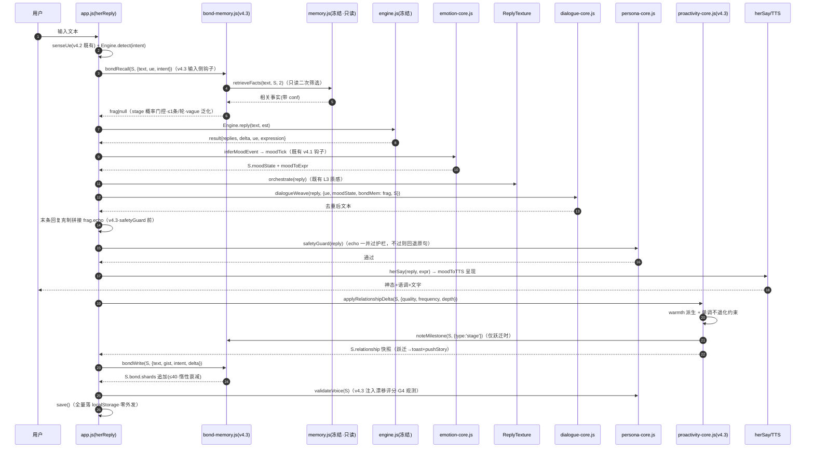
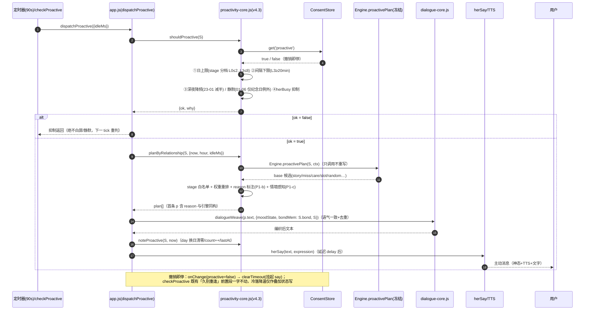
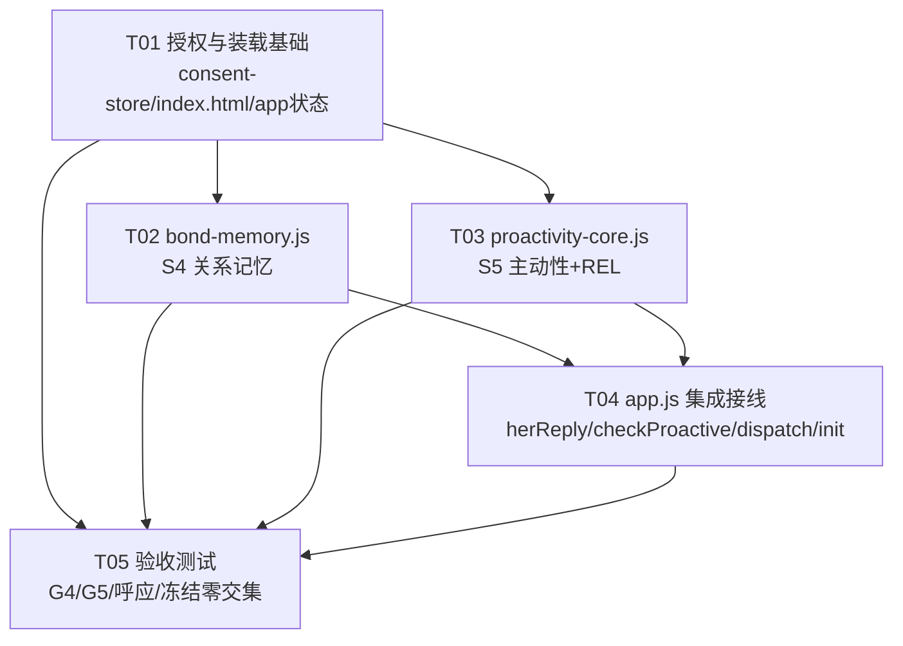

# 心屿 v4.3 · 记忆深化 + 主动性 + 关系升温（S4/S5）· 架构设计 + 任务分解

> 架构师：高见远（Gao）｜中转：主理人 齐活林（Qi）｜上游：许清楚 增量 PRD（`PRD-xinyu-v4-3-bond-proactivity.md`）
> 定位：v4 真恋人系统最后一块——在 v4.1（语言/情绪/人格三核心）+ v4.2（五官双向）之上，落地 **S4 关系记忆（bond-memory）+ S5 主动性（proactivity-core）+ REL 关系升温曲线**。
> 全程铁律生效：① **冻结四文件全冻结、零字节交集**（`engine.js` 251068 / `sw.js` 13894 / `memory.js` 13333 / `test/baseline.js` 2646，本期**连 `engine.files.json` 也不动**）；② 隐私零上报（关系记忆纯本地 localStorage、绝不外发、ConsentStore 守门）；③ 前端零新增 npm 依赖（原生 JS）；④ 小暖不更名；⑤ memory.js 接口**只读消费**，bond-memory 是其上层关系记忆层，绝不折回改写。

---

## 1 · 实现方案 + 框架选型

### 1.1 技术选型（沿用 v4.1/v4.2 原生栈，零新增依赖）

- **语言/运行态**：原生 JavaScript（浏览器 PWA），无构建、无打包。延续 **IIFE + `Engine.use("xxxCore", api)` 自注册 + `window.XxxCore` 双挂载** 模式（与 emotion-core / dialogue-core / sense-core 同款），不触碰 engine.js 冻结字节。
- **模块装载**：`bond-memory.js` / `proactivity-core.js` 的 `<script>` 置于 `index.html` 的 `sense-core.js` 之后、`app.js` 之前（bond-memory 在前、proactivity-core 在后）。**不进 `engine.files.json` 的 `order`，不进 `sw.js` 的 `ASSETS`**。
- **sw.js 零改（拍板①确认）**：已核验 `test/wiring-scan.js` 的 `scanLoaders()`（L547-565）——`htmlOrder = scripts.filter(s => order.includes(s))` 会把 order 之外的新 script 过滤掉，`missingAssets` 仅要求 order ⊆ ASSETS。因此两个新 script 挂入 index.html 而 order/ASSETS 均不列 → **WR-13 零风险**（v4.1 三核心上线时即此范式）；离线完整性由 sw.js fetch 兜底缓存覆盖（`fetch → cache.put` 路径既有）。**本期不申报 sw.js 重 baselining。**
- **体积闸**：新模块不进 `SIZE_BUDGET.mods`（v4 一贯豁免口径），四锁恒等式（①②③④）逐位不变；`test/baseline.js` 零交集。
- **状态写入责任**：沿用既有范式——模块产出补丁/原地更新 `S.bond` / `S.relationship`，**落库责任在 app.js（`save()` → `localStorage["xiaonuan_save_v1"]`）**；engine.js 冻结不写 state。

### 1.2 主理人 8 项拍板落地（逐条对齐）

| # | 拍板 | 落地设计 |
|---|------|----------|
| 1 | **sw.js 不动**，四文件全冻结，新 script 不进 order | §1.1 已核验 WR-13 逻辑零风险；文档全程不申报 sw.js 重 baselining，`engine.files.json` 零改动 |
| 2 | **遗忘曲线 = 简单线性衰减** | `decayShards` 线性衰减：`effImportance = clamp01(base − dt天/45)`，用后重置衰减时钟（`lastUsedAt` 刷新）；`eff < 0.3` 降级「模糊记忆」（泛化引用不逐字回填）。零依赖、可解释 |
| 3 | **节律：L3 日上限 ≤8、间隔 ≥20min、深夜降频** | §3.4 节律表：L0≤2/90min → L3≤8/20min 分档；23:00–01:00 上限减半+间隔×1.5；01:00–06:00 静默（纪念日当日例外一次） |
| 4 | **关系等级派生自 affection/dating，不独立状态机** | `relationshipLevel(S)` 纯派生：`warmth = 0.5·affNorm + 0.35·bond.warmth + 0.15·durNorm`，`dating 确立 → 至少 L2`；每次重算覆写 `S.relationship` 快照（旧档 'stranger' 值被覆写，无需迁移） |
| 5 | **记忆载体 localStorage，键名 S.bond 系列** | 全部随 `S` 落 `xiaonuan_save_v1`（`S.bond.*` / `S.relationship.*` 命名空间），不建独立 localStorage 键、不上 IndexedDB |
| 6 | **主动性开关 = ConsentStore 扩 `proactive`（默认 true）** | 类比 v4.2 `sense.*` 范式：KEYS/DEFAULTS/构造/load/save/reset 五处扁平扩展；`shouldProactive` 查 `get('proactive')`，`onChange` 撤销即停定时器 |
| 7 | **主动文案复用 `Engine.proactive` 既有池** | `planByRelationship` 只包装 `Engine.proactivePlan`（只调用不重写）；阶段差异由「kind 白名单 + 权重重排 + dialogueWeave 语气调制」体现，**零新增主动文案** |
| 8 | **persona 漂移评分 = 简单规则；G4 阈值口径留 QA** | 简单规则评分（§3.6）；因文件清单纪律（persona-core.js 不在本期改动列表），由 **app.js 启动时运行时注入 `PersonaCore.validateVoice`**（persona-core.js 文件零字节改动）；4.0 阈值测量口径（仿真采样规模）留 QA 阶段，见 §9 |

### 1.3 难点与对策

| 难点 | 对策 |
|------|------|
| 冻结线零交集 + memory.js 19B 缓冲 | bond-memory 为 memory.js **上层关系记忆层**：只调 `E.mod("memory").retrieveFacts/listFacts`（只读），关系记忆只写 `S.bond`；**绝不调 applyPatch 写 memory.js 事实库** |
| 不打扰守门（G5 打扰感 ≤2.5） | `shouldProactive` 五重门：consent → 日上限 → 间隔下限 → 深夜降频/静默 → herBusy；L3 也有硬上限（≤8/日） |
| 升温单调不退化（G5） | 会话窗口内有交互只升不降；仅「冷落 >3 天」/「冲突」走平缓降温路径；单轮增量设上限防刷分 |
| 呼应克制（≤1 条/轮，不监控感） | `bondRecall` 概率门控随 stage（0.06→0.34）+ `lastUsedAt` 72h 防重复 + 衰减后模糊引用；echo 仅拼在末条回复、经 safetyGuard 出口护栏 |
| 降级安全（M6） | 所有 v4.3 消费点包 `try/catch`：bond-memory 缺席 → `bondMem` 传 `S.bond` 原值（dialogueWeave 行为同 v4.1，退 memory.js recallV2 兜底）；proactivity-core 缺席 → `Engine.proactivePlan` 原样直出；绝不白屏、绝不静默 |
| 零改 dialogue-core.js 落地情境呼应 | v4.1 的 `dialogueWeave` 对 `ctx.bondMem` 不做拼接（预留位）；v4.3 由 **app.js 在 weave 之后、safetyGuard 之前**克制拼接 `frag.echo`（≤1 条/轮），dialogue-core.js 文件零字节改动 |

---

## 2 · 文件列表（相对路径）

### 2.1 新建（冻结线外，Path A）

| 文件 | 系统 | 角色 |
|------|------|------|
| `bond-memory.js` | S4 关系记忆 | 关系记忆内核：共同回忆碎片、线性衰减、余温、关系图谱、纪念日扫描。挂 `Engine.use("bondMemory", api)` + `window.BondMemory` |
| `proactivity-core.js` | S5 主动性 + REL | 关系等级派生 + 升降温曲线 + 主动触发节律 + 不打扰守门 + 阶段权重调度。挂 `Engine.use("proactivityCore", api)` + `window.ProactivityCore` |

### 2.2 修改（非冻结，可编辑）

| 文件 | v4.3 改动 | 说明 |
|------|-----------|------|
| `consent-store.js` | `KEYS` + `'proactive'`；`DEFAULTS` + `proactive: true`；构造字段 / `load()` / `save()` payload / `reset()` 五处同步 | 类比 v4.2 `sense.*` 扁平扩展（+~150B） |
| `app.js` | ① `defaultState`/`load()`：`S.bond`/`S.relationship` 结构升级兜底；② `herReply`：输入侧 `bondRecall` → `ctx.bondMem` 真实化 → 末条回复 echo 拼接（safetyGuard 前）；③ 回合收口：`applyRelationshipDelta` + `bondWrite` + `validateVoice` 注入；④ `checkProactive`：久别冷落检测（叠加段，既有四段前置行为一字不动）；⑤ `dispatchProactive`：包装 `shouldProactive`+`planByRelationship`（降级回 `Engine.proactivePlan`）+ `noteProactive` + 主动文本过 `dialogueWeave` + 撤销即停 timer；⑥ `init()`：`bindProactiveConsent` / `anniversaryScan`→`moodTick` / 漂移注入 / `onChange` 撤销即停；⑦ 阶段跃迁 toast + pushStory（复用既有范式） | 可编辑（非冻结四文件），+~2200B |
| `index.html` | ① `sense-core.js` 后、`app.js` 前追加 2 个 `<script>`；② 「语音与隐私」组 sense 卡之后新增「💌 主动关心」同意卡（`#proactive-enabled` / `#proactive-status` / `#proactive-revoke` / `#bond-clear` 清除关系记忆） | 可编辑，+~950B |

### 2.3 不动（本期零字节改动，逐项确认）

| 文件 | 字节 | 状态 |
|------|------|------|
| `engine.js` | 251068 | **冻结**（`Engine.reply/proactivePlan/proactive/pruneUsedProactive/getLevel/detectCrisis` 等只调用不重写） |
| `sw.js` | 13894 | **冻结**（不申报重 baselining；离线由 fetch 兜底） |
| `memory.js` | 13333 | **冻结**（只读消费 `retrieveFacts/recallV2/listFacts`；绝不 `applyPatch`） |
| `test/baseline.js` | 2646 | **冻结** |
| `engine.files.json` | — | **零改动**（新 script 不进 order，WR-13 不受影响，§1.1 已核验） |
| `dialogue-core.js` / `emotion-core.js` / `persona-core.js` / `sense-core.js` 等 v4.1/v4.2 模块 | — | **零改动**（validateVoice 经 app.js 运行时注入，见 §3.6） |

> 新增（验收）：`test/qa-v4-3-acceptance.test.js`（test 目录可新增文件，`test/baseline.js` 本体不碰）。

---

## 3 · 数据结构与接口（类图 + 关键签名）

### 3.1 类图（Mermaid）

```mermaid
classDiagram
    class EngineMod {
        <<既有契约 Engine.use / E.mod>>
        +proactivePlan(state, ctx) plan[]
        +proactive(kind, state, extra) text
        +getLevel(affection) {lv,name,progress}
        +detectCrisis(text) {level}
    }
    class MemoryMod {
        <<memory.js·冻结·只读消费>>
        +retrieveFacts(query, state, k) [{fact,score}]
        +recallV2(text, state, ctx) line|null
        +listFacts(s) [{id,label,tone,text}]
    }
    class BondMemory {
        +version = 'v4.3'
        +bondRecall(S, ctx) frag|null
        +bondWrite(S, turn) void
        +warmthDeepen(S, note) void
        +decayShards(S, now) void
        +relationshipGraph(S) graph
        +anniversaryScan(S, now) evt|null
        +noteMilestone(S, m) void
        +reset(S) void
    }
    class ProactivityCore {
        +version = 'v4.3'
        +STAGES = {L0,L1,L2,L3}
        +relationshipLevel(S) {lv,name,warmth,nextWarmth}
        +applyRelationshipDelta(S, d) snapshot
        +planByRelationship(S, ctx) plan[]
        +shouldProactive(S) {ok,why}
        +noteProactive(S, now) void
        +stageTone(S) {warmthAdd, tts}
    }
    class ConsentStore {
        +KEYS = ['tts','asr','ltm','cloudSync','sense.camera','sense.mic','proactive']
        +DEFAULTS = {..., proactive:true}
        +get(key) bool
        +set(key, val) bool
        +onChange(cb) void
    }
    class DialogueCore {
        +dialogueWeave(text, ctx) string
    }
    class EmotionCore {
        +moodTick(evt, emotion, rel) state|null
        +moodToExpr(moodState, fallback) string
    }
    class PersonaCore {
        +safetyGuard(text) bool
        +validateVoice(state) {ok,score}
    }
    class AppState {
        +bond {warmth, shards[], milestones[], lastChatAt, streak}
        +relationship {stage, stageName, warmth, since, updatedAt, proact{day,count,lastAt}}
        +affection number
        +dating Object
        +moodState Object
        +ue Object
        +usedProactive Object
    }
    class App {
        +herReply(text)
        +checkProactive()
        +dispatchProactive(opts)
        +init()
    }

    EngineMod <|.. BondMemory : use("bondMemory")
    EngineMod <|.. ProactivityCore : use("proactivityCore")
    BondMemory ..> MemoryMod : 只读 retrieveFacts/listFacts（绝不 applyPatch）
    BondMemory ..> EmotionCore : 纪念日临近→longing 事件
    ProactivityCore ..> EngineMod : 包装 proactivePlan（只调用不重写）
    ProactivityCore ..> ConsentStore : proactive 守门
    ProactivityCore ..> BondMemory : noteMilestone / 读 S.bond.warmth
    ProactivityCore ..> DialogueCore : 主动文本语气一致
    App ..> BondMemory : try/catch 消费
    App ..> ProactivityCore : try/catch 消费
    App ..> PersonaCore : safetyGuard + validateVoice（运行时注入）
    AppState <.. BondMemory : 写 S.bond
    AppState <.. ProactivityCore : 写 S.relationship
```

### 3.2 `S.bond` 关系记忆 schema（bond-memory 载体，纯本地）

```js
S.bond = {
  warmth: 0..1,        // bond 余温（bond-memory 维护；区别于 relationship.warmth 派生快照）
  shards: [            // 共同回忆碎片（上限 40，超容按有效重要度淘汰）
    {
      id: 'b_' + hash(topic|gist),   // 幂等去重
      topic: '加班',                  // 主题词（≤12 字）
      gist: '他说最近加班到挺晚',      // 碎片要旨（≤40 字，只存原文摘要，不逐字复述）
      kind: 'chat' | 'milestone' | 'warmth' | 'story',
      at: ts,                         // 沉淀时间
      importance: 0..1,               // 基线重要度（0.5 常规 / 0.8 里程碑 / 0.65 余温）
      lastUsedAt: ts,                 // 上次被引用（衰减时钟 + 72h 防重复引用）
      decayedAt: ts | null            // 首次跌破模糊阈值的时间戳（QA 观测用）
    }
  ],
  milestones: [        // 阶段跃迁/关系事件追加日志（绝对里程碑从 S.firstMeet/dating 派生，不重复存）
    { type: 'stage' | 'confess' | 'anniversary', label: '初识→熟络', at: ts }
  ],
  lastChatAt: ts,      // 最近一次对话（冷落检测）
  streak: 0            // 连续对话天数（频次升温输入）
};
```

**线性衰减（拍板②，零依赖）**：
```
dt天 = (now − max(shard.at, shard.lastUsedAt)) / 86400000
effImportance = clamp01(shard.importance − dt天 / 45)     // 45 天线性衰减至 0
vague = effImportance < 0.3                                // 降级「模糊记忆」
```
- **惰性计算**：`effImportance` 读时派生，不回写 `importance` 基线；被引用（`lastUsedAt` 刷新）即重置衰减时钟——「用一次记一次更牢」，拟真且免后台定时器。
- 与 memory.js 的 90 天墓碑（D90）**完全解耦**：bond 自有衰减层，不触碰 evict/D90。

**echo 模板池（内置，克制、经 safetyGuard 出口护栏）**：
- sharp（未衰减）：3 条，如「对了，{topic}后来怎么样啦？」——从句成分、不做播报；
- vague（已衰减）：3 条，如「最近总想起咱们聊过的一些事，心里暖暖的」——泛化语义引用，不逐字回填 gist。

### 3.3 bond-memory.js 关键签名（挂 `Engine.use("bondMemory", api)`）

```js
/** 关系级记忆碎片召回（M1）。ctx: {text, ue, intent}（本轮用户输入）。
 *  返回 null 或 { id, topic, gist, vague, echo, usedFactId }——≤1 条/轮由本函数保证。
 *  ① 概率门控 p = [0.06, 0.14, 0.24, 0.34][stage]（呼应频率随关系等级，§3.5 映射）
 *  ② shards 按 effImportance × 新鲜度评分取 top，剔除 lastUsedAt 距今 <72h
 *  ③ E.mod("memory").retrieveFacts(text, S, 2) 只读二次筛选（conf 门控随 stage 提级）
 *  ④ vague 判定 → 选模板 → echo；命中即原地刷新 shard.lastUsedAt（宿主回合末 save 落盘） */
function bondRecall(S, ctx) { ... }

/** 共同回忆碎片写入（M1）。turn: {text, gist, intent, delta, now}。
 *  沉淀策略：里程碑 intent（love/confess）→ kind:'milestone' importance 0.8；
 *  高质量轮（delta≥4 或 intent∈[love,miss,concern]）→ kind:'chat' 0.5；
 *  幂等（id 去重）、上限 40 淘汰。同时刷新 S.bond.lastChatAt / streak。 */
function bondWrite(S, turn) { ... }

/** 余温深化（P1-a）：每日 dailyNotes → 自动沉淀为 kind:'warmth' shard（importance 0.65），
 *  并给 S.bond.warmth +0.004（微增量）。app.js 在 generateDailyNote 落库后调用。 */
function warmthDeepen(S, note) { ... }

/** 线性衰减巡检（M2）：遍历 shards 计算 effImportance，首次跌破 0.3 记 decayedAt。
 *  init() 调用一次 + bondRecall 内部惰性计算；纯读派生，不建定时器。 */
function decayShards(S, now) { ... }

/** 关系演进图谱（M1/P2-a 数据源）：派生自 S.firstMeet / S.dating.since /
 *  S.anniversaries / S.datingAnnis / S.bond.milestones / S.story，不重复存储。
 *  返回 { nodes:[{type,label,at}], daysTogether, daysDating, stage }——里程碑时间线
 *  完整率 100% 的 QA 口径即以此为准；P2-a 可视化留迭代。 */
function relationshipGraph(S) { ... }

/** 纪念日临近扫描（M7）：在一起纪念日（1/7/30/100/180/365 天）临近 ≤3 天，或
 *  memory facts 中「纪念日」类生日临近 ≤3 天 → 返回 {type:'longing', intensity:0.6}，
 *  由 app.js 喂 EmotionCore.moodTick（「记忆驱动情绪」）；否则 null。init() 每日一次。 */
function anniversaryScan(S, now) { ... }

/** 里程碑登记：由 proactivity-core 在阶段跃迁时调用（写责任收敛于 bond-memory）。 */
function noteMilestone(S, m) { ... }

/** 清除关系记忆（PRD §7.4）：S.bond 归零重建（类比 consent-store.reset），清除即不残留。 */
function reset(S) { ... }
```

### 3.4 proactivity-core.js 关键签名（挂 `Engine.use("proactivityCore", api)`）

**关系等级派生（拍板④，低侵入，不独立状态机）**：

```js
/** 每次纯派生重算并覆写 S.relationship 快照（旧档 'stranger' 值被覆写，无需迁移）。
 *  warmth = clamp01(0.5 × affNorm + 0.35 × S.bond.warmth + 0.15 × durNorm)
 *    affNorm = min(1, S.affection / 1000)        // Engine.LEVELS 满级 min=1000
 *    durNorm = min(1, daysTogether / 180)        // 180 天关系时长饱和
 *  规则：S.dating 已确立 → warmth ≥ 0.5（至少 L2 亲密）
 *  返回 { lv: 0..3, name, warmth, nextWarmth } */
function relationshipLevel(S) { ... }
```

| 等级 | 名称 | warmth 区间 | 语义 |
|------|------|------------|------|
| L0 | 初识 | [0, 0.25) | 礼貌克制，少主动 |
| L1 | 熟络 | [0.25, 0.50) | 会找话题、偶尔撒娇 |
| L2 | 亲密 | [0.50, 0.75) | 主动撒娇/追问/分享（dating 确立至少此档） |
| L3 | 挚爱 | [0.75, 1.0] | 最黏最敢，主动最频繁（仍守打扰门） |

**升降温驱动（M3，单调不退化）**：

```js
/** d: {quality?, frequency?, depth?, milestone?, responded?, cold?, conflict?}
 *  升温（只写 S.bond.warmth，不碰 S.affection——addAffection 主路径零回归）：
 *    quality   intent∈[love,miss,concern,thanks,praise] 或 delta≥4 → +0.010（单轮上限 0.03）
 *    frequency 当日有对话的每轮 → +0.002
 *    depth     用户消息 >60 字 → +0.006
 *    milestone 告白/纪念日/跃迁 → +0.05（一次性，经 noteMilestone）
 *    responded 用户回应了主动消息（上一条 her 消息为主动 kind 且本轮用户来消息）→ +0.008
 *  降温（平缓，防断崖）：
 *    cold      连续 >3 天无对话 → −0.015/天（floor 0）
 *    conflict  E.detectCrisis 判 level!=='none' 或 ue.polarity<−0.6 且 intensity>0.6 → −0.02（谨慎）
 *  单调不退化：会话窗口内有交互只升不降；仅 cold/conflict 走降温路径。
 *  返回新 S.relationship 快照；阶段跃迁时回调宿主（app.js 出 toast + pushStory）。 */
function applyRelationshipDelta(S, d) { ... }
```

**主动触发节律（拍板③）+ 不打扰守门（M5）**：

```js
/** 包装 Engine.proactivePlan（只调用不重写，M4）：
 *  ① base = Engine.proactivePlan(S, {now, hour, idleMs})
 *  ② stage kind 白名单（PRD §4.3 主动性边界）：
 *     L0: [story, slot]                      （story 保留防引擎剧情回归）
 *     L1: + care, random
 *     L2: + miss, moodshare, daylife
 *     L3: 全量
 *  ③ 权重重排：priority × stageFactor + 关系理由加成（P1-b reason 标注）
 *  ④ 情境感知（P1-c）：S.ue.polarity < −0.4（用户疲惫/难过）→ care/miss 加权、random 抑制
 *  返回与引擎同构的 plan[]（p.kind/text/expression/meta 不变 + {reason, stage} 扩展字段），
 *  dispatchProactive 的 kind 落库分支（story/care/slot）零改动。 */
function planByRelationship(S, ctx) { ... }

/** 不打扰守门（五重门，返回 {ok, why}）：
 *  ① ConsentStore.get('proactive') === false → 停（用户关停）
 *  ② 当日主动条数 ≥ stage 日上限 → 停（计数在 S.relationship.proact）
 *  ③ 距上次主动 < stage 间隔下限 → 停
 *  ④ 深夜：23:00–01:00 上限减半 + 间隔×1.5；01:00–06:00 静默（当日为在一起纪念日例外一次）
 *  ⑤ herBusy / herReply 进行中 → 停（app.js 侧既有变量，作为入参传入或模块内读 window） */
function shouldProactive(S) { ... }

/** 节律表（常量 STAGES）： */
L0: { dailyMax: 2,  minGapMin: 90 }   // 初识：仅早安晚安久别级
L1: { dailyMax: 4,  minGapMin: 45 }
L2: { dailyMax: 6,  minGapMin: 30 }
L3: { dailyMax: 8,  minGapMin: 20 }   // 拍板③：L3 ≤8/日、≥20min

/** 主动消息计数落库：day 换日清零、count++、lastAt 更新（app.js dispatch 成功后调用）。 */
function noteProactive(S, now) { ... }

/** 阶段神态/语调微调（P1-d）：返回 { warmthAdd: 0.02×lv, tts: {speed, pitch} 微偏置 }，
 *  供 app.js herSay 的 senseTts 合并点（L1135-1138 范式）非持久化消费。 */
function stageTone(S) { ... }
```

**7 天滚动去重**：复用既有 `S.usedProactive` + `Engine.pruneUsedProactive`（app.js L2146 既有行不动），`planByRelationship` 不重复发同一文本。

### 3.5 关系等级 → 行为映射表（PRD §4.3 落地口径）

| 维度 | L0 | L1 | L2 | L3 |
|------|----|----|----|----|
| 记忆呼应概率（bondRecall 门控） | 0.06 | 0.14 | 0.24 | 0.34 |
| 主动 kind 白名单 | story, slot | +care, random | +miss, moodshare, daylife | 全量 |
| 日上限 / 间隔下限 | 2 / 90min | 4 / 45min | 6 / 30min | 8 / 20min |
| persona.warmth 临时调制（stageTone） | 基准 | +0.02 | +0.04 | +0.06（非持久化） |
| 撒娇/醋态许可 | 否 | 偶尔（engine 既有概率） | 常态 | 升级（moodState coquettish 加权） |

> 呈现侧（EXPR_MAP/updateAura/moodToTTS）按 stage 微调为 P1-d，经 `stageTone` 提供偏置、app.js 合并消费，不改 v4.1/v4.2 模块本体。

### 3.6 G4 人格漂移评分（拍板⑧：简单规则；persona-core.js 文件零改动）

- **落点**：规则函数 `v43ValidateVoice(state)` 实现于 **app.js**（~0.5KB），`init()` 时运行时注入 `window.PersonaCore.validateVoice`（同一 api 对象引用，注册表内消费者同步生效）。**persona-core.js 文件零字节改动**——文件清单纪律约束下的最小变更方案；若主理人放行直改 persona-core.js 可迁移（备选见 §9）。
- **简单规则**（score 5 − 罚分，≥4.0 达标）：
  ① 近 N=24 条小暖回复中破墙/危机词命中（复用 safetyGuard 判定逻辑）→ 每次 −1.5；
  ② 亲密度越阶（L0/L1 出现「老公/宝贝」级称呼，或 L3 长期无昵称客气）→ −0.5/项；
  ③ 语气词密度偏离 persona.tone 基线（playful 基线俏皮词占比）→ −0.5。
- **签名演化**：`validateVoice(state) → {ok, score}`（原返回 bool；当前无任何调用方，签名演化零风险；`ok = score ≥ 4.0`）。每轮 herReply 回合收口处调用一次（轻量纯函数），结果供 QA 仿真与控制台观测。
- **G4 4.0 阈值测量口径**（仿真采样规模/种子/盲评替代方案）留 QA 阶段定（拍板⑧）。

### 3.7 ConsentStore 扩展（拍板⑥，类比 v4.2 sense.* 范式）

```js
KEYS = ['tts', 'asr', 'ltm', 'cloudSync', 'sense.camera', 'sense.mic', 'proactive'];
DEFAULTS = { ..., 'sense.camera': false, 'sense.mic': false, proactive: true };  // 默认开、可撤销
```
五处同步：构造函数字段 / `load()`（缺字段回落 true）/ `save()` payload / `reset()` / get/set 白名单自动生效。**撤销即停**：app.js 订阅 `onChange`——`{key:'proactive', value:false}` → `clearTimeout(proactiveSayTimer)`（挂起的 say）+ 后续 `shouldProactive` 恒 false。

---

## 4 · 程序调用流程（时序图 Mermaid）

### 4.1 交互回合：bond 记录 → 关系派生 → persona 调参



### 4.2 主动触发：节律判定 → 不打扰守门 → 主动发起 → 呈现



> **降级路径（M6）**：任一箭头异常/模块缺席 → `try/catch` 原流程直出——`bondRecall` 空 → dialogueWeave 行为同 v4.1（退 memory.js recallV2 兜底）；`planByRelationship` 缺席 → `Engine.proactivePlan` 原始结果。

---

## 5 · 任务列表（有序 · 含依赖 · P0/P1）

| Task | 名称 | 源文件 | 依赖 | 优先级 |
|------|------|--------|------|--------|
| **T01** | 授权与装载基础设施：`consent-store.js` 扩 `proactive`（KEYS/DEFAULTS/构造/load/save/reset 五处）+ `index.html`（挂 2 个 `<script>`：sense-core 后 app 前；「语音与隐私」组新增「💌 主动关心」同意卡：开关/状态/撤回/清除关系记忆）+ `app.js` `defaultState`/`load()` 的 `S.bond`/`S.relationship` v4.3 结构升级与老档兜底 | `consent-store.js`, `index.html`, `app.js` | — | **P0** |
| **T02** | `bond-memory.js`（S4 全量）：shard schema + 线性衰减 + `bondRecall`（stage 门控 + retrieveFacts 只读二次召回 + vague 模糊引用）+ `bondWrite` + `warmthDeepen` + `relationshipGraph` + `anniversaryScan` + `noteMilestone` + `reset`；挂 `Engine.use("bondMemory")` + `window.BondMemory` | `bond-memory.js` | T01 | **P0** |
| **T03** | `proactivity-core.js`（S5+REL 全量）：`relationshipLevel` 派生 + `applyRelationshipDelta`（单调不退化 + 冷落/冲突平缓降温）+ `planByRelationship`（包装 proactivePlan + stage 白名单/权重/reason）+ `shouldProactive` 五重守门 + `noteProactive` + `stageTone`（P1-d）；挂 `Engine.use("proactivityCore")` + `window.ProactivityCore` | `proactivity-core.js` | T01 | **P0** |
| **T04** | `app.js` 集成接线：① `herReply` 输入侧 `bondRecall` → `ctx.bondMem` 真实化 → 末条 echo 拼接（safetyGuard 前）；② 回合收口 `applyRelationshipDelta`+`bondWrite`+`validateVoice` 注入+跃迁 toast/pushStory；③ `checkProactive` 久别冷落检测叠加段（既有四段前置行为一字不动）；④ `dispatchProactive` 包装守门+调度+`noteProactive`+主动文本过 `dialogueWeave`+撤销即停 timer；⑤ `init()`：`bindProactiveConsent`/`anniversaryScan`→`moodTick`/漂移注入/`onChange` 撤销即停 | `app.js` | T02, T03 | **P0** |
| **T05** | 验收测试（v4.3）：`test/qa-v4-3-acceptance.test.js`——冻结四文件+`engine.files.json` 零交集（`wc -c` 钉测）、G4 漂移仿真（validateVoice ≥4.0，口径按拍板⑧ QA 定）、G5 节律仿真（日上限/间隔/深夜静默/撤销即停代理指标）、记忆呼应（衰减曲线/vague 降级/≤1 条每轮/72h 防重复）、关系派生（单调不退化/冷落降温/dating≥L2）、G6 `zeroReporting===true && blocked==0`、降级不白屏（模块缺席原流程）、候选 F 套件 + v4.1/v4.2 全回归 | `test/qa-v4-3-acceptance.test.js` | T01–T04 | **P0** |

> P1 项（余温自动深化 P1-a / reason 可解释 P1-b / 情境感知 P1-c / stageTone P1-d）已内嵌在 T02–T04 对应函数中随任务交付；P2 项（关系时间线可视化 P2-a / 挚爱彩蛋 P2-b）仅落 `milestones`/`relationshipGraph` 数据，可视化留迭代，不单列任务。

---

## 6 · 依赖包列表

**零新增依赖。** 项目为原生 JS PWA，`package.json` 维持无 `dependencies`。v4.3 两模块仅用语言内建（`Date.now()`/`Math`/正则/`localStorage` 经宿主）+ 既有 `Engine`/`ConsentStore`/`window.*` API。

```
（无 —— 不新增任何 npm 包 / CDN / 模块导入）
```

---

## 7 · 各新模块预估字节

| 模块 | 类型 | 预估字节 | 是否进 SIZE_BUDGET.mods | 四锁影响 |
|------|------|---------|------------------------|---------|
| `bond-memory.js` | 新建 | ~7000B | 否（豁免） | 无 |
| `proactivity-core.js` | 新建 | ~7200B | 否（豁免） | 无 |
| `consent-store.js` | 修改 | +150B | 否 | 无 |
| `app.js` | 修改 | +2200B | 否 | 无 |
| `index.html` | 修改 | +950B | 否 | 无 |
| **合计新代码** | — | **~17.5KB** | — | **四锁恒等式不变** |

- **sw.js：零改（确认）**——不申报重 baselining，冻结基线维持 13894B；`engine.files.json` 零改动；WR-13 / SIZE_BUDGET / `test/baseline.js` 全部不受影响（§1.1 已逐项核验依据）。
- 落地以 `wc -c` 钉实测（同候选 F 流程）；软性参考：单模块 ≤8KB、v4.3 合计 ≤20KB（软告警口径，非闸）。

---

## 8 · 共享知识（跨文件约定 · 工程师必读）

- **bond-memory 只读 memory.js**：仅调 `E.mod("memory").retrieveFacts/recallV2/listFacts`；**绝不 `applyPatch`**（关系记忆只写 `S.bond`，不动 memory.js 事实库）；bond 衰减层与 memory.js 的 evict/D90 完全解耦。
- **proactivity-core 复用 `Engine.proactive` 池**（拍板⑦）：不自建主动文案池；阶段差异由 kind 白名单 + 权重重排 + `dialogueWeave` 语气调制体现；`Engine.proactivePlan/pruneUsedProactive/usedProactive` 只调用、7 天去重口径沿用 app.js L2146 既有行。
- **关系等级派生公式**（拍板④）：`warmth = clamp01(0.5·min(1,affection/1000) + 0.35·S.bond.warmth + 0.15·min(1,daysTogether/180))`；`dating 确立 → ≥L2`；每次纯派生覆写 `S.relationship`（含 `proact` 计数器，勿整体重建丢计数）。
- **localStorage 键名约定**（拍板⑤）：全部随 `S` 落 `xiaonuan_save_v1`，命名空间 `S.bond.*`（warmth/shards/milestones/lastChatAt/streak）与 `S.relationship.*`（stage/warmth/since/proact）；**不建独立键、不上 IndexedDB、绝不外发**。
- **单调不退化**：会话窗口内有交互只升不降；仅冷落（>3 天，−0.015/天）与冲突（−0.02/次）降温；升温单轮上限 0.03 防刷分；`applyRelationshipDelta` 不写 `S.affection`（addAffection 主路径零回归）。
- **节律常量**（拍板③）：`L0{2,90min} L1{4,45min} L2{6,30min} L3{8,20min}`；深夜 23:00–01:00 上限减半+间隔×1.5，01:00–06:00 静默（纪念日当日例外一次）。
- **ConsentStore 授权键**（拍板⑥）：`'proactive'` 默认 `true`、可撤销；`shouldProactive` 第一重门；`onChange({key:'proactive',value:false})` → 清挂起 say 定时器（撤销即停）。
- **validateVoice 运行时注入**：规则在 app.js、注入 `window.PersonaCore.validateVoice`；签名 `{ok, score}`（无既有调用方，演化零风险）；persona-core.js 文件零字节改动。
- **零上报铁律**：bond-memory / proactivity-core 全文件静态扫描 0 外发字面量（`fetch`/`XMLHttpRequest`/`WebSocket`/`sendBeacon`/`new URL`/`http(s)://`/`import`）；`AuditProbe.proveZeroReporting().zeroReporting===true && blocked==0` 为 G6 硬指标。
- **小暖不更名**：两新模块保留「小暖」字样口径（注释/文档），E5 护栏 ≥45 计数不破。
- **降级契约**：所有 v4.3 消费点包 `try/catch`；模块缺席/抛错 → 原流程直出（bondMem 传 `S.bond` 原值 / proactivePlan 原样），绝不白屏、绝不静默。
- **冻结线字节闸**：合入前 `wc -c` 自检四文件（251068 / 13894 / 13333 / 2646）+ `engine.files.json` 零 diff。
- **script 装载序**：`bond-memory.js` → `proactivity-core.js`，置于 `sense-core.js` 之后、`app.js` 之前；不进 order/ASSETS（v4.1 范式）。

---

## 9 · 待明确事项（Unclear）

1. **validateVoice 落点取舍**：现设计为 app.js 运行时注入（遵守本期 5 文件清单）；若主理人放行 `persona-core.js` 直改（~+400B，逻辑归属更正），可迁移——请拍板确认注入方案可接受。
2. **G4 4.0 阈值测量口径**（拍板⑧遗留）：QA 仿真采样规模（建议 ≥500 轮多阶段仿真）、种子策略、是否需真人盲评替代——QA 阶段定，不阻塞 T01–T04。
3. **数值初值待标定**：warmth 权重（0.5/0.35/0.15）、呼应概率（0.06→0.34）、衰减半衰期（45 天）、各升温增量均为初值，建议 T05 仿真后按 G5 打扰感与呼应命中率微调（不改结构只改常量）。
4. **主动消息「被回应」检测口径**：现取粗粒度（上一条 her 消息为主动 kind 且 30min 内用户来消息 → responded）；是否需要更精细（回复内容相关性）留迭代。
5. **P1-c 情境感知数据源**：现用 `S.ue`（上轮用户情绪快照）做关心优先判定，零新增授权面；若要「实时」读 sense 需 camera/mic 已授权场景，本版从简。
6. **深夜「纪念日例外一次」判定源**：现取「当日为在一起纪念日（1/7/30/100/180/365 天）」放行一次；相识纪念日（S.anniversaries）是否也豁免请确认（倾向：是，口径一致）。
7. **P2-a 关系时间线可视化**：`milestones`/`relationshipGraph` 数据本版已落库（QA 完整率 100% 以此验收），UI 呈现留迭代——是否需要本版出最小占位（story 时间线已有，可不加）。

---

## 10 · 任务依赖图（Mermaid）



> T02 / T03 可并行开发（仅共享 T01 定义的 `S.bond`/`S.relationship` 结构与 `noteMilestone` 接口约定）；T04 是唯一触碰 app.js 运行逻辑的任务；T05 收口全量回归。

---

*文档 by 高见远（Gao）· 心屿架构师 · v4.3 记忆深化 + 主动性 + 关系升温架构设计 + 任务分解*
