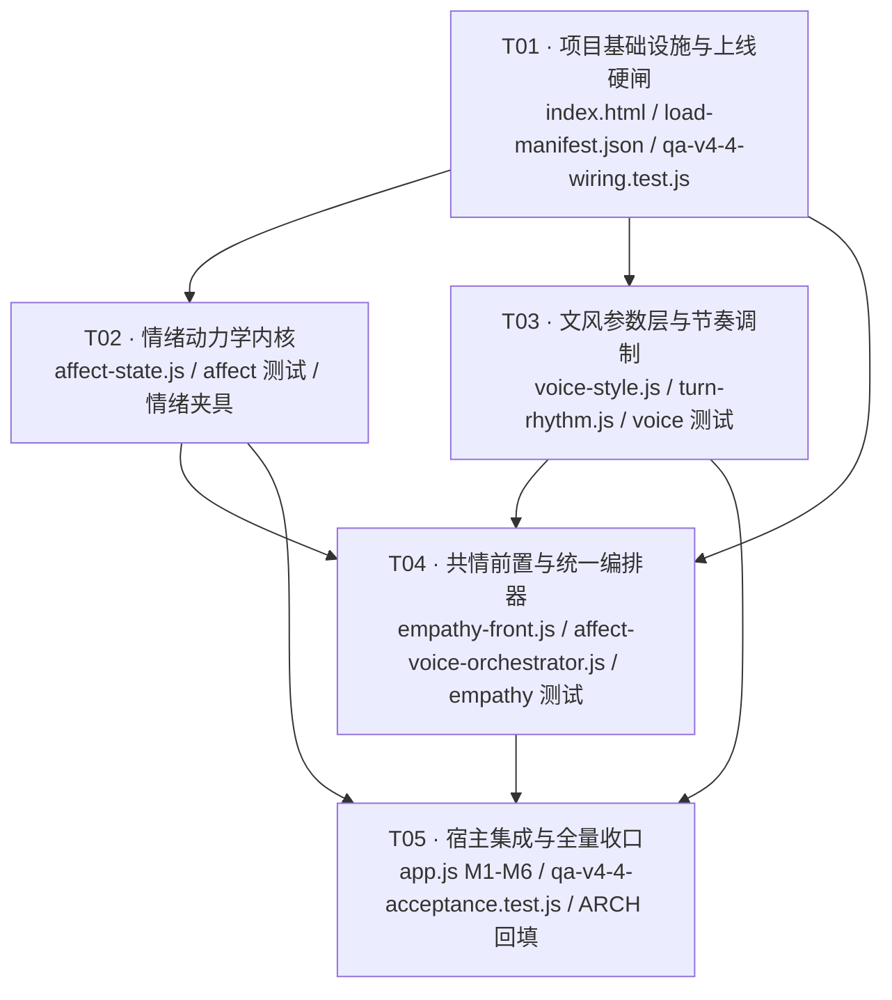

# ARCH · 心屿（Xinyu）v4.4 · 情感情绪驱动的真人对话系统（Affect-Voice）

| 项 | 值 |
|------|------|
| **版本** | v4.4（增量架构，基于 v4.3 已交付态，全量 527/527 绿） |
| **文档语言** | 中文 |
| **Programming Language** | 原生 JS（ES5/ES2015 兼容写法，IIFE 零依赖） |
| **架构师** | 高见远 |
| **产品经理** | 许清楚（`docs/PRD-xinyu-v4-4-affect-voice.md`） |
| **主理人** | 齐活林（Q1–Q11 已拍板） |
| **上游输入** | PRD v4.4 + 主理人 Q1–Q11 裁定 |
| **配套图** | `docs/class-diagram-v4-4-affect-voice.mermaid`、`docs/sequence-diagram-v4-4-affect-voice.mermaid` |
| **铁律** | 冻结线四文件字节零变 · 隐私零上报 · 零新增 npm 依赖 · 小暖（Xiaonuan）不更名 · 全部 IIFE 可在 Node 中 require |

---

## 0 · 主理人裁定遵循表（Q1–Q11 逐条落点）

本架构不对 Q1–Q11 做任何再议，只做工程落地。每条裁定的落点如下：

| 裁定 | 架构落点 |
|---|---|
| **Q1** ReplyTexture 不接线，v4.4 全量接管并吸收四维 | §4.1（不加载、零字节改动）、§4.7（四维吸收对照表）、§10（防双加工）、T01 的 `load-manifest.json` 中登记为 `knownUnwired` |
| **Q2** 8 维向量 + 主导态 + 动量 | §6 全节 |
| **Q3** α = 0.45，可调常量 | §6.4（`ALPHA = 0.45` 单点常量 + `ALPHA_TONE` 预留表） |
| **Q4** 强事件阈值 0.80，24h ≤ 2 次 | §6.6（`STRONG_THRESHOLD = 0.80` / `STRONG_MAX_24H = 2`，滚动 24h 时间戳数组） |
| **Q5** 空闲衰减纳入 P0，统一单一真源 | 挂载点 **M3**（app.js:735-738）+ 挂载点 **M6**（app.js:4926-4933，本架构新发现的第五处 `moodTick` 直写） |
| **Q6** emotion-core.js 零字节改动 | §5.1 关系说明 + 降级说明写在 `affect-state.js` 文件头注释（不写在 emotion-core.js） |
| **Q7** 文风改写保守档 | §7.3（允许集 / 禁止集 / **反问率单向约束**） |
| **Q8** 豁免体积闸，单模块 ≤ ~20 KB，>25 KB 需复核 | §15 + 闸 **G-6**（机器断言 20480 B 软闸 / 25600 B 硬闸） |
| **Q9** 模块上线 CI 级硬闸 | §13 全节（G-1…G-6 六道闸） |
| **Q10** `S.relationship.stage` 归一化读入，不改默认值 | §6.8 `normalizeStage()`；app.js:412 的 `'stranger'` **零改动** |
| **Q11** 主动消息分支 P1，P0 只管用户对话轮 | 挂载点表 P1 行（app.js:2264），本轮不实施 |

---

## 1 · 架构师独立复核：三项 PM 未覆盖的硬事实

我对 PRD 与源码做了逐行交叉复核。**三处断裂（F1/F2/F3）与新发现 A–E 全部属实**，冻结线字节逐位一致。在此基础上，我新发现三项会**直接改变 v4.4 设计**的硬事实：

### 🔴 F4 · `ue.type` 的真实枚举是 7 类，ReplyTexture 与 texture.js 的键只对上 3 类

- 引擎真源 `engine.js:1179`：`UE_POLARITY = { joy: 1, affection: 0.9, neutral: 0, tired: -0.35, anxious: -0.65, sad: -0.85, angry: -0.9 }`
  → **`ue.type` 的真实取值域是 `{joy, affection, neutral, tired, anxious, sad, angry}`（7 类）**。
- `reply-texture-orchestrator.js` 的 `MIRROR` 表键 = `{sad, tired, lonely, anxious, happy, excited}` → 与真实域**仅 3 类重叠**（`sad`/`tired`/`anxious`）；`happy`/`excited`/`lonely` **永不出现**。
- `texture.js:18` 的 `UE_TIC` 键 = `{tired, sad, happy, excited, anxious, lonely}` → **同样只对上 3 类**。

**结论**：即使当年把 ReplyTexture 接了线，其 `mirror` 也只在 3/7 的用户情绪类型上生效——这是"幽灵模块"之下的**第二层死代码**。
**设计后果**：`empathy-front.js` 的共情句池**必须以引擎真实 7 类为键**，并在模块内置一份 `UE_POL` 只读副本 + 单测断言与 `engine.js:1179` 一致（防未来漂移）。**这是"吸收 mirror 维度"时必须一并修正的一处。**

### 🔴 F5 · `result.textured` 是"分支标记"而非"加工事实"，无条件避让会让新用户 100% 不生效

- `app.js:1445` 在本地引擎分支**无条件**置 `textured: true`。
- 但 `texture.js:30 textureAllow()` 有 6 道门：`lv ≥ 2` / 非首日 30 轮内 / 非危机 / 非负向高唤醒 / 当日配额 < 6 / 总开关。**任一门不满足 → texture 一个字都没改**，而 `textured` 仍为 `true`。
- 而云端分支（`app.js:1394`）与端侧分支（`app.js:1406`）**根本不设 `textured`** → `!!result.textured === false`。

**结论**：`ctx.textured` 既会**过度避让**（lv0–lv1 新用户、负向高唤醒、配额用尽时 texture 实际未加工，v4.4 却让位），又会**漏标**（cloud/local 分支本就不含 texture 微行为，反而不避让）。
**设计后果**：v4.4 **不得把 `ctx.textured` 作为唯一判据**，改为「分支标记 ∧ 文本级微行为探测」双条件（§10.1）。

### 🟡 F6 · `ctx.isContinuation` 从未被传入，`continuity` 维度在 app.js 侧本就是死参数

`app.js:1521` 传入的 ctx 只有 `{ue, mood, intent, textured}`；而 `reply-texture-orchestrator.js:180` 的 `continuity()` 首行即 `if (!ctx || !ctx.isContinuation) return text;`。
**设计后果**：v4.4 吸收 `continuity` 维度时，改由**显式可测的** `ctx.turnIdx` / `ctx.totalTurns` 驱动（app.js 循环变量 `i` 与 `result.replies.length` 现成可得），不再依赖一个永远为 undefined 的布尔位。

### 复核小结：v4.4 面对的是 **F0 + F1 + F2 + F3 + F4 + F5 + F6**

| 编号 | 断裂 | 处置位置 |
|---|---|---|
| **F0** | L3 编排层未接线（浏览器内死代码） | Q1 裁定：不接线；v4.4 五模块**必须**进 index.html（闸 G-1） |
| **F1** | 情绪瞬变、无惯性 | T02 `affect-state.js` |
| **F2** | 情绪只驱动表情/TTS，不驱动语言 | T03/T04 `voice-style` + `turn-rhythm` + `empathy-front` |
| **F3** | 编排器不消费 moodState / relationshipStage | T04 `affect-voice-orchestrator.js` |
| **F4** | ue.type 枚举错配（3/7 命中） | T04 `empathy-front.js` 以真实 7 类为键 |
| **F5** | `textured` 过度避让 / 漏标 | §10.1 双条件判据 |
| **F6** | `isContinuation` 死参数 | T04 改用 `turnIdx`/`totalTurns` |

---

## 2 · 实现方案（Implementation Approach）

### 2.1 核心技术难点

| # | 难点 | 本次解法 |
|---|---|---|
| **D1** | **惯性 vs 当轮可感知**：阻尼插值必然压低单轮强度增量，若照搬线性调制，小暖的强度会长期停在 0.3–0.5，文风几乎不偏离 neutral 基线 → **AC 全绿但盲评不达标** | ① 文风强度与情绪强度**解耦**：`styleIntensity = clamp01(STYLE_FLOOR + (1 − STYLE_FLOOR) × intensity)`，`STYLE_FLOOR = 0.35`（§7.2）；② 平静起跳加速 `START_BOOST`（§6.7）；③ 优先调 `L1_MAX`（每轮最大变化量，语义直白）而非 `ALPHA` |
| **D2** | **跃变闸的可证明性**：AC-1①（Δintensity ≤ 0.25）与 AC-2①（向量 L1 ≤ 0.35）是两把不同的锁，各自 clamp 会互相打架 | 证明：**Σ=1 的两个分布之间，`|Δneutral| ≤ L1(diff)/2`**，故只要锁住 L1 步长 ≤ 0.35，就**自动有** Δintensity ≤ 0.175 ≤ 0.25（§6.5 给出证明）。因此只需一道 **L1 步长缩放闸**，`MAX_STEP` 退化为第二道冗余保险 |
| **D3** | **双加工**：本地引擎分支已含 texture 微行为，再叠文风即"油腻"；但无条件避让又会让 v4.4 在新用户身上完全失效（F5） | 三层：① 分支标记 ∧ 文本级 `hasMicroBehavior()` 双条件；② 维度级互斥（共情 vs bondFrag）；③ 幂等闸 + trace（§10） |
| **D4** | **冻结线内不可改**：回复生成主体 `Engine.reply()` 在冻结的 engine.js 内；sw.js 亦冻结 | 全部增强作用于**其输出之后**（文风）与**情绪推进之外**（affect-state 旁路），不进 `engine.files.json.order`，不改 sw.js（§13.3 上报 Q9 的 sw 分支冲突） |
| **D5** | **幽灵模块**：写了、测了、没接线 → 线上恒不生效 | 闸 **G-2 反向封闭闸**：仓库根目录任何未被申报的 `.js` 一律转红（§13.2） |
| **D6** | **降级等价**：任一新模块缺席/抛错必须逐字等同 v4.3 | 新模块**零 DOM、零 localStorage**（S 由 app.js 传入/回写），纯函数 + 全路径 try/catch（§14） |

### 2.2 技术选型

沿用 v4.1–v4.3 已验证的同构范式，**零新增依赖、零框架**：

| 选型 | 理由 |
|---|---|
| **原生 JS IIFE + 双挂载**（`Engine.use(name, api)` + `window.Xxx` + `module.exports`） | 与 `emotion-core.js` / `bond-memory.js` 逐字同构；`module.exports` 使 Node 侧可直接 `require` 做单测（AC-1…AC-8 的前提） |
| **纯函数式、不写外部 state**（回写责任在 app.js） | 沿用 `herReply` 既有范式；`S.affect` 与 `S.moodState` 一律由 app.js 落盘 |
| **ES5 兼容写法**（`var`、无箭头、无解构、无 `class`） | 与 `emotion-core.js`（`var` + `function`）保持一致；index.html 无构建步骤，直接 script 加载 |
| **不用 AST / 不用正则引擎库** | 文本层改写只用原生 `String` + 简单正则，与 `texture.js` 同口径 |
| **确定性随机**：`rng` 由调用方注入 | AC-1③（同序列不同 rng → 输出完全一致）的硬性前提；与 `reply-texture-orchestrator.js` 的 `opts.rng` 同范式 |

### 2.3 架构模式

**管道 + 参数变换（Pipeline + Profile Transform）**，单向数据流，无回环：

```
[情绪侧 · 每轮一次]
  em.inferMoodEvent(text, intent, ue)   ← emotion-core 仍是事件推断的单一真源（零改动）
        ↓ evt
  AffectState.advance(S.affect, evt, ctx) → S.affect（8 维向量 + 主导态 + 动量）
        ↓ toMoodState()
  S.moodState { key, intensity, since, source, blend, prev }   ← 兼容结构
        ↓
  em.moodToExpr(...) / SenseCore.moodToTTS(...)   ← 既有消费者零改动

[文风侧 · 每条气泡一次]
  VoiceStyle.profileFor(dom, intensity, stage, blend)  → profile0（参数）
        ↓
  TurnRhythm.modulate(profile0, ctx)                → profile1（纯参数变换，不碰文本）
        ↓
  EmpathyFront.front(text, ctx)                    → text'（首句共情）
        ↓
  VoiceStyle.applyStyle(text', profile1, rng, opts)→ text''（唯一的形式层改写器）
        ↓
  PersonaCore.safetyGuard(text'')（app.js 既有，位于之后）→ 最终文本
```

**关键分层决策**：`turn-rhythm` 是**参数变换器**，`voice-style` 是**唯一的文本改写器**（除 `empathy-front` 的首句前置）。理由见 §4.4。

---

## 3 · 文件清单（File List）

| 文件 | 动作 | 预估 | 在 `SIZE_BUDGET.mods` 内 |
|---|---|---|---|
| **`affect-state.js`** | **新建** · 情绪动力学内核 | ~9 KB | 否（沿用 v4/候选 E/F 先例） |
| **`voice-style.js`** | **新建** · 8×10 VoiceProfile + 形式层改写 | ~13 KB | 否 |
| **`empathy-front.js`** | **新建** · 共情前置分档 | ~9 KB | 否 |
| **`turn-rhythm.js`** | **新建** · 话轮节奏（参数层） | ~5 KB | 否 |
| **`affect-voice-orchestrator.js`** | **新建** · 统一编排门面 | ~8 KB | 否 |
| `index.html` | 改 · 5 行 script + 注释（:834 之后、:835 之前） | ~0.7 KB | 否 |
| `app.js` | 改 · 6 处挂载（M1–M6） | ~2.5 KB | 否 |
| **`test/load-manifest.json`** | **新建** · 装载清单真源（Q9） | ~1.5 KB | 否（test 不计） |
| **`test/qa-v4-4-wiring.test.js`** | **新建** · Q9 六道闸 + AC-9 | ~8 KB | 否 |
| `test/fixtures/v4-4-affect-cases.json` | **新建** · 情绪序列夹具（AC-1/AC-2） | ~4 KB | 否 |
| `test/qa-v4-4-affect.test.js` | **新建** | ~10 KB | 否 |
| `test/qa-v4-4-voice.test.js` | **新建** | ~10 KB | 否 |
| `test/qa-v4-4-empathy.test.js` | **新建** | ~8 KB | 否 |
| `test/qa-v4-4-acceptance.test.js` | **新建** · AC-1…AC-10 收口 | ~14 KB | 否 |
| `engine.js` / `sw.js` / `memory.js` / `test/baseline.js` | **零触碰**（冻结线） | 0 B | — |
| `emotion-core.js` | **零字节改动**（Q6） | 0 B | 否 |
| `reply-texture-orchestrator.js` | **零字节改动 + 不接线**（Q1） | 0 B | 否 |
| `dialogue-core.js` | **P0 零改动**（R17 属 P1） | 0 B | 否 |
| `bond-memory.js` / `proactivity-core.js` / `sense-core.js` / `persona-core.js` / `texture.js` | **零改动**（只读消费） | 0 B | 否 |
| `package.json` / `package-lock.json` | **零改动** | 0 B | — |
| `test/wiring-scan.js` | **零改动**（复用 `htmlScripts()` / `swManifest()` / `loadManifest()`） | 0 B | 否 |

> `test/wiring-scan.js` 必须零改动：它被 12+ 测试 `require`，加载期任何 throw 会连锁染红全套（v19 既有纪律）。

---

## 4 · 模块划分与职责

### 4.1 五个新模块（PM 建议 5 个 —— 我**保留 5 个**，但重定义其中 1 个的边界）

| 文件 | 职责 | 核心 API | 优先级 |
|---|---|---|---|
| **`affect-state.js`** | **情绪动力学内核**（特征 1/5/6）。8 维向量 + 动量；L1 步长闸；强事件突破通道（0.80 / 24h≤2）；镜像阻尼 + STABILIZE；时间衰减；关系阶段归一化；向下兼容 `moodState` 输出 | `advance(prev, evt, ctx)` · `decay(state, dt)` · `toMoodState(affect)` · `readState(S)` · `normalizeStage(S)` · `l1(a, b)` · `NEUTRAL_AFFECT` · `CONST` | P0 |
| **`voice-style.js`** | **情绪-文风耦合 + 唯一的形式层改写器**（特征 2）。8×10 `VoiceProfile` 参数表；强度/stage/余韵插值；保守档形式改写（标点/语气词/句长/停顿/称呼） | `profileFor(dom, intensity, stage, blend)` · `applyStyle(text, profile, rng, opts)` · `splitSentences(text)` · `PROFILES` · `CONST` | P0 |
| **`empathy-front.js`** | **共情前置**（特征 3/5）。以**引擎真实 7 类 ue.type × L0–L3** 分档（F4 修正）；负向首句强制共情；STABILIZE 托底档；与 bondFrag 互斥；模块内 LRU 防复读 | `shouldFront(ctx)` · `front(text, ctx)` · `EMPATHY_POOL` · `CONST` | P0 |
| **`turn-rhythm.js`** | **话轮节奏调制**（特征 4）——**纯参数变换器，不碰文本** | `modulate(profile, ctx)` · `CONST` | P0 |
| **`affect-voice-orchestrator.js`** | **统一编排门面**（F0/F3 收口 + 特征 6 输出侧）。唯一对 app.js 暴露的入口；五步管道；抗双加工；总开关与降级；trace | `orchestrate(text, {state, ctx, rng})` · `setConfig(c)` · `getConfig()` · `describe(trace)` | P0 |

### 4.2 我**未**增删模块数的理由

PM 的 5 模块划分在职责边界上是正交的（动力学 / 参数+改写 / 内容前置 / 节奏 / 编排），与 v4.3 的 `bond-memory` + `proactivity-core` 两模块粒度一致，且每个模块都能独立单测、独立降级。拆成 6 个会把 `voice-style` 的参数表与改写器切开（二者共享 `splitSentences` 与封闭词池，切开必然重复）；合成 4 个会让 `empathy-front` 的句池（~3.4 KB）混进编排器，破坏"降级时按维度跳过"的能力。**故保持 5 个。**

### 4.3 我对 PM 方案的**一处边界重定义**：`turn-rhythm` 由"文本改写"降为"参数调制"

PM 的 `turn-rhythm.js` 定义为「低情绪→短句/多停顿、高情绪→长句/感叹」的**文本层**操作（预估 7 KB）。我改为**参数层**（预估 5 KB），理由三条：

1. **消除双分句与顺序歧义**：若 `turn-rhythm` 直接改文本（拆长句/注入换行），`voice-style.applyStyle` 又改一次（句长/停顿/省略号），则**同一个文本被两遍分句、两遍改写**，且两者顺序不可交换（先拆后插 vs 先插后拆结果不同）→ 不可复现、不可证明。改为参数层后，**全链路只有 `applyStyle` 一个改写器**，顺序唯一。
2. **AC-6 可在参数层确定性断言**：`modulate()` 是纯函数、无随机，可直接断言 `profile1.lenMean ≤ 14` / `rhetoricalRate ≤ 0.10` / `topicInitRate ≤ 0.08`，无需统计 30 条样本的均值——**从"统计性验收"降级为"确定性验收"**，这正是 wiring-scan 那套"不验证算得对不对，验证装没装上"的方法学在验收侧的同一取向。
3. **体积更小、更易降级**：纯参数变换无字符串操作，异常面几乎为零。

> 文本层的"停顿注入/长句拆分"并未消失，只是**归属 `voice-style.applyStyle`**，由 `profile.pauseRate` 与 `profile.lenMean` 驱动。

### 4.4 与既有模块的关系（职责边界表）

| 既有模块 | 改动 | 与 v4.4 的关系 |
|---|---|---|
| **`emotion-core.js`** | **零字节** | `inferMoodEvent` **仍是事件推断的单一真源**（v4.4 消费其输出，不替代）；`moodTick` / `decay` **降级为兼容路径**（`AffectState` 缺席时启用）；`moodToExpr` / `currentMoodState` **继续是表情与 TTS 的唯一映射**（v4.4 只产出兼容的 `moodState` 结构）。降级说明写在 `affect-state.js` 文件头（Q6=A），emotion-core.js 一个字节不动 |
| **`reply-texture-orchestrator.js`** | **零字节 + 不接线** | 见 §4.7 四维吸收对照表 |
| **`dialogue-core.js`** | P0 零改动 | `dialogueWeave` 在 AffectVoice **之前**执行（LRU 存未改写原句，去重口径与 v4.3 逐字一致）；`situationRecall` / `consistencyGuard` 保持占位（R17 属 P1） |
| **`persona-core.js`** | 零改动 | `safetyGuard` 在 AffectVoice **之后**执行，仍是最终护栏；v4.4 只读 `S.persona.tone` 做 α 分化（P1 R19） |
| **`bond-memory.js`** | 零改动 | `bondRecall` 产出 `bondFrag.echo` 经 `ctx.hasBondEcho` 传入 → `empathy-front` 互斥（AC-4③）。affect 不写 `S.bond` |
| **`proactivity-core.js`** | 零改动 | `relationshipLevel()` 派生的 `S.relationship.stage`（`'L0'`…`'L3'`）经 `AffectState.normalizeStage()` 归一化读入（Q10）。主动消息分支 P1，本轮不纳管（Q11） |
| **`sense-core.js`** | 零改动 | `moodToTTS` 的 `MOOD_TTS` 表 **8 键齐备**（joy/anger/sad/coquettish/jealous/longing/peaceful/neutral，已逐行核对 `sense-core.js:169-177`）→ `toMoodState()` 的 8 态输出**全部有档位可落**，零改动成立 |
| **`texture.js`（冻结线外，但在 SIZE_BUDGET 内）** | 零改动 | 其 `UE_TIC` 键错配（F4）**本轮不修**（在预算内且非 v4.4 范围），仅登记为已知问题 |
| **`engine.js`（冻结）** | 零改动 | `Engine.reply()` 是回复生成主体；v4.4 只消费其输出 `result.replies` / `result.textured` / `result.ue` / `result.intent` |

### 4.5 Q1 落地：ReplyTexture 四维吸收对照表

| ReplyTexture 维度 | 原实现 | v4.4 处置 | 落点 |
|---|---|---|---|
| **`mirror`**（情绪镜像） | `MIRROR` 表按 ue.type 回声，门槛 `0.30·warmth`，`textured` 时跳过 | **重新实现并修正键集**：改以引擎真实 7 类 ue.type 为键，按 `L0–L3` 分档、按 `ue.polarity`/`intensity` 触发；STABILIZE 时切换为托底档 | `empathy-front.js` |
| **`pacing`**（节奏分段） | 纯长度阈值 `text.length < 70` + 单次换行，与情绪无关 | **升级为情绪驱动**：由 `profile.lenMean` + `profile.pauseRate` 驱动，且受 `intensity` / `turnIdx` / `totalTurns` 调制 | `turn-rhythm.js`（参数）+ `voice-style.applyStyle`（文本） |
| **`recall`**（记忆引用） | 引用 `dayLife.trace` / `S.mem` 末条 | **不实现** —— v4.3 `bondFrag` 已独占该维度（app.js:1541），再实现即双呼应 | — |
| **`continuity`**（话题连贯） | 依赖 `ctx.isContinuation`（**app.js 从未传入，恒死**，F6） | **改用显式可测的 `ctx.turnIdx` / `ctx.totalTurns`** 驱动多气泡承接与节奏分配 | `turn-rhythm.js` + app.js 挂载点 M5 |
| **`hasMicro()`**（防叠加第一道闸） | 检测句首犹豫词 / 波浪号 / 省略号 | **吸收并扩展**（增加 texture 的 `HES` 前缀词），作为 §10.1 双条件判据的右半 | `affect-voice-orchestrator.js` |
| **`getParam(state,key,fallback)`** | 消费 `S.persona.warmth/proactivity/whitespace`，回退 cfg | **吸收同范式**，供 P2 R24 用户可调参数 | 各模块 `CONST` |

### 4.6 全局挂载名（上线闸 G-1 的断言对象）

| 文件 | `window` 全局 | `Engine.use` 名 |
|---|---|---|
| `affect-state.js` | `window.AffectState` | `affectState` |
| `voice-style.js` | `window.VoiceStyle` | `voiceStyle` |
| `empathy-front.js` | `window.EmpathyFront` | `empathyFront` |
| `turn-rhythm.js` | `window.TurnRhythm` | `turnRhythm` |
| `affect-voice-orchestrator.js` | `window.AffectVoice` | `affectVoice` |

### 4.7 index.html 接线（**F0 的唯一修复手段，Q1 硬要求**）

插入位置：`proactivity-core.js`（:834）**之后**、`app.js`（:835）**之前**；顺序硬约束：

```html
<!-- v4.4（Affect-Voice）· 情绪动力学 + 文风耦合 + 共情前置 + 话轮节奏 + 统一编排。
     须先于 app.js（app.js 经 window.AffectState / window.AffectVoice 消费）。
     顺序硬约束：affect-voice-orchestrator.js 必须最后（它依赖其余四者的 window 全局）。
     零上报、零新增依赖；缺任一文件则该层不生效，回复逐字等同 v4.3，不白屏。
     上线闸：test/load-manifest.json 为唯一真源，test/qa-v4-4-wiring.test.js 逐条断言。 -->
<script src="affect-state.js"></script>
<script src="voice-style.js"></script>
<script src="empathy-front.js"></script>
<script src="turn-rhythm.js"></script>
<script src="affect-voice-orchestrator.js"></script>
```

> ⚠️ **严禁重蹈"幽灵模块"覆辙**：这 5 行是本版 F0 的**唯一修复手段**，缺一行即等于 v4.4 未上线。闸 G-1 逐条断言，闸 G-4 断言顺序。

---

## 5 · 数据结构与接口（类图）

类图见 `docs/class-diagram-v4-4-affect-voice.mermaid`。以下为文字口径的结构定义。

### 5.1 `S.affect`（新增字段，绝不删改 `S.moodState`）

```js
S.affect = {
  vec: { neutral: 1, joy: 0, anger: 0, sad: 0,
         coquettish: 0, jealous: 0, longing: 0, peaceful: 0 },  // Σ = 1，各分量 ≥ 0
  dom: 'neutral',         // 主导态：7 个非 neutral 分量中的 argmax
  intensity: 0,           // = 1 − vec.neutral（偏离平静的总量），0..1
  momentum: 0,            // 上一轮 Δintensity（带符号），惯性项
  since: 0,               // 当前 dom 确立的时间戳
  source: 'init',         // 'userEvent' | 'decay' | 'init' | 'stabilize' | 'transition'
  strongAt: [],           // 滚动 24h 内的强突破时间戳数组（长度 ≤ 2）
  day: 'YYYY-M-D',        // 日窗（仅用于观测与 P1 的 affectCarry）
  _prevDom: 'neutral',    // 上一轮 dom（供极性冲突检测与 toMoodState.prev）
  _transition: null       // 过渡态 { to: 'joy' }（极性冲突时置位，到达 peaceful/neutral 后清除）
};
```

### 5.2 `toMoodState(affect)` 输出（兼容 v4.1 契约）

```js
{
  key: affect.dom,                    // 8 态之一 → moodToExpr / moodToTTS 直接消费
  intensity: +affect.intensity.toFixed(3),
  since: affect.since,
  source: affect.source,
  blend: { /* 7 个非 neutral 分量按 intensity 归一化，供余韵混合 */ },
  prev:  affect._prevDom              // 供 guard 做极性冲突检测
}
```

**兼容性论证（已逐行核对）**：
- `emotion-core.js:74 moodToExpr` 只读 `.key` → `EXPR_OF[key]`。8 键全覆盖。
- `sense-core.js:179 moodToTTS` 只读 `.key` → `MOOD_TTS[key]`。8 键全覆盖（含 `neutral`）。
- `emotion-core.js:153 currentMoodState` 经 `_cloneState` 只拷 `{key,intensity,since,source}` → `blend`/`prev` 被自然丢弃。
- `dialogue-core.js:84 dialogueWeave` 只读 ctx 传递，不解构 → 无感。
→ **四个既有消费者对扩展字段零感知，全部零改动成立。**

### 5.3 核心 API 签名

```js
// ── affect-state.js ───────────────────────────────────────────
AffectState.advance(prev, evt, ctx) -> affect
//   prev : affect | null（null → NEUTRAL_AFFECT）
//   evt  : { type: 8态之一, intensity: 0..1 } | null（来自 em.inferMoodEvent，零改动）
//   ctx  : { ue, S, now, stage }
//          ue    : result.ue（可能为 undefined —— 云端分支不产 ue，必须容错）
//          S     : 只读（persona.tone / relationship.stage / bond.warmth）
//          now   : 时间戳（可注入，保证单测确定性）
//          stage : 已归一化（缺省由 normalizeStage(S) 兜底）
//   返回 : 新 affect（不可变，绝不原地改 prev）；任一异常 → 返回 prev || NEUTRAL_AFFECT

AffectState.decay(state, dt) -> affect
//   dt : 毫秒差。drop = min(intensity, dt/60000 × DECAY_PER_MIN)
//        各非 neutral 分量按 (1 − drop/intensity) 等比收缩，缩回 neutral
//   dt ≤ 0 → 原样返回新对象

AffectState.toMoodState(affect) -> moodState（见 §5.2）
AffectState.readState(S) -> affect          // 老档无 S.affect → NEUTRAL_AFFECT 兜底
AffectState.normalizeStage(S) -> 'L0'|'L1'|'L2'|'L3'
//   'stranger' | undefined | null | '' | 'L0' → 'L0'（Q10：归一化读入，不改默认值）
//   'L1'|'L2'|'L3' → 原值；未知值 → 'L0'
AffectState.l1(a, b) -> number              // 8 维向量 L1 距离，供单测与闸断言
AffectState.CONST -> { ALPHA, ALPHA_STRONG, L1_MAX, L1_MAX_STRONG, MAX_STEP,
                       MAX_STEP_STRONG, STRONG_THRESHOLD, STRONG_MAX_24H,
                       MIRROR_GAIN, STABILIZE_POL, STABILIZE_INT, STABILIZE_CAP,
                       DECAY_PER_MIN, DOM_EPS, START_BOOST, START_BOOST_ALPHA,
                       STAGE_GAIN, UE_POL, POLARITY, ALPHA_TONE }

// ── voice-style.js ────────────────────────────────────────────
VoiceStyle.profileFor(dom, intensity, stage, blend) -> profile
//   blend : toMoodState().blend（非 neutral 分量归一化后的分布），可为 null
//   返回  : 10 维 profile（见 §7.1）
VoiceStyle.applyStyle(text, profile, rng, opts) -> { text, trace }
//   opts  : { textured: bool, skipDims: ['particles','endPunct'] , maxDeltaLen: 12 }
//   返回  : { text, trace }（trace 供 AC-10 观测与盲评）
VoiceStyle.splitSentences(text) -> [句子]
VoiceStyle.PROFILES -> 8 态基线表（只读）
VoiceStyle.CONST -> { STYLE_FLOOR, LEN_MIN, LEN_MAX, PARTICLE_POOL, ADDRESS_POOL, END_PUNCT }

// ── empathy-front.js ──────────────────────────────────────────
EmpathyFront.shouldFront(ctx) -> bool
//   ctx : { ue, stage, hasBondEcho, stabilize, textured, turnIdx, totalTurns }
EmpathyFront.front(text, ctx, rng) -> { text, used: string|null }
//   前置一句共情句；命中 LRU 则换条；hasBondEcho 为真则跳过
EmpathyFront.EMPATHY_POOL -> 分层句池（只读）
EmpathyFront.CONST -> { TRIGGER_POL, MIN_INTENSITY, STABILIZE_POOL, LRU_MAX }

// ── turn-rhythm.js ────────────────────────────────────────────
TurnRhythm.modulate(profile, ctx) -> profile
//   ctx : { dom, intensity, stage, turnIdx, totalTurns, uePolarity }
//   纯参数变换，无随机、无字符串操作；任一异常 → 返回入参 profile
TurnRhythm.CONST -> { LOW_SET, HIGH_SET, RAMP_MIN, LEN_SCALE, PAUSE_DELTA, ... }

// ── affect-voice-orchestrator.js ──────────────────────────────
AffectVoice.orchestrate(text, opts) -> string
//   opts : { state, ctx, rng }
//     state : 只读 S（读 S.moodState / S.affect / S.persona / S.relationship）
//     ctx   : { ue, mood, intent, textured, moodState, stage,
//               turnIdx, totalTurns, hasBondEcho, stabilize }
//   任一环节异常 → 该步跳过；全失败 → 返回入参 text（逐字）
AffectVoice.setConfig(c) / getConfig() -> cfg
AffectVoice.describe(trace) -> string      // 调试面板（P1 R22）与盲评取证
```

---

## 6 · 8 维情绪向量设计（Q2 / Q3 / Q4 落地）

### 6.1 维度定义

| 维 | 含义 | 说明 |
|---|---|---|
| `neutral` | 平静 | **特殊维**：不参与 `dom` 竞争；`intensity := 1 − vec.neutral` |
| `joy` | 喜 | |
| `anger` | 怒 | |
| `sad` | 哀（心疼你） | |
| `coquettish` | 娇（撒娇） | |
| `jealous` | 醋（吃醋） | |
| `longing` | 念（想念） | |
| `peaceful` | 安（安心） | |

与 `emotion-core.js:36 EMOTIONS` 的 8 键**逐一同名**（neutral + 7 态），保证 `moodToExpr` / `moodToTTS` 零改动。

**归一化**：`Σ vec = 1`，各分量 ≥ 0。采用**单纯形（simplex）表示**——这是使"混合情绪"与"强度"共用同一套数学的关键：`intensity` 就是偏离平静的总质量，无需另设标量。

### 6.2 目标向量 `target(evt, ue, stage)`

```
I := clamp01(evt.intensity)                       // 事件强度
target := { neutral: 1 − I, [evt.type]: I, 其余: 0 }     // one-hot 与 neutral 的凸组合，Σ = 1
```

无事件（`evt === null`）时：`target := { neutral: 1, 其余: 0 }`（自然回归平静）。

**用户情绪冲量（特征 5 · 镜像阻尼）**：把 `ue` 映射为附加目标向量并按 `MIRROR_GAIN × STAGE_GAIN[stage]` 混入，然后重新归一化：

```
UE_MAP = { joy: 'joy', affection: 'peaceful', neutral: 'neutral',
           tired: 'peaceful', anxious: 'peaceful', sad: 'sad', angry: 'anger' }
g := MIRROR_GAIN(0.45) × STAGE_GAIN[stage]        // STAGE_GAIN = { L0:0.6, L1:0.8, L2:1.0, L3:1.15 }
k := clamp01(ue.intensity × ue.confidence)         // 用户情绪的确信度权重
target := normalize( target + g × k × onehot(UE_MAP[ue.type]) )
```

**STABILIZE 门控（US-3「稳住你」）** —— 优先级**高于**上式：

```
if (ue && ue.polarity ≤ −0.7 && ue.intensity ≥ 0.7) {
  target   := { neutral: 1 − STABILIZE_CAP, peaceful: STABILIZE_CAP }   // STABILIZE_CAP = 0.40
  α_eff    := ALPHA_STRONG (0.75)     // 快速稳住
  L1_cap   := L1_MAX_STRONG (0.60)
  source   := 'stabilize'
  // 若 prevDom === 'sad' → 强制 dom := 'peaceful'（保护性强制切换，不计入 strongCount）
}
```

AC-5①（`intensity ≤ 0.50`）由 `STABILIZE_CAP = 0.40` 保证；AC-5③（普通负向显著高于崩溃场景 ≥ 0.10）由普通负向的 target 强度（0.55–0.70）与 0.40 的差值保证。

### 6.3 阻尼插值 + 步长闸（核心公式）

```
d_raw := (target − vec) × α_eff                   // 待施加的向量增量
L1d   := Σ_k |d_raw[k]|

// ① L1 步长缩放闸（主闸）：把单轮位移压到 ≤ L1_cap
if (L1d > L1_cap)   d := d_raw × (L1_cap / L1d)
else                d := d_raw

// ② 强度限幅（冗余保险，正常情况下永不触发，见 §6.5 证明）
Δi := −d[neutral]                                  // intensity 的增量
if (|Δi| > MAX_STEP_cap)  d := d × (MAX_STEP_cap / |Δi|)

vec' := vec + d
vec' := clampNonNeg(vec'); vec' := normalize(vec')   // 数值兜底，保证 Σ = 1
```

### 6.4 常量（**全部集中在 `affect-state.js` 顶部单一常量区，单点可调**）

| 常量 | 值 | 依据 / 语义 |
|---|---|---|
| `ALPHA` | **0.45** | **Q3 裁定**；基础阻尼系数（每轮向目标逼近 45%） |
| `ALPHA_STRONG` | 0.75 | 强事件突破时提速（PRD R2 / Q3 选项 B） |
| `ALPHA_TONE` | `{}`（P1 R19 填） | tone 分化预留：`{gentle:0.40, playful:0.55, tsundere:0.35, clingy:0.60}`；缺省回落 `ALPHA` |
| `L1_MAX` | **0.35** | AC-2①：相邻两轮向量 L1 距离 ≤ 0.35 |
| `L1_MAX_STRONG` | 0.60 | AC-2②：强突破轮次 L1 ≤ 0.60 |
| `MAX_STEP` | 0.25 | AC-1①：单轮 Δintensity ≤ 0.25（**冗余保险**） |
| `MAX_STEP_STRONG` | 0.45 | AC-1②：强事件 Δintensity ≤ 0.45 |
| `STRONG_THRESHOLD` | **0.80** | **Q4 裁定**：强事件阈值 |
| `STRONG_MAX_24H` | **2** | **Q4 裁定**：滚动 24h 内强突破上限 |
| `MIRROR_GAIN` | 0.45 | 特征 5：用户情绪冲量增益 |
| `STABILIZE_POL` / `STABILIZE_INT` | −0.7 / 0.7 | STABILIZE 触发门 |
| `STABILIZE_CAP` | 0.40 | STABILIZE 时的目标强度上限（保 AC-5① 的 0.50） |
| `DECAY_PER_MIN` | 0.06 | 与 `emotion-core.js:132` 同速率（每 60s 回落 0.06），语义一致 |
| `DOM_EPS` | 0.08 | intensity < 0.08 → dom = 'neutral' |
| `START_BOOST` / `START_BOOST_ALPHA` | 0.25 / 0.70 | 见 §6.7（D1 缓解：平静起跳加速） |
| `STAGE_GAIN` | `{L0:0.6, L1:0.8, L2:1.0, L3:1.15}` | 镜像强度随关系深浅递进（G3） |

### 6.5 ★ 关键证明：L1 闸自动蕴含强度闸

> **命题**：设 `v`、`t` 为两个 Σ=1 的非负向量，`d = s·(t − v)`（s > 0）。若 `L1(d) ≤ C`，则 `|Δintensity| = |d[neutral]| ≤ C / 2`。
>
> **证明**：因 `Σ v = Σ t = 1`，有 `Σ_k (t_k − v_k) = 0`，故 `d[neutral] = −Σ_{k≠neutral} d[k]`。
> 于是 `L1(d) = |d[neutral]| + Σ_{k≠neutral}|d[k]| ≥ |d[neutral]| + |Σ_{k≠neutral} d[k]| = 2·|d[neutral]|`。
> 即 `|Δintensity| = |d[neutral]| ≤ L1(d)/2 ≤ C/2`。∎

**推论（直接满足两条 AC）**：
- 常规轮：`C = 0.35` → `|Δintensity| ≤ 0.175 ≤ 0.25` → **AC-1① 自动成立**；
- 强突破轮：`C = 0.60` → `|Δintensity| ≤ 0.30 ≤ 0.45` → **AC-1② / AC-2② 自动成立**。

**设计价值**：只需维护**一把** L1 步长闸即可同时锁住"向量跃变"与"强度跃变"两把锁，杜绝两把锁互相打架；`MAX_STEP` 保留为第二道冗余保险（defense in depth），正常情况下永不触发——触发即说明上游公式被改坏，测试会因"保险生效"而暴露。

### 6.6 强事件突破通道（Q4 + G2 兼容）

```
isStrong := evt && clamp01(evt.intensity) ≥ STRONG_THRESHOLD (0.80)
inWindow := (now − ts) < 24h
quotaOk  := strongAt.filter(inWindow).length < STRONG_MAX_24H (2)

if (isStrong && quotaOk) {
    α_eff := ALPHA_STRONG (0.75)      // 提速
    L1_cap := L1_MAX_STRONG (0.60)
    dom := evt.type                   // ★ 当轮强制切换主导态（G2 兼容的关键）
    strongAt := strongAt.filter(inWindow).concat([now]).slice(−STRONG_MAX_24H)
    source := 'userEvent'
} else if (isStrong && !quotaOk) {
    // 第 3 次及以后：降级为常规插值，不突破（AC-2③）
    α_eff := ALPHA; L1_cap := L1_MAX
    dom := argmax(vec')               // 按向量自然浮现
} else {
    α_eff := ALPHA; L1_cap := L1_MAX
    dom := argmax(vec')
}
```

**G2 兼容验证（逐值）**：`emotion-core.js:90 inferMoodEvent` 的产出为
`jealous 0.8` / `coquettish 0.85` / `joy 0.7` / `peaceful 0.6` / `sad 0.7` / `longing 0.6` / 负向共情 `sad = ue.intensity`。

- `jealous 0.8 ≥ 0.80` ✅ → **当轮 `dom = 'jealous'`** → `toMoodState().key = 'jealous'` → `moodToExpr` → `'jealous'` → **v4.1 G2 语义在 v4.4 路径下完整保住**。
- `coquettish 0.85 ≥ 0.80` ✅ → 当轮呈现。
- 其余（0.6 / 0.7）< 0.80 → 常规插值，`dom` 按 argmax 在 1–2 轮内浮现，**表情与文风即时变化、强度缓慢爬升**——这正是 US-1 要的"将信将疑地慢慢跟上来"。

⚠️ **必须显式记录的边界**：24h 内第 3 次强事件**不再当轮切换**。这是 Q4 明确接受的代价（防横跳）。v4.1 的 G2 验收走的是 `emotion-core.moodTick` 自身，**不受影响、继续绿**；受影响的只是"v4.4 路径下的第三次强事件"。测试用例必须显式覆盖该边界（AC-2③）。

### 6.7 D1 缓解：平静起跳加速 `START_BOOST`

纯 `L1_MAX = 0.35` 下，从 `neutral(0)` 到 `intensity 0.9` 需约 9 轮（每轮 Δ ≈ 0.175）。真实对话不会连续 9 轮同一件事 → **强度可能长期停在 0.3–0.5，文风偏离不足**（§2.1 D1）。

```
// 平静起跳：当前强度很低且本轮有明确事件时，允许一次性加速
if (vec[neutral] ≥ (1 − START_BOOST) && evt && !isConflict) {
    α_eff := START_BOOST_ALPHA (0.70)     // 仅本轮提速；L1_cap 仍为 L1_MAX (0.35)
}
```

真人语义：**"平静时被戳一下"反应快，"正在难过时被逗"反应慢**——与直觉一致，且让"从 0 到 0.6"压缩到约 4 轮。

### 6.8 跨话轮极性冲突 → 强制 `peaceful` 过渡（AC-2④）

```
POLARITY = { joy: +1, coquettish: +0.6, peaceful: +0.2, neutral: 0,
             longing: −0.4, jealous: −0.5, anger: −0.9, sad: −1 }

isConflict := POLARITY[prevDom] × POLARITY[targetDom] < 0
```

触发时：本轮 `target` 替换为 `{neutral: 0.5, peaceful: 0.5}`，`source = 'transition'`，`_transition = { to: targetDom }`；待 `dom ∈ {peaceful, neutral}` 后清除 `_transition`，下一轮起允许正常逼近原目标。

**验证（PRD AC-2④ 场景）**：`sad(0.7)` → praise 意图（joy 0.7，非强事件）：

| 轮 | neutral | sad | peaceful | joy | dom |
|---|---|---|---|---|---|
| 0 | 0.300 | 0.700 | 0 | 0 | sad |
| 1 | 0.350 | 0.525 | 0.125 | 0 | sad |
| 2 | 0.380 | 0.386 | 0.234 | 0 | sad |
| 3 | 0.392 | 0.283 | 0.325 | 0 | **peaceful** ✅ 过渡达成 |
| 4 | 0.365 | 0.207 | 0.320 | 0.108 | peaceful |
| 5 | … | … | … | ↑ | peaceful → 趋 joy |

`dom` 序列 `sad → … → peaceful → joy`，**从不直接跳 joy** ✅。

**优先级（R-3 风险处置）**：**强事件突破通道优先于过渡闸**——`isStrong && quotaOk` 时跳过冲突检测，直接切换（Q4 的当轮呈现承诺优先）。两者不并存。

### 6.9 关系阶段归一化（Q10）

```js
function normalizeStage(S) {
  var raw = (S && S.relationship && S.relationship.stage) || '';
  if (/^L[0-3]$/.test(raw)) return raw;      // proactivity-core.js:109 写入的 'L0'..'L3'
  return 'L0';                                // 'stranger' / undefined / '' / 未知值
}
```

**app.js:412 的 `stage: 'stranger'` 默认值零改动**（Q10 明确要求）。首轮 proactivity 未跑时 `stage === 'stranger'` → 归一化为 `L0`，共情强度落 0.30 档，不落空。

### 6.10 与 `S.moodState` 的兼容与切换（R6 + Q5）

| 场景 | `S.affect` | `S.moodState` | 消费者 |
|---|---|---|---|
| `AffectState` 在（v4.4 正常路径） | 由 `advance` / `decay` 推进 | `= toMoodState(S.affect)` | `moodToExpr` / `moodToTTS` / `currentMoodState` 零改动 |
| `AffectState` 缺席（降级） | 不写 | 维持 v4.1 的 `em.moodTick` / `em.decay` 语义 | 同上，**逐字等同 v4.3** |
| 老档升级（无 `S.affect`） | `readState` 兜底 `NEUTRAL_AFFECT` | 既有值保留 | 不白屏 |

---

## 7 · VoiceProfile 参数表设计（8 态 × 10 维度）

### 7.1 十个维度的定义

| # | 维度 | 键 | 类型 |
|---|---|---|---|
| 1 | 句长均值（+ 抖动） | `lenMean` / `lenJitter` | 字 / 字 |
| 2 | 语气词池（句首 / 句中 / 句末） | `particles: {head, mid, tail}` | 封闭词池 |
| 3 | 句末标点分布 | `endPunct: {。:p, ！:p, ？:p, ～:p, …:p}` | 概率分布，Σ=1 |
| 4 | 反问率 | `rhetoricalRate` | 0..1（**只降不升**，见 §7.3） |
| 5 | 省略号率 | `ellipsisRate` | 0..1 |
| 6 | 感叹率 | `exclaimRate` | 0..1 |
| 7 | 停顿率 | `pauseRate` | 0..1 |
| 8 | 主动开话题率 | `topicInitRate` | 0..1（P0 仅作参数，不生成内容） |
| 9 | 自我暴露率 | `selfDiscloseRate` | 0..1（P0 仅作参数，不生成内容） |
| 10 | 称呼方式 | `address` | 封闭池 |

### 7.2 强度调制（含 D1 修正：`STYLE_FLOOR`）

```
styleIntensity := clamp01(STYLE_FLOOR + (1 − STYLE_FLOOR) × intensity)
    STYLE_FLOOR = 0.35      // ★ 情绪一旦被识别，文风至少呈现 35% 的目标态偏移

p_eff := PROFILES.neutral[p] + (PROFILES[dom][p] − PROFILES.neutral[p]) × styleIntensity
    // 标量维度直接线性插值；分布维度（endPunct）逐键插值后重新归一化
    // 词池维度（particles / address）不做插值，按 styleIntensity 概率取用

stage 微调（G3）：p_eff := p_eff × (1 + STAGE_TONE[stage][p])
    STAGE_TONE = { L0: 克制（particles ×0.7, address 保守档）, L1: ×0.85,
                   L2: ×1.0, L3: ×1.15（particles 上限 1.0, address 放开全部） }

余韵混合：second := argmax(blend 中除 dom 外)
    if (blend[second] ≥ 0.15)  w := min(0.35, blend[second])
        标量维度：p := p_eff × (1 − w) + PROFILES[second][p] × w
        词池维度：以 w 概率从 second 态的词池取词
```

**为什么必须有 `STYLE_FLOOR`**：若照 PRD 原式 `p_eff = neutral + (target − neutral) × intensity`，则 `intensity = 0.3` 时只走 30%——叠加 §6.5 证明的"每轮 Δintensity ≤ 0.175"，真实对话中强度常驻 0.3–0.5，文风偏移仅 9%–18%，**G2「8 态句长均值差异显著」在真实使用中不可感知**。`STYLE_FLOOR = 0.35` 使最低偏移达 35% + 0.65×0.3 ≈ 55%，可感知且不失真。该值是**盲评首选调优旋钮**。

### 7.3 8 态 × 10 维度基线表（P0 基线值，全部可调）

句长 / 反问 / 省略 / 感叹 / 停顿 / 开话题 / 自我暴露 沿用 PRD §5.2；**语气词池与句末标点分布由本架构补齐**（PRD 表缺失这两列）。

| 态 | ①句长均值(抖动) | ②语气词池 句首 / 句中 / 句末 | ③句末标点分布 。：！：？：～：… | ④反问 | ⑤省略 | ⑥感叹 | ⑦停顿 | ⑧开话题 | ⑨自我暴露 | ⑩称呼 |
|---|---|---|---|---|---|---|---|---|---|---|
| `neutral` | 18 (±4) | 嗯,唔 / — / 吧,呢 | .72 : .10 : .12 : .04 : .02 | 0.18 | 0.06 | 0.10 | 0.15 | 0.15 | 0.20 | 你 |
| `joy` | 22 (±5) | 嘻,嘿,诶 / 呀,哦 / 啦,呀,嘛 | .50 : **.35** : .09 : .05 : .01 | 0.20 | 0.05 | **0.35** | 0.10 | **0.30** | 0.30 | 你 / 宝 |
| `anger` | **14** (±4) | 哼,啧 / — / 呢,吗 | .48 : .22 : **.28** : .01 : .01 | **0.32** | 0.12 | 0.22 | 0.25 | 0.08 | 0.25 | 你（硬，不换） |
| `sad` | **12** (±3) | 唔,唉,嗯 / — / 吧,啊 | .55 : .04 : .08 : .03 : **.30** | **0.08** | **0.28** | 0.04 | **0.35** | 0.05 | 0.35 | 你（软）/ 省略 |
| `coquettish` | 16 (±4) | 诶,唔,哼 / 呀,呐 / 呀,嘛,哦 | .46 : .20 : .20 : **.10** : .04 | 0.28 | 0.22 | 0.20 | 0.18 | 0.22 | 0.28 | 你 / 宝 / 人家 |
| `jealous` | 15 (±4) | 哦,哼,啧 / — / 呢,啊 | .54 : .15 : **.24** : .03 : .04 | **0.35** | 0.18 | 0.15 | 0.22 | 0.10 | 0.22 | 你（带刺，不换） |
| `longing` | 20 (±5) | 嗯,唉 / 呀 / 吧,啊 | .50 : .08 : .10 : .04 : **.28** | 0.15 | **0.30** | 0.08 | 0.28 | 0.12 | **0.40** | 你 |
| `peaceful` | 19 (±4) | 嗯,唔 / 呀 / 吧,呢,哦 | .68 : .06 : .08 : .08 : .10 | 0.12 | 0.10 | 0.06 | 0.20 | 0.10 | 0.25 | 你 / 省略 |

> 各态 `endPunct` 五项之和均为 1.00（已逐行核算）。

### 7.4 Q7「保守档」边界：**允许集 / 禁止集 / 单向约束**

**允许（形式层，不触及语义）**
1. **句末标点替换**：在 `endPunct` 分布内抽样替换句末 `。！？～…`；
2. **语气词增删**：只在封闭池 `PARTICLE_POOL` 内**插入或删除**，绝不新造词；
3. **停顿注入**：在句间/分句间插入 `…`、` `（空格）或 `\n`，由 `pauseRate` 驱动；
4. **长句拆分**：仅在**已有标点**处断开（绝不切断语义单元），由 `lenMean` 驱动；
5. **短句合并**：相邻短句以 `，` 或空格连接，由 `lenMean` 驱动；
6. **称呼替换**：在封闭池 `ADDRESS_POOL` 内替换（你 ↔ 宝），或按态省略主语。

**禁止（保守档硬边界）**
1. ❌ 调整语序（状语前置等）；
2. ❌ 替换实词、替换句式模板、重写表达；
3. ❌ 增删任何事实内容、改变肯定/否定、改变时态或数量；
4. ❌ 生成新的反问句（见下条单向约束）；
5. ❌ 生成新的"主动开话题"句或"自我暴露"句（P0 仅作参数，不落地为文本）。

**★ 单向约束：反问率只能降、不能升**

`rhetoricalRate` 是 10 个维度里**唯一**不能双向调制的：把陈述句改成反问句是**句式变换**，越出保守档；把已有反问句（句末 `？` 且含 `难道/不是/怎么/为什么/吗`）改成陈述（换 `。`）则是**纯标点操作**，合规。
→ `applyStyle` 实现为：`if (profile.rhetoricalRate < 原文反问率) 允许下调；else 保持原文反问率`。
→ AC-3④（"不引入任何新事实词汇"，词集差 ⊆ 语气词池 ∪ 标点 ∪ 称呼池）由此**结构性成立**：全部操作只能从封闭池增删词，或改动标点。

**护栏兜底**：保守层之上仍有 `PersonaCore.safetyGuard`（app.js:1534，位于 AffectVoice **之后**）→ 破墙风险不因 v4.4 上升。

---

## 8 · 共情前置分档（特征 3 / 5，F4 修正）

### 8.1 触发判据

```
shouldFront(ctx) :=
     ctx.ue 存在
  && (ue.polarity < TRIGGER_POL (−0.4) || UE_POL[ue.type] < −0.4)   // 双判据，ue.polarity 缺失时用内置副本
  && clamp01(ue.intensity) ≥ MIN_INTENSITY (0.35)
  && !ctx.hasBondEcho                                                 // 与 bondFrag 互斥（AC-4③）
  && ctx.turnIdx === 0                                                // 只前置在首条气泡
  && !hasEmpathyPrefix(text)                                          // 幂等：首句已含共情词则跳过
```

⚠️ **F4 修正**：`empathy-front.js` 内置 `UE_POL` 只读副本（与 `engine.js:1179` 对齐），**键集为引擎真实 7 类** `{joy, affection, neutral, tired, anxious, sad, angry}`，而非 ReplyTexture 的 `{sad, tired, lonely, anxious, happy, excited}`。单测断言副本与引擎表一致（防漂移）。

**可达性说明**：`polarity = UE_POL[type] × (0.5 + 0.5×intensity)`（`engine.js:1248`）。
`sad`：−0.85×[0.5,1.0] → −0.43 … −0.85，i ≥ 0.01 即触发；
`angry`：−0.9 → −0.45 … −0.90，恒触发；
`anxious`：−0.65 → −0.325 … −0.65，需 i ≥ 0.23；
`tired`：−0.35 → −0.175 … −0.35，**永不触发** polarity 门 → 由"UE_POL[type] < −0.4"双判据的**第二分支**也拦不住（−0.35 > −0.4）。
→ **`tired` 不触发共情前置**，由 `peaceful` 的安抚文风承接。这是有意的：疲惫不是崩溃，不需要"我在这儿"级别的共情。

### 8.2 分档矩阵（`ue.type × stage`）

| ue.type | 极性 | L0 (0.30) | L1 (0.50) | L2 (0.70) | L3 (0.90) |
|---|---|---|---|---|---|
| `sad` | −0.85 | 克制旁听 | 轻接 | 明确心疼 | 深切在场 |
| `angry` | −0.90 | 稳住不拱火 | 顺一口气 | 站他这边 | 陪他一起不平 |
| `anxious` | −0.65 | 轻安抚 | 稳节奏 | 拆解焦虑 | 持稳托底 |
| `tired` | −0.35 | —（不触发，走 peaceful 文风） | | | |
| `affection` / `joy` / `neutral` | ≥ 0 | —（不触发） | | | |

**分层句池结构**（兼顾多样性与体积）：

```
EMPATHY_POOL = {
  sad: {
    L0: [6 条],   // 例：'听起来挺难受的' '嗯，我听着' …
    L1: [+3 条],  // 更深一层
    L2: [+3 条],
    L3: [+3 条]   // 例：'我在这儿，慢点说，我听着'
  },
  angry: { L0:[6], L1:[+3], L2:[+3], L3:[+3] },
  anxious:{ L0:[6], L1:[+3], L2:[+3], L3:[+3] }
}
// 可用池 = 累积到当前 stage，且**优先从最深层取样**（越亲密越敢说 → G3）
// 每档可用条数：L0=6, L1=9, L2=12, L3=15  → 均 ≥ 6（R-2 缓解「塑料感」的硬要求）
// 合计 4×15 = 60 条（3 个负向 type × 15）
STABILIZE_POOL = { L0:[6], L1:[+3], L2:[+3], L3:[+3] }   // 24 条，托底档
// 总体积估算：84 条 × ~14 字 × 3 B ≈ 3.5 KB
```

**STABILIZE 托底档**（`ue.polarity ≤ −0.7 && ue.intensity ≥ 0.7`，与 §6.2 同门）：

```js
STABILIZE_POOL.L0 = ['我在。', '没事，慢慢说。', '先喘口气。', '我听着呢。', '不急。', '嗯，我在。']
STABILIZE_POOL.L3 = ['我在这儿，哪儿也不去。', '不怕，我陪着你。', '深呼吸，我等着。',
                     '你先别急，我一直在。', '慢慢来，说不出来也没关系。', '我接着你，塌不下去。']
```

AC-5②（托底句式命中 ≥ 0.60）由"STABILIZE 时**强制**使用托底档（不抽样、不降级）"保证。

### 8.3 互斥与去重

| 冲突对象 | 处置 |
|---|---|
| **bondFrag**（app.js:1541 末条气泡拼接） | `ctx.hasBondEcho = !!(bondFrag && bondFrag.echo)` → `shouldFront` 返回 false（AC-4③） |
| **ReplyTexture.mirror** | Q1 不接线 → 天然互斥；且 `orchestrate` 内 `hasMicroBehavior(text)` 命中时把插入概率降至 0（吸收其防叠加设计） |
| **复读（R-2）** | 模块内 LRU（近 12 条，复用 `dialogue-core.js:34` 同范式，**不写 S**）；命中则换下一条 |
| **多气泡** | 仅 `turnIdx === 0` 前置（`ctx.turnIdx` 由 app.js 循环变量 `i` 提供） |

---

## 9 · 话轮节奏调制（特征 4）

### 9.1 规则（`turn-rhythm.js`，纯参数变换）

```
RAMP := clamp01((intensity − RAMP_MIN) / (1 − RAMP_MIN))     // RAMP_MIN = 0.5，强度 < 0.5 不调制

if (dom ∈ LOW_SET  {sad, longing} && intensity ≥ 0.5) {
    lenMean      := max(LEN_MIN 10, lenMean × (1 − 0.25 × RAMP))
    pauseRate    := min(0.60, pauseRate + 0.15 × RAMP)
    rhetoricalRate := rhetoricalRate × (1 − 0.50 × RAMP)
    topicInitRate  := max(0.05, topicInitRate − 0.10 × RAMP)
    exclaimRate    := exclaimRate × (1 − 0.60 × RAMP)
    ellipsisRate   := min(0.55, ellipsisRate + 0.10 × RAMP)
}
if (dom ∈ HIGH_SET {joy, coquettish} && intensity ≥ 0.5) {
    lenMean      := min(LEN_MAX 30, lenMean × (1 + 0.25 × RAMP))
    exclaimRate  := min(0.60, exclaimRate + 0.15 × RAMP)
    pauseRate    := pauseRate × (1 − 0.30 × RAMP)
    topicInitRate  := min(0.50, topicInitRate + 0.10 × RAMP)
    ellipsisRate   := ellipsisRate × (1 − 0.40 × RAMP)
}
// 用户负向时不感叹（共情场景的礼貌约束）
if (ctx.uePolarity < −0.4) exclaimRate := exclaimRate × 0.30

// 多气泡节奏分配（吸收 ReplyTexture.continuity，改用显式 turnIdx —— F6 修正）
if (ctx.totalTurns > 1) {
    if (ctx.turnIdx === 0)                 lenMean := lenMean × 1.10          // 首条承载主体
    else if (ctx.turnIdx === ctx.totalTurns − 1) lenMean := lenMean × 0.85    // 末条收束
    else                                   lenMean := lenMean × 0.80          // 中段短句
}
return profile;   // 纯函数，无随机、无字符串操作；异常 → 返回入参
```

### 9.2 AC-6 的确定性验收

`modulate()` 无随机 → AC-6 可**直接在参数层**断言，无需 30 例统计：

| AC-6 项 | 参数层判据（确定性） |
|---|---|
| ①低情绪（`sad`, i ≥ 0.6） | `profile.lenMean ≤ 14` ∧ `rhetoricalRate ≤ 0.10` ∧ `topicInitRate ≤ 0.08` |
| ②高情绪（`joy`, i ≥ 0.6） | `exclaimRate ≥ 0.20` ∧ `topicInitRate ≥ 0.25` ∧ `lenMean ≥ 18` |
| ③两组句长差 ≥ 6 字 | `lenMean(joy,i=0.6) − lenMean(sad,i=0.6) ≥ 6` |

验算：`sad` i=0.6 → RAMP=0.2 → lenMean = 12 × (1−0.05) = 11.4 ≤ 14 ✓；反问 0.08 × (1−0.10) = 0.072 ≤ 0.10 ✓；开话题 0.05 ✓。
`joy` i=0.6 → RAMP=0.2 → lenMean = 22 × 1.05 = 23.1 ≥ 18 ✓；感叹 0.35 + 0.03 = 0.38 ≥ 0.20 ✓；开话题 0.30 + 0.02 = 0.32 ≥ 0.25 ✓。
差值 23.1 − 11.4 = **11.7 ≥ 6** ✓。

> 文本层另做**统计性**复核（30 例均值 ≤ 14 / ≥ 18）作为双保险，但主判据落在参数层。

---

## 10 · 双加工防护（R14 + F5 修正）

### 10.1 第一层：分支标记 ∧ 文本级微行为探测（**双条件**）

```js
// 吸收并扩展 reply-texture-orchestrator.js 的 hasMicro()，修掉 F5 的过度避让
function hasMicroBehavior(text) {
  return /^[嗯唔诶哎哼欸嘿呵噢哦]/.test(text)            // 句首犹豫词（texture.tic / HES）
      || /[～~]/.test(text)                               // texture 的波浪号
      || /…|‥/.test(text)                                // texture 的 hes
      || /^(那个|其实|怎么说呢|就是|好像|唔)/.test(text)  // texture 的 HES 前缀
      || /^(看你|听你|你难过|辛苦啦|别慌|不怕)/.test(text); // 已含共情回声
}

// ★ 只有「本地引擎分支」且「文本确实带微行为」时，才让位
var yieldDims = (ctx.textured && hasMicroBehavior(text))
    ? ['particles', 'endPunct']     // 让位：语气词 + 句末标点（texture.tic/drift 已覆盖）
    : [];                            // 不让位：cloud / local 分支，或 texture 实际未加工
```

**为什么必须双条件**（F5）：
- `app.js:1445` 无条件置 `textured = true`，而 `texture.js:30 textureAllow()` 有 6 道门（`lv ≥ 2` / 非首日 / 非危机 / 非负向高唤醒 / 日配额 < 6 / 总开关）→ **lv0–lv1 新用户、负向高唤醒、配额用尽时，texture 一字未改而 `textured` 仍为 true**。若照候选 F 口径无条件让位，**新用户的文风耦合 100% 失效**（他们恰恰是最需要"真人感"的群体）。
- 反之，cloud / local 分支本就不含 texture 微行为，却因不设 `textured` 而不让位——**这也对**（它们确实没被加工过），只是语义上应由"文本探测"而非"分支标记"决定。

### 10.2 第二层：维度级互斥

| 维度 | 冲突方 | 处置 |
|---|---|---|
| 共情前置 | `bondFrag.echo` | `ctx.hasBondEcho` → `shouldFront` 返回 false |
| 共情前置 | ReplyTexture.mirror | Q1 不接线（天然互斥）+ `hasMicroBehavior` 降权至 0 |
| 语气词 | texture.tic | §10.1 让位 |
| 句末标点 | texture.fix | §10.1 让位 |
| 记忆引用 | v4.3 bondFrag | **v4.4 不实现 recall**（§4.5） |

### 10.3 第三层：幂等闸 + trace

- `applyStyle` 对已含目标特征的句子**不再叠加**：句末已是目标标点则跳过；该句已含语气词则跳过该句；`splitSentences` 只在**已有标点**处拆。
- 每一步写入 `trace = { profile, skipDims, ops: [{dim, from, to}], textLen }`；`AffectVoice.describe(trace)` 输出可读串，供 P1 R22 调试面板与盲评取证。

### 10.4 第四层：护栏级

`AffectVoice.orchestrate` 挂在 `dialogueWeave`（app.js:1529）**之后**、`PersonaCore.safetyGuard`（app.js:1535）**之前** → **所有改写后的最终文本一律过护栏**，破墙风险不因 v4.4 上升。

---

## 11 · 程序调用流程（时序图）

时序图见 `docs/sequence-diagram-v4-4-affect-voice.mermaid`。关键调用序列摘要：

**A · 情绪推进（每轮一次，app.js:1491-1500）**
```
app.js → EmotionCore.inferMoodEvent(text, intent, ue)   [零改动]
app.js → AffectState.advance(S.affect, evt, {ue, S, now, stage})
              ├─ normalizeStage(S)
              ├─ STABILIZE 门控？→ target := peaceful(0.40), α := 0.75
              ├─ 否则：target := onehot(evt) + MIRROR_GAIN×STAGE_GAIN×ue 冲量，归一化
              ├─ 极性冲突？→ target := peaceful(0.5)，记 _transition
              ├─ 强事件突破（≥0.80 且 24h < 2）？→ α := 0.75, L1cap := 0.60, dom := evt.type
              ├─ 平静起跳？→ α := 0.70
              ├─ d := (target − vec) × α；L1 步长闸；MAX_STEP 保险
              └─ 返回新 affect（dom / intensity / momentum / _prevDom）
app.js → AffectState.toMoodState(S.affect) → S.moodState
app.js → EmotionCore.moodToExpr(S.moodState, result.expression)   [零改动]
```

**B · 文风编排（每条气泡一次，app.js:1531 之后）**
```
app.js → AffectVoice.orchestrate(reply, {state: S, ctx: {...}, rng})
   ├─ ① VoiceStyle.profileFor(dom, intensity, stage, blend)      → profile0
   ├─ ② TurnRhythm.modulate(profile0, ctx)                        → profile1
   ├─ ③ EmpathyFront.shouldFront(ctx) / .front(text, ctx, rng)    → text'
   ├─ ④ VoiceStyle.applyStyle(text', profile1, rng, {textured, skipDims}) → text''
   │        skipDims := (textured && hasMicroBehavior(text')) ? ['particles','endPunct'] : []
   └─ ⑤ guard：describe(trace)；异常 → 逐步跳过，全失败 → 返回入参 text
app.js → PersonaCore.safetyGuard(reply)   [既有，位于之后]
app.js → bondFrag 拼接（末条气泡）[既有]
app.js → herSay(reply, result.expression)
```

**C · 空闲衰减（每 ~3.4s，app.js:735-738）**
```
tickEmotion() → AffectState.decay(S.affect, 3400) → S.affect
             → S.moodState = AffectState.toMoodState(S.affect)
             （AffectState 缺席 → 回落 em.decay(S.moodState, 3400)，逐字等同 v4.3）
```

**D · 启动段纪念日情绪（app.js:4926-4933）**
```
anniversaryScan(S, now) → _ann
  AffectState 在 → S.affect = AffectState.advance(S.affect, {type:_ann.type, intensity:_ann.intensity}, {...})
                  S.moodState = AffectState.toMoodState(S.affect)
  AffectState 缺席 → 原 window.EmotionCore.moodTick 路径，逐字保留
```

---

## 12 · `app.js` 挂载点（精确行号与插入顺序）

> 行号以 **v4.3 交付态 app.js（249145 B）** 为基准。

| 编号 | 行号区间（v4.3 基线） | 现状 | v4.4 动作 | 优先级 |
|---|---|---|---|---|
| **M1** | `409-412`（`defaultState()`） | `moodState: {...}` / `relationship: {...}` | **追加** `affect: { vec:{neutral:1,...}, dom:'neutral', intensity:0, momentum:0, since:0, source:'init', strongAt:[], day:'', _prevDom:'neutral', _transition:null }`。**仅追加，不删改任何既有字段** | **P0** |
| **M2** | `470-473`（`load()` 嵌套兜底） | `s.moodState = Object.assign({...}, s.moodState \|\| {})` | **追加** `s.affect = Object.assign({...NEUTRAL_AFFECT()}, s.affect \|\| {})`，保证老档升级不炸 | **P0** |
| **M3** | `735-738`（`tickEmotion()` 空闲衰减） | `if (em && S.moodState) S.moodState = em.decay(S.moodState, 3400) \|\| S.moodState;` | 切至 `AffectState.decay(S.affect, 3400)` + `S.moodState = AffectState.toMoodState(S.affect)`；`AffectState` 缺席 → 保留原 `em.decay` 分支。**R23 / Q5：消除第二套衰减** | **P0** |
| **M4** | `1491-1500`（herReply 内 emotionCore 钩子块） | 见 §11-A 现状五行 | 在 `const evt = ...` 之后插入 `AffectState` 分支；`em.*` 整段保留为降级路径；**最后一行 `em.moodToExpr(...)` 零改动** | **P0** |
| **M5** | **`1531` 与 `1532` 之间**（`dialogueWeave` try 块结束后、`personaCore` 钩子注释前） | 气泡循环：`ReplyTexture(1517) → dialogueWeave(1527) → safetyGuard(1533) → bondFrag(1541)` | **插入** `AffectVoice.orchestrate(...)`，ctx 传 `{ue, mood, intent, textured, moodState, stage, turnIdx: i, totalTurns: result.replies.length, hasBondEcho: !!(bondFrag && bondFrag.echo && i === result.replies.length-1), stabilize}` | **P0** |
| **M6** | `4926-4933`（启动段 anniversaryScan → moodTick） | `window.EmotionCore.moodTick({type:_ann.type, intensity:_ann.intensity}, ...)` 直接写 `S.moodState` | `AffectState` 在 → 改走 `AffectState.advance` + `toMoodState`；缺席 → 原路径逐字保留。**这是主理人点名的第 5 处 emotion-core 运行时调用点，不纳管即两套情绪推进并存** | **P0** |
| **M-P1** | `2260-2266`（主动消息分支） | `sayText = dc.dialogueWeave(p.text, {...})` | **本轮不做**（Q11 裁定 P1；R18） | P1 |

### 12.1 M4 的精确替换块

```js
// —— v4.1 · emotionCore 钩子：事件驱动推进 7 态 moodState，并覆盖表情 ——
try {
  const em = (Engine.mod && Engine.mod("emotionCore")) || (typeof window !== 'undefined' && window.EmotionCore);
  if (em) {
    const evt = em.inferMoodEvent(text, intent, result.ue) || null;      // ← 事件推断单一真源（零改动）
    // —— v4.4（Affect-Voice）· 情绪动力学：8 维向量 + 阻尼惯性；emotion-core.js 零字节改动 ——
    // AffectState 缺席 / 抛错 → 回落下方 v4.1 路径，输出逐字等同 v4.3，绝不白屏。
    const AFS = (typeof window !== 'undefined') ? window.AffectState : null;
    if (AFS && typeof AFS.advance === 'function') {
      try {
        S.affect = AFS.advance(S.affect, evt, {
          ue: result.ue, S: S, now: Date.now(),
          stage: AFS.normalizeStage(S)
        }) || S.affect;
        S.moodState = AFS.toMoodState(S.affect);
      } catch (e) { /* 异常 → 保留既有 S.moodState，绝不白屏 */ }
    } else if (evt) {
      const ticked = em.moodTick(evt, S.emotion, S.relationship);         // ← v4.1 原路径，逐字保留
      if (ticked) S.moodState = ticked;
      else if (S.moodState) S.moodState = em.decay(S.moodState, 0) || S.moodState;
    }
    result.expression = em.moodToExpr(S.moodState, result.expression);    // ← 零改动
  }
} catch (e) { /* 任一异常 → 保留既有 result.expression，绝不白屏/静默 */ }
```

### 12.2 M5 的精确插入块（置于 app.js:1531 之后、1532 之前）

```js
    // —— v4.4（Affect-Voice）· 情绪-文风编排：置于 dialogueWeave 之后、safetyGuard 之前 ——
    // 顺序理由：① LRU 存未改写原句，去重口径与 v4.3 逐字一致（AC-8 易证）；
    //          ② safetyGuard 必须校验**最终**文本，护栏恒在改写之后。
    // 降级：AffectVoice 缺席/抛错 → 原句直出，逐字等同 v4.3。
    try {
      const AV = (typeof window !== 'undefined') ? window.AffectVoice : null;
      if (AV && typeof AV.orchestrate === 'function') {
        reply = AV.orchestrate(reply, {
          state: S,
          ctx: {
            ue: result.ue, mood: mood, intent: result.intent,
            textured: !!result.textured, moodState: S.moodState,
            stage: (S.relationship && S.relationship.stage) || 'L0',
            turnIdx: i, totalTurns: result.replies.length,
            hasBondEcho: !!(bondFrag && bondFrag.echo && i === result.replies.length - 1)
          }
        }) || reply;
      }
    } catch (e) { /* 任一异常 → 保留编织后文本，绝不静默/白屏 */ }
```

### 12.3 落盘时机

`S.affect` 在 M4（1491-1500）更新，回合末 `save()` 在 **1558 行** → 自动落盘 ✅。
M3（空闲）每 ~60s 由既有 `if (++_auraTick % 6 === 0) save();` 落盘 ✅。
M6（启动段）在 `save()` 之前的初始化流程内，由既有启动逻辑落盘 ✅。
体积：`S.affect` 落盘前 `toFixed(3)` 截断，总计 **< 320 B**（8 维浮点 + 元数据），可忽略（R-5）。

---

## 13 · Q9「模块上线硬闸」落地方案

### 13.1 根因分析：为什么当年的闸没抓住 ReplyTexture

`test/wiring-scan.js` 的 `scanLoaders()`（:552-580）已经算出了 `missingFiles` / `htmlOrder` / `missingAssets` 三张表，但**它的取数域是 `engine.files.json` 的 `order`**：

```js
const modules = order.filter((f) => f !== "engine.js");      // ← 只查清单里声明过的文件
missingAssets: order.filter((f) => !sw.assets.includes("/" + f)),
```

> 文件注释（:152）写得很清楚：「一个写得完美但 index.html 没写 `<script>`、或 sw.js 没进 ASSETS 的模块，在 Node 测试里全绿……两条装载路径必须交叉校验」。

**方法论对了，取数域错了**：`bond-memory.js` / `proactivity-core.js` / `reply-texture-orchestrator.js` **都不在 `order` 内**（v4.3 Q1/A 裁定：新模块不进 order），于是**完全不在任何闸的视野里**。ReplyTexture 因此安静地死了三个版本——**测试绿 ≠ 功能上线**。

### 13.2 六道闸（全部落在 `test/`，零运行时开销）

**真源文件**：`test/load-manifest.json`（新建，唯一真源）

```json
{
  "//": "v4.4 装载清单真源。用途：让『模块上线』成为机器可断言的事实，杜绝幽灵模块。",
  "version": "v4.4",
  "wired": [
    { "file": "affect-state.js",             "global": "AffectState",    "offline": false, "since": "v4.4" },
    { "file": "voice-style.js",              "global": "VoiceStyle",     "offline": false, "since": "v4.4" },
    { "file": "empathy-front.js",            "global": "EmpathyFront",   "offline": false, "since": "v4.4" },
    { "file": "turn-rhythm.js",              "global": "TurnRhythm",     "offline": false, "since": "v4.4" },
    { "file": "affect-voice-orchestrator.js","global": "AffectVoice",    "offline": false, "since": "v4.4" },
    { "file": "bond-memory.js",              "global": "BondMemory",     "offline": false, "since": "v4.3" },
    { "file": "proactivity-core.js",         "global": "ProactivityCore","offline": false, "since": "v4.3" }
  ],
  "knownUnwired": [
    { "file": "reply-texture-orchestrator.js",
      "reason": "Q1=A 主理人裁定：它在 index.html 零 script 加载、从未在真实浏览器执行（新发现 A），接线等于引入不可控行为突变。v4.4 全量接管，其 mirror/pacing/recall/continuity 四维由 affect-voice-orchestrator.js 等重新实现（含修正 ue.type 键集错配）。本体零字节改动，qa-f 测试继续直接 require 覆盖。",
      "owner": "齐活林", "since": "v4.4" }
  ],
  "ignore": [
    { "file": "sw.js",        "reason": "经 navigator.serviceWorker.register 装载，非 <script> 标签" },
    { "file": "server.js",    "reason": "Node 后端，不在浏览器装载" },
    { "file": "mcp-client.js","reason": "Node/桥接侧" },
    { "file": "openclaw.js",  "reason": "Node/桥接侧" },
    { "file": "schedule.js",  "reason": "Node 侧" },
    { "file": "notify.js",    "reason": "Node 侧" },
    { "file": "pkce.js",      "reason": "鉴权工具库，由其他模块动态引用" },
    { "file": "token-store.js","reason": "鉴权工具库" },
    { "file": "wecom_crypto.js","reason": "Node 侧" }
  ]
}
```

| 闸 | 断言内容 | 抓住了什么 |
|---|---|---|
| **G-1** 正向装载闸 | `wired[]` 每条：① 出现在 `index.html` 的 `<script src>` 列表（复用 `wiring-scan.htmlScripts()`）；② 文件存在于盘；③ `require()` 后定义了 `global`（Node 侧模拟 window） | **F0 的直接修复证据**。缺一行 script → 立刻转红 |
| **G-2** ★ 反向封闭闸 | 扫描仓库根目录 `*.js`，凡**未**被 `engine.files.json.order` ∪ `wired[].file` ∪ `knownUnwired[].file` ∪ `ignore[].file` 覆盖的 → **转红**并打印"未申报模块"清单 | **把"幽灵模块"从可能状态变成不可达状态**。任何人新增一个 `.js`，要么接线（进 `wired`）、要么显式申报 `knownUnwired` 并写理由 + owner。**没有第三种状态**。这正是当年会抓住 ReplyTexture 的那条断言 |
| **G-3** 离线闸 | `wired[].offline === true` 的条目必须出现在 `sw.js` ASSETS（复用 `wiring-scan.swManifest()`） | 见 §13.3 的冻结线冲突与豁免口径 |
| **G-4** 顺序闸 | 5 个新模块必须以 `affect-state → voice-style → empathy-front → turn-rhythm → affect-voice-orchestrator` 的顺序出现，整体位于 `proactivity-core.js` 之后、`app.js` 之前；`affect-voice-orchestrator.js` 必须是 5 者最后一个 | 依赖序错乱（编排器先于子模块加载 → `window.VoiceStyle` undefined） |
| **G-5** Node 可用性闸 | `require()` 每个新模块后，`globalThis[global]` 必须存在 | 双挂载范式（`Engine.use` + `window`）被遵守，与 v4.1–v4.3 同构 |
| **G-6** 单模块体积闸（Q8） | 每个新模块 ≤ **20480 B**（20 KB，软闸）；> **25600 B**（25 KB）直接转红，需主理人复核后抬 | v4.3 教训（`bond-memory.js` 18482 B / `proactivity-core.js` 15820 B 超预估 2.5 倍）→ 让"超预估"被机器在第一时刻抓住，而非交付后才发现 |

**落地文件**：
- `test/load-manifest.json`（新建）
- `test/qa-v4-4-wiring.test.js`（新建；G-1…G-6 + AC-9）
- `test/wiring-scan.js` **零改动**（复用其 `htmlScripts()` / `swManifest()` / `loadManifest()` / `stripComments()`；该文件被 12+ 测试 require，加载期 throw 会连锁染红全套）

**对缺失文件的处理**：G-1 / G-5 在模块文件尚未落地时对相应条目 `t.skip()`（T01 阶段只跑 G-2/G-3/G-4/G-6），T02–T04 完成后自动转实断言——保证 T01 的接线任务可独立交付。

### 13.3 ⚠️ 必须上报主理人：Q9 的第 ② 分支（sw.js ASSETS）与冻结线物理冲突

**Q9 原文**：「v4.4 每个新模块必须同时出现在 ① index.html 的 script 标签列表 ② sw.js 的 ASSETS 列表（**若需离线**）」。

**冲突事实**（已逐项核对）：
1. `sw.js` **在冻结线内**（13894 B，字节零变，5 处字节闸断言）。
2. 向 `ASSETS` 追加条目，按 `test/sw-assets-manifest.json` + `test/qa-v21-sw-guard.js` 的既有纪律，**必须同时升 CACHE 键**（`xiaonuan-v37` → `v38`）——否则老用户 fetch 命中旧缓存，"上线等于没上线"（v13 C0-b 事故成因，sw.js 文件头注释已四次记录）。
3. 追加条目与升键**都是 sw.js 的字节改动** → 与冻结线直接冲突。

**我的落地方案（不破锁）**：
- v4.4 五个模块在 `load-manifest.json` 中登记为 `offline: false`，并在清单注释里写死理由——**沿用 v4.3 Q1/A 已裁定的同口径**：不进 `engine.files.json.order` → 不追补 ASSETS → 由 `sw.js` fetch 处理器的运行时 `caches.put`（sw.js:86-92）在**首次联网加载时**把模块写进缓存。
- **实测影响面**（精确）：
  - 用户**联网打开一次** → 5 个模块随页面加载被 fetch 处理器缓存 → **之后离线完全可用**；
  - 唯一缺口：`install` 事件后、尚未完成一次联网页面加载就立刻离线的极窄窗口（SW 尚未接管首次请求，脚本未经 fetch 处理器）。该情形下 `window.AffectState === undefined` → 走 §14 降级路径，**输出逐字等同 v4.3，绝不白屏**。
- G-3 闸对 `offline: false` 的条目不做 ASSETS 断言（零误报），但对 `offline: true` 的条目严格断言 —— 闸的**能力**保留，未来若解冻 sw.js 即刻生效。

**请主理人二选一追认**：
- **选项甲（推荐，本架构默认）**：接受 `offline: false` 口径，v4.4 不触碰 sw.js，冻结线完好。
- **选项乙**：要求"安装即可离线" → 必须**解冻 sw.js**（升 CACHE 键 `v37 → v38` + 追加 5 条 ASSETS，净增约 +160 B，并同步重算 `test/sw-assets-manifest.json` 的 sha256 指纹）。属破锁决策，需单独立项评审，本架构不擅自实施。

### 13.4 闸的"元性质"：为什么这次能防住

| 缺陷类别 | 旧状态 | 新状态 |
|---|---|---|
| 写了模块忘了接线 | 全绿（无任何闸覆盖） | **G-2 转红**（未申报）→ 必须接线或显式申报 |
| 接线了但忘了申报 | 不适用 | **G-2 转红** |
| 接了但顺序错 | 运行时静默 undefined | **G-4 转红** |
| 模块超预估膨胀 | 交付后才发现 | **G-6 实时转红** |
| 未来有人偷偷删一行 script | 无人察觉 | **G-1 转红** |

---

## 14 · 降级策略（R15 · 本项目铁律：绝不白屏）

| 层级 | 场景 | 行为 |
|---|---|---|
| **文件级** | 5 个新模块全部未加载（离线首次 / 接线缺失） | app.js 全部走 `window.Xxx && typeof window.Xxx.fn === 'function'` 判空 → **输出逐字等同 v4.3**（AC-8①） |
| **模块级** | 任一模块抛错 | 模块内每个 API 顶层 `try/catch`；`AffectState` 异常 → 回落 `em.moodTick` 原路径；`AffectVoice` 异常 → 返回入参 text |
| **步骤级** | 编排器五步中某一步抛错 | 逐步 `try/catch`，跳过该步、**其余步骤继续执行**（AC-8②）；全失败 → 返回入参 text |
| **总开关** | `AffectVoice.setConfig({enabled: false})` | `orchestrate` 首行原样返回（AC-8③） |
| **数据级** | 老档无 `S.affect` / `S.affect` 损坏 | `readState(S)` 内置缺省（`NEUTRAL_AFFECT()`）+ M2 的 `Object.assign` 兜底，双重保险（R-6） |
| **环境级** | `result.ue` 为 undefined（云端分支不产 ue） | 所有 `ue` 读取走 `safeUe()` → `{type:'neutral', polarity:0, intensity:0, confidence:0}` |
| **极端** | 无 `window`（纯 Node） | 模块经 `module.exports` 导出，全局解析回退 `globalThis` / `self`（沿用 `emotion-core.js:21` 同范式） |

**实现硬约束（使降级可证）**：5 个新模块**零 DOM 访问、零 localStorage 访问、零定时器**——`S` 一律由 app.js 传入与回写。因此：
- 可在 Node 中直接 `require()` 做单测（AC-1…AC-8 的前提）；
- "模块缺席"与"模块在场但关闭"两条路径**输出逐字相同**，AC-8 可用同一套对照样本证明。

---

## 15 · 体积与预算（Q8）

| 模块 | 预估 | 软闸（≤） | 硬闸（>需复核） | 说明 |
|---|---|---|---|---|
| `affect-state.js` | ~9 KB | 20 KB | 25 KB | 常量区 + 向量数学 + 突破/衰减 |
| `voice-style.js` | ~13 KB | 20 KB | 25 KB | 8×10 参数表 + 3 类封闭词池 + 改写器 |
| `empathy-front.js` | ~9 KB | 16 KB | 25 KB | 84 条分层句池 + LRU |
| `turn-rhythm.js` | ~5 KB | 12 KB | 25 KB | 纯参数变换（比 PM 的 7 KB 更小，见 §4.3） |
| `affect-voice-orchestrator.js` | ~8 KB | 16 KB | 25 KB | 五步管道 + 防双加工 + trace |
| **合计新增** | **~44 KB** | — | — | — |
| `app.js` 增量 | ~2.5 KB | — | — | M1–M6 六处 |
| `index.html` 增量 | ~0.7 KB | — | — | 5 行 script + 注释 |

**Q8 合规**：沿用 v4 / 候选 E / 候选 F 三度裁定（PRD v4 完整版 Q7/A）——新增模块不在 `test/wiring-scan.js` 的 `SIZE_BUDGET.mods` 列表内，其增长不级联 `moduleSumMax` / `totalMax`，**四锁恒等式逐位不变**。
**Q8 新增要求**：由闸 **G-6** 机器守卫 20 KB 软闸 / 25 KB 硬闸，避免重演 v4.3 的"超预估 2.5 倍"。

---

## 16 · 风险与缓解

| 编号 | 风险 | 等级 | 缓解 |
|---|---|---|---|
| **R-1** 🔴 | **惯性与可感知性的根本张力**：L1 闸把每轮强度增量压到 ≤ 0.175，真实对话中强度常驻 0.3–0.5，若照 PRD 原式做线性文风调制，文风偏移仅 9%–18% → **AC-1…AC-9 全绿，但 AC-11 盲评不达标** | **高** | ① `STYLE_FLOOR = 0.35`（文风强度与情绪强度解耦，§7.2）；② `START_BOOST`（平静起跳加速，§6.7）；③ 调优优先级：**先抬 `L1_MAX`（语义＝每轮最大变化量，最直白），再调 `ALPHA`，最后调 `STYLE_FLOOR`**；④ 三个旋钮全部集中在两个模块顶部常量区，P1 R22 调试面板暴露 |
| **R-2** | **双加工 / 油腻感**：本地引擎分支已含 texture 微行为，v4.4 再叠语气词/标点 | 高 | §10 四层防护（双条件判据 / 维度互斥 / 幂等闸 / 护栏在后）；F5 修正使新用户不再被误伤 |
| **R-3** | **Q4 的 24h ≤2 次与 G2 精神的潜在冲突**：同日第 3 次强事件不再当轮切换 | 中 | 已量化边界（§6.6）；v4.1 G2 验收走 emotion-core 自身，**不受影响继续绿**；AC-2③ 显式覆盖该边界 |
| **R-4** | **共情复读（塑料感）** | 中 | 每档 ≥ 6 条（L3 达 15 条）+ 模块内 LRU 12 + 分层池优先从最深层取样 |
| **R-5** | **参数调不准**（α / L1_MAX / 8 态表均为初值） | 中 | 全部常量集中在 `affect-state.js` 与 `voice-style.js` 顶部单一常量区；P1 R22 调试面板；`describe(trace)` 供盲评取证 |
| **R-6** | **文风改写触发破墙护栏**（改写后命中 `PERSONA_BREAK_RE`） | 中 | Q7 保守档 + 封闭词池 + `safetyGuard` 位于编排器**之后**（M5 插入点选择的核心理由之一） |
| **R-7** | **Q9 第②分支与冻结线冲突**（§13.3） | 中 | 已提供甲/乙两选项，请主理人追认；默认走选项甲（不破锁） |
| **R-8** | **`ue.type` 键集错配向下蔓延**（F4：`texture.js` 的 `UE_TIC` 同样只对上 3/7） | 低 | 本轮**不修** `texture.js`（在 SIZE_BUDGET 内、非 v4.4 范围）；已登记为已知问题，建议 v4.5 单独立项 |
| **R-9** | **`S.affect` 落盘膨胀** | 低 | `toFixed(3)` 截断，`S.affect` < 320 B |
| **R-10** | **云端分支 `result.ue` 为 undefined**（app.js:1394 不产 ue） | 低 | `safeUe()` 统一兜底；M5 的 ctx 显式容错 |

---

## 17 · Anything UNCLEAR（待主理人确认 / 假设备案）

| # | 事项 | 我的假设（若未获指示即按此实施） |
|---|---|---|
| **U-1** 🔴 | **Q9 第②分支（sw.js ASSETS）** 与冻结线冲突（§13.3） | 按**选项甲**：v4.4 登记 `offline: false`，零触碰 sw.js。请主理人追认 |
| **U-2** | `emotion-core.js` 的 `moodTick` / `decay` 在 v4.4 后**事实上成为兼容路径**，二者长期并存 | 按 Q6 = A：注释只写在 `affect-state.js` 文件头，`emotion-core.js` 逐字不动。`moodTick` 的移除留 v4.5 单独立项 |
| **U-3** | `app.js:1517` 的 `ReplyTexture` 死调用块（`window.ReplyTexture` 在浏览器恒 undefined）是否删除 | **保留**（零副作用、最小改动面、未来若接线即生效）；在 `load-manifest.json` 的 `knownUnwired[].reason` 中登记为已知死代码 |
| **U-4** | `texture.js` 的 `UE_TIC` 键集错配（F4 的同类问题，只对上 3/7） | **本轮不修**（在 `SIZE_BUDGET.mods` 内，32 B 级余量，改它需重谈配额）；登记 R-8，建议 v4.5 立项 |
| **U-5** | AC-3③ 的 **KS 检验**在 Node 内置 `node:test` 下的实现 | 由验收角色在 `test/qa-v4-4-acceptance.test.js` 内自实现 KS 统计量（约 30 行，零依赖）；若验收角色认为过重，退化为"句长均值差 ≥ 6 字 ∧ 分布四分位距不重叠" |
| **U-6** | AC-11 盲评（人工）的组织方式 | 不在架构范围内；架构只保证 `describe(trace)` 能输出足够的取证信息 |
| **U-7** | `STYLE_FLOOR = 0.35` / `START_BOOST_ALPHA = 0.70` 是我为缓解 R-1 新增的**两个架构自有常量**（PRD 未定义） | 我先按此值实施并写入常量区；若主理人认为应严格遵循 PRD 原式，置 `STYLE_FLOOR = 0` / `START_BOOST = 0` 即完全退回 PRD 口径，零代码结构改动 |

---

## 18 · 任务分解（T01–T05，按依赖排序）

### 18.1 必需包（Required Packages）

**零新增。** 全部为浏览器原生 JS（IIFE + ES5 兼容写法），测试用 Node ≥ 18 内置 `node:test` / `node:assert`（`package.json` 已声明 `engines.node >= 18`，`scripts.test` 已指向 `node --test test/*.test.js`）。

```
（无新增依赖；package.json / package-lock.json diff = 0）
```

### 18.2 任务清单

| ID | 任务名 | 源文件 | 依赖 | 优先级 |
|---|---|---|---|---|
| **T01** | **项目基础设施与上线硬闸** | `index.html`（5 行 script + 注释，:834 之后）、`test/load-manifest.json`（新建真源）、`test/qa-v4-4-wiring.test.js`（G-1…G-6 + AC-9；对未落地模块条目 `t.skip()`） | — | **P0** |
| **T02** | **情绪动力学内核** | `affect-state.js`（新建）、`test/qa-v4-4-affect.test.js`（新建）、`test/fixtures/v4-4-affect-cases.json`（新建：情绪序列夹具） | T01（清单已登记，否则 G-2 转红） | **P0** |
| **T03** | **文风参数层与节奏调制** | `voice-style.js`（新建）、`turn-rhythm.js`（新建）、`test/qa-v4-4-voice.test.js`（新建） | T01 | **P0** |
| **T04** | **共情前置与统一编排器** | `empathy-front.js`（新建）、`affect-voice-orchestrator.js`（新建）、`test/qa-v4-4-empathy.test.js`（新建） | T02, T03 | **P0** |
| **T05** | **宿主集成与全量收口** | `app.js`（M1–M6 六处挂载）、`test/qa-v4-4-acceptance.test.js`（AC-1…AC-10）、`docs/ARCH-xinyu-v4-4-affect-voice.md`（交付态回填） | T02, T03, T04 | **P0** |

### 18.3 任务要点

**T01 · 项目基础设施与上线硬闸**
- `index.html`：在 `proactivity-core.js`（:834）之后、`app.js`（:835）之前插入 5 行 script，顺序严格为 `affect-state → voice-style → empathy-front → turn-rhythm → affect-voice-orchestrator`。
- `test/load-manifest.json`：按 §13.2 建真源，含 `wired`（7 条：5 新 + v4.3 两模块）、`knownUnwired`（1 条 + 理由 + owner）、`ignore`（9 条非浏览器模块）。
- `test/qa-v4-4-wiring.test.js`：G-1…G-6 六道闸 + AC-9（5 个全局齐备）。复用 `wiring-scan.js` 的 `htmlScripts()` / `swManifest()` / `loadManifest()` / `stripComments()`，**该文件零改动**。
- 交付判据：`npm test` 全绿，G-2 对当前仓库零误报（10 个非 index.html 的根 .js 全部已申报）。

**T02 · 情绪动力学内核**
- 实现 §6 全部：8 维 simplex 向量、`target` 构造（含 MIRROR 冲量与 STABILIZE）、L1 步长闸、`MAX_STEP` 保险、强事件突破（0.80 / 滚动 24h ≤ 2）、极性冲突过渡、平静起跳加速、`decay`、`toMoodState`、`normalizeStage`、`readState`、`l1`。
- 所有常量集中在文件顶部 `CONST` 单一常量区，逐条带注释与依据（Q3/Q4 可追溯）。
- 文件头注释写明"v4.4 起情绪动力学由本模块承载，`emotion-core.js` 的 `moodTick` 降级为兼容路径，新代码请勿调用"（**Q6 = A：注释不写进 emotion-core.js**）。
- 交付判据：AC-1（①②③）、AC-2（①②③④）、AC-5（①③）、G2 兼容（jealous 0.9 当轮 dom = jealous）。

**T03 · 文风参数层与节奏调制**
- `voice-style.js`：8×10 `PROFILES` 表（§7.3）、`profileFor`（含 `STYLE_FLOOR` 与余韵混合）、`applyStyle`（保守档六允许 / 五禁止 / 反问率单向约束 / 幂等 / trace）、`splitSentences`、封闭词池 `PARTICLE_POOL` / `ADDRESS_POOL`。
- `turn-rhythm.js`：**纯参数变换器**（§9），无随机、无字符串操作。
- 交付判据：AC-3（①②③④）、AC-6（①②③，参数层确定性断言 + 文本层统计复核）。

**T04 · 共情前置与统一编排器**
- `empathy-front.js`：以**引擎真实 7 类 ue.type** 为键（F4 修正）、`ue.type × L0–L3` 分层句池（每档 ≥ 6 条）、STABILIZE 托底档、模块内 LRU 12、`hasBondEcho` 互斥。
- `affect-voice-orchestrator.js`：五步管道 `profile → rhythm → empathy → style → guard`；`hasMicroBehavior()`（吸收并扩展 ReplyTexture 的 `hasMicro`）；双条件让位（§10.1）；`setConfig` / `getConfig` / `describe`。
- 交付判据：AC-4（①②③）、AC-5（②）、AC-8（②③）。

**T05 · 宿主集成与全量收口**
- `app.js` M1–M6 六处挂载（§12，含精确替换块与插入块）。
- `test/qa-v4-4-acceptance.test.js`：AC-1…AC-10。
- 全量回归：`npm test` 与 `npm run test:probe` 全绿（527/527 基线 + v4.4 新增用例）。
- 交付判据：AC-7（①冻结线四文件字节逐位不变 ②剥注释后零外发正则命中 0 ③package.json/lock diff = 0 ④无角色名替换 ⑤527/527 + 新增全绿）、AC-10（p95 ≤ 3 ms）。

### 18.4 任务依赖图



### 18.5 共享知识（Shared Knowledge · 工程师必读）

```
· 全部新模块：IIFE + 'use strict' + ES5 兼容写法（var / function，禁箭头、解构、class、let/const 于顶层之外）
· 双挂载范式（逐字同构 emotion-core.js:179-187）：
    var api = { version: 'v4.4', ... };
    try { var Eng = resolveEngine(); if (Eng && typeof Eng.use === 'function') Eng.use('xxx', api); } catch (e) {}
    if (G) { G.Xxx = api; if (typeof module !== 'undefined' && module.exports) module.exports = api; }
· 全局解析：window → globalThis → self（同 emotion-core.js:21）
· 纯函数式：绝不写外部 state；S.affect / S.moodState 的回写责任 100% 在 app.js
· 零副作用硬约束：新模块零 DOM、零 localStorage、零定时器、零网络
· 隐私铁律：全文不得出现 fetch / XMLHttpRequest / WebSocket / navigator.sendBeacon
             / new URL / import / http:// / https://（剥注释后正则命中必须为 0）
· 降级铁律：任一 API 顶层 try/catch；异常 → 返回入参或 NEUTRAL；绝不抛、绝不静默、绝不白屏
· 确定性：所有随机必须经注入的 rng（opts.rng || Math.random）；同 (输入, rng) → 同输出
· 小暖（Xiaonuan）不更名：角色名不得硬编码进任何生成文案路径；句池均为通用情绪表达
· 冻结线四文件零触碰：engine.js 251068 / sw.js 13894 / memory.js 13333 / test/baseline.js 2646
· emotion-core.js / reply-texture-orchestrator.js / dialogue-core.js 零字节改动
· test/wiring-scan.js 零改动（被 12+ 测试 require，加载期 throw 会连锁染红）
· 日期一律本地日键 'YYYY-M-D'；时间戳一律 Date.now() 或 ctx 注入（可测）
```

---

## 19 · 验收清单（可量化、可测）

| ID | 验收项 | 量化判据 | 落点 |
|---|---|---|---|
| **AC-1** | 情绪惯性 | ① 同态连续 20 轮，单轮 `\|Δintensity\| ≤ 0.25`；② `neutral(0)` 施加 0.9 弱/中事件，达 0.80 **≥ 3 轮**；③ 同序列不同 rng → 输出**完全一致** | T02 |
| **AC-2** | 跨话轮跃变闸 | ① 相邻两轮向量 L1 ≤ 0.35；② 强突破轮 L1 ≤ 0.60；③ 滚动 24h 强突破 ≤ 2，第 3 次降级为常规插值；④ `sad(0.7)` → praise 序列，**dom 序列中出现 `peaceful` 且早于 `joy`** | T02 |
| **AC-3** | 情绪-文风耦合 | ① 8 态 × 30 句，`sad` 句长均值 ≤ 0.7 × `joy`；② 语气词命中率 ≥ 0.60；③ `joy` 与 `sad` 句长分布 KS 检验 p < 0.01（见 U-5）；④ 词集差 ⊆ 语气词池 ∪ 标点 ∪ 称呼池 | T03 |
| **AC-4** | 共情前置 | ① 负向 100 例首句共情率 ≥ 0.85；② L3 共情强度评分 ≥ 1.4 × L0；③ 共情句与 bondFrag **不同时出现** | T04 |
| **AC-5** | 镜像阻尼 + STABILIZE | ① 崩溃 50 例：小暖 `intensity ≤ 0.50` 且 `dom ∈ {neutral, peaceful, sad}` 中 sad 占比 ≤ 0.40；② 托底句式命中 ≥ 0.60；③ 普通负向（polarity −0.5）与崩溃场景的 intensity 差值 ≥ 0.10 | T02 + T04 |
| **AC-6** | 话轮节奏 | ① `sad`(i≥0.6)：`lenMean ≤ 14` ∧ `rhetoricalRate ≤ 0.10` ∧ `topicInitRate ≤ 0.08`（**参数层确定性断言**）；② `joy`(i≥0.6)：`exclaimRate ≥ 0.20` ∧ `topicInitRate ≥ 0.25` ∧ `lenMean ≥ 18`；③ 两组句长差 ≥ 6 字 | T03 |
| **AC-7** | 铁律零回归 | ① 冻结线四文件字节逐位不变；② 5 新模块剥注释后零外发正则**命中 0**；③ `package.json` / `package-lock.json` diff = 0；④ 无角色名替换/意译；⑤ 全量 **527/527 绿**（新增用例另计） | T05 |
| **AC-8** | 降级等价 | ① 5 模块全部不加载 → 100 句对照，输出与 v4.3 基线**逐字 diff = 0**；② 任一模块注入 `throw` → 该步跳过、其余正常、不白屏；③ `setConfig({enabled:false})` → 原句直出 | T05 |
| **AC-9** | **F0 接线验证** | `index.html` 加载后浏览器上下文 `window.AffectState` / `VoiceStyle` / `EmpathyFront` / `TurnRhythm` / `AffectVoice` **5 个全局全部存在**（= 闸 G-1 + G-5） | T01 → T04 |
| **AC-10** | 性能 | 单轮 `AffectVoice.orchestrate` p95 ≤ 3 ms（1000 句基准，Node 18，排除 I/O） | T05 |
| **AC-11** | 盲评（人工） | 20 组双盲对照，拟人度 ≥ 4.0/5.0 且 ≥ v4.3 + 0.3；「机器人感」负面标签 ≤ 15% | 主理人 |
| **G-1…G-6** | **Q9 上线硬闸** | 见 §13.2 六道闸（装载 / 反向封闭 / 离线 / 顺序 / Node 可用 / 体积） | T01 |
| **G2 兼容** | v4.1 情绪语义不回退 | `evt = {type:'jealous', intensity:0.9}` → 当轮 `toMoodState().key === 'jealous'` → `moodToExpr` → `'jealous'` | T02 |

---

## 附 · 复核取证清单（本架构的事实依据）

| 事实 | 取证位置 |
|---|---|
| 冻结线四文件字节 | `wc -c`：engine.js 251068 / sw.js 13894 / memory.js 13333 / test/baseline.js 2646（已实测一致） |
| `moodTick` 瞬时覆盖 | `emotion-core.js:116-122`（`emotion` / `rel` 两参在函数体零引用） |
| ReplyTexture 未接线 | `index.html` 全部 `<script>`（:786-842）逐行核对，无 `reply-texture-orchestrator.js`；`sw.js` ASSETS 无之 |
| `textured` 过度标记 | `app.js:1445` 无条件置 true vs `texture.js:30 textureAllow()` 六道门 |
| `ue.type` 真实枚举 | `engine.js:1179 UE_POLARITY`（7 类）vs `reply-texture-orchestrator.js` MIRROR（6 类，仅 3 类重叠）/ `texture.js:18 UE_TIC`（同类错配） |
| `isContinuation` 死参数 | `app.js:1521` 未传 vs `reply-texture-orchestrator.js:180` 首行判空 |
| 5 处 emotion-core 运行时调用点 | `app.js:737-738`（decay）/ `1141-1142`（currentMoodState）/ `1492-1498`（inferMoodEvent+moodTick+moodToExpr）/ `4927-4930`（moodTick）/ `2264`（dialogueWeave 读 moodState） |
| 第二套衰减 | `app.js:735-738` 独立于 herReply |
| `MOOD_TTS` 8 键齐备 | `sense-core.js:169-177` 逐行核对 |
| 装载闸取数域缺陷 | `test/wiring-scan.js:552-580 scanLoaders()` 的 `order.filter(...)` |
| sw.js 升键纪律 | `sw.js` 文件头 + `test/sw-assets-manifest.json` + `test/qa-v21-sw-guard.js` |
