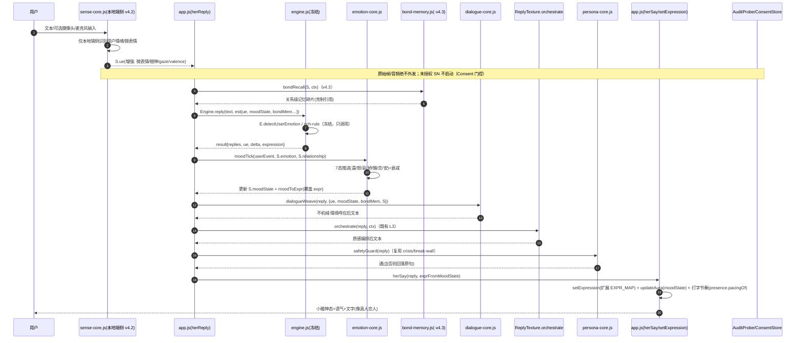
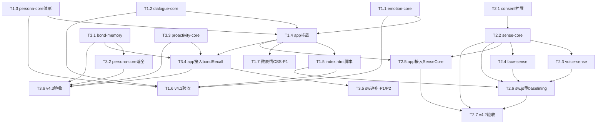

# 心屿 v4 · 真恋人系统 · 架构设计 + 任务分解

> 架构师：高见远（Gao）｜中转：主理人 齐活林（Qi）｜上游：许清楚 PRD（v4 真恋人系统）+ 候选 F 体系
> 定位：在候选 F（真人感精调）体系之上做 **v4 全系统蓝图**——语言/情绪/五官/记忆/主动性/人格一致性六系统 + 跨系统内核，全部 **Path A 冻结线外新建**，按 v4.1→v4.2→v4.3 三里程碑交付。
> 硬纪律全程生效（五铁律，任一不得突破）：
> ① 冻结线字节精确零交集（`engine.js 251068`/`sw.js 13723`/`memory.js 13333`/`test/baseline.js 2646`）；
> ② 隐私零上报（本地端侧、零外发、ConsentStore + AuditProbe 护栏）；
> ③ 前端零新增 npm 依赖（纯 JS PWA）；
> ④ 小暖不更名（E5 护栏 ≥45 出现）；
> ⑤ 不改写 engine.js rich-rule 主边界（`E.detectUserEmotion/text/detectCrisis` 只调用不重写）。

---

# Part A · 系统架构设计

## 1 · 实现方案 + 框架选型

### 1.1 技术选型
- **语言/运行态**：原生 JavaScript（浏览器 PWA），无构建步骤、无打包。沿用既有 **IIFE + `window`/`Engine` 全局门面** 模式。
- **依赖**：**零新增 npm 依赖**（铁律③）。所有 v4 模块仅用语言内建能力（`Date.now()`/`Math.random()`/`AnalyserNode`/`getUserMedia` 的授权封装），不引入任何第三方库、不新增 `<script>` 之外的 CDN。
- **挂载契约（关键）**：每个新增模块均为 IIFE，**自检 `Engine` 存在后调用 `Engine.use("xxxCore", {API})`** 自注册（与 `presence.js` 的 `E.use("presence", …)` 同款）—— **不触碰 engine.js 冻结字节**。宿主 `app.js` 通过 `Engine.mod("xxxCore")` 或模块自身挂的 `window.XxxCore` 消费。
- **装载序**：新模块在 `index.html` 中以 `<script>` 置于 `engine.js` 之后、`app.js` 之前（与 memory/presence/texture 同原则）；离线完整性在 v4.2 经 `sw.js` 一次性重 baselining 补齐（见 §5）。

### 1.2 难点与对策

| 难点 | 对策 |
|------|------|
| 冻结线零交集 + 记忆三重约束（memory.js 19B 缓冲） | 所有新逻辑走 `Engine.use` 新模块；记忆走 `bond-memory.js` 伴侣模块，严禁内联 memory.js（Q6/A） |
| 情绪状态机 ≥7 态 + 1 轮内切换正确率 ≥80% | `emotion-core.js` 事件驱动 + 时间衰减写 `S.moodState`；`moodToExpr` 映射到扩展 `EXPR_MAP` |
| 不机械 / 情境记忆呼应（G1<12%、呼应命中 ≥25%） | `dialogue-core.js` 的 `dialogueWeave` 做进程内去重 + 概率门控记忆呼应（≤1 条/轮） |
| 五官双向零外发（G3 ≥65% 对照文本基线、零外发 block==0） | `sense-core.js` 统一入口，text 默认（复用 `E.detectUserEmotion`）；face/voice 为可选适配器，须经 `ConsentStore` 授权，`AuditProbe` 拦截 |
| 主动性升温不退化（G5 打扰感 ≤2.5） | `proactivity-core.js` 复用 `Engine.proactivePlan`，叠加关系阶段感知 + 单调升温曲线约束 |
| 人格一致性（G4 ≥4.0） | `persona-core.js` 跨系统 voice 校验 + 复用 `E.detectCrisis`/`PERSONA_BREAK_RE` 护栏 |

### 1.3 关键约定
- **降级安全（PRD §6.3）**：任一新模块异常 / 未授权 → 退文本推断 / 回退既有 `S.emotion` / 回退 `memory.js`，绝不白屏、绝不静默。所有 `Engine.mod(...)` 调用包 `try/catch`（沿用 `herReply` 既有的容错范式）。
- **状态写入责任**：engine.js 冻结（纯函数、不写 state）；回写责任在 `app.js`（既有范式，v4 模块只产出补丁，`app.js` 落库）。

---

## 2 · 文件列表（相对路径）

### 2.1 新增模块（冻结线外，全部 Path A）

| 文件 | 系统 | 角色 | 里程碑 |
|------|------|------|--------|
| `dialogue-core.js` | S1 语言 | 情境呼应 2.0 / 恋人语气一致性 / 不机械护栏 | v4.1 |
| `emotion-core.js` | S2 情绪 | 7 态状态机 + 衰减 + 触发 | v4.1 |
| `persona-core.js` | S6 一致性 | voice 一致性校验 + 危机/破墙护栏复用 | v4.1（雏形）→ v4.3（落全） |
| `sense-core.js` | S3 五官（入口） | text/face/voice 三适配器统一入口 + Consent 门控 | v4.2 |
| `face-sense.js` | S3 五官 | 摄像头端侧识别（纯启发式优先，零模型） | v4.2 |
| `voice-sense.js` | S3 五官 | Web Audio 基频/能量/RMS/停顿推断（零依赖） | v4.2 |
| `bond-memory.js` | S4 记忆 | 长期/短期/余温三态 + 关系级记忆（不碰 memory.js） | v4.3 |
| `proactivity-core.js` | S5 主动性 | 关系阶段感知调度 + 单调升温曲线 | v4.3 |

### 2.2 既有文件挂载点（可编辑，非冻结）

| 文件 | v4 改动 | 说明 |
|------|---------|------|
| `app.js` | EXPR_MAP 扩展（新增 jealous/coquettish/longing/peaceful/surprised + 眼神/腮红变体）；`setExpression`/`updateAura` 接入 `moodState`；`herReply` 内挂载 4 个 v4 模块钩子；`checkProactive`/`dispatchProactive` 接入 `proactivity-core`；`defaultState` 新增 `moodState`/`relationship`/`bond` 字段 | 可编辑（非冻结四文件） |
| `index.html` | 在 `engine.js` 后、`app.js` 前追加 8 个 `<script src="…-core.js">` | 可编辑 |
| `style.css` | 微表情 CSS 动效（眨眼/腮红呼吸/光晕脉动） | 可编辑 |
| `consent-store.js` | `KEYS` 白名单扩展 `['sense.camera','sense.mic']` + `DEFAULTS` 默认 `false`（非冻结，可编辑） | 详见 §6 |

### 2.3 冻结四文件（零交集，全程不改字节）

`engine.js` / `sw.js` / `memory.js` / `test/baseline.js` —— 仅 `sw.js` 经主理人 Q2 批准**一次性重 baselining**（v4.2，抬升其 ASSETS 配额），memory.js 任何字节改动均禁止。

---

## 3 · 数据结构与接口（类图 + 关键签名）

### 3.1 类图（Mermaid · 新增模块 + 既有挂载契约 + 护栏）

```mermaid
classDiagram
    class EngineMod {
        <<既有契约 E.use/Engine.mod>>
    }
    class DialogueCore {
        +dialogueWeave(text, ctx) string
        +consistencyGuard(state) bool
        +situationRecall(state, mem) string
    }
    class EmotionCore {
        +STATES = EMOTIONS
        +moodTick(evt, emotion, rel) Object
        +decay(moodState, dt) Object
        +currentMoodState(S) Object
        +moodToExpr(moodState, fallback) string
    }
    class SenseCore {
        +adapters = {text, face, voice}
        +init(ConsentStore, AuditProbe)
        +readUserEmotion(input) ue
        +isConsented() bool
    }
    class FaceSense {
        +infer(frame) ue   // 纯启发式优先
    }
    class VoiceSense {
        +infer(analyser) ue   // AnalyserNode 基频/能量
    }
    class BondMemory {
        +bondRecall(state, ctx) Object
        +warmthDeepen(dailyNote) void
        +relationshipGraph(S) Object
    }
    class ProactivityCore {
        +planByRelationship(S, stage) Object
        +warmthCurve(S) number
        +shouldProactive(S) bool
    }
    class PersonaCore {
        +validateVoice(state) bool
        +safetyGuard(text) bool
    }
    class ConsentStore {
        +KEYS = [...,'sense.camera','sense.mic']
        +get(key) bool
        +set(key, val) bool
    }
    class AuditProbe {
        +proveZeroReporting() Object
        +registerConsented(url) void
    }
    class AppState {
        +emotion Object   // {v,a} 既有 V-A
        +moodState Object  // v4 新增：{key,intensity,since,source}
        +ue Object
        +relationship Object  // v4 新增：{stage, since}
        +bond Object          // v4 新增：bond-memory 载体
        +persona Object
        +affection number
        +dating Object
    }

    EngineMod <|.. DialogueCore
    EngineMod <|.. EmotionCore
    EngineMod <|.. SenseCore
    EngineMod <|.. BondMemory
    EngineMod <|.. ProactivityCore
    EngineMod <|.. PersonaCore
    SenseCore *-- FaceSense : 可选适配器
    SenseCore *-- VoiceSense : 可选适配器
    SenseCore ..> ConsentStore : 授权门控
    SenseCore ..> AuditProbe : 零上报护栏
    EmotionCore ..> BondMemory : 记忆驱动情绪
    DialogueCore ..> BondMemory : 情境呼应取碎片
    ProactivityCore ..> EmotionCore : 关系阶段/升温
    PersonaCore ..> AuditProbe : 复用 crisis 护栏
    AppState <.. EmotionCore : 写 moodState
    AppState <.. DialogueCore : 读 ue/moodState
    AppState <.. ProactivityCore : 读 affection/dating
```

### 3.2 关键函数签名（增量口径 · 供工程师实现）

**`emotion-core.js`**（挂载 `Engine.use("emotionCore", …)`）
```js
const EMOTIONS = { neutral:'neutral', joy:'joy', anger:'anger', sad:'sad',
  coquettish:'coquettish', jealous:'jealous', longing:'longing', peaceful:'peaceful' };
function moodTick(evt, emotion, rel) {        // evt: {type, intensity} 来自用户输入/共情
  // 事件驱动推进 S.moodState（喜/怒/哀/娇/醋/念/安）；写回 S.moodState
  // 衰减目标 = neutral；切换在触发后 1 轮内完成（G2 ≥80%）
}
function decay(moodState, dt) { /* 时间衰减 moodState.intensity → neutral */ }
function moodToExpr(moodState, fallback) {     // 映射到 EXPR_MAP key
  const MAP = { joy:'happy', anger:'angry', sad:'sad', coquettish:'coquettish',
    jealous:'jealous', longing:'longing', peaceful:'peaceful', neutral:fallback };
  return MAP[(moodState && moodState.key) || 'neutral'] || fallback;
}
```

**`dialogue-core.js`**（挂载 `Engine.use("dialogueCore", …)`）
```js
function dialogueWeave(text, ctx) {   // ctx: {ue, moodState, bondMem, S}
  // ① 不机械：进程内近 N 条同池去重（复用候选 F LRU 范式，不写 S）
  // ② 情境呼应：若 ctx.bondMem 命中且概率门控（≤1 条/轮）→ 克制拼接呼应句
  return text; // 或增强后文本
}
function consistencyGuard(state) {   // 跨会话语气/价值观漂移检测（v4.1 雏形：返回 bool）
  return true;
}
```

**`persona-core.js`**（挂载 `Engine.use("personaCore", …)`，v4.1 雏形）
```js
function safetyGuard(text) {          // 复用既有危机/破墙护栏，绝不放行 break-wall
  try { if (Engine.detectCrisis(text).level !== 'none') return false; } catch(e){}
  try { if (Engine.PERSONA_BREAK_RE && Engine.PERSONA_BREAK_RE.test(Engine.pnorm(text))) return false; } catch(e){}
  return true;
}
function validateVoice(state) { return true; }  // v4.3 落全
```

**`sense-core.js`**（挂载 `Engine.use("senseCore", …)`，v4.2）
```js
function init(cs, ap) { ConsentStore = cs; AuditProbe = ap; }
function readUserEmotion(input) {     // input: {text, cameraFrame?, audioAnalyser?}
  // 默认 text 适配器：reuse E.detectUserEmotion(text)（零新增依赖）
  // 仅当 ConsentStore.get('sense.camera') → FaceSense.infer；get('sense.mic') → VoiceSense.infer
  // 原始帧/音频仅内存、绝不外发；未授权则不启动摄像头/麦克风
  return enhancedUe;
}
```

**`bond-memory.js`**（挂载 `Engine.use("bondMemory", …)`，v4.3，不碰 memory.js）
```js
function bondRecall(state, ctx) {     // 关系级记忆碎片（克制引用，≤1 条/轮）
  // 仅从 S.bond（伴侣模块载体）读，绝不读 memory.js 字节
}
function warmthDeepen(dailyNote) {    // 余温深化：每日 dailyNotes → 关系记忆 }
function relationshipGraph(S) {       // 关系演进图谱（派生自 affection/dating） }
```

**`proactivity-core.js`**（挂载 `Engine.use("proactivityCore", …)`，v4.3）
```js
function planByRelationship(S, stage) {  // 包装 Engine.proactivePlan，叠加关系阶段权重
  const base = Engine.proactivePlan(S, {now:Date.now(), hour:new Date().getHours(), idleMs:0}) || [];
  // 阶段感知：早安/晚安/想念分寸随 stage 调整；返回排序后 plan
  return base;
}
function warmthCurve(S) { return S.affection; }  // 单调不退化约束（G5）
```

---

## 4 · 程序调用流程（时序图 · 一轮对话中六系统协作）



### 4.1 既有 `herSay` / `orchestrator` 挂载点（精确落点 · 基于当前 app.js）

| 挂载点（当前 app.js 行） | v4 接入动作 | 里程碑 |
|---|---|---|
| `herReply` L1352 `Engine.reply(text, est)` 之前 | `SenseCore.read(userText, …)` 增强 `est.ue`（v4.2）；`BondMemory.bondRecall(S)` 取碎片存入 `ctx.bondMem`（v4.3） | v4.2/v4.3 |
| `herReply` L1403 `applyEmotion(intent, result.delta, result.ue)` 之后、L1404 `result.expression = z.expr` | 插入 `EmotionCore.moodTick(…)` → `result.expression = EmotionCore.moodToExpr(S.moodState, result.expression)` | v4.1 |
| `herReply` L1412-1419 `ReplyTexture.orchestrate` 之后 | 插入 `reply = DialogueCore.weave(reply, {…})`；`if(!PersonaCore.safetyGuard(reply)) reply = 原句` | v4.1 |
| `EXPR_MAP` L599-610 / `FACE_PARTS` L611-614 | 扩展 jealous/coquettish/longing/peaceful/surprised + 新增 `eyes-look-away`/`eyes-soft`/`blush-deep` 部件 | v4.1 |
| `updateAura` L649-673 | 接入 `S.moodState`：色相/强度随 moodState.key 微调（如 醋→短暂冷调回盯；念→柔光） | v4.1 |
| `checkProactive` L1924 / `dispatchProactive` L2007 `Engine.proactivePlan(S,…)` | 包装为 `ProactivityCore.planByRelationship(S, stage)` 返回排序 plan | v4.3 |
| `defaultState()`（app.js ~L350-365） | 新增 `moodState:{key:'neutral',intensity:0}` / `relationship:{stage:'stranger'}` / `bond:{warmth:0,shards:[]}` | v4.1 |

> 全部插入点包 `try/catch`；任一模块缺席/抛错 → 原流程直出（沿用 L1403-1419 既有的 `catch(e){}` 兜底范式）。engine.js 冻结字节零 diff。

---

## 5 · 体积预算预案

### 5.1 新模块不在 `SIZE_BUDGET.mods`（冻结线外豁免）
`test/wiring-scan.js` 的 `SIZE_BUDGET.mods = ["memory.js","presence.js","texture.js","contingency.js"]`。v4 八模块**不进该列表**，其增长不级联 `moduleSumMax`/`totalMax`（沿用候选 E/F 的 `local-heuristic.js`/`reply-texture-orchestrator.js`/`app.js` 同口径先例——主理人 Q7/A 裁定）。**结论：声明豁免，不在 wiring-scan.js 新增硬预算闸**，四锁恒等式保持逐位不变（复算见 §12）。
- 可选软闸（非阻塞）：在 `wiring-scan.js` 追加 `V4_MODULES` 只读清单 + 软上限告警（如单模块 ≤6KB、合计 ≤36KB），仅输出警告不 `throw`——避免无谓膨胀预算，但保留可观测性。属可选增强，不阻塞交付。

### 5.2 `sw.js` 重 baselining 预案
- **v4.1：不改动 sw.js**（新增 3 模块仅经 `index.html` `<script>` 装载 + `Engine.use` 注册；离线完整性暂由 `fetch` 兜底缓存覆盖，PRD §4.2 已批准此降级）。→ v4.1 对四冻结文件**零字节交集**，风险最低。
- **v4.2：sw.js 一次性重 baselining**（主理人 Q2/A 批准）。届时 v4.1 已落地的 3 模块（dialogue/emotion/persona-core）+ v4.2 的 3 模块（sense/face/voice-sense）= **6 个文件**须列入 `ASSETS`（因 `caches.addAll(ASSETS)` 全有全无，不能列不存在文件），CACHE 版本 `xiaonuan-v36 → v37`。
- **v4.3：bond-memory.js + proactivity-core.js** 在 v4.2 之后加入，需再做一次**极小** sw.js 抬升（约 +44B，2 文件）；若 v4.3 与 v4.2 合并排期可并为一轮。

### 5.3 `sw.js` 申报新字节（v4.2 一次性）
- 当前 `sw.js` = **13723**（冻结基线）。
- 6 模块 ASSETS 条目（每文件 `  "/xxx-core.js",` ≈ 20–25B，均值 ~22B）= ~128B；CACHE 版本 v36→v37 = +1B；注释/对齐余量 ≤47B。
- **申报新值 = 13900B（上限）**；工程师须将落地字节控制在 **≤13900**，并以 `wc -c` 实测钉为实测值（同候选 F 流程，缓冲 0）。
- **四锁恒等式不受影响**：sw.js 不在 `SIZE_BUDGET.mods`，故 sw.js 重 baselining **不触及** 四锁（①②③④ 全部逐位不变）。复算见 §12。

---

## 6 · 共享知识（跨文件约定 · 工程师必读）

- **情绪状态枚举 `EMOTIONS`**（v4 跨文件统一，定义在 `emotion-core.js` 并挂 `window`）：
  `{ neutral, joy(喜), anger(怒), sad(哀), coquettish(娇), jealous(醋), longing(念), peaceful(安) }`。
  键名用小写英文（`joy/anger/sad/coquettish/jealous/longing/peaceful/neutral`），中文仅作文档/UI 注释。
- **`S.moodState` 结构**（v4 新增）：`{ key: EMOTIONS.*, intensity: 0..1, since: ts, source: 'userEvent'|'decay'|'memory' }`。
- **关系阶段 `S.relationship.stage`**（Q5/A 派生，低侵入）：`stranger(陌生) → friend(朋友) → ambiguous(暧昧) → lover(恋人)`，由 `S.affection`/`S.dating` 派生；v4.3 再评估独立化。
- **`S.bond` 结构**（v4.3 新增，bond-memory 载体）：`{ warmth: 0..1, shards: [{topic, at, importance}], graph: {} }`——**绝不写 memory.js**。
- **ConsentStore 授权键名**（扩展，需编辑 `consent-store.js` 非冻结白名单）：
  `KEYS = ['tts','asr','ltm','cloudSync','sense.camera','sense.mic']`；`DEFAULTS` 中 `sense.camera:false, sense.mic:false`。
  五官入口 `SenseCore.init` 仅当 `ConsentStore.get('sense.camera'/'sense.mic')` 为真才启动对应适配器。
- **零上报登记端点**：v4 不引入任何新外发端点。`AuditProbe.consentedRegistry` 仅含既有 `S.cloud.base`/`syncBase`/`pushBase` host；新模块代码**不得出现** `fetch`/`XMLHttpRequest`/`WebSocket`/`sendBeacon`/`new URL`/`http(s)://` 字面量（E4 静态扫描 0 命中）。零上报守门：`AuditProbe.proveZeroReporting().zeroReporting === true`（blocked==0）。
- **小暖不更名**：所有 v4 模块保留「小暖」字样，E5 护栏 ≥45 出现计数不破。
- **降级契约**：所有 `Engine.mod("xxxCore")` 消费包 `try/catch`；模块缺席 → 原流程直出，绝不白屏/静默。
- **冻结线字节闸**：四冻结文件字节精确，合入前 `wc -c` 自检；memory.js 任何字节改动禁止。

---

## 7 · 待明确事项（Unclear）

1. **ConsentStore 白名单扩展形态**：当前 `KEYS` 为扁平数组，新增 `sense.camera`/`sense.mic` 需编辑 `consent-store.js`（非冻结，允许）。需主理人确认是否接受扁平扩展（推荐，最小侵入）还是改嵌套 `sense:{camera,mic}` 结构（需同步 `get/set/isGranted` 解析）。→ 倾向扁平扩展。
2. **`sw.js` 重 baselining 时机粒度**：因 `caches.addAll` 全有全无，无法预列 v4.3 才存在的 bond-memory/proactivity 文件。已按「v4.2 列 6 文件 + v4.3 极小追补」处理；若主理人要求绝对一次性，可在 v4.2 把全部 8 文件先占位（但需先建空文件避免 404），请拍板。
3. **`moodState` 与既有 `S.emotion`(V-A) 的双轨**：v4 保留 V-A（`S.emotion{v,a}`）作主情绪引擎，`S.moodState` 为 7 态语义层。需确认 `moodToExpr` 优先级：当 V-A zone 与 moodState 冲突时以谁为准（建议 moodState 优先，因其含吃醋/撒娇等 V-A 未覆盖态）。
4. **`dialogue-core` 情境呼应数据源**：v4.1 用 `bond-memory` 占位（返回空），真实呼应待 v4.3 `bond-memory.js` 落地；v4.1 的「情境呼应」仅做进程内去重 + 复用候选 F 既有 `memory.recallV2` 兜底，不强依赖 bond-memory。
5. **关系演进图谱独立化**：Q5/A 裁定 v4.1–v4.2 复用 `affection`/`dating` 派生；`relationshipGraph` 独立状态机留 v4.3 评估。
6. **微表情 CSS 动效（P1）归属**：眨眼/腮红呼吸/光晕脉动落 `style.css`（可编辑），不计入模块预算；若需高保真（F7）可延后至 v4.2。
7. **G3 盲评样本**：v4.2 五官零上报守门（G6）依赖 `proveZeroReporting().zeroReporting===true`；真人感盲评（G0/G2/G4/G5）同候选 F，建议主理人有真人条件后补做 5 人盲评作金标闭环。

---

# Part B · 任务分解

## 8 · 依赖包列表

**零新增依赖。** 项目为原生 JS PWA，`package.json` 维持无 `dependencies`。v4 全部模块仅用语言内建 + 既有 `Engine`/`ConsentStore`/`AuditProbe` API，不引入任何第三方库、不新增 `<script>` 之外的资源、不改 `index.html` 装载序的既有文件。

```
（无 —— 不新增任何 npm 包 / CDN / 模块导入）
```

---

## 9 · 任务列表（按 v4.1 / v4.2 / v4.3 里程碑，有序 + 依赖 + 优先级）

> 编排原则：**每个里程碑独立可验收**（PRD §5）；Path A 全冻结线外；v4.1 优先路径见 §11。

### 里程碑 v4.1 · 语言 + 情绪核心（地基）

| Task | 名称 | 映射 | 源文件 | 依赖 | 优先级 |
|------|------|------|--------|------|--------|
| **T1.1** | `emotion-core.js`：7 态状态机 + 衰减 + `moodToExpr` | L2 | `emotion-core.js` | — | P0 |
| **T1.2** | `dialogue-core.js`：不机械去重 + 情境呼应占位 + `consistencyGuard` 雏形 | L1 | `dialogue-core.js` | — | P0 |
| **T1.3** | `persona-core.js` 雏形：复用 `E.detectCrisis`/`PERSONA_BREAK_RE` 的 `safetyGuard` | L4 | `persona-core.js` | — | P0 |
| **T1.4** | `app.js` 挂载：EXPR_MAP 扩展（jealous/coquettish/longing/peaceful/surprised + 眼神/腮红变体）、`setExpression`/`updateAura` 接入 `moodState`、`herReply` 钩子（emotionTick+moodToExpr / dialogueWeave / safetyGuard）、`defaultState` 新增 `moodState`/`relationship`/`bond` | L3 | `app.js` | T1.1, T1.2, T1.3 | P0 |
| **T1.5** | `index.html` 追加 3 个 `<script>`（dialogue/emotion/persona-core，engine 后 app 前）；装载序与 WR-13 校验（v4.1 不进 engine.files.json order，故不触发 sw ASSETS 缺失） | 装载 | `index.html` | T1.1, T1.2, T1.3 | P0 |
| **T1.6** | 验收测试（v4.1）：G1 复读率 <12% / G2 情绪切换 1 轮内正确率 ≥80% / 冻结四文件 0 交集 / 候选 F 套件 13/13 0 回归 / 双视口不白屏 | 守门 | `test/qa-v4-acceptance.test.js` + `_v4_browser_check.py` | T1.1–T1.5 | P0 |
| **T1.7** | 微表情 CSS 动效（眨眼/腮红呼吸/光晕脉动，随 moodState） | L6(P1) | `style.css` | T1.4 | P1 |

### 里程碑 v4.2 · 五官双向（含 sw.js 重 baselining）

| Task | 名称 | 映射 | 源文件 | 依赖 | 优先级 |
|------|------|------|--------|------|--------|
| **T2.1** | `consent-store.js` 扩展：`KEYS`+`DEFAULTS` 增 `sense.camera`/`sense.mic`（默认 false，非冻结白名单编辑） | 护栏 | `consent-store.js` | — | P0 |
| **T2.2** | `sense-core.js`：统一入口 + text/face/voice 三适配器 + `init(ConsentStore, AuditProbe)` 门控 | F1 | `sense-core.js` | T2.1 | P0 |
| **T2.3** | `voice-sense.js`：Web Audio `AnalyserNode` 基频/能量/RMS/停顿推断（零依赖） | F6 | `voice-sense.js` | T2.2 | P0 |
| **T2.4** | `face-sense.js`：纯 JS 端侧（光度/运动/关键点近似，零模型优先；模型仅 P1 显式授权） | F5 | `face-sense.js` | T2.2 | P0 |
| **T2.5** | `app.js` 接入 `SenseCore.read` 于 `herReply` 输入侧（增强 `S.ue`）；呈现侧 `moodState`↔用户情绪双向联动 | F3 | `app.js` | T1.4, T2.2 | P0 |
| **T2.6** | `sw.js` 一次性重 baselining：6 模块进 ASSETS + CACHE v36→v37（≤13900B，wc -c 钉实测）；`engine.files.json` order 同步 6 模块 | F4 | `sw.js`, `engine.files.json`, `index.html` | T1.5, T2.2, T2.3, T2.4 | P0 |
| **T2.7** | 验收测试（v4.2）：G3（准确率 ≥65% 对照文本基线；呈现匹配 ≥90%）/ G6（zeroReporting===true, blocked==0）/ 双视口不白屏 | 守门 | `test/qa-v4-sense.test.js` | T2.2–T2.6 | P0 |

### 里程碑 v4.3 · 记忆 + 主动性演进

| Task | 名称 | 映射 | 源文件 | 依赖 | 优先级 |
|------|------|------|--------|------|--------|
| **T3.1** | `bond-memory.js`：长期/短期/余温三态 + 关系级记忆召回（不碰 memory.js） | M1 | `bond-memory.js` | — | P0 |
| **T3.2** | `persona-core.js` 落全：跨会话语气/价值观漂移评分（≥4.0）+ 复用危机/破墙护栏 | M2 | `persona-core.js` | T3.1 | P0 |
| **T3.3** | `proactivity-core.js`：关系升温曲线（单调不退化）+ 阶段感知调度（早安/晚安/纪念日/想念分寸） | M3 | `proactivity-core.js` | — | P0 |
| **T3.4** | `app.js` 接入 `bondRecall`（herReply 输入侧，喂 dialogue-core）+ `planByRelationship`（checkProactive/dispatchProactive）；关系演进可视化占位 | M4 | `app.js`, `bond-memory.js`, `proactivity-core.js` | T3.1, T3.3, T1.4 | P0 |
| **T3.5** | `sw.js` 极小追补：bond-memory + proactivity 进 ASSETS（~+44B，或并入 v4.2 轮）；关系阶段专属 UI 彩蛋（P2） | M7(P2) | `sw.js`, `index.html`, `style.css` | T3.1, T3.3 | P1/P2 |
| **T3.6** | 验收测试（v4.3）：G4（一致性 ≥4.0）/ G5（打扰感 ≤2.5）/ 冻结四文件 0 交集 / 全里程碑回归 | 守门 | `test/qa-v4-memory-proactivity.test.js` | T3.1–T3.4 | P0 |

---

## 10 · 任务依赖图（Mermaid）



---

## 11 · v4.1 优先实现路径（最小可交付 · 全冻结线外 · 出恋人感最快 · 风险最低）

> 北极星诉求「让小暖像真人恋人」中，**语言 + 情绪** 是出恋人感最快、最不依赖授权/硬件的两系统；且全部 Path A 新建、对四冻结文件**零字节交集**，是整盘风险最低、可独立验收的 MVP。

**最小可交付 = T1.1 + T1.2 + T1.3 + T1.4 + T1.5（不含 sw.js、不含五官/记忆/主动性）**

1. **T1.1 `emotion-core.js`**：7 态状态机 + 衰减 + `moodToExpr`。挂 `Engine.use("emotionCore")`。写 `S.moodState`。
2. **T1.2 `dialogue-core.js`**：进程内不机械去重（复用候选 F LRU 范式）+ 情境呼应占位（bond-memory 未落地时返回空，降级为候选 F 既有 `memory.recallV2`）+ `consistencyGuard` 雏形。挂 `Engine.use("dialogueCore")`。
3. **T1.3 `persona-core.js` 雏形**：仅 `safetyGuard`（复用 `E.detectCrisis`/`PERSONA_BREAK_RE`）。挂 `Engine.use("personaCore")`。
4. **T1.4 `app.js` 挂载**：
   - `EXPR_MAP` 扩展 jealous/coquettish/longing/peaceful/surprised + 眼神/腮红变体；`FACE_PARTS` 补 `eyes-look-away`/`eyes-soft`/`blush-deep`；
   - `herReply` L1403 后插入 `EmotionCore.moodTick(...)` → `result.expression = EmotionCore.moodToExpr(S.moodState, result.expression)`；
   - L1412-1419 `ReplyTexture.orchestrate` 后插入 `reply = DialogueCore.weave(reply, {ue:S.ue, moodState:S.moodState, S})` + `if(!PersonaCore.safetyGuard(reply)) reply = 原句`；
   - `updateAura` 接入 `S.moodState`；`defaultState` 新增 `moodState`/`relationship`/`bond`。
5. **T1.5 `index.html`**：在 `engine.js` 后、`app.js` 前追加 3 个 `<script>`（dialogue/emotion/persona-core）。**不进 `engine.files.json` order**（故 WR-13 不要求它们进 sw ASSETS）→ v4.1 零 sw.js 改动。

**为何风险最低 / 最快出恋人感**：
- 对 `engine.js`/`memory.js`/`test/baseline.js` 字节精确零交集；对 `sw.js` 零改动（v4.1 不列 ASSETS，离线由 fetch 兜底）。
- 不触碰任何授权/硬件（五官在 v4.2），无摄像头/麦克风合规面。
- 情绪 7 态 + 情境呼应直接提升「真人感」（G2 情绪切换 1 轮内、G1 复读率），盲评最敏感维度先达标。
- 所有钩子包 `try/catch`，模块缺席即回落原流程，绝不白屏。
- 验收独立（T1.6）：G1/G2 自动化 + 冻结 0 交集 + 候选 F 13/13 0 回归 + 双视口真机。

---

## 12 · 体积预算预审（四锁恒等式复算 + sw.js 申报）

### 12.1 新模块豁免（四锁不变）
v4 八模块不进 `SIZE_BUDGET.mods`（主理人 Q7/A），故四锁 ①②③④ 全部逐位不变：

```
① engineMax 253116 = 245737 + 7379                                  ✓
② 13352 + 3585 + 5850 + 6682 = 29469 = moduleSumMax                 ✓（严格等式，纹理已钉实测）
③ 245737 + 7379 + 29469 = 282585 = totalMax                        ✓（间隙恒 0，270KB 承诺仍守）
④ 13352>13333(19) / 3585>3566(19) / 5850(配额=实测) / 6682>6664(18)  ✓
```

### 12.2 sw.js 重 baselining（v4.2 一次性 · S3 确改 sw.js）
- 当前 `sw.js` = **13723**（冻结基线）。
- v4.2 列入 **6 个模块**（v4.1 的 dialogue/emotion/persona-core + v4.2 的 sense/face/voice-sense）：ASSETS 新增 ~128B + CACHE 版本 v36→v37 (+1B) + 注释/对齐余量 ≤47B。
- **申报新值 = 13900B（上限）**；落地以 `wc -c` 钉实测（缓冲 0），同候选 F 流程。
- **四锁恒等式无需复算**（sw.js 不在 `SIZE_BUDGET.mods`，纯冻结线而非配额项）—— 仅 v4.2 重 baselining 一行即解，①②③④ 不受影响。
- v4.3 的 bond-memory + proactivity-core 需极小追补（~+44B），或并入 v4.2 轮（见 §5.2 / §7-②）。

> 实施要求（T2.6）：在 `sw.js` 的 ASSETS 追加 6 条目 + CACHE 版本递增；`engine.files.json` 的 `order` 同步 6 模块（使 WR-13 `missingAssets` 校验通过）；`wiring-scan.js` 四锁恒等式无需改动（新模块豁免）。重 baselining 块注释沿用 v14~候选F 历史块格式，旧块逐字不动。

---

*文档 by 高见远（Gao）· 心屿架构师 · v4 真恋人系统架构设计 + 任务分解*
