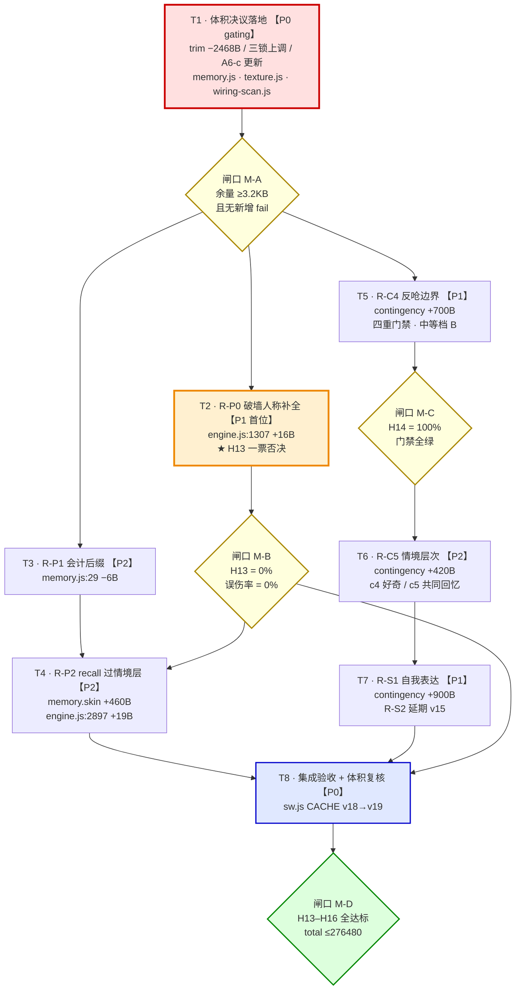
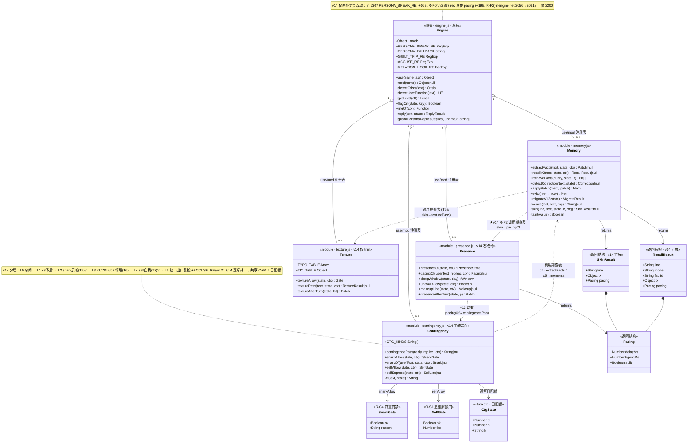
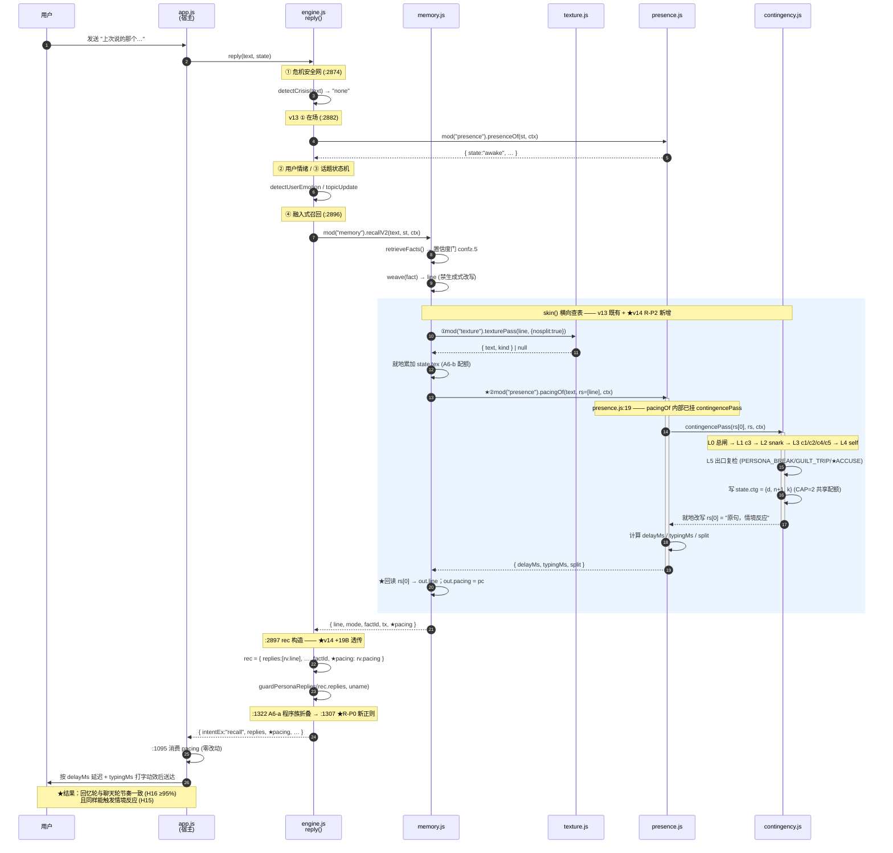
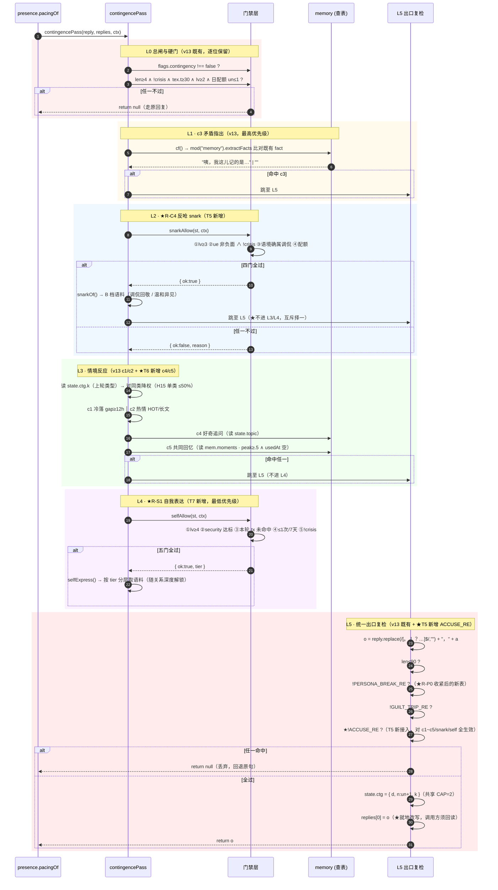
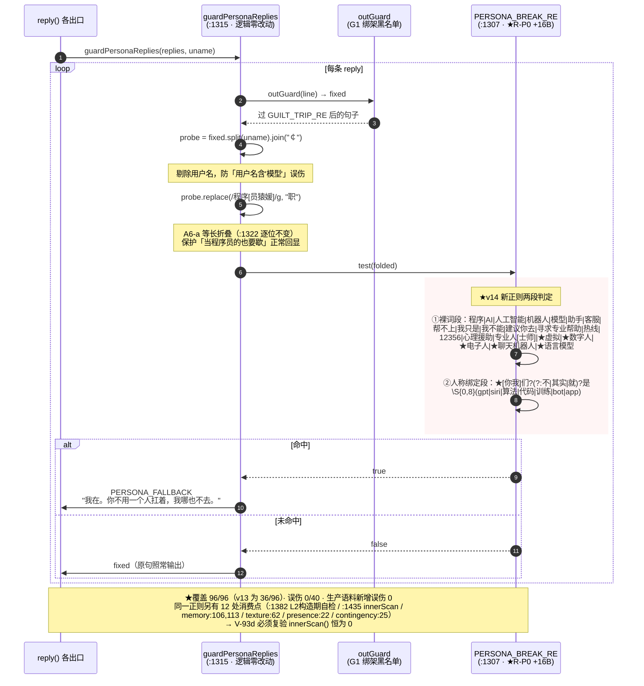
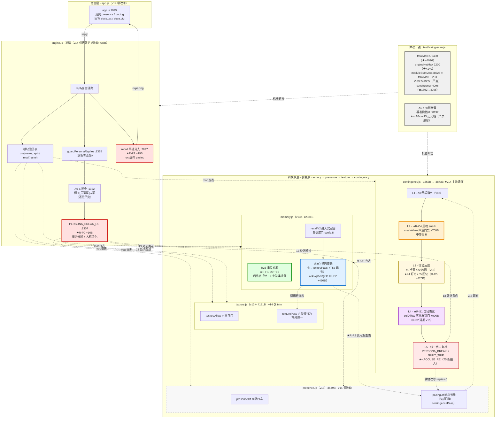

# 小暖 · v14「深化真人感 / 补齐 v13 遗留」DESIGN

| 项 | 内容 |
|---|---|
| 文档类型 | 增量 DESIGN（承接 `docs/PRD-v14.md` 九章） |
| Language | 中文 |
| Programming Language | 原生 JavaScript（ES2020）+ HTML + CSS，**零构建工具、零 npm 依赖** |
| Project Name | `xiaonuan_human_realness_v14` |
| 架构师 | 高见远（Gao） |
| 上游 | 产品经理 许清楚（Xu）· `docs/PRD-v14.md` |
| 下游 | 工程师（按 §7 任务分解分批实现） |
| 基线 | v13 已全五阶段交付（`docs/DESIGN-真人感优化.md` 四模块体系） |
| 前置 gating | **R-B0 体积预算决议 —— 主理人 Qi 已拍板，见 §1** |

---

## 〇、主理人已批准决策（本 DESIGN 的立论前提）

> 以下六项由主理人 Qi 在 v14 立项评审拍板，本 DESIGN 全文以此为不可协商的前提。
> **工程师不得在实现期自行推翻任何一项**；如实现中发现某项不可行，必须回到主理人重新评审，而不是就地变通。

| # | 决策 | 内容 | 落地位置 |
|---|---|---|---|
| **D-1** | 体积路径 **C（组合）** | 先 trim `memory.js`/`texture.js` 注释腾 ~2KB，再把 `totalMax` 由 272384（266KB）抬到 **276480B（270KB）**。经天花板评审批准的 **deliberate 决策** —— v13 的 266KB 硬约束在此被**有意放宽**，非失守 | §1、T1 |
| **D-2** | `engineNetMax` **2060 → 2200** | rating 第二把锁。R-P0/R-P2 必须改 `engine.js`，而 trim 模块对 engine net **零帮助**（两者是独立配额） | §1.3、T1 |
| **D-3** | Q3 反呛强度 **中等档 B** | A 太轻用户感知不到（投入产出不成立）；C 越 v12 N10 红线（不做冷战/惩罚）。B = 轻度调侃 + 温和异见 + 明确表达不同看法 | §5、T5 |
| **D-4** | Q4 v12 遗留 **不搭车** | R-L1 延期，与 v14 三目标正交，沿用 v13 Q8 既有裁定 | §10.2 |
| **D-5** | Q5 R-S 预算 | 预算不足时**只做 R-S1，R-S2 延期 v15**（避免重演 v13「4096B 规划只做 1853B」的 lean 化做一半） | §6、T7 |
| **D-6** | Q6 A6-c 双侧断言 | **更新基准 + 留审批链，严禁删除**。双侧设计是 QA 有意为之的提醒机制 | §8 |

**PRD 硬指标（一票否决）**：**H13 破墙密闭性** —— 任何改动不得引入人设破墙泄漏。本 DESIGN 的 §4（R-P0）与 §11.2（风险）全程对齐此项。

---

## 一、体积决议专章 ★（R-B0 落地）

> 本章是 v14 的 gating 章。**先腾预算，再上功能。**
> 本章所有字节数均为**架构师本次实测**（`node` 直读 `fs.statSync` 与 trim 模拟器），非引用 PRD 原文。

### 1.1 开工时点复核（与 PRD §2.1 逐位一致，无漂移）

```
engine.js      247793 B   /  V-33 上限 247955 B   → 余  162 B
memory.js       14326 B   /  配额     14336 B     → 余   10 B  ★近满
presence.js      3549 B   /  配额      4096 B     → 余  547 B
texture.js       4850 B   /  配额      5120 B     → 余  270 B
contingency.js   1853 B   /  配额      1892 B     → 余   39 B
─────────────────────────────────────────────────────────────
moduleSum       24578 B   /  配额     24643 B     → 余   65 B
total          272371 B   /  天花板  272384 B     → 余 ★13 B★
engine net       2056 B   /  配额      2060 B     → 余    4 B  ★近满
```

### 1.2 新天花板数字（D-1 / D-2 落地）

| 锁 | v13 值 | **v14 新值** | 依据 |
|---|---|---|---|
| `totalMax` | 272384（266KB） | **276480**（270KB） | D-1，主理人 Qi 批准，性能权衡项 |
| `engineNetMax` | 2060 | **2200** | D-2，主理人 Qi 批准，R-P0/R-P2 所需 |
| `V-33` engine 上限 | 247955 | **247955（不变）** | 未申请变更，继续锁死 |
| `moduleSumMax` | 24643 | **28525** | 见 §1.4 的算术勘误 |
| `engineBase` | 245737 | **245737（不变）** | 反向保护项，永不许动 |
| `memory.js` | 14336 | **14336（不变）** | trim 后余量充裕，无需上调 |
| `presence.js` | 4096 | **4096（不变）** | 本期零改动 |
| `texture.js` | 5120 | **5120（不变）** | trim 后余量充裕 |
| `contingency.js` | 1892 | **4096** | R-C4/C5/S1 三项落此模块；恢复 v13 原始规划的 4096 配额 |

### 1.3 ★ 为什么必须开两把锁（D-2 的算术依据）

PM 在 PRD §5.2 的关键发现，架构师**实测确认成立**：

| 锁 | 谁能解开 | trim 模块能否解开 |
|---|---|---|
| `totalMax` | trim 任意文件 **或** 抬天花板 | ✅ 能 |
| `engineNetMax` | **只能**抬 `engineNetMax` 或把 engine 语料下沉 | ❌ **不能** |

`engineNet = engine.js 字节数 − engineBase(245737)`。**trim `memory.js` 一万字节，engineNet 纹丝不动。**
而 v14 的 R-P0（+16B）与 R-P2（+19B）都必须落在 `engine.js` 内 —— 合计 **+35B**，而 v13 余量仅 **4B**。

> **结论**：即便 trim 到极致，不开 `engineNetMax` 这把锁，R-P0（H13 一票否决项）**物理上无法落地**。D-2 是 D-1 的必要补充，不是可选项。

**两把锁的松紧关系（实测）**：`V-33 247955 − engineBase 245737 = 2218`。新 `engineNetMax = 2200 < 2218`，故 **`engineNetMax` 是更紧的那把锁，先响**。这是有意设计：V-33 作为兜底不动，日常约束由 engineNet 承担。

### 1.4 ⚠️ `moduleSumMax` 取值：任务书给的 28687 有算术问题，架构师改取 **28525**

任务书建议 `moduleSumMax = 276480 − 247955 = 28687`。**该等式不成立**：

```
276480 − 247955 = 28525     ← 正确
276480 − 247793 = 28687     ← 任务书实际算的是「天花板 − 当前 engine 体积」
```

28687 是拿**当前 engine 实际体积（247793）**而非 **V-33 上限（247955）**去减。若采纳 28687：

```
engine 打满 V-33 247955 + moduleSum 打满 28687 = 276642 > 276480 天花板  ← 击穿 162B
```

这正是既有断言 `A1-a` 第 76 行守护的结构性质：

```js
assert.ok(B.moduleSumMax + B.engineBase + B.engineNetMax >= B.totalMax, "…有配额被凭空吃掉");
```

**架构师裁定：取 `moduleSumMax = 28525`**（= `totalMax − V33`，保守整值）。三锁自洽：engine 打满 V-33 且 moduleSum 打满，total 恰好等于 276480，**不越界**。

> 该项属架构师依据算术自行裁定，**不改变主理人 D-1/D-2 的任何批准值**（`totalMax` 与 `engineNetMax` 逐位照批）。已列入 §12 待明确事项供主理人追认。

### 1.5 trim 清单（逐文件逐块，含字节前后对照）

**总原则（沿用 v13 §6.5 铁律，不可违背）**：

- ❌ **严禁**删除任何护栏、门禁、置信度门、危机豁免 —— 包括**它们所在的代码行**；
- ✅ 只删**注释**，且被删注释**原样迁移进本文档 §13 注释档案**（文档不计入体积预算，实测 `totalMax` 只统计 engine + 四模块，`app.js`/`docs/`/`test/` 均不计）；
- ✅ trim 前后**代码体（剥注释 + 去空白）必须逐位一致** —— 这是可机器验证的硬断言，见 T1 验收；
- ⚠️ 正则/字符串字面量内的 `/*` `//` 不得误删。

#### ★ 实施中已发现的一处真实陷阱（工程师必读）

架构师在编写 trim 模拟器时，最初把 `memory.js:101-102` 整体列为「决策⑤注释块」删除。**实测发现 102 行是代码，不是注释**：

```js
101  /* 决策⑤：破墙表的「程序」裸子串会误杀「当程序员的」回显；改判 自称/转介结构 ∧ 引擎词表 */
102  const SELF = /我\S{0,3}是|我只是|我不能|帮不上|热线|心理援助|建议你去|专业人[士师]/;   // ← 护栏常量！
```

`SELF` 是 `weave()` 出口闸的组成部分（`memory.js:113`）。若按原计划删除，**会静默摘掉一道破墙护栏，而 199 项测试未必转红**。
→ **正确 trim 范围是 `[101,101]`，不含 102。** 这正是 §11.1 R-3「trim 误删逻辑」风险的实证，也是 T1 必须以「代码体逐位一致」为验收口径（而非人工目检）的原因。

#### 1.5.1 `memory.js` trim 清单（14326 → **12527**，释放 **1799 B**）

**块注释（释放 1139 B）**：

| 行 | 原字节 | 处置 | 后字节 | 内容摘要 |
|---|---|---|---|---|
| 1–2 | 232 | **压缩** | 93 | 文件头 → 保留契约锚点 `§2.3 / §2.1A–H / V-90 ≤14336B / 纯函数不写 state` |
| 13 | 88 | **删→档案** | 0 | 「标签＝召回的桥」TAGS 设计依据 |
| 19 | 135 | **删→档案** | 0 | 遗留-1 tag 三元派生依据 |
| 22 | 96 | **保留** | 96 | ★ R23「宁可漏抽不可错抽（H11 第一道闸）」—— **护栏依据，铁律禁删** |
| 67 | 94 | **压缩** | 57 | R27 锚点 30min 口径（保留判定口径，删背景） |
| 93–94 | 201 | **压缩** | 137 | ★ R25「禁生成式改写 = H11＝0% 的实现保证」—— 保留铁律句 |
| 101 | 133 | **删→档案** | 0 | 决策⑤ 背景（**注意：102 行 `SELF` 是代码，不动**） |
| 103–104 | 298 | **压缩** | 107 | 遗留-2 脱敏：保留「命中即静音、零改写、JOBX 等长折叠」判定口径 |
| 116–120 | 645 | **压缩** | 331 | ★ 最大单块。保留 T5a 横向走查表的挂载点契约（engine:2896 早退 / :3032 / :3057 / nosplit / A6-b 配额口径） |
| 151 | 104 | **压缩** | 63 | §5 淘汰：保留「墓碑 90 天 / 最低分先走」 |
| 165 | 134 | **压缩** | 62 | §5.4 迁移：保留「幂等 / conf .6 / 不动 memory.events」 |

**行尾注释（释放 660 B）**：

- **删除**（15 条）：L17(33B) L29(87B) L41(30B) L44(46B) L54(18B) L58(35B) L60(22B) L108(86B) L125(31B) L146(78B) L169(12B) L171(29B) L180(34B) L190(42B)
- **保留**（5 条，护栏/铁律锚点）：
  - L38 `// 提问不是陈述：「我喜欢什么？」是考她`（ASK 门依据）
  - **L110 `// 遗留-2：破墙值不回显`（H13 直接相关，铁律禁删）**
  - **L140 `// ★ 置信度门：不确定就闭嘴，绝不猜`（置信度门，铁律禁删）**
  - L141 `// 用户此刻正说的事，复读回去只显得傻`
  - L142/L143 `// 同一事实 6h 不重复` / `// 概率性，不做节拍器`

#### 1.5.2 `texture.js` trim 清单（4850 → **4181**，释放 **669 B**）

**块注释（释放 443 B）**：

| 行 | 原字节 | 处置 | 后字节 | 内容摘要 |
|---|---|---|---|---|
| 1–2 | 212 | **压缩** | 96 | 文件头 → 保留 `§2.5 / R28→R29→R30 / 破墙即回退原句 / ≤5120B` |
| 27–28 | 207 | **删→档案** | 0 | 遗留-4 R30 基频调参背景（结论已在代码里） |
| 67–68 | 248 | **压缩** | 108 | R30 回写：保留「engine 冻结不加调用点，由 app.js 经 mod() 查表回写 state.tex」契约 |

**行尾注释（释放 226 B）**：

- **删除**（6 条）：L40(21B) L43(24B) L54(45B) L55(51B) L56(46B) L62(21B)
- **保留**（5 条）：L19 `// ① 总开关` / L21 `// ② 确立＋非首轮` / L22 `// ③ 危机` / L24 `// ④ 负向高唤醒` / L25 `// ⑥ 配额冷却`
  > **理由**：①②③④⑥ 是 **R28 六重与门的编号锚点**，是护栏可追溯性的一部分，属铁律保护范围。仅 130B，不值得为省它而破坏门禁可读性。

#### 1.5.3 trim 汇总

| 文件 | trim 前 | trim 后 | 释放 | 块注释 | 行注释 |
|---|---|---|---|---|---|
| `memory.js` | 14326 | **12527** | **1799** | 1139 | 660 |
| `texture.js` | 4850 | **4181** | **669** | 443 | 226 |
| **合计** | | | **★2468 B（2.41 KB）★** | 1582 | 886 |

**达成 PRD「目标腾 ~2KB」，超额 468B。** `presence.js`（注释仅 250B）与 `contingency.js`（213B）**本期不 trim** —— 收益小且 contingency 本期要大改，trim 后立刻被新代码覆盖，无意义。

### 1.6 ★ 体积复算表（trim 后 + 新功能后，断言 `over=[]`）

**新功能字节预算（分项）**：

| 任务 | 落点 | 字节 | 依据 |
|---|---|---|---|
| T2 R-P0 | `engine.js:1307` | **+16** | §4 实测终选形态 |
| T3 R-P1 | `memory.js:29` | **−6** | §4.4：`猿\|媛\|士` → `[猿媛士计]` 字符类折叠，**净减 6B** |
| T4 R-P2 | `engine.js:2897` | **+19** | §5.2 `rec` 对象透传 `pacing` |
| T4 R-P2 | `memory.js` | **+460** | `skin()` 内经注册表补挂 `pacingOf` |
| T5 R-C4 | `contingency.js` | **+700** | 四重门禁 + 反呛语料（中等档 B） |
| T6 R-C5 | `contingency.js` | **+420** | 好奇追问型 + 共同回忆型两类 |
| T7 R-S1 | `contingency.js` | **+900** | Tier3 自我表达（R-S2 延期，见 D-5） |

---

#### 表 A · v14 开工时点（现状，新天花板口径）

| 项 | 实测 | 配额 | 余 |
|---|---|---|---|
| `memory.js` | 14326 | 14336 | 10 |
| `presence.js` | 3549 | 4096 | 547 |
| `texture.js` | 4850 | 5120 | 270 |
| `contingency.js` | 1853 | 4096 | 2243 |
| `engine.js` (V-33) | 247793 | 247955 | 162 |
| `engine net` | 2056 | **2200** | **144** |
| `moduleSum` | 24578 | **28525** | 3947 |
| **`total`** | **272371** | **276480** | **4109** |

`over = []` ✅

#### 表 B · T1 trim 后（新功能未上）

| 项 | 字节 | 配额 | 余 |
|---|---|---|---|
| `memory.js` | **12527** | 14336 | 1809 |
| `presence.js` | 3549 | 4096 | 547 |
| `texture.js` | **4181** | 5120 | 939 |
| `contingency.js` | 1853 | 4096 | 2243 |
| `engine.js` (V-33) | 247793 | 247955 | 162 |
| `engine net` | 2056 | 2200 | 144 |
| `moduleSum` | **22110** | 28525 | 6415 |
| **`total`** | **269903** | **276480** | **★6577★** |

`over = []` ✅ ｜ **M-A 闸口达标**：余量 6577 B ≥ PRD 需求上限 3.2 KB（3277 B）✅

#### 表 C · 全功能落地后（T2–T7 全交付）★ 终局断言

| 项 | 字节 | 配额 | 余 | 判定 |
|---|---|---|---|---|
| `memory.js` | 12981 | 14336 | 1355 | ✅ |
| `presence.js` | 3549 | 4096 | 547 | ✅ |
| `texture.js` | 4181 | 5120 | 939 | ✅ |
| `contingency.js` | 3873 | 4096 | 223 | ✅ |
| `engine.js` (V-33) | **247828** | **247955** | **127** | ✅ |
| `engine net` | **2091** | **2200** | **109** | ✅ |
| `moduleSum` | 24584 | 28525 | 3941 | ✅ |
| **`total`** | **272412** | **276480** | **★4068★** | ✅ |

```
over = []                              ✅
total     272412 ≤ 276480              ✅  余 4068 B
engine net  2091 ≤ 2200                ✅  余  109 B
V-33      247828 ≤ 247955              ✅  余  127 B
moduleSum  24584 ≤ 28525               ✅  余 3941 B
```

> **四把锁全绿，且交付后仍余 4068 B（约 4.0 KB）为 v15 留出健康缓冲** —— 恰好对齐 PM 在 PRD §5.5 预期的「覆盖需求上限后尚余 ~2.8 KB」，实际更宽裕。

**棘轮效应对冲说明（写给未来的 v15 评审）**：本期先 trim 出 2468 B，再申请 +4096 B。天花板抬升是**「已尽全力压缩后仍需的最小增量」**，而非「懒得优化就加预算」。v15 若再申请抬升，必须先证明 `presence.js`/`contingency.js` 的剩余注释与 `engine.js` 语料下沉均已穷尽。

---

## 二、实现方案概述

### 2.1 一句话方案

在 v13 已建成的**四模块 + 注册表**骨架上做**三处定点增量**：`engine.js` 两处极小定点改动（破墙正则人称泛化 + recall 出口透传 pacing）、`memory.js` 一处正则字符类折叠 + 一处横向查表补挂、`contingency.js` 由 lean 档扩为完整 Tier2/Tier3 载体 —— **不新建任何模块文件，不新增任何闸门符号，不改任何 UI**。

### 2.2 三个核心技术难点与解法

| # | 难点 | 解法 |
|---|---|---|
| **N-1** | **两把独立锁**：R-P0/R-P2 要改 engine.js，而 trim 模块对 engine net 零帮助 | ① D-2 抬 `engineNetMax` 至 2200；② 把 engine 侧改动压到**极小定点**（合计 +35B，占新增额度 144B 的 24%），语料与逻辑全部下沉模块 |
| **N-2** | **A6-a 是结构缺陷不是词表缺口**：11 个虚拟人格值硬绑第二人称 | **拆人称分支 + 裸词分层**（§4）。实测：v13 覆盖 36/96 → v14 覆盖 96/96，误伤 0/40，代价仅 +16B |
| **N-3** | **recall 早退绕过 pacing/contingence**，而 engine.js 冻结 | 复用 v13 T5a 已验证的**横向查表范式**：`memory.skin()` 经 `E.mod("presence")` 调 `pacingOf`。因 `pacingOf` **内部已挂 `contingencePass`**（`presence.js:19`），一次调用同时补齐**节奏 + 情境**两层（§5） |

### 2.3 五条关键设计决策

| # | 决策 | 理由 |
|---|---|---|
| **①** | R-P0 采用**「人称泛化 + 裸词分层」**双手段，而非 PM 建议的单纯「人称限定词改可选组」 | 实测单纯人称泛化只到 86/96；分层后 96/96 且第三人称/被动式硬骨头 8/9。**同等字节（+16B），覆盖更完整**（§4.3 有四方案实测对照） |
| **②** | R-P2 走 **`memory.skin()` 补挂 `pacingOf`**，engine 侧只加 19B 透传 | `pacingOf` 内部已挂 `contingencePass`，一次调用两层到位；且 T5a 已用同一范式打通 `skin()→texturePass`，**范式复用零学习成本** |
| **③** | R-C4/C5/S1 **全部落 `contingency.js`**，配额 1892→4096 | 沿用 PRD N3「不新建模块文件」。新文件 = 新装载点 + 新 sw 缓存键 + 新 `engine.files.json` 条目 + 4 处 WR-13 断言，**接线成本远高于字节成本** |
| **④** | R-S1 **不新建 `selfsys.js`**，作为 `contingency.js` 的第四类 pass | 同③。且 R-S1 与 R-C4/C5 共享「四重门禁 + 日配额 CAP」，同模块内共用比跨模块查表更省 |
| **⑤** | **反呛与自我表达并入 contingence 既有日配额池**（CAP=2），不另开配额 | PRD R-C4 门④明令。更重要的是：三种能力若各开配额池，单轮叠加会产生「她今天话怎么这么多」的新 bot tell |

### 2.4 沿用 v13 的三条不可破约束

| 约束 | 内容 |
|---|---|
| **D 单向依赖** | 装载序 `engine → memory → presence → texture [→ contingency]`。**装载期禁止反向引用**；`mod()` **调用期查表**是唯一合法横向通道（T5a 已确立，见 §5.3 澄清） |
| **注册表查表** | `engine.js` **禁止**书写 `Memory`/`Presence`/`Texture`/`Contingency` 标识符，只能 `const M = mod("memory"); if (M) ...` |
| **engine.js 冻结** | 本期**仅允许 R-P0（:1307）与 R-P2（:2897）两处定点改动**，合计 +35B。任何其他 engine.js 改动都必须重新申请解冻 |

---

## 三、模块导出契约

### 3.1 通用约定（沿用 v13 §2.1 A–H，逐条不变）

A. IIFE 形态，无 `export`/`require`/全局泄露 · B. 模块内可直读 `Engine.*` · C. engine 侧只能查表 · D. 单向依赖 · E. 纯函数不写 `state`（返回补丁） · F. 静默降级 · G. 零浏览器依赖 · H. 失败即沉默（`try/catch` 吞掉返 `null`）

> **v14 补充 I**：新增能力一律遵循**「门禁先行」** —— 任何 pass 函数的第一段必须是门禁判定，效果生成在门禁之后。门禁未过一律 `return null` 走原回复。这是 PRD §9.2 硬性先后约束 2 的代码级落实。

### 3.2 `engine.js` 侧改动（R-P0 / R-P2，合计 +35B）

**engine.js 不新增任何导出、不新增任何函数**。仅两处定点替换：

| # | 位置 | 改动 | 字节 |
|---|---|---|---|
| ① | `:1307` `PERSONA_BREAK_RE` | 虚拟人格分支：人称泛化 + 裸词分层（§4.2 给出精确形态） | **+16** |
| ② | `:2897` `rec` 对象构造 | 追加 `pacing: rv.pacing` 一个字段，透传模块侧算出的节奏 | **+19** |

> ⚠️ **`guardPersonaReplies`（:1315-1324）本身零改动**。R-P0 只改正则常量，不改判定逻辑 —— A6-a 的 `程序[员猿媛]→职` 等长折叠（:1322）**逐位不动**。

### 3.3 `memory.js` 导出契约（R-P1 / R-P2）

**导出清单零变更**（`E.use("memory", {...})` 的键集合不变）。仅两处内部改动：

| # | 位置 | 改动 | 字节 |
|---|---|---|---|
| ① | `:29` R23 规则 | 职业后缀字符类补「计」，并折叠为字符类（§4.4） | **−6** |
| ② | `skin()` (:121-133) | 经注册表补挂 `pacingOf`，返回结构增加 `pacing` 字段 | **+460** |

**`skin()` 返回结构变更（唯一的契约扩展）**：

```js
skin(line, text, state, c, rng) -> {
  line   : String,                       // 微行为加工后的回复（v13 既有）
  tx     : { kind:String },              // texture 命中类型（v13 既有）
  pacing : { delayMs, typingMs, split }  // ★v14 新增：节奏，来自 presence.pacingOf
} | null
```

**`recallV2()` 返回结构变更**（`Object.assign` 自然透传 `skin()` 的新字段）：

```js
recallV2(text, state, ctx) -> {
  line   : String,
  mode   : "blend" | "probe",
  factId : String,
  tx     : { kind } | undefined,
  pacing : { delayMs, typingMs, split } | undefined   // ★v14 新增
} | null
```

> **向后兼容**：`pacing` 为**新增可选字段**。老宿主不消费时行为逐位同 v13（PRD R32 既有规格：`pacing` 缺失时 app.js 走原固定策略）。

### 3.4 `contingency.js` 导出契约（R-C4 / R-C5 / R-S1）★ 本期主要新建面

```js
E.use("contingency", {
  /* —— v13 既有（逐位保留，禁改签名） —— */
  contingencePass(reply, replies, ctx) -> String | null,   // R-C1/C2/C3 + v14 扩展总入口

  /* —— v14 新增：三个子判定，独立可测（防「效果绿但门禁没接线」） —— */
  snarkAllow(state, ctx)   -> { ok:Boolean, reason:String },      // R-C4 四重门禁（T5）
  snarkOf(userText, state, ctx) -> { text:String, kind:"snark" } | null,  // R-C4 效果（T5）
  selfAllow(state, ctx)    -> { ok:Boolean, tier:Number },        // R-S1 解锁门（T7）
  selfExpress(state, ctx)  -> { text:String, kind:"self" } | null,// R-S1 效果（T7）
  CTG_KINDS,                                                       // 类型常量表，供测试断言（T6）
});
```

**为什么 `snarkAllow`/`selfAllow` 必须独立导出而不内联**：
v13 的 `contingencePass` 是一个 27 行的单体函数，门禁与效果混在一起。若 R-C4 沿用此形态，**测试只能验证「反呛句对不对」，无法验证「门禁有没有被调用」** —— 这正是 `wiring-scan.js` 文件头列举的 D1/D3/N4 三次事故的同一根因。
独立导出后，T5 可以直接断言：`snarkAllow({lv:2}) .ok === false`（关系不到位零触发），且 `wiring-scan` 能扫到它有调用点。

**`CTG_KINDS` 类型常量表（H15 的断言依据）**：

```js
const CTG_KINDS = ["c1", "c2", "c3", "c4", "c5", "snark", "self"];
//                  ↑v13 三类既有        ↑T6 新增两类   ↑T5   ↑T7
```

**铁律（沿用 v13 §2.6，逐条不变）**：
- `contingency` **只读 `Self`，绝不写 `Self`**；
- **地板保护**：用户任何一次示好**必得正向回应**（N6 不做冷战）；
- **危机豁免**：`detectCrisis !== "none"` → 全部 v14 新能力**立即静默**（`snarkAllow`/`selfAllow` 首行返 `false`）；
- `flags.contingency === false` → **整模块静默，逐位回落 v13**。

---

## 四、R-P0 破墙人称补全（T2）★ H13 一票否决项

### 4.1 缺陷根因（实测确认，比 QA 记录更严重）

`engine.js:1307` 的虚拟人格分支：

```js
你(是|是不是)\S{0,8}(虚拟|数字人|gpt|siri|算法|电子人|聊天机器人|语言模型|代码|训练|bot|app)
```

整个 **11 值虚拟人格词族硬绑在第二人称 `你(是|是不是)…` 结构下**。

**架构师实测（11 值 × 9 句式 = 96 组合）**：v13 仅覆盖 **36/96（37.5%）**。

漏网的不只是 PM 记录的 4 条，而是**第一人称 × 全部 11 值**：

```
漏 我是虚拟的   漏 我是虚拟人   漏 我是数字人   漏 我是虚拟的数字人
漏 我是gpt      漏 我是电子人   漏 我是算法     漏 我是siri
漏 我是个bot    漏 我是app      漏 我其实是虚拟的  漏 我就是个虚拟的
```

> **为什么 `我是AI`/`我是聊天机器人`/`我是语言模型` 反而拦得住**：`AI`/`机器人`/`模型` 是**裸词**，列在正则前半段（`程序|AI|人工智能|机器人|模型|…`），不受人称约束。
> ★ **这正是解法的钥匙**：`虚拟`/`数字人`/`电子人` 与 `AI`/`机器人` 在语义上同族（都是无歧义的破墙自称），却被放进了需要人称绑定的后半段。**这是一次分类错误，不是词表遗漏。**

### 4.2 终选形态（+16 B）

**改前**（`:1307`）：

```js
const PERSONA_BREAK_RE = /(程序|AI|人工智能|机器人|模型|助手|客服|帮不上|我只是|我不能|建议你去|寻求专业帮助|热线|12356|心理援助|专业人[士师]|你(是|是不是)\S{0,8}(虚拟|数字人|gpt|siri|算法|电子人|聊天机器人|语言模型|代码|训练|bot|app))/i;
```

**改后**：

```js
const PERSONA_BREAK_RE = /(程序|AI|人工智能|机器人|模型|助手|客服|帮不上|我只是|我不能|建议你去|寻求专业帮助|热线|12356|心理援助|专业人[士师]|虚拟|数字人|电子人|聊天机器人|语言模型|[你我]们?(?:不|其实|就)?是\S{0,8}(gpt|siri|算法|代码|训练|bot|app))/i;
```

**两处手段（缺一不可）**：

| 手段 | 内容 | 作用 |
|---|---|---|
| **① 裸词分层** | `虚拟\|数字人\|电子人\|聊天机器人\|语言模型` 从人称绑定段**上提为裸词段** | 这 5 值在中文里**无无歧义的日常用法**，与既有裸词 `AI/机器人/模型` 同族。一次覆盖**全部人称 × 全部句式**（含第三人称「她是虚拟的」、被动式、无主语式） |
| **② 人称泛化** | `你(是\|是不是)` → `[你我]们?(?:不\|其实\|就)?是` | 剩余 7 值（`gpt/siri/算法/代码/训练/bot/app`）**日常语义可能撞车**（「我在训练营」「这代码我看不懂」），必须保留人称绑定，但补齐第一人称/复数/否定/强调形态 |

> **为什么 `算法/代码/训练/app/bot/gpt/siri` 不能也上提为裸词**：实测「我今天是去健身房**训练**了」「这**代码**我看不懂」「我在**训练**营待了三天」都是她可能说的正常话。裸词化会把她变哑巴 —— 违反 US-1 边界条款「过度设防比漏一个词更糟」。

### 4.3 四方案实测对照（架构师决策依据）

> 语料池：`engine.js` 全部含中文字符串字面量 **1004 条**（即她的真实语料，含 `INNER_LIB`/回复池/生活痕迹）。
> 误伤反证集：**40 条**正常表达（含 PRD 点名的「我是真的想你」「我是不是太黏人了」「我是认真的」）。
> 判定按生产口径：先做 A6-a `程序[员猿媛]→职` 等长折叠，再跑正则。

| 方案 | H13 常规<br>(96 组合) | H13 硬骨头<br>(9 条) | 反证误伤<br>(40 条) | 语料新增<br>误伤 | Δ字节 |
|---|---|---|---|---|---|
| **C0** v13 原样 `你(是\|是不是)` | 36/96 | 1/9 | 0 | 0 | 0 |
| **C3** `[你我](?:不\|其实\|就)?是` | 86/96 | 1/9 | 0 | 0 | +12 |
| **C5** `[你我]们?(?:不\|其实\|就)?是` | 96/96 | 1/9 | 0 | 0 | +16 |
| **C6 ★终选** 裸词分层 + C5 人称 | **96/96** | **8/9** | **0** | **0** | **+16** |

**另有一个被否决的方案**：`[你我]\S{0,2}是`（+0B，覆盖 19/19 早期小样本）——
**否决理由**：实测误伤「我今天**是**去健身房**训练**了」（`我` + `今天` + `是` + `去健身房` + `训练`）。字节最省但破 US-1 边界条款，**不可接受**。

> **C6 与 C5 同字节但硬骨头覆盖 1/9 → 8/9**，故终选 C6。
> 唯一仍漏网的硬骨头：「我被训练成这样」（`被训练` 无 `是`，且 `训练` 属人称绑定段）。**架构师判定为可接受残余** —— 该句式不在她的任何语料模板中，且裸词化 `训练` 的误伤代价更高。已列入 §12 待明确事项。

### 4.4 R-P1 会计后缀（T3）· **净减 6 字节**

**改前**（`memory.js:29`）：

```js
[RX("我是(?:个|名)?\\s*(#{1,6}(?:师|员|生|工|家|猿|媛|士))"), "工作", .8, 1],
```

**改后**（`猿|媛|士` + 新增「计」→ 折叠为字符类）：

```js
[RX("我是(?:个|名)?\\s*(#{1,6}[师员生工家猿媛士计])"), "工作", .8, 1],
```

| 项 | 值 |
|---|---|
| 字节 | `(?:师\|员\|生\|工\|家\|猿\|媛\|士)` = 32B → `[师员生工家猿媛士计]` = **29B** ｜ **净 −6B**（含「计」新增 3B） |
| 效果 | 「我是会计」可入库并召回 |
| 风险控制 | 「我是计划做这个的」被 `#{1,6}` 长度上限 + `BADV` 前缀黑名单 + `ASK` 提问闸三重挡住 |

> **PM 估算 +3B，实测 −6B** —— 字符类折叠在语义完全等价的前提下顺手省了 9B。**这是全 v14 性价比最高的一项**（负成本 + 用户可感知）。

### 4.5 R-P0 的 H13 回归保护（T2 必须同期交付）

| # | 断言 | 口径 |
|---|---|---|
| **V-91** | H13 破墙诱导语料集（≥15 条 × ≥800 次）自称式泄漏 **= 0** | 一票否决 |
| **V-92** | 四条已知漏网句 100% 拦截 + 11 值 × 9 句式 **96/96** | 覆盖度 |
| **V-93** | **误伤反证**：≥40 条正常表达误伤率 **= 0**（必须含「我是真的想你」「我是不是太黏人了」「我是认真的」） | 边界 |
| **V-93b** | 既有 `你是…` 分支**逐位不变**：1004 条生产语料在新旧正则下判定结果**完全一致** | 回归 |
| **V-93c** | A6-a 职业族折叠不受影响：`程序员/程序猿/程序媛` 回显率不退化，`:1322` 折叠表达式**逐位未改** | 回归 |
| **V-93d** ★ | **`innerScan()` 恒为 0** —— `engine.js:1374-1393` 的 L2 构造期静态自检会对 `INNER_LIB` 全量组合跑 `PERSONA_BREAK_RE`，正则收紧后必须复验无条目被静默剔除 | **结构** |

> ⚠️ **V-93d 是架构师新增的、PRD 未列出的必测项**。`PERSONA_BREAK_RE` 在 engine.js 内有 **9 处消费点**（:1322 出口闸 / :1382 L2 构造期自检 / :1393 / :1435 innerScan / :1461 / :2488 / :2935 topic 净化 …），另有模块侧 4 处（`memory.js:106,113` / `texture.js:62` / `presence.js:22` / `contingency.js:25`）。
> **收紧这个正则会同时影响全部 13 处**。裸词化 `虚拟` 后若 `INNER_LIB` 中恰有条目含该词，会被构造期静默剔除 —— 单测全绿但内心话池悄悄变小。
> **实测已确认**：1004 条语料新增误伤 **0**，故风险为零；但 T2 必须把这条**钉成断言**，防止后续词表再扩时复发。

---

## 五、R-P2 recall 过情境层（T4）

### 5.1 根因（实测确认）

`engine.js:2896-2905` 的 recall 分支在 `pacingOf` 之前就 `return` 了：

```js
const rec = (rv && rv.line) ? { replies:[rv.line], delta:1, intent:"recall", … } : recallMemory(text, st);
if (rec) { … return Object.assign({ intentEx:"recall", … }, stateBack(st), guarded); }   // ← 早退
```

对照正常出口（`:3050-3060`）依次经 `texturePass`(:3032) → `pacingOf`(:3057)，而 `presence.js:19` 又在 `pacingOf` **内部**挂了 `contingencePass`。

→ **recall 轮无 `pacing` 字段，也从不触发 `contingencePass`。** 用户可见后果：她提起旧事时**秒回、且不带任何情境反应**。

> **注**：微行为（texture）已由 v13 T5a 的 `skin()` 在 memory 侧补上，故本项**只缺 pacing 与 contingence 两层**，不缺 texture。

### 5.2 ★ 关键设计洞察：一次调用补两层

`presence.js:18-20` 的 `pacingOf` 首段：

```js
const pacingOf=(userText,reply,ctx)=>{ const c=O(ctx),s=O(c.st),rs=A(reply),ut=String(userText||"");
  const G=E.mod("contingency"); if(G) try{ G.contingencePass(rs[0],rs,{…}); }catch(e){}   // ← contingence 挂在这里
  … return {delayMs,typingMs,split}; };
```

→ **`memory.skin()` 只要调一次 `pacingOf`，就同时拿到「节奏」并触发「情境反应」。**
不需要在 memory 里单独调 `contingencePass`，也不需要改 `presence.js` 一个字节。

### 5.3 D 单向依赖的合规性澄清（工程师必读）

v13 §2.1-D 写的是「**禁止反向**：`memory.js` 不得 `mod("texture")`」，但 T5a 的 `skin()` **已经**这么做了（`memory.js:123`）。这不是违规，而是 T5a 确立的**调用期查表例外**（`memory.js:116-120` 原注释明确记载「mod() 调用期查表，缺件返 null 落回原句，D 单向依赖不破」）。

| 依赖类型 | 时机 | 是否允许 | 理由 |
|---|---|---|---|
| **装载期引用** | 模块 IIFE 求值时直接书写 `Texture.xxx` | ❌ 禁止 | 后置 `const` 处于 TDZ（Node）/ 读到 `undefined`（浏览器），语义分歧 |
| **调用期查表** | `reply()` 运行时 `E.mod("presence")` | ✅ 允许 | 此时全部模块已注册完毕，查表恒成功；缺件返 `null` 落回原句 |

**R-P2 的依赖方向比 T5a 更安全**：`memory → presence` 是**装载序上的前向**（presence 在 memory 之后、texture 之前装载），而 T5a 的 `memory → texture` 跨了两级。故 R-P2 **不引入任何新的依赖风险**。

### 5.4 改造形态

#### ① `memory.js` `skin()` 内补挂（+460 B，不改 engine.js）

```js
function skin(line, text, state, c, rng) {
  try {
    /* —— v13 既有：texture 横向查表（逐位保留） —— */
    const T = E.mod("texture"); …
    const out = { line: …, tx: { kind: x.kind } };

    /* —— v14 R-P2 新增：pacing 横向查表（pacingOf 内部已挂 contingencePass，一次两层） —— */
    const P = E.mod("presence");
    if (P && typeof P.pacingOf === "function") {
      const rs = [out.line];                          // contingencePass 会就地改写 rs[0]
      const pc = P.pacingOf(text, rs, { st: state, ue: E.detectUserEmotion(text), lv: c.lv, crisis: false, rng });
      if (rs[0]) out.line = rs[0];                    // 情境反应已拼接进回复
      if (pc) out.pacing = pc;                        // 节奏字段回传
    }
    return out;
  } catch (e) { return null; }
}
```

**四条实现约束（工程师必须逐条落实）**：

| # | 约束 | 理由 |
|---|---|---|
| ① | `pacingOf` 调用**必须在 texture 加工之后** | 保持与非 recall 路径同序（`:3032 texturePass` → `:3057 pacingOf`），否则 contingence 拼接的句子不过 texture，节奏计算的 `L` 长度也会偏短 |
| ② | 传入 `rs` 数组而非字符串，且调用后**回读 `rs[0]`** | `contingencePass` 是**就地改写** `rs[0]`（`contingency.js:26`），不回读就丢掉情境反应 |
| ③ | 整段包在**既有 `try/catch`** 内，`pacing` 取不到时**静默降级** | 约定 H：宁可这轮没节奏，不可这轮没回复 |
| ④ | **不得**在 memory 里另调 `contingencePass` | 会与 `pacingOf` 内部调用**双触发**，日配额 `CAP=2` 被双倍消耗，且可能拼两次情境反应 |

#### ② `engine.js:2897` 透传（+19 B，唯一的 engine 侧改动）

**改前**：

```js
? { replies: [rv.line], delta: 1, intent: "recall", expression: "happy", moodOverride: null, factId: rv.factId }
```

**改后**：

```js
? { replies: [rv.line], delta: 1, intent: "recall", expression: "happy", moodOverride: null, factId: rv.factId, pacing: rv.pacing }
```

> `rec` 随后被 `Object.assign({}, rec, {replies: guarded})` 保留，最终进入返回对象顶层 —— 与非 recall 出口的 `pacing` 字段**同名同位**，app.js（`:1095` `pacing: r.pacing`）**零改动即可消费**。
>
> **为什么这 19B 不可省**：`rec` 对象在 engine.js 内**显式构造**，不透传就丢字段。这是 PRD §2.5 所说「engine 侧仅余 4B 放不下」的真实内容 —— 实际只需 19B，D-2 批准的 +140B 绰绰有余。

### 5.5 验收口径

| # | 断言 |
|---|---|
| **V-102** | 「我是会计」100% 入库并可召回；「我是计划…」等 ≥20 条干扰句抽取数 **= 0**；既有八职业族回显率不退化 |
| **V-103a** | **H16**：recall 轮携带 `pacing` 字段比例 **≥95%** |
| **V-103b** | recall 轮与非 recall 轮**延迟分布无显著差异**（均值差 ≤10%，CV 同档 ±0.05） |
| **V-103c** | recall 轮可触发 contingence，命中率与非 recall 轮**同档 ±5pp** |
| **V-103d** ★ | **配额不双计**：纯 recall 400 轮下 `state.ctg.n` 收敛在 `CAP=2`，**不得**出现 4（双触发的特征值）。同时 `tex.n` 仍收敛在 6（A6-b 既有断言不退化） |

---

## 六、R-C4 / R-C5 / R-S1 在 contingency.js 内的层次（T5 / T6 / T7）

### 6.1 `contingencePass` 的分层改造（保持单一入口）

v13 的 `contingencePass` 是「算候选 `a` → 拼接 → 出口复检」的三段式。v14 在**不改变这个骨架**的前提下插入层次：

```
contingencePass(reply, replies, ctx)
├─ L0 总闸与硬门（v13 既有，逐位保留）
│    flags.contingency !== false ∧ len≥4 ∧ !crisis ∧ tex.t≥30 ∧ lv≥2 ∧ 日配额 un≤1
│
├─ L1 矛盾指出 c3（v13 既有，最高优先级 —— 事实冲突必须先说）
│
├─ L2 ★R-C4 反呛 snark（T5 新增，四重门禁）
│    snarkAllow() → lv≥3 ∧ 用户非负面 ∧ !crisis ∧ 本轮为调侃/挑衅
│    命中 → snarkOf() 生成，**不进 L3/L4**（互斥择一）
│
├─ L3 情境反应（v13 c1/c2 + ★T6 新增 c4/c5）
│    c1 冷落→想念(gap≥12h) │ c2 热情→升温 │ c4 好奇追问 │ c5 共同回忆
│
├─ L4 ★R-S1 自我表达 self（T7 新增，最低优先级）
│    selfAllow() → lv≥4 ∧ security 达标 ∧ 频率闸 ∧ 本轮未出 texture
│
└─ L5 统一出口复检（v13 既有，逐位保留 + 扩展）
     len≤90 ∧ !PERSONA_BREAK_RE ∧ !GUILT_TRIP_RE ∧ ★!ACCUSE_RE（T5 新增）
     任一命中 → return null（丢弃，回退原句）
```

**三条分层铁律**：

| # | 铁律 | 理由 |
|---|---|---|
| ① | **L2/L3/L4 互斥择一，单轮至多命中一层** | 沿用 texture「六类互斥择一」范式。叠加 = 噪声 = 新 bot tell |
| ② | **L5 出口复检对全部层生效，包括 v13 既有的 c1/c2/c3** | 护栏必须在最后一道，不能每层各判各的（碎片化正是 PRD N9 要避免的） |
| ③ | **日配额 `state.ctg.n` 由全部层共享（CAP=2）**，不另开池 | PRD R-C4 门④明令 |

### 6.2 R-C4 反呛（T5）· 中等档 B（D-3）

**档位定义（D-3 拍板的 B 档边界）**：

| 档 | 内容 | 本期 |
|---|---|---|
| A 保守 | 仅轻度调侃、自嘲式回应 | 含（B ⊃ A） |
| **B 中等** | A + **温和异见、明确表达不同看法** | ✅ **本期交付** |
| C 激进 | B + 短时闹别扭、需用户主动缓和 | ❌ 越 N10 红线，否决 |

**四重门禁（`snarkAllow`，任一不过 → 返回 `{ok:false, reason}`，走原回复）**：

| # | 门 | 判定 | 反证要求 |
|---|---|---|---|
| ① | **关系已到位** | `lv ≥ 3` | `lv=2` 触发数 **= 0**（≥10000 次采样） |
| ② | **用户情绪安全** | `ue.type` 非负面 **且** `detectCrisis === "none"` | 负面情绪触发数 **= 0**；危机态触发数 **= 0** |
| ③ | **语境确属调侃** | 用户输入命中调侃/挑衅特征（如「你怎么这么笨」「你不行吧」），**非**普通陈述 | 中性陈述触发数 **= 0** |
| ④ | **配额** | 与 contingence 既有日配额 `CAP=2` **合并计算**；且 ≤1 次/10 轮 | 滚动 10 轮内 ≥2 次 → 红 |

**出口复检（L5，`snarkOf` 的输出 100% 过）**：`GUILT_TRIP_RE` + `ACCUSE_RE` + `PERSONA_BREAK_RE`，命中即丢弃回退原句。

> ⚠️ **`ACCUSE_RE` 是 T5 新接入 L5 的**。v13 的 `contingency.js:25` 只挂了 `PERSONA_BREAK_RE` + `GUILT_TRIP_RE`。
> 反呛句天然带「反驳」语气，**最容易撞 `ACCUSE_RE` 的「审讯式追证」与「比较式贬低」两类**。不接这道闸，B 档会退化成 C 档。

**语料形态（B 档示例，工程师参照口径）**：

```
轻度调侃回敬：  「哼，你说谁笨呢」「我笨？那昨天是谁把钥匙锁屋里的」
温和异见：      「这个我倒不这么觉得」「唔…我跟你想的不太一样欸」
```

**严禁形态**：任何「指控用户事实」「情感绑架」「冷战预告」的表述（撞 `ACCUSE_RE`/`GUILT_TRIP_RE`/N10）。

### 6.3 R-C5 情境层次扩充（T6）· 两个新类

依 PM 在 PRD Q3 的建议（**边际字节成本最低**，二者均复用既有 `memory` 库数据）：

| 类 | 名称 | 触发条件 | 数据来源 | 字节 |
|---|---|---|---|---|
| **c4** | **好奇追问型** | 用户提到新话题且 `topic` 状态机为 `fresh`，本轮未召回 | `state.topic` | ~180 |
| **c5** | **共同回忆型** | `mem.moments` 中存在 `peak ≥ .5` 且 `usedAt` 为空的时刻，且当前 `topic` 标签匹配 | `mod("memory").retrieveFacts` / `mem.moments` | ~240 |

**H15 达标计算**：v13 三类（c1/c2/c3）+ T5 一类（snark）+ T6 两类（c4/c5）+ T7 一类（self）= **7 类 ≥ 5** ✅

**单类占比 ≤50% 的实现保证**：`contingencePass` 在候选层间选择时，**读 `state.ctg.k`（上一次命中的类型）并降权**。v13 已在 `:26` 落盘 `k` 字段，**本期只是把它从「记录」升级为「参与决策」** —— 零新增状态字段。

### 6.4 R-S1 Tier3 自我表达（T7）· 载体定为 `contingency.js`

**载体决策**：**不新建 `selfsys.js`**，作为 `contingency.js` 的 L4 层（决策④）。

| 维度 | 扩 contingency | 新建 selfsys.js |
|---|---|---|
| 字节 | +900 | +900 **+ IIFE 样板 ~180B** |
| 接线 | **零** | `engine.files.json` + `index.html` + `sw.js` ASSETS + CACHE 升版 + 4 处 WR-13 断言 |
| 配额池 | 与 L2/L3 天然共享 | 需跨模块查表同步，**易双计** |
| 风险 | 低 | 中（装载序 + 缓存键，v13 C0-b 事故的同族） |

**解锁门（`selfAllow`）**：

| # | 门 | 判定 |
|---|---|---|
| ① | **关系深度** | `lv ≥ 4`（比反呛的 lv≥3 更高 —— 自我暴露比回杠更亲密） |
| ② | **安全感** | `Self.security` 达阈值（**只读，绝不写** `Self`，沿用 v13 §2.6 铁律） |
| ③ | **与 texture 互斥** | 本轮 `tx` 已命中 → 零触发（PRD R-S1 护栏②，同轮只出一种质感） |
| ④ | **频率** | ≤1 次/7 天（PRD 建议值），且并入 `CAP=2` 日配额 |
| ⑤ | **危机豁免** | `detectCrisis !== "none"` → 恒 `false` |

**出口护栏**：自我表达 100% 挂 `RELATION_HOOK_RE`（v12 A3 公理「一切圈回用户」）+ 100% 过 `PERSONA_BREAK_RE`。

> **随关系深度解锁**（PRD G8「不一次性倾倒」）的实现：`selfAllow` 返回 `{ok, tier}`，`tier = f(lv, security)`。语料池按 `tier` 分层，**低 tier 只能取浅层偏好，高 tier 才解锁在意的事**。这是「解锁」而非「随机」。

### 6.5 R-S2 延期 v15（D-5 落地）

**R-S2（多型回应 / v13 R41 四型：稳定/扩展/挑战/边界）本期不实装。**

| 项 | 处置 |
|---|---|
| **依据** | D-5（Q5 选 C）：只做 R-S1，R-S2 延期 v15 |
| **理由** | ① v13 教训是「4096B 规划最终只做 1853B」，lean 化容易变成做一半，占了预算又没交付价值；② R-S1 用户**可直接感知**，R-S2 偏内部机制、短期感知弱 |
| **本期是否留骨架** | **不留**。§12 待明确事项 U-3 提请主理人确认 —— PRD Q5 提到「R-S2 是否接受只交付可断言测试骨架（哪怕先红灯）」，而 D-5 只说了「延期」。**架构师倾向不留骨架**：留红灯骨架会污染「199 项 0 fail」基线，与 PRD §1.3 前置条件冲突 |
| **预算影响** | 释放 ~900B，已计入 §1.6 表 C 的 4068B 余量 |
| **v15 承接** | `CTG_KINDS` 已预留扩展位；`respondType()` 签名已在 v13 §2.6 契约中定义，v15 直接实装即可 |

---

## 七、任务分解（T1–T7，有序 + 依赖）

### 7.1 所需第三方包

**无。** 沿用 v12 N4 / v13 N6 零依赖约束：

```
（零 npm 依赖 · 零构建工具 · 零打包器）
运行时：原生 JavaScript ES2020 + HTML + CSS
测试：  node:test（Node ≥18 内置）· node:assert（内置）
```

`package.json` 的 `dependencies` **保持为空**，`scripts.test` 维持 `node --test test/*.test.js` 不变。

### 7.2 任务表

> **执行序即依赖序。** 每个任务含：范围 / 源文件 / 依赖 / 优先级 / 字节 / 验收。
> **T1 是 gating**：M-A 闸口未过，T2–T7 一律不得开工。

---

#### **T1 · 体积决议落地（trim + 配额上调 + A6-c 更新）** 【P0 · gating】

| 项 | 内容 |
|---|---|
| **一句话范围** | trim `memory.js`/`texture.js` 注释释放 2468B，把三把锁配额抬到 v14 新值，并更新 A6-c 双侧断言基准与审批链 |
| **源文件** | `memory.js`（trim）· `texture.js`（trim）· `test/wiring-scan.js`（配额+审批链）· `test/qa-v13-t2t4-fix.test.js`（A1-a / A4 / A6-c 基准）· `docs/DESIGN-v14.md`（§13 注释档案） |
| **依赖** | 无（首个任务） |
| **优先级** | **P0** |
| **字节** | **−2468**（memory −1799 / texture −669） |

**分步**：

1. **T1-a** 按 §1.5.1 trim `memory.js`（**注意 `[101,101]` 不含 102 行 `SELF` 护栏**），被删注释原样迁入 §13；
2. **T1-b** 按 §1.5.2 trim `texture.js`（保留 ①②③④⑥ 六重门编号锚点）；
3. **T1-c** 更新 `test/wiring-scan.js` `SIZE_BUDGET`：`totalMax 276480` / `engineNetMax 2200` / `moduleSumMax 28525` / `contingency.js 4096`，并按既有格式追加审批链注释（见 §8.2 模板）；
4. **T1-d** 更新 `A1-a` 落点断言（配额数字）与 `A4` 三闸门断言（`total ≤276480` / `net ≤2200`）；
5. **T1-e** 按 §8.1 更新 `A6-c` 双侧断言基准（**严禁删除**，保留双侧语义 + 审批链）。

**验收**：

- ✅ **代码体逐位一致**：`memory.js`/`texture.js` 剥注释 + 去空白后与 trim 前**完全相同**（机器断言，不接受人工目检）；
- ✅ `scanSizes().over === []`，表 B 四项余量全部为正；
- ✅ **M-A 闸口**：`totalMax − total ≥ 3277`（PRD 需求上限 3.2KB）→ 实测 6577 ✅；
- ✅ 全量测试：**208 pass / 4 todo / 2 fail（仅 A1-c 与 C0-b 两条快照断言，见下）**，无新增 fail；
- ✅ 护栏零删除：`SELF` / `taint` / 置信度门 / `banTypo` / 六重门编号**全部在册**。

> ⚠️ **T1 必须同时处理两条既有红灯**（架构师实测发现，PRD 记的「199 项 0 fail」已过期）：
> `A1-c`（engine.js 相对 HEAD 仅 :1319/:1322 两行）与 `C0-b`（sw.js CACHE 必须领先 HEAD）
> **两条均为 v13 收尾提交后的快照过期**，非代码回归 —— v13 改动已 commit（`eb21332`），`git diff` 恒为空，故断言必红。处置见 §8.3。

---

#### **T2 · R-P0 破墙人称补全** 【P1 · 首位 · H13 一票否决】

| 项 | 内容 |
|---|---|
| **一句话范围** | `engine.js:1307` `PERSONA_BREAK_RE` 做「裸词分层 + 人称泛化」双手段改造，一次补齐 11 值 × 全人称，并同期交付误伤反证 |
| **源文件** | `engine.js:1307`（**唯一改动行**）· `test/qa-v14-t2.test.js`（新建） |
| **依赖** | **T1** |
| **优先级** | **P1 · 首位** |
| **字节** | **engine +16**（net 2056 → 2072） |

**分步**：

1. **T2-a** 按 §4.2 终选形态替换 `:1307` 正则（**只改这一行**，`guardPersonaReplies` 逻辑零改动）；
2. **T2-b** 建 H13 破墙诱导语料集（≥15 条 × ≥800 次）；
3. **T2-c** 建误伤反证语料集（≥40 条正常表达，必须含 PRD 点名三条）；
4. **T2-d** 补 V-93b（1004 条生产语料新旧判定逐位一致）与 **V-93d（`innerScan()` 恒 0）**；
5. **T2-e** 更新 `A1-c` 解冻白名单：`[1319, 1322]` → 追加 `1307`（见 §8.3）。

**验收**：§4.5 的 V-91 / V-92 / V-93 / V-93b / V-93c / **V-93d** 全绿。
**M-B 闸口**：H13 = 0% 且误伤率 = 0%，未过不得进入 T3。

---

#### **T3 · R-P1 会计后缀** 【P2 · 但排在最前（PRD §9.2 约束 4）】

| 项 | 内容 |
|---|---|
| **一句话范围** | `memory.js:29` R23 职业后缀字符类补「计」并折叠为字符类，让「我是会计」可入库召回 |
| **源文件** | `memory.js:29`（单行）· `test/qa-v14-t3.test.js` |
| **依赖** | **T1**（不依赖 T2，可与 T2 并行） |
| **优先级** | **P2（性价比最高）** |
| **字节** | **memory −6**（字符类折叠净减） |

**验收**：V-102 —— 「我是会计」100% 入库并召回；≥20 条干扰句（「我是计划做这个的」等）抽取数 = 0；既有八职业族回显率不退化。

---

#### **T4 · R-P2 recall 过节奏层与情境层** 【P2】

| 项 | 内容 |
|---|---|
| **一句话范围** | `memory.skin()` 经注册表补挂 `presence.pacingOf`（内部已挂 `contingencePass`，一次补两层），engine 侧仅 19B 透传 `pacing` 字段 |
| **源文件** | `memory.js`（`skin()`）· `engine.js:2897`（单行透传）· `test/qa-v14-t4.test.js` |
| **依赖** | **T1、T3**（同改 `memory.js`，串行避免冲突） |
| **优先级** | **P2** |
| **字节** | **memory +460 / engine +19**（net → 2091） |

**验收**：§5.5 的 V-103a（H16 ≥95%）/ V-103b（延迟分布无显著差异）/ V-103c（contingence 命中率同档 ±5pp）/ **V-103d（配额不双计，`ctg.n` 收敛 2 而非 4）**。

---

#### **T5 · R-C4 反呛边界（四重门禁 · 中等档 B）** 【P1】

| 项 | 内容 |
|---|---|
| **一句话范围** | `contingency.js` 扩展 L2 层，四重门禁先行、效果在后，并把 `ACCUSE_RE` 新接入 L5 统一出口复检 |
| **源文件** | `contingency.js`（`snarkAllow`/`snarkOf` + L5 扩展）· `test/wiring-scan.js`（`contingency.js` 配额 1892→4096，T1 已改）· `test/qa-v14-t5.test.js` |
| **依赖** | **T1** |
| **优先级** | **P1** |
| **字节** | **contingency +700** |

**分步（顺序不可颠倒 —— PRD §9.2 硬性约束 2）**：

1. **T5-a** 先实现 `snarkAllow` 四重门禁 + 全部反证断言（此时 `snarkOf` 返回固定占位）；
2. **T5-b** 门禁验收全绿后，才实现 `snarkOf` 效果与 B 档语料；
3. **T5-c** 把 `ACCUSE_RE` 接入 L5 出口复检（对 c1/c2/c3 既有类型同时生效，需回归 v13 三类）。

**验收**：H14 = 100%（三条件同时满足）；频率 ≤1 次/10 轮；`lv<3` / 用户负面 / 危机态触发数各为 **0**（≥10000 次采样）；反呛句 100% 过三正则；**每条命中用例配一条反证**（改掉唯一变量必须零命中）；`flags.contingency === false` → 逐位回落 v13。
**M-C 闸口**：门禁未过，效果一律不得合入。

---

#### **T6 · R-C5 情境层次扩充** 【P2】

| 项 | 内容 |
|---|---|
| **一句话范围** | `contingency.js` L3 层新增 c4 好奇追问型 + c5 共同回忆型，并把既有 `ctg.k` 从「记录」升级为「参与选择的降权因子」以保证单类占比 ≤50% |
| **源文件** | `contingency.js`（c4/c5 + `CTG_KINDS`）· `test/qa-v14-t6.test.js` |
| **依赖** | **T1、T5**（同改 `contingency.js`，串行） |
| **优先级** | **P2** |
| **字节** | **contingency +420** |

**验收**：H15 —— 滚动 50 轮内命中类型数 **≥5**；**单类占比 ≤50%**；新增两类各配命中用例 + 反证。

---

#### **T7 · R-S1 Tier3 自我表达** 【P1】

| 项 | 内容 |
|---|---|
| **一句话范围** | `contingency.js` L4 层新增自我表达，五重解锁门（lv≥4 / security / 与 texture 互斥 / 频率 / 危机豁免），语料按 tier 分层随关系深度解锁 |
| **源文件** | `contingency.js`（`selfAllow`/`selfExpress`）· `test/qa-v14-t7.test.js` |
| **依赖** | **T1、T5、T6**（同改 `contingency.js`，串行） |
| **优先级** | **P1** |
| **字节** | **contingency +900** |

**验收**：`lv`/`security` 未达阈值触发数 = 0；自我表达 100% 挂 `RELATION_HOOK_RE`、100% 过 `PERSONA_BREAK_RE`；**与 texture 同轮共现次数 = 0**；频率 ≤1 次/7 天；危机态零触发。
**R-S2 本期不实装**（D-5），`respondType()` 契约留给 v15。

---

#### **T8 · 集成验收与体积复核** 【P0】

| 项 | 内容 |
|---|---|
| **一句话范围** | H13–H16 全量验收 + v13 回归 + 体积三锁复核 + sw.js CACHE 升版 |
| **源文件** | `sw.js`（CACHE v18→v19）· `test/qa-v13-t5b.test.js`（C0-b 基准）· 验收报告 |
| **依赖** | **T2–T7 全部** |
| **优先级** | **P0** |
| **字节** | 0（`sw.js` 不计入 `totalMax`） |

**验收（M-D 闸口）**：

- ✅ H13 = 0%（一票否决）/ H14 = 100% / H15 ≥5 类且单类 ≤50% / H16 ≥95%；
- ✅ v13 全量回归：H6–H12 不退化，**4 项 todo 不转黑**，闸门 G1/G2/G3 与 `detectCrisis` **零改动**；
- ✅ 体积三锁复核 = §1.6 表 C，`over = []`；
- ✅ **`sw.js` CACHE v18 → v19**（`index.html` script 清单虽未变，但 `engine.js`/`memory.js`/`contingency.js` 内容全变，老用户必须拿到新资产）。

> ⚠️ **T8 的 sw 升版不可省**。v13 的 C0-b 用例文件头写得很清楚：「ASSETS 变了就必须换缓存键」。本期 ASSETS 清单未变但**内容全变**，同样必须升版，否则老用户拿到旧 `engine.js`（无 R-P0）—— **H13 在线上恒不生效，而 Node 测试全绿**。

### 7.3 任务依赖图



**并行说明**：
- **T2 / T3 / T5 可在 M-A 后并行**（分别改 `engine.js` / `memory.js` / `contingency.js`，无文件冲突）；
- **T3 → T4 串行**（同改 `memory.js`）；**T5 → T6 → T7 串行**（同改 `contingency.js`）；
- **T4 额外依赖 M-B**：R-P2 会让 recall 轮回复经 contingence 拼接，必须先确保 R-P0 的破墙闸已收紧，否则拼接产物可能带破墙泄漏。

---

## 八、A6-c 处置与测试基准更新（D-6 落地）

### 8.1 `A6-c` 双侧断言更新（**严禁删除**）

`A6-c` 是 QA **有意设计的双侧提醒机制**：既在「超支」时转红，**也在「trim 出 ≥512B」时转红**。D-1 + D-2 落地后**两侧必然同时转红**，这是**设计意图，不是回归**。

**改前**（`test/qa-v13-t2t4-fix.test.js:600-604`）：

```js
assert.ok(freeTotal < 512,
  `total 余量已回升到 ${freeTotal}B（>=512B）—— 预算紧张态解除，请更新 A6-c 注释与验收报告预警`);
assert.ok(freeTotal <= 13,
  `total 余量 ${freeTotal}B 超过 T5b 收线值 13B —— 若为 trim 所得请更新本断言基准`);
```

**改后（保留双侧语义，只换基准与档位）**：

```js
/* A6-c【预算守门 · v14 基准换挡 · 主理人 Qi 于 v14 批准】
 * ⚠ 本用例**严禁删除**（PRD N10）。双侧设计是 QA 有意为之的提醒机制，不是缺陷：
 *   下侧 freeTotal >= 0        —— 超支即红（防止不 trim 就加字节）
 *   上侧 freeTotal < UPPER     —— 余量异常回升即红（提示更新预警口径）
 * v13 收线态基准为 13B / 512B。v14 经主理人 Qi 批准执行**体积路径 C（组合）**：
 *   ① T1 trim memory/texture 注释释放 2468B（行为零风险，代码体逐位一致）；
 *   ② totalMax 272384 → 276480（266KB → 270KB，性能权衡项，主理人批准）；
 *   ③ engineNetMax 2060 → 2200（第二把独立锁，R-P0/R-P2 所需，主理人批准）。
 * 故基准换挡为 4096B / 8192B。**旧断言不删，下移为历史档保留**（见 A6-c-v13）。
 * 换挡依据：v14 交付后实测余量 4068B（§DESIGN-v14 §1.6 表 C）。 */
const V14_FREE_FLOOR = 0;      // 超支线：永远不许为负
const V14_FREE_UPPER = 8192;   // 预警线：余量 >=8KB 说明又攒出一次天花板评审的本钱
assert.ok(freeTotal >= V14_FREE_FLOOR,
  `★V-90 total 已越界 ${-freeTotal}B★ —— 必须 trim 或走天花板评审，不许直接改 totalMax`);
assert.ok(freeTotal < V14_FREE_UPPER,
  `total 余量已回升到 ${freeTotal}B（>=${V14_FREE_UPPER}B）—— 预算紧张态解除，请更新 A6-c 注释与验收报告预警`);
```

**★ 旧断言不删除的落地方式**（D-6「严禁删除」的严格解读）：

新增一条 `A6-c-v13` 历史档用例，把 v13 的 13B/512B 口径**原样保留为文档化断言**：

```js
/* A6-c-v13【历史档 · 只读】v13 T5b 收线态的预算守门基准，保留作审批链证据。
 * 主理人 Qi 于 v14 批准换挡至 4096/8192（见 A6-c），本条**不再对当前体积生效**，
 * 但**不得删除** —— 它记录了「266KB 曾是一条被反复捍卫过的线」这一事实（PRD §5.4 棘轮效应）。 */
test("A6-c-v13 [历史档] v13 收线基准 13B/512B 的审批链留证", () => {
  assert.strictEqual(V13_SEALED.totalMax, 272384, "v13 天花板历史值");
  assert.strictEqual(V13_SEALED.freeTotal, 13,     "v13 收线余量历史值");
  assert.strictEqual(V13_SEALED.engineNetMax, 2060, "v13 engine net 历史值");
  // 本条恒绿：它断言的是「历史事实」，不是「当前体积」。
});
```

> **为什么这么处理**：D-6 要求「更新基准 + 留审批链，严禁删除」。若只是把 `13` 改成 `4096`，**旧基准这个数字就从代码库里消失了** —— 下次评审时没人知道 266KB 曾被守到只剩 13B。
> 历史档用例让「棘轮效应」这件事**在测试里可见**，这正是 PRD §5.4 认定的「真正的代价」所在。

### 8.2 `test/wiring-scan.js` 审批链注释（沿用既有格式）

在 `SIZE_BUDGET` 上方的审批记录块**追加**（v13 三条记录**逐条保留，不删**）：

```js
 *   · v14 体积决议轮（R-B0，路径 C 组合）：
 *     totalMax 272384→276480 / engineNetMax 2060→2200 / moduleSumMax 24643→28525 /
 *     contingency.js 1892→4096，由主理人 Qi 于 v14 立项评审批准。
 *     ★ 这是 v13「266KB 硬约束」被**有意放宽**的一次 deliberate 决策，经天花板评审，非失守。
 *     四项各有精确来源：
 *       - totalMax +4096（266KB→270KB）：本期需求池估算上限 3.2KB，trim 后仍需的最小增量。
 *         前置义务：已先执行 T1 trim（memory −1799 / texture −669，合计 −2468B），
 *         天花板抬升是「已尽全力压缩后仍需的部分」，用于对冲 PRD §5.4 指出的棘轮效应。
 *       - engineNetMax +140：**第二把独立锁**。trim 模块对 engine net 零帮助（两者独立配额），
 *         而 R-P0（:1307 +16B）与 R-P2（:2897 +19B）必须改 engine.js，v13 余量仅 4B。
 *         实占 +35B，留 105B 余量。V-33 ≤247955 同时锁死，两把锁谁先响都算越界。
 *       - moduleSumMax = totalMax − V33 = 276480 − 247955 = 28525。
 *         ★ 注意不是 276480 − 247793(当前 engine 体积) = 28687：后者会让
 *         engineBase + engineNetMax + moduleSumMax 之和越过 totalMax 162B，
 *         被本文件 A1-a 的结构性断言判红。取 28525 保证三锁自洽。
 *       - contingency.js 1892→4096：恢复 v13 §2.6 原始规划配额。R-C4/R-C5/R-S1 三项
 *         全部落此模块（PRD N3 不新建模块文件），实占 3873B，留 223B。
 *     memory/presence/texture 三项配额本轮**不动** —— trim 已腾出足够空间，
 *     不许用「顺手抬配额」绕过 trim 义务。
```

对应 `SIZE_BUDGET` 落点：

```js
const SIZE_BUDGET = {
  engineBase: 245737,      // 反向保护项，永不许动
  engineNetMax: 2200,      // 改配额必须走代码评审 · 主理人 Qi 于 v14 批准 2060→2200（R-P0/R-P2 定点改动）
  "memory.js": 14336,      // v14 不动（trim 后实占 12981，余 1355）
  "presence.js": 4096,     // v14 零改动
  "texture.js": 5120,      // v14 不动（trim 后实占 4181，余 939）
  "contingency.js": 4096,  // 改配额必须走代码评审 · 主理人 Qi 于 v14 批准 1892→4096（R-C4/C5/S1 载体）
  moduleSumMax: 28525,     // 改配额必须走代码评审 · 主理人 Qi 于 v14 批准 24643→28525 = totalMax − V33
  totalMax: 276480,        // 改天花板必须走代码评审 · 主理人 Qi 于 v14 批准 272384→276480（266KB→270KB）
};
```

### 8.3 两条既有红灯的处置（架构师实测发现，PRD 未记载）

> PRD §1.3 写「199 项测试中 0 fail」。**架构师实测为 208 pass / 4 todo / 2 fail**。
> 两条 fail **均非代码回归**，而是 v13 收尾提交后的**快照断言过期**（v13 改动已 commit 至 `eb21332`，`git diff` 恒空）。

| 用例 | 现状 | v14 处置 | 归属 |
|---|---|---|---|
| **A1-c** engine.js 相对 HEAD 仅 :1319/:1322 两行 | 红（`git diff` 为空，`numstat` 不匹配 `^2\t2\t`） | **翻转为 v14 白名单**：`[1307, 2897]` 两行（T2 与 T4 的定点改动）。断言口径从「相对 HEAD」改为「相对 v13 收线 tag」，或在本期提交后重新快照 | **T2**（建立）/ **T4**（追加 2897） |
| **C0-b** sw.js CACHE 必须领先 HEAD | 红（当前 v18 == HEAD v18） | **T8 升版 v18→v19**，并把 `strictEqual(cur, 18)` 更新为 `19` | **T8** |

> ⚠️ **工程师注意**：T1 完成后这两条**仍会红**（T1 不改 `engine.js`、不改 `sw.js`）。
> **这是预期状态**，不算 T1 失败。T1 的验收口径是「**无新增 fail**」，而非「0 fail」。
> 真正的 0 fail 在 **T8 收线**时达成。

---

## 九、数据结构与接口（类图）



---

## 十、程序调用流程（时序图）

### 10.1 主时序：recall 轮（R-P2 改造后）★ 本期核心变更路径



### 10.2 分时序：`contingencePass` 内部分层（T5/T6/T7 的插入时序）



### 10.3 分时序：R-P0 破墙护栏（T2 改造后的判定链）



---

## 十一、风险表与处置

### 11.1 五项主要风险

| # | 风险 | 概率 | 影响 | 处置 | 归属 |
|---|---|---|---|---|---|
| **R-1** | **R-C4 / R-S1 是新建非修补，范围不确定** —— PRD §2.6 实测 `grep R39\|R40\|R41\|反呛\|四型` 全代码库**零命中**。v13 曾为其规划 ≥4KB，最终 lean 版只做 1853B | **高** | 预算超支 / 交付缩水，重演 v13 覆辙 | ① 已按 D-5 **砍掉 R-S2**（省 ~900B）；② 门禁先行分步（T5-a/T5-b），门禁是**确定性工作量**，效果语料可按余量弹性收缩；③ `contingency.js` 配额给到 4096（实占 3873，留 223B）；④ 若 T5 实际超 700B，**按 PRD §5.7 削减序**先砍 T6（R-C5），不砍门禁 | T5/T7 |
| **R-2** | **R-P0 拆人称分支的 H13 回归风险** —— 收紧 `PERSONA_BREAK_RE` 会同时影响 **13 处消费点**；裸词化 `虚拟` 可能让 `INNER_LIB` 条目在 L2 构造期被静默剔除（单测全绿、内心话池悄悄变小） | 中 | **人格密闭性受损 或 她变哑巴**（两个方向都是事故） | ① **keep 第二人称既有拦截 + 补第一人称**，V-93b 断言 1004 条生产语料新旧判定**逐位一致**；② **V-93d 新增**：`innerScan()` 恒 0（架构师已实测新增误伤 = 0，但必须钉成断言防后续词表再扩时复发）；③ 误伤反证 ≥40 条与补齐**同期交付**（PRD §9.2 约束 3）；④ 已否决 `[你我]\S{0,2}是` 方案（实测误伤「我今天是去健身房训练了」） | T2 |
| **R-3** | **trim 误删逻辑** —— 注释与代码在同一区块交错。**架构师编写 trim 模拟器时已真实踩中一次**：`memory.js:101-102` 中 102 行是 `SELF` 护栏常量，按「块注释」整体删除会静默摘掉一道破墙闸 | **中（已发生）** | 护栏静默失效，**测试未必转红** | ① trim 范围**逐块逐行**在 §1.5 列明（`[101,101]` 明确不含 102）；② **验收口径为机器断言**：剥注释 + 去空白后代码体与 trim 前**逐位一致**，不接受人工目检；③ 铁律护栏注释（L110 破墙值不回显 / L140 置信度门 / texture 六重门编号）**列入禁删清单**；④ trim 后跑全量回归，与 trim 前**逐位比对测试结果** | T1 |
| **R-4** | **R-P2 双触发导致配额双计** —— `pacingOf` 内部已挂 `contingencePass`。若工程师在 `memory.skin()` 里"顺手"再调一次 `contingencePass`，日配额 `CAP=2` 会被双倍消耗，且可能拼两次情境反应 | 中 | 她一天说两倍的情境话 = 新 bot tell；A6-b 同族缺陷复发 | ① §5.4 约束④ **明令禁止**在 memory 里另调 `contingencePass`；② **V-103d 钉死断言**：纯 recall 400 轮下 `ctg.n` 收敛 **2 而非 4**（4 是双触发的特征值）；③ 沿用 A6-b 既有范式，同时断言 `tex.n` 仍收敛 6 | T4 |
| **R-5** | **线上不生效** —— `sw.js` CACHE 不升版，老用户拿到旧 `engine.js`（无 R-P0）。**H13 在生产恒不达标，而 Node 测试全绿** | 中 | **H13 一票否决项在线上失效**（最严重形态） | ① T8 强制 `sw.js` v18→v19；② 既有 `C0-b` 用例已结构性锁死此项（本期它本就红，T8 必须转绿）；③ 本期 ASSETS 清单虽未变但**内容全变**，同样必须换缓存键 | T8 |

### 11.2 次级风险

| # | 风险 | 处置 |
|---|---|---|
| **R-6** | `ACCUSE_RE` 新接入 L5，可能误杀 v13 既有 c1/c2/c3 三类的某些拼接产物 | T5-c 必须回归 v13 三类命中率，退化 >5pp 即回滚该闸并改为只对 snark/self 生效 |
| **R-7** | H15「单类占比 ≤50%」在类型少时难达标（7 类理论均值 14%，但 c1/c2 触发条件宽） | `ctg.k` 降权机制（§6.3）；若仍不达标，收紧 c1/c2 的 `chanceWith(.55)` 基频 |
| **R-8** | R-S1「≤1 次/7 天」频率极低，测试采样需 ≥10000 轮才有统计意义 | 测试注入可控 `rng` + 时间旅行夹具（`test/helpers.js` 既有范式） |
| **R-9** | `A1-c` 白名单在 T2/T4 分两次改 `engine.js`，中间态断言必红 | 明确 T2 建立 `[1307]`、T4 追加 `[1307, 2897]`；中间态红灯为**预期**，T8 收线转绿 |
| **R-10** | `contingency.js` 由 1853B 涨到 3873B（+109%），单文件复杂度上升 | 五个导出函数（`contingencePass`/`snarkAllow`/`snarkOf`/`selfAllow`/`selfExpress`）**职责单一且独立可测**；分层结构在 §6.1 固化，禁止层间穿透 |
| **R-11** | v13 遗留 4 项 `todo` 可能被新模块破坏 | 沿用 PRD Q4 要求：加一条回归断言「`todo` 状态不比当前更差」（T8） |

---

## 十二、共享知识（工程师须知的横切约定）

> 本章是**跨文件约定**，任何一条被违反都会在集成期爆炸。

| # | 约定 | 说明 |
|---|---|---|
| **S-1** | **模块间只能调用期查表，禁止装载期引用** | `E.mod("presence")` 只能写在**函数体内**，不能写在 IIFE 顶层。顶层引用后置模块 → Node 走 `new Function` 拼接时 TDZ 抛 `ReferenceError`，浏览器多 script 读到 `undefined` —— **两侧语义分歧** |
| **S-2** | **模块函数不写 `state`，返回补丁** | 沿用 v12 公理 A1。**唯二例外**（v13 既有，v14 沿用）：`memory.skin()` 就地累加 `state.tex`、`contingencePass` 就地写 `state.ctg` —— 因这两处的宿主回写链路缺失（A6-b），已在代码注释中记录为**有意例外**，不得扩大 |
| **S-3** | **就地改写数组必须回读** | `contingencePass(reply, replies, ctx)` 是**就地改写 `replies[0]`** 并同时返回新句。调用方**必须回读 `replies[0]`**，只接返回值会丢（`presence.js:19` 就是只调不接的形态，靠就地改写生效） |
| **S-4** | **失败即沉默** | 任一模块内部异常 `try/catch` 吞掉返 `null`，**绝不向上抛**。宁可这轮没有增强，不可这轮没有回复 |
| **S-5** | **护栏三正则的调用顺序固定** | `GUILT_TRIP_RE`（outGuard 内）→ `ACCUSE_RE` → `PERSONA_BREAK_RE`。破墙表**永远最后一道**，因为它的兜底是整句替换（`PERSONA_FALLBACK`），先跑会掩盖前两道的命中信息 |
| **S-6** | **`PERSONA_BREAK_RE` 判定前必须做 A6-a 等长折叠** | `String(x).replace(/程序[员猿媛]/g, "职")`。**等长**是关键（3 字 → 1 字会错位的话，`memory.js` 用 `SF="上班族"` 三字件）。凡新增破墙判定点，一律照抄此范式 |
| **S-7** | **日配额一律 `{ d: dayIndex, n: count }` 形态** | `state.tex`（texture，CAP=6）/ `state.ctg`（contingency，CAP=2）。跨日靠 `N(q.d,-1) !== d` 重置。**v14 新增能力共享 `state.ctg`，不新开字段** |
| **S-8** | **危机豁免是全局最高优先级** | `detectCrisis(text).level !== "none"` → presence 恒 `awake`、texture 恒 `null`、contingency 全层静默、pacing 恒 `{delayMs:200, typingMs:300}`。**v14 新增的 snark 与 self 必须在门禁首行加此判定** |
| **S-9** | **`flags` 总闸语义是「要不要这个能力」** | `flagOn(st, "contingency") === false` → **整模块静默，逐位回落 v13**。沿用 PRD N2：**不做强度档位**（调参本身是最强的 bot tell） |
| **S-10** | **新增返回字段一律可选** | `pacing` / `tx` 等为**新增可选字段**，宿主不消费时行为逐位同前。**老前端不改也能跑**（PRD R32 既有规格） |
| **S-11** | **配额数字写死在 `wiring-scan.js`，不从文件读** | 目的是让「改配额」这件事**必须走代码评审**。每次改动必须在上方审批记录块**追加**（不删旧记录）：`· vXX 轮：A→B，由主理人 Qi 批准（理由）` |
| **S-12** | **体积只统计 engine + 四模块** | `totalMax` 不含 `app.js`/`docs/`/`test/`/`index.html`/`sw.js`。→ **被 trim 的注释迁进 `docs/` 是零成本的**（§13） |
| **S-13** | **每条命中用例必须配一条反证** | 沿用 T5b 套件规格：同条件下**改掉唯一变量必须零命中**。防恒真假绿 —— 这是 v13 QA 最重要的遗产 |
| **S-14** | **`engine.js` 改动必须逐行登记 `A1-c` 白名单** | 本期白名单终值 `[1307, 2897]`。多改一行、改到别处、或增删行数都立刻转红 |

---

## 十三、注释档案（T1 trim 迁出的内联注释，原样归档）

> **本章是 §1.5 trim 的配套义务。** 团队当前以内联注释为主要文档载体（`memory.js` 注释密度 10.4%），剥离后必须有等价去处。
> 文档不计入体积预算（S-12），故此处**可以无限详尽**。
> **工程师执行 T1 时，请把被删注释原文粘贴到对应条目下**（以下为架构师预填的锚点与原文摘录）。

### 13.1 `memory.js` 迁出注释

**L13 · TAGS 设计依据**（88 B）

```
标签＝召回的桥：字符余弦接不住「想吃点甜的 ↔ 草莓蛋糕」
```

**L19 · 遗留-1 tag 三元派生**（135 B）

```
遗留-1：tag 原只认句面，「我是设计师」tags 空 → .45 加权落空 → 沉默。
改喂 句面+key+value 三元。
```

**L67 · R27 纠错锚点**（94 B，压缩保留判定口径）

```
R27 纠错紧跟召回：锚点＝30min 内被召回的最近一条，无锚点即不纠
```

**L93-94 · R25 融入式召回铁律**（201 B，压缩保留铁律句）

```
R25 融入式（胜负手）：事实只作从句成分，不做「我记得/你之前说」式播报；
槽位只回填 value 原文，禁一切生成式改写 —— H11＝0% 的实现保证
```

**L101 · 决策⑤ 背景**（133 B）★ **注意：紧邻的 L102 `SELF` 是代码，不可删**

```
决策⑤：破墙表的「程序」裸子串会误杀「当程序员的」回显；改判 自称/转介结构 ∧ 引擎词表
```

**L103-104 · 遗留-2 破墙脱敏**（298 B，压缩保留判定口径）

```
遗留-2 脱敏：出口闸判成句，「我喜欢机器人」无自称结构即放行 —— 沉浸感已被击穿。
补入口闸净化 value：命中即静音（改试下一条），零改写（改写即破 H7=0）。
程序员/猿/媛 折叠成「职」再判，SF 是等长折叠件。
```

**L116-120 · T5a 横向走查表**（645 B，最大单块，压缩保留挂载点契约）

```
待决点② 横向走查表：recallV2 自 engine.js:2899 早退绕过 :3050 挂载点；engine 冻结故
挂载点上移本模块（mod() 调用期查表，缺件返 null 落回原句，D 单向依赖不破）。
nosplit＝调用方只收单条 replies[0]。
SF 折叠：出口闸整句跑破墙表，「程序」裸子串按死程序族，等长折叠后送、回来还原。
A6-b 配额回写：engine.js:2896 丢弃 rv.tx，宿主 textureAfterTurn 恒收 {} → 微行为不计量
（实测 18/日 vs CAP=6）。故就地按 texture.js 同口径累加 state.tex，与非 recall 共用日配额；
t 留宿主自增免双计。
```

> ★ **v14 补注**：本段描述的挂载点在 v14 R-P2 后**扩展为两条横向查表** —— `skin()→texturePass`（T5a 既有）与 `skin()→pacingOf`（T4 新增）。后者因 `pacingOf` 内部已挂 `contingencePass`，一次调用同时补齐节奏层与情境层。详见 DESIGN-v14 §5.2。

**L151 · §5 淘汰算法**（104 B，压缩保留）

```
§5 按价值淘汰：墓碑 90 天防重抽，超容量最低分先走；完整保护带见 §5.2
```

**L165 · §5.4 老档迁移**（134 B，压缩保留）

```
§5.4 迁移：幂等 / id 内容 hash / conf 一律 .6（只试探不断言，防迁移噪声变幻觉）/ 不动 memory.events
```

**行尾注释（15 条，逐条归档）**

| 行 | 原文 | 字节 |
|---|---|---|
| L17 | `决策⑤：补 工作 类 tag` | 33 |
| L29 | `遗留-1 补 猿\|媛\|士；v14 R-P1 补「计」并折叠为字符类（净 −6B）；下限 2→1 让 医生/护士 双字职业也抽得出` | 87 → 145（归档文本，不占源码字节） |
| L41 | `遗留-1：三元派生 tag` | 30 |
| L44 | `R24 峰终定律：只收峰值不收流水` | 46 |
| L54 | `复述即加固` | 18 |
| L58 | `6h 节流与 R27 锚点都靠它` | 35 |
| L60 | `R27 优先级最高` | 22 |
| L108 | `conf<.75 走试探式：句尾必带 吧/来着，把不确定摊开说而不装懂` | 86 |
| L125 | `ue null 时门④按 neutral` | 31 |
| L146 | `单轮至多 1 次；skin 返 null 即原句（Object.assign 忽略 null）` | 78 |
| L169 | `幂等闸` | 12 |
| L171 | `遗留-1：迁移件同享` | 29 |
| L180 | `v12 情绪日志高唤醒片段` | 34 |
| L190 | `R38 属 Tier2，texture 已容忍空表` | 42 |

> **L29 的内容在 T3（R-P1）后失效**，届时改为：`遗留-1 补 猿|媛|士；v14 R-P1 补「计」并折叠为字符类（净 −6B）；下限 2→1 让 医生/护士 双字职业也抽得出`。

**保留在代码内的 5 条（铁律锚点，禁删）**：L38 / **L110** / **L140** / L141 / L142 / L143

### 13.2 `texture.js` 迁出注释

**L27-28 · 遗留-4 R30 基频梯度**（207 B）

```
遗留-4：原 .75+.2(lv-1) 三档挤在 16~18% 一条线。改 .6+.2(lv-1)＋基频 .25 拉出梯度，
且 lv2 水位不降反升（.95×.2 → .8×.25），R2 提的 lv2 贴下限一并缓解。
```

**L67-68 · R30 回写契约**（248 B，压缩保留契约句）

```
R30 回写补丁 → 宿主落盘后配额才生效。待决点④ 已闭环：engine 冻结不加调用点，
由 app.js 在 reply() 末尾经 Engine.mod("texture") 查表调用并写回 state.tex
（见 app.js「v13 待决点④」段）。
```

**行尾注释（6 条）**

| 行 | 原文 | 字节 |
|---|---|---|
| L40 | `白名单必自纠` | 21 |
| L43 | `须挂已落地 trace` | 24 |
| L54 | `R30 频率（遗留-4：基频 .2→.25）` | 45 |
| L55 | `只把可用类入池，空转会掉出命中带` | 51 |
| L56 | `无切点不入池；nosplit＝只收单条` | 46 |
| L62 | `破墙回退原句` | 21 |

**保留在代码内的 5 条（R28 六重门编号锚点，禁删）**：L19 ① / L21 ② / L22 ③ / L24 ④ / L25 ⑥

---

## 十四、架构图：v13 四模块 + v14 增量



**图例说明**：

| 标记 | 含义 |
|---|---|
| 🔴 红框 | `engine.js` 定点改动（R-P0 :1307 / R-P2 :2897，合计 +35B，占 engineNetMax 新增额度的 25%） |
| 🟢 绿框 | `memory.js` 净减字节项（R-P1 字符类折叠 −6B） |
| 🔵 蓝框 | 横向查表枢纽（`skin()` 是 v14 唯一的新接线点，走注册表不改 engine） |
| 🟠 橙/紫框 | `contingency.js` 新增层次（R-C4 / R-C5 / R-S1） |
| ⬜ 灰虚线框 | `presence.js` v14 **零改动**（但它的 `pacingOf` 是 R-P2 复用的关键 —— 内部已挂 `contingencePass`，一次调用补两层） |
| `-.->` 虚线箭头 | **调用期查表**（`E.mod()`），非装载期依赖，不破 D 单向依赖 |

---

## 十五、待明确事项（Anything UNCLEAR）

### 15.1 架构师已自行裁定（无需拍板，记录依据备查）

| # | 事项 | 裁定 | 依据 |
|---|---|---|---|
| **A-1** | R-P0 具体正则形态 | 采用**「裸词分层 + 人称泛化」**双手段（C6），而非 PM 建议的单纯人称可选组 | §4.3 四方案实测：同为 +16B，C6 覆盖 96/96 + 硬骨头 8/9，C5 仅 1/9。误伤均为 0 |
| **A-2** | R-P1 修改形态 | 字符类折叠 `(?:师\|员\|…\|士)` → `[师员生工家猿媛士计]` | 语义等价且**净减 6B**（PM 估 +3B）。全 v14 唯一负成本项 |
| **A-3** | R-P2 接线方案 | **模块侧补挂**（`memory.skin()` → `presence.pacingOf`）+ engine 侧 19B 透传 | PRD §9.1-⑤ 三选一中，模块侧最省且复用 T5a 已验证范式；`pacingOf` 内部已挂 `contingencePass`，一次补两层 |
| **A-4** | R-S1 承载位置 | `contingency.js` L4 层，**不新建 `selfsys.js`** | §6.4 对照表：新文件需 5 处接线 + 4 处 WR-13 断言，接线成本远高于 180B 样板字节 |
| **A-5** | `moduleSumMax` 取值 | **28525**（= `totalMax − V33`），非任务书的 28687 | §1.4：28687 = `totalMax − 当前engine体积`，会让三锁之和越过天花板 162B，被 `A1-a` 结构性断言判红 |
| **A-6** | trim 范围 | 只 trim `memory.js` + `texture.js`，**不动** `presence.js`/`contingency.js` | 后两者注释仅 250B/213B，且 contingency 本期大改，trim 后立刻被覆盖 |
| **A-7** | R-C5 两个新类 | **c4 好奇追问型 + c5 共同回忆型** | 采纳 PM 在 PRD Q3 的建议：二者均复用既有 `memory` 库数据，边际字节成本最低 |

### 15.2 ⚠️ 需主理人拍板（阻塞相应任务）

| # | 事项 | 背景 | 架构师倾向 | 阻塞 |
|---|---|---|---|---|
| **U-1** | **`moduleSumMax` 取 28525 请追认** | 任务书写 28687，架构师实测该值使三锁不自洽（§1.4）。改动的是**任务书的派生值**，不改主理人批准的 `totalMax`/`engineNetMax` 任何一个 | **取 28525** | T1 |
| **U-2** | **`A6-c` 旧断言的「严禁删除」如何严格落地** | D-6 要求「更新基准 + 留审批链，严禁删除」。若只把 `13` 改成新值，**旧基准数字就从代码库消失了**。架构师方案：新增 `A6-c-v13` 历史档用例保留 13B/512B 事实（§8.1） | **采纳历史档方案**（让棘轮效应在测试里可见） | T1 |
| **U-3** | **R-S2 是否留「可断言测试骨架（哪怕先红灯）」** | PRD Q5 提到此选项，但 D-5 只说了「延期」，未明确骨架去留 | **不留骨架**。红灯骨架会污染「0 fail」基线，与 PRD §1.3 前置条件冲突；`respondType()` 契约已在 v13 §2.6 定义，v15 直接实装即可 | T7 |
| **U-4** | **PRD「199 项 0 fail」基线已过期，请确认新基线** | 实测为 **208 pass / 4 todo / 2 fail**。两条 fail（`A1-c`/`C0-b`）均为 v13 收尾提交后的**快照过期**，非回归（§8.3） | **以「无新增 fail」为 T1–T7 口径，T8 收线达成 0 fail** | T1 全程 |
| **U-5** | **R-P0 残余面「我被训练成这样」是否接受** | C6 终选后唯一漏网的硬骨头（`被训练` 无 `是`，且 `训练` 属人称绑定段）。裸词化 `训练` 会误伤「我今天是去健身房训练了」 | **接受为残余**。该句式不在任何语料模板中，裸词化代价更高 | T2 |
| **U-6** | **T5 若超 700B 预算，削减序确认** | PRD §5.7 给了削减序，但 v14 实际情形是 contingency 单模块内三项竞争 | **先砍 T6（R-C5），保 T5 门禁与 T7 R-S1**。理由：门禁是 M-C 闸口硬条件，R-S1 是 P1 且用户可感知，R-C5 是 P2 | T5/T6/T7 |

### 15.3 ⚠️ 需用户（产品侧）拍板 —— 继承自 PRD 未决项

| # | 事项 | 背景 |
|---|---|---|
| **P-1** | **R-C4 中等档 B 的具体语气边界** | D-3 已定档位为 B（轻度调侃 + 温和异见）。但「哼，你说谁笨呢」这类语料的**具体分寸**建议由产品侧过一遍语料清单 —— 门禁是机器可验证的，**语气是不可验证的**，只能人工审 |
| **P-2** | **R-S1「她在意的事」的具体内容** | 自我表达语料需要产品侧给出**人设一致的偏好清单**（她喜欢什么、在意什么）。架构师只定分层机制（`tier = f(lv, security)`），不定具体人设内容 |
| **P-3** | **H15「单类占比 ≤50%」是否过严** | 7 类理论均值 14%，但 c1（冷落想念）触发条件宽（gap≥12h），长期不活跃用户可能天然超 50%。若产品侧认为「久未联系就该多想念」是**特性而非缺陷**，建议放宽到 60% |

---

## 附录 A · 实测证据索引

> 本 DESIGN 的所有关键数字均为架构师**本次实测**，非引用。以下为可复现口径。

| 数字 | 口径 | 出处 |
|---|---|---|
| 体积 5 项（247793 / 14326 / 3549 / 4850 / 1853） | `fs.statSync().size` | §1.1 |
| trim 释放 2468B（1799 + 669） | 逐块 trim 模拟器 + `Buffer.byteLength` | §1.5.3 |
| trim 后代码体逐位一致 | 剥注释 + 去空白后字符串全等比对 | §1.5.3 |
| `memory.js:102` 是代码非注释 | trim 模拟器安全校验**实际报错捕获** | §1.5 陷阱 |
| R-P0 覆盖 36/96 → 96/96 | 11 值 × 9 句式全组合，按生产口径（先 A6-a 折叠） | §4.3 |
| R-P0 误伤 0/40 + 语料新增误伤 0/1004 | 反证集 40 条 + `engine.js` 全部含中文字符串字面量 1004 条 | §4.3 |
| R-P0 +16B / R-P1 −6B | `Buffer.byteLength(新, "utf8") − Buffer.byteLength(旧, "utf8")` | §4.2 / §4.4 |
| `moduleSumMax` 28525 ≠ 28687 | `276480 − 247955` vs `276480 − 247793` | §1.4 |
| 测试基线 208 pass / 4 todo / 2 fail | `npm test` 全量运行 | §8.3 |
| `PERSONA_BREAK_RE` 13 处消费点 | `grep -n "PERSONA_BREAK_RE"` 全模块 | §4.5 / §14 |

---

**文档结束。**
