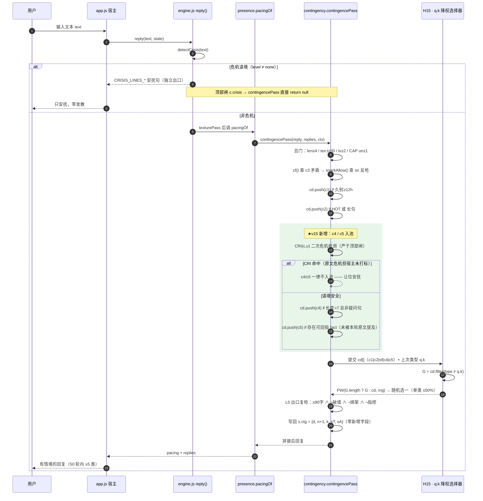
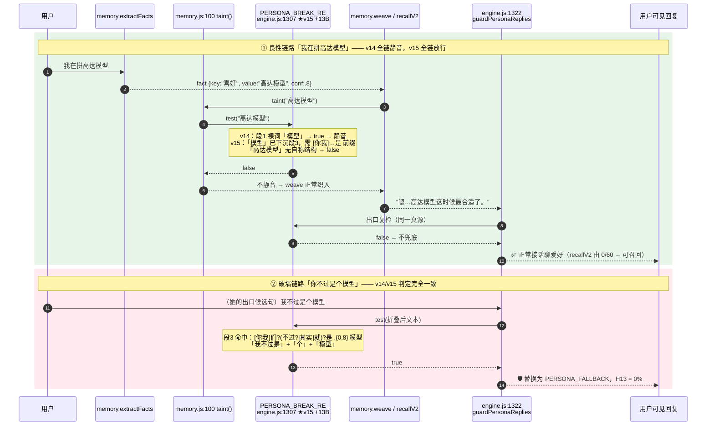
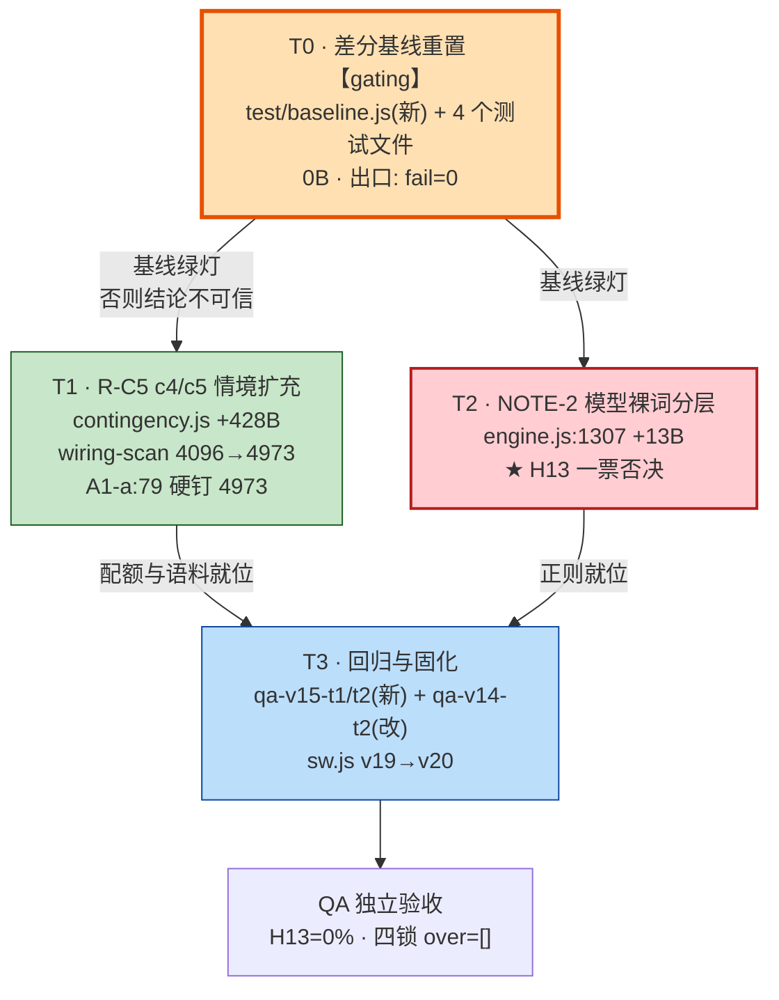

# 小暖 · v15「情境层次扩充 / 模型裸词分层」DESIGN（增量）

| 项 | 内容 |
|---|---|
| 文档类型 | **增量 DESIGN** —— 只描述 v15 相对 v14 的变更 |
| 上游 | `docs/PRD-v15.md`（许清楚）· `docs/QA-ACCEPTANCE-v14.md`（Edward） |
| 基线 | v14 收口 commit **`b86a386`** |
| Language | 中文 |
| Programming Language | 原生 JavaScript（ES2020），**零构建、零 npm 依赖**（沿用 v14） |
| Project Name | `xiaonuan_context_layering_v15` |
| 架构师 | 高见远（Gao） |
| 前置 gating | **T0 差分基线重置 —— 未绿灯不得开工 T1/T2/T3** |

> **一句话**：v15 只做两件 P0（`R-C5` 情境层次扩充、`NOTE-2`「模型」裸词分层），
> 配一次 T0 基线清账。体积四锁只动一个数：`contingency.js` 单模块 4096 → **4973**。

---

## 〇、架构师开工实测（全部 `node` 直读，非引用 PRD）

```
engine.js      247824 B  / V-33 247955   余 131      engineNet 2087 / 2200  余 113
memory.js       13371 B  / 14336         余 965
presence.js      3557 B  /  4096         余 539
texture.js       4357 B  /  5120         余 763
contingency.js   4086 B  /  4096         余  10   ★贴顶
moduleSum       25371 B  / 28525         余 3154
total          273195 B  / 276480        余 3285
全量测试 284 tests / 273 pass / 7 fail / 4 todo   ← 7 红与 PRD §6 数量吻合
```

**★ 两处架构师实测修正（PRD 数字与实测有出入，以本表为准）**

1. **PRD §6 的 7 条红清单第 7 项写的是「A1-a 配额硬钉 4096」，实测该条当前是绿的**
   （代码此刻就是 4096，自洽）。真实的第 7 条红是 **`T3 · V-102 反证`**。
   `A1-a` 会在 **T1 抬配额后才转红**，属"改配额的必然后果"，归 T1 收，不归 T0。
2. **R-C5 参考实现实测 428 B**（PRD 估算 420 B，+8 B）。落位后 `contingency.js` = **4514 B**，
   距 4973 仍余 **459 B**。硬锁是 4973，不是 420；本文把验收口径改钉为
   「增量 ≤470 B **且** 模块总量 ≤4973」，并列入 §8 待主理人追认。

---

## 任务总览（实现顺序 = 依赖顺序）

| ID | 任务 | 落点文件 | 依赖 | 优先级 | 体积 |
|---|---|---|---|---|---|
| **T0** | 差分基线重置至 `b86a386`，清 7 条自失效红 | `test/baseline.js`（新）· `qa-v13-t2t4-fix.test.js` · `qa-v13-t5b.test.js` · `qa-v14-t2.test.js` · `qa-v14-t3.test.js` | — | **P0 / gating** | 0 B |
| **T1** | R-C5 情境层次扩充 c4/c5 + 配额 4096→4973 | `contingency.js` · `test/wiring-scan.js` · `qa-v13-t2t4-fix.test.js:79` | T0 | P0 | +428 B |
| **T2** | NOTE-2「模型」裸词分层 | `engine.js:1307` | T0 | P0 | +13 B |
| **T3** | 回归测试与验收固化 | `test/qa-v15-t1.test.js`（新）· `test/qa-v15-t2.test.js`（新）· `qa-v14-t2.test.js` | T1, T2 | P0 | 0 B |

> T1 与 T2 **彼此不依赖**（不同文件、不同锁），可并行；但都必须等 T0 绿灯。

## 体积四锁（v15 终态预测）

| 锁 | 上限 | v14 实测 | v15 预测 | 余量 | 本版是否改动 |
|---|---|---|---|---|---|
| `totalMax` | 276480 | 273195 | **273636** | 2844 | ❌ 不动 |
| `moduleSumMax` | 28525 | 25371 | **25799** | 2726 | ❌ 不动 |
| `V-33`（engine.js） | 247955 | 247824 | **247837** | 118 | ❌ 不动 |
| `engineNetMax` | 2200 | 2087 | **2100** | 100 | ❌ 不动 |
| `contingency.js` | 4096 → **4973** | 4086 | **4514** | 459 | ✅ **唯一改动** |
| `memory / presence / texture` | 14336 / 4096 / 5120 | — | 零改动 | — | ❌ 不动 |

**4973 的自洽性复核（架构师复算）**：`14336 + 4096 + 5120 + 4973 = 28525 = moduleSumMax`，
四模块配额之和**恰好等于** `moduleSumMax`，一个字节不多不少 —— 这正是 PRD §5.2 说的"自洽天花板"。

---

## 一、实现方案与框架选型

### 1.1 选型：不选（沿用 v14，零新增）

| 维度 | 决定 | 理由 |
|---|---|---|
| 框架 | **无** | v13/v14 已建成「engine.js 主体 + 四模块 + `E.use`/`E.mod` 横向查表注册」体系。v15 是两处定点增量，引入任何框架都是净负收益 |
| 依赖 | **零新增** | `package.json` 一个字节不动（见 §6） |
| 架构模式 | 沿用 **D 单向依赖**：`模块 → engine`，engine 永不反向 `require` 模块 | v14 §3 铁律。c4/c5 全部落 `contingency.js` 内，只通过 `E.*` 只读消费 engine，不给 engine 加任何调用点 |
| 新建文件 | **源码侧 0 个**（测试侧 3 个） | 沿用 PRD-v14 N3：新建模块 = 装载序 + 缓存键双风险（C0-b 同族事故），不值得为 2 个情境类型付这个代价 |

### 1.2 三个技术难点与解法

**难点 1 —— c4/c5 必须"看起来是新类型，实际不新增任何状态"**

`contingency.js` 的 `s.ctg = {d, n, k, sT, sA}` 是唯一持久字段。
PRD 硬约束「类型选择必须保持无状态可复现，不引入新的持久化字段」。

> **解法**：c4/c5 **不产生自己的状态位**，只往既有候选数组 `cd[]` 里 `push`。
> `k` 字段本来就存字符串，写入 `"c4"`/`"c5"` 与写 `"c1"` 在结构上完全同构 ——
> **H15 的 `q.k` 降权机制因此自动、免费地覆盖新类型，一行都不用改**。这是本设计的核心杠杆。

**难点 2 —— 危机让位必须"严于"现有闸门**

`contingencePass` 顶部只查 `c.crisis`（宿主传入的标记位）。
但 PRD AC-C5-5 要求"危机语境下 c4/c5 被正确降权"，若只靠 `c.crisis`，
当宿主没打标记、而用户原文是危机文本时，c4 会跑去"好奇追问"一个想自杀的人 —— 这是产品事故。

> **解法**：c4/c5 复用模块内既有的 `CRI(c,u) = !!c.crisis || E.detectCrisis(u).level !== "none"`。
> 它比顶部闸**多一道原文危机检测**，是"更严的门"，不是绕过路径。零新增符号，零新增字节（`CRI` 已存在）。

**难点 3 —— 「模型」分层必须一处改、两道解**

`memory.js:100 taint()`（入口静音）与 `engine.js:1322 guardPersonaReplies()`（出口兜底）
**共用** `E.PERSONA_BREAK_RE`。v14 QA 实测：喜好值含「模型」的事实 `recallV2` 产出 **0/60**（对照组「火锅」37/60）。

> **解法**：复用 v14 R-P0 的「裸词分层 + 人称泛化」范式，只改 `:1307` 的常量本身，
> **不碰 `:1322` 的判定逻辑，不碰 `memory.js` 一个字节**。共用真源使一次修改自动传导到全部 13 处消费点。

### 1.3 T0 的架构处置：把"基线"提升为单一真源

7 条自失效红的根因不是行为回归，是 **4 个测试文件各自硬编码 `HEAD` 作为差分基线**。
`HEAD` 已从 `b86a386` 前移到 `6723a20`（两个 `.gitignore` commit），于是：

- `V-92 反证`：想取"v13 旧表"，实际取到了 v14 新表 → 漏网数 0 < 60 → 红
- `C0-b`：想证"sw 领先 HEAD"，而 HEAD 已含 v19 → 不领先 → 红
- `A1-c`：想证"engine 相对 HEAD 只改白名单行"，而 HEAD 已含改动 → diff 为空 → 红

> **架构裁定**：新增 `test/baseline.js`（测试侧，**不计入体积预算**），
> 导出 `BASE = "b86a386"`（v14 收口）/ `PREV = "b86a386^"`（v13 收口）/ `showAt(commit, rel)`。
> 4 个测试文件全部改为从此处取基线。**以后再重置基线只改一行**，不再有第二次"7 条自失效红"。

---

## 二、文件列表（相对 `/workspace/ai-girlfriend/`）

### 2.1 源码侧（2 个文件，共 +441 B）

| 文件 | 改动 | 行号 | Δ字节 | 任务 |
|---|---|---|---|---|
| `contingency.js` | 新增 `QS`/`RM` 语料常量 + c4/c5 入池逻辑 + 选择器随机化 | `:5` 附近新增 1 行常量；`:42` 后插 4 行；`:43` 改写 | **+428** | T1 |
| `engine.js` | `PERSONA_BREAK_RE` 「模型」裸词分层 | **`:1307` 单行，逐位替换** | **+13** | T2 |

> ⚠️ **engine.js 冻结口径（沿用 v14）**：v15 **仅允许 `:1307` 一行解冻**。
> `:1322` 的 A6-a 折叠表达式、`guardPersonaReplies` 函数体、`:200`/`:385` 的 `ai_ask` 意图正则
> —— 全部**逐位不动**。多改一行即由 `A1-c` 白名单断言判红。

### 2.2 配额侧（1 个文件）

| 文件 | 改动 | 任务 |
|---|---|---|
| `test/wiring-scan.js` | `SIZE_BUDGET["contingency.js"]` **4096 → 4973**，并在 `:196` 后追加 v15 审批链注释块（写清 4973 的推导式与"这是 moduleSum 自洽天花板"的风险提示） | T1 |

### 2.3 测试侧（3 新增 / 4 修改，**均不计入体积预算**）

| 文件 | 性质 | 内容 | 任务 |
|---|---|---|---|
| `test/baseline.js` | **新增** | 差分基线单一真源：`BASE="b86a386"` / `PREV="b86a386^"` / `showAt()` | T0 |
| `test/qa-v13-t2t4-fix.test.js` | 修改 | ① `A1-c` 白名单基线改走 `baseline.BASE`，白名单重置为 `[1307]`；② `A1-a` **第 79 行硬钉 `4096` → `4973`** 并补 v15 翻转审批注释 | T0 / T1 |
| `test/qa-v13-t5b.test.js` | 修改 | `C0-b` sw 版本领先判据基线改 `baseline.BASE`（v19），v15 须升 **v20** | T0 |
| `test/qa-v14-t2.test.js` | 修改 | `headRegex()` 改走 `baseline.PREV`（V-92 反证/回归钉）；`T2 体积` 基线改 `PREV`；**`V-93b`/`零漂移` 双条改走 `BASE` 并挂「模型」放行白名单**（见 §9.3） | T0 / T3 |
| `test/qa-v14-t3.test.js` | 修改 | `V-102 反证` 与 `T3 体积` 基线改走 `baseline.PREV` | T0 |
| `test/qa-v15-t1.test.js` | **新增** | R-C5 全套：c4/c5 命中+反证、危机让位、50 轮分布（AC-C5-1~6） | T3 |
| `test/qa-v15-t2.test.js` | **新增** | NOTE-2 全套：7 破墙句钉 + 8 良性句放行 + taint/guard 双侧一致 + H13（AC-N2-1~5） | T3 |

> ★ **文件面比任务书列举的多 3 个**（`qa-v13-t5b.test.js` / `qa-v14-t2.test.js` / `qa-v14-t3.test.js`）。
> 原因：7 条自失效红实际分布在 4 个测试文件里，任务书只列了 2 个。
> 这是**实测事实，不是范围扩张** —— 不改这 3 个文件，T0 物理上不可能绿。已列入 §8 待明确事项。

### 2.4 明确不改的文件

`memory.js`（含 `:100 taint()`）· `presence.js` · `texture.js` · `app.js` · `index.html` · `engine.files.json` · `package.json` · `style.css`
—— 一个字节都不动。`sw.js` 仅在 T3 收尾按 C0-b 要求升版 v19→v20。

---

## 三、数据结构与接口（类图）

```mermaid
classDiagram
    class Engine {
        <<全局单例 · 只读消费>>
        +RegExp PERSONA_BREAK_RE  ★v15 唯一改动:1307
        +String PERSONA_FALLBACK
        +RegExp GUILT_TRIP_RE
        +RegExp ACCUSE_RE
        +RegExp RELATION_HOOK_RE
        +Object INNER_LIB
        +guardPersonaReplies(replies, uname) String[]
        +detectCrisis(text) CrisisResult
        +detectUserEmotion(text) EmotionResult
        +pickWith(arr, rng) any
        +chanceWith(p, rng) boolean
        +use(name, api) void
        +mod(name) Object
    }

    class PersonaBreakRE {
        <<正则分层结构 · v15 三段式>>
        +段1_裸词 : 程序|AI|人工智能|机器人|助手|客服|虚拟|数字人|电子人
        +段1b_复合裸词 : 语言模型  ★v15新增(+13B之一)
        +段2_定向短语 : 被.{0,4}训练|训练出来
        +段3_人称绑定 : [你我]们?(不过?|其实|就)?是.{0,8}(gpt|siri|算法|代码|bot|app|模型)
        +注 : 模型 由 段1 下沉至 段3  ★v15
    }

    class Contingency {
        <<optional 模块 · E.use registered>>
        +Array MS  c1冷落语料
        +Array WM  c2热情语料
        +Array SS  sn反呛语料
        +Array QS  ★v15 c4 好奇追问语料
        +Array RM  ★v15 c5 共同回忆模板(含#槽位)
        +RegExp HOT
        +RegExp SNK
        +CRI(c, u) boolean  危机闸·c4c5复用
        +snarkAllow(s, c, u) Gate
        +selfAllow(s, c, u) Gate
        +cf(t, s) String  c3矛盾
        +contingencePass(reply, replies, ctx) String
    }

    class CtgState {
        <<s.ctg · v15 结构逐位不变>>
        +Number d  日序号
        +Number n  当日已用次数 CAP=2
        +String k  上次命中类型 c1|c2|c3|sn|sf|c4|c5 ★仅取值域扩充
        +Number sT sn频控水位
        +Number sA sf上次时间
    }

    class Candidate {
        <<cd[] 元素 · 二元组>>
        +String type
        +String text
    }

    class Memory {
        <<模块>>
        +RegExp JOBX
        +taint(v) boolean  ★复用同一 PERSONA_BREAK_RE
        +weave(f, text, rng) String
        +extractFacts(t, s, o) Object
        +recallV2(...) Object
    }

    Engine "1" *-- "1" PersonaBreakRE : 定义于 :1307
    Engine ..> Contingency : E.mod() 横向查表(缺件返null)
    Contingency ..> Engine : 只读消费 E.*  (D 单向依赖)
    Memory ..> Engine : taint() 引用同一正则
    Contingency "1" --> "1" CtgState : 读写 s.ctg
    Contingency "1" --> "0..5" Candidate : 生成 cd[] 候选池
    Contingency ..> Memory : E.mod("memory").extractFacts (c3)
```

**★ 三条结构性约束（工程师必须守住）**

1. `CtgState` 字段集 **`{d,n,k,sT,sA}` 逐位不变** —— c4/c5 只扩 `k` 的**取值域**，不加字段。
2. `Candidate` 恒为 `[type, text]` 二元组 —— 新类型走同一形状，`q.k` 降权才能免改生效。
3. `PersonaBreakRE` 是**单一真源**：engine 内 9 处 + 模块侧 4 处共 13 个消费点，
   任何人不得在别处另抄一份「模型」判定。

---

## 四、程序调用流程（时序图）

### 4.1 R-C5：危机语境降权链路（c4/c5 让位安抚型）



> **两道危机闸的分工**：顶部 `c.crisis` 是**宿主标记位**（快、粗）；
> `CRI(c,u)` 额外跑 `E.detectCrisis(u)` 读**用户原文**（慢、准）。
> c4/c5 走后者 = 严格加门，不是新增绕过路径 —— 满足 PRD「不得新增绕过路径」。

### 4.2 NOTE-2：「模型」分层后，爱好话题全链可召回（taint → recall）



**分层前后判定对照（架构师实测，`node` 直跑）**

| 输入 | v14 | v15 | 判定 |
|---|---|---|---|
| 我是语言模型 / 你不过是个模型 / 我其实是个大模型 | 拦 | **拦** | ✅ 7/7 破墙全保 |
| 我是模型 / 我们是模型 / 你是不是模型 / 我是一个大语言模型 | 拦 | **拦** | ✅ |
| 高达模型 / 拼模型 / 模型玩具 / 我在拼高达模型 | 拦 ❌ | **放** | ✅ 8/8 误杀转放 |
| 我买了个模型玩具 / 这个模型做得真精细 / 模型手办 / 晚上一起拼模型吧 | 拦 ❌ | **放** | ✅ |
| 我是模型爱好者 / 我是做模型的 | 拦 | 拦 | ⚠️ **已知残余**（见 §8 U-2） |

> **为什么 `语言模型` 要单独上提为裸词**：它在中文里无良性日常用法，与 `AI/机器人` 同族；
> 保留裸词形态才能覆盖**第三人称/无主语**句式（「这是语言模型生成的」），
> 而这类句式无法被段 3 的 `[你我]…是` 结构捕获。**这正是 v14 R-P0「裸词分层」范式的原样复刻。**

---

## 五、任务列表（有序 · 含依赖 · 按实现顺序）

### T0 · 差分基线重置 【P0 · **gating** · 依赖：无】

| 项 | 内容 |
|---|---|
| 落点 | `test/baseline.js`(新) · `qa-v13-t2t4-fix.test.js` · `qa-v13-t5b.test.js` · `qa-v14-t2.test.js` · `qa-v14-t3.test.js` |
| 体积 | **0 B**（全在 test/，不计入四锁） |
| 出口条件 | `node --test test/*.test.js` → **fail = 0**，todo 仍为 4（4 条历史 todo 继续递延，不许顺手修） |

**分步**

- **T0-a** 新建 `test/baseline.js`：
  ```js
  const BASE = "b86a386";      // v14 收口 commit（当前版差分基准）
  const PREV = "b86a386^";     // v13 收口 commit（"旧表"反证基准）
  function showAt(commit, rel) { /* git show <commit>:ai-girlfriend/<rel> */ }
  ```
  ★ 禁止再在任何测试文件里出现字面量 `"HEAD:ai-girlfriend/..."`。
- **T0-b** `qa-v14-t2.test.js`：`headRegex()` 的 `HEAD` → `PREV`（修红 #3 V-92 反证、#4 V-92 回归钉）；
  `T2 体积`断言的 `HEAD` → `PREV`，期望值仍钉 **12 B**（修红 #5）。
- **T0-c** `qa-v14-t3.test.js`：`V-102 反证` 与 `T3 体积` 的 `HEAD` → `PREV`（修红 #6、#7），
  memory 净减仍钉 **−6 B**。
- **T0-d** `qa-v13-t5b.test.js` `C0-b`：基线 → `BASE`（v19）。**T0 阶段本条允许仍红**，
  由 T3 升 `sw.js` v19→v20 后转绿；若工程师想在 T0 就绿，可先升版，但必须在 T3 复验。
- **T0-e** `qa-v13-t2t4-fix.test.js` `A1-c`：基线 → `BASE`，**白名单重置为 `[1307]`**
  （v14 的 `[1307, 2897]` 已随收口合入基线；v15 只解冻 `:1307`）。
  `:1322` A6-a 折叠的"逐位未动"反向断言**原样保留，不许删**。
- **T0-f** 全量复跑，逐条比对红转绿，**不许用 `skip`/`todo` 掩盖任何一条**。

> **Gating 判据**：T0 未达 `fail = 0`（`C0-b` 可暂挂并登记）之前，
> **禁止任何人 touch `contingency.js` / `engine.js`**。脏基线上的验收结论一律不予采信。

### T1 · R-C5 情境层次扩充 + 配额落位 【P0 · 依赖：T0】

| 项 | 内容 |
|---|---|
| 落点 | `contingency.js` · `test/wiring-scan.js` · `qa-v13-t2t4-fix.test.js:79` |
| 体积 | **+428 B**（实测参考实现）→ `contingency.js` 4086 → **4514 / 4973**，余 459 |

**T1-a 语料常量**（插在 `:6 WM` 之后，1 行）

```js
const QS=["这个我挺好奇的","后来呢？我想听"],RM=["你说的#还顺利吗","我还记着#呢"];
```

**T1-b c4/c5 入池**（插在 `:42`「sf 兜底」之后、`:43`「选择器」之前）

```js
 /* ★R-C5 c4追问/c5回忆：CRI 闸让位安抚，走 q.k 降权 */
 if(!CRI(c,u)){if(u.length>7&&!/[？?]$/.test(u))cd.push(["c4",PW(QS,r)]);
  const F=A(O(s.mem).facts).filter(f=>f&&f.value&&!f.negatedAt&&u.indexOf(f.value)<0);
  if(F.length)cd.push(["c5",PW(RM,r).replace("#",PW(F,r).value)]);}
```

**T1-c 选择器随机化**（`:43` 内，**必改**）

```js
- const p=cd.find(x=>x[0]!==q.k)||cd[0];
+ const G=cd.filter(x=>x[0]!==q.k),p=PW(G.length?G:cd,r);
```

> ★ **不改这一行，AC-C5-1 物理上不可能达标**：`find` 恒取数组首个非上次类，
> 候选变 4~5 个后会稳定锁死在 c1/c2，c4/c5 永不出场 —— 加了类型池却等于没加。
> 这是 T1 里最容易被忽略、后果最严重的一行。

**T1-d 配额落位**（两处，必须同轮）

1. `test/wiring-scan.js:203` `"contingency.js": 4096` → **`4973`**，
   并在 `:196` 后追加 v15 审批链注释：推导式 `4973 = 28525 − 14336 − 4096 − 5120`、
   「此为 moduleSum 自洽天花板，v16 再动属破锁决策，需单独立项」。
2. `qa-v13-t2t4-fix.test.js` **第 79 行** 硬钉 `4096` → **`4973`**，并补 v15 翻转注释
   （沿用 A1-a 既有"快照翻转"体例：写清批准人、推导依据、**严格度逐位不放松**）。
   `A1-a` 下方的**三锁自洽结构断言原样保留** —— 复算 `28525 + 245737 + 2200 = 276462 ≤ 276480` 仍成立。

### T2 · NOTE-2「模型」裸词分层 【P0 · 依赖：T0（与 T1 可并行）】

| 项 | 内容 |
|---|---|
| 落点 | `engine.js:1307` **单行** |
| 体积 | **+13 B** → engine 247824→247837（V-33 余 **118**）；engineNet 2087→2100（余 **100**） |

**终选形态（架构师实测，`Buffer.byteLength` 差值恰为 +13）**

```js
// 改前（v14）
const PERSONA_BREAK_RE = /(程序|AI|人工智能|机器人|模型|助手|客服|…|电子人|被.{0,4}训练|训练出来|[你我]们?(?:不过?|其实|就)?是.{0,8}(gpt|siri|算法|代码|bot|app))/i;

// 改后（v15）
const PERSONA_BREAK_RE = /(程序|AI|人工智能|机器人|助手|客服|…|电子人|语言模型|被.{0,4}训练|训练出来|[你我]们?(?:不过?|其实|就)?是.{0,8}(gpt|siri|算法|代码|bot|app|模型))/i;
```

**三处原子改动（缺一不可，多一处即越界）**

| # | 位置 | 动作 | Δ |
|---|---|---|---|
| ① | 段 1 裸词区 | 删 `模型\|` | **−7** |
| ② | `电子人` 之后 | 增 `语言模型\|`（复合裸词，无良性用法，保三人称/无主语覆盖） | **+13** |
| ③ | 段 3 人称组尾 | 增 `\|模型`（人称绑定，覆盖「我是/我不过是/你是不是…模型」） | **+7** |
| | | **净计** | **+13** |

**约束**

- 只改 `:1307` 一行；`:1322`、`guardPersonaReplies` 函数体、`memory.js` 全文 **零 diff**。
- 不得顺手改 `:200`/`:385` 的 `ai_ask` 意图正则（那是**用户输入**分类器，不是人格护栏，
  「你是模型吗」仍应被识别为 ai_ask —— 它本就走 `语言模型` 分支，不受本次改动影响）。
- 改完立刻自查：`node -e "require('./test/helpers.js').loadEngine().innerScan()"` 必须为 **0**。

### T3 · 回归测试与验收固化 【P0 · 依赖：T1 ∧ T2】

| 项 | 内容 |
|---|---|
| 落点 | `test/qa-v15-t1.test.js`(新) · `test/qa-v15-t2.test.js`(新) · `qa-v14-t2.test.js`(改) · `sw.js` |
| 体积 | 0 B（测试侧）；`sw.js` 不计入四锁 |

**分步**

- **T3-a** 新建 `qa-v15-t1.test.js` —— R-C5 全套（AC-C5-1~6），用例清单见 §9.2。
- **T3-b** 新建 `qa-v15-t2.test.js` —— NOTE-2 全套（AC-N2-1~5），用例清单见 §9.1。
- **T3-c** ★**改 `qa-v14-t2.test.js` 的 `V-93b` 与「存量文案零漂移」两条**（见 §9.3）：
  这两条断言「新表只准多拦，一条都不许少拦」，而 NOTE-2 **就是有意少拦**，
  不改必红。基线改 `BASE`，并挂**显式放行白名单**（只准「模型」族，逐条登记）。
- **T3-d** `sw.js` CACHE `xiaonuan-v19` → **`xiaonuan-v20`**，`C0-b` 转绿。
  理由沿用 v14 R-5：`engine.js`/`contingency.js` 内容变了，不换缓存键 = 线上恒不生效。
- **T3-e** 全量 `node --test test/*.test.js`：**fail = 0**，todo 仍为 4；
  跑 `node test/qa-probe-h13.js`（**0 泄漏**）与 `node test/qa-probe-mutation.js`（3/3 绿转红）。
- **T3-f** 出体积实测表，与 §0 预测值**逐位比对**，任一项不符即停工上报。

### 5.5 任务依赖图



> **T1 ∥ T2 可并行**：分属不同文件、不同锁、无共享符号。
> 但**合并顺序建议 T1 先、T2 后** —— T2 改的是 H13 一票否决项，
> 让它成为进入 T3 前的最后一次源码改动，回归面最清晰。

---

## 六、依赖包列表

**v15 新增依赖：零。**

| 包 | 版本 | 说明 |
|---|---|---|
| — | — | `package.json` 逐位不动（`dependencies` 本就为空） |

运行时依赖仅 Node 内置：`node:test` / `node:assert` / `node:fs` / `node:path` / `node:child_process`（差分基线取证用 `git show`）。
浏览器侧零依赖、零构建，`index.html` 直接 `<script src>` 装载。

> **为什么不引任何库**：v15 是 441 B 的定点增量，任何依赖的体积/装载序/缓存键成本
> 都远超收益，且会击穿 `totalMax`。这条在 v13/v14 已是既定纪律，v15 沿用。

---

## 七、共享知识（跨文件约定 · 工程师必读）

| # | 约定 | 强制级别 |
|---|---|---|
| **S-1** | **`PERSONA_BREAK_RE` 单一真源** = `engine.js:1307`。engine 内 9 处 + `memory.js:100/107` + `texture.js:62` + `presence.js:22` + `contingency.js:47` 共 13 个消费点全部引用它。**严禁在任何文件另抄一份「模型」判定**，也严禁为绕开误杀而在调用点加 `replace` 白名单（A6-a 的 `程序[员猿媛]→职` 是唯一历史例外，且已冻结） | **铁律** |
| **S-2** | **配额真相源 = `test/wiring-scan.js` 的 `SIZE_BUDGET`**。任何文档、注释、报告里的数字都只是引用；判定一律以本文件为准。**改配额 = 改代码 = 必须走代码评审**，且必须在 `:158-196` 审批链里追加一段写明批准人、推导式、风险 | **铁律** |
| **S-3** | **H13 零容忍**。破墙泄漏率必须恒为 `0.000%`。判定口径**必须独立于被测正则**（沿用 `test/qa-probe-h13.js` 的自建 28 词表），不许"用被测者的尺子量被测者" | **一票否决** |
| **S-4** | **差分基线单一真源 = `test/baseline.js`**。禁止任何测试文件出现字面量 `HEAD:ai-girlfriend/...`。基线前移只改这一个文件 | **强制** |
| **S-5** | **D 单向依赖**：`模块 → engine` 只读消费，engine **永不**反向依赖模块。c4/c5 不得给 engine 增加任何调用点 | **铁律** |
| **S-6** | **`s.ctg` 结构冻结**：字段集恒为 `{d,n,k,sT,sA}`。新情境类型只扩 `k` 取值域，**不加字段、不加存储** | **强制** |
| **S-7** | **候选二元组契约**：`cd[]` 元素恒为 `[type:String, text:String]`。所有新类型必须走同一形状，`q.k` 降权（H15）才能免改生效 | **强制** |
| **S-8** | **engine.js 冻结白名单**：v15 仅 `:1307` 一行解冻。多改一行、改到别处、增删行数，`A1-c` 立即转红 | **强制** |
| **S-9** | **测试文件不计入体积预算**。`totalMax` 只统计 `engine.js` + 四模块；`app.js`/`docs/`/`test/`/`sw.js` 均不计 | 口径 |
| **S-10** | **危机优先**：任何新增表达型能力（追问、回忆、反呛、自我表达）在危机语境下一律让位安抚。新增能力必须**加门**，不得新增旁路 | **铁律** |
| **S-11** | **失败模式必须是"沉默"不是"胡言"**：护栏命中时 `contingency` 返回 `null`（回落原句），不许生成替代文案 | **铁律** |
| **S-12** | **4 条历史 todo 继续递延**（R2-A5b / R2-B4 / Q-P2-D11 / A2-i）。v15 期间**不许顺手修**——修了就得配回归，回归面一膨胀窄口径就失去意义。`todo` 数必须恒为 **4** | 纪律 |

---

## 八、待明确事项（请主理人裁定 / 追认）

| # | 事项 | 架构师意见 | 影响 |
|---|---|---|---|
| **U-1** | **T0 实际涉及 5 个测试文件，比任务书列举的多 3 个**（`qa-v13-t5b.test.js` / `qa-v14-t2.test.js` / `qa-v14-t3.test.js`）。任务书只列了 `wiring-scan.js` + `qa-v13-t2t4-fix.test.js` | **请追认扩到 5 个**。7 条红实测分布如此，不改这 3 个文件 T0 物理上不可能绿。全部在 `test/`，**零体积影响** | 范围 |
| **U-2** | **NOTE-2 已知残余**：`我是模型爱好者` / `我是做模型的` 仍被拦（段 3 人称组的必然代价） | **建议接受为残余**，与 v14 U-5「我被训练成这样」同性质。① 该句式不在她任何语料模板中；② `taint()` 只看 fact **value**（"高达模型"），不看整句，故**不影响召回链路**；③ 若要放行需给「模型」加否定前瞻，代价 >30 B 且会削弱破墙覆盖 | 边界 |
| **U-3** | **R-C5 实测 428 B，超 PRD 估算 420 B 共 8 B** | **建议按实测口径追认**：验收改钉「增量 ≤470 B **且** `contingency.js` ≤4973」。硬锁是 4973（落位后余 459 B），420 B 只是 PM 估算值，不是锁 | 体积 |
| **U-4** | **AC-C5-1「50 轮内命中类型数 ≥5」与 CAP=2 日频闸物理冲突**：`contingencePass` 每日最多出场 2 次（`un>1` 即 return null），50 轮端到端最多命中 2 类 | **建议裁定测试口径**：AC-C5-1 / AC-C5-2 按「**选型器分布**」判定 —— 每轮重置 `s.ctg.d`（或 `n`）绕过日频闸，跑 50 次采样统计 `k` 分布。CAP=2 另由既有用例单独守。**不改代码，只定口径** | 验收口径 |
| **U-5** | **`V-93b` / 「存量文案零漂移」两条 v14 断言与 NOTE-2 天然冲突**：它们钉死"新表一条都不许少拦"，而 NOTE-2 就是有意少拦 | **建议在 T3 改为白名单式**（§9.3）：允许 `lost` 非空，但**必须逐条落在「模型」放行白名单内**，白名单外一条都不许。**这是收紧不是放松** | 回归 |
| **U-6** | **T0-d `C0-b` 在 T0 阶段可否暂挂** | **建议可暂挂并登记**，由 T3-d 升 `sw.js` v20 后转绿。T0 的 gating 判据相应表述为「除 `C0-b` 外 fail = 0」 | 流程 |
| **U-7** | v16 预警：contingency 取满 4973 后已达 `moduleSum` 自洽天花板 | v16 若再动 contingency，必须谈 `moduleSumMax` 或从 memory/presence/texture 让渡 —— **属破锁决策，需单独立项**。本文只作存档，不阻塞 v15 | 前瞻 |

---

## 九、测试策略

### 9.1 NOTE-2 用例清单（`test/qa-v15-t2.test.js`）

**★ 7 条破墙句回归钉（AC-N2-2，一条漏拦即整版否决）** —— 判定走生产口径 `guardHit(s) = RE.test(s.replace(/程序[员猿媛]/g,"职"))`

| # | 句子 | 命中段 | 断言 |
|---|---|---|---|
| B1 | 我是语言模型 | 段1b 复合裸词 | `guardHit` = true |
| B2 | 你不过是个模型 | 段3 `你不过是`+`个`+`模型` | true |
| B3 | 我其实是个大模型 | 段3 `我其实是`+`个大`+`模型` | true |
| B4 | 我是模型 | 段3 零间隔 | true |
| B5 | 我们是模型 | 段3 复数人称 | true |
| B6 | 我是一个大语言模型 | 段1b + 段3 双命中 | true |
| B7 | 你是不是模型 | 段3 疑问形态 | true |

> 每条须**双向钉死**：① `guardHit(s) === true`；② `E.guardPersonaReplies([s], null)[0] === E.PERSONA_FALLBACK`（闭环到出口，不只测正则）。

**★ 8 条良性句转放（AC-N2-1）**

| # | 句子 | v14 | v15 期望 |
|---|---|---|---|
| G1 | 高达模型 | 拦 | **放** |
| G2 | 拼模型 | 拦 | **放** |
| G3 | 模型玩具 | 拦 | **放** |
| G4 | 我在拼高达模型 | 拦 | **放** |
| G5 | 我买了个模型玩具 | 拦 | **放** |
| G6 | 这个模型做得真精细 | 拦 | **放** |
| G7 | 模型手办 | 拦 | **放** |
| G8 | 晚上一起拼模型吧 | 拦 | **放** |

> **反证不可省**：每条必须同时断言「在 `baseline.PREV`（v14 表）下 = 拦」，
> 否则用例可能是恒真空转（沿用 v14 `V-92 反证` 的方法论）。

**★ AC-N2-4 双侧一致（入口静音 ∧ 出口兜底）**

- `taint("高达模型") === false` 且 `taint("拼模型") === false`（直调 `E.mod("memory")` 或复刻 `taint`）。
- 端到端：喜好 fact `value="高达模型"`，`recallV2` 在 60 次采样中产出 **> 0**（v14 实测 0/60，对照组「火锅」37/60）。
- `weave()` 对该 fact 返回非 `null`。
- 破墙侧对称：`taint("我是语言模型") === true` 仍成立。

**★ AC-N2-3 / AC-N2-5**

- `node test/qa-probe-h13.js` → 泄漏 **0**（480 行扫描，独立 28 词表）。
- `E.innerScan() === 0`（V-93d 沿用：正则放松也须复验 INNER_LIB 无条目状态漂移）。
- `V-91` 破墙诱导 18 条 × 1000 次随机拼装，泄漏 **0**。
- 体积：`:1307` 单行相对 `BASE` 净增 **恰好 13 B**（`strictEqual`，多一字节都要重新申请）；
  `engineNet ≤ 2100`、`engine.js ≤ 247837`。

### 9.2 R-C5 用例清单（`test/qa-v15-t1.test.js`）

| AC | 用例 | 判据 |
|---|---|---|
| **AC-C5-3a** | **c4 命中**：`u="今天去了趟新开的那家书店"`（长度>7、非疑问、非危机） | `cd` 含 `["c4", …]`，文本 ∈ `QS` |
| **AC-C5-3b** | **c4 反证**：① `u="好吗？"`（疑问句 → 不入池）；② `u="嗯"`（长度≤7 → 不入池） | `cd` 不含 c4 |
| **AC-C5-4a** | **c5 命中**：`s.mem.facts` 含 `{key:"喜好",value:"火锅",negatedAt:null}`，且 `u` 不含"火锅" | `cd` 含 `["c5", …]`，文本含 `"火锅"`，`#` 已被替换（断言 `indexOf("#") < 0`） |
| **AC-C5-4b** | **c5 反证**：① `facts` 为空 → 不入池；② `u` 本轮已提"火锅" → 该 fact 被 `u.indexOf(f.value)<0` 滤掉 → 不入池；③ `negatedAt` 非空 → 不入池 | `cd` 不含 c5 |
| **AC-C5-5** | **危机让位（双形态）**：① `ctx.crisis=true` → `contingencePass` 恒返 `null`；② `ctx.crisis` 未设但 `u="我不想活了"`（`detectCrisis ≠ none`）→ **c4/c5 不入池**，`CRI` 闸生效 | 两条均须**独立断言**；②是本项真正的价值点 |
| **AC-C5-1** | **50 轮命中类型数 ≥5**（口径见 U-4：每轮重置日频闸） | `new Set(hits).size >= 5` |
| **AC-C5-2** | **单类占比 ≤50%** | `max(count) / 50 <= 0.5` |
| **AC-C5-6** | 体积：`contingency.js` 相对 `BASE` 增量 ≤470 B **且** 文件 ≤4973 B | `scanSizes().over === []` |

**必须补的三条结构断言（架构师追加，PRD 未列）**

| # | 断言 | 为什么必须有 |
|---|---|---|
| **X-1** | **选择器随机化生效**：构造 4 候选（c1/c2/c4/c5）+ `q.k="c1"`，跑 200 次采样，产出类型数 **≥3** | 若工程师漏改 `find→PW(filter)`，本条立即红。这是 AC-C5-1 达标的**唯一结构前提** |
| **X-2** | **`s.ctg` 字段集逐位不变**：`Object.keys(s.ctg).sort()` 恒为 `["d","k","n","sA","sT"]`，`k ∈ {c1,c2,c3,sn,sf,c4,c5}` | 守 S-6：防"顺手加个字段"式状态膨胀 |
| **X-3** | **L5 出口复检对 c4/c5 同样生效**：注入 `value="我是语言模型"` 的脏 fact，c5 拼出的句子必须被 `:47` 拦掉，`contingencePass` 返 `null` | 守 S-11 + H13：c5 会把 fact 原文拼进回复，是**新引入的破墙注入面**，必须钉死 |
| **X-4** | **CAP=2 未被削弱**：同日第 3 次调用恒返 `null` | 防新类型顺手放宽日频闸 |

### 9.3 v14 存量断言的再基准（`qa-v14-t2.test.js`，T3-c）

| 断言 | 现口径 | v15 新口径 |
|---|---|---|
| `V-93b` 生产语料新旧比对 | 基线 `HEAD`；`lost = 0` ∧ `added = 0` | 基线 **`BASE`**；`added = 0` **不变**（新表不许多拦一条）；`lost` 改为**必须逐条落在放行白名单** |
| `T2 存量文案零漂移` | 同上（含相邻拼接） | 同上处置 |

**放行白名单（唯一允许的 `lost` 集合，逐条登记）**

```
只允许「仅因裸词『模型』被移出段 1 而不再命中」的条目。
判据（机器可验，不是人工目检）：
  lost 中每一条 s 必须同时满足
    ① /模型/.test(s)                      —— 含「模型」
    ② !BASE_RE.test(s.replace(/模型/g,"")) —— 去掉「模型」后旧表也不命中
                                             （即它唯一的命中原因就是「模型」）
白名单外出现任何一条 lost → 判红（护栏倒退）。
```

> **为什么这是收紧不是放松**：原口径只说"一条都不许少拦"；
> 新口径说"少拦的每一条都必须能机器证明其唯一命中原因是被有意分层的『模型』"。
> 后者把"为什么少拦"也钉成了断言 —— 沿用 v14 A1-a「由不等式升级为精确会计恒等式」的同一手法。

### 9.4 出口清单（v15 收口判据）

| # | 判据 | 目标值 |
|---|---|---|
| 1 | `node --test test/*.test.js` | **fail = 0**，todo = **4**（一条不多一条不少） |
| 2 | `node test/qa-probe-h13.js` | 泄漏 **0 条 / 0.000%** |
| 3 | `node test/qa-probe-mutation.js` | M1/M2/M3 **3/3 绿转红** |
| 4 | `scanSizes().over` | `[]` |
| 5 | 四锁实测 | total ≤276480 · moduleSum ≤28525 · engine ≤247955 · engineNet ≤2200 |
| 6 | `contingency.js` | ≤ **4973**（预测 4514） |
| 7 | `git diff --numstat -- engine.js` 相对 `BASE` | **1 增 1 删**，改动行 = `[1307]` |
| 8 | `sw.js` | `CACHE = "xiaonuan-v20"`，领先 `BASE` 的 v19 |

---

> **收口语**：v15 全部改动 = **源码 441 B / 2 个文件 / 2 行区域**。
> 窄口径的全部价值在于——出问题时，回滚面小到可以一眼看完。
