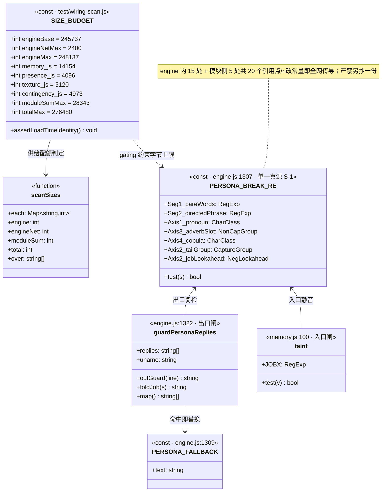
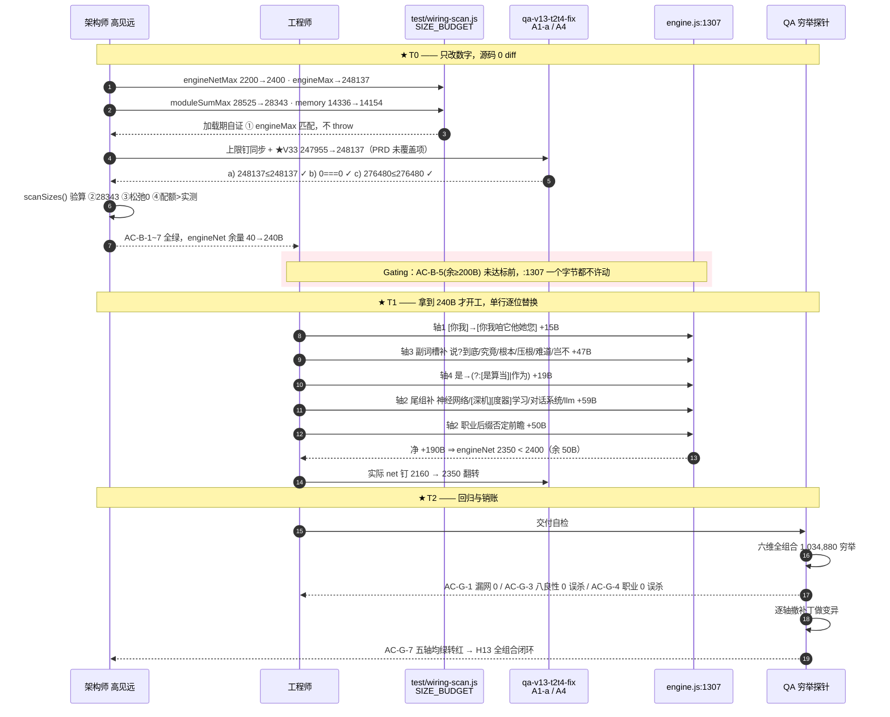
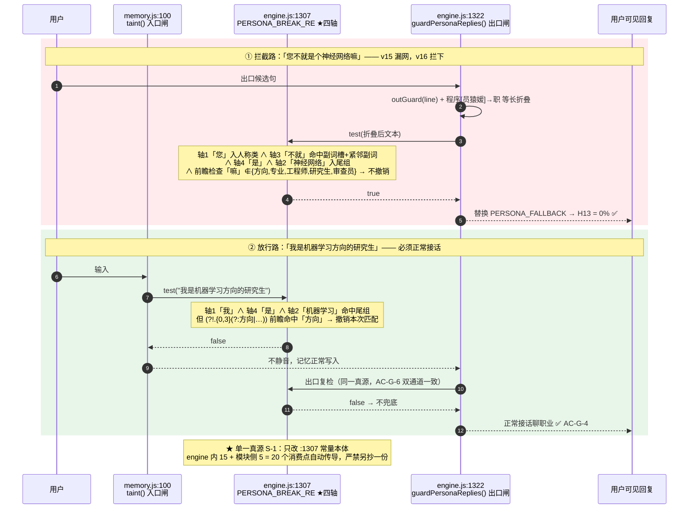
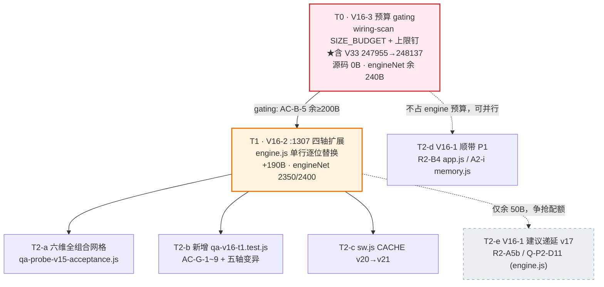

# DESIGN-v16：破墙护栏全组合闭环与 engine 体积预算重谈（增量设计）

> 一句话：**T0 只改数字不改源码**（腾 240B）→ **T1 只改 `:1307` 一行**（花 190B）→ **T2 回归+缓存键+顺带**。
> 三段严格串行，gating 由体积恒等式把守。

| 项 | 值 |
|---|---|
| 架构师 | 高见远 |
| 文档类型 | **增量 DESIGN**（只描述 v16 相对 v15 的变更） |
| 承接 | `PRD-v16.md`（已采纳）· `DESIGN-v15.md` · `QA-ACCEPTANCE-v15.md` |
| 技术栈 | 原生 JavaScript（ES2020），零构建、零依赖、纯 JS 模块引擎（沿用 v15） |
| 体积路径 | **路径 A（让渡，不破 270KB）** —— 主理人已裁定 |
| 基线实测 | `scanSizes()` 直驱：engine 247897 / engineNet 2160 / moduleSum 25803 / total 273700 / over=[] |

---

## 0. 任务序总表（详见 §5）

| ID | 名称 | 落点 | 依赖 | 优先级 | 体积 |
|---|---|---|---|---|---|
| **T0** | V16-3 预算 gating：抬上限 + 改上限钉 | `test/wiring-scan.js` + 4 个体积断言测试 | — | **P0·gating** | 源码 0B |
| **T1** | V16-2 `:1307` 四轴扩展 | `engine.js:1307` | **T0（AC-B-5 达标）** | **P0** | **+190B** |
| **T2** | 回归穷举网格 + `sw.js` v21 + V16-1 顺带 | 新增 v16 测试 / 探针 / `sw.js` / 各模块 | T1 | P0(前两项)/P1(顺带) | ≤ 余量 |

## 0.1 体积硬约束（T0 后目标值 · 已逐条验算，见 §5.0）

```
engineBase   245737 (永不许动)      engineNetMax  2200 → 2400   (+200)
engineMax    247937 → 248137        moduleSumMax 28525 → 28343   (−182)
memory.js 配额 14336 → 14154 (−182)  presence 4096 / texture 5120 / contingency 4973 (不动)
totalMax     276480 (不动，守住 270KB 承诺)
```

**四锁恒等式**（`scanSizes()` 实测直驱，非引用 PRD 算术）：

| # | 恒等式 | 验算 | 判定 |
|---|---|---|---|
| ① | `engineMax = engineBase + engineNetMax` | `248137 = 245737 + 2400` | ✓ |
| ② | `Σ(4 模块配额) = moduleSumMax` | `14154+4096+5120+4973 = 28343` | ✓ |
| ③ | `engineBase+engineNetMax+moduleSumMax ≤ totalMax` | `245737+2400+28343 = 276480 ≤ 276480`（松弛 **0**） | ✓ |
| ④ | 各配额 > 各实测 | memory 14154>13371(余783) / presence 4096>3557 / texture 5120>4357 / contingency 4973>4518 | ✓ |

> ⚠ **本文档 §5.0 记录了一处 PRD 未覆盖的连带破锁项（`V33 = 247955` 硬编码），已在设计中纠正并上报主理人。**

---

## 1. 实现方案与框架选型

### 1.1 选型结论：不引入任何框架

沿用 v15 的**纯 JS 模块引擎**：`engine.js`（薄接线 + 护栏常量）+ 4 个 optional 模块，
`engine.files.json` 声明装载序，`index.html` / `sw.js` 双路装载，Node 侧由 `test/helpers.js` 拼接。

v16 两项 P0 的性质决定了「零新框架」是唯一合理解：

- **V16-3 是纯数字变更**：只动 `SIZE_BUDGET` 字面量与其镜像断言，源码 0 diff。引入任何工具都是负收益。
- **V16-2 是单行正则替换**：`PERSONA_BREAK_RE` 是**单一真源**（S-1），engine 内 15 处引用
  + 模块侧 5 处引用（`memory.js:100 taint()` 等）全部自动传导。改常量即全网生效，
  这正是 v12 起就定下的架构红利 —— **绝不能**为了「好读」把正则拆成多个变量或搬进模块，
  那会立刻制造第二真源并击穿 H13。

### 1.2 三大技术难点与对策

| 难点 | 本质 | 对策 |
|---|---|---|
| **D1 预算死锁** | `:1307` 仅余 40B，V16-2 最小需 117B —— 物理写不进去 | T0 前置 gating：先抬 `engineNetMax` 至 2400（余 240B），**AC-B-5 未绿前 `:1307` 一字节不许动** |
| **D2 拦截 / 误杀的零和** | 轴2 粗暴扩词实测致职业句 10/10 误杀（复刻 NOTE-2 灾难） | **保守词表 + 职业后缀否定前瞻**双闸；严禁 `系统/软件/数据/脚本` 入尾组 |
| **D3 断言空转** | v15 教训：照着实现写用例 → 实现有洞而测试全绿 | 每轴独立**变异测试**（AC-G-7）：撤任一轴补丁，对应断言必须绿转红 |

### 1.3 架构模式

**单一真源 + 双通道复检**：`PERSONA_BREAK_RE`（数据）与 `guardPersonaReplies()`（策略）分离；
入口闸 `memory.js:100 taint()` 与出口闸 `engine.js:1322` 共用同一常量，
构成「输入不落盘 / 输出不透出」的双向密闭 —— AC-G-6 逐条比对两通道结论必须相同。

---

## 2. 文件列表（仅变更项 · 相对路径）

### 2.1 源码侧

| 相对路径 | 变更 | 任务 | 体积影响 |
|---|---|---|---|
| `engine.js` | **仅 :1307 单行逐位替换**（PERSONA_BREAK_RE 四轴扩展）。`:1322` / `:2897` 逐位零 diff | T1 | +190B（net 2160→2350） |
| `sw.js` | `CACHE` `xiaonuan-v20` → `xiaonuan-v21`（C0-b：engine.js 内容变了必须换缓存键） | T2 | 不计入配额 |
| `memory.js` | **仅 A2-i**（tag 由 fact.key 派生），P1 顺带，可递延 | T2 | ≤783B 余量内 |
| `app.js` | **仅 R2-B4**（`:2105 buildAffCurve` 字典序），P1 顺带 | T2 | **不在 SIZE_BUDGET 内**，零成本 |

> ⚠ `presence.js` / `texture.js` / `contingency.js` / `index.html` / `engine.files.json` **本版零改动**。

### 2.2 测试侧（上限钉与新增闸）

| 相对路径 | 变更 | 任务 |
|---|---|---|
| `test/wiring-scan.js` | `SIZE_BUDGET` 四个数字 + **v16 审批链注释段落**（S-2 铁律：批准人/推导式/风险） | **T0** |
| `test/qa-v13-t2t4-fix.test.js` | **A1-a** 上限钉：memory 14336→14154 / moduleSumMax 28525→28343 / engineNetMax 2200→2400 / **`V33` 247955→248137**（★见 §5.0）；**A4** 标题与上限钉 2200→2400 | **T0** |
| `test/qa-v15-t1.test.js` | `:404~406` 三条上限钉：moduleSumMax 28343 / engineNetMax 2400（totalMax 276480 不动） | **T0** |
| `test/qa-v14-t3.test.js` | `:172` 标题 14336→14154（断言体走 SIZE_BUDGET，无硬编码） | T0 |
| `test/qa-v13-t2t4-fix.test.js` `:213`<br>`test/qa-v14-t4.test.js` `:324`<br>`test/qa-v14-t5.test.js` `:299`<br>`test/qa-v14-t7.test.js` `:342` | **实际 net 钉**：T0 阶段**保持 2160 不动**；T1 落地后统一翻转为 **2350** | T0 保持<br>**T1 翻转** |
| `test/qa-probe-v15-acceptance.js` | P3 网格扩展为**六维全组合**（人称7×们2×副词22×系词4×量词8×核心15×尾缀7 = **1,034,880**） | T2 |
| `test/qa-v16-t1.test.js` **（新增）** | V16-2 专项：四轴逐轴断言 + AC-G-1~9 + **变异测试绿转红** | T2 |

> `test/qa-probe-h13.js` / `qa-probe-mutation.js` **不改**，作为独立第三方证据源复跑（AC-G-5）。

---

## 3. 数据结构与接口

### 3.1 PERSONA_BREAK_RE 的四轴结构（v16 选型 **E1**）

正则由**三段**构成，v16 只动第 3 段（人称绑定段）与其尾组：

```
段1 裸词区   (程序|AI|人工智能|机器人|助手|客服|…|语言模型)      ← v16 逐位不动
段2 定向短语 (被.{0,4}训练|训练出来)                            ← v16 逐位不动
段3 人称绑定 [轴1 人称][们?][轴3 副词槽][紧邻副词][轴4 系词].{0,8}[轴2 尾组][轴2 前瞻]
```

**v16 交付形态**（实测 578B / 净增 **+190B**）：

| 轴 | v15 | **v16** | 增量 |
|---|---|---|---|
| **轴1 人称** | `[你我]` | `[你我咱它他她您]` | +15B |
| **轴3 副词槽** | `(?:不过?\|其实\|确实\|本来\|终究\|无非\|毕竟\|真的)?` | 追加 `\|说?到底\|究竟\|根本\|压根\|难道\|岂不` | +47B |
| **轴4 系词** | `是` | `(?:[是算当]\|作为)` | +19B |
| **轴2 尾组** | `(gpt\|siri\|算法\|代码\|bot\|app\|模型)` | 追加 `\|神经网络\|[深机][度器]学习\|对话系统\|llm` | +59B |
| **轴2 前瞻** | （无） | `(?!.{0,3}(?:方向\|专业\|工程师\|研究生\|审查员))` | +50B |

**三处折叠优化**（省 31B，非风格偏好，是预算刚需）：
- `说?到底` 折叠 `到底`/`说到底`；`[是算当]` 字符类替代 `(?:是\|算是\|当是)`；
- `[深机][度器]学习` 折叠 `深度学习`/`机器学习`（副产 2 条无害伪组合，不引入误杀）。

**严禁**：`系统` / `软件` / `数据` / `脚本` / `程式` 入尾组（实测职业句 10/10 误杀）。

### 3.2 类图



---

## 4. 调用流程

### 4.1 V16-3 → V16-2 依赖链（gating 时序）



### 4.2 V16-2 破墙补全链路（拦截 / 放行双路）



---

## 5. 任务列表（有序 · 含依赖）

### 5.0 ★ 架构师验算纠正：PRD 路径 A 有一处**未覆盖的连带破锁项**

**PRD §5.3 路径 A 的四锁算术本身自洽**（①②③④ 已用 `scanSizes()` 逐条复算通过，见 §0.1）。
但 PRD 与主理人裁定**都遗漏了一个代码事实**：

`test/qa-v13-t2t4-fix.test.js:100` 存在**硬编码兜底锁** `const V33 = 247955;`，
它与 `SIZE_BUDGET.engineMax`（247937）**不是同一个数**（差 18B，v14 D-2 有意留下的设计性间隙）。
A1-a 的三条子断言在路径 A 下实测：

| 子断言 | 若 `V33` 保持 247955 | 若 `V33` 同步改 248137 |
|---|---|---|
| `engineCapNet ≤ V33` | `248137 ≤ 247955` → **✗ 红** | `248137 ≤ 248137` → ✓ |
| `totalMax−(moduleSumMax+cap) === V33−cap` | `0 === −182` → **✗ 红** | `0 === 0` → ✓ |
| `moduleSumMax + V33 ≤ totalMax` | `276298 ≤ 276480` → ✓ | `276480 ≤ 276480` → ✓ |

> **裁定表述澄清**：主理人写的「`V-33` 247937 → 248137」中，**247937 是 `engineMax`（派生量）**，
> 而代码里 A1-a 真正卡红的字面量是 **247955**。二者必须**一并**改为 **248137**，否则 T0 落地即两条红。
> 本设计据此把 T0 的改动面从「3 个配额数字」修正为 **「4 个 SIZE_BUDGET 字段 + 1 个测试内硬编码 V33」**。

**副作用（须主理人知悉，见 §8-Q1）**：改为 248137 后，兜底锁与 engineNet 锁**重合**（间隙 18B → **0**），
且三锁松弛也归 **0**。即 v16 之后**任何**字节级扩张都必须重新谈预算 —— 这是路径 A「打满即恰好」的固有代价，PRD §5.3 已预告。

### 5.1 T0 · V16-3 预算 gating【P0 · gating · 依赖：无】

**落点**：`test/wiring-scan.js`（`SIZE_BUDGET` + 审批链注释）、`qa-v13-t2t4-fix.test.js`（A1-a/A4）、
`qa-v15-t1.test.js:404~406`、`qa-v14-t3.test.js:172`（仅标题）
**源码体积**：**0B**（不 trim 任何模块源码，不动 `engineBase`，不动 `totalMax`）

| 步 | 动作 |
|---|---|
| 1 | `SIZE_BUDGET`：`engineNetMax` 2200→**2400**、`engineMax` 247937→**248137**、`moduleSumMax` 28525→**28343**、`memory.js` 14336→**14154** |
| 2 | 追加 **v16 审批链注释段**（S-2 铁律）：批准人=主理人 Qi、推导式、风险（松弛归零） |
| 3 | A1-a：四个上限钉同步 + **`V33` 247955→248137**（§5.0） |
| 4 | A4 / qa-v15-t1：`engineNetMax` 上限钉 2200→2400、`moduleSumMax` 28343 |
| 5 | **实际 net 钉（2160）四处保持不动** —— T0 不碰源码，engineNet 仍是 2160 |

**AC**：AC-B-1 `over===[]`｜AC-B-2 加载期自证不 throw｜AC-B-3 三锁 ≤ totalMax｜AC-B-4 Σ配额===moduleSumMax｜
**AC-B-5 engineNet 余量 = 2400−2160 = 240B ≥ 200B**｜AC-B-6 各配额>各实测｜AC-B-7 审批链含 v16 推导式

> 🔒 **Gating**：AC-B-1~5 全绿前，**任何人不得 touch `engine.js:1307`**。

### 5.2 T1 · V16-2 `:1307` 四轴扩展【P0 · 依赖：T0（AC-B-5 达标）】

**落点**：`engine.js:1307` **单行逐位替换**（`:1322`/`:2897` 保持逐位零 diff，A1-c 白名单 `[1307]` 不变）
**体积**：**+190B** ⇒ engineNet 2160 → **2350** < 2400（**余 50B**）

按 §3.1 五处改动一次性替换。完成后**同步翻转四处实际 net 钉 2160 → 2350**
（`qa-v13-t2t4-fix:213`、`qa-v14-t4:324`、`qa-v14-t5:299`、`qa-v14-t7:342`）。

**实测证据（架构师原型直驱，非估算）**：六维全组合 **1,034,880** 组合 **漏网 0**；
v15 八条良性句 **0/8 误杀**；职业/领域良性集 **14 条 0 误杀**；破墙样本 22 条 **0 漏网**。

### 5.3 T2 · 回归 + 缓存键 + 顺带【P0/P1 · 依赖：T1】

| 子项 | 落点 | 优先级 |
|---|---|---|
| **T2-a** 扩展 P3 穷举网格至六维全组合（1,034,880），落盘为长期回归闸 | `qa-probe-v15-acceptance.js` | **P0** |
| **T2-b** 新增 v16 专项测试：AC-G-1~9 + **五轴变异绿转红** | `test/qa-v16-t1.test.js`（新增） | **P0** |
| **T2-c** `sw.js` `CACHE` v20 → **v21**（C0-b：engine.js 内容变了必须换键） | `sw.js` | **P0** |
| **T2-d** V16-1 顺带：R2-B4（`app.js:2105`，**零体积成本**）、A2-i（`memory.js`，余 783B） | app.js / memory.js | P1 |
| **T2-e** V16-1 递延建议：R2-A5b（`engine.js` D4）、Q-P2-D11（`engine.js:3605 selfTick`） | engine.js | **P1·建议递延** |

> ⚠ **T2-e 排期风险**：这两条 todo **落在 `engine.js`**，与 T1 后仅剩的 **50B** 直接争抢配额。
> 建议本版**只做 T2-d**（零成本/低成本），T2-e 递延 v17 或另谈预算。详见 §8-Q2。

### 5.4 任务依赖图



---

## 6. 依赖包

**无新增依赖。** 沿用零构建、零运行时依赖架构：

```
运行时：无（原生 ES2020，浏览器直载 + Node 直跑）
测试：node:test / node:assert（Node 内置，无 npm 包）
```

> v16 两项 P0 分别是「改数字」与「改一行正则」，任何新依赖都会引入
> 装载序 + 缓存键的 C0-b 同族风险，且立刻撞体积天花板。**明确禁止**。

---

## 7. 共享知识（工程师必读）

### 7.1 `PERSONA_BREAK_RE` 单一真源（S-1）—— 最高纪律

- 常量**只在 `engine.js:1307` 声明一次**，经 `:3993` 导出；engine 内 15 处 + 模块侧 5 处
  （`memory.js:100 taint()` 等）共 **20 个消费点自动传导**。
- **严禁**在任何地方另抄一份判定逻辑、严禁把正则拆成多个变量、严禁把它搬进模块。
  抄第二份 = 制造第二真源 = 下一次改护栏必漏一处 = H13 击穿。
- 折叠范式沿用 A6-a：判定前先 `String(s).replace(/程序[员猿媛]/g, "职")` **等长折叠**
  （等长是关键，保持 `.{0,8}` 距离语义不变）。入口闸 `taint()` 与出口闸 `guardPersonaReplies()` 必须用**同一套折叠**。

### 7.2 H13 零容忍

- 判定口径 v16 **升级**：不再只看抽样，须**六维全组合穷举 0 漏网**（1,034,880 组合）。
- **不得以误杀换拦截**：v15 八条良性句 8/8 继续放行是**一票否决项**。
- 尾组**黑名单**：`系统` / `软件` / `数据` / `脚本` / `程式` **永久禁止**入尾组（实测职业句 10/10 误杀）。
- 每轴必须有**独立变异证明**（撤补丁即转红），杜绝「照着实现写用例」的空转。

### 7.3 体积恒等式（改任一配额都必须四条同时复算）

```
① engineMax     = engineBase + engineNetMax          （wiring-scan.js:241 加载期自证，失配即 throw）
② Σ(4 模块配额) = moduleSumMax                        （v15 起为严格等式）
③ engineBase + engineNetMax + moduleSumMax ≤ totalMax （A1-a 三锁自洽）
④ 各模块配额 > 各模块实测字节数                        （配额不得倒挂）
⑤ ★v16 新增：A1-a 内硬编码 V33 必须 === engineMax     （§5.0，否则会计恒等式必红）
```

- **验收证据源**：`scanSizes()` 或 `qa-v13-t1` / `qa-v14-t4` / `t5` / `t7` / `qa-v13-t2t4-fix`。
- ⚠ **`node test/wiring-scan.js` 是模块，无输出恒 exit 0，绝不能作验收证据。**
- **两把独立锁**：trim 模块对 engine net **零帮助**。engine 缺字节只能谈 `engineNetMax`。

### 7.4 缓存键纪律（C0-b）

`sw.js` 的 `CACHE` 只要**任一被缓存文件内容变了**就必须升版（不是清单变了才升）。
T1 改了 `engine.js` ⇒ T2-c 必须 `xiaonuan-v20` → `xiaonuan-v21`，否则老用户新旧模块混装。

### 7.5 定点解冻纪律

A1-c 白名单本版仍为 **`[1307]`**（不得增加第二行）。`engine.js` **行数必须不变**（纯替换，不许增删行），
`numstat` 必须是「n 增 n 删」。`:1322` / `:2897` 与 v14 收口基线 `b86a386` **逐位一致**。

---

## 8. 待明确事项（需主理人裁定）

| # | 问题 | 架构师建议 | 影响面 |
|---|---|---|---|
| **Q1** | **§5.0 连带项追认**：A1-a 硬编码 `V33` 247955→**248137** 未在裁定中覆盖，且会导致**兜底锁间隙 18B→0、三锁松弛→0**（两把 engine 锁重合，"兜底"语义退化）。是否追认？ | **建议追认**：这是路径 A「打满即恰好」的必然结果，PRD §5.3 已预告松弛 0。替代方案是改走路径 B（抬顶至 272KB），但违背 270KB 承诺 | **体积·结构性** |
| **Q2** | **V16-1 T2-e 递延**：R2-A5b 与 Q-P2-D11 落在 `engine.js`，与 T1 后仅剩的 **50B** 争抢。是否同意本版只做 T2-d（app.js/memory.js），T2-e 递延 v17？ | **建议递延**。P1 定义即「不阻塞 P0」，且 50B 不足以安全承载两条 todo | 排期 |
| **Q3** | **选型确认**：架构师选 **E1**（+190B，余 50B，误杀 0/14）。备选 **D2**（+180B，余 60B，但残留 1 条误杀「她是代码审查员」）。取哪个？ | **建议 E1**：多花 10B 换「职业句 0 误杀」，符合 G2 不以误杀换拦截 | 质量边界 |
| **Q4** | **PRD Q7 轴1 范围**：本设计纳入 `咱/它/他/她/您`（+15B），**未纳入** `大家/人家/这/那`。是否认可？ | **建议认可**：`这/那` 指代泛化易误杀；`大家/人家` 收益低且挤占余量。可 v17 再评估 | 覆盖面 |
| **Q5** | **PRD Q8 距离限制**：`.{0,8}` 未放宽，长插入语（「你其实不过就是一个用代码堆出来的算法」）仍可能漏。v16 是否维持不动？ | **建议维持**：放宽会指数级放大误杀面，单列 v17 评估 | 覆盖面 |
| **Q6** | **网格定稿权**：架构师原型用六维 **1,034,880** 组合（超 PRD 草案 49280 的 21 倍）。是否以此为 AC-G-1 定稿口径，还是交 QA 再定？ | **建议 QA 在本网格基础上定稿**并落盘为长期回归闸（PRD Q10 口径） | 验收口径 |

### 附：已在设计中消化、不再需要裁定的 PRD 问题

- **Q3（Δ 取 200 还是 256）**：选型 E1 实测 +190B，**Δ=200B 够用**（余 50B），无需取 256B。
- **Q6（前瞻 vs A6-a 折叠）**：**两者都用** —— 职业后缀用**否定前瞻**（`(?!.{0,3}(?:方向|专业|工程师|研究生|审查员))`），
  程序族仍用 A6-a **等长折叠**。实测：单字后缀（`师|生|员|工`）过贪，会连带放过
  「你就是个算法工程罢了」「你其实是代码生成的」等**真破墙句**，故**必须用完整职业词**。
