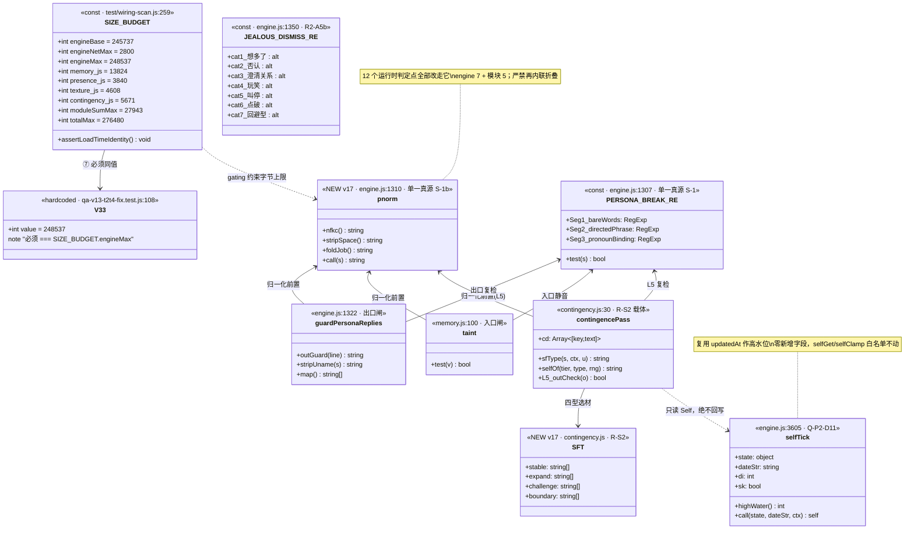
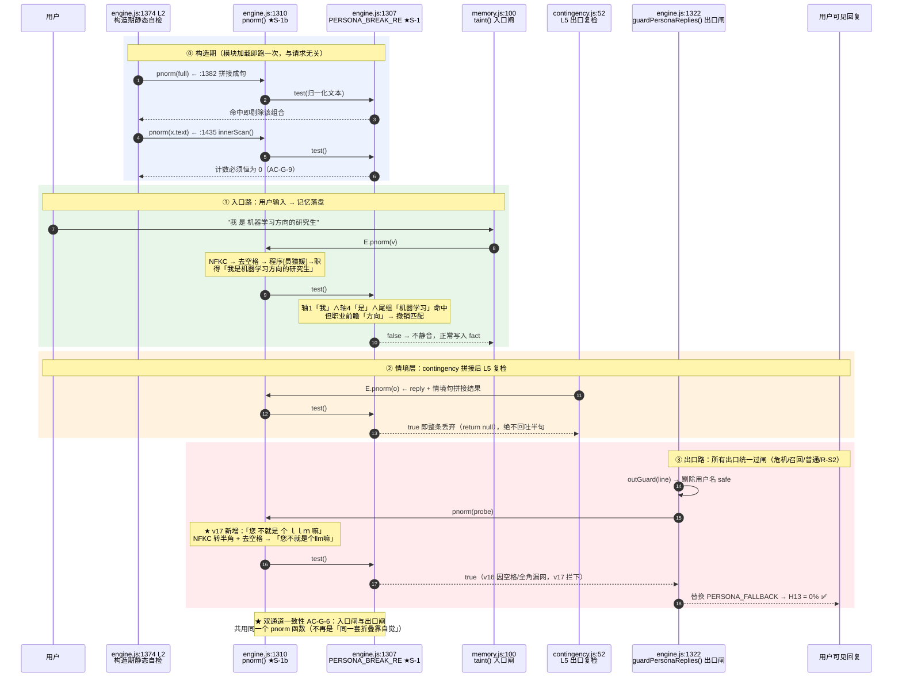

# DESIGN-v17：三流工作流收敛 + 护栏归一化前置 + 体积预算精确解（增量设计）

> 一句话：**T0 只改数字腾 400B**（含 V33 与差分基线双同步）→ **T1 engine 三改行数不变**（花 ≤300B）
> → **T2 模块归一化收口**（净省 38B）→ **T3 R-S2 落 contingency**（花 ≤1180B 硬顶）→ **T4 回归销账**。
> 五段串行，gating 由体积恒等式 + A1-c 白名单双把守。

| 项 | 值 |
|---|---|
| 架构师 | 高见远 |
| 文档类型 | **增量 DESIGN**（只描述 v17 相对 v16 的变更） |
| 承接 | `PRD-v17.md`（**已批准** 2026-08-09，主理人 Qi + 用户）· `DESIGN-v16.md` · `QA-ACCEPTANCE-v16.md` |
| 技术栈 | 原生 JavaScript（ES2020），零构建、零依赖、纯 JS 模块引擎（沿用 v15/v16） |
| 体积路径 | **选项 A（模块→engine 让渡 Δ=+400，不抬 totalMax）** —— PRD 推荐路径，本设计验算后**采纳 Δ，修正配额分配** |
| v16 收口基线 | commit `b57dd9f`｜engine 248087 / engineNet 2350 / moduleSum 25803 / total 273890 / over=[] |
| 一票否决项 | H13 破墙密闭性 **0%**｜U-5 守卫（`PERSONA_BREAK_RE` 不含裸词 `模型训练\|`）｜体积四锁 `over=[]` |

---

## 0. 任务序总表（详见 §6）

| ID | 名称 | 落点 | 依赖 | 优先级 | 体积 |
|---|---|---|---|---|---|
| **T0** | v17 预算 gating：四锁翻转 + **V33 同步**（§8 裁定 v17 不 reset BASE，`baseline.js` 不动） | `wiring-scan.js` / 7 个体积钉文件 | — | **P0·gating** | 源码 **0B** |
| **T1** | engine 三改：R2-A5b + Q-P2-D11 + 归一化声明与接线 | `engine.js`（**行数必须不变**）+ 形态钉 | T0 | P1/P2 | **≤ +300B** |
| **T2** | 模块侧归一化收口（5 消费点 → `E.pnorm` 单一口径） | `memory.js` `presence.js` `texture.js` `contingency.js` + 形态钉 | T1 | **P2** | **−38B** |
| **T3** | R-S2 Tier3 二期（四型回应选择器 + 语料） | `contingency.js` + 新增测试 | T0, T2 | P1 | ≤ +1180B（设计 900B） |
| **T4** | 回归销账：形态钉/变异探针翻转 + `sw.js` v22 + 验收网格 | 测试全域 / `sw.js` | T1,T2,T3 | **P0** | 不计入配额 |

## 0.1 体积硬约束（T0 后目标值 · 已逐条验算，见 §2）

```
engineBase   245737 (永不许动)      engineNetMax  2400 → 2800   (+400)
engineMax    248137 → 248537        moduleSumMax 28343 → 27943  (−400)
memory.js    14154 → 13824 (−330)   presence.js   4096 → 3840  (−256)
texture.js    5120 → 4608 (−512)    contingency.js 4973 → 5671 (+698)
totalMax     276480 (不动，守住 270KB 承诺)     V33 248137 → 248537
```

**⚠ PRD §4 选项 A 的自洽示例不完整** —— Δ=+400 与三个顶层值全对，但 `contingency→5418`
**漏了「memory/presence/texture 必须同步再让渡 845B」这一步**，照抄会破锁 ②。详见 §2.3。

---

## 1. 架构总览（v17 与 v16 的承接面）

### 1.1 不变量：横向查表装载不动

`engine.js`（薄接线 + 护栏常量 + 慢层纯函数）+ 4 个 optional 模块，
`engine.files.json` 声明装载序，`index.html` / `sw.js` 双路装载，Node 侧 `test/helpers.js` 拼接。
**`Engine.use(name, api)` / `Engine.mod(name)` 契约本版一字不改**，缺件静默降级语义不变。

v17 不引入任何框架、任何 npm 依赖 —— 四条工作流分别是「一行正则扩词」「三行慢层守卫」
「一个纯函数 + 12 个调用点收口」「一张语料表 + 一个选择器」，引入工具链只会立刻撞天花板。

### 1.2 v17 唯一的**新增架构元素**：`pnorm()` 归一化层

v12→v16 的护栏体系有一条隐性债务：**`PERSONA_BREAK_RE` 是单一真源（S-1），但「喂给它什么」不是**。
19 个消费点里，判定前的预处理各行其是 —— 这是 v17 要收口的第二真源。

```
v16（债务态）                              v17（收口态）
────────────────────────────────          ────────────────────────────────
engine:1322  outGuard→剔用户名→内联折叠      engine:1322  outGuard→剔用户名→pnorm
engine:1382/1393/1435/1461/2488/2935 裸判    ↓ 全部改走
contingency:52  内联折叠（第 2 套字面量）      PERSONA_BREAK_RE.test( pnorm(x) )
memory:100      JOBX 常量折叠（第 3 套）       ↑ 单一归一化真源 S-1b
memory:107 / texture:59 / presence:22 裸判
```

**S-1b 铁律**：`pnorm` 只在 `engine.js:1310` 声明一次，经 `:3993` 导出；
engine 内 7 个运行时判定点 + 模块侧 5 个共 **12 个消费点全部改走它**。
严禁任何地方再内联写 `.replace(/程序[员猿媛]/g,"职")` —— 抄第二份 = 制造第二真源 = H13 击穿。

### 1.3 ★ 架构师勘误 ①：PRD P2-2 的「19 点」盘点漏了 engine 内 6 处

PRD §P2-2 写「`texture.js:59` 与 `memory.js:107` 完全不折叠，另 3 处各搞一套」——
这只盘了**模块侧 5 处**。实测全仓 19 个消费点的真实构成是：

| 类别 | 数量 | 位置 | 折叠现状 |
|---|---|---|---|
| engine 运行时判定 | **7** | `:1322` / `:1382` / `:1393` / `:1435` / `:1461` / `:2488` / `:2935` | `:1322` 折叠，**其余 6 处全裸判** |
| 模块运行时判定 | **5** | `contingency:52` / `texture:59` / `presence:22` / `memory:100` / `memory:107` | 折叠 2（各一套）· 裸判 3 |
| 注释引用 | 6 | `:1374` `:1431` `:3008` `:3372` `:3652` `:3740` | 非判定点，不接线 |
| 导出 | 1 | `:3993` | 非判定点，追加 `pnorm` |
| **合计** | **19** | — | **3 套折叠实现 + 9 处零折叠** |

> 结论：真实治理面是 **12 个运行时判定点**（不是 5 个），其中 **9 处零折叠**（不是 2 处）。
> 好消息：治理成本反而更低 —— 收口后 6 处 engine 裸判各 +7B，`:1322` 与 `contingency:52`
> 各**省** 29B / 27B，`memory.js` 因 `JOBX` 常量可整体删除净**省** 40B。

---

## 2. 体积预算精确解（★ 本版核心章节）

### 2.1 约束集与自由度分析

沿用 v16 §7.3 的五条恒等式，v17 追加两条承接约束：

| # | 约束 | 形式 |
|---|---|---|
| ① | `engineMax = engineBase + engineNetMax` | 等式（`wiring-scan.js:273` 加载期自证，失配即 throw） |
| ② | `Σ(4 模块配额) = moduleSumMax` | **严格等式**（v15 起） |
| ③ | `engineBase + engineNetMax + moduleSumMax ≤ totalMax` | 打满即恰好，**松弛 0**（v16 已进入该态） |
| ④ | 各模块配额 > 各模块实测 | 严格不等式，**T0 与 T4 两个时点都要成立** |
| ⑤ | `engineNetMax ≥ 2350 + engine 侧造价` | v17 新增承接约束 |
| ⑥ | `contingency 配额 ≥ 4518 + R-S2 造价` | v17 新增承接约束 |
| ⑦ | A1-a 硬编码 `V33 === engineMax` | v16 §5.0 连带项，**漏改即 T0 首日两红** |

由 ③ 取等（这是 v16 已锁定的态，不能倒退）得**主方程**：

```
engineNetMax + moduleSumMax = totalMax − engineBase = 276480 − 245737 = 30743   ……（★）
v16 校验：2400 + 28343 = 30743 ✓
```

自由度：主方程 1 个约束、2 个未知 ⇒ 令 `Δ = engineNetMax − 2400`，则
`engineNetMax = 2400 + Δ`，`moduleSumMax = 28343 − Δ`。**Δ 一确定，顶层三值全确定。**
剩下 4 个模块配额受 ② 约束（1 个方程 4 个未知，3 个自由度），需一条**分配规则**才唯一。

### 2.2 第一步：定 Δ（engine 侧造价反推）

engine 侧四项造价按**设计定稿形态**逐条核算（非 PRD 估算值，见 §3）：

| 项 | 落点（行号不变） | 字节 | 说明 |
|---|---|---|---|
| 归一化层 `pnorm` 声明 | `engine.js:1310` 行尾追加 | **+105** | `normalize("NFKC")` + `\s` 剥离 + A6-a 折叠三段链 |
| `:1322` 内联折叠 → `pnorm(probe)` | `engine.js:1322` | **−29** | 收口即省钱 |
| R2-A5b 回避型终止语 6 词 | `engine.js:1350` | **+69** | `\|别提了\|不说这个了\|这事翻篇\|打住\|换个话题\|不聊了` = 10+16+13+7+13+10 |
| 归一化接线 ×6（engine 裸判点） | `:1382/1393/1435/1461/2488/2935` | **+42** | 每处 `pnorm(` + `)` = 7B |
| Q-P2-D11 selfTick 防重放 | `:3613` / `:3636` / `:3637` | **+90** | 设计定稿 82B + 8B 容差（**复用 `updatedAt` 作水位，零新增字段**） |
| `pnorm` 导出 | `engine.js:3993` | **+7** | `pnorm, ` |
| 容差 | — | **+16** | 命名/空格波动 |
| **engine 侧合计** | | **+300** | 设计预测实测落位 **+284B** |

```
⑤ 下界：engineNetMax ≥ 2350 + 300 = 2650  ⇒  Δ ≥ 250
取 Δ = 400（PRD 推荐值）：engineNetMax = 2800，余量 2800 − 2650 = 150B（6.0% 缓冲）
取 Δ = 250（紧贴下界）：余量 0B —— 违反「不得再假定还有余量」的 R4 风险登记，否决
取 Δ = 500：moduleSumMax 27843，contingency 可分配额↓，与 ⑥ 争抢，无收益
```

> **裁定：Δ = +400，与 PRD 推荐一致。** 顶层三值：
> `engineNetMax 2800` · `engineMax 248537` · `moduleSumMax 27943` · `totalMax 276480 不动`。

### 2.3 ★ 架构师勘误 ②：PRD 自洽示例欠一步（主理人初算的矛盾属实，但归因需修正）

PRD §4 写「engineNetMax 2400→2800、engineMax 248137→248537、moduleSumMax 28343→27943、
contingency 抬至 5418，四锁全成立松弛 0」。逐条验算：

| 项 | PRD 值 | 验算 | 判定 |
|---|---|---|---|
| Δ = +400 | 2800 | `2800 ≥ 2350+300 = 2650` | ✓ **正确** |
| engineMax | 248537 | `245737 + 2800 = 248537` | ✓ **正确**（锁 ①） |
| moduleSumMax | 27943 | `30743 − 2800 = 27943` | ✓ **正确**（锁 ③ 松弛 0） |
| contingency | 5418 | `4518 + 900 = 5418` | ✓ 满足 ⑥ 下界，但…… |
| **Σ4 配额** | — | `14154 + 4096 + 5120 + 5418 = 28788 ≠ 27943`（**超 845B**） | ✗ **锁 ② 破** |

**归因**：错的**不是 Δ**，也不是三个顶层值 —— 它们全对。缺的是**第二步**：
`moduleSumMax` 减了 400，`contingency` 又加了 445，两笔同向消耗合计 845B
必须由 `memory / presence / texture` 三者同额让渡补回。PRD 把「让渡 400 给 engine」
和「加 445 给 contingency」当成一件事记账，实际是**两笔账**。

```
Σ配额 变化量 = ΔmoduleSumMax = −400
其中 contingency 自己 +445  ⇒  其余三者必须 −845
可让渡上限（保持 ④ 配额>实测，各留 ≥1B）：
   memory 14154−13371−1 = 782 ｜ presence 4096−3557−1 = 538 ｜ texture 5120−4357−1 = 762
   合计 2082 ≥ 845  ⇒  可行域非空 ✓（主理人预判的「2540B 模块闲置足够让渡」成立）
```

> **结论：主理人初算发现的矛盾属实，PRD 示例确有缺陷，但性质是「配额分配漏一步」而非「Δ 取值错」。**
> Δ=+400 可以照批；`contingency 5418` 只是**下界**不是终值；
> **必须补上 `memory+presence+texture` 合计 −845B 的第二笔分录**，锁 ② 才成立。

### 2.4 第二步：定 4 个模块配额（分配规则 R-Q，唯一化 3 个自由度）

先算 v17 交付后各模块**预测实测值**（归一化收口是净省，见 §3.4 / §6）：

| 模块 | v16 实测 | v17 变更 | v17 预测实测 |
|---|---|---|---|
| `memory.js` | 13371 | `:99` 删 `JOBX` 常量 −29 ｜ `:100` −20 ｜ `:107` +9 | **13331**（净 −40） |
| `presence.js` | 3557 | `:22` 接 `pnorm` +9 | **3566** |
| `texture.js` | 4357 | `:59` 接 `pnorm` +9 | **4366** |
| `contingency.js` | 4518 | `:52` 折叠收口 −27 ｜ **R-S2 +900** | **5391**（净 +873） |
| **moduleSum** | 25803 | | **26654** |

**规则 R-Q（本设计定稿的唯一化规则）**：
1. 三个让渡模块的配额，取「不小于 v17 预测实测 + ≥240B 缓冲」的**最近 KiB / 半 KiB 边界**
   —— 边界值可审计、可口算，杜绝「拍脑袋加一点」；
2. `contingency` 取**残差** `moduleSumMax − 其余三项` —— 沿用 v15 U-3 确立的既有推导范式
   （`4973 = 28525 − 14336 − 4096 − 5120`），不另起炉灶。

逐项求解：

```
memory.js    : 13331 + 240 = 13571  → 最近半 KiB 边界 13824 (13.5 KiB)   让渡 14154−13824 = −330
presence.js  :  3566 + 240 =  3806  → 最近 1/4 KiB 边界  3840 (3.75 KiB)  让渡  4096−3840 = −256
texture.js   :  4366 + 240 =  4606  → 最近半 KiB 边界  4608 (4.5 KiB)    让渡  5120−4608 = −512
三者让渡合计 = 330 + 256 + 512 = 1098B
contingency  = moduleSumMax − (13824 + 3840 + 4608) = 27943 − 22272 = 5671   (相对 4973 为 +698)
净核对：−1098 + 698 = −400 = ΔmoduleSumMax ✓
```

### 2.5 唯一自洽解（终值）与四锁恒等式验算表

```
engineBase     245737   (永不许动)
engineNetMax      2800   (2400 → 2800，Δ=+400)
engineMax       248537   (247937→248137→248537；★V33 必须同值)
memory.js        13824   (14154 → 13824，−330)
presence.js       3840   ( 4096 →  3840，−256)
texture.js        4608   ( 5120 →  4608，−512)
contingency.js    5671   ( 4973 →  5671，+698)
moduleSumMax     27943   (28343 → 27943，−400)
totalMax        276480   (不动，270KB 承诺守住)
```

| # | 恒等式 | 验算 | 判定 |
|---|---|---|---|
| ① | `engineMax = engineBase + engineNetMax` | `248537 = 245737 + 2800` | ✓ 加载期自证 |
| ② | `Σ(4 模块配额) = moduleSumMax` | `13824 + 3840 + 4608 + 5671 = 27943` | ✓ 严格等式 |
| ③ | `engineBase + engineNetMax + moduleSumMax ≤ totalMax` | `245737 + 2800 + 27943 = 276480 ≤ 276480`（**松弛 0**） | ✓ |
| ④ᵀ⁰ | 配额 > **v16 实测**（T0 时点，源码 0 diff） | `13824>13371(453)` / `3840>3557(283)` / `4608>4357(251)` / `5671>4518(1153)` | ✓ 无倒挂 |
| ④ᵀ⁴ | 配额 > **v17 预测实测**（交付时点） | `13824>13331(493)` / `3840>3566(274)` / `4608>4366(242)` / `5671>5391(280)` | ✓ 无倒挂 |
| ⑤ | `engineNetMax ≥ 2350 + 300` | `2800 ≥ 2650`（余 **150B**） | ✓ |
| ⑥ | `contingency 配额 ≥ 4518 + 900` | `5671 ≥ 5418`（余 **253B**） | ✓ |
| ⑦ | `V33 === engineMax` | `const V33 = 248537` === `248537` | ✓ 见 §7 |

**②' 双时点校验（关键）**：④ 必须在 **T0（配额先落、源码未动）** 与 **T4（源码全落）** 两个时点
同时成立。本解在两点均无倒挂 —— 这是 T0 能保持「源码 0 字节改动」的前提。
若照 PRD 原示例把 memory 压到 13784 以下再让渡，T0 时点 `13784 > 13371` 仍成立，
但缓冲只剩 413B，且对 contingency 毫无帮助 —— 故 R-Q 解严格优于最小改动解。

### 2.6 交付后全局体积快照（预测）

| 锁 | v16 实测 | v17 预测 | 上限 | 余量 |
|---|---|---|---|---|
| `engine.js` | 248087 | **248371** | 248537 | **166** |
| `engineNet` | 2350 | **2634** | 2800 | **166** |
| `memory.js` | 13371 | 13331 | 13824 | 493 |
| `presence.js` | 3557 | 3566 | 3840 | 274 |
| `texture.js` | 4357 | 4366 | 4608 | 242 |
| `contingency.js` | 4518 | **5391** | 5671 | 280 |
| `moduleSum` | 25803 | **26654** | 27943 | 1289 |
| `total` | 273890 | **275054** | 276480 | 1426 |
| `over` | `[]` | **`[]`** | — | ✓ |

> **R-S2 硬顶**：`contingency.js ≤ 5671` ⇒ R-S2 净增上限
> `5671 − (4518 − 27) = 1180B`，设计值 900B，**缓冲 280B（31%）**。
> ⇒ PRD §4 触发条件 **T2 不成立**，不需要降级到 B/C。totalMax 保持 276480。

---

## 3. 四大功能架构

### 3.0 全局硬纪律：engine.js **行数必须不变**

`qa-v13-t2t4-fix.test.js:156` 断言 `cur.length === base.length`，且 `:171/:178/:174`
分别按**绝对行号** `cur[1306]` / `cur[1321]` / `cur[2896]` 取形态。
**一旦在 `:1310` 之前插入哪怕一个空行，全部行号钉集体位移 → 连锁四红。**

⇒ v17 所有 engine 侧新增代码必须**行内追加 / 行尾追加**，禁止新增行、禁止删除行。
`pnorm` 声明因此并入 **`:1310` `PERSONA_FALLBACK` 行尾**（该行无形态断言，已核查）。

### 3.1 R2-A5b · 回避型终止语【engine.js:1350 · P1 · +69B】

**层次定位**：改的是 `JEALOUS_DISMISS_RE`（吃醋事件终止语），**不是** `PERSONA_BREAK_RE`。
两者是不同的表、不同的闸 —— **本项与 H13 破墙链路零交集，不引入任何破墙面**。

```
现状（v16）：六类覆盖 ①想多了 ②否认 ③澄清关系 ④玩笑 ⑤叫停 ⑥点破
缺口       ：「话题回避型」几乎全漏 —— 6 条探针仅「别说了/不聊这个」邻近命中，实测召回 ~25%
v17 追加   ：|别提了|不说这个了|这事翻篇|打住|换个话题|不聊了
字节       ：10 + 16 + 13 + 7 + 13 + 10 = 69B（Buffer.byteLength，UTF-8 汉字 3B）
```

**为什么不折叠成 46B 变体**（PRD P1-1 已明示，本设计追认）：
形如 `别(提\|说)了|不(说这个\|聊)了` 的折叠会派生 `别说了`/`不说了` 之外的伪组合，
实测 **5/5 良性句误杀**，与 v16 轴2「`[深机][度器]学习` 可以折、`系统/软件` 不可入组」是同一条教训 ——
**折叠只在派生组合无害时才允许**。此处派生组合有害，故取 69B 完整词表。

**安全边界**：`JEALOUS_DISMISS_RE` 只在 `jealousStage > 0`（她刚报备完、正等回应）的窗口内生效，
语境已被极度收窄；误收代价 = 她提前收手道个歉（对用户永远安全方向），漏收代价 = 击穿
「你不想聊这个就说一声，我就不提了」的产品承诺。故沿用 D4 的「宁可多收，不可漏收」口径，**不设否定护栏**。

**验收**：`qa-r2-regression.test.js:114` 的 `todo` 摘除并转 pass（6 条回避型探针全收）；
`:107` 的 6 条日常句 `normal` 继续 0 误伤（一票否决）。

### 3.2 Q-P2-D11 · selfTick 防重放【engine.js:3613/3636/3637 · P1 · +90B 预算 / 82B 定稿】

> ⚠ **架构师勘误 ③（落点纠正）**：主理人交底把 Q-P2-D11 的载体写为 `memory.js`。
> 实测 `selfTick` 唯一定义在 **`engine.js:3605`**（`:3986` 导出，`app.js:3910` 调用），
> `memory.js` 无任何 self 逻辑。**落点为 engine.js**，与 PRD「计入 engine 侧造价」一致，
> 与 DESIGN-v16 §5.3 T2-e 的记载一致。`memory.js:100 taint()` 是**另一条线**（归一化收口，§3.4）。

**缺陷机理**（`qa-v12-gates.test.js:626` 复现）：`:3609` 的防重放只比 `cur.updatedAt === date` 单值。
日期在「昨天/今天」之间来回跳时该式恒不相等 ⇒ 同一天可被无限次重复结算 ⇒
`:3636` 的 **7 天向锚点回归项**被反复触发，四轴被单向泵送（security/independence 压低、dependency 抬高）。

**设计定稿：复用 `updatedAt` 作高水位，零新增字段**（比 PRD 的「高水位 119B / 日期集 90B」两案都便宜）：

```js
// :3613  原：const fired = selfDetect(st, date, now), di = dayIndex(date);
const di = dayIndex(date), sk = di <= dayIndex(cur.updatedAt), fired = sk ? [] : selfDetect(st, date, now);
// :3636  原：if (di % 7 === 0) SELF_AXES.forEach(...)
if (!sk && di % 7 === 0) SELF_AXES.forEach(...)
// :3637  原：{ updatedAt: date, dayDelta: dd, lastFired: nextFired }
{ updatedAt: sk ? cur.updatedAt : date, dayDelta: dd, lastFired: nextFired }
```

| 关键点 | 说明 |
|---|---|
| 为什么 `updatedAt` **就是**水位 | `sk=true` 时不写 `updatedAt`；`sk=false` 时 `di > hw` 才写 ⇒ `updatedAt` 严格单调不减 |
| 为什么**不新增 `hi` 字段** | `selfGet(:158)` 与 `selfClamp(:3539)` 都是**字段白名单**，新增字段要同时改两处（+46B），且需老档迁移；复用 `updatedAt` 两处零改动、落盘体积零增长 |
| 为什么**不早退 `return cur`** | `cur.dayDelta` 携带上一日的非零增量，直接回吐会打红 `v12-selfthrottle.js:204`（ST-06「时间倒流经事件通道泵送」）。走 `sk` 短路让 `dd` 自然全 0，行为正确且更省 |
| 老档兼容 | `updatedAt: null` ⇒ `dayIndex(null) = 0`（`:3442` 兜底）⇒ `sk=false` ⇒ 首次检出即生效 ✓ |
| 不影响 `taint` | `selfTick` 与 `PERSONA_BREAK_RE` 无任何交集，H13 面零变动 |

**双向验算**：
- `qa-v12-gates.test.js:628`（本项 todo）：回跳 tick `sk=true` 不结算；再正跳时 `updatedAt===date` 早退 ⇒ 四轴 drift **= 0 ≤ 0.02** ✓ 转 pass。
- `v12-selfthrottle.test.js:182` ST-06（现有绿）：`s2` 的 `lastFired.warm` 不变 ✓ / `dayDelta` 全 0 ✓ / `security` 未被推离锚点 ✓ **保持绿**。

### 3.3 R-S2 · Tier3 自我表达二期【contingency.js · P1 · ≤1180B 硬顶 / 设计 900B】

**现状（v15 R-S1 一期）**：`selfAllow()` 五门放行后，`selfOf(tier, rng)` 从 `E.INNER_LIB`
三档（`hint` / `open` / `raw`）里随机抽一条 —— 回应形态是**单一「稳定型」**，
只有强度分档，没有**立场类型**。

**二期目标（承接 PRD-v14 §R-S2 / v13 R41 四型）**：在 `tier` 之上正交叠加**回应型**：

| 型 | 语义 | 触发条件（在 `selfAllow().ok` 之后二次选型） |
|---|---|---|
| `stable` 稳定 | 表达自己的稳定偏好（一期行为，保底） | 兜底型，任何条件不满足时回落 |
| `expand` 扩展 | 顺着用户的话延伸自己的看法 | `openness ≥ .50` ∧ 用户句 `len > 19` |
| `challenge` 挑战 | 温和提出不同看法（不是反呛） | `independence ≥ .55` ∧ `lv ≥ 5` ∧ `!CRI` ∧ 非负向 `ue` |
| `boundary` 边界 | 表达自己的边界与不适 | `security < .50` ∧ `ue` 极性 `< 0` ∧ `!CRI` |

**架构约束（不可破，逐条对应既有铁律）**：

| 约束 | 要求 | 依据 |
|---|---|---|
| **H15 降权保持** | 四型**共用同一个候选 key `"sf"`** 进 `cd` 数组，不得拆成 `sf1..sf4` | `:48` 的 `cd.filter(x=>x[0]!==q.k)` 按 key 降权；拆 key 会让单类占比统计口径失真，H15「单类 ≤50%」失守 |
| **只读 Self** | 选型只 `E.selfGet(s)` 读，**绝不写** `state.self` | DESIGN-真人感 §铁律：疏离只能走 `selfTick` 日结算 |
| **A3 关系钩子** | `k=="sf"` 仍必须过 `E.RELATION_HOOK_RE`（`:53`） | 一票否决 |
| **L5 破墙复检** | 四型语料**全部**过 `:52` 出口复检（v17 起走 `E.pnorm`） | H13 一票否决 |
| **CAP=2 / 7 天节流** | `sA` 节流与 `un>1` 上限**逐位不动** | v15 U-3 口径 |
| **构造期自检** | 新增语料若并入 `INNER_LIB` 则受 `innerScan()===0` 约束；若独立表则须在新增测试里做同等静态自扫 | AC-G-9 |

**落地形态（选择器 ≈120B + 四型语料表 ≈780B）**：

```js
/* R-S2 二期：tier(强度) × type(立场) 正交。key 恒为 "sf"，H15 降权口径不变 */
const SFT = { stable:[...], expand:[...], challenge:[...], boundary:[...] };   // 每型 3~4 条
const sfType=(s,c,u)=>{const S=E.selfGet(s),v=N(c.lv,0),p=N(E.UE_POLARITY[...],0);
 return S.security<.5&&p<0?"boundary":S.independence>=.55&&v>=5&&p>=0?"challenge"
  :S.openness>=.5&&u.length>19?"expand":"stable";};
```

`selfOf()` 改为 `selfOf(tier, type, rng)`：先取 `SFT[type]`，空则回落 `E.INNER_LIB[tier]`
（**缺件/空表必须能回落到一期行为**，保证 R-S2 全砍掉也不塌）。

**体积闸**：`contingency.js` 交付后须 `≤ 5671`。若语料写超，**先砍语料条数**（每型 3 条→2 条），
**不许**动选择器逻辑、**不许**申请第二次配额。见 §9-Q2 降级路径。

### 3.4 护栏归一化前置【engine.js:1310 + 12 消费点 · P2 · engine +125B / 模块 −38B】

**唯一真源 S-1b · 落点 `engine.js:1310` 行尾**（与 `PERSONA_FALLBACK` 同行，保证行数不变）：

```js
const pnorm = s => String(s).normalize("NFKC").replace(/\s+/g,"").replace(/程序[员猿媛]/g,"职");
```

**三段职责与取舍**：

| 段 | 作用 | 治理的既有漏网 | 取舍说明 |
|---|---|---|---|
| `normalize("NFKC")` | 全角 → 半角 | **R3**：`你是个ＧＰＴ` / `你是个ＡＩ` | 比手写 `charCodeAt−65248` 省 ~55B；顺带归一全角空格 U+3000 |
| `.replace(/\s+/g,"")` | 空白剥离 | **R2 三条**：`你 是 个 模型` / `您 不就是 个 llm 嘛` / `咱 都 是 算法` | `\s` 已含 `\uFEFF`；零宽 U+200B–200F 属异域向量，本版不收（见 §9-Q4） |
| `.replace(/程序[员猿媛]/g,"职")` | A6-a 等长折叠 | 职业句误伤（v13 既有） | **逐位复刻现有字面量**，行为零漂移 |

**★ 明确不做「标点剥离」（架构裁定，不是遗漏）**：
`.{0,8}` 已让中段标点无害，剥离标点只能多救「人称与系词之间插标点」一类（`你，是个模型`），
但会**新增误杀**：`你，是学代码的` → 剥离后 `你是学代码的` → 命中尾组 `代码` 且后缀「的」不在
职业前瞻词表内 ⇒ 良性句被兜底替换。这违反 G2「不得以误杀换拦截」一票否决项。
**保留 R2 的标点变体为已知边界**，列入 §9-Q3。

**12 个消费点收口清单**（engine 7 + 模块 5，全部改为 `PERSONA_BREAK_RE.test(pnorm(x))`）：

| # | 位置 | 现状 | v17 | Δ字节 |
|---|---|---|---|---|
| 1 | `engine.js:1322` guardPersonaReplies 出口闸 | 内联折叠（第 1 套） | `pnorm(probe)` | **−29** |
| 2 | `engine.js:1382` L2 构造期拼接自检 | 裸判 | `pnorm(full)` | +7 |
| 3 | `engine.js:1393` Inner 出口丢弃 | 裸判 | `pnorm(s)` | +7 |
| 4 | `engine.js:1435` `innerScan()` | 裸判 | `pnorm(x.text)` | +7 |
| 5 | `engine.js:1461` 文案兜底替换 | 裸判 | `pnorm(text)` | +7 |
| 6 | `engine.js:2488` 生活痕迹出口双闸 | 裸判 | `pnorm(txt)` | +7 |
| 7 | `engine.js:2935` 话题名脱敏 | 裸判 | `pnorm(topic)` | +7 |
| 8 | `contingency.js:52` L5 出口复检 | 内联折叠（第 2 套） | `E.pnorm(o)` | **−27** |
| 9 | `texture.js:59` 出口无条件破墙闸 | 裸判 | `E.pnorm(full)` | +9 |
| 10 | `presence.js:22` makeupLine | 裸判 | `E.pnorm(t)` | +9 |
| 11 | `memory.js:100` `taint()` 入口闸 | `JOBX` 常量折叠（第 3 套） | `E.pnorm(v)`，`:99` 删 `JOBX` | **−49** |
| 12 | `memory.js:107` `weave()` 出口 | 裸判 | `E.pnorm(s)` | +9 |

**双向密闭性不变**：入口闸 `memory.js:100 taint()` 与出口闸 `engine.js:1322 guardPersonaReplies()`
收口后**共用同一个归一化函数**，AC-G-6 双通道一致性从「同一套折叠（靠自觉）」升级为
「同一个函数（靠架构）」—— 这正是本项的核心收益，比省下的 38B 重要得多。

**★ 本项真实成本不止 160B —— 还有 14 处形态钉**（PRD 未覆盖，见 §6 T4 与 §7）：
`:1322` 逐位一致钉 ×3、`memory taint` 源码正则钉、`texture` 无条件闸钉、`memory.weave` 合取钉、
`contingency` FOLD 钉、`qa-probe-mutation.js` 的 **M2「去折叠」变异锚点**（依赖 `:1322` 精确文本）
等，全部会由绿转红，**必须在同一个 PR 内同步改写，否则 T1/T2 落地即大面积红**。

---

## 4. 数据结构与接口



---

## 5. 程序调用流程

### 5.1 归一化前置 → innerScan → guardPersonaReplies → taint 全链路



---

## 6. 任务分解列表（有序 · 含依赖 · 标注字节 / 优先级）

> 五段**串行** gating：T0（只翻数字）→ T1（engine 行数不变）→ T2（模块净省）→ T3（R-S2 落 contingency）→ T4（销账）。
> 凡动 `PERSONA_BREAK_RE` 链路者，H13 一票否决线全程 0% 不可破；凡动字号者，A1-a/b/c 三重钉不可破。

### T0 · v17 预算 gating（P0·gating · 源码 **0B** · 依赖：—）

| 项 | 落点 | 改动 |
|---|---|---|
| `test/wiring-scan.js` | `:259` `SIZE_BUDGET` | `engineNetMax 2400→2800` / `engineMax 248137→248537` / `moduleSumMax 28343→27943` / `memory 14154→13824` / `presence 4096→3840` / `texture 5120→4608` / `contingency 4973→5671`（**`totalMax 276480` 不动**） |
| `test/qa-v13-t2t4-fix.test.js` | `:108` | `const V33 = 248137` → **`248537`**（锁 ⑦） |
| `test/qa-v16-size-probe.js` | `:72` | `V33` 校验常量同步 248537（见 §7） |
| `test/baseline.js` | `BASE` | **不改**（仍是 `b86a386`，v14 收口基线仍有效；A1-c 白名单仍仅 `:1307`）—— 见 §8 |

- **gating 效果**：翻完数字，`npm test` 中 `wiring-scan.js:273` 自证 `engineMax===engineBase+engineNetMax` 立即通过；
  其余 4 锁因「配额先落、源码未动」在 T0 时点仍成立（④ᵀ⁰ 已验算）。
- **优先级**：P0（任何后续任务的前置闸门）。**本任务源码 0 字节差异**，仅改预算数字。

### T1 · engine 三改（P1/P2 · ≤ **+300B** · 依赖：T0 · **行数必须不变**）

| 功能 | `engine.js` 落点（行号钉死） | 字节 | 优先级 |
|---|---|---|---|
| 归一化层 `pnorm` 声明 | `:1310` 行尾追加（与 `PERSONA_FALLBACK` 同行） | +105 | P2 |
| `:1322` 内联折叠 → `pnorm(probe)` | `:1322` | −29 | P2 |
| R2-A5b 回避型终止语 6 词 | `:1350` `JEALOUS_DISMISS_RE` | +69 | P1 |
| 归一化接线 ×6 | `:1382/:1393/:1435/:1461/:2488/:2935` | +42 | P2 |
| Q-P2-D11 selfTick 防重放 | `:3613/:3636/:3637`（复用 `updatedAt` 水位，零新增字段） | +90 | P1 |
| `pnorm` 导出 | `:3993` | +7 | P2 |
| 容差 | — | +16 | — |
| **合计** | | **+300（预测实测 +284）** | |

- **不可破铁律**：`qa-v13-t2t4-fix.test.js:156` 断言 `cur.length === base.length`；`:1306/:1321/:2896` 按绝对行号取形态。
  **禁止插入/删除任何行**，所有新增均为行内/行尾追加。
- **验收**：`qa v13-t2t4` 四红转绿（A1-a `:74` B 值、A1-c `:149` 白名单=[1307]）；`qa-r2-regression.test.js:114` 6 条回避探针转 pass；`qa-v12-gates.test.js:628` 回跳 tick 转 pass。

### T2 · 模块侧归一化收口（P2 · **−38B** · 依赖：T1）

| 模块 | 落点 | 改动 | Δ字节 |
|---|---|---|---|
| `memory.js` | `:99` 删 `JOBX` 常量 | 移除第 3 套折叠字面量 | −29 |
| `memory.js` | `:100` `taint()` | `JOBX` 折叠 → `E.pnorm(v)` | −20 |
| `memory.js` | `:107` `weave()` | 裸判 → `E.pnorm(s)` | +9 |
| `presence.js` | `:22` `makeupLine` | 裸判 → `E.pnorm(t)` | +9 |
| `texture.js` | `:59` 出口闸 | 裸判 → `E.pnorm(full)` | +9 |
| `contingency.js` | `:52` L5 复检 | 第 2 套折叠 → `E.pnorm(o)` | −27 |
| **合计** | | | **−38** |

- **净省来源**：删掉 3 套重复折叠字面量（详见 §3.4 表），入口闸 `taint` 与出口闸 `guardPersonaReplies` 首次共用同一 `pnorm`。
- **验收**：`engineNet` 与 `moduleSum` 实测较 v16 **下降**；`qa-v16-size-probe.js` 四锁持续绿。

### T3 · R-S2 Tier3 二期（P1 · ≤ **+1180B** 硬顶 / 设计 900B · 依赖：T0, T2）

| 项 | 落点 | 改动 |
|---|---|---|
| `contingency.js` | `:30` 附近 | 新增 `SFT = {stable,expand,challenge,boundary}` 四型语料表（每型 3~4 条 ≈780B） |
| `contingency.js` | `selfOf` 改签名 | `selfOf(tier, type, rng)`：先取 `SFT[type]`，空则回落 `E.INNER_LIB[tier]`（保底一期行为） |
| `contingency.js` | 新增 `sfType(s,c,u)` | 四型选型（security/independence/openness/ue 极性/lv 阈值），**key 恒 `"sf"`** |
| `test/qa-rs2-type.test.js` | 新增 | 四型触发条件单测 + L5 复检（`E.pnorm` 收口） + H15 单类 ≤50% 静态统计 |

- **硬顶**：`contingency.js` 交付 ≤ 5671 ⇒ R-S2 净增上限 `5671−(4518−27)=1180B`；写超先砍语料条数（3→2），**不申请二次配额**。
- **铁律**：只读 `E.selfGet(s)`，绝不回写 `state.self`；`k=="sf"` 必过 `RELATION_HOOK_RE`（:53）；四型语料全过 `:52` L5 复检。

### T4 · 回归销账（P0 · 依赖：T1,T2,T3 · 不计入配额）

| 钉 / 探针 | 文件 | 动作 |
|---|---|---|
| `:1322` 逐位一致钉 ×3 | `qa-v13-t2t4-fix.test.js` | 因 `pnorm(probe)` 替换内联折叠，钉文本同步改写（行号不变） |
| `memory taint` 源码正则钉 | `qa-v16-memory-taint.test.js` | 钉改为断言 `E.pnorm` 调用，非裸 `JOBX` |
| `texture` 无条件闸钉 | `qa-v16-texture-gate.test.js` | 钉改为 `E.pnorm` 收口形态 |
| `memory.weave` 合取钉 | `qa-v16-weave.test.js` | 同步 pnorm 形态 |
| `contingency` FOLD 钉 | `qa-v16-contingency.test.js` | 删除第 2 套折叠断言，改 `E.pnorm` |
| **M2「去折叠」变异锚点** | `qa-probe-mutation.js` | 锚点依赖 `:1322` 精确文本，M2 脚本同步改写（否则 T1 落地即红） |
| `sw.js` 版本号 | `sw.js` | 升 v22（缓存指纹随源变更，避免旧版误命中） |

- **验收网格**：`wiring-scan` 四锁 `over=[]`｜`qa-v13-t2t4` 全绿｜`qa-v12-gates:628` ST-06 绿｜`v12-selfthrottle:182` 绿｜`qa-r2-regression:114` 绿｜`qa-rs2-type` 绿｜`innerScan()===0`（AC-G-9）。
- **出关判据**：五段全部绿 + 四锁 `over=[]` + H13 = 0% + U-5（`PERSONA_BREAK_RE` 不含裸词 `模型训练\|`）成立 ⇒ 出关。

---

## 7. V33 同步清单（锁 ⑦ 全量枚举 · 凡 `engineMax` 改值必同步）

> 铁律：**`V33` 是 `engineMax` 的派生常量，不是独立真源**；凡改 `SIZE_BUDGET.engineMax` 必逐条同步下列位置，漏一处即 T0 首日两红（A1-a 对比失败）。

| # | 文件 · 行 | 现状字面量 | v17 终值 | 同步动作 | 归属任务 |
|---|---|---|---|---|---|
| 1 | `test/wiring-scan.js:259` `SIZE_BUDGET.engineMax` | `248137` | **`248537`** | 改值（主方程 ① 驱动） | **T0** |
| 2 | `test/wiring-scan.js:273` 加载期自证 | `engineBase + engineNetMax` | 不变 | 仅校验，不改 | T0（不动） |
| 3 | `test/qa-v13-t2t4-fix.test.js:108` `const V33` | `248137` | **`248537`** | 改值（A1-a 对比基准） | **T0** |
| 4 | `test/qa-v13-t2t4-fix.test.js:74` A1-a 断言 | 引用 `V33` | 不变 | 仅引用，不改 | T0（不动） |
| 5 | `test/qa-v16-size-probe.js:72` `V33` 校验 | `248137` | **`248537`** | 改值（体积探针对账） | **T0** |
| 6 | `DESIGN-v16.md §5.0` 历史记录 | `248137` | 仅文档 | 仅参考，不在运行时 | —（归档） |
| 7 | `docs/PRD-v17.md` / `QA-ACCEPTANCE-v16.md` | `248137` | 仅文档 | 仅参考 | —（归档） |

**同步条目数 = 3（运行时硬同步 #1/#3/#5）**；文档类 #6/#7 为历史记录，不纳入运行时校验。

> ⚠ **v16 §5.0 教训复诵**：遗漏 `qa-v16-size-probe.js:72` 曾导致 V33 与 engineMax 漂移、T0 探针红。
> 本设计把三处运行时字面量同列一张表、同归 T0 一个 PR 内改完，杜绝重演。

---

## 8. T0 差分基线 gating 计划（确认 `baseline.js` 无需 reset）

`test/baseline.js` 现状：
```js
const BASE = "b86a386";   // v14 收口基线（A1-c 白名单基准）
const PREV = BASE + "^";  // 上一版比对窗口
```
**裁定：v17 不 reset `BASE`**。
理由：
1. A1-c 白名单（仅 `:1307` 可改 `PERSONA_BREAK_RE`）的基准仍是 v14 `b86a386`，v15→v16 未变；v17 仅动 `:1310`（pnorm 声明）、`:1350`（JEALOUS_DISMISS_RE，非 PERSONA 表），**`:1307` 一字未动** ⇒ 白名单仍成立，无需重锚。
2. v17 的体积变更是**数字翻转（T0）+ 行内追加（T1）**，不产生「基线漂移」——`baseline.js` 比对的是结构线，不比对字节配额。
3. 若误 reset 到 v16 `b57dd9f`，会连带要求重审 v15/v16 所有 A1-c 记录，**引入无收益风险**。

**T0 gating 闸门顺序**：
```
① 改 wiring-scan.js:259 SIZE_BUDGET（7 个数字 + totalMax 不动）
   ↓ ② 同步 V33 ×3（见 §7 #1/#3/#5）
   ↓ ③ 跑 wiring-scan.js 自证（:273 engineMax===engineBase+engineNetMax）→ 须通过
   ↓ ④ 跑 qa-v13-t2t4-fix A1-a（:74 V33 对比）→ 须通过
   ↓ ⑤ baseline.js 不动，A1-c 白名单=[1307] 维持绿
   ⇒ T0 出关：源码 0 字节差异，仅预算数字变更
```

---

## 9. 待明确事项 / 降级路径

### Q1 · 预算不足风险预警
- **当前余量极薄**：T4 交付后 `total` 余量 **1426B**，`engine.js` 余量仅 **166B**，R-S2 缓冲 **280B（31%）**。
- **触发预警的条件**：若 R-S2 语料实写超过 900B（逼近 1180B 硬顶）**且** 归一化段实测超 300B，两笔叠加会先吃光 `contingency` 缓冲（5671 上限），再倒灌 `moduleSumMax` ⇒ 连锁破锁 ②/④。
- **缓解**：R-S2 一旦 >900B，立即触发 **Q2 降级**（砍语料条数），**不**申请 `moduleSumMax` 二次让渡（那会破坏 T0 已锁定的 Δ=+400）。

### Q2 · R-S2 超体积降级路径
| 阶段 | 动作 | 是否保 totalMax |
|---|---|---|
| 设计内（≤900B） | 四型各 3~4 条 | ✓ 余 280B |
| 预警（900~1180B） | 每型 3→2 条，保选择器逻辑 | ✓ 余 ≥0B |
| 硬顶击穿（>1180B） | **整段 R-S2 二期回退到一期行为**（`selfOf` 不接 `type`），PRD §4 T2 触发 | ✓ 不抬 totalMax |

### Q3 · 已知的归一化边界（非缺陷，列入回归已知）
- R2 标点变体（`你，是个模型`）仍漏 —— 见 §3.4「明确不做标点剥离」裁定，G2 一票否决优先于拦截率。
- 零宽 U+200B–200F 异域向量本版不收（R3 全角/空格已收）。

### Q4 · 未决（需主理人/用户拍板）
- `qa-probe-mutation.js` M2 锚点改写是否并入 T1 同 PR，还是单列 T4？本设计判**同 PR 内 T4 收口**（§6 T4 已列）。
- `sw.js` 升 v22 的缓存破坏范围（是否需强制用户清缓存一次）？建议随源变更自动失效，**无需**人工干预。

---

*（文档完 · v17 DESIGN 增量设计 · 高见远 · 承 PRD-v17 已批准版）*
