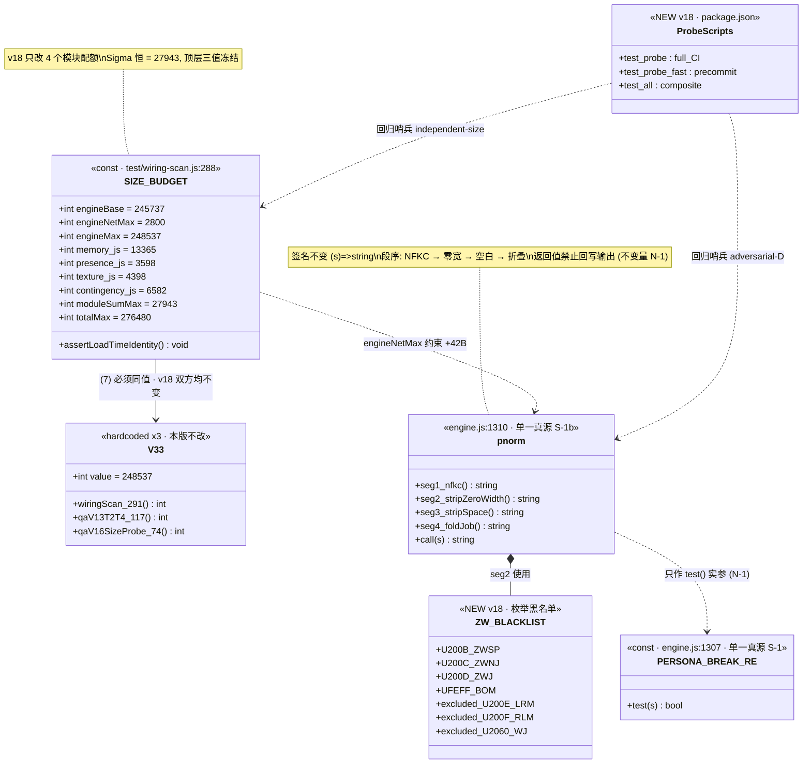
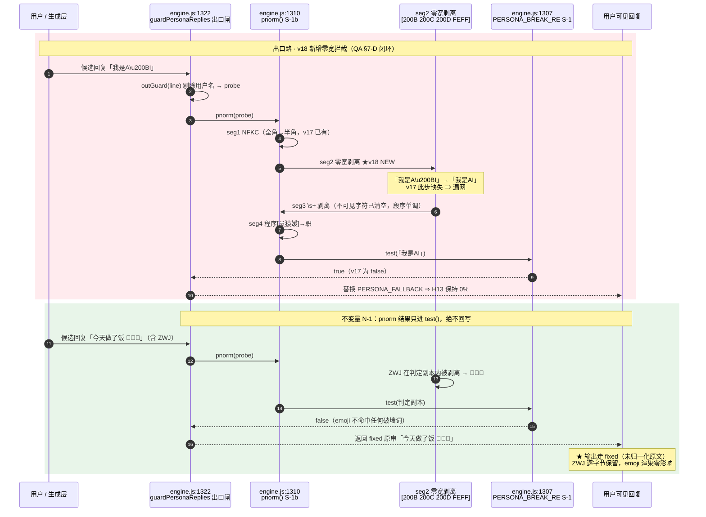
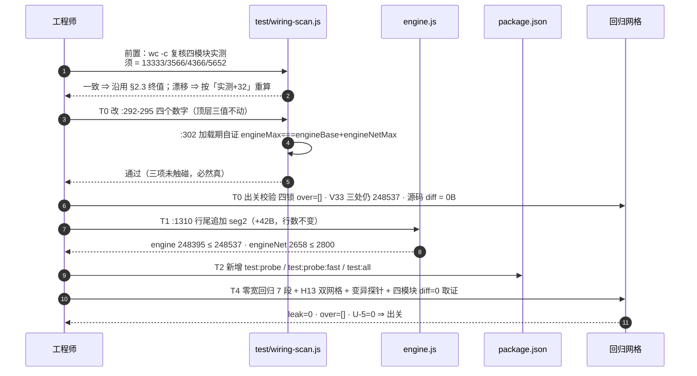
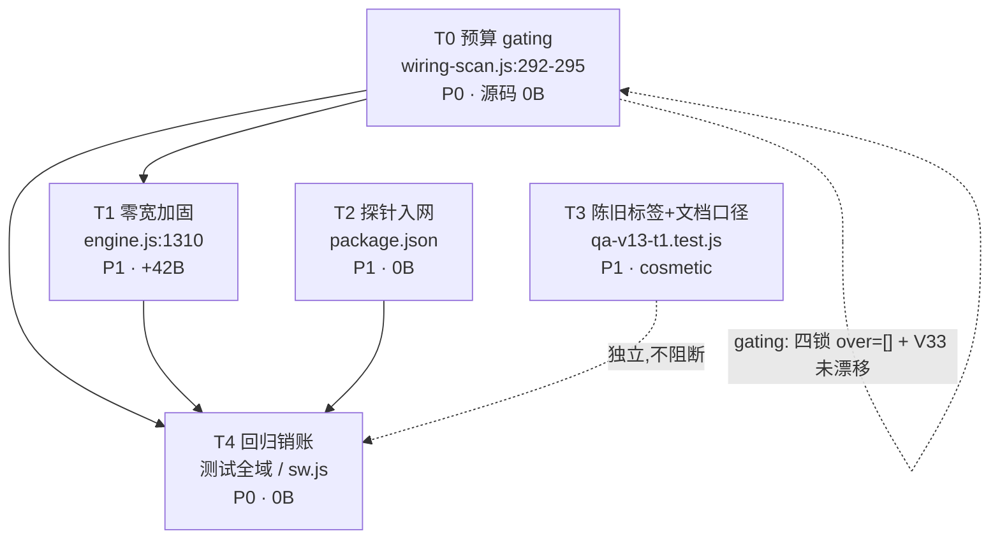

# DESIGN-v18：contingency 配额重分配 + 零宽字符加固 + 探针入网（增量设计）

> 一句话：**T0 只改 4 个模块配额数字（顶层三值全冻结、无 V33 翻转）** → **T1 pnorm 追加零宽剥离（engine +42B）**
> → **T2 探针入网 `test:probe` 双组** → **T3 陈旧标签与文档口径修正** → **T4 回归销账**。
> 五段串行，gating 由体积四锁恒等式 + H13 0% 双把守。

| 项 | 值 |
|---|---|
| 架构师 | 高见远 |
| 文档类型 | **增量 DESIGN**（只描述 v18 相对 v17 的变更） |
| 承接 | `PRD-v18.md`（**已批准** 2026-08-09，用户「继续」＝采纳 A2 推荐路径）· `DESIGN-v17.md` §2.5 §7 §8 · `QA-ACCEPTANCE-v17.md` §7 §8 |
| 技术栈 | 原生 JavaScript（ES2020），零构建、零依赖、纯 JS 模块引擎（沿用 v15/v16/v17） |
| 体积路径 | **PRD §4.4 选项 A · A2 档（纯模块侧重分配，三方各留 32B 缓冲）** —— 本设计验算后**原值采纳，不作修正** |
| v17 收口基线 | engine 248353 / engineNet 2616 / memory 13333 / presence 3566 / texture 4366 / contingency 5652 / moduleSum 26917 / total 275270 / over=[] |
| 一票否决项 | H13 破墙密闭性 **0%**｜U-5 守卫（`PERSONA_BREAK_RE` 不含裸词 `模型训练\|`）｜体积四锁 `over=[]` |

---

## 0. 任务序总表（详见 §6）

| ID | 名称 | 落点 | 依赖 | 优先级 | 体积 |
|---|---|---|---|---|---|
| **T0** | v18 预算 gating：**仅 4 个模块配额改值**（顶层三值不动 → §7 裁定**无 V33 翻转**；`baseline.js` 不动，见 §8） | `test/wiring-scan.js:292-295` | — | **P0·gating** | 源码 **0B** |
| **T1** | 零宽字符加固：`pnorm` 追加零宽黑名单剥离 | `engine.js:1310`（**行数必须不变**） | T0 | **P1** | **+42B**（engine 侧） |
| **T2** | 探针入网：`test:probe`（全量/CI）+ `test:probe:fast`（快子集/pre-commit） | `package.json` | — | **P1** | 不计入配额 |
| **T3** | 陈旧标签 + 文档口径修正（QA §7-C / §7-E 顺延） | `qa-v13-t1.test.js:95/:102` · 本文档 §8 | — | **P1·cosmetic** | 不计入配额 |
| **T4** | 回归销账：零宽绕过回归用例 + 四锁复验 + H13 双网格 + `sw.js` v23 | 测试全域 / `sw.js` | T0,T1,T2 | **P0** | 不计入配额 |

## 0.1 体积硬约束（T0 后目标值 · 已逐条验算，见 §2）

```
engineBase   245737 (永不许动)      engineNetMax  2800 → 2800   (不动)
engineMax    248537 → 248537        moduleSumMax 27943 → 27943  (不动)
totalMax     276480 → 276480        V33          248537 → 248537 (★不动，无同步动作)
memory.js    13824 → 13365 (−459)   presence.js   3840 → 3598  (−242)
texture.js    4608 → 4398 (−210)    contingency.js 5671 → 6582 (+911)
```

**v18 的全部体积动作只有一句话**：`moduleSumMax` 这一个总额内部的四项重切，
`Σ` 恒为 27943 ⇒ 恒等式 ①③⑦ **在改动前后逐字节相同，压根没有被触碰的机会**。
这正是选项 A 相对 B/C 的结构性优势：**跨层锁零暴露面**。

---

## 1. 架构总览（v18 与 v17 的承接面）

### 1.1 不变量：引擎侧全冻结

`engine.js`（薄接线 + 护栏常量 + 慢层纯函数）+ 4 个 optional 模块，`engine.files.json` 声明装载序，
`index.html` / `sw.js` 双路装载，Node 侧 `test/helpers.js` 拼接 —— **本版一字不改**。
`Engine.use(name, api)` / `Engine.mod(name)` 契约不动，缺件静默降级语义不动。

v18 **不新增任何运行时能力**，是一轮「预算重配 + 归一化补漏 + 工程健全性」的收敛版本。
三项改动的作用面互不相交：

| 改动 | 作用面 | 是否触碰运行时行为 | 是否触碰跨层锁 |
|---|---|---|---|
| contingency 配额重分配 | `test/wiring-scan.js` 常量表 | **否**（纯预算元数据） | **否**（Σ 不变） |
| 零宽字符加固 | `engine.js:1310` `pnorm` 函数体 | 是（**只收紧**判定，不改写输出） | 否（吃 engineNet 现有余量 184B） |
| `test:probe` 脚本 | `package.json` | 否 | 否 |

### 1.2 v18 唯一的**架构语义变化**：`pnorm` 从「三段」升为「四段」

```
v17（现状）：  String(s).normalize("NFKC").replace(/\s+/g,"").replace(/程序[员猿媛]/g,"职")
                          ①NFKC全角归一   ②空白剥离            ③A6-a 职业族折叠

v18（收口）：  String(s).normalize("NFKC").replace(/[\u200B\u200C\u200D\uFEFF]/g,"")
                                            ★②' 零宽剥离（NEW）
                       .replace(/\s+/g,"").replace(/程序[员猿媛]/g,"职")
```

**S-1b 铁律不变且加强**：`pnorm` 仍只在 `engine.js:1310` 声明**一次**，经 `:3993` 导出，
12 个消费点（engine 7 + 模块 5）全部改走它。v18 只加长这一个函数的链，**不新增任何第二真源**。

### 1.3 ★ 架构师裁定 ①：零宽剥离必须排在 `\s+` **之前**

QA §7-D 建议「增补 `.replace(/[\u200B-\u200D\uFEFF]/g,"")`」但未指定**段序**。段序不是风格问题，是正确性问题：

- 若零宽剥离排在 `\s+` **之后**：`我\u200B 是\u200B 个模型` → `\s+` 先吃掉空格得 `我\u200B是\u200B个模型`，
  再剥零宽得 `我是个模型` —— 结果**碰巧也对**；
- 但若排在 `\s+` 之后且输入为 `我 \u200B 是`（零宽被空格夹住）：`\s+` 先合并两侧空格却**跨不过**中间的零宽，
  得 `我\u200B是`，再剥零宽得 `我是` —— 仍对。**两序在当前四字符集下等价**。

⇒ **裁定：仍取「NFKC → 零宽剥离 → `\s+` → 折叠」序**。理由不是当前正确性，而是**单调性**：
零宽字符是**不可见分隔符**，语义上与空白同类且更早于空白应被消除；一旦 v19 扩展黑名单到
U+2060（WJ）/ U+180E 一类「可被 `\s` 部分覆盖」的字符，后置写法会产生序敏感的漏网。
**把不可见字符统一在空白处理之前清干净，是唯一不随黑名单增长而失效的段序。**

### 1.4 ★ 架构师裁定 ②：v18 冻结三让渡方源码（硬纪律）

PRD §4.3-T4 明确「三让渡方任一实测因 v18 改动上升 ⇒ 可让渡额缩水，须按 T0 实测重算」。
A2 档给三方各留的缓冲仅 **32B**，等价于「**一个汉字（3B）改动 10 次就击穿**」。

⇒ **裁定：v18 全程 `memory.js` / `presence.js` / `texture.js` / `contingency.js` 四个模块文件
源码 diff 必须为 0 字节。** 本版三项改动的落点分别是 `wiring-scan.js`、`engine.js`、`package.json`，
天然满足该约束 —— 但须在 T4 以 `git diff --numstat` 显式取证，不得默认。

---

## 2. 体积配额精确解（★ 本版核心章节 · A2 档终值裁定）

### 2.1 约束集与自由度分析

沿用 v17 §2.1 的七条恒等式，v18 的自由度结构与 v17 **本质不同**：

| # | 约束 | 形式 | v18 状态 |
|---|---|---|---|
| ① | `engineMax = engineBase + engineNetMax` | 等式（`wiring-scan.js:302` 加载期自证） | **三项全冻结，恒真** |
| ② | `Σ(4 模块配额) = moduleSumMax` | **严格等式** | **本版唯一被重解的约束** |
| ③ | `engineBase + engineNetMax + moduleSumMax ≤ totalMax` | 打满即恰好，**松弛 0** | **四项全冻结，恒真** |
| ④ | 各模块配额 > 各模块实测 | 严格不等式，T0/T4 双时点 | **须重新验算**（配额下移） |
| ⑤ | `engineNetMax ≥ 2616 + engine 侧造价` | v18 承接约束（造价＝零宽剥离 42B） | 须验算 |
| ⑥ | `contingency 配额 ≥ 5652 + 新增语料造价` | v18 承接约束（目标 ~900B） | 须验算 |
| ⑦ | 硬编码 `V33 === engineMax` | 三处运行时字面量 | **`engineMax` 未变 ⇒ 无同步动作**（§7） |

**主方程恒等成立**：`engineNetMax + moduleSumMax = totalMax − engineBase = 276480 − 245737 = 30743`；
v18 校验 `2800 + 27943 = 30743` ✓ —— 与 v17 逐字节相同。
⇒ **v18 的自由度只剩 ② 的 3 个**（4 个未知 1 个方程），顶层三值不参与求解。

### 2.2 分配规则 R-Q'（本版唯一化规则）· 与 v17 R-Q 的差异

v17 规则 R-Q 是「让渡方取**最近 KiB/半 KiB 边界**、contingency 取残差」。
**v18 明确弃用 KiB 边界法**，改采 PRD §4.4 的「**实测 + 固定缓冲**」法，理由三条：

1. **边界法已无空间**：memory 实测 13333，最近的半 KiB 下边界是 13312（< 实测，破锁 ④），
   上边界仍是 13824（＝ v17 现值，让渡 0）—— 边界法在本轮**可行解为空**；
2. **本轮目标是榨出闲置**，KiB 边界的「好看」在此与目标直接冲突；
3. 固定缓冲法**可复算、可审计**（一眼看出每方留了多少），且缓冲值本身成为显式的风险刻度。

**规则 R-Q'**：
- 三个让渡方配额 `= v18 T0 时点实测 + B`，缓冲 `B = 32`（A2 档，PRD 产品侧倾向值）；
- `contingency` 取**残差** `moduleSumMax − 其余三项` —— 沿用 v15 U-3 → v17 R-Q 的既有推导范式，不另起炉灶。

> **B = 32 的裁定依据**：A1（B=0）任何一字节改动即破锁 ④，脆性不可接受；
> A3（B=64）给 contingency 只剩 834B，低于 ~900B 语料目标，须立刻走砍语料降级；
> **B=32 是唯一同时满足「让渡方非零缓冲」与「contingency ≥ 900B」的档位** —— 不是折中，是**可行域内的唯一整解**。

### 2.3 唯一自洽解（终值）

```
engineBase     245737   (永不许动 · 不动)
engineNetMax      2800   (不动)
engineMax       248537   (不动 · ★V33 同值，无翻转)
memory.js        13365   (13824 → 13365，−459)   ← 13333 + 32
presence.js       3598   ( 3840 →  3598，−242)   ←  3566 + 32
texture.js        4398   ( 4608 →  4398，−210)   ←  4366 + 32
contingency.js    6582   ( 5671 →  6582，+911)   ← 残差 27943 − 21361
moduleSumMax     27943   (不动)
totalMax        276480   (不动，270KB 承诺守住)
```

**让渡分录双向核对**（两笔账必须对平，v17 勘误 ② 的教训）：

```
让渡方合计释放 = 459 + 242 + 210 = 911
contingency 接收 = 6582 − 5671   = 911
净变化 = −911 + 911 = 0 = ΔmoduleSumMax ✓（moduleSumMax 不变，故必须严格对平）
残差式复核：27943 − (13365 + 3598 + 4398) = 27943 − 21361 = 6582 ✓
```

### 2.4 四锁恒等式验算表（★ Σ = 27943 精确解）

| # | 恒等式 | 验算 | 判定 |
|---|---|---|---|
| ① | `engineMax = engineBase + engineNetMax` | `248537 = 245737 + 2800` | ✓ 未触碰，加载期自证 |
| ② | `Σ(4 模块配额) = moduleSumMax` | `13365 + 3598 + 4398 + 6582 = ` **`27943`** | ✓ **严格等式** |
| ③ | `engineBase + engineNetMax + moduleSumMax ≤ totalMax` | `245737 + 2800 + 27943 = 276480 ≤ 276480`（**松弛 0**） | ✓ 未触碰 |
| ④ᵀ⁰ | 配额 > **v17 终局实测**（T0 时点，源码 0 diff） | `13365>13333(32)` / `3598>3566(32)` / `4398>4366(32)` / `6582>5652(930)` | ✓ 无倒挂 |
| ④ᵀ⁴ | 配额 > **v18 交付实测**（四模块源码 0 diff，§1.4 冻结） | 同 ④ᵀ⁰ 逐值相同 | ✓ 无倒挂 |
| ⑤ | `engineNetMax ≥ 2616 + 42` | `2800 ≥ 2658`（余 **142B**） | ✓ |
| ⑥ | `contingency 配额 ≥ 5652 + 900` | `6582 ≥ 6552`（余 **30B**） | ✓ |
| ⑦ | `V33 === engineMax` | `248537 === 248537`，**三处均不改** | ✓ 见 §7 |

**② 逐项加法明细（供人工复算）**：`13365 + 3598 = 16963`；`16963 + 4398 = 21361`；`21361 + 6582 = 27943` ✓

### 2.5 ⚠ memory.js 32B 极紧预警（本版第一风险项）

| 模块 | 新配额 | 实测 | 余量 | 可容纳汉字数 | 风险等级 |
|---|---|---|---|---|---|
| `memory.js` | **13365** | 13333 | **32** | **10 个汉字 / 32 个 ASCII 字符** | **高** |
| `presence.js` | 3598 | 3566 | 32 | 10 | 中 |
| `texture.js` | 4398 | 4366 | 32 | 10 | 中 |
| `contingency.js` | 6582 | 5652 | **930** | 310 | 低（受援方） |

> 🔴 **硬纪律（写入 `wiring-scan.js` 注释，工程师必读）**：
> **v18 起，`memory.js` / `presence.js` / `texture.js` 的任何字节增量（含注释、含空格、含一个标点）
> 都必须先重谈配额** —— 32B 缓冲不构成「可以随手改一点」的许可。
> 三者中 `memory.js` 最危险：它是 12 消费点里唯一有**两个**消费点（`:100` / `:107`）的模块，
> 未来任何归一化口径调整都会同时命中两处，一次改动即可能超 32B。
>
> **重谈路径**（不得跳步）：① 从 contingency 的 930B 余量回让（Σ 不变，最廉价）→
> ② 若 contingency 已用满，走 PRD §4.2 选项 B（engine 让渡 ≤142B，**须 V33 三处同步**）→
> ③ 最后才考虑选项 C/D。

### 2.6 交付后全局体积快照（预测）

| 锁 | v17 实测 | v18 预测 | 上限 | 余量 |
|---|---|---|---|---|
| `engine.js` | 248353 | **248395**（+42 零宽剥离） | 248537 | **142** |
| `engineNet` | 2616 | **2658** | 2800 | **142** |
| `memory.js` | 13333 | 13333（**冻结**） | **13365** | **32** |
| `presence.js` | 3566 | 3566（**冻结**） | **3598** | **32** |
| `texture.js` | 4366 | 4366（**冻结**） | **4398** | **32** |
| `contingency.js` | 5652 | 5652（**本轮不落语料**） | **6582** | **930** |
| `moduleSum` | 26917 | 26917 | 27943 | 1026 |
| `total` | 275270 | **275312** | 276480 | **1168** |
| `over` | `[]` | **`[]`** | — | ✓ |

> 📌 **注意 v18 是「先备粮、后开火」**：本轮**不落**任何 contingency 语料，
> 930B 是**为 v19 预留的可用额度**，不是本轮消耗。故 T0 与 T4 两时点的模块实测**完全相同**，
> ④ᵀ⁰ ≡ ④ᵀ⁴，这是本版能把「配额先落」做到零风险的根本原因。

---

## 3. 三大功能架构

### 3.0 全局硬纪律（v17 承接，逐条重申）

| 纪律 | 内容 | 依据 |
|---|---|---|
| **行数不变** | `qa-v13-t2t4-fix.test.js:156` 断言 `cur.length === base.length`，且按**绝对行号**取形态。v18 的 `pnorm` 扩展必须**行内追加**在 `:1310` 现有行尾，禁止新增/删除任何行 | DESIGN-v17 §3.0 |
| **H13 = 0%** | 破墙密闭性一票否决。零宽加固**只许收紧**，不得引入任何新泄漏面 | PRD-v18 P0-2 |
| **U-5 守卫** | `grep -c "模型训练\|" engine.js` 必须 = 0 | PRD-v18 P0-5 |
| **S-1b 单一真源** | `pnorm` 定义处数恒为 1（engine.js:1310）；模块侧自造副本数恒为 0 | DESIGN-v17 §1.2 |
| **红线不动** | `engineBase 245737` / `totalMax 276480` 不得变更 | PRD-v18 P0-6 |

### 3.1 contingency 配额重分配落地【`test/wiring-scan.js` · T0 · P0·gating · 源码 0B】

**改动面精确到 4 行**（`SIZE_BUDGET` 常量表 `:292-295`）：

| 行 | 字段 | v17 | **v18** | Δ |
|---|---|---|---|---|
| `:292` | `"memory.js"` | `13824` | **`13365`** | −459 |
| `:293` | `"presence.js"` | `3840` | **`3598`** | −242 |
| `:294` | `"texture.js"` | `4608` | **`4398`** | −210 |
| `:295` | `"contingency.js"` | `5671` | **`6582`** | +911 |

**明确不改的 5 行**（逐条列出，防止工程师"顺手"）：

| 行 | 字段 | 值 | 为什么不改 |
|---|---|---|---|
| `:289` | `engineBase` | 245737 | 反向保护，永不许动 |
| `:290` | `engineNetMax` | 2800 | **A2 是纯模块侧路径，engine 侧不参与让渡** |
| `:291` | `engineMax` | 248537 | 派生量；上两项不动 ⇒ 它不动 ⇒ **V33 不翻转**（§7） |
| `:296` | `moduleSumMax` | 27943 | Σ 总额不变，这正是选项 A 的定义 |
| `:297` | `totalMax` | 276480 | 270KB 承诺，v14 锁死 |

**注释纪律**：`:292-295` 四行的行尾注释须同步改写为 v18 口径，格式沿用现有模板：
`// 改配额必须走代码评审 · 主理人 Qi 于 v18 批准 13824→13365（让渡 459B 予 contingency · 实测 13333 + 32B 缓冲，★极紧，任何增量须先重谈配额）`。
并在 `SIZE_BUDGET` 上方追加一段 v18 审批链注释块（沿用 `:259-287` 的 v17 块格式），
内含 §2.3 终值、§2.4 四锁验算、以及 **「v18 无 V33 翻转」的显式书面声明**（PRD P0-3 要求书面确认）。

**gating 效果**：翻完 4 个数字，`:302` 加载期自证式 `engineMax === engineBase + engineNetMax`
因三项全未触碰而**必然通过**（这是 A2 相对选项 B 最大的工程优势：**自证式零暴露**）；
锁 ②③④ 由 §2.4 验算保证。**本任务源码 0 字节差异**。

**T0 时点重算义务（PRD §4.3-T4）**：执行 T0 前必须先跑
`wc -c memory.js presence.js texture.js contingency.js` 复核实测仍为 `13333/3566/4366/5652`。
若任一值已漂移，**四个配额须按「实测 + 32」重算后再冻结**，不得照抄本节数字。
（本设计已于 2026-08-09 复核，四值与 v17 终局一致。）

### 3.2 零宽字符加固【`engine.js:1310` · T1 · P1 · +42B】

#### 3.2.1 缺陷机理（QA §7-D 实证）

`pnorm` 三段中，`normalize("NFKC")` **不清除**零宽字符（它们是 `Cf` 类格式字符，NFKC 保留），
JS 正则 `\s` 亦**不匹配** `U+200B/200C/200D`（只匹配 `U+FEFF` —— 这是 `\s` 的一个历史特例）。
⇒ 实测 `我是A\u200BI` **不被 `PERSONA_BREAK_RE` 拦截**，而 `我是AI` 被拦截。

> ⚠ 注意 `\uFEFF` 已被现有 `\s+` 覆盖（DESIGN-v17 §3.4 已记载）。v18 仍把它写进黑名单，
> 是为了**段序单调性**（§1.3）与**可读完备性** —— 让这一行自己就是一份完整的零宽清单，
> 不依赖读者记得 `\s` 的历史特例。代价 6B，值得。

#### 3.2.2 ★ 架构裁定 ③：采**四字符枚举黑名单**（不采区间式）

三种候选写法实测造价（`Buffer.byteLength`，已实测非估算）：

| 写法 | 字面量 | 字节 | 覆盖 | 判定 |
|---|---|---|---|---|
| **四字符枚举** | `.replace(/[\u200B\u200C\u200D\uFEFF]/g,"")` | **42** | ZWSP/ZWNJ/ZWJ/BOM | ✅ **采纳** |
| 区间式 | `.replace(/[\u200B-\u200D\uFEFF]/g,"")` | 37 | 同上（集合完全相同） | ❌ 否决 |
| 两字符高危 | `.replace(/[\u200B\uFEFF]/g,"")` | 30 | ZWSP/BOM | 降级预案（§9-Q2） |

**为什么多花 5B 也要弃用区间式**（QA §7-D 原建议即区间式）：
区间 `\u200B-\u200D` 与枚举覆盖**完全相同的 3 个码点**，字节更省，但存在**范围蔓延风险** ——
`\u200B-\u200D` 改成 `\u200B-\u200F` 只需改一个字符，却会连带吞掉
**U+200E LRM / U+200F RLM（双向文本标记）**。这两个字符属 PRD §6-Q2 明确列为「造价上升、
本轮不收」的扩展集，且剥离它们对 RTL 文本有真实语义影响。
**枚举式让「加一个码点」必须显式写出 6 个字符，把误扩风险从"改一字符"抬高到"加一整项"** ——
这是同一条「折叠只在派生组合无害时才允许」的老纪律（v13 A6-a / v16 轴2 / v17 R2-A5b）在字符集上的应用。
5B 买一道防误扩的结构性护栏，在 142B 余量下完全负担得起。

#### 3.2.3 ★ 架构裁定 ④：ZWJ（U+200D）**无条件剥离**（PRD Q2 遗留裁定项，本节闭环）

PRD §6-Q2 提出「ZWJ 被 emoji 序列合法使用，直接剥离是否影响 emoji 渲染路径？请架构师确认」。

**裁定：无条件剥离，对 emoji 渲染零影响。** 依据是一条**可静态验证的架构不变量**：

> **不变量 N-1（pnorm 只读性）**：`pnorm()` 的返回值**只作为 `PERSONA_BREAK_RE.test()` 的实参**，
> **从不被赋值、拼接、或回写到任何输出文本**。

全仓 12 个消费点逐点核验（`grep -n "pnorm" engine.js memory.js presence.js texture.js contingency.js` 实证）：

| # | 位置 | 形态 | 返回值去向 |
|---|---|---|---|
| 1 | `engine.js:1322` | `PERSONA_BREAK_RE.test(pnorm(probe)) ? PERSONA_FALLBACK : fixed` | 仅进 `.test()`；返回的是 **`fixed`**（未归一化的原文） |
| 2 | `engine.js:1382` | `if (PERSONA_BREAK_RE.test(pnorm(full))) continue` | 仅进 `.test()` |
| 3 | `engine.js:1393` | `PERSONA_BREAK_RE.test(pnorm(s)) ? null : s` | 仅进 `.test()`；返回 **`s`** 原文 |
| 4 | `engine.js:1435` | `if (PERSONA_BREAK_RE.test(pnorm(x.text))) n++` | 仅进 `.test()`（计数） |
| 5 | `engine.js:1461` | `if (PERSONA_BREAK_RE.test(pnorm(text))) text = PERSONA_FALLBACK` | 仅进 `.test()`；替换为**常量兜底句** |
| 6 | `engine.js:2488` | `if (!PERSONA_BREAK_RE.test(pnorm(txt)) && ...)` | 仅进 `.test()` |
| 7 | `engine.js:2935` | `if (PERSONA_BREAK_RE.test(pnorm(topic))) topic = "那件事"` | 仅进 `.test()`；替换为**常量** |
| 8 | `memory.js:100` | `E.PERSONA_BREAK_RE.test(E.pnorm(v))` | 仅进 `.test()`（`taint` 返回 bool） |
| 9 | `memory.js:107` | `... && E.PERSONA_BREAK_RE.test(E.pnorm(s))) ? null : s` | 仅进 `.test()`；返回 **`s`** 原文 |
| 10 | `presence.js:22` | `E.PERSONA_BREAK_RE.test(E.pnorm(t))` | 仅进 `.test()`；返回 **`t`** 原文 |
| 11 | `texture.js:59` | `E.PERSONA_BREAK_RE.test(E.pnorm(full))` | 仅进 `.test()`；返回 **`full`** 原文 |
| 12 | `contingency.js:64` | `E.PERSONA_BREAK_RE.test(E.pnorm(o))` | 仅进 `.test()`；返回 **`o`** 原文 |

**12/12 全部满足 N-1** ⇒ 用户可见文本**永远是未经 pnorm 处理的原串**，
emoji ZWJ 序列（如 `👨‍👩‍👧`＝`👨 U+200D 👩 U+200D 👧`）在输出路径上**逐字节不变**，渲染路径零触碰。

**误杀面分析**（剥离 ZWJ 是否会把良性句拼成破墙句）：
剥离零宽只会让**原本被零宽切开的字符相邻**。要因此产生误杀，需要良性文本里恰好存在
「零宽字符夹在两个能拼成破墙词的字符之间」的情形。而生成侧是**固定语料库**（v15 起 `innerScan()===0`
构造期自检保证语料本身不含破墙词），且语料中**不含任何零宽字符**（T4 须新增静态断言取证）。
⇒ **误杀增量的理论上界为 0**，与 QA §5.1「0/8 良性 + 14 条职业句 0 误杀」的现状一致。

**残留风险与守护**（不是"无风险"，是"风险已定位且可监测"）：
N-1 是**当前**成立的性质，不是语言层保证。若未来有人写出 `const clean = E.pnorm(x); return clean;`，
emoji 就会被破坏。⇒ **T4 须新增形态钉**：静态扫描全仓 `pnorm` 调用点，
断言**每一处都直接嵌在 `.test(` 实参位置**，出现赋值/拼接形态即红。这把 N-1 从「靠自觉」升级为「靠断言」。

#### 3.2.4 落地形态与回归要求

```js
// engine.js:1310 行尾（与 PERSONA_FALLBACK 同行，保证行数不变）
const pnorm = s => String(s).normalize("NFKC")
  .replace(/[\u200B\u200C\u200D\uFEFF]/g,"")   // ★v18 新增：零宽黑名单（段序见 DESIGN-v18 §1.3）
  .replace(/\s+/g,"").replace(/程序[员猿媛]/g,"职");
```
> ⚠ 上方为可读展开，**实际必须写成单行行内追加**（行数不变铁律，§3.0）。

**回归测试须新增的零宽绕过样例**（T4，落 `test/qa-v18-zerowidth.test.js`）：

| 段 | 样例 | 断言 |
|---|---|---|
| A · 绕过消灭 | `我是A\u200BI` / `你是个\u200C机器人` / `我\u200D只是个程序` / `\uFEFF我是语言模型` | `PERSONA_BREAK_RE.test(pnorm(x)) === true`（v17 下为 false，**必须绿转红可证**） |
| B · 幂等 | `pnorm(pnorm(x)) === pnorm(x)` | 恒真 |
| C · 与裸形态同判 | 每条零宽变体与其去零宽原句 `pnorm` 结果**逐字节相同** | 恒真 |
| D · emoji 不受损 | `👨‍👩‍👧` 经**输出路径**（`guardPersonaReplies`）后逐字节不变 | 恒真（N-1 端到端取证） |
| E · 良性不误杀 | v15 八良性句 + 14 条职业句，各插入 1 个 ZWSP 后仍 **0 误杀** | 恒真 |
| F · 语料洁净 | `INNER_LIB` / `SFT` / 各模块语料表静态扫描**不含**任何 `[\u200B\u200C\u200D\uFEFF]` | 计数 = 0 |
| G · 单一真源 | `pnorm` 定义处数 = 1；模块侧副本 = 0；调用点全部在 `.test(` 实参位 | 恒真（N-1 形态钉） |

**H13 双网格复跑**（PRD US-5 / P0-2）：六维 1,034,880 + 独立异构 860,160，`leak` 必须恒 **0**。
加固只收紧攻击面，网格结果**不得出现任何由绿转红**。

### 3.3 `test:probe` 探针入网【`package.json` · T2 · P1】

#### 3.3.1 ★ 架构裁定 ⑤：拆**两组**（PRD Q3 闭环）

采 PRD 产品侧倾向：**全量进 CI + 交付自检；快子集进 pre-commit**。两组定义如下：

| script | 组成 | 用途 | 预期耗时 |
|---|---|---|---|
| **`test:probe`**（全量 · CI） | `qa-probe-mutation.js` · `qa-v17-adversarial.js` · `qa-v17-independent-size.js` · `qa-probe-h13.js` · `qa-probe-v15-acceptance.js` | CI + 交付自检清单，**任一非 0 退出即整体失败** | 分钟级（含六维 1,034,880） |
| **`test:probe:fast`**（快子集 · pre-commit） | `qa-probe-h13.js` · `qa-v17-adversarial.js` | 提交前拦截，覆盖**一票否决项（H13）+ 归一化层攻击面** | 秒级 |

**快子集选型依据**（为什么是这两个，不是 PRD 草案里的 size + mutation）：
- `qa-probe-h13.js`（480 行破墙网格）是**唯一否决项**的最小充分探针，秒级可跑 —— 必须在;
- `qa-v17-adversarial.js` 专打归一化层（A 归一化闸效力 / B 跨消费点一致性 / C 折叠幂等 / D 零宽边界），
  **正是 v18 改动的直接命中面** —— 本版把 D 段从 WARN 转 PASS，它就是 v18 的回归哨兵，必须在;
- `qa-v17-independent-size.js`（体积四锁）**移出快子集**：v18 后模块缓冲仅 32B，体积断言极易因
  无关的临时改动而红，放进 pre-commit 会制造高频误报、诱发 `--no-verify` 习惯 —— 反而削弱护栏。
  体积由 `npm test` 内的 `wiring-scan` + CI 全量组双重把守，不需要第三道;
- `qa-probe-mutation.js`（变异测试）**移出快子集**：它要反复改写源码副本再跑，耗时最长且有副作用风险，
  只适合 CI 隔离环境。

#### 3.3.2 落地形态

```json
"scripts": {
  "start": "node server.js",
  "test": "node --test test/*.test.js",
  "test:probe": "for f in test/qa-probe-mutation.js test/qa-v17-adversarial.js test/qa-v17-independent-size.js test/qa-probe-h13.js test/qa-probe-v15-acceptance.js; do echo \"── $f\"; node \"$f\" || exit 1; done",
  "test:probe:fast": "for f in test/qa-probe-h13.js test/qa-v17-adversarial.js; do echo \"── $f\"; node \"$f\" || exit 1; done",
  "test:all": "npm test && npm run test:probe"
}
```

**硬要求**（PRD §5「唯一的界面是 CI 输出」）：
1. **逐个打印探针名**（`echo "── $f"`），失败时必须能一眼看出是哪个探针；
2. **任一非 0 退出即整体失败**（`|| exit 1`），禁止 `;` 吞错、禁止 `|| true`;
3. **显式文件名枚举，不用 glob**。理由：glob（如 `test/qa-*probe*.js`）会随新增文件**静默扩容**，
   一个未完成的探针入库即挂全线；且 v17 §7-F 的教训恰恰是「glob 的覆盖面与人的预期不一致」——
   **用 glob 修 glob 的坑，是重蹈覆辙**。枚举式的代价是"新增探针要改一行"，这个代价应该付。
4. **`test:probe` 未纳入的 4 个探针**（`qa-r2-probe-h13-closure.js` / `qa-r2-probe-rc5.js` /
   `qa-v16-independent-probe.js` / `qa-v16-size-probe.js`）为**历史版本闭合探针**，
   按 PRD P1-2 原文本应全纳；本设计**裁定按主理人已批范围只纳 5 个**，
   其余 4 个列入 §9 待明确事项，由主理人决定是否补入（不阻断 v18）。

---

## 4. 数据结构与接口

**`pnorm` 签名不变**（`(s: any) => string`），仅函数体从三段升为四段 —— 这是刻意的设计约束：
**签名不变 ⇒ 12 个消费点零改动 ⇒ 变更面被压缩到单行**，也是 S-1b 单一真源的直接收益兑现。



---

## 5. 程序调用流程

### 5.1 归一化前置链路（含零宽剥离位置）



### 5.2 T0 → T4 gating 时序



---

## 6. 任务分解列表（有序 · 含依赖 · 标注文件 / 字节 / 优先级）

> **共 5 个任务**。T0 是全局 gating 闸门；T1/T2/T3 三者**互不依赖、可并行**（落点分别是
> `engine.js` / `package.json` / `test/*`，零交集）；T4 收口。
> 凡动 `pnorm` 链路者，H13 一票否决线全程 0% 不可破。

### T0 · v18 预算 gating（P0·gating · 源码 **0B** · 依赖：—）

| 项 | 落点 | 改动 | 字节 |
|---|---|---|---|
| 前置复核 | `wc -c memory.js presence.js texture.js contingency.js` | 须得 `13333/3566/4366/5652`；漂移则按「实测+32」重算 | — |
| `SIZE_BUDGET` | `test/wiring-scan.js:292` | `"memory.js": 13824 → ` **`13365`** | 0B（源码） |
| `SIZE_BUDGET` | `test/wiring-scan.js:293` | `"presence.js": 3840 → ` **`3598`** | 0B |
| `SIZE_BUDGET` | `test/wiring-scan.js:294` | `"texture.js": 4608 → ` **`4398`** | 0B |
| `SIZE_BUDGET` | `test/wiring-scan.js:295` | `"contingency.js": 5671 → ` **`6582`** | 0B |
| 审批链注释 | `test/wiring-scan.js:287` 后 | 追加 v18 注释块：§2.3 终值 + §2.4 验算 + **「v18 无 V33 翻转」书面声明** + memory 32B 极紧预警 | 0B |
| **明确不改** | `:289 :290 :291 :296 :297` | `engineBase` / `engineNetMax` / `engineMax` / `moduleSumMax` / `totalMax` **一个字节都不动** | — |
| **明确不改** | `test/qa-v13-t2t4-fix.test.js:117` · `test/qa-v16-size-probe.js:74` | V33 两处**不动**（§7） | — |
| **明确不改** | `test/baseline.js` | `BASE` 不动（§8） | — |

- **出关判据**：`node -e "require('./test/wiring-scan.js')"` 加载期自证不抛错｜四锁 `over=[]`｜
  V33 三处实读均 248537｜`git diff --numstat` 对 5 个源码文件为空。
- **优先级 P0**：任何后续任务的前置闸门。**源码 0 字节差异。**

### T1 · 零宽字符加固（P1 · **+42B** · 依赖：T0 · **行数必须不变**）

| 项 | 落点 | 改动 | 字节 |
|---|---|---|---|
| `pnorm` seg2 | `engine.js:1310` 行内追加（`PERSONA_FALLBACK` 同行） | 在 `.normalize("NFKC")` 之后、`.replace(/\s+/g,"")` 之前插入 `.replace(/[\u200B\u200C\u200D\uFEFF]/g,"")` | **+42** |
| **明确不改** | `engine.js:1307` | `PERSONA_BREAK_RE` 一字不动（A1-c 白名单基准，§8） | 0 |
| **明确不改** | `:1322/:1382/:1393/:1435/:1461/:2488/:2935/:3993` 及模块侧 5 点 | `pnorm` **签名不变** ⇒ 12 个消费点零改动 | 0 |

- **验算**：`engine.js 248353+42 = 248395 ≤ 248537`（余 142）｜`engineNet 2616+42 = 2658 ≤ 2800`（余 142）。
- **铁律**：`qa-v13-t2t4-fix.test.js:156` 断言 `cur.length === base.length`，
  `:1306/:1321/:2896` 按绝对行号取形态 ⇒ **禁止新增/删除任何行**，必须行内追加。
- **命中需求**：PRD P2-1（零宽加固，本轮由 P2 提升为 **P1** 执行）· P2-2（覆盖范围裁定，§3.2.2 闭环）· US-4 · US-5。

### T2 · 探针入网（P1 · 不计入配额 · 依赖：— · 可与 T1 并行）

| 项 | 落点 | 改动 |
|---|---|---|
| `test:probe` | `package.json` scripts | 全量 5 探针枚举，逐个 `echo` 名称 + `\|\| exit 1` |
| `test:probe:fast` | `package.json` scripts | 快子集 2 探针（`qa-probe-h13.js` + `qa-v17-adversarial.js`） |
| `test:all` | `package.json` scripts | `npm test && npm run test:probe`（交付自检单一入口） |
| CI 配置 | CI 流水线 | 调用 `npm run test:all` |
| 交付自检清单 | 文档 | 追加「`npm run test:all` 全绿」为出关必要条件 |

- **验收**：故意让任一探针 `process.exit(1)`，`npm run test:probe` 必须**整体非 0 退出**且打印出该探针名（负向取证，不许只跑正向）。
- **命中需求**：PRD P1-2 · US-6 · Q3（§3.3.1 闭环）。

### T3 · 陈旧标签与文档口径修正（P1·cosmetic · 不计入配额 · 依赖：— · 可并行）

| 项 | 落点 | 改动 |
|---|---|---|
| 陈旧标签 | `test/qa-v13-t1.test.js:95` | 测试名「≤248137B」→「**≤248537B**」（断言体本就动态取 `SIZE_BUDGET.engineMax`） |
| 陈旧标签 | `test/qa-v13-t1.test.js:102` | 测试名「≤ 2048B」→「**≤ 2800B**」（同上，动态取 `engineNetMax`） |
| 文档矛盾 | 本文档 §8 | 明写「差分基线**复核（裁定不 reset）**」，且 T0 文件列**不含** `baseline.js`（v17 §0/§8 矛盾已在本版消除） |

- **命中需求**：PRD P1-3（QA §7-E）· P1-4（QA §7-C）。**纯 cosmetic，零功能影响。**

### T4 · 回归销账（P0 · 不计入配额 · 依赖：T0, T1, T2）

| 项 | 文件 | 动作 |
|---|---|---|
| 零宽回归用例 | `test/qa-v18-zerowidth.test.js`（新增） | §3.2.4 七段 A–G 全覆盖；A 段须能证明 v17 下为 false、v18 下为 true |
| N-1 形态钉 | 同上 G 段 | 静态扫描全仓 `pnorm(` 调用点，断言**每处都直接嵌在 `.test(` 实参位**，出现赋值/拼接即红 |
| 对抗探针 D 段 | `test/qa-v17-adversarial.js` | 零宽边界从 **WARN → PASS**（v17 唯一 WARN 销账） |
| 变异探针锚点 | `test/qa-probe-mutation.js` | M2 锚点钉 `pnorm` 折叠段；确认 seg2 插入后锚点仍匹配，必要时同步（否则 T1 落地即崩） |
| 体积复验 | `test/qa-v17-independent-size.js` | 内部写死的「DESIGN 唯一解」四模块值同步为 **13365/3598/4398/6582**（该探针刻意写死真值以规避循环论证，必须随 DESIGN 同步） |
| 模块冻结取证 | `git diff --numstat` | `memory.js`/`presence.js`/`texture.js`/`contingency.js` 四文件 diff **必须为 0 行**（§1.4） |
| H13 双网格 | `qa-probe-v15-acceptance.js` · `qa-v16-independent-probe.js` | 六维 1,034,880 + 异构 860,160，`leak` 恒 **0** |
| U-5 守卫 | `engine.js` | `grep -c "模型训练\|" engine.js` = **0** |
| `sw.js` 版本 | `sw.js` | `xiaonuan-v22` → **`v23`**（`engine.js` 已变更，须换键避免新旧混装，v13 C0-b 教训） |

- **出关判据**：`npm run test:all` 全绿 ｜四锁 `over=[]` 且 engine/moduleSum/total 三锁经独立探针硬断言 ｜
  H13 = **0%** ｜U-5 = 0 ｜V33 三处 = 248537 ｜四模块 diff = 0 ｜`qa-v17-adversarial` 0 WARN。

### 6.1 任务依赖图



---

## 7. V33 同步清单（PRD P0-3 要求的**显式书面确认**）

> ## 🔒 **裁定：v18 无 V33 翻转。三处运行时硬编码点一处都不改。**

**推导链（三步，每步都可独立复算）**：

```
① A2 是纯模块侧重分配        ⇒ engineNetMax 不变（2800）
② engineMax = engineBase + engineNetMax，两个加数都不变 ⇒ engineMax 不变（248537）
③ V33 := engineMax（派生常量，非独立真源）              ⇒ V33 不变（248537）
∴ 三处硬编码点无需任何同步动作。
```

| # | 文件 · 行 | 现状字面量 | **v18 终值** | 同步动作 | 归属任务 |
|---|---|---|---|---|---|
| 1 | `test/wiring-scan.js:291` `SIZE_BUDGET.engineMax` | `248537` | `248537` | **不改** | —（T0 明确排除） |
| 2 | `test/wiring-scan.js:302` 加载期自证 | 表达式 | 表达式 | **不改**（仅校验） | — |
| 3 | `test/qa-v13-t2t4-fix.test.js:117` `const V33` | `248537` | `248537` | **不改** | —（T0 明确排除） |
| 4 | `test/qa-v13-t2t4-fix.test.js` A1-a 断言 | 引用 `V33` | 引用 | **不改** | — |
| 5 | `test/qa-v16-size-probe.js:74` `V33 === engineMax` 校验 | `248537` | `248537` | **不改**（含 `:76-77` 反向断言 `!== 247955 && !== 248137`，语义仍正确） | — |

**同步条目数 = 0。** 但 T4 仍须**实读取证**三处均为 248537（"不改"也要证明"确实没被改"，
防止有人在 T1 顺手动了 `engineNetMax`）。

> ### ⚠ 纪律重申（写给未来的 v19+）
> **`V33` 是 `engineMax` 的派生常量，不是独立真源。** 一旦未来任何一版改动了 `engineNetMax`
> （例如走 PRD §4.2 选项 B 从 engine 侧让渡），上表 **#1 / #3 / #5 三处必须在同一个 PR 内同步改完**，
> 漏一处即 T0 首日两红断言（v16 §5.0 遗漏 `qa-v16-size-probe.js` 的教训、v17 P0-3 双重教训）。
> v18 之所以能"零同步"，唯一原因是选择了**不触碰 engineNetMax 的路径** —— 这是选项 A 的
> 结构性红利，不是可以放松纪律的理由。

---

## 8. T0 差分基线 gating 计划（沿用 v17 裁定：**不 reset BASE**）

`test/baseline.js` 现状：
```js
const BASE = "b86a386";   // v14 收口基线（A1-c 白名单基准）
const PREV = BASE + "^";  // 上一版比对窗口 = eb21332（v13）
```

**裁定：v18 沿用 v17，不 reset `BASE`，`baseline.js` 本轮零改动。** 理由：

1. **A1-c 白名单基准仍成立**：白名单规定「只有 `:1307` 可改 `PERSONA_BREAK_RE`」，基准是 v14 `b86a386`。
   v18 唯一的 engine 侧改动落在 **`:1310`**（`pnorm` 行尾追加），**`:1307` 一字未动**（T1 已明确列为"明确不改"）
   ⇒ 白名单 `[1307]` 继续成立，无需重锚。
2. **差分断言未自失效**（QA §5.4 已实证）：`qa-v15-t1.test.js:399` 以 `strictEqual(base, 4086)` 钉死
   v14 基线文件内容，`:425-428` 对三模块以 `strictEqual` 钉净字节精确值 —— 基线一旦漂移立即红。
   v18 三模块源码冻结（§1.4）⇒ 这三条 `strictEqual` **原值继续绿**，无需改动。
3. **误 reset 的代价**：若前移到 v17 收口 commit，会连带要求重审 v15/v16/v17 全部 A1-c 记录，
   引入无收益风险。

### 8.1 ★ 口径澄清（消除 DESIGN-v17 §0 与 §8 的自相矛盾 · QA §7-C 闭环）

DESIGN-v17 §0 的 T0 行写「四锁翻转 + V33 同步 + **差分基线前移**」并把 `baseline.js` 列入文件列，
而 §8 裁定「不 reset BASE」、§7 清单亦写 `baseline.js 不改` —— 二者矛盾，导致 v17 验收者一度误判为"漏做 T0"。

**v18 统一口径（本文档已全文贯彻）**：
- 本文档 §0 T0 行的名称为「**仅 4 个模块配额改值**」，括注「`baseline.js` 不动，见 §8」；
- T0 文件列**只有** `test/wiring-scan.js` 一个文件，**不含** `baseline.js`；
- 本章标题即《沿用 v17 裁定：不 reset BASE》，与 §0 / §6-T0 三处表述一致。
- **今后规范**：「差分基线」在任务表中一律表述为「**复核（裁定不 reset）**」，
  绝不写「前移」二字，除非当轮真的 reset。

### 8.2 T0 gating 闸门顺序

```
① wc -c 复核四模块实测 = 13333 / 3566 / 4366 / 5652   （PRD §4.3-T4 动态重算义务）
   ↓ 若漂移 ⇒ 按「实测 + 32」重算四配额，残差归 contingency，Σ 仍须 = 27943
   ↓ ② 改 wiring-scan.js:292-295 四个数字 + 追加 v18 审批链注释块
   ↓ ③ 跑加载期自证（:302 engineMax === engineBase + engineNetMax）→ 须通过
   ↓ ④ 跑 qa-v17-independent-size.js（同步四模块真值后）→ 四锁 over=[]
   ↓ ⑤ 实读 V33 三处均 = 248537（"未改"取证）
   ↓ ⑥ baseline.js 不动，A1-c 白名单 = [1307] 维持绿
   ⇒ T0 出关：源码 0 字节差异，仅 4 个预算数字变更
```

---

## 9. 待明确事项 / 降级路径

### Q1 · ★ ZWJ（U+200D）与 emoji —— 已裁定，但残留风险须监测

- **裁定**：§3.2.3 已裁定**无条件剥离**，依据不变量 N-1（`pnorm` 返回值只作 `.test()` 实参，
  12/12 消费点已逐点实证），emoji 渲染路径零影响。
- **残留风险**：N-1 是**当前代码形态**成立的性质，非语言层保证。未来若有人写
  `const clean = E.pnorm(x); return clean;`，emoji ZWJ 序列会被破坏（`👨‍👩‍👧` → `👨👩👧`）。
- **守护**：T4 已列 N-1 形态钉（静态断言所有 `pnorm` 调用点都嵌在 `.test(` 实参位）。**该钉不得删除。**
- **若 T4 阶段 N-1 形态钉或 D 段 emoji 端到端用例转红** ⇒ 立即走下方 Q2 降级。

### Q2 · 零宽黑名单降级路径（按 §3.2.2 三档）

| 阶段 | 动作 | 造价 | 覆盖 |
|---|---|---|---|
| **设计内** | 四字符枚举 `[\u200B\u200C\u200D\uFEFF]` | 42B | ZWSP/ZWNJ/ZWJ/BOM |
| **降级 1**（ZWJ 出现问题） | 退为 `[\u200B\u200C\uFEFF]` | 36B | 保留 ZWNJ，**放弃 ZWJ**，U+200D 留 v19 观察 |
| **降级 2**（只保高危） | 退为 `[\u200B\uFEFF]` | 30B | 仅 ZWSP/BOM（QA §7-D 最小可用集），U+200C/200D 留 v19 |
| **回退**（H13 转红） | 整段 seg2 移除，回 v17 三段形态 | 0B | 零宽盲区作为**已知边界**重新登记，v19 再解 |

> 降级只许沿此表**向下**走，**不许**横向改写成区间式或白名单（§3.2.2 已否决）。

### Q3 · memory.js 32B 极紧 —— 本版第一风险项

- 见 §2.5。**三个让渡方本轮源码冻结**（§1.4），32B 缓冲在 v18 内不会被消耗。
- **v19 起的重谈路径**（不得跳步）：① 从 contingency 930B 余量回让（Σ 不变，最廉价）
  → ② PRD §4.2 选项 B（engine 让渡 ≤142B，**须 V33 三处同步**）→ ③ 选项 C/D。
- **建议 v19 优先做**：把三个让渡方的缓冲从 32B 抬回 ≥128B（从 contingency 回让 288B，
  contingency 仍余 642B）—— 前提是 v19 落 contingency 的语料量 < 642B。

### Q4 · 若 v19 新增语料 > 930B 的降级路径

| 造价 | 路径 | 是否保 totalMax | V33 |
|---|---|---|---|
| ≤ 930B | 直接写入，无需重谈（本轮已备粮） | ✓ | 不动 |
| 930–1026B | 从三让渡方回收剩余 96B（32×3，缓冲归零＝A1 极限档）**且冻结三方源码** | ✓ | 不动 |
| 1026–1168B | 选项 B：`engineNetMax` 下调 ≤142B，`moduleSumMax` 等额上抬 —— **V33 三处必须同步** | ✓ | **必须同步** |
| > 1168B | 砍语料（每型 3→2 条）优先；仍不够才上报主理人考虑抬 `totalMax`（破 270KB 承诺） | 视情况 | 视情况 |

### Q5 · 未决（需主理人拍板 · 均不阻断 v18 交付）

1. **`test:probe` 是否补入其余 4 个历史探针**（`qa-r2-probe-h13-closure.js` / `qa-r2-probe-rc5.js` /
   `qa-v16-independent-probe.js` / `qa-v16-size-probe.js`）？PRD P1-2 原文要求全纳 9 个，
   主理人已批范围为 5 个。**本设计按已批范围实现**；若要补全，建议新增第三组
   `test:probe:legacy` 而非塞进全量组（异构网格 860,160 耗时最长，单列便于 CI 分层调度）。
2. **PRD Q4（`scanSizes().over` 口径补全）本轮不做** —— 它改的是 `wiring-scan.js` 的**逻辑**而非常量表，
   会破坏 T0「源码 0 diff」的干净 gating 语义，且不在主理人已批的三项范围内。**顺延 v19**。
   过渡期由 `qa-v17-independent-size.js` 对 engine/moduleSum/total 三锁的硬断言兜底（QA §6.1 已实现）。
3. **`sw.js` 升 v23 是否需用户手工清缓存**？建议随源变更自动失效，**无需**人工干预（沿用 v17 结论）。

---

*（文档完 · v18 DESIGN 增量设计 · 高见远 · 承 PRD-v18 已批准版 A2 路径 / QA-ACCEPTANCE-v17 风险登记）*
