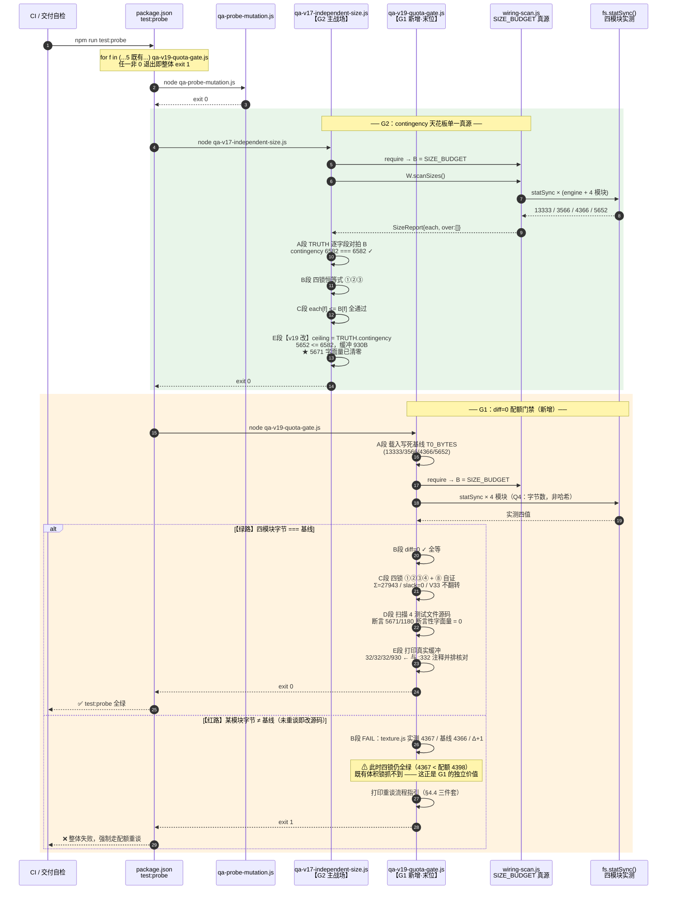
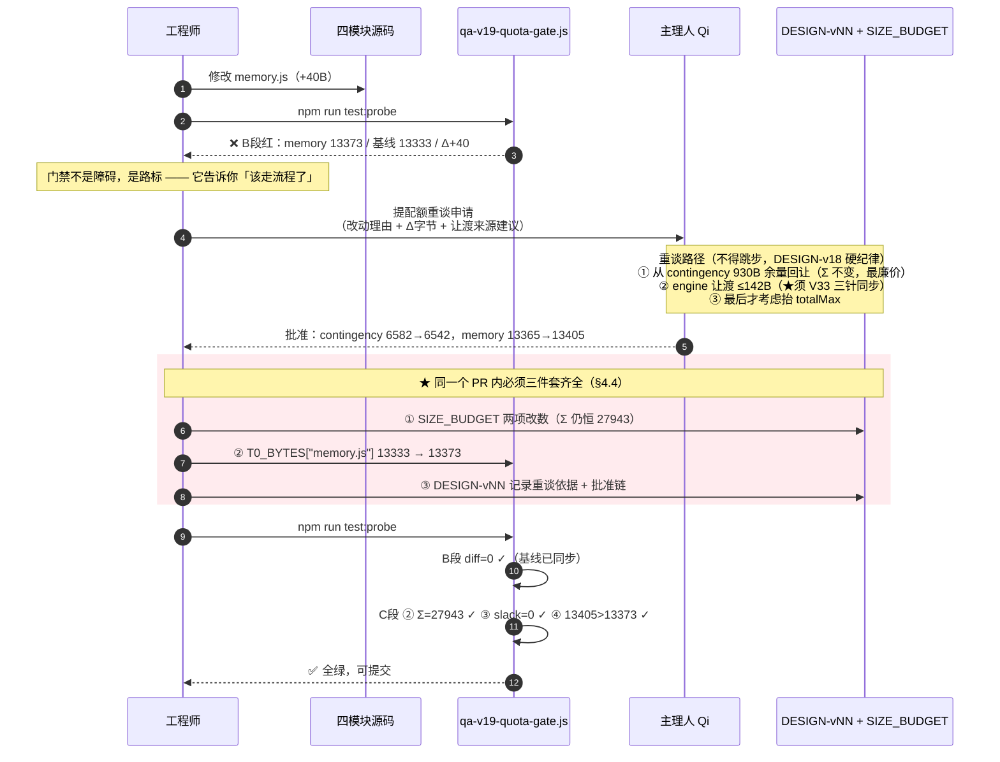
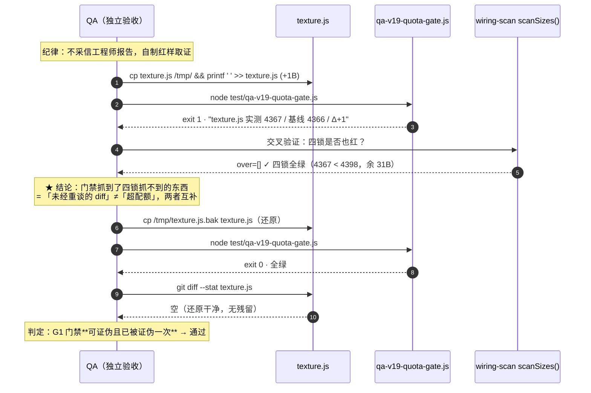
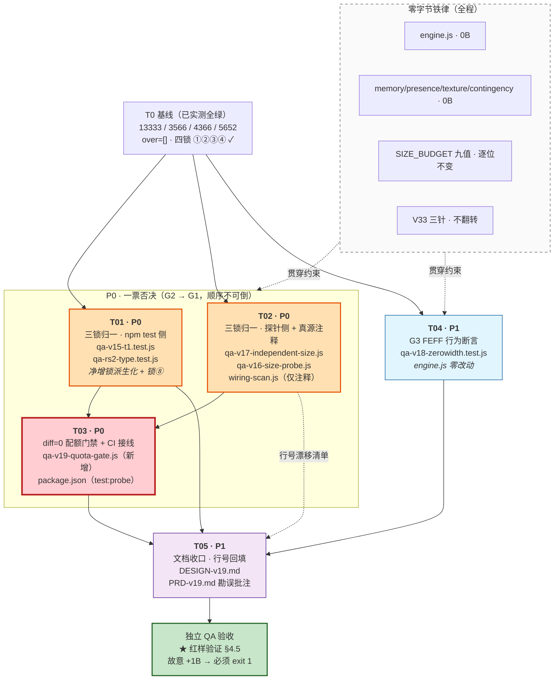

# DESIGN-v19 · 约束系统自我治理

> 架构师：高见远（Gao）　|　立项 PRD：`docs/PRD-v19.md`（主理人 Qi 已批准，全量采纳推荐案）
> 上游终态：`docs/DESIGN-v18.md`（体积四锁 v18 锁定值）
> 版本定位：**零预算版本** —— 不新增用户功能，不修改 `SIZE_BUDGET` 任何一项，
> 四模块与 `engine.js` **零字节改动**，全部落点在**测试文件 + 文档**。

---

## 0. 结论摘要（先读这一页）

| 项 | 结论 |
|---|---|
| **四锁 ①②③④** | **逐位不变**。`Σ(4 模块配额) ≡ 27943`，`slack ≡ 0` |
| **V33 三针** | **不翻转**（`248537` 三处一字不动） |
| **engine.js** | **零字节改动**（G3 走文档化，Q2 = C 案） |
| **四模块源码** | **零字节改动**（Q7 严格 0） |
| **新增依赖** | **无**（原生 Node ≥18，`node:test` / `node:assert` / `node:fs`） |
| **G1 门禁落点** | **新增独立探针** `test/qa-v19-quota-gate.js`，接入 `test:probe` 全量（不入 fast） |
| **G2 归一手法** | 净增锁由**字面量**改为**从 `SIZE_BUDGET` 派生**，使两锁**结构性不可背离** |
| **改动文件数** | 测试 6 个 + `package.json` + 文档 3 个 |

**一句话**：v19 不是"把 5671 改成 6582"，而是**取消第二个数字**——
让 contingency 的上限只剩 `SIZE_BUDGET["contingency.js"]` 一个可写位置，
其余全部由它派生。数字不同步的缺陷类别从此在结构上消失。

---

## 1. 起草期实测复核（不采信文档，全部实跑取证）

### 1.1 T0 基线实测

```
$ node -e "const W=require('./test/wiring-scan.js'); ..."
each   {"memory.js":13333,"presence.js":3566,"texture.js":4366,"contingency.js":5652}
over   []
engine 248395   engineNet 2658   moduleSum 26917   total 275312
```

与 PRD §0 T0 基线**逐位一致** ✓。四锁全绿，`over=[]`。

### 1.2 contingency 三锁背离实测

| 锁 | 值 | 出处 | 是否真在跑 |
|---|---|---|---|
| 配额锁 | **6582** | `wiring-scan.js` `SIZE_BUDGET` | ✓ |
| 残差锁 | **5671** | 4 个测试文件硬编码 | 3 个在跑 / 1 个休眠 |
| 净增锁 | **5698** = `4518 + 1180` | 2 个测试文件硬编码 | ✓ |

```
min(6582, 5671, 5698) = 5671   ← 有效天花板
实测 5652 ⇒ 真实余量 19B，而非注释宣称的 930B
```

**实跑验证推荐案效果**：

```
推荐案后 min(6582, 6582, 4518+2064=6582) = 6582 ✓
```

三锁完全重合于 6582，`wiring-scan.js` 注释"余 930B"**转真**（6582 − 5652 = 930）。

### 1.3 ★ PRD 三处事实性勘误（起草期发现，须在 v19 一并订正）

> 这三条不改变已批准的决策方向，但**改变工程落地细节与风险排序**，必须书面记录。

#### 勘误 ①：`qa-v16-size-probe.js` 不在任何 CI 中（PRD §3 表格误标）

PRD-v19:79 记「`test/qa-v16-size-probe.js:39` … 探针（`test:probe` 在跑）」。**实测为假**：

```jsonc
// package.json 实读
"test":       "node --test test/*.test.js",          // ← 只吃 *.test.js，本文件无此后缀
"test:probe": "... qa-probe-mutation.js qa-v17-adversarial.js
               qa-v17-independent-size.js qa-probe-h13.js
               qa-probe-v15-acceptance.js ...",       // ← 不含 qa-v16-size-probe.js
"test:probe:fast": "... qa-probe-h13.js qa-v17-adversarial.js ..."
```

全仓 grep 确认：`qa-v16-size-probe.js` **不被任何 npm script 引用**，是**孤儿探针**。
DESIGN-v18 §7 已明确将其归类为「历史版本闭合探针」并**刻意排除**出 `test:probe`。

**影响**：实际生效的 `≤5671` 只有 **3 处**（`qa-rs2-type` / `qa-v15-t1` 在 `npm test`；
`qa-v17-independent-size` 在 `test:probe`）。第 4 处是**休眠地雷**——
它今天不响，但任何人把它接进 CI 的那一刻就会炸。
**v19 仍须修它**（拆雷），但**不纳入 CI**（沿用 v18 裁定），详见 §4.4。

#### 勘误 ②：`:1310` 早已是**机器授权**的解冻点，Q5 不是"追认"而是"文档陈旧"

PRD §P2-2 / Q5 称冻结清单为 `:1307 / :1322 / :2897`，`:1310` 未获授权。**实测为假**：

```js
// test/qa-v13-t2t4-fix.test.js:158-175（v17 T1/T2 · 主理人 Qi 已批准）
const V17 = [1310, 1322, 1350, 1382, 1393, 1435, 1461, 2488, 2935, 3613, 3636, 3637, 3993];
const WHITELIST = [1307].concat(V17);      // ← :1310 在列，且是机器强制的
```

`:1307/:1322/:2897` 是 **v14 时代**的冻结清单（`DESIGN-v14.md:287`），
v15 已重置为 `[1307]`（`DESIGN-v15.md:388`），v17 扩容至 14 行。
**PRD 引用的是三代之前的陈旧文档**，不是当前生效清单。

**影响（风险下调）**：Q5 无需"追认未授权改动"（那会在审计轨迹上留下一笔不实记录）。
正确动作是**建立冻结清单单一真源**，让文档镜像机器清单。详见 §6.3。

#### 勘误 ③：P2-1 已在 v18 闭合

PRD §P2-1 称 `qa-v13-t1.test.js:95` 测试名仍写「≤248137B」。**实读为**：

```js
it("3. V-33：engine.js 字节数 ≤ 248537B（真实硬上限，打印剩余）", () => {
```

**已是 248537**，v18 已修。P2-1 降级为**无操作项**。
但另有真实陈旧措辞需订正（`qa-v17-independent-size.js:62` 的「R-S2 二期载体」等），
这些会被 G2 改写自然覆盖，见 §6.2。

---

## 2. 实现方案与框架选型

### 2.1 技术栈（无新增依赖）

| 层 | 选型 | 理由 |
|---|---|---|
| 运行时 | Node.js ≥ 18（`package.json engines` 既有） | 不引入新约束 |
| 断言 | `node:assert`（`.test.js`）/ 自写 `chk()`（探针） | 沿用仓内两套既有范式，不统一、不重构 |
| 测试驱动 | `node --test`（`npm test`）/ shell for 循环（`test:probe`） | 既有编排，零改动 |
| 体积取证 | `fs.statSync().size` | 与 `wiring-scan.scanSizes()` 同口径（Q4：字节数，不用哈希） |
| 新增依赖 | **无** | 见 §11 |

### 2.2 架构模式：单一真源 + 派生锁（Single Source + Derived Lock）

本期核心不是修数字，是**修数字的拓扑**。

```
【v18 及以前 · 平行字面量】            【v19 · 单一真源 + 派生】

  SIZE_BUDGET 6582  ─┐                  SIZE_BUDGET["contingency.js"]
  测试 A 字面量 5671 ─┼→ 三值各自独立            │ (唯一可写位置)
  测试 B 字面量 1180 ─┘   任一漏改即背离    ┌─────┴─────┐
                                          ▼           ▼
  ✗ 同类缺陷已复发 3 次                 残差锁      净增锁
    (v16 V33 / v17 P0-3 / v19 P0-2)    = B[c]    = B[c] − 4518
                                       ✓ 结构上不可能背离
```

**关键设计判断**：把净增锁写成 `2064` 只是**把背离推迟到下一次**。
必须写成 `B["contingency.js"] - V16_ANCHOR`，让它**没有独立的可写位置**。
这是本期唯一真正治本的动作，其余都是清扫。

### 2.3 三条防复发机制（分层纵深）

| 层 | 机制 | 防什么 |
|---|---|---|
| L1 结构层 | 净增锁派生化（§3.2） | 防"改了配额忘了净增锁" |
| L2 门禁层 | `diff=0` 配额门禁（§4） | 防"没重谈配额就改源码" |
| L3 扫描层 | 单一真源回归扫描（§4.3-D） | 防"未来有人又写回一个新字面量" |

L3 是本期的**元防御**：门禁自己扫描测试文件源码，
断言 4 个文件里**不再出现** `5671` / `1180` 的断言性字面量。
没有 L3，v20 的某个人完全可以再引入第 4 个数字。

---

## 3. G2 详细设计 · contingency 三锁归一【P0-2】

### 3.1 SIZE_BUDGET 的引用方式（共享约定，四处统一）

`wiring-scan.js:427-430` **已导出** `SIZE_BUDGET`，无需改导出：

```js
module.exports = {
  scan, stripComments, splitExports, collectDefs, callSites, isGuard, ALLOW, ENGINE_PATH,
  MANIFEST_PATH, SIZE_BUDGET, loadManifest, htmlScripts, swManifest, scanLoaders, scanSizes,
};
```

四个待改文件的现状与接线成本：

| 文件 | 现有 require | 接线动作 |
|---|---|---|
| `qa-v15-t1.test.js` | 已有 `WS`（用 `WS.scanSizes()` / `WS.SIZE_BUDGET`） | **零接线**，直接用 |
| `qa-v17-independent-size.js` | 已有 `W` + `const B = W.SIZE_BUDGET` | **零接线**，直接用 `B` |
| `qa-v16-size-probe.js` | 已有 `const { scanSizes, SIZE_BUDGET } = require("./wiring-scan.js")` + `const B = SIZE_BUDGET` | **零接线**，直接用 `B` |
| `qa-rs2-type.test.js` | ❌ 无 | **需新增一行** `const WS = require("./wiring-scan.js");` |

> 路径一律 `require("./wiring-scan.js")`（同在 `test/` 目录下，相对路径）。
> `wiring-scan.js` 是纯 CommonJS 模块，加载期只做一次 `engineMax` 自洽 `throw`，无副作用。

### 3.2 净增锁派生化（本期核心）

**锚点常量** `V16_ANCHOR = 4518` —— v15 R-C5 落位、v17 R-S2 起算点。
它是**历史事实**（不是配额），保持字面量合理；净增上限则必须派生：

```
NET_MAX := SIZE_BUDGET["contingency.js"] − V16_ANCHOR
         = 6582 − 4518
         = 2064            ← 推荐案值，但代码里不写这个数字
```

**恒等式（新增，记为锁 ⑧）**：

```
⑧  V16_ANCHOR + NET_MAX ≡ SIZE_BUDGET["contingency.js"]
   ⇒ 残差锁与净增锁恒重合，背离在数学上不可能
```

### 3.3 四文件逐处改法（工程师直接依据）

> ⚠ 以下只给**改法语义与断言意图**，具体代码由工程师书写。
> 行号为**起草期**实读值；**实现后的落地行号已统一回填于 §7.4 行号漂移对照表**，
> 本节表格保留起草期行号以便对照 diff。

#### ① `test/qa-v15-t1.test.js`（在 `npm test` 内）

| 位置 | 现状 | 改为 |
|---|---|---|
| `:396` 测试名 | `…R-S2 净增 ≤1180B 且 ≤5671B…` | 去掉两个字面量，改为「净增/总量双锁均从 `SIZE_BUDGET` 派生」 |
| `:403` | `assert.ok(cur - V16 <= 1180, …)` | 上限改为 `NET_MAX`（派生），失败信息打印 `NET_MAX` 实算值 |
| `:404` | `assert.ok(cur <= 5671, …)` | 上限改为 `B["contingency.js"]` |
| 新增 | — | 断言锁 ⑧：`V16 + NET_MAX === B["contingency.js"]` |
| `:387-393` 注释块 | v17 快照翻转说明 | **追加** v19 归一说明（不删历史，见 §3.4） |

`B` / `WS` 在该文件 `:409` 之后已取到；须把 `const B = WS.SIZE_BUDGET;`
**提到断言前**（当前在 `:411` 附近取），或直接用 `WS.SIZE_BUDGET`。

> ⚠ 该测试 `:402` 的 `V16 - base <= 470`（R-C5 增量锁）与 `:401` 的
> `strictEqual(base, 4086)` **不属本期范围，逐位不动**。

#### ② `test/qa-rs2-type.test.js`（在 `npm test` 内）

| 位置 | 现状 | 改为 |
|---|---|---|
| 文件头 `:14-18` | 无 wiring-scan | **新增** `const WS = require("./wiring-scan.js");` |
| `:11` 文件头注释 | `⑧ 体积闸：contingency.js ≤ 5671B（DESIGN-v17 §2.5 唯一解）` | `⑧ 体积闸：contingency.js ≤ SIZE_BUDGET 配额（v19 单一真源）` |
| `:297` 测试名 | `…≤ 5671B（DESIGN-v17 §2.5 唯一解，R-S2 净增 ≤1180B 硬顶）` | 去字面量，引 DESIGN-v19 §3 |
| `:299` | `assert.ok(b <= 5671, …)` | `b <= WS.SIZE_BUDGET["contingency.js"]` |
| `:300` | `assert.ok(b - 4518 <= 1180, …)` | 净增上限改派生 `NET_MAX` |

#### ③ `test/qa-v17-independent-size.js`（在 `test:probe` 内 · G2 主战场）

该探针的设计契约是「**刻意写死真值以规避循环论证**」（`:19-25` `TRUTH` 表）。
**必须尊重这一契约，不能把 E 段简单改成读 `B`**——否则它就退化成"读预算表自证预算表"。

**正确改法（双轨）**：

```
A 段（既有 TRUTH 对拍）：TRUTH["contingency.js"] = 6582 已正确，不动 ✓
E 段（:61-63）：删除「≤ 5671」这条与 A 段矛盾的独立断言，
                改为断言「实测 ≤ TRUTH["contingency.js"]」并打印真实缓冲
新增 E' 段：   断言 TRUTH["contingency.js"] === B["contingency.js"]
                （对拍已在 A 段覆盖，此处只需保留，避免重复）
```

即：**唯一真值仍写死在探针里（TRUTH），但全文件只准出现一次**。
`5671` 从此在该文件消失。

| 位置 | 现状 | 改为 |
|---|---|---|
| `:62` | `chk("contingency.js ≤ 5671（R-S2 二期载体）", s.each[...] <= 5671, …)` | `chk("contingency.js ≤ 配额（v19 单一真源）", s.each[...] <= TRUTH["contingency.js"], …)` |
| `:63` | `缓冲 ${5671 - …}B` | `缓冲 ${TRUTH["contingency.js"] - …}B`（应打印 **930**） |
| `:61` 段标题 | `--- E. R-S2 硬顶与缓冲 ---` | `--- E. contingency 天花板与真实缓冲（v19 三锁归一）---` |

> 注：`:49-51` 的通用循环 `s.each[f] <= B[f]` 已覆盖 contingency，
> E 段的价值在于**独立于 `B` 的第二证人**（TRUTH），故保留而非删除。

#### ④ `test/qa-v16-size-probe.js`（孤儿探针 · 拆雷）

| 位置 | 现状 | 改为 |
|---|---|---|
| `:39` | `ok(s.each["contingency.js"] <= 5671, "contingency.js ≤ 5671", …)` | 上限改 `B["contingency.js"]`，label 去字面量 |

**不纳入 `test:probe`**（沿用 DESIGN-v18 §7 裁定）。理由与 v20 交接见 §4.4。

> ⚠ `:38` `s.engine <= 248537`、`:47` `engineMax === 248537`、`:65` 四配额落位、
> `:74` V33 对拍 —— **全部逐位不动**（V33 三针之一，Q7/纪律要求）。

### 3.4 历史审批链注释的处理原则（重要）

`wiring-scan.js:270-292` 是 **v17 审批链历史块**，`:286` 写有
「R-S2 硬顶：contingency 交付 ≤5671 ⇒ 净增上限 5671−(4518−27)=1180B」。

**裁定：历史块逐字不动。**

三条理由：
1. **审计轨迹不可变** —— 它记录的是"v17 当时批准了什么"，是事实，改它等于篡改账本。
2. **有测试正则钉住该区域** —— `qa-v16-size-probe.js:84-87` 断言
   `/v16 T0 预算重谈轮/`、`/2200→2400/`、`/v17 T0 预算 gating 轮/`、`/2400→2800/`。
   虽不覆盖 `1180`，但该区域属"被断言区"，避免无谓触碰。
3. v18 已建立该范式（v18 新增独立块而非改写 v17 块）。

**改为：在 `SIZE_BUDGET` 声明正上方新增 v19 注释块**，内容要点：

```
★★【v19 · contingency 三锁归一 · 主理人 Qi 批准（PRD-v19 Q1 推荐案 / DESIGN-v19 §3）】★★
  本轮 SIZE_BUDGET 一个字节不改（零预算版本，四锁 ①②③④ 逐位不变，V33 三针不翻转）。
  改的是「谁有资格写这个数字」：
    · v17 遗留的 ≤5671（残差锁）与 ≤1180（净增锁）已从 4 个测试文件全部移除，
      改由 SIZE_BUDGET["contingency.js"] 派生：NET_MAX = 6582 − 4518 = 2064。
    · ∴ 上方 v17 历史块 :286 的「≤5671 / ≤1180」为**历史审批记录，v19 起不再生效**，
      保留仅作审计轨迹，禁止据此写新断言。
  ⑧ 新增恒等式：V16_ANCHOR(4518) + NET_MAX ≡ SIZE_BUDGET["contingency.js"]
  ⇒ 有效天花板 = min(配额 6582, 残差锁 6582, 净增锁 6582) = 6582，
    下方 "余 930B" 注释自此为**实数**（6582 − 5652 = 930），非宣称值。
```

### 3.5 P1-2 · contingency 行尾注释订正（**实现后行号：`:355`**）

`SIZE_BUDGET["contingency.js"]` 行尾注释末段
「实测 5652，余 930B 为 v19 语料备粮」→ 订正为可核对措辞，
落地文案为「实测 5652，**真实可用 930B**（v19 三锁归一后为实数，不再是宣称值；
此前被残差锁压到 19B，见上方 v19 块）」。

> ✅ **行号漂移已回填（T02 → T05）**：§3.4 的 v19 注释块占 `:325-:347`，
> 使 `const SIZE_BUDGET = {` 由 `:325` 下移至 **`:348`**、
> `"contingency.js": 6582` 由 `:332` 下移至 **`:355`**。
> 本文件全部 `:332` 引用已改为 `:355`。复核命令：
> `grep -n '"contingency.js": 6582' test/wiring-scan.js`

### 3.6 G2 验收判据

```
① grep -n '5671' test/*.js  →  仅剩 wiring-scan.js v17 历史块内 4 处（:275/:279/:281/:282/:286/:301）
                                4 个测试文件中 0 处
② grep -n '1180' test/*.js  →  仅剩 wiring-scan.js v17 历史块内 1 处（:286）
                                4 个测试文件中 0 处
③ node -e "…" 复算 min(6582, 6582, 4518+2064) === 6582
④ npm test 全绿 · npm run test:probe 全绿
⑤ 有效余量打印值 = 930（不再是 19）
```

---

## 4. G1 详细设计 · `diff=0` 配额门禁【P0-1】

### 4.1 ★ 落点决策：新增独立探针 `test/qa-v19-quota-gate.js`

**决策：新增独立探针，不扩展 `wiring-scan.js`。**

| 维度 | 扩展 `wiring-scan.js` | **新增独立探针（采纳）** |
|---|---|---|
| 循环论证 | ✗ 它是 `SIZE_BUDGET` 宿主，"真源自证真源" | ✓ 基线写死在探针内，与真源分离 |
| 可执行性 | ✗ 纯 module，裸跑**恒 exit 0 且无输出**（DESIGN-v16 已裁定"不可作证据"） | ✓ 脚本，有退出码、有输出 |
| 爆炸半径 | ✗ 被 12+ 测试 `require`；加载期 `throw` 会**连锁染红全套**，无法定向红一条 | ✓ 只红自己一条，定位精确 |
| QA 红样验证 | ✗ 需跑全套才能看到 | ✓ `node test/qa-v19-quota-gate.js` 单命令复现 |
| 契约延续 | — | ✓ 与 `qa-v17-independent-size.js`「写死真值规避循环论证」同范式 |

> **最关键的一条是爆炸半径**：`wiring-scan.js` 加载期已有一个 `throw`（`engineMax` 自洽）。
> 若把"模块字节 ≠ 基线"也做成加载期 `throw`，那么任何人合法改一个模块字节后，
> **`npm test` 会整体崩溃**（12+ 文件全部 require 失败），而不是"门禁红一条"。
> 那不是门禁，那是自毁开关。门禁必须**精确地只红自己**，才能引导人走重谈流程
> 而不是急着找绕过手段。

`wiring-scan.js` 在本期**只加注释块**（§3.4），逻辑与导出**零改动**。

### 4.2 CI 接入（Q3：只入全量，不入 fast）

```jsonc
// package.json —— 唯一改动：test:probe 追加末位一项
"test:probe": "for f in test/qa-probe-mutation.js test/qa-v17-adversarial.js \
                        test/qa-v17-independent-size.js test/qa-probe-h13.js \
                        test/qa-probe-v15-acceptance.js \
                        test/qa-v19-quota-gate.js; \
               do echo \"── $f\"; node \"$f\" || exit 1; done",

// test:probe:fast —— 逐字不动（Q3 裁定）
// test / test:all  —— 逐字不动
```

**为何不入 fast**（Q3 已批准，此处补充架构理由）：
`test:probe:fast` 是 pre-commit 子集。配额门禁在**正常开发中途必然频繁转红**
（工程师改模块 → 门禁红 → 但他正要去重谈配额）。
把它放进 pre-commit，等于**训练团队养成 `--no-verify` 的肌肉记忆**——
一旦这个习惯建立，H13 那种真正致命的 pre-commit 闸也会被一起绕过。
门禁应当**卡在 PR/CI 这一层**（无法用本地 flag 绕过），而非阻断本地提交节奏。

> 追加位置放**末位**：门禁是本期新增、最可能因基线未同步而红的一项，
> 放末位可让前 5 个既有探针先出结论，便于区分"是 v19 门禁红"还是"老探针红"。

### 4.3 探针内部结构（五段）

```
=== QA v19 配额门禁（diff=0）===

A. 基线常量（写死，规避循环论证）
   const T0_BYTES = { "memory.js":13333, "presence.js":3566,
                      "texture.js":4366, "contingency.js":5652 };
   ※ 口径：fs.statSync().size（Q4：字节数，不用哈希 —— 等长重构不误红）

B. diff=0 硬闸【核心】
   逐模块 assert  statSync(f).size === T0_BYTES[f]
   任一不等 → 打印「实测 X / 基线 Y / Δ±N」+ 重谈流程指引 → exit 1

C. 四锁不破坏自证（门禁不得成为新的破锁源）
   ① engineMax === engineBase + engineNetMax
   ② Σ(4 配额) === moduleSumMax === 27943
   ③ engineBase + engineNetMax + moduleSumMax === totalMax（slack === 0）
   ④ 逐模块 B[f] > T0_BYTES[f]
   ⑧ V16_ANCHOR + NET_MAX === B["contingency.js"]      ← v19 新增

D. 单一真源回归扫描【元防御 · L3】
   读 4 个测试文件源码，断言不再出现 5671 / 1180 的**断言性字面量**
   （允许出现在 v19 说明性注释中；扫描应剔除注释行或采用断言上下文正则）
   → 防止 v20 有人再引入第 4 个平行数字

E. 真实缓冲打印（P1-2 要求：注释宣称 vs CI 实测并排可核对）
   memory.js      13333 / 配额 13365   余   32
   presence.js     3566 / 配额  3598   余   32
   texture.js      4366 / 配额  4398   余   32
   contingency.js  5652 / 配额  6582   余  930   ← 与 :332 注释并排核对
```

**退出码**：任一段失败 → `process.exit(1)`；全绿 → `0`。

### 4.4 基线更新协议（写给 v20+，必须遵守）

`T0_BYTES` 是**受控常量**，与配额同级。修改它须满足：

```
改 T0_BYTES  ⟺  同一个 PR 内完成配额重谈三件套：
   ① SIZE_BUDGET 对应项（若配额需变）
   ② T0_BYTES 对应项
   ③ DESIGN-vNN 记录重谈依据 + 主理人批准
任一缺失 = 违规。禁止「先改基线让 CI 变绿，再补流程」。
```

> 门禁的价值 100% 取决于**改基线比重谈配额更麻烦**。
> 一旦有人可以随手改基线让红转绿，这个门禁就等于不存在。
> 建议 v20 考虑：把 `T0_BYTES` 的 `git blame` 纳入 PR 检查清单。

### 4.5 ★ QA 红样验证预留（纪律要求：门禁本身必须可被证伪）

设计**必须**支持 QA 用"故意改 1 字节"验证门禁真的会红：

```bash
# 红样制备（QA 执行，验毕务必还原）
cp texture.js /tmp/texture.js.bak
printf ' ' >> texture.js                    # +1B，纯空格，不改语义
node test/qa-v19-quota-gate.js              # 期望：exit 1
#   B 段应输出： ✗ texture.js  实测 4367 / 基线 4366 / Δ+1
#   并给出重谈流程指引
cp /tmp/texture.js.bak texture.js           # 还原
node test/qa-v19-quota-gate.js              # 期望：exit 0，全绿
git diff --stat texture.js                  # 期望：空（还原干净）
```

**验收判据**：
- 红样下 `exit 1` 且**明确指出是哪个模块、Δ 多少**（不是笼统"体积超标"）
- 还原后 `exit 0`
- 红样**不得**污染其它测试的结论（门禁独立性验证）
- `+1B` 的 texture 仍 `< 配额 4398`，**四锁不破** ⇒ 证明门禁抓的是
  「**未经重谈的 diff**」，而非「超配额」——这是与既有体积锁的本质区别

> 这一点是 G1 的立身之本：既有四锁只在**撞到天花板**时才响（texture 还有 32B 余量），
> 门禁则在**第 1 个字节**就响。两者互补，不重叠。

---

## 5. G3 详细设计 · U+FEFF 冗余黑名单书面裁决【P1-1 · 0B】

### 5.1 裁定：**保留 `\uFEFF`，engine.js 零字节改动，仅文档化**（Q2 = C 案）

### 5.2 事实认定（起草期实读 `engine.js:1310`）

```js
const pnorm = s => String(s)
  .normalize("NFKC")                          // seg1
  .replace(/[\u200B\u200C\u200D\uFEFF]/g,"")  // seg2 · v18 新增 +42B
  .replace(/\s+/g,"")                         // seg3
  .replace(/程序[员猿媛]/g,"职");              // seg4
```

| 码点 | `/\s/` 是否匹配 | seg2 是否承重 |
|---|---|---|
| `U+200B` ZWSP | ✗ 否 | **✓ 承重** |
| `U+200C` ZWNJ | ✗ 否 | **✓ 承重** |
| `U+200D` ZWJ | ✗ 否 | **✓ 承重** |
| `U+FEFF` ZWNBSP | **✓ 是**（ECMA-262 WhiteSpace 含 `<ZWNBSP>`） | ✗ **冗余** |

四字符黑名单中**仅 3 个承重**，`\uFEFF` 100% 冗余：
seg3 的 `\s+` 已完全覆盖它，删之不改变任何拦截行为（PRD 实证：7 组变体输出差异数 = 0）。

### 5.3 为何仍**保留**（三条理由，按权重排序）

1. **`\s` 对 U+FEFF 的覆盖是一个历史特例，不是稳定契约。**
   `<ZWNBSP>` 被列入 WhiteSpace 是 ES 早期为兼容 BOM 的遗留决定，
   TC39 曾多次讨论其合理性。把一条**反破墙安全闸**的正确性，
   押在"某个引擎/未来版本不会收窄 `\s`"上，是不可接受的风险敞口。
   seg2 显式列出 = **纵深防御**，与 seg3 构成双保险。

2. **删除的收益为负。**
   收益 = `−6B`（engineNet 2658 → 2652）。
   成本 = 触碰 `engine.js:1310` ⇒ 触发 A1-c 白名单校验、`pnorm` 单一真源 S-1b 复验、
   零宽回归全套（`qa-v18-zerowidth.test.js` 七段 A–G）、H13 0% 一票否决复跑。
   **为 6B 承担 H13 风险，是明确的负期望值。**

3. **可读性即防御。**
   四字符枚举 `[\u200B\u200C\u200D\uFEFF]` 让"零宽字符黑名单"这一**意图**自解释。
   删掉 FEFF 后，下一个读代码的人会疑惑"BOM 为什么不在这里"，
   进而可能**误加回去**（+6B 无预算）或**误删其余三个**（真实安全回归）。

### 5.4 为何走 C 案而非 B 案（行内注释）

`engineNet` 实测 2658 / 上限 2800，**余 142B**，且 `engineMax` 与 V33 两锁重合、
设计性间隙为 **0**。一条中文行内注释约 40–60B，将吃掉 **28%–42%** 的 engine 侧全部余量。

> **一条注释的价值 < 42% 的 engine 机动空间。**
> 文档承载"为什么"，代码承载"是什么"——这是正确的分工，不是妥协。

### 5.5 落地动作（0 字节触碰 engine.js）

| 动作 | 落点 | 字节 |
|---|---|---|
| 书面裁决全文 | 本节 §5.2–§5.4 | 0（文档） |
| 不回归断言 | `test/qa-v18-zerowidth.test.js` 追加一条：**FEFF 变体恒被拦截**，且**显式记录该断言在 seg2 删除后仍会通过**（因 seg3 兜底）—— 断言的是**行为**不是实现 | 0（测试不占产物预算） |
| `engine.js` | **一字不动** | **0** |

> ⚠ 追加断言时**禁止**写成"seg2 必须包含 \uFEFF"这类**实现断言**——
> 那会把冗余项**焊死**，反而剥夺 v20+ 重新裁决的自由。
> 正确写法：断言"含 FEFF 的破墙变体被拦截"（行为契约），实现自由保留。

---

## 6. P1-2 / P2-1 / P2-2 落地

### 6.1 P1-2 配额注释一致性

| 动作 | 落点 |
|---|---|
| `:355` 注释订正为可核对措辞 | `test/wiring-scan.js`（§3.5） |
| CI 侧并排打印真实缓冲 | `qa-v19-quota-gate.js` E 段（§4.3） |
| 新增 v19 审批链注释块 | `test/wiring-scan.js:325-:347`（§3.4） |

**一致性判据**：`:355` 注释宣称的「真实可用 930B」必须 === 门禁 E 段打印的 contingency 余量。
两者不等即 P1-2 未达标。
**T4 实测**：注释宣称 930 === 门禁 E 段 `contingency.js 5652 / 配额 6582 余 930` ✅

### 6.2 P2-1 测试名订正（范围修正，见勘误 ③）

| 文件 | 陈旧措辞 | 处置 |
|---|---|---|
| `qa-v13-t1.test.js:95` | PRD 称仍写 248137 | **已在 v18 修复，无操作** |
| `qa-v13-t1.test.js:93` 注释 | 「上限翻转 → 248137」 | 历史变更史，**保留**（审计轨迹） |
| `qa-v17-independent-size.js:62` | 「R-S2 二期载体」 | G2 改写时一并订正（§3.3-③） |
| `qa-rs2-type.test.js:11 / :297` | 「≤5671B / DESIGN-v17 §2.5 唯一解」 | G2 改写时一并订正（§3.3-②） |
| `qa-v15-t1.test.js:396` | 「≤1180B 且 ≤5671B」 | G2 改写时一并订正（§3.3-①） |

⇒ **P2-1 无独立工作量**，完全被 G2 吸收。

### 6.3 P2-2 / Q5 · `engine.js` 解冻清单单一真源（见勘误 ②）

**裁定：`:1310` 自 v17 起即为已授权解冻点，v19 不做"追认"，改做"文档对齐"。**

**当前机器生效清单**（`test/qa-v13-t2t4-fix.test.js:171-184`，A1-c 测试）：

```
基线 BASE = b86a386（v14 收口，test/baseline.js:29 单一真源）
WHITELIST = [1307]                                    ← v15 批准
          ∪ [1310, 1322, 1350, 1382, 1393, 1435,      ← v17 §6-T1 批准 13 行
             1461, 2488, 2935, 3613, 3636, 3637, 3993]
判据：改动行集合 ⊆ WHITELIST，且 cur.length === base.length（禁增删行）
```

| 行 | 用途 | 授权版本 |
|---|---|---|
| `:1307` | `PERSONA_BREAK_RE` 唯一真源 S-1 | v15 |
| **`:1310`** | **`pnorm` 唯一真源 S-1b（v17 +105B / v18 +42B）** | **v17** ✓ |
| `:1322` | `guardPersonaReplies` 出口闸收口 | v17 |
| `:1350` | `JEALOUS_DISMISS_RE` R2-A5b | v17 |
| `:1382/:1393/:1435/:1461/:2488/:2935` | 归一化接线 ×6 | v17 |
| `:3613/:3636/:3637` | selfTick 防重放 | v17 |
| `:3993` | `pnorm` 导出 | v17 |
| ~~`:2897`~~ | R-P2 透传 —— **v14 收口已合入基线，非解冻点** | 已闭合 |

**v19 动作**：
1. 在本节建立**冻结清单文档单一真源**（上表），今后所有文档引用**只指向本节**，
   不再各自复述数字。
2. 书面废止 `:1307/:1322/:2897` 这一 **v14 时代表述**——
   它在 `DESIGN-v14.md:287/1041` 中作为历史记录保留，但**不得再被引用为当前清单**。
3. `engine.js` **零改动**，A1-c 测试**零改动**（清单已正确，无需扩容）。

> **根因归档**：Q5 的疑问本身，正是"同一事实在多份文档各自复述、无单一真源"
> 这一缺陷类别在**文档层**的又一次发作——与 G2 在**代码层**的表现完全同构。
> §6.3 表就是文档层的 `SIZE_BUDGET`。

---

## 7. 文件列表（相对 `ai-girlfriend/`）

### 7.1 新增（1）

| 文件 | 说明 | 体积预算 |
|---|---|---|
| `test/qa-v19-quota-gate.js` | G1 `diff=0` 配额门禁探针（§4.3 五段） | 不占（测试文件） |
| `docs/DESIGN-v19.md` | 本文件 | 不占（文档） |
| `docs/class-diagram-v19.mermaid` | §8 类图抽出（已生成） | 不占（文档） |
| `docs/sequence-diagram-v19.mermaid` | §9.1–9.3 三张时序图抽出（已生成） | 不占（文档） |
| `docs/task-dependency-v19.mermaid` | §14 任务依赖图抽出（已生成） | 不占（文档） |

> 采用 **`-v19` 版本化命名**，不覆盖 `docs/class-diagram.mermaid` /
> `docs/sequence-diagram.mermaid`（v17/v18 时代产物）——与 `DESIGN-vNN` 命名约定一致，
> 且避免破坏历史版本可追溯性。经 grep 确认两个旧文件无任何引用方。

### 7.2 修改（9）

| # | 文件 | 改动摘要 | 归属 | 占预算 |
|---|---|---|---|---|
| 1 | `test/qa-v15-t1.test.js` | `:396` 名 / `:403` 净增锁派生 / `:404` 残差锁读 `B` / 加锁 ⑧ / 注释追加 | G2 | 否 |
| 2 | `test/qa-rs2-type.test.js` | 新增 `require("./wiring-scan.js")` / `:11` `:297` 名 / `:299` `:300` 读 `B` | G2 | 否 |
| 3 | `test/qa-v17-independent-size.js` | `:61-63` E 段改走 `TRUTH`，`5671` 清零 | G2 | 否 |
| 4 | `test/qa-v16-size-probe.js` | `:39` 读 `B`（拆雷，**不入 CI**） | G2 | 否 |
| 5 | `test/wiring-scan.js` | `SIZE_BUDGET` 上方加 v19 注释块（`:325-:347`）+ `:355` 行尾注释订正。**逻辑/导出/预算值零改动** | G2·P1-2 | 否 |
| 6 | `package.json` | `test:probe` 末位追加门禁。**`test` / `test:probe:fast` / `test:all` 不动** | G1 | 否 |
| 7 | `test/qa-v18-zerowidth.test.js` | 追加「FEFF 变体恒被拦截」**行为**断言 | G3 | 否 |
| 8 | `docs/DESIGN-v19.md` | 本文件（定稿 + 行号回填） | 全部 | 否 |
| 9 | `docs/PRD-v19.md` | 追加勘误批注区（§1.3 三条） | 勘误 | 否 |

### 7.3 ★ 明确不改（零字节铁律 · 工程师必读）

| 文件 | 理由 |
|---|---|
| `engine.js` | Q2=C 案 + Q7；`:1307` H13 一票否决；`:1310` 不动（G3 走文档） |
| `memory.js` / `presence.js` / `texture.js` / `contingency.js` | **Q7 严格 0** |
| `wiring-scan.js` 的 `SIZE_BUDGET` 九个数值 | 零预算版本，四锁逐位不变 |
| `wiring-scan.js:270-292` v17 历史审批块 | 审计轨迹不可变（§3.4） |
| `qa-v13-t2t4-fix.test.js:117` `const V33 = 248537` | V33 三针①，不翻转 |
| `qa-v16-size-probe.js:38/:50/:68/:77`（v19 实现后行号，原 `:38/:47/:65/:74`，因 `:39` 上方新增 2 行拆雷注释而 +3） | V33 三针②及配额落位断言，**断言本体逐字未动** |
| `wiring-scan.js` V33 硬编码点 | V33 三针③ |
| `test/baseline.js` | `BASE = b86a386` 不重置 |
| `qa-v13-t2t4-fix.test.js` A1-c `WHITELIST` | 清单已含 `:1310`，无需扩容（§6.3） |
| `index.html` / `sw.js` / `engine.files.json` | 无装载变化 |

### 7.4 ★ 行号漂移对照表（T02 产出 → T05 回填 · 实现后实读）

| 文件 | 锚点 | 起草期 | **实现后** | 漂移原因 |
|---|---|---|---|---|
| `test/wiring-scan.js` | v19 注释块 | — | **`:325-:347`** | 新增（§3.4） |
| `test/wiring-scan.js` | `const SIZE_BUDGET = {` | `:325` | **`:348`** | v19 块 +23 行 |
| `test/wiring-scan.js` | `engineMax: 248537`（V33 三针③） | `:328` | **`:351`** | 同上，**值未动** |
| `test/wiring-scan.js` | `"contingency.js": 6582` | `:332` | **`:355`** | 同上，**值未动** |
| `test/wiring-scan.js` | v17 历史审批块 | `:270-292` | **不变** | 逐字未动 ✓ |
| `test/qa-v15-t1.test.js` | AC-C5-6 测试名 | `:396` | **`:407`** | 注释块追加 v19 段 +11 行 |
| `test/qa-v15-t1.test.js` | 派生锁三连（CEILING/NET_MAX/⑧） | `:403-404` | **`:416-425`** | 同上 |
| `test/qa-rs2-type.test.js` | `require("./wiring-scan.js")` | — | **`:20`** | 新增一行 |
| `test/qa-rs2-type.test.js` | 文件头 ⑧ 体积闸注释 | `:11` | **`:11-12`** | 折行为 2 行 |
| `test/qa-rs2-type.test.js` | AC-RS2-8 测试名 | `:297` | **`:299`** | 上方 +2 行 |
| `test/qa-v17-independent-size.js` | E 段标题 | `:61` | **`:66`**（说明注释 `:61-65`） | 新增段前注释 |
| `test/qa-v17-independent-size.js` | contingency 天花板断言 | `:62-63` | **`:70-76`** | E 段扩为 3 条 chk |
| `test/qa-v16-size-probe.js` | contingency 断言 | `:39` | **`:41-42`** | 上方 +2 行拆雷注释 |
| `test/qa-v16-size-probe.js` | V33 对拍（三针②） | `:74` | **`:77`** | 同上 +3，**断言逐字未动** |
| `test/qa-v18-zerowidth.test.js` | G3 新增 `AC-ZW-H` | — | **`:285`** | 新增 H 段 |
| `test/qa-v19-quota-gate.js` | 全文件 | — | **新增 167 行** | G1 门禁 |

> 复核命令：`grep -n '"contingency.js": 6582' test/wiring-scan.js` → `355`。

---

### 7.5 git 靶向 add 清单（禁用 `git add -A`）

```bash
git add ai-girlfriend/test/qa-v19-quota-gate.js \
        ai-girlfriend/test/qa-v15-t1.test.js \
        ai-girlfriend/test/qa-rs2-type.test.js \
        ai-girlfriend/test/qa-v17-independent-size.js \
        ai-girlfriend/test/qa-v16-size-probe.js \
        ai-girlfriend/test/qa-v18-zerowidth.test.js \
        ai-girlfriend/test/wiring-scan.js \
        ai-girlfriend/package.json \
        ai-girlfriend/docs/DESIGN-v19.md \
        ai-girlfriend/docs/PRD-v19.md \
        ai-girlfriend/docs/class-diagram-v19.mermaid \
        ai-girlfriend/docs/sequence-diagram-v19.mermaid \
        ai-girlfriend/docs/task-dependency-v19.mermaid
# 排除：charts/ 、微信_*.md dump、docs/_archive/
```

---

## 8. 数据结构与接口（类图）

```mermaid
classDiagram
    class SIZE_BUDGET {
        <<Single Source of Truth · wiring-scan.js>>
        +int engineBase = 245737
        +int engineNetMax = 2800
        +int engineMax = 248537
        +int memory_js = 13365
        +int presence_js = 3598
        +int texture_js = 4398
        +int contingency_js = 6582
        +int moduleSumMax = 27943
        +int totalMax = 276480
        ~v19 零改动 · 唯一可写的上限位置~
    }

    class WiringScan {
        <<module · test/wiring-scan.js>>
        +SIZE_BUDGET
        +scanSizes() SizeReport
        +scanLoaders() LoaderReport
        +scan() ScanReport
        ~v19 仅加注释块，逻辑/导出零改动~
    }

    class SizeReport {
        +int engine
        +int engineNet
        +int moduleSum
        +int total
        +Map~string,int~ each
        +string[] over
    }

    class QuotaGateV19 {
        <<NEW probe · test/qa-v19-quota-gate.js>>
        +Map~string,int~ T0_BYTES
        +int V16_ANCHOR = 4518
        +int NET_MAX
        -chk(name, cond, detail)
        +sectionB_diffZero() void
        +sectionC_fourLocks() void
        +sectionD_singleSourceScan() void
        +sectionE_printBuffer() void
        +exitCode int
    }

    class DerivedLocks {
        <<v19 派生锁 · 无独立可写位置>>
        +NET_MAX = contingency_js - V16_ANCHOR
        +CEILING = contingency_js
        +identity8() bool
    }

    class QaV15T1 {
        <<npm test · qa-v15-t1.test.js>>
        +AC_C5_6_volume()
    }
    class QaRs2Type {
        <<npm test · qa-rs2-type.test.js>>
        +AC_RS2_8_volume()
    }
    class QaV17IndepSize {
        <<test:probe · qa-v17-independent-size.js>>
        +TRUTH
        +sectionE_ceiling()
    }
    class QaV16SizeProbe {
        <<orphan · 不入 CI>>
        +contingencyCheck()
    }
    class QaV18ZeroWidth {
        <<npm test · G3 行为断言>>
        +AC_ZW_FEFF_behaviour()
    }

    class PackageJson {
        <<package.json>>
        +test
        +test_probe
        +test_probe_fast
        +test_all
    }

    WiringScan *-- SIZE_BUDGET : owns
    WiringScan ..> SizeReport : produces
    SIZE_BUDGET <.. DerivedLocks : derives from
    QuotaGateV19 --> WiringScan : require
    QuotaGateV19 ..> DerivedLocks : asserts identity 8
    QuotaGateV19 ..> QaV15T1 : D段 源码扫描
    QuotaGateV19 ..> QaRs2Type : D段 源码扫描
    QuotaGateV19 ..> QaV17IndepSize : D段 源码扫描
    QuotaGateV19 ..> QaV16SizeProbe : D段 源码扫描
    QaV15T1 --> SIZE_BUDGET : reads ceiling
    QaRs2Type --> SIZE_BUDGET : reads ceiling (NEW require)
    QaV17IndepSize --> SIZE_BUDGET : cross-check TRUTH
    QaV16SizeProbe --> SIZE_BUDGET : reads ceiling
    PackageJson --> QuotaGateV19 : test:probe (全量)
    PackageJson --> QaV17IndepSize : test:probe
    PackageJson ..> QaV16SizeProbe : 未接线 (孤儿)
    QaV18ZeroWidth ..> DerivedLocks : 无关 (G3 行为断言)
```

**关系要点**：
- `SIZE_BUDGET` 是**唯一有内向写权限**的节点；`DerivedLocks` 只出不进。
- 四个测试文件与 `SIZE_BUDGET` 之间**只有读边，没有平行字面量边**（v19 前有 3 条平行边）。
- `QuotaGateV19` 对四个测试文件的 `..>` 是**源码文本扫描**（L3 元防御），非运行时依赖。

---

## 9. 程序调用流程（时序图）

### 9.1 `test:probe` 全量 CI 执行 G1/G2 主链路



### 9.2 配额重谈闸门流程（G1 治理语义）



### 9.3 QA 红样验证（门禁可证伪性）



---

## 10. 任务列表（工程师直接依据 · 按实现顺序）

> **排序原则**：G2 先于 G1。因为 G1 门禁的 D 段（单一真源回归扫描）会**扫描 G2 的成果**，
> 若先做 G1，交付即处于"预期红"的中间态——而 v14 的教训表明，
> **中间态红灯会稀释红灯的信号价值**。本期规模小，完全可以避免。

| ID | 任务名 | 源文件 | 依赖 | 优先级 |
|---|---|---|---|---|
| **T01** | contingency 三锁归一 · `npm test` 侧 | `test/qa-v15-t1.test.js`<br/>`test/qa-rs2-type.test.js` | — | **P0** |
| **T02** | contingency 三锁归一 · 探针侧 + 真源注释 | `test/qa-v17-independent-size.js`<br/>`test/qa-v16-size-probe.js`<br/>`test/wiring-scan.js` | — | **P0** |
| **T03** | `diff=0` 配额门禁探针 + CI 接线 | `test/qa-v19-quota-gate.js`（新增）<br/>`package.json` | T01, T02 | **P0** |
| **T04** | G3 FEFF 行为断言 + 陈旧措辞清扫 | `test/qa-v18-zerowidth.test.js`<br/>（T01/T02 内测试名已顺带） | — | **P1** |
| **T05** | 文档收口 · 行号回填 · 勘误批注 | `docs/DESIGN-v19.md`<br/>`docs/PRD-v19.md` | T01–T04 | **P1** |

**T01 与 T02 可并行**（不同文件、无交叉）。**T04 与 T01/T02/T03 完全独立**，可任意插入。

### T01 · contingency 三锁归一 · `npm test` 侧【P0 · 无依赖】

- **文件**：`test/qa-v15-t1.test.js`、`test/qa-rs2-type.test.js`
- **动作**：按 §3.3-① 与 §3.3-② 逐处改；`qa-rs2-type.test.js` 需**新增** `require("./wiring-scan.js")`
- **核心**：净增锁必须**派生**（`B["contingency.js"] - 4518`），**禁止**写字面量 `2064`
- **新增**：锁 ⑧ 恒等式断言（至少 `qa-v15-t1.test.js` 一处）
- **禁止**：动 `V16 - base <= 470`、`strictEqual(base, 4086)`、四配额 `strictEqual` 组
- **验收**：`npm test` 全绿；两文件 `grep -c '5671\|1180'` → **0**

### T02 · contingency 三锁归一 · 探针侧 + 真源注释【P0 · 无依赖】

- **文件**：`test/qa-v17-independent-size.js`、`test/qa-v16-size-probe.js`、`test/wiring-scan.js`
- **动作 a**：§3.3-③ —— E 段改走 `TRUTH["contingency.js"]`，**保留 TRUTH 写死契约**
- **动作 b**：§3.3-④ —— 孤儿探针 `:39` 拆雷（**不改 package.json**）
- **动作 c**：§3.4 —— `SIZE_BUDGET` 上方新增 v19 注释块；§3.5 —— `:332` 行尾注释订正
- **禁止**：改 `SIZE_BUDGET` 任何数值；改 v17 历史块 `:270-292`；改 V33 相关断言
- **完成后必做**：`grep -n '"contingency.js": 6582' test/wiring-scan.js` 取新行号，
  产出行号漂移清单交 T05 回填
- **验收**：`node test/qa-v17-independent-size.js` → exit 0，E 段打印缓冲 **930**；
  `node test/qa-v16-size-probe.js` → exit 0；`npm test` 不受影响

### T03 · `diff=0` 配额门禁探针 + CI 接线【P0 · 依赖 T01, T02】

- **文件**：`test/qa-v19-quota-gate.js`（**新增**）、`package.json`
- **动作**：按 §4.3 五段实现；按 §4.2 在 `test:probe` **末位**追加
- **口径**：`fs.statSync().size`（Q4 字节数，**不用哈希**）
- **基线**：`T0_BYTES = {memory 13333, presence 3566, texture 4366, contingency 5652}`，
  **写死在探针内**（规避循环论证），并在文件头注明 §4.4 基线更新协议
- **D 段实现提示**：扫描时须**排除注释行**，否则 §3.4 新增的 v19 说明块（含 "5671"/"1180" 字样）
  会造成自我误红。建议只对含 `assert`/`<=`/`ok(` 的行做字面量匹配
- **禁止**：改 `test`、`test:probe:fast`、`test:all` 三个 script（Q3）；
  在 `wiring-scan.js` 内加任何断言/`throw`
- **验收**：`npm run test:probe` 全绿（6 个探针）；
  §4.5 红样验证 exit 1 且定位精确到模块 + Δ；还原后 exit 0

### T04 · G3 FEFF 行为断言 + 陈旧措辞清扫【P1 · 无依赖】

- **文件**：`test/qa-v18-zerowidth.test.js`
- **动作**：追加一条「含 U+FEFF 的破墙变体恒被拦截」断言
- **★ 铁律**：断言**行为**不断言**实现**。禁止写「seg2 正则必须包含 `\uFEFF`」——
  那会焊死冗余项，剥夺 v20+ 重新裁决的自由（§5.5）
- **禁止**：触碰 `engine.js`（**一个字节都不行**）；触碰 `:1307` PERSONA_BREAK_RE
- **验收**：`npm test` 全绿；`git diff --stat engine.js` → **空**；
  H13 相关探针（`qa-probe-h13.js`）0% 误杀不变

### T05 · 文档收口 · 行号回填 · 勘误批注【P1 · 依赖 T01–T04】

- **文件**：`docs/DESIGN-v19.md`、`docs/PRD-v19.md`
- **动作 a**：用 T02 产出的行号漂移清单，回填本文件 §3.5 / §7 中 `wiring-scan.js:332` 等引用
- **动作 b**：`docs/PRD-v19.md` 追加勘误批注区，收录 §1.3 三条（不改 PRD 正文，只追加批注）
- **动作 c**：本文件 §12 记录交付实测快照（四模块字节 + 四锁 + 门禁输出）
- **验收**：全文无失效行号引用；三条勘误在 PRD 侧可见

---

## 11. 依赖包列表

```
（无新增第三方依赖）
```

| 项 | 说明 |
|---|---|
| 运行时 | Node.js ≥ 18 —— `package.json engines` **既有**，不改 |
| `node:test` / `node:assert` / `node:fs` / `node:path` | Node 内建，仓内既有用法 |
| `package.json dependencies` | **保持为空**（本项目无 runtime 依赖） |
| 前端 | 原生 JS 单页 PWA，**无构建链、无框架**，v19 不引入 |

> 本期新增文件仅 1 个测试探针，只用 Node 内建模块 + `require("./wiring-scan.js")`。
> **`package.json` 的唯一改动是 `test:probe` 这一行 script。**

---

## 12. 共享知识（跨文件约定 · 工程师必读）

### 12.1 `SIZE_BUDGET` 的引用方式（唯一合法姿势）

```js
// ✅ 正确 —— 四个测试文件 + 新门禁统一如此
const WS = require("./wiring-scan.js");     // 同目录相对路径，必带 .js
const B  = WS.SIZE_BUDGET;
const CEILING = B["contingency.js"];        // 天花板：只读，不复制成字面量

// ❌ 禁止 —— 本期消灭的正是这种写法
assert.ok(size <= 5671);                    // 平行字面量
const NET_MAX = 2064;                       // 派生量写成字面量 = 把背离推迟到下一次
```

### 12.2 常量定义位置（单一真源索引）

| 常量 | 唯一定义位置 | 谁可以写 |
|---|---|---|
| 九项配额/上限 | `test/wiring-scan.js` `SIZE_BUDGET` | 仅主理人批准的配额重谈 |
| `T0_BYTES` 四模块基线 | `test/qa-v19-quota-gate.js`（**新增**） | 仅与配额重谈同 PR（§4.4） |
| `V16_ANCHOR = 4518` | 各测试文件本地（历史事实，非配额） | 冻结，不再变 |
| `NET_MAX` | **无独立定义** —— 一律现算 `B["contingency.js"] - V16_ANCHOR` | 无（派生量） |
| `V33 = 248537` | 三针：`wiring-scan.js`（`engineMax`，实现后 `:351`）/ `qa-v13-t2t4-fix.test.js:117` / `qa-v16-size-probe.js:77`（原 `:74`，仅行号漂移） | v19 **不动** |
| git 差分基线 `BASE` | `test/baseline.js:29`（`b86a386`） | v19 **不动** |
| `engine.js` 解冻白名单 | `qa-v13-t2t4-fix.test.js:171-184`；文档镜像见本文件 §6.3 | v19 **不动** |
| `TRUTH` 四模块真值 | `qa-v17-independent-size.js:21-25` | 随 DESIGN 同步（本期值已正确） |

### 12.3 体积口径统一

```
统一口径：fs.statSync(path).size          （字节数，Q4 裁定）
交叉验证：Buffer.byteLength(readFileSync)  （qa-v17-independent-size.js D 段已实现）
不使用：  内容哈希                          （等长重构会误红，Q4 明确排除）
预算范围：engine.js + 四模块，共 5 个文件
不占预算：test/** 全部、docs/** 全部、package.json、index.html、sw.js
```

### 12.4 四锁恒等式（v19 逐位不变 · 任何改动前先默背）

```
①  engineMax   = engineBase + engineNetMax          248537 = 245737 + 2800
②  Σ(4 模块配额) = moduleSumMax                       13365+3598+4398+6582 = 27943
③  engineBase + engineNetMax + moduleSumMax ≤ totalMax   276480 ≤ 276480（slack = 0）
④  每模块配额 > 实测        13365>13333 / 3598>3566 / 4398>4366 / 6582>5652
⑧  V16_ANCHOR + NET_MAX ≡ SIZE_BUDGET["contingency.js"]   4518 + 2064 = 6582  ★v19 新增
```

### 12.5 断言写法约定

| 场景 | 约定 |
|---|---|
| `.test.js` 文件 | `node:test` + `node:assert`，`assert.ok` / `assert.strictEqual` |
| 探针 `.js` 文件 | 自写 `chk()` / `ok()` 收集 `fails[]`，末尾 `process.exit(fails.length ? 1 : 0)` |
| 失败信息 | **必须打印实测值、期望值、Δ** —— 只说"超标"的断言在 v16/v17 已被证明浪费排查时间 |
| 测试名 | **不得嵌入会漂移的数字**（这正是 P2-1 的成因）。写"≤ 配额"而非"≤ 5671" |
| 行为 vs 实现 | 安全类断言一律断**行为**（拦截结果），不断**实现**（正则内容），见 §5.5 |

### 12.6 硬纪律（继承 v18 · 本期加强）

```
🔴 memory/presence/texture 各仅余 32B（≈10 个汉字）。
   任何字节增量（含注释、含空格、含一个标点）都必须先重谈配额。
   v19 起，此纪律由 qa-v19-quota-gate.js B 段**机器强制**，不再是口头约定。

🔴 contingency 余 930B —— 这是 v19 三锁归一后的**真实可用额度**（此前只有 19B）。
   它是给 v20 语料的备粮，不是"随便用"的许可。

🔴 V33 是派生常量（:= engineMax）。任何版本一旦动 engineNetMax，
   三针必须同 PR 改完，漏一处即 T0 首日两红（v16 §5.0 / v17 P0-3 双重教训）。
```

### 12.7 ★ T4 交付实测快照（工程师 寇豆码 · T05 回填）

```
── 四模块字节（fs.statSync().size）· 与 T0 基线逐位一致，diff = 0 ──
   memory.js 13333 / presence.js 3566 / texture.js 4366 / contingency.js 5652
   engine.js 248395   engineNet 2658   moduleSum 26917   total 275312   over=[]

── 四锁 + ⑧（qa-v19-quota-gate.js C 段实跑）──
   ① 248537 === 245737 + 2800                          ✓
   ② 13365+3598+4398+6582 = 27943 === moduleSumMax       ✓
   ③ 245737+2800+27943 = 276480 === totalMax（slack 0）  ✓
   ④ 13365>13333 / 3598>3566 / 4398>4366 / 6582>5652     ✓
   ⑧ 4518 + 2064 = 6582 === SIZE_BUDGET["contingency.js"] ✓（2064 为运行时算出，源码零字面量）

── 三锁归一效果（G2）──
   归一前 min(配额 6582, 残差锁 5671, 净增锁 4518+1180=5698) = 5671 ⇒ 真实余量 19B
   归一后 min(6582, 6582, 4518+2064=6582)                   = 6582 ⇒ 真实余量 930B ✓
   qa-v17-independent-size.js E 段实测打印：「实测 5652 ≤ 6582，真实缓冲 930B」

── 门禁可证伪性（G1 · §4.5 红样，工程师自检，QA 须独立复验）──
   printf ' ' >> texture.js → exit 1，B 段精确输出「texture.js 实测 4367 / 基线 4366 / Δ+1」
   且同时提示「当前仍余 31B 配额（四锁可能仍全绿）」⇒ 证明抓的是「未经重谈的 diff」而非「超配额」
   还原后 → exit 0，`git diff --stat texture.js` 为空
   D 段反空转：植入 `ok(... <= 5671, "planted")` → 精确定位 `qa-v16-size-probe.js:96` 并转红；还原即绿

── CI ──
   npm test              350 pass / 0 fail
   npm run test:probe    6 探针全 PASS（qa-v19-quota-gate.js 殿后）
   npm run test:probe:fast  2 探针全 PASS（script 逐字未动）
```

---

## 13. 待明确事项

| # | 事项 | 现状/影响 | 架构师建议 | 需谁裁决 |
|---|---|---|---|---|
| **U-1** | `qa-v16-size-probe.js` 孤儿状态是否在 v20 收编进 `test:probe`？ | 本期仅拆雷不接线（沿用 v18 §7 裁定）。它有 `:84-87` 对 `wiring-scan.js` **源码正则**的断言，接线前须验证 v19 新增注释块不会触发误红 | **v19 不接线**，登记为 v20 议题。理由：本期已够多变量，接线属净增风险 | 主理人（v20） |
| **U-2** | `T0_BYTES` 是否需要防篡改机制（如 CI 侧 `git blame` 检查）？ | 门禁价值取决于"改基线比重谈配额更麻烦"。目前只有 §4.4 的**书面**协议约束 | v19 先落书面协议；若 v20 出现一次"改基线洗绿"，立即升级为机器强制 | 主理人（v20） |
| **U-3** | D 段扫描的严格度边界 | 过严 → §3.4 v19 注释块自我误红；过松 → 起不到元防御作用 | 采用"仅扫描断言性行（含 `assert`/`<=`/`ok(`）"。若工程师发现更稳妥的界定，可在 T03 内调整并回写本节 | 工程师 → QA 复核 |
| **U-4** | PRD 三条勘误（§1.3）是否需要主理人重新签字？ | 三条**均不改变已批准的决策方向**（Q1–Q7 全部维持），只修正事实描述与风险排序 | 建议**不重走审批**，以 T05 的 PRD 批注区留痕即可。但**勘误 ② 使 Q5 从"追认"降级为"文档对齐"**，此语义变化建议主理人知悉确认 | **主理人（本期，知悉即可）** |
| **U-5** | v19 交付后 contingency 真实余量 930B，是否立即在 v20 落语料？ | 三锁归一后备粮转真，但四模块仍是 32B 极紧态 | 超出 v19 范围，交 v20 立项判断 | 产品 + 主理人（v20） |

> **U-4 是唯一需要本期回应的事项**，且只需"知悉确认"，不阻塞 T01–T05 开工。

---

## 14. 任务依赖图



**关键路径**：`T0 → {T01 ∥ T02} → T03 → T05 → QA`
**并行机会**：T01 与 T02 并行；T04 全程可插入
**唯一强序**：T02 → T03（门禁 D 段扫描 T01/T02 成果，先做 G1 会造成预期红中间态）

---

## 15. 风险登记

| # | 风险 | 概率 | 影响 | 缓解 |
|---|---|---|---|---|
| R-1 | T02 改 `wiring-scan.js` 注释导致行号漂移，文档引用集体失效 | **高** | 低 | T02 强制产出行号漂移清单 → T05 回填（已入任务定义） |
| R-2 | T03 的 D 段扫描误红 v19 自身注释块 | **中** | 中 | §4.3-D 明示"排除注释行"；U-3 已登记 |
| R-3 | 工程师把净增锁写成字面量 `2064` | **中** | **高**（本期治本目标落空） | T01 验收判据含 `grep -c '1180\|2064'` → 0；QA 须独立复核派生写法 |
| R-4 | 误改 V33 三针或 `SIZE_BUDGET` 数值 | 低 | **极高**（破锁） | §7.3 明确不改清单；T03 门禁 C 段自证；`qa-v16-size-probe.js:74` 兜底 |
| R-5 | T04 误触 `engine.js` | 低 | **极高**（H13 一票否决） | 验收含 `git diff --stat engine.js` 必须为空 |
| R-6 | 孤儿探针 `qa-v16-size-probe.js` 未来被接线引爆 | 中 | 中 | 本期已拆雷（`:39` 改派生）；U-1 登记 v20 |

---

## 16. 交付自检清单

```bash
# ── 四锁与零改动 ──
git diff --stat engine.js memory.js presence.js texture.js contingency.js   # 必须全空
node -e "const W=require('./test/wiring-scan.js');const B=W.SIZE_BUDGET;
  console.log(B['memory.js']+B['presence.js']+B['texture.js']+B['contingency.js']);"  # 27943
grep -c '248537' test/qa-v13-t2t4-fix.test.js test/qa-v16-size-probe.js     # V33 三针在位

# ── G2 单一真源 ──
grep -n '5671\|1180' test/qa-v15-t1.test.js test/qa-rs2-type.test.js \
                     test/qa-v17-independent-size.js test/qa-v16-size-probe.js   # 0 行

# ── 全量绿 ──
npm test                 # 全绿
npm run test:probe       # 6 个探针全绿，末位为 qa-v19-quota-gate.js
npm run test:probe:fast  # 全绿（未改动）

# ── G1 可证伪 ──
printf ' ' >> texture.js && node test/qa-v19-quota-gate.js; echo "exit=$?"   # exit=1
git checkout ai-girlfriend/texture.js && node test/qa-v19-quota-gate.js; echo "exit=$?"  # exit=0
```

---

*DESIGN-v19 · 架构师 高见远（Gao）· 待独立 QA 验收*
