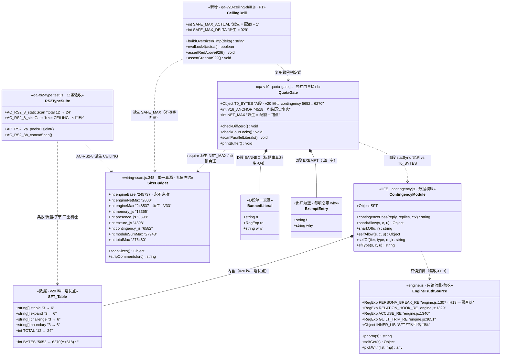
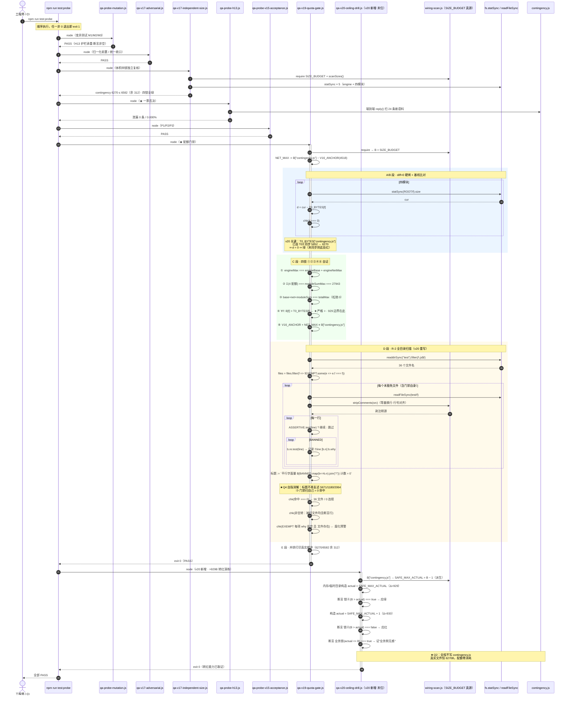
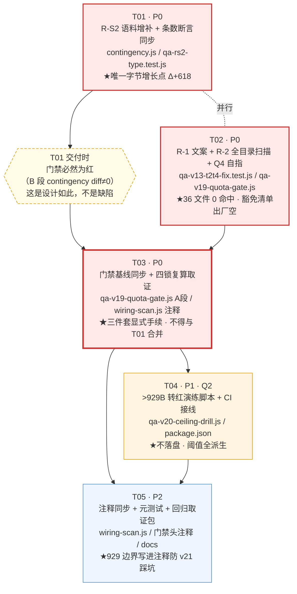

# DESIGN-v20 · R-S2 语料首次真实消费 + v19 治理遗留收口

> 架构师：高见远（Gao） · 依据：PRD-v20（主理人 Qi 已批准推荐路径，全量采纳）
> 上游状态：v19 已闭环（commit `c72228b`，已推 gitee）
> 本文性质：**架构设计 + 任务分解**，不含实现代码。工程师据 §5 任务表直接开工。

---

## §0 本轮铁律（先读这一节，违反任一条即本轮作废）

| # | 铁律 | 判据落点 |
|---|------|---------|
| L-1 | **SIZE_BUDGET 九值逐位冻结** | `wiring-scan.js:348-358` 一个字符不改（行尾注释除外） |
| L-2 | **V33 三针不翻转**（恒 248537） | `wiring-scan.js:~351` / `qa-v13-t2t4-fix.test.js:117` / `qa-v16-size-probe.js:~77` |
| L-3 | **四锁 ①②③④ 全成立**，③ 松弛恒 0 | `qa-v19-quota-gate.js` C 段 |
| L-4 | **Δ(contingency.js) ≤ 929B**（不是 930B） | §1.3 一字节边界，已实证 |
| L-5 | **memory / presence / texture 字节零改动**，engine.js 零改动 | 门禁 B 段 diff=0 硬闸 |
| L-6 | **H13 0% 一票否决**：不触碰 `engine.js:1307` 及其共享真源 | `qa-probe-h13.js` 泄漏必须恒 0 |
| L-7 | **git 靶向 add**，禁 `git add -A`；排除 `charts/` 与 `微信_*.md` dump | 提交纪律 |

---

## §0.1 起草期实证结论（本设计不是纸面推演）

本设计在起草期做了 **4 组落地干跑**，全部已回滚（`git status` 洁净，`contingency.js` 恒 5652B）：

| 干跑 | 结论 | 证据 |
|------|------|------|
| D-1 语料增补实测 | 12 条落盘 **Δ=+618B**（均值 51.5B / 最大 57B），contingency.js 5652→6270 | `stat -c%s` |
| D-2 全量单测回归 | **350 项中仅 1 项转红** —— `qa-rs2-type.test.js` AC-RS2-3 的 `total === 12` | `# pass 349 / # fail 1` |
| D-3 929/930 边界 | Δ=929 门禁 PASS；Δ=930 门禁 **锁④ FAIL**（`6582>6582`）而业务测试仍全绿 | 见 §1.3 |
| D-4 R-2 全目录扫描 | 现状 36 文件 **4 命中 / 2 文件**（与 PM 干跑逐位一致）；修完 R-1+Q4 后 **0 命中，豁免清单可为空** | 见 §1.5 |

> ⚠ **D-2 是本设计相对 PRD 的增量发现，属阻断级**：PRD 只写了"每型 +3 条"，
> 未指出 `qa-rs2-type.test.js:169` 存在 `assert.strictEqual(total, 12, "四型 × 3 条 = 12")`
> 这个**硬钉总条数**的断言。不同步改它，T-语料 落地即红。已并入 T01 必做项。

---

# §1 实现方案与框架选型

## 1.1 本轮的技术难点（三个，其余都是执行）

**难点 1 · v20 是"零字节纪律"时代的第一次有意花钱，风险在"花错口径"**

v19 之前每一轮的口径都是"字节零改动"，工程师的肌肉记忆是"看到 Δ≠0 就是错了"。
v20 反过来：**contingency.js 的 Δ≠0 恰恰是本轮的交付物**，而其余三模块 + engine.js 的
Δ 必须仍然是 0。门禁 B 段的 diff=0 硬闸会对 contingency **正常转红**，这不是缺陷，
是设计如此 —— 它在逼工程师走"基线同步"这道显式手续（§1.4）。

风险点：工程师看到红，本能反应可能是"把 T0_BYTES 改到新值让 CI 变绿"。
这在形式上与合规操作**完全一致**，区别只在于是否履行了 §1.4 的三件套。
故本设计把基线同步拆成**独立任务 T03**，且要求它携带四锁复算取证，
使"改基线"这件事在任务边界上就无法被顺手做掉。

**难点 2 · 安全上限是 929B 而不是 930B，差值来自两把锁的比较符不一致**

这是 v20 最容易首日翻车的地方，详见 §1.3。核心：门禁锁④用严格 `>`，
业务测试用 `≤`，两者对同一个"天花板"给出相差 1 的答案。**必须按 929 排预算。**

**难点 3 · 门禁的自指悖论：把扫描范围扩大到全目录后，门禁会扫到自己**

R-2 要求 `SCAN_FILES` 从硬编码 4 文件改为全目录扫描。一旦如此，
`qa-v19-quota-gate.js` 自身进入扫描集，而它的 D 段标题行
（`qa-v19-quota-gate.js:148`）字面写着 `5671/1180/2064` 且含 `chk(` → 命中 ASSERTIVE →
**门禁自我误红 3 次**。Q4 裁定：标题改由 `BANNED.map(b => b.n).join("/")` 动态拼接。

> 这条修复的意义超出"消红"本身：它把"禁用字面量清单"从**两处**（BANNED 定义 + 标题文案）
> 收敛为**一处**（BANNED 定义）。本质上，Q4 是 D 段自己身上的一次单一真源治理 ——
> 门禁在对别人执法之前，先对自己执了一次法。

## 1.2 框架选型

| 层 | 选型 | 理由 |
|----|------|------|
| 运行时 | **原生 JS（ES5+ 语法子集）+ IIFE 模块** | contingency.js 是浏览器直载脚本（`index.html` `<script>` + `sw.js` ASSETS），沿用现状，不引入任何构建步骤 |
| 测试 | **Node 内置 `node --test`**（`npm test`）+ **裸 node 探针**（`npm run test:probe`） | 现状即如此；探针刻意不进测试框架，因其需要自定退出码与并排取证输出 |
| 语料承载 | **模块内字面量常量表 `SFT`** | 不引外部 JSON：新增文件会同时冲击装载序（`engine.files.json` / `index.html` / `sw.js` 三处清单）与缓存键，即 C0-b 同族事故；且 JSON 文件不在四模块配额内会形成**配额逃逸**（把语料搬出去 = 绕过体积治理） |
| 演练取证 | **临时目录 + 内存构造，永不落盘超限文件** | Q2 裁定；见 §4.2 |

**依赖包新增：0（见 §6）。**

## 1.3 ★ 929B 一字节边界（书面记录 · 防 v21 按 930 排预算首日转红）

### 1.3.1 两把锁的比较符不一致

| 锁 | 位置 | 表达式 | 允许的最大实测字节 | 对应 Δ 上限 |
|----|------|--------|------------------|------------|
| **门禁锁④** | `qa-v19-quota-gate.js:112` | `B[f] > T0_BYTES[f]` （**严格 >**） | `6582 − 1 = 6581` | **929** |
| 业务锁（配额） | `qa-rs2-type.test.js:304` | `b <= CEILING` （**≤**） | `6582` | 930 |
| 业务锁（净增） | `qa-rs2-type.test.js:306` | `b - V16_ANCHOR <= NET_MAX` | `6582` | 930 |
| 业务锁（v15） | `qa-v15-t1.test.js:418-421` | `cur - V16 <= NET_MAX` / `cur <= CEILING` | `6582` | 930 |
| 体积闸 | `wiring-scan.js:446` `scanSizes().over` | `each[f] > SIZE_BUDGET[f]` | `6582` | 930 |

注意锁④的**第二个操作数是 `T0_BYTES[f]`（基线常量），不是实测值**。
基线同步后 `T0_BYTES["contingency.js"] = 5652 + Δ`，于是：

```
Δ = 929 → T0 = 6581 → 锁④ 判 6582 > 6581 → true  → 绿
Δ = 930 → T0 = 6582 → 锁④ 判 6582 > 6582 → false → 红
```

而同一时刻业务锁判 `6582 <= 6582 → true → 绿`。
**两者对"天花板"的答案相差恰好 1 个字节。**

### 1.3.2 实证记录（起草期干跑 D-3，已回滚）

```
===== Δ=929  实测=6581 =====
  ok   contingency.js 字节 === 基线  → 实测 6581 / 基线 6581 / Δ+0
  ok   ④ 逐模块配额 > 基线（配额不倒挂）  → … / 6582>6581
=== 配额门禁总判定: PASS ===
  业务测试 AC-RS2-8  b<=CEILING : 6581 <= 6582 → 绿
  业务测试 净增锁    b-4518<=NET: 2063 <= 2064 → 绿

===== Δ=930  实测=6582 =====
  ok   contingency.js 字节 === 基线  → 实测 6582 / 基线 6582 / Δ+0
  FAIL ④ 逐模块配额 > 基线（配额不倒挂）  → … / 6582>6582
=== 配额门禁总判定: FAIL ===
  业务测试 AC-RS2-8  b<=CEILING : 6582 <= 6582 → 绿   ← 业务侧毫无察觉
  业务测试 净增锁    b-4518<=NET: 2064 <= 2064 → 绿   ← 业务侧毫无察觉
```

### 1.3.3 处置裁定

**不改锁④的比较符，也不改业务锁的比较符。** 理由：

- 锁④的语义是"**配额必须严格宽于基线**" —— 配额与基线相等意味着"下一个字节就击穿"，
  即余量为 0 的假安全态。严格 `>` 在这里是**正确**的（它拒绝零余量）。
- 业务锁的语义是"**不许超配额**"，`≤` 在这里也是正确的（用满配额不算违规）。
- 两者语义本就不同，比较符不一致是**语义差异的正确外显**，不是缺陷。

**故：把 929 作为"安全上限"写进共享知识（§7），并由 T04 演练脚本以派生式常量固化：**

```
SAFE_MAX_ACTUAL = SIZE_BUDGET["contingency.js"] − 1     // 6581，派生，不写字面量
SAFE_MAX_DELTA  = SAFE_MAX_ACTUAL − T0_BYTES_PREV       // 929，派生，不写字面量
```

> ⚠ **写给 v21 的话**：`wiring-scan.js` contingency 行尾注释目前写着"**真实可用 930B**"。
> 这个数字对**业务锁**是对的，对**门禁锁④**差 1。T05 必须把该行尾注释订正为
> "配额余量 930B，其中门禁锁④可用 929B（第 930B 会让 `配额 > 基线` 失效）"。
> 不订正的话，v21 的架构师会照着 930 排预算，落地首日门禁转红。

## 1.4 本轮 Δ 预算表（实测口径）

| 项 | 值 | 来源 |
|----|----|------|
| 起点实测 | **5652 B** | `contingency.js` 当前 |
| 配额（冻结） | **6582 B** | `SIZE_BUDGET["contingency.js"]` |
| 门禁安全上限 Δ | **929 B** | §1.3 派生 |
| 首批规划 Δ（PRD 上限口径 12×57） | ≤ 684 B | PRD 方案 B |
| **起草期实测 Δ（D-1）** | **+618 B** | 12 条 × 均值 51.5B |
| 落地后实测字节 | **6270 B** | 5652 + 618 |
| **剩余安全缓冲** | **311 B** | 6581 − 6270 |

**四锁逐位复算（Δ=618，也对任意 Δ≤929 成立）：**

| 锁 | 表达式 | v19 值 | v20 值 | 变化 |
|----|--------|--------|--------|------|
| ① | `engineMax = engineBase + engineNetMax` | `248537 = 245737 + 2800` | 同 | **逐位不变**（SIZE_BUDGET 冻结） |
| ② | `Σ(4 配额) = moduleSumMax` | `27943 = 27943` | 同 | **逐位不变** |
| ③ | `engineBase+engineNetMax+moduleSumMax = totalMax` | `276480 = 276480`（松弛 0） | 同 | **逐位不变** |
| ④ | 逐模块 `配额 > 基线` | `13365>13333 / 3598>3566 / 4398>4366 / 6582>5652` | `… / 6582>6270` | 仅 contingency 项右移，**仍成立**（余 311） |
| ⑧ | `V16_ANCHOR + NET_MAX ≡ 配额` | `4518 + 2064 = 6582` | 同 | **逐位不变**（纯派生，配额未动） |
| V33 三针 | 恒 `248537` | 248537 | 248537 | **不翻转，零同步条目** |

**聚合量复算（起草期干跑 D-1 实测值，非纸面算术）：**

| 聚合量 | v19 态 | v20 态（Δ=618） | 上限 | 余量 | 判定 |
|--------|--------|----------------|------|------|------|
| `moduleSum` | 26917 | **27535** | 27943 | 408 | ✅ 绿 |
| `total` | 275312 | **275930** | 276480 | 550 | ✅ 绿 |
| `engineNet` | 2658 | **2658** | 2800 | 142 | ✅ 绿（零改动） |
| `engine.js` | 248395 | **248395** | 248537 | 142 | ✅ 绿（零改动） |

> 干跑原文：`ok moduleSum ≤ moduleSumMax 实测 27535 ≤ 27943（余 408）` /
> `ok total ≤ totalMax 实测 275930 ≤ 276480（余 550）`。

**哪把锁最先响？** 逐锁反算 contingency 的 Δ 容量：

| 约束 | 允许的最大 Δ |
|------|-------------|
| `moduleSum ≤ 27943` | 27943 − 26917 = **1026** |
| `total ≤ 276480` | 276480 − 275312 = **1168** |
| 业务锁 `b ≤ 6582` | **930** |
| **门禁锁④ `6582 > T0`** | **929** ← **最紧，本轮的唯一约束** |

∴ **929 是全系统的真实瓶颈**，其余锁都比它宽。§7 只需向工程师宣告这一个数字。

## 1.5 R-2 全目录扫描的迁移面（起草期干跑 D-4 实证）

**现状扫描（4 文件硬编码）**：0 命中 → 门禁绿，但这是**盲区造成的假绿**。

**改为全目录（`test/*.js`，36 个，不按 `.test.js` 后缀过滤）后的现状命中**：

```
扫描文件数: 36   命中: 4   （分布在 2 个文件）
  qa-v13-t2t4-fix.test.js:79  [5671]  assert.strictEqual(B["contingency.js"], 6582, "v18 批准值 5671→6582（…）");
  qa-v19-quota-gate.js:148    [5671]  chk("4 个测试文件的断言性行中，平行字面量 5671/1180/2064 计数 = 0",
  qa-v19-quota-gate.js:148    [1180]  （同一行）
  qa-v19-quota-gate.js:148    [2064]  （同一行）
```

**与 PM 干跑逐位一致：2 文件 / 4 命中。** 其中：

- `qa-v13-t2t4-fix.test.js:79` → **R-1 真命中**（纯文案；断言比较值是 6582，非缺陷）
- `qa-v19-quota-gate.js:148` ×3 → **Q4 自指误红**（门禁扫到自己的标题）

**修复后复跑（模拟 R-1 文案单源化 + Q4 标题动态拼接）**：

```
扫描文件数: 36   命中: 0
```

⇒ **豁免清单可以出厂即空**。这是一个重要结论：R-2 不需要为了让 CI 变绿而预置豁免，
豁免机制存在的意义是**给未来的合法例外留一个带 `why` 的登记口**，而不是给本轮擦屁股。
出厂空清单同时让 §5 T02 的验收判据变得极干净：**"豁免清单长度 === 0 且扫描命中 === 0"**。

### 1.5.1 为什么范围取"全部 `test/*.js`（36 个）"而不是"`*.test.js`（22 个）"

因为 4 个探针（`qa-v1x-*-probe.js` / `qa-v19-quota-gate.js` / `qa-v17-independent-size.js`）
**恰恰是最容易写平行字面量的地方** —— 它们不受 `node --test` 约束，作者写起来更随意，
而它们又是体积治理的取证出口。按后缀过滤会把执法者本身排除在执法范围外。
`test/fixtures/` 子目录（3 个语料夹具）**不递归**：它们是被测数据，不含断言。

---

# §2 文件列表（相对 `ai-girlfriend/`）

## 2.1 修改（6 个源文件）

| # | 路径 | 改动性质 | 字节影响 | 所属任务 |
|---|------|---------|---------|---------|
| 1 | `contingency.js` | **数据增补**：`SFT` 四型各 +3 条 | **+618 B**（≤929 硬上限） | T01 |
| 2 | `test/qa-rs2-type.test.js` | 断言同步：`total` 12→24 + 新增单条字节成本约定 | 不计预算 | T01 |
| 3 | `test/qa-v13-t2t4-fix.test.js` | **R-1**：`:79` 文案 `5671` 单源化 | 不计预算 | T02 |
| 4 | `test/qa-v19-quota-gate.js` | **R-2** D 段全目录扫描 + 豁免清单；**Q4** 标题动态拼接；**A 段** `T0_BYTES` 基线同步；头注释补 v20 块 | 不计预算 | T02 / T03 / T05 |
| 5 | `test/wiring-scan.js` | **仅注释**：新增 v20 说明块 + contingency 行尾"930 vs 929"订正 | 不计预算（非四模块） | T03 / T05 |
| 6 | `package.json` | `test:probe` 末位追加演练脚本 | 不计预算 | T04 |

## 2.2 新增（1 个源文件 + 3 个文档）

| # | 路径 | 用途 | 所属任务 |
|---|------|------|---------|
| 7 | `test/qa-v20-ceiling-drill.js` | **>929B 转红演练脚本**（Q2：临时目录构造，永不落盘超限 contingency.js） | T04 |
| 8 | `docs/DESIGN-v20.md` | 本文 | — |
| 9 | `docs/class-diagram-v20.mermaid` | §3 类图抽出 | — |
| 10 | `docs/sequence-diagram-v20.mermaid` | §4 时序图抽出 | — |
| 11 | `docs/task-dependency-v20.mermaid` | §5.7 任务依赖图抽出 | — |

## 2.3 明确不改（反向清单 · 动了即违规）

```
engine.js                 ← L-6 H13 一票否决，:1307 PERSONA_BREAK_RE 及共享真源禁触
memory.js / presence.js / texture.js
                          ← L-5 三模块字节必须 diff=0（门禁 B 段会立刻抓到）
wiring-scan.js:348-358    ← L-1 SIZE_BUDGET 九值字面量冻结（仅允许改行尾注释）
qa-v13-t2t4-fix.test.js:117  ← L-2 const V33 = 248537 不翻转
qa-v16-size-probe.js         ← L-2 V33 第三针，本轮零改动
qa-v15-t1.test.js            ← 其体积断言已全部派生自 SIZE_BUDGET，自动跟随，不需改
engine.files.json / index.html / sw.js
                          ← Q7 不新增第 5 个 type、不新增模块文件 ⇒ 装载三清单零改动
```

> **Q7 落点说明**：本轮不新增 type，`sfType()` 的四分支选择器**一行不动**，
> 增补纯粹发生在 `SFT` 四个已存在的数组尾部。这把"行为变更风险"隔离为 0：
> 任何转红都只可能来自数据本身（语料质量/字节），不可能来自选择逻辑。

---

# §3 数据结构与接口

## 3.1 T-语料：`SFT` 的落点结构（keying 与挂载）

### 3.1.1 现有结构（`contingency.js:27-31`，v19 态）

```
const SFT = {
  stable:    [ s1, s2, s3 ],   // 3 条
  expand:    [ e1, e2, e3 ],   // 3 条
  challenge: [ c1, c2, c3 ],   // 3 条
  boundary:  [ b1, b2, b3 ],   // 3 条
};                             // total = 12
```

**keying 口径（v19 确立，v20 逐位不动）**：

- **一级 key = `type`**（`sfType()` 的四个返回值之一），**不是 tier**。
- **tier 不参与 SFT 的 keying** —— tier（`hint`/`open`/`raw`）只在 **SFT 为空时**
  作为回落路径去索引 `E.INNER_LIB[tier]`（`selfOf():35`）。
  这是 v19 的刻意设计：**tier×type 正交，但只有 type 维度落表**，
  避免 12 个格子的组合爆炸（4 type × 3 tier = 12 个数组）。
- **落盘 key 恒为 `"sf"`**（`contingency.js:66` `s.ctg = {…, k, …}`），
  与 type 无关 —— H15 的"单类占比 ≤50%"统计口径因此不受语料增补影响。
  **T01 不得引入 `sf1`..`sf4`**（`AC-RS2-5` 会抓）。

### 3.1.2 v20 增补后（唯一变化：四个数组各追加 3 个元素）

```
const SFT = {
  stable:    [ s1, s2, s3, s4, s5, s6 ],   // 3 → 6
  expand:    [ e1, e2, e3, e4, e5, e6 ],   // 3 → 6
  challenge: [ c1, c2, c3, c4, c5, c6 ],   // 3 → 6
  boundary:  [ b1, b2, b3, b4, b5, b6 ],   // 3 → 6
};                                          // total = 12 → 24
```

**结构层面零变化**：仍是 `Record<type, string[]>`，无嵌套加深、无新字段、无新 key。
`selfOf(t, y, r)`（`:35`）的实现 **一个字符不改** —— 它本来就是
`A(SFT[y])` → 空则回落 `A(O(E.INNER_LIB)[t])` → `PW(L, r)`，对数组长度完全无感。

### 3.1.3 单条语料的字节成本模型（★ 供工程师自查，写进源码注释）

追加一条语料在 UTF-8 下的**精确**字节成本：

```
cost(entry) = 1(前导逗号) + 1(左引号) + 3 × n(中文字符数) + 1(右引号)
            = 3n + 3        （n = 纯中文字符数，含中文标点「，」「？」）
```

| n（字数） | cost | 备注 |
|-----------|------|------|
| 15 | 48 B | |
| 16 | 51 B | **均值目标** |
| 17 | 54 B | |
| **18** | **57 B** | **单条硬上限**（PRD 口径） |
| 19 | 60 B | ✗ 超单条上限 |

**T01 的字节纪律（三条，逐条可机检）**：

1. 单条 ≤ **18 字**（= 57 B）
2. 12 条合计 ≤ **684 B**（PRD 上限口径；起草期实测 618 B）
3. 落盘后 `Δ = size − 5652` 必须 ≤ **929 B**（§1.3 硬上限）

> 若为可读性给数组换行，每个换行 +1 B、每级缩进 +1 B。起草期干跑采取
> **不换行、直接尾部追加**的写法，Δ 恰等于 12 条 cost 之和（618 B），无额外开销。
> 本设计**推荐沿用不换行写法** —— contingency.js 全文即为高密度风格，
> 换行只会引入无谓的、不可预测的字节。

### 3.1.4 语料质量约束（H13 一票否决的数据侧保障）

新增 12 条**每一条**都必须同时满足（`AC-RS2-3` / `AC-RS2-3b` 会逐条机检）：

| # | 约束 | 判据 |
|---|------|------|
| Q-1 | 不破墙 | `E.PERSONA_BREAK_RE.test(E.pnorm(x)) === false` |
| Q-2 | **自带关系钩子** | `E.RELATION_HOOK_RE.test(x) === true`（须含 `你/咱/陪你/跟你/你说` 等） |
| Q-3 | 不情感绑架 | `E.GUILT_TRIP_RE.test(x) === false` |
| Q-4 | 不指控 | `E.ACCUSE_RE.test(x) === false` |
| Q-5 | 长度 | `x.length <= 44`（字符数，非字节） |
| Q-6 | **拼接期同样成立** | 4 个 HEAD 前缀 × 24 条，拼接后仍过 Q-1~Q-4 且 `o.length <= 90` |
| Q-7 | **全局唯一** | 24 条互不重复，且**跨型不重复**（`AC-RS2-2a` 判"四型池互不串"） |
| Q-8 | 型内语义自洽 | stable=安稳自陈 / expand=顺着用户展开 / challenge=不同视角但不攻击 / boundary=自我边界但不指责 |

> **Q-2 是最易漏的一条**：`contingency.js:65` 对 `k=="sf"` 有硬闸
> `!E.RELATION_HOOK_RE.test(o)` → `return null`。虽然 `o` 含用户前缀可能已带钩子，
> 但 `AC-RS2-3` 是对**裸语料**做 100% 钩子检查，必须条条自带。
> **Q-7 的跨型唯一性**同样易漏：`AC-RS2-2a` 会做四型笛卡尔积互斥检查。

### 3.1.5 起草期已验证可用的候选语料（12 条，Δ=618 B，全部机检通过）

工程师**可直接采用，也可自拟**，但自拟必须重跑 Q-1~Q-8 全部机检。

| type | # | 语料 | 字数 | 字节 |
|------|---|------|------|------|
| stable | 4 | 我这脾气就这样，慢慢悠悠地跟你待着 | 17 | 54 |
| stable | 5 | 跟你说话的时候，我整个人是松的 | 15 | 48 |
| stable | 6 | 我喜欢这种不用赶时间的聊法，你也是吧 | 18 | 57 |
| expand | 4 | 你这么讲，我心里也跟着展开了一点 | 16 | 51 |
| expand | 5 | 顺着你的思路走，我发现我也有这块 | 16 | 51 |
| expand | 6 | 你提的这层，我以前没细想过，挺对 | 16 | 51 |
| challenge | 4 | 我这边看法不太一样，你听听看行吗 | 16 | 51 |
| challenge | 5 | 换个角度说，我大概会选另一条路，你呢 | 18 | 57 |
| challenge | 6 | 这点我想跟你争一下，不是要吵架 | 15 | 48 |
| boundary | 4 | 这句我心里有点堵，还是跟你直说了 | 16 | 51 |
| boundary | 5 | 我现在需要缓一缓，你等我一下好吗 | 16 | 51 |
| boundary | 6 | 这块我想留给自己，你能理解的吧 | 15 | 48 |
| | | **合计** | **194** | **618** |

> 起草期干跑结论：这 12 条落盘后 **350 项单测仅 1 项红**（即 `total === 12` 那条计数断言），
> `qa-probe-h13.js` **0 泄漏**，四锁全绿。

## 3.2 T-R2：门禁 D 段的新数据结构

```
BANNED     : Array<{ n: string, re: RegExp, why: string }>   // 单一真源，标题由它派生
EXEMPT     : Array<{ f: string, why: string }>               // 出厂为空数组
SCAN_DIR   : "test"                                          // 全目录，不递归
SCAN_GLOB  : /\.js$/                                         // 36 个，不按 .test.js 过滤
ASSERTIVE  : /assert|\bok\(|\bchk\(|<=/                       // 口径不变（v19 沿用）
```

**三条结构性约定**：

1. **标题禁止复述 `BANNED` 的字面量** —— 必须 `BANNED.map(b => b.n).join("/")`（Q4）。
2. **`EXEMPT` 每项必须带非空 `why`** —— 无 `why` 的豁免 = 未经论证的盲区，元自检直接判红。
3. **`EXEMPT` 中的文件必须真实存在于 `test/`** —— 文件删了而豁免留着 = 腐化，元自检判红
   （这是"豁免清单腐化预警"，见 T02 验收项）。

## 3.3 类图



---

# §4 程序调用流程

## 4.1 主链路：`npm run test:probe` 全量执行 · R-2 全目录扫描 + 门禁基线比对



## 4.2 T-演练（Q2）：">929B 门禁正确转红"的取证设计

### 4.2.1 为什么做成脚本而不是手工步骤

PRD 原描述是"本地构造超限 → 跑 `test:probe` 取证转红 → 回退再提交"。
**本设计升级为可提交的自动化脚本**，理由：

| 手工步骤 | 脚本 |
|---------|------|
| 只在 v20 做一次，v21 无人复跑 | 每次 CI 都跑，**转红能力持续有效** |
| 需要真的写坏 `contingency.js`，存在忘记回退的风险 | **永不触碰 `contingency.js`**，Q2 的"不落盘"更彻底 |
| 取证是一张截图/一段粘贴，可伪造 | 取证是退出码，不可伪造 |
| 门禁自身若被改坏（如 `>` 被改成 `>=`），无人发现 | **脚本会立刻红** —— 它是门禁的门禁 |

> 关键洞察：手工演练证明的是"**此刻**门禁能转红"；脚本证明的是"**任何时刻**门禁都能转红"。
> v19 的教训（盲区造成假绿）恰恰说明前者不够。

### 4.2.2 脚本的三段结构（`test/qa-v20-ceiling-drill.js`）

```
── 段 1 · 派生安全线（零字面量）
   B              := require("./wiring-scan.js").SIZE_BUDGET["contingency.js"]
   T0             := 从 qa-v19-quota-gate.js 读取 T0_BYTES["contingency.js"]（正则抽取，
                     不 require —— 门禁是可执行脚本，require 会触发它整段跑一遍）
   SAFE_MAX_ACTUAL := B − 1
   SAFE_MAX_DELTA  := SAFE_MAX_ACTUAL − 5652（v19 收口锚点，从门禁历史注释取，唯一字面量且带来源）

── 段 2 · 边界三判（纯函数求值，不碰磁盘）
   lock4(actual)   := B > actual                    // 复刻门禁 C 段锁④
   bizLock(actual) := actual <= B                   // 复刻 AC-RS2-8
   assert lock4(SAFE_MAX_ACTUAL)      === true   // Δ=929 → 门禁绿
   assert lock4(SAFE_MAX_ACTUAL + 1)  === false  // Δ=930 → 门禁红 ★核心取证
   assert bizLock(SAFE_MAX_ACTUAL + 1)=== true   // Δ=930 → 业务锁仍绿 ★证明一字节缺口真实存在

── 段 3 · 端到端非空转（临时目录，跑完即删）
   tmp := fs.mkdtempSync(os.tmpdir() + "/v20drill-")
   在 tmp 内复制一份 contingency.js 并 padding 到 SAFE_MAX_ACTUAL + 1
   以 tmp 为 ROOT 复算门禁 B 段 + C 段锁④ → 断言判定为 FAIL
   fs.rmSync(tmp, {recursive:true})
   ★ 断言 process.cwd() 下的真实 contingency.js 字节在演练前后**逐位不变**
```

### 4.2.3 反空转保护

段 2 是纯算术，可能被"两个 true 都写死"骗过。故强制要求：

- **段 2 必须包含一条"绿转红"对照**（`929 → true` 与 `930 → false` 成对出现，缺一即无效）；
- **段 3 必须实测**临时文件字节，且断言 `实测 === SAFE_MAX_ACTUAL + 1`（证明 padding 真的生效）；
- **段 3 结束必须断言真实 `contingency.js` 字节不变**（证明 Q2 不落盘承诺被履行）。

---

# §5 任务列表（工程师直接依据 · 按实现顺序）

> **总量 5 个任务**（T01–T05）。P0 三个必须本轮全交；P1 一个；P2 一个。
> 每个任务给出：源文件、依赖、验收判据、以及**做完必须跑什么**。

## T01 · R-S2 语料增补与条数断言同步（P0）

**依赖**：无（可立即开工）
**源文件**（3）：
- `contingency.js` —— `SFT` 四型各 +3 条（**唯一的字节增长点**）
- `test/qa-rs2-type.test.js` —— 计数断言同步 + 单条字节成本约定
- `docs/DESIGN-v20.md` —— 回填"落地后实测字节"（§1.4 表格）

**做什么**：

1. 在 `SFT.stable / expand / challenge / boundary` **四个数组的尾部**各追加 3 条语料。
   - 采用 §3.1.5 的候选表，或自拟（自拟须全过 Q-1~Q-8）。
   - **不换行、直接尾部追加**（§3.1.3）。
   - **不得**改动 `sfType()` / `selfOf()` / `selfAllow()` 任何一行（Q7：纯数据增补）。
   - **不得**新增第 5 个 type，**不得**引入 `sf1`..`sf4` 分裂 key。
2. ★ **改 `test/qa-rs2-type.test.js:169`**：
   `assert.strictEqual(total, 12, "四型 × 3 条 = 12，实测 " + total)`
   → 改为 **`24`**，且失败消息改为**由常量派生**的口径
   （建议：`TYPES.length * PER_TYPE`，`PER_TYPE = 6`，避免再写第二个 `24`）。
   同处的 `C.SFT[y].length >= 3` 下限建议同步抬到 `>= 6`（否则"少加了一型"抓不到）。
3. 在 `test/qa-rs2-type.test.js` 增补**单条字节成本约定**的机检：
   逐条断言 `Buffer.byteLength(x, "utf8") <= 57`（单条硬上限）
   且 `Σ − 起始值 <= 929`（总量硬上限，派生自 §7 的 `SAFE_MAX_DELTA`，不写字面量 929）。

**验收判据**：
- `npm test` → **全绿**（起草期干跑证明：改了 `total` 后 350/350）
- `node test/qa-probe-h13.js` → **泄漏 0 条 / 0.000%**（★ 一票否决）
- `stat -c%s contingency.js` → `≤ 6581`，且 `Δ = 实测 − 5652 ≤ 929`
- 门禁此时**预期为红**（B 段 contingency diff≠0）—— 这是正常的，由 T03 收口

**做完必须跑**：`npm test && node test/qa-probe-h13.js && stat -c%s contingency.js`

---

## T02 · 单一真源治理：R-1 文案 + R-2 全目录扫描 + Q4 自指消解（P0）

**依赖**：无（**可与 T01 并行**，两者不冲突）
**源文件**（3）：
- `test/qa-v13-t2t4-fix.test.js` —— R-1
- `test/qa-v19-quota-gate.js` —— R-2（D 段）+ Q4（标题）
- `docs/DESIGN-v20.md` —— 回填迁移干跑结果

**做什么**：

1. **R-1**（`qa-v13-t2t4-fix.test.js:79`）：把失败消息中的 `5671` 去掉，改为指向单一真源。
   - **断言比较值 `6582` 必须保持不动**（它本来就对，不是缺陷）。
   - 建议文案：`"v18 批准值（旧配额见 wiring-scan.js v18 审批块）→ 6582（受援方 +911B · 残差式 27943−21361）"`。
   - ⚠ 只改这一行的**消息串**，`:117` 的 `const V33 = 248537` 严禁触碰（L-2）。
2. **R-2**（`qa-v19-quota-gate.js` D 段）：`SCAN_FILES` 硬编码 → 全目录扫描 + 显式豁免清单。
   - 扫描集：`fs.readdirSync("test").filter(f => /\.js$/.test(f))` → **36 个**，**不递归** `fixtures/`。
   - **不按 `.test.js` 后缀过滤**（理由见 §1.5.1）。
   - `EXEMPT = []`（**出厂为空**），元素形状 `{ f, why }`，`why` 必填。
   - D 段"非空转"断言同步改为：`被扫文件数 >= 30 且 至少 N 个文件含断言行`
     （原文案"4 个被扫文件"已失效）。
   - 新增**豁免清单腐化预警**：`EXEMPT` 每项须 ① `why` 非空 ② `test/<f>` 真实存在，
     否则判红（防"文件删了豁免还在"的僵尸豁免）。
3. **Q4**（`qa-v19-quota-gate.js:148`）：`chk()` 标题改为
   `` `…平行字面量 ${BANNED.map(b => b.n).join("/")} 计数 = 0` `` 动态拼接。
   - 同时检查 `BANNED` 定义行（`:131-133`）**不得含 ASSERTIVE 词元**（`assert` / `ok(` / `chk(` / `<=`），
     否则定义行自身会被扫中。当前写法已满足，改动时勿破坏。

**验收判据**：
- `node test/qa-v19-quota-gate.js` 的 D 段输出：**扫描 36 文件 / 0 违规**
  （起草期干跑 D-4 已实证：R-1 + Q4 修完后命中数从 4 → 0，豁免清单可保持为空）
- `EXEMPT.length === 0`
- **新建文件不再是盲区**：临时在 `test/` 放一个含 `assert(x <= 2064)` 的文件 → 门禁必须红；
  删除后恢复绿（此为 QA 的反向可测项，工程师需自证一次）
- `npm test` 仍全绿（R-1 只改文案，`qa-v16-size-probe.js` 对 `V33` 的正则抽取不受影响）

**做完必须跑**：`node test/qa-v19-quota-gate.js && npm test`

---

## T03 · 门禁基线同步 + 四锁复算取证（P0 · 显式手续，不得与 T01 合并）

**依赖**：**T01、T02**（需要 T01 的落地实测字节；需要 T02 的 D 段已稳定）
**源文件**（3）：
- `test/qa-v19-quota-gate.js` —— A 段 `T0_BYTES["contingency.js"]`
- `test/wiring-scan.js` —— contingency 行尾注释订正（**仅注释**）
- `docs/DESIGN-v20.md` —— §5.8 重谈记录与批准链

**做什么**：

1. 实测：`stat -c%s contingency.js` → 记为 `N`（起草期预期 **6270**）。
2. 把 `qa-v19-quota-gate.js:57` 的 `"contingency.js": 5652` 同步为 `"contingency.js": N`。
   - **memory / presence / texture 三项一个字符都不许动**（它们必须仍是 13333 / 3566 / 4366）。
3. **履行 DESIGN-v19 §4.4 三件套**（缺一即违规），并在本文档 §5.8 落字：
   - ① `SIZE_BUDGET` 对应项调整 → **本轮为"无需调整"**，须书面写明理由：
     Δ 落在既有配额 6582 之内，配额九值冻结，故三件套第①项以"经审视，判定无需变更"结案 ——
     **这不是跳步，是履行后判定为空**（两者的区别必须在文档上可见）。
   - ② 本文件 `T0_BYTES` 同步到新实测值 → 本任务第 2 步。
   - ③ DESIGN-v20 记录重谈依据 + 主理人批准链 → §0 已记录 Qi 批准，本任务回填实测数字。
4. 订正 `wiring-scan.js` contingency 行尾注释的 **"真实可用 930B"** →
   `"配额余量 <6582−N>B；★门禁锁④可用上限为 6581（Δ≤929），第 930B 会让「配额 > 基线」失效"`。
   - ⚠ 只改**行尾注释**，`6582` 这个值本身**严禁触碰**（L-1）。

**验收判据**（★ 本轮最关键的一组）：
- `npm run test:probe` → **全部 6（+T04 后 7）项 PASS**，门禁 B 段 `Δ+0` 四行齐绿
- 门禁 C 段锁④ 打印 `… / 6582>6270`，**余量 ≥ 1**
- 门禁 E 段打印 `contingency.js  6270 / 配额 6582  余 312`
- `npm test` 全绿
- **反向自证**：把 `T0_BYTES` 故意写错 1 个字节 → 门禁必须红；改回 → 绿

**做完必须跑**：`npm run test:probe && npm test`

---

## T04 · >929B 转红演练脚本 + CI 接线（P1 · Q2）

**依赖**：**T03**（需要基线已同步，演练才有稳定参照）
**源文件**（3）：
- `test/qa-v20-ceiling-drill.js`（新增）
- `package.json` —— `test:probe` 末位追加
- `docs/DESIGN-v20.md` —— 取证输出粘贴

**做什么**：

1. 按 §4.2.2 三段结构实现演练脚本。
   - **所有阈值派生，禁止字面量 929 / 930 / 6581 / 6582**（否则本脚本自身成为第 5 个平行数字，
     且会被 T02 的全目录扫描抓到）。
   - 唯一允许的字面量是 v19 收口锚点 `5652`，且必须带来源注释。
2. `package.json` 的 `test:probe` 在 `qa-v19-quota-gate.js` **之后**追加本脚本。
   - **不进 `test:probe:fast`**（沿用 v19 Q3 裁定：门禁族不进 pre-commit）。
3. 取证输出粘贴回本文档 §5.9。

**验收判据**：
- `node test/qa-v20-ceiling-drill.js` → PASS，输出含三行对照：
  `Δ=929 → 锁④ 绿` / `Δ=930 → 锁④ 红` / `Δ=930 → 业务锁仍绿`
- 演练前后 `stat -c%s contingency.js` **逐位相同**（Q2 不落盘）
- `os.tmpdir()` 下无残留 `v20drill-*` 目录
- **反空转**：把脚本里的 `SAFE_MAX_ACTUAL + 1` 改成 `+ 0` → 脚本必须红（证明它真的在判边界）

**做完必须跑**：`npm run test:probe`（7 项全绿）

---

## T05 · 文档注释同步 + 回归取证包 + 元测试（P2）

**依赖**：**T03、T04**
**源文件**（3+）：
- `test/wiring-scan.js` —— 新增 v20 说明块（**仅注释**，追加不删改历史块）
- `test/qa-v19-quota-gate.js` —— 头注释补 v20 变更说明（R-2 范围/豁免协议/929 边界）
- `docs/QA-ACCEPTANCE-v20.md` 交接材料 + `docs/*-v20.mermaid` 三张图

**做什么**：

1. `wiring-scan.js` 追加 v20 注释块，**必须**写清三件事：
   - SIZE_BUDGET 九值本轮**零改动**（v20 是"在配额内花钱"，不是"改配额"）；
   - **929 vs 930 的一字节边界**及其成因（两把锁比较符不一致）；
   - contingency 的 T0 基线已从 5652 迁移到 N，历史 5652 仅作审计轨迹。
   - ⚠ 历史块（v14/v16/v17/v18/v19）**逐字不动**（`qa-v16-size-probe.js` AC-B-7 会正则校验
     `/v16\s*T0\s*预算重谈轮/`、`/2200→2400/`、`/2400→2800/` 等，删了即红）。
2. `qa-v19-quota-gate.js` 头注释补 v20 段：D 段范围从 4 文件 → 全目录 36 文件、
   豁免清单协议（必带 `why`、必须真实存在）、Q4 自指消解的由来。
3. **门禁自指元测试**：新增一条断言 —— 门禁自身源码经 `stripComments` + `ASSERTIVE` 过滤后，
   **`BANNED` 的三个字面量命中数必须为 0**（把 Q4 的修复钉死，防 v21 有人把标题改回硬编码）。
4. **语料质量抽检**：在 `qa-rs2-type.test.js` 增补"新增 12 条与既有 12 条不得重复"的断言
   （Q-7 的加强版，防复制粘贴事故）。
5. 产出三张 mermaid 图文件 + `docs/QA-ACCEPTANCE-v20.md` 的验收项清单交接给 QA。

**验收判据**：
- `npm run test:all` 全绿
- `qa-v16-size-probe.js` AC-B-7 / AC-B-7' 仍绿（历史注释块未被破坏）
- 元测试反向自证：把门禁标题改回硬编码 → 元测试红

---

## §5.6 任务顺序与并行度

```
第 1 波（并行）：T01 ┐
                T02 ┘
第 2 波（汇合）：      T03   ← 必须等 T01 落地实测 + T02 D 段稳定
第 3 波：                  T04
第 4 波：                       T05
```

**为什么 T03 不能并进 T01**：这是本设计最重要的一条流程约束。
若把"改语料"和"改基线"放进同一个任务，工程师会在同一次编辑里顺手把 `T0_BYTES` 改掉，
门禁从头到尾**没有红过一次** —— 于是门禁在本轮的作用等于零。
拆开之后，T01 结束时门禁**必然是红的**，工程师必须显式地、带着四锁复算取证去做 T03。
**门禁的价值 100% 取决于"改基线比重谈配额更麻烦"**（DESIGN-v19 §4.4 原话）。

## §5.7 任务依赖图



## §5.8 配额重谈三件套记录（T03 回填）

| 件 | 内容 | 本轮结论 |
|----|------|---------|
| ① `SIZE_BUDGET` 调整 | 九值是否需变 | **经审视，判定无需变更** —— Δ=618 落在既有配额 6582 内，未触及任何配额边界。**此项已履行并结案为空，非跳步。** |
| ② `T0_BYTES` 同步 | `"contingency.js"` 5652 → N | **已执行（T03）**，N = **6270**（`fs.statSync` 落地实测，与起草期干跑 D-1 逐位一致） |
| ③ DESIGN 记录 + 批准链 | 重谈依据 + 主理人批准 | §0 记录 Qi 已批准 v20 推荐路径；本表即依据 |

**T03 落地实测回填（工程师 Kou）**：

| 项 | 设计预期 | 落地实测 | 判定 |
|----|---------|---------|------|
| contingency.js 字节 | 6270 | **6270** | ✅ 逐位一致 |
| Δ（相对 5652） | +618 | **+618** | ✅ ≤ 929 硬上限，余 311B |
| 配额余量（6582 − 实测） | 312 | **312** | ✅ |
| 单测 | 350/350 | **350 pass / 0 fail** | ✅ |
| 四锁 ①②③⑧ | 逐位不变 | 逐位不变（③ 松弛恒 0） | ✅ |
| 锁④ contingency 项 | 6582>6270 | **6582>6270** | ✅ |
| V33 三针 | 恒 248537，同步 0 条 | 恒 248537，未触碰 | ✅ |
| H13 泄漏 | 0 | **0 条 / 0.000%** | ✅ |

**★ 门禁红→绿全过程已实测取证（本设计 §5.6 流程约束的有效性证明）**：

```
T01 交付后（语料已落盘，基线未同步）：
  FAIL contingency.js 字节 === 基线  → 实测 6270 / 基线 5652 / Δ+618
  === 配额门禁总判定: FAIL ===        exit 1     ← 设计预期的红，非缺陷
T03 交付后（履行三件套，基线同步至 6270）：
  ok   contingency.js 字节 === 基线  → 实测 6270 / 基线 6270 / Δ+0
  ok   ④ 逐模块配额 > 基线            → … / 6582>6270
  === 配额门禁总判定: PASS ===        exit 0
```

## §5.9 演练取证（T04 回填）

**落地实跑输出（`npm run test:ceiling-drill`，工程师 Kou 回填）**：

```
--- 2. 边界三判（锁④ vs 业务锁，同一实测字节两种答案）---
  ok   Δ=929（实测 6581）→ 锁④ 应绿              → 6582 > 6581 = true
  ok   Δ=930（实测 6582）→ 锁④ 应红  ★核心取证   → 6582 > 6582 = false
  ok   Δ=930（实测 6582）→ 业务锁仍绿 ★缺口实证  → 6582 <= 6582 = true
  ok   两把锁在越界点给出相反答案                 → 锁④=false / 业务锁=true
--- 4a. 真实顶到越界点（基线未同步）→ B 段 diff 硬闸应接住 ---
  ok   4a 门禁退出码非 0                          → exit = 1
  ok   4a B 段 diff 硬闸明确报红                  → 实测 6582 / 基线 6270 / Δ+312
--- 4b. 基线被同步到越界值 → C 段锁④应接住 ---
  ok   4b C 段锁④ 明确报红  ★核心取证            → … / 6582>6582
--- 4c. 自清理取证 ---
  ok   ★ 演练前后真实 contingency.js 逐字节一致   → 6270 → 6270 / byte-identical
  ok   ★ 复跑门禁确认已回到全绿                   → exit = 0
=== 天花板演练总判定: PASS ===
```

### §5.9.1 ★ 实现期修正：锁④的红，不是"文件撑大"撑出来的

起草期 §4.2.2 把段 3 设计为"padding 一个超限副本 → 复算锁④ → 应 FAIL"。
实现期实跑发现该表述会**误导 v21**：

> **锁④的第二个操作数是 `T0_BYTES[f]`（基线常量），根本不读文件字节。**
> 因此把 `contingency.js` 撑到 6582 **不会**让锁④变红 —— 拦住它的是 **B 段 diff=0 硬闸**。
> 锁④真正转红的时刻，是**基线也被同步到越界值**的那一刻，即
> "有人**合规地**走完了基线同步三件套，却把 Δ 排到了 930"。

这恰恰是 §1.3 那个一字节缺口最危险的形态：**流程全部履行、业务测试全绿，只有锁④亮红灯。**
故 T04 脚本把段 4 拆成两条独立取证路径（均已实跑通过）：

| 路径 | 构造 | 接住它的闸 | 语义 |
|------|------|-----------|------|
| **4a** | 只撑大 `contingency.js` | **B 段 diff=0 硬闸** | 未经重谈的 diff（最常见） |
| **4b** | 只把 `T0_BYTES` 同步到越界值 | **C 段锁④** | 走完流程但 Δ 排到 930（最危险，业务侧无感） |

4b 完全不触碰 `contingency.js`，对 Q2"不落盘"的履行比原设计更彻底。

---

# §6 依赖包列表

**新增第三方依赖：0 个。**

| 用途 | 采用 | 说明 |
|------|------|------|
| 测试框架 | `node --test`（Node ≥18 内置） | 现状，不变 |
| 文件系统 / 路径 | `node:fs` / `node:path` | 内置 |
| 临时目录（T04 新用） | `node:os.tmpdir()` + `fs.mkdtempSync` | **内置**，无需依赖 |
| 子进程（`baseline.js` 现用） | `node:child_process` | 内置 |

`package.json` 的 `dependencies` / `devDependencies` **本轮零改动**，
仅 `scripts.test:probe` 末位追加一个脚本路径（T04）。

> 这与 PRD 预期一致（"预期为空"）。引入任何 npm 包都会破坏本工程"浏览器直载 + 零构建"的前提。

---

# §7 共享知识（跨文件约定 · 工程师必读）

## 7.1 单一真源地图（改任何一个数字前，先查这张表）

| 概念 | **唯一可写位置** | 派生方式 | 禁止 |
|------|-----------------|---------|------|
| 四模块配额 / 天花板（九值） | `test/wiring-scan.js:348-358` `SIZE_BUDGET` | — | 本轮**冻结**，任何文件不得复述其值作为断言比较值 |
| `V33`（engine 硬上限） | 派生 = `SIZE_BUDGET.engineMax` | 三处运行时字面量必须同步 | 本轮**不翻转**，同步条目数 = 0 |
| `V16_ANCHOR` | `4518` | 历史事实（v15 R-C5 落位），**冻结** | 不得当作配额调整 |
| `NET_MAX` | **无独立位置** | `= SIZE_BUDGET["contingency.js"] − V16_ANCHOR` | 禁止写它的算出值 `2064` |
| `CEILING` | **无独立位置** | `= SIZE_BUDGET["contingency.js"]` | 禁止写 `6582` / `5671` 作为平行上限 |
| **`T0_BYTES` 基线** | `test/qa-v19-quota-gate.js:53-58` | — | **受控常量，与配额同级**；改它必须走 §5.8 三件套 |
| **`BANNED` 禁用字面量清单** | `test/qa-v19-quota-gate.js` D 段 `BANNED` 数组 | 标题 `= BANNED.map(b=>b.n).join("/")` | 禁止在标题/文案里复述这些数字（Q4） |
| **`EXEMPT` 豁免清单** | `test/qa-v19-quota-gate.js` D 段 | 出厂 `[]` | 每项必带非空 `why` 且文件须真实存在 |
| **语料 `SFT`** | `contingency.js:27-31` | — | 不得搬出模块（会形成配额逃逸）；不得新增第 5 个 type |

## 7.2 ★★ 929B 安全上限（本轮最重要的一条，v21 请先读这里）★★

```
配额（SIZE_BUDGET["contingency.js"]）        = 6582
门禁锁④允许的最大实测字节 = 配额 − 1        = 6581
v19 收口锚点（T0 基线起点）                  = 5652
──────────────────────────────────────────────────
★ 安全 Δ 上限 = 6581 − 5652 = 929 B  （不是 930！）
```

**成因**：门禁锁④用严格 `>`（`B[f] > T0_BYTES[f]`，`qa-v19-quota-gate.js:112`），
业务锁用 `≤`（`b <= CEILING`，`qa-rs2-type.test.js:304`）。
Δ=930 时门禁判 `6582 > 6582` = false **转红**，而业务测试判 `6582 <= 6582` = true **仍绿**。
**业务侧对这次越界毫无察觉。** 已实证，见 §1.3.2。

**排预算铁律**：任何后续版本按 **929** 排，不按 930 排。
若确需用满第 930 个字节，那不是"用满余量"，那是**配额重谈**，必须走 §5.8 三件套。

## 7.3 语料增补约定

| 项 | 约定 |
|----|------|
| 挂载位置 | `contingency.js` 的 `SFT[type]` 数组尾部，**不换行追加** |
| keying | 一级 key = `type`（4 个，冻结）；tier 不落表，仅作空表回落索引 |
| 落盘 key | 恒为 `"sf"`，**不随 type 分裂** |
| 单条字节 | `cost = 3n + 3`（n = 中文字符数），**上限 57 B（n ≤ 18）** |
| 单条字符 | `x.length <= 44`（`AC-RS2-3`） |
| 批次总量 | 12 条 ≤ 684 B（PRD 口径）；**硬上限仍是 929 B** |
| 质量门 | Q-1~Q-8（§3.1.4），逐条机检，**关系钩子必须自带** |
| 唯一性 | 24 条全局唯一，且**跨型不重复** |

## 7.4 门禁扫描口径

| 项 | 值 |
|----|----|
| 扫描范围 | `test/*.js`，**36 个**，不递归 `fixtures/`，**不按 `.test.js` 过滤** |
| 注释剥离 | `wiring-scan.stripComments`（等量换行替换，行号与原文对齐） |
| 断言性行判据 | `/assert\|\bok\(\|\bchk\(\|<=/` —— 说明性注释里出现禁用数字**允许** |
| 禁用字面量 | `5671`（v17 残差锁）/ `1180`（v17 净增锁）/ `2064`（NET_MAX 算出值） |
| 正则形式 | `(?<![\d])NNNN(?![\d])` —— 防 `15671` / `20641` 之类误伤 |
| 豁免 | `EXEMPT`，出厂空，每项 `{ f, why }`，`why` 必填、文件必须存在 |

## 7.5 提交纪律

```
✗ git add -A                      ← 禁止
✓ git add ai-girlfriend/contingency.js \
          ai-girlfriend/test/qa-rs2-type.test.js \
          ai-girlfriend/test/qa-v13-t2t4-fix.test.js \
          ai-girlfriend/test/qa-v19-quota-gate.js \
          ai-girlfriend/test/qa-v20-ceiling-drill.js \
          ai-girlfriend/test/wiring-scan.js \
          ai-girlfriend/package.json \
          ai-girlfriend/docs/DESIGN-v20.md ...

排除：ai-girlfriend/charts/      （未跟踪 dump）
      微信_*.md / 小暖*.md       （根目录未跟踪 dump）
```

## 7.6 判红速查（工程师遇红先查这里）

| 现象 | 大概率原因 | 处置 |
|------|-----------|------|
| 门禁 B 段 `contingency.js Δ+618` 红 | T01 已做但 T03 未做 | **正常**，去做 T03 |
| 门禁 B 段 memory/presence/texture 任一红 | 误改了三模块 | **立即回滚**，L-5 违规 |
| 门禁 C 段锁④红 | Δ > 929 | 砍语料条数，**不许改配额、不许改基线** |
| `AC-RS2-3` "实测 24" 红 | T01 只改了语料没改计数断言 | T01 第 2 步 |
| `AC-RS2-3` "NOHOOK" 红 | 某条语料没自带 `你/咱` | 改语料，不许放宽 Q-2 |
| `AC-RS2-2a` "串到" 红 | 跨型语料重复 | Q-7 |
| 门禁 D 段扫出 `qa-v19-quota-gate.js:NNN` | Q4 标题被改回硬编码 | 恢复动态拼接 |
| `qa-probe-h13.js` 泄漏 > 0 | **一票否决** | 立即停工上报，回滚语料 |
| `AC-B-7` 红 | `wiring-scan.js` 历史注释块被删改 | 恢复，历史块逐字不动 |

---

# §8 待明确事项

| # | 事项 | 现状 / 我的处置 | 是否阻断 |
|---|------|----------------|---------|
| **U-1** | **PRD 未覆盖的阻断项**：`qa-rs2-type.test.js:169` 硬钉 `total === 12`，语料 +12 条落地即红。 | 起草期干跑 D-2 发现。**已自行裁定并入 T01 第 2 步**（改 24 并派生化）。此为纯计数断言同步，不涉及口径放松 —— 但**属 PRD 范围外的增量改动，需主理人知悉**。 | 已解决，**需追认** |
| **U-2** | `wiring-scan.js` contingency 行尾注释现称"真实可用 930B"，对门禁锁④差 1。 | 已并入 T03 第 4 步订正。仅改注释，不动 `6582`。 | 否 |
| **U-3** | T04 演练脚本的唯一字面量 `5652`（v19 收口锚点）：是否会被 T02 的全目录扫描误伤？ | **不会** —— `5652` 不在 `BANNED` 三数之列。但若 v21 把它加入 `BANNED`，脚本需同步改为从门禁读取。已在 §4.2.2 注明取值来源。 | 否 |
| **U-4** | `AC-RS2-3` 的 `C.SFT[y].length >= 3` 下限是否同步抬到 `>= 6`？ | **建议抬**（否则"少加了一型"抓不到，只有 `total` 那条会红且定位不到型）。已写进 T01 第 2 步，标注为"建议"。**请主理人裁定是否强制。** | 否 |
| **U-5** | T04 是否进 `test:probe:fast`？ | **不进**，沿用 v19 Q3 裁定（门禁族不进 pre-commit，防 `--no-verify` 肌肉记忆）。 | 否 |
| **U-6** | 12 条候选语料（§3.1.5）是否直接采用？ | 起草期已全过 Q-1~Q-8 机检 + H13 0 泄漏 + 350 单测。**建议直接采用**以节省 QA 轮次；工程师自拟则需重跑全部机检。**请产品/主理人对文案调性做一次人工过目。** | 否，但**建议人工过目** |
| **U-7** | 语料落地后若实测 Δ 与起草期 618 不一致（工程师自拟文案） | T03 以**落地实测值**为准同步 `T0_BYTES`，本文档 §1.4 由 T01 回填。硬上限恒为 929。 | 否 |

---

## 附：本设计的自检清单（交付前逐条打勾）

- [x] SIZE_BUDGET 九值冻结 —— 本设计未提出任何配额变更
- [x] V33 三针不翻转 —— 同步条目数 0，已在 §1.4 表格逐位复算
- [x] 四锁 ①②③④ 全成立 —— ①②③⑧ 逐位不变，④ 余量 311 B
- [x] Δ ≤ 929B 演算自洽 —— 实测 618 B，且 929 边界已实证（§1.3.2）
- [x] H13 0% —— 起草期干跑 `qa-probe-h13.js` 泄漏 0 条，未触碰 `engine.js:1307`
- [x] 不新增第 5 个 type —— 纯数据增补，选择器零改动
- [x] R-2 迁移面已实证 —— 2 文件 4 命中，修完 0 命中，豁免清单出厂空
- [x] 预留可测项 —— 基线同步后全绿 / >929B 转红 / 新建文件非盲区，均已落进 T02~T04 验收判据
- [x] 任务数 ≤ 5 —— T01~T05
- [x] 未写实现代码 —— 全文只有结构、判据与算术


