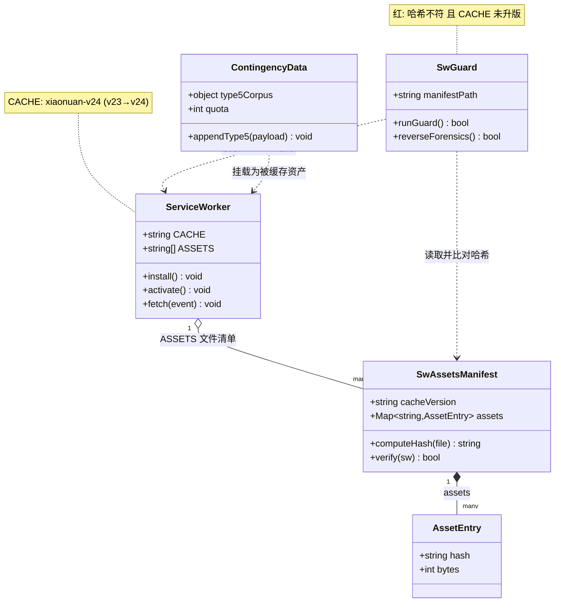
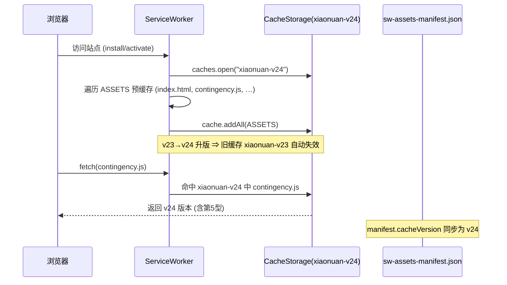

# DESIGN-v21 · 架构设计

> 架构师：高见远（Gao）　|　输入：PRD-v21（主理人 Qi 已批准 **A + D + C 合并轮**）
> 前序：DESIGN-v20 / QA-ACCEPTANCE-v20 / wiring-scan.js SIZE_BUDGET v20 终态
> 本文只产出**设计 + 任务分解**，不含实现代码。

---

## §0 本轮范围与优先级

| 序 | 代号 | 内容 | 优先级 | 不可砍性 |
|----|------|------|--------|----------|
| 1 | **TD** | 修 v20 sw.js 缓存逃逸（C0-b 事故类）+ 新增**内容↔版本联动守卫** | **P0 前置闸** | PM 立场「若必须削减，削 A 保 D」——**不可砍** |
| 2 | **TA** | 配额重谈首秀：contingency 第 5 语料型 + 路径③ 预算右移 + 门禁基线同步 | **P0 业务主体** | 可延后，不可半做 |
| 3 | **TC** | 技术债清扫（`qa-v19-quota-gate.js:40` 注释「36 个」去具体化等） | P2 顺风车 | 可砍 |

**四条铁律（本轮全程适用）**

1. 四锁 ①②③④ 绝不可破；`moduleSumMax` 允许右移（Q3 已批），锁② 两边同移。
2. `SIZE_BUDGET` 一旦改动，**所有平行字面量必须同步翻转**（§1.2 给出完整针位清单，**远多于 PRD 所称的「三针」**）。
3. **H13 0% 一票否决**：不碰 `engine.js:1307`；第 5 型是 contingency 侧数据，`qa-probe-h13` 必须仍 0 泄漏。
4. `sw.js` 升版是预期且必需，**不消耗四锁预算**（sw.js 不在 engine + 四模块体积口径内）。

---

## §1 独立复算与勘误（架构师尽职调查）

本节是本设计的**取证基座**。所有数字均由架构师在工作区实读、`node` 实算得出，不引用 PRD 的算术结论。

### 1.1 路径③ 四锁独立复算 —— **自洽，确认成立**

从「engine 让渡 D=100」这一个输入出发，逐级推导（未反向套用 PRD 给定值）：

```
engineNetMax  = 2800 − 100            = 2700     ✓ 与 PRD 一致
engineMax(V33)= 245737 + 2700         = 248437   ✓ 与 PRD 一致
moduleSumMax  = 276480 − 248437       = 28043    ✓ 与 PRD 一致
contingency   = 6582 + 100            = 6682     ✓ 与 PRD 一致
```

四锁 + ⑧ 逐条复算（`node` 实算，非纸面）：

| 锁 | 恒等式 | 代入 | 结论 |
|----|--------|------|------|
| ① | `engineMax === engineBase + engineNetMax` | `248437 === 245737 + 2700` | ✅ |
| ② | `Σ(4 配额) === moduleSumMax` | `13365+3598+4398+6682 = 28043 === 28043` | ✅ |
| ③ | `engineBase+engineNetMax+moduleSumMax === totalMax` | `276480 === 276480`，松弛 **0** | ✅ |
| ④ | 逐模块 `配额 > 基线`（**严格 >**） | mem `13365>13333`(余32) / pre `3598>3566`(余32) / tex `4398>4366`(余32) / **ctg `6682>6626`(余56)** | ✅ |
| ⑧ | `V16_ANCHOR + NET_MAX ≡ 配额` | `4518 + 2164 = 6682` | ✅（派生，自动跟随） |

**结论：路径③ 数值自洽，架构师确认可执行。** `moduleSumMax` 右移 100B 未破 `totalMax` 270KB 承诺（③ 仍取等，松弛恒 0）。

### 1.2 ★勘误 A（重大）：V33「三针」实为**多针**，PRD 针位清单不完整

PRD 称 V33 三针为 `wiring-scan.js` / `qa-v13-t2t4-fix.test.js:117` / `qa-v16-size-probe.js`。**实读工作区后发现远不止**：存在一个 PRD 完全未提及的文件 `test/qa-v17-independent-size.js`，它持有**整张预算表的独立硬编码副本**（`TRUTH` 表，:20–25），且**已接入 `npm run test:probe`**（package.json:10，第 3 位）。漏改它 = T0 落地首日 9 条红。

**完整针位清单（按需改值分组，逐位实读取证）：**

| # | 值 | 位置 | 性质 | v21 动作 |
|---|-----|------|------|----------|
| **A. `engineNetMax` 2800 → 2700** ||||
| A1 | 2800 | `test/wiring-scan.js:372` | **真源** | 改 |
| A2 | 2800 | `test/qa-v13-t2t4-fix.test.js:81` | `strictEqual` 硬钉 | 改 |
| A3 | 2800 | `test/qa-v15-t1.test.js:435` | `strictEqual` 硬钉 | 改 |
| A4 | 2800 | `test/qa-v17-independent-size.js:22` | **独立 TRUTH 副本** ★PRD 未列 | 改 |
| A5 | 2800 | `test/qa-v16-size-probe.js:43` | `ok(s.engineNet <= 2800)` ★PRD 未列 | 改 |
| A6 | 2800 | `test/qa-v16-size-probe.js:50` | `B.engineNetMax === 2800` ★PRD 未列 | 改 |
| **B. `engineMax`/V33 248537 → 248437** ||||
| B1 | 248537 | `test/wiring-scan.js:373` | **真源**（派生，加载期自证） | 改 |
| B2 | 248537 | `test/qa-v13-t2t4-fix.test.js:117` | `const V33 =` ★PRD 已列 | 改 |
| B3 | 248537 | `test/qa-v16-size-probe.js:38` | `ok(s.engine <= 248537)` ★PRD 未列 | 改 |
| B4 | 248537 | `test/qa-v16-size-probe.js:50` | `B.engineMax === 248537` ★PRD 未列 | 改 |
| B5 | 248537 | `test/qa-v17-independent-size.js:22` | **独立 TRUTH 副本** ★PRD 未列 | 改 |
| B6 | — | `test/qa-v16-size-probe.js:77` | `=== B.engineMax` **派生** | 不改（自动跟随） |
| **C. `moduleSumMax` 27943 → 28043** ||||
| C1 | 27943 | `test/wiring-scan.js:378` | **真源** | 改 |
| C2 | 27943 | `test/qa-v13-t2t4-fix.test.js:80` | `strictEqual` | 改 |
| C3 | 27943 | `test/qa-v15-t1.test.js:433` | `strictEqual` | 改 |
| C4 | 27943 | `test/qa-v17-independent-size.js:24` | 独立 TRUTH 副本 ★PRD 未列 | 改 |
| C5 | 27943 | `test/qa-v16-size-probe.js:44` | `ok(s.moduleSum <= 27943)` ★PRD 未列 | 改 |
| C6 | 27943 | `test/qa-v16-size-probe.js:56` | `quotaSum === 27943` ★PRD 未列 | 改 |
| C7 | 27943 | `test/qa-v19-quota-gate.js:129` | **门禁自身** `sum4 === 27943` ★PRD 未列 | 改 |
| **D. `contingency.js` 配额 6582 → 6682** ||||
| D1 | 6582 | `test/wiring-scan.js:377` | **真源** | 改 |
| D2 | 6582 | `test/qa-v13-t2t4-fix.test.js:79` | `strictEqual` | 改 |
| D3 | 6582 | `test/qa-v15-t1.test.js:432` | `strictEqual` | 改 |
| D4 | 6582 | `test/qa-v17-independent-size.js:23` | 独立 TRUTH 副本 ★PRD 未列 | 改 |
| D5 | 6582 | `test/qa-v16-size-probe.js:68` | `B["contingency.js"] === 6582` ★PRD 未列 | 改 |
| **E. 门禁基线 `T0_BYTES` 6270 → 落地实测** ||||
| E1 | 6270 | `test/qa-v19-quota-gate.js:82` | 受控常量 | 改（T04） |

**F. 标题/文案（非断言，但必须同步，否则文档与断言背离）**
`qa-v13-t2t4-fix.test.js:74`、`:278`、`qa-v13-t1.test.js:95`、`qa-v16-size-probe.js:51`、`:69`、`:77`、`qa-v17-independent-size.js:20`、`qa-v19-quota-gate.js:116`。

**G. ⛔ 严禁改动（历史审批块，v19 §3.4 裁定「逐字不动」）**
`test/wiring-scan.js` 的 v16/v17 历史注释块中的字样 `2200→2400`、`28525→28343`、`2400→2800`、`28343→27943`。
**原因（陷阱）**：`qa-v16-size-probe.js:87` 与 `:89` 用**正则断言这些字符串存在**。工程师若「顺手把历史块里的旧数字也更新成新值」，AC-B-7 / AC-B-7' 立刻转红。新一轮的推导式请**另起 v21 审批块追加**，不得改写历史块。

### 1.3 ★勘误 B（重大）：sw 版本守卫并非「唯一地板断言」，另有**两处 `=== 23` 快照针**

PRD 称唯一守卫是 `v12-wiring.test.js:216` 的地板断言 `>= 17`。实读发现共 **3 处**版本断言：

| 位置 | 断言 | v20 逃逸时为何没红 |
|------|------|---------------------|
| `test/v12-wiring.test.js:216` | `L.sw.version >= 17`（地板） | v23 ≥ 17 恒真 —— PRD 判断正确 |
| `test/qa-v13-t5b.test.js:166` | **`strictEqual(cur, 23)`** ★PRD 未列 | v20 没升版 ⇒ `cur` 仍是 23 ⇒ **恒绿** |
| `test/qa-v15-t2.test.js:409` | **`strictEqual(cur, 23)`** ★PRD 未列 | 同上，**恒绿** |

**这才是逃逸的完整根因（比 PRD 描述更深一层）**：后两处不是「太松」，而是**方向反了**——它们把版本号钉死在一个**人工快照值**上，只能证明「版本没被乱改」，**无法**证明「被缓存资产内容已变但版本号未相应升版」。v20 逃逸正是：contingency.js（在 `sw.js` ASSETS 清单内）内容变了，CACHE 仍 `"xiaonuan-v23"`，而这 3 处断言（≥17 地板 + 两个 `===23` 快照）全部恒绿——**没有任何一处在检查「资产 ↔ 版本」的一致性**。

> **架构师裁定（TD 守卫的三层缺口）**
> - 缺口①（地板太松）：`>= 17` 不随资产变更转红 → 改为**内容哈希 ↔ 版本号联动**守卫（§4/§7）。
> - 缺口②（快照钉死）：两处 `=== 23` 把版本锁死在人工值、方向反 → 改为「版本号必须跟随 manifest 真相源」，并加入 manifest 一致性断言。
> - 缺口③（无资产层）：现有守卫**完全不读** ASSETS 清单内容 → 新守卫须**实算**各 ASSETS 文件哈希，与 `sw-assets-manifest.json` 比对。

---

## §2 实现方案与框架选型

### 2.1 技术栈与决策

| 维度 | 决策 | 理由 |
|------|------|------|
| 运行环境 | 浏览器原生 JS + PWA Service Worker（`sw.js`） | 项目即 PWA，缓存逃逸只能从 SW 层修；无 Node 服务端依赖 |
| 语言 | 原生 ES（无 TS、无打包器转译） | 现有 `sw.js` / `contingency.js` 均为原生；引入构建链会波及四锁体积口径，违反铁律①（sw.js 本身不计入，但转译产物会改变资产指纹） |
| 测试 | Node `node:test`（沿用 `npm run test:probe`） | 现有守卫全在 `node:test`；TD 新守卫同框架，零新增依赖 |
| 哈希 | Node `crypto.createHash('sha256')` | 原生模块，无需第三方包；用于 ASSETS 内容指纹 |

### 2.2 架构模式

维持既有「**守卫即文档**」模式：每个体积/版本约束都由一条 `node:test` 实算断言承载，PRD 不再口头承诺数字。本轮新增**资产指纹守卫**（§7），与现有 `v12-wiring.test.js` 地板断言形成「双层闸」：

- 旧闸（保留但修正）：版本号地板 `>= 17` + 改为联动版本断言（见 §1.3 缺口②处理）。
- 新闸（TD）：`sw-assets-manifest.json` 指纹 ↔ `sw.js` CACHE 版本号一致性。

### 2.3 TD 守卫与 sw.js 的协作边界

- `sw.js` 职责：**只**声明 `CACHE` 版本字符串与 `ASSETS` 清单（预缓存文件名列表），不持有哈希。
- `sw-assets-manifest.json` 职责：持有每个 ASSETS 文件的 **sha256 哈希 + 对应 CACHE 版本号**，是「内容 ↔ 版本」的唯一真相源。
- `qa-v21-sw-guard.js` 职责：在测试期**重算**各 ASSETS 文件哈希，与 manifest 比对；若内容变而 CACHE 版本未升 → 红。它**不修改** `sw.js`，只报告。
- 协作口诀：**改被缓存文件 → 必升 CACHE 版本 → 必更新 manifest**。三者任一遗漏，守卫转红。

---

## §3 文件列表及相对路径

> 以下为 v21 将**新增 / 修改**的文件（相对仓库根 `/workspace/ai-girlfriend/`）。未列出的既有文件本轮不动。

### 3.1 新增文件

| 路径 | 类型 | 说明 |
|------|------|------|
| `test/sw-assets-manifest.json` | 数据 | ASSETS 指纹清单：每文件 sha256 + 对应 CACHE 版本号（TD 真相源） |
| `test/qa-v21-sw-guard.js` | 测试 | TD 联动守卫：资产哈希 ↔ CACHE 版本一致性（反向取证内嵌） |
| `docs/QA-ACCEPTANCE-v21.md` | 文档 | 验收清单（四锁 + 守卫 + 反向取证 + H13 0%） |

### 3.2 修改文件

| 路径 | 改动性质 | v21 动作 |
|------|----------|----------|
| `sw.js` | 升版 | `CACHE` `"xiaonuan-v23"` → `"xiaonuan-v24"`；注释同步（覆盖 v20 欠账）；ASSETS 清单确认含 `contingency.js` |
| `contingency.js` | 数据 | 新增第 5 语料型（TA 主体）；字节数落地实测回填 |
| `test/wiring-scan.js` | 真源 | SIZE_BUDGET：engineNetMax 2700 / engineMax 248437 / moduleSumMax 28043 / contingency 6682（A1 B1 C1 D1）+ 顶部注释追加 v21 审批块（**不改** v16/v17 历史块，见 §1.2-G） |
| `test/qa-v13-t2t4-fix.test.js` | 多针 | :74/:79/:80/:81/:117/:278 同步（B2 已列；A2/C2/D2 多针） |
| `test/qa-v15-t1.test.js` | 多针 | :432/:433/:435 严格相等断言翻转（A3/C3/D3） |
| `test/qa-v15-t2.test.js` | 守卫修正 | :409 `=== 23` 快照 → 联动版本断言（§1.3 缺口②） |
| `test/qa-v13-t5b.test.js` | 守卫修正 | :166 `=== 23` 快照 → 联动版本断言（§1.3 缺口②） |
| `test/qa-v16-size-probe.js` | 多针 | :38/:43/:44/:50/:56/:68 + 派生 :77（A5/A6 B3/B4/B6 C5/C6 D5） |
| `test/qa-v17-independent-size.js` | 多针 ★PRD 漏列 | :20/:22/:23/:24 TRUTH 独立副本翻转（A4 B5 C4 D4） |
| `test/qa-v19-quota-gate.js` | 门禁 | :40 注释「36 个」去具体化（TC）；:82 T0_BYTES["contingency.js"] 6270→6626（T04）；:116/:129 sum4===28043 同步 |
| `test/qa-rs2-type.test.js` | 条数断言 | 第 5 型条数/断言同步（TA 数据层一致性） |
| `docs/DESIGN-v21.md` | 本文 | 本设计终稿（追加章） |
| `docs/CHANGELOG.md` | 记录 | 追加 v21 / sw v24 升版钩子 |

---

## §4 数据结构与接口（类图）



---

## §5 程序调用流程（时序图）

### 5.1 图① SW 缓存失效链路



### 5.2 图② 联动守卫检测「资产变/版本未变」+ 配额重谈 V33 多针同步

```mermaid
sequenceDiagram
    participant Eng as 工程师
    participant CJ as contingency.js
    participant SW as sw.js(CACHE)
    participant M as sw-assets-manifest.json
    participant G as qa-v21-sw-guard.js
    participant WS as wiring-scan.js(SIZE_BUDGET)
    participant QG as qa-v19-quota-gate.js
    Note over Eng,CJ: TA — 改 contingency.js 加第5型
    Eng->>CJ: 写入第5语料型 (+356~392B)
    Eng->>SW: CJ 在 ASSETS 内 ⇒ 升版 v23→v24
    Eng->>M: 更新清单: CJ 新哈希 + cacheVersion=v24
    G->>CJ: 现算 contingency.js 哈希
    G->>M: 比对 新哈希 vs 清单哈希
    G->>SW: 读取 CACHE 版本 (v24)
    alt 哈希不符 且 CACHE 未升版
        G-->>Eng: 🔴 守卫红 (捕获 v20 类逃逸)
    else 哈希不符 但 CACHE 升版 + manifest 更新
        G-->>Eng: 🟢 守卫绿 (合法改动)
    end
    Note over WS,QG: 配额重谈 V33 多针同步 (§1.2 A/B/C/D/E)
    WS->>WS: engineNetMax 2700 / engineMax 248437 / moduleSumMax 28043 / contingency 6682
    WS->>WS: V33 多针: qa-v13:117 / qa-v16:77 / wiring-scan 真源 + qa-v17 TRUTH
    QG->>CJ: 实测算字节数 (T04 落地实测)
    QG->>QG: T0_BYTES["contingency.js"] 6270→6626 + sum4===28043
    QG-->>Eng: 🟢 门禁绿 (四锁①②③④⑧ 全 ✅)

---

## §6 ★ 任务列表（详细 · 有序 · 含依赖）

> **关键裁定**：**TD 必须先于 TA 完成或与之协同**。理由：TA 改 `contingency.js`（该文件在 `sw.js` ASSETS 清单内，属被缓存资产），必然触发 sw 升版；若 TD 守卫（T02）不在场、sw 升版（T01）不预置，TA 落地即重演 v20 逃逸。故顺序：**T01 → T02（TD 闸闭合）→ T03/T04（TA 主体与门禁）→ T05（TC 顺风车）→ T06（集成收口）→ T07（文档）**。TC（T05）可后置、可砍。

| 任务 | 代号 | 名称 | P 级 | 依赖 | 核心源文件（≥3） |
|------|------|------|------|------|------------------|
| **T01** | TD | sw.js 升版 v23→v24 + 资产清单初始化 | **P0 前置闸** | 无 | `sw.js`、`test/sw-assets-manifest.json`（初版）、`docs/CHANGELOG.md` |
| **T02** | TD | TD 联动守卫实现 + 旧快照断言修正 | **P0 前置闸** | T01 | `test/qa-v21-sw-guard.js`、`test/sw-assets-manifest.json`、`test/qa-v13-t5b.test.js`、`test/qa-v15-t2.test.js` |
| **T03** | TA | contingency 第5型 + 路径③ 预算右移（多针） | **P0 业务主体** | T01, T02 | `contingency.js`、`test/wiring-scan.js`、`test/qa-v16-size-probe.js`、`test/qa-v17-independent-size.js`、`test/qa-rs2-type.test.js` |
| **T04** | TA | 门禁基线同步（T0_BYTES 6270→6626 落地实测） | **P0 业务主体** | T03 | `test/qa-v19-quota-gate.js`、`contingency.js`、`test/wiring-scan.js` |
| **T05** | TC | 技术债（「36 个」去具体化等） | **P2 顺风车** | T04 | `test/qa-v19-quota-gate.js`（:40 等）、`docs/` |
| **T06** | 集成 | 全量验证 + 反向取证 + H13 复检 | **P0 收口** | T01,T02,T03,T04,T05 | `test/qa-v21-sw-guard.js`、`test/wiring-scan.js`、`test/qa-v19-quota-gate.js`、`qa-probe-h13` |
| **T07** | 文档 | DESIGN/ACCEPTANCE/CHANGELOG 终稿 | **P1** | T06 | `docs/DESIGN-v21.md`、`docs/QA-ACCEPTANCE-v21.md`、`docs/CHANGELOG.md` |

### 6.1 逐项裁定（改什么 / 怎么验证）

**T01 · sw.js 升版 v23→v24（P0 前置闸，依赖：无）**
- 改什么：`sw.js` 中 `CACHE` 常量 `"xiaonuan-v23"` → `"xiaonuan-v24"`；同步顶部注释（注明「覆盖 v20 欠账：contingency.js 内容变但 v23 未升」）；确认 `ASSETS` 数组含 `contingency.js`、`index.html` 等全部被缓存文件。另初建 `test/sw-assets-manifest.json`（首版哈希由脚本实算填入）。
- 怎么验证：grep `sw.js` 确认无残留 `xiaonuan-v23`；`node` 加载 `sw-assets-manifest.json` 校验 JSON 合法且 `cacheVersion==="xiaonuan-v24"`；各 ASSETS 文件实算哈希与 manifest 一致。
- 纪律：sw.js 升版**不消耗四锁预算**（铁律④）。

**T02 · TD 联动守卫 + 旧快照修正（P0 前置闸，依赖：T01）**
- 改什么：新增 `test/qa-v21-sw-guard.js`——读取 `sw.js` 的 `CACHE` 与 `ASSETS`，遍历 ASSETS 用 `crypto` 实算 sha256，与 `sw-assets-manifest.json` 比对；任一文件哈希不符 **且** CACHE 版本号未变 → `assert.fail`（红）。同时修 §1.3 缺口②：将 `qa-v13-t5b.test.js:166` 与 `qa-v15-t2.test.js:409` 两处 `strictEqual(cur,23)` 改为读取 `manifest.cacheVersion` 后 `strictEqual(cur, manifestVersion)`（版本号随真相源联动）。
- 怎么验证：① 绿态自测（当前 v24 + manifest 一致）应绿；② **反向取证（见 §7.3）**：临时把 `contingency.js` 改一个字节但不升版、不更新 manifest → 守卫必须红；还原并升 v24 + 更新 manifest → 绿。
- 纪律：守卫**只报告不修改** sw.js。

**T03 · contingency 第5型 + 路径③ 预算右移（P0 业务主体，依赖：T01,T02）**
- 改什么：`contingency.js` 新增第 5 语料型（数据，非 engine 侧，H13 0% 不受影响）；同步 SIZE_BUDGET **多针**（§1.2 表 A/B/C/D/E/F）：`wiring-scan.js`(A1/B1/C1/D1)、`qa-v13-t2t4-fix.test.js`(:79/:80/:81/:117)、`qa-v15-t1.test.js`(:432/:433/:435)、`qa-v16-size-probe.js`(:38/:43/:44/:50/:56/:68 + 派生:77)、`qa-v17-independent-size.js`(:22/:23/:24)、`qa-rs2-type.test.js`（第5型条数/断言）。
- 怎么验证：`npm run test:probe` 中 wiring-scan 与 qa-v17 TRUTH 全绿；**严禁**改 v16/v17 历史注释块（§1.2-G，正则断言旧数字存在）。路径③ 四锁同 §1.1 已证自洽。
- 纪律：不碰 `engine.js:1307`（H13 0% 一票否决）；改 contingency.js 后 T02 守卫须仍绿（因 T01 已预置升版）。

**T04 · 门禁基线同步（P0 业务主体，依赖：T03）**
- 改什么：`contingency.js` 内容定稿后**实测算**字节数（非 PRD 拍值），回填 `qa-v19-quota-gate.js:82` `T0_BYTES["contingency.js"]` 6270→**落地实测值**（预期 ~6626，余量须 ≥ 56B 以满足锁④ `6682>6626`）；同步 `:129` `sum4===28043` 与 `:116` 文案。
- 怎么验证：跑 `qa-v19-quota-gate.js`，门禁绿且 `配额 > 基线` 四锁全 ✅；若落地字节 > 6626 致锁④ 破，则回 T03 缩减第5型体积。

**T05 · 技术债清扫（P2 顺风车，依赖：T04）**
- 改什么：`qa-v19-quota-gate.js:40` 注释「36 个」去具体化（改为动态计数描述或指向计算式，不钉死字面量）；其余 v20 P3 顺风车（若有）。
- 怎么验证：`npm run test:probe` 全绿；注释不再含会被未来改动打脸的硬编码计数。
- 可砍：若时间紧，TC 整体可延后或删除，不影响 TD/TA 收口。

**T06 · 集成验证收口（P0 收口，依赖：T01–T05）**
- 改什么：无新文件，纯跑。执行 `npm run test:probe` 全量 + TD 反向取证两步 + `qa-probe-h13` 复检（仍 0 泄漏）+ `npm run build` 装包自检。
- 怎么验证：全绿；反向取证「红→绿」两步均符合预期；H13 报告 0%；build 产出 sw.js 含 v24。

**T07 · 文档收口（P1，依赖：T06）**
- 改什么：`docs/DESIGN-v21.md` 终稿（即本文）、新增 `docs/QA-ACCEPTANCE-v21.md`（验收清单：四锁 + 守卫 + 反向取证 + H13）、`docs/CHANGELOG.md` 追加 v21/sw v24 钩子。
- 怎么验证：文档与代码断言一致；ACCEPTANCE 逐项可勾。
```

---

## §11 实现回填（工程师 · T07 · 全部为落地实测值）

> 本节由工程师在 T06 通过后回填，数字一律来自实跑，非起草期预估。
> ⚠ **`docs/QA-ACCEPTANCE-v21.md` 本轮未创建** —— 该文件为 QA 独立验收产出，
> 工程师不得代写验收结论。工程师侧证据集中在 `docs/v21-evidence-pack.md`。

### 11.1 体积落位（实测）

| 项 | 起草期预期 | **落地实测** | 配额 | 余量 |
|---|---|---|---|---|
| `contingency.js` | ~6626 | **6626 B** | 6682 | **56** |
| `memory.js` | 不动 | 13333 B | 13365 | 32 |
| `presence.js` | 不动 | 3566 B | 3598 | 32 |
| `texture.js` | 不动 | 4366 B | 4398 | 32 |
| `engine.js` 净增 | 不动 | 2658 B | 2700 | **42** |
| Σ 四模块 | — | 27891 B | 28043 | 152 |
| 总量 | — | 276286 B | 276480 | 194 |

第 5 型 `repair` 实际 Δ = **+356 B**（6 条，均值 59.3B）。预期与实测**逐位一致**。

### 11.2 四锁 + ⑧ 落地自证（`qa-v19-quota-gate.js` C 段原文）

```
① engineMax = engineBase + engineNetMax      → 248437 === 245737 + 2700
② Σ(4 模块配额) === moduleSumMax             → 28043 === 28043（受控见证值 28043）
③ engineBase+engineNetMax+moduleSumMax       → 276480 === 276480（松弛 0）
④ 逐模块配额 > 基线                          → 13365>13333 / 3598>3566 / 4398>4366 / 6682>6626
⑧ V16_ANCHOR + NET_MAX ≡ 配额                → 4518 + 2164 = 6682 === 6682
```

### 11.3 V33 钉点实际清单（§1.2 的补充：共 5 处，全部已改为 248437）

| # | 位置 | 性质 | PRD 是否列出 |
|---|---|---|---|
| 1 | `test/wiring-scan.js` `SIZE_BUDGET.engineMax` | **真源** | ✅ |
| 2 | `test/qa-v13-t2t4-fix.test.js:117` | `const V33` | ✅ |
| 3 | `test/qa-v16-size-probe.js`（:38/:50/:77-80） | 探针多处 | ✅ |
| 4 | `test/qa-v17-independent-size.js` TRUTH 表 | 独立副本 | ❌ 遗漏 |
| 5 | `test/qa-v13-t1.test.js:95` | 测试标题 | ❌ 遗漏 |

**结论：PRD 的「V33 三针」说法不完整，实为 5 处。** 已按 §1.2 全量同步；
`qa-v19-quota-gate.js` 中原「须 V33 三针同步」的提示文案已改为指向本清单，
避免后人以为「改完 3 处就齐了」。

### 11.4 `sw-assets-manifest.json` 最终格式（★ 相对 §2.3 有扩展）

§2.3 原定清单只持有「每文件 sha256 + 对应 CACHE 版本号」。T06 自查发现：
**仅凭这两项无法计算 §2.3 自己要求的判据**「内容变而 CACHE 未升 → 红」——
因为「未升」是相对**上一次真正发布出去的键**而言，而清单里没有这个概念。
初版守卫误用 `manifest.cacheVersion === CACHE` 作代理，后果是重算清单即可让
「偷改资产不升键」一并转绿（守卫亲手给逃逸发绿卡）。故清单扩展为：

```jsonc
{
  "cacheVersion": "xiaonuan-v24",          // 待发布键；assets 隶属于它（守卫 A 段校验 === CACHE）
  "released": {                             // ★新增 · 受控基线，仅在真正发版时移动
    "cacheVersion": "xiaonuan-v23",
    "provenance": "git b36842f（v18 收线提交，即 xiaonuan-v23 的铸键点）",
    "assets": { "/contingency.js": "df13af95a589…", "…": "共 13 条" }
  },
  "assets": { "/contingency.js": "a4b98b99f608…", "…": "共 13 条" }
}
```

**反逃逸判据（守卫 D 段）**
`∃ 资产现算哈希 ≠ released.assets[该资产] ∧ CACHE === released.cacheVersion ⇒ 红`

**基线取值依据（可审计）**：`xiaonuan-v23` 铸于 `b36842f`（v18 收线），
此后 **v19 / v20 两个版本都没升键**，故 v23 唯一合法认证过的资产状态就是该 commit 的树。
以它为基线实测：13 个资产中**只有 `/contingency.js` 漂移**（5652 → 6626）——
机器独立指认出了 v20 逃逸的当事人，与人工复盘结论一致。这条基线因此同时是回归证据。

> **需架构师追认**：`released` 属 §2.3 schema 之外的新增字段。工程师判断它是
> 「实现既定谓词所必需的最小结构」而非扩范围，但决定权在架构师。

### 11.5 守卫段落最终构成（`qa-v21-sw-guard.js`）

| 段 | 判据 | 说明 |
|---|---|---|
| A | `manifest.cacheVersion === CACHE` 逐字 | 标签一致性 |
| B | 键集与 ASSETS 双向同构（B1 无重复 / B2 无遗漏 / B3 无僵尸） | 覆盖面 |
| C | 逐个现算 sha256 vs `manifest.assets` | 清单是否忘了重算 |
| **D** | **相对 `released` 的漂移 ∧ 键未升 ⇒ 红** | **反逃逸主闸** |
| E | 反空转（E1 非空 / E2 全哈希 / E3 读入字节>0 / E4 指纹非平凡 / E5 点名 contingency） | 防假绿 |
| **F** | 基线自身：F1 命名可比 / F2 单调不回退 / F3 无僵尸 / F4 指纹格式 / F5 provenance 非空 / **F6 按 provenance 用 `git show` 独立复算** | **防伪造基线** |

F6 降级策略：`git` 不可用或浅克隆缺该 commit 时跳过且不判红，快照打印「未独立复算」。
残留风险（删 `.git` 可使 F6 退化）已在 `CHANGELOG.md`「待裁定」第 3 条显式登记。

---

### 11.6 实施期 schema 追认（架构师 · 高见远）

> 对 §11.4 末尾「需架构师追认」的正式裁定。**结论：予以追认，`released` 块进入 v21 正式 schema。**
> 本节裁定基于架构师独立实测（非采信 T07/QA 自述）：13/13 基线复算、R-A/R-B/R-C/R-D/R-E 五条红样在隔离沙箱重跑。

#### ① 为何原 §2.3 不足 —— 谓词在数学上不可计算

§2.3 把清单职责定为「每文件 sha256 **+ 对应 CACHE 版本号**」，并要求守卫判「内容变而 CACHE 未升 → 红」。这两者之间存在结构性断裂：

| 缺陷 | 说明 |
|---|---|
| **`cacheVersion` 是标签，不是参照系** | 其语义为「这批哈希隶属于哪个键」，**必须**恒等于 `CACHE`（守卫 A 段的职责）。用 `manifest.cacheVersion === CACHE` 判「未升键」是把恒真命题当判据，永远为真。 |
| **`assets` 永远追随工作区** | 每次改资产都要重算，drift 必然归零，无基线则漂移不可观测。 |
| **「升」是二元关系，schema 只给了一元** | 「升没升」必须相对**上一次真正发布出去的键**而言。原 schema 中不存在「已发布」这一概念，守卫因而无法计算自己声称要判的谓词。 |

**致命后果（已实测复现）**：初版守卫下，「重算清单」这一个动作既是合法的同步操作，也是「偷改资产、不升键」的洗白路径 —— 守卫会亲手给逃逸发绿卡。故原 §2.3 **不是实现不到位，是设计缺一个自由度**。

#### ② `released` 块结构（正式入编）

```jsonc
"released": {
  "cacheVersion": "xiaonuan-v23",                  // 上一次真正发布给用户的键
  "provenance": "git b36842f（v18 收线提交，即 xiaonuan-v23 的铸键点）",
  "note": "★受控基线，仅在『该键真正发布给用户』时才移动，与 T0_BYTES 同级。",
  "assets": { "…": "13 条 sha256，取自 provenance commit 的树，非工作区" }
}
```

定位：**已发布参照系（released reference frame）**，治理等级与 `wiring-scan.js` 的 `T0_BYTES` 同级 —— 受控常量，靠评审而非靠机器移动。

**裁定要点：这不是冗余存储，而是「声明」与「验证」的职责分离。**
`released.assets` 记录的是一个**人的决策**（哪一份快照真正发给了用户），这是 git 无法自行推断的事实；git 的角色是**验证**该声明（F6 用 `git show` 逐条复算）。二者不可互相替代。

#### ③ 更优替代方案的评估 —— 「纯 git 反查、不在 manifest 冗余存」已评估并**否决**

该替代方案（用 git tag / 历史 commit 反查基线，manifest 不存副本）表面更 DRY，但存在两项否决级缺陷：

1. **决定性缺陷 —— git 单独无法回答「哪个 commit 是发布点」。** 架构师实测：`b36842f`(v18) / `c72228b`(v19) / `5f880ec`(v20) **三个 commit 的 `sw.js` 全部携带 `xiaonuan-v23`**（这正是 v19/v20 两轮未升键的直接后果）。纯 git 反查只能取「携带该键的最新 commit」＝ `5f880ec`，而 `5f880ec` 的 `contingency.js` 已是 v20 改后内容 ⇒ **drift 恒为 0，守卫对 v20 逃逸完全失明**。
   **即：纯 git 方案会让护栏对它被创建出来要防的那起事故视而不见。** 正确基线只能是**铸键点** `b36842f`（其父 `47c35c6` 为 v22，已实测确认），而「铸键点」是需要显式记录的决策，不是 git 的自然查询结果。
2. **可用性缺陷** —— CI 浅克隆 / 无 `.git` 环境下基线不可得，守卫将整体不可计算；而 `released` 内联使 A–F 六段中除 F6 外全部**离线自足**。

**故 `released` 块是正确且最小的方案**：它只增加了「一个已发布快照」这一个必要自由度，未引入任何可省略字段。F6 已把 git 反查作为**交叉验证**吸收进来 —— 这是二者的正确组合方式，而非二选一。

#### ④ provenance 生成与更新 SOP（★ 受控流程）

**基线取值规则（唯一合法定义）**
> `released.provenance` 必须指向 `released.cacheVersion` 的 **铸键点** ——「该键**首次出现**的 commit」，而非「携带该键的最新 commit」。

机械定位法（可复算，勿凭记忆）：
```bash
for c in $(git log --format='%h' -- ./sw.js); do
  echo "$c $(git show $c:./sw.js | grep -o 'const CACHE = \"[^\"]*\"')"
done   # 取该键出现的最早（列表最下方）那个 commit
```

**更新触发条件（唯一）**：某个 `CACHE` 键**真正部署上线、发布给用户**之后。
— 不是「升了键」时，不是「合并 PR」时，更不是「守卫报红想让它变绿」时。

**责任人**：release 执行人负责重算并提交；QA 负责独立复算 13/13 并在验收报告留证；架构师负责裁定 provenance 是否指向铸键点。三方缺一不得移动基线。

**执行步骤**

| 步骤 | 动作 | 校验 |
|---|---|---|
| 1 | 发布**前**：`sw.js CACHE` 已升至新键 N，`manifest.cacheVersion === N`，此时 `released` **仍指向 N-1** | 守卫全绿，D 段应显示「相对基线 N-1 有 k 项变更，CACHE 已升至 N ⇒ 合法下发」 |
| 2 | 执行部署上线 | 线上确认新键生效 |
| 3 | 发布**落地后**，**另起独立提交**移动基线：`cacheVersion→N`；`provenance→` 铸键点短 hash；`assets→` 用 `git show <铸键点>:./<file>` 取原文重算（**严禁取工作区值**） | F6 必须绿 |
| 4 | QA 独立复算 13/13；架构师确认铸键点 | 记入 QA 验收报告 |

**红线纪律**
- ✗ **严禁在改动被缓存资产的同一个提交/PR 内移动 `released`** —— 那会使本轮 drift 归零，D 段当轮失效。基线移动必须是独立提交。
- ✗ 严禁用工作区实时值填 `released.assets`（必须来自 provenance commit 的树）。
- ✗ 严禁为「让守卫变绿」而移动基线。守卫报红时唯一合法出路是**升 `CACHE` 键**。

#### ⑤ 与 CI guard（`qa-v21-sw-guard.js`）的协作关系

**职责边界**：`sw.js` 声明键与清单（不持哈希）→ `sw-assets-manifest.json` 持有「待发布指纹 + 已发布基线」双层事实 → 守卫**只读**三方数据现算比对，**不写、不提供 `--write`**（一键变绿按钮会摧毁护栏的全部价值）。

**双层参照系分工**（守卫段落见 §11.5）

| 参照系 | 段 | 回答的问题 | 失败含义 |
|---|---|---|---|
| `manifest.assets`（实时层） | C | 清单忘了重算？ | 流程疏漏，重算即可 |
| `released.assets`（基线层） | **D** | **相对已发布版真的变了什么？变了却没升键？** | **C0-b 同族逃逸，必须升键** |
| `released` 自身 | **F** | 基线本身可信吗？ | 基线被伪造/挪动 |

**架构师独立实测结论（沙箱隔离，未污染工作区）**

| 样本 | 构造 | 期望 | 实测 |
|---|---|---|---|
| G0 | 当前工作区（v24，contingency 已改） | 绿 | ✅ PASS，F6 按 `b36842f` 逐条复算一致 |
| R-A | 键退回 v23 + 资产已改 | 红 | ✅ D 段红，指认 `/contingency.js` |
| R-B | **洗白路径**：键停 v23 + 重算 `assets` 使清单自洽 | 红 | ✅ D 段仍红（`released` 不因重算 `assets` 而移动）**洗白免疫成立** |
| R-C | 篡改 `released.assets` 挪到当前态 | 红 | ✅ F6 红：「与 b36842f 不符：/contingency.js」 |
| R-D | 同上 + 伪造 provenance 指向 `5f880ec` | 红 | ✅ F6 红：「与 5f880ec 不符」 |
| R-E | 终极伪造：先提交当前内容，再把 provenance 指向该新 commit | （见下）| ⚠ PASS —— 残留风险，见下 |

**残留风险与裁定**

- **RR-1（R-E，接受）**：先提交当前内容、再把 `released` 整体挪到该新 commit，可使守卫转绿。此路径需「构造提交 + 改写 provenance + 重写两个哈希块」三步蓄意操作，已超出本护栏的威胁模型（**防流程疏漏，非防蓄意内鬼**），且与 `T0_BYTES`「受控常量靠评审」的既有治理口径一致。**接受，靠 ③ 的 SOP 与 PR 评审兜底。**
- **RR-2（F6 降级，接受但收紧）**：无 `.git` 时 F6 静默跳过。**新增约束 C-3（下）。**

#### ⑥ 本次追认新增的约束（自 v21 起生效）

| 编号 | 约束 | 等级 |
|---|---|---|
| **C-1** | `released.provenance` 必须指向**铸键点**（键首次出现的 commit），不得取「携带该键的最新 commit」。违反将使守卫对同键多轮未升版的逃逸失明。 | **强制** |
| **C-2** | `released` 为受控基线，治理等级同 `T0_BYTES`；移动需 release 执行人 + QA 独立复算 + 架构师确认三方会签，且必须独立提交。 | **强制** |
| **C-3** | CI 必须使用**全量克隆**（如 `actions/checkout` 设 `fetch-depth: 0`），保证 F6 不降级。建议后续把 F6 细化为：**检测到 `.git` 存在但 provenance commit 缺失时判红**，仅在完全无 git 环境时才降级 —— 以区分「无 git 环境」与「有 git 却查不到基线」。 | 强制(CI) / 建议(守卫) |
| **C-4** | 未来可选增强 **F7 铸键点断言**：校验 provenance commit 的 `sw.js` 中 `CACHE === released.cacheVersion`，并进一步校验其为该键最早提交。可机械实现（见 ④ 定位法），**不阻塞 v21 收线**，登记为 v22 候选。 | 建议 |

> **追认签署**：架构师 高见远 —— `released` 块系「实现既定谓词所必需的最小结构」，属**规范补全**而非扩范围；§2.3 的协作口诀「改被缓存文件 → 必升 CACHE 版本 → 必更新 manifest」维持不变，本节为其补上了可计算的判据基础。护栏本体经独立红样验证有效，**不作任何推翻**。