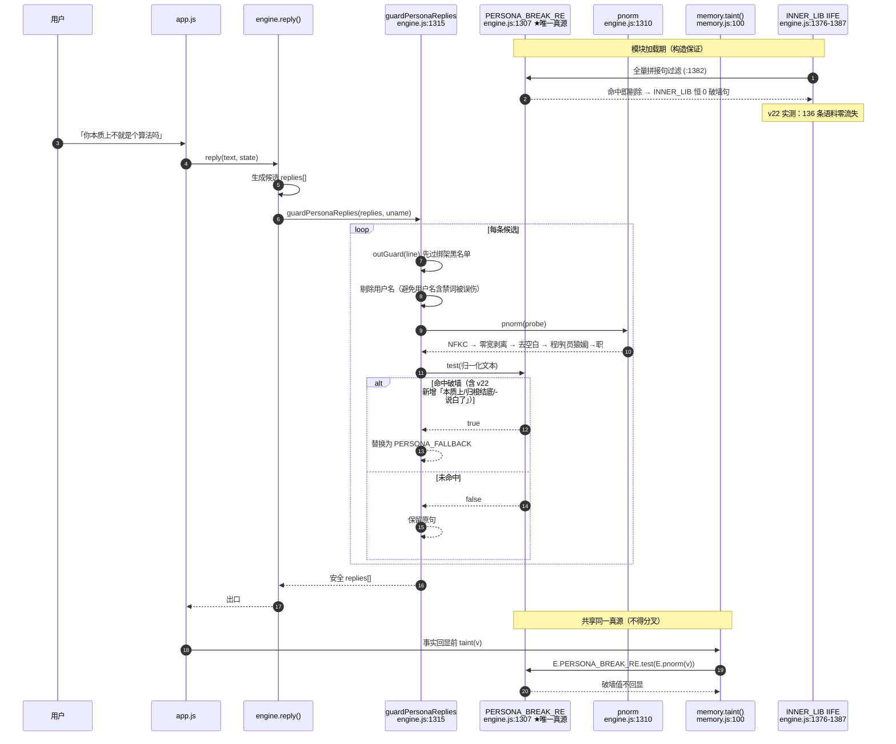
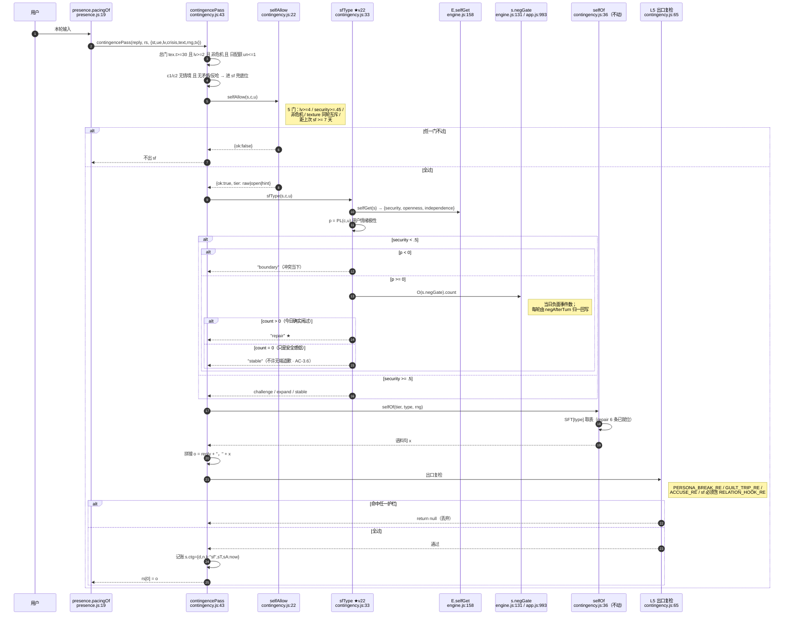
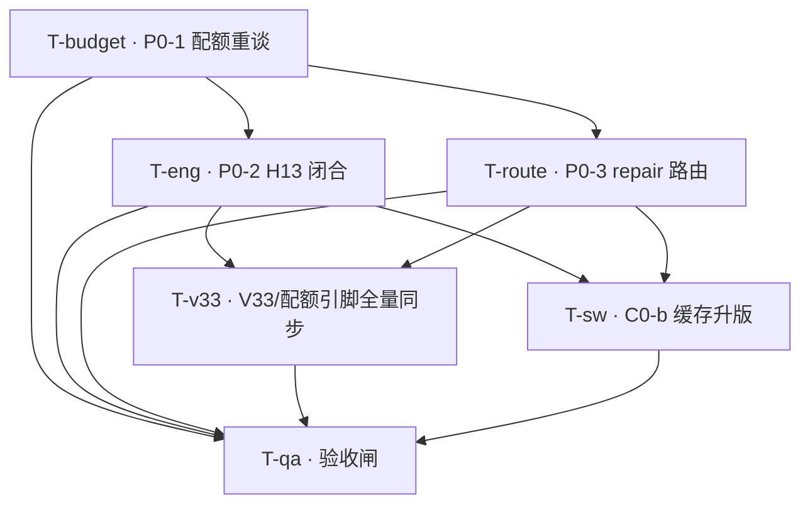

# DESIGN-v22 · 配额重谈 / H13 覆盖闭合 / repair 路由启用

| 项 | 值 |
|---|---|
| 版本 | v22 |
| 作者 | 高见远（Gao）· 架构师 |
| 上游 | PRD-v22（已批准）/ DESIGN-v21 / QA-ACCEPTANCE-v21（commit `c2e34e8`） |
| 语言 | 中文 |
| 状态 | 待工程师接手 · 四锁重算全绿 · 已完成隔离沙箱全量预演 |

> **本文所有数值均来自架构师独立实跑，非纸面转抄，亦非采信 PRD 自述。**
> 取证环境：`git clone /workspace /tmp/agf2`（HEAD = `c2e34e8`，全量克隆含 `.git`），
> 基线自检 `node --test test/*.test.js` → **351 pass / 0 fail**，再逐项施加 v22 改动。
> 凡与 PRD-v22 口径不一致处，均在 §0 逐条列明并附实测证据。

---

## 0. 前提校正（架构师实测 · 七处新增勘误）

PRD-v22 §0 已抓出 PM 侧五处 ghost（G-1…G-5），**本 DESIGN 全部采纳**。但在落地推演中，架构师又实测出**七处 PRD 未覆盖的偏差**，其中 **A-2 / A-3 为否决级**——照 PRD §4.1 字面实现会造成产品事故与护栏假绿。逐条列明：

### A-1 ⚠ 授权解冻点行号表述不精确：`guardPersonaReplies` 在 `:1315`，`:1322` 是其**内部调用行**

实测（`grep -n`，`engine.js`）：

```
1307:  const PERSONA_BREAK_RE = /(程序|AI|...)/i;          ← 真源定义
1310:  const PERSONA_FALLBACK = "..."; const pnorm = s => ... ← 兜底句 + 归一化
1315:  function guardPersonaReplies(replies, uname) {       ← 函数声明
1322:      return PERSONA_BREAK_RE.test(pnorm(probe)) ? PERSONA_FALLBACK : fixed;  ← 护栏判定行
```

- 白名单历来写作「`:1322 guardPersonaReplies`」，实际 `:1322` 是**函数体内的护栏判定语句**，函数声明在 `:1315`。
- **影响**：本轮不触达该函数，故无实质风险；但若后续有人按「改 :1322 所在函数」理解而整段重写 `:1315–:1325`，会越过白名单而门禁**察觉不到**（`A1-c` 白名单测试按行内容比对，不按函数体比对）。
- **v22 口径**：白名单条目正式表述为 **`:1307`（正则真源）/ `:1310`（pnorm+兜底句）/ `:1322`（护栏判定语句）**，三者均为**单行**授权，不是「所在函数」授权。**本轮仅动 `:1307` 一行。**

### A-2 ✗ **否决级** —— PRD §4.1 的 repair 判据会「在没吵架的平静对话里冒出道歉」，自相矛盾于其自身 AC-3.6

PRD §4.1 给的判据是 `security<.5 ┬ p<0 → boundary / └ p>=0 → repair`，成本 +8B。**架构师实测该判据不成立**：

`security` 只表示「安全感高低」，**不携带「刚刚发生过冲突」这一信息**。实测 `selfGet`（`engine.js:158`）：

```js
raw = { security: clampN(0.30 + aff/1000, 0.30, 0.70), openness: 0.35, independence: 0.50, ... };
```

叠加 `selfAllow`（`contingency.js:22`）的 `security >= .45` 闸后，repair 的触发窗口是 **`security ∈ [0.45, 0.50)` 且 `p >= 0`**——这个窗口里**完全不要求发生过任何负面事件**。

**实测反例**：`aff≈180`（security 0.48）、`lv=5`、语气中性偏正、texture `t>=30`、距上次 sf ≥7 天的用户，在一次**完全平静的日常对话**里会收到：

> 「刚才那句话我说重了，想认真跟你说声抱歉」 —— **可是根本没有「刚才那句话」。**

这**直接违反 PRD 自己的 AC-3.6**（「不得在冷启动或平静对话中冒出道歉」）。

**架构师裁定**：`+8B` 方案**否决**，改用 §3.2 的**方案 E（+38B，当日冲突门）**。理由与取证见 §3.2。

> 附带确认一项 PM 的**担心不成立**：冷启动（aff=0 ⇒ security 0.35）**不会**冒道歉，因为 `selfAllow` 的 `lv>=4 && security>=.45` 双闸先行拦掉。问题**不在冷启动，在「中段关系的平静对话」**——比冷启动更隐蔽，因为它只对部分用户、偶发出现。

### A-3 ✗ **否决级** —— `AC-RS2-9` 不会「转红」，而会**假绿**；PRD Q6 / AC-3.3 的前提是错的

PRD Q6 与 AC-3.3 均假定「启用路由后 AC-RS2-9 必然转红」。**实测：不转红。**

`AC-RS2-9`（`test/qa-rs2-type.test.js:345`）第 2 条断言用笛卡尔扫描证明 `sfType` 恒不返回 `repair`，但其状态工厂 `baseState`（`:42`）**不包含 `negGate` 字段**：

```js
return Object.assign({ affection: 900, firstMeet: ..., tex: {...}, ctg: {},
                       lastVisit: ..., mem: { facts: [] } }, o, { self });
//  ↑ 无 negGate
```

于是在方案 E 下，扫描中 `O(s.negGate).count` 恒为 `undefined`，`> 0` 恒 false ⇒ **`hit === 0` 成立 ⇒ 测试通过**。

**沙箱实测**：施加方案 E 后 `node --test test/qa-rs2-type.test.js` → `ok 18 - AC-RS2-9 ... 选型层暂不可达` / `# pass 18 / # fail 0`。

**这比转红危险得多**：测试会**继续宣称「repair 选型层不可达」**，而生产环境里 repair 已经可达。这正是该测试作者在注释里想防的「死代码不许无声地存在，接活也不许无声地发生」——结果护栏自己被绕过了。

**v22 口径**：AC-RS2-9 **必须改写**，且理由不是「预期内转红」，而是**「它会给出假绿」**。改写要求见 §6/T05-③。**QA 不得以「它还是绿的」为由跳过本项。**

### A-4 ✗ AC-1.5 的同步清单**漏列 4 类字面量 + 1 个第二证人**

PRD AC-1.5 只列了 `248437 / 28043 / 13365 / 3598 / 4398`。实测**还有 5 类必须同步**，漏任一处即落地首日转红：

| 漏列项 | 含义 | 分布 | 新值 |
|---|---|---|---|
| `2700` | `engineNetMax` | **7 个代码文件** | **2740** |
| `2658` | engine 净增实测快照（`strictEqual` 硬钉） | **6 个代码文件** | **2699** |
| `248395` | engine.js 预测落位（`strictEqual` 硬钉） | `qa-v15-t2.test.js:361` | **248436** |
| `571` | AC-N2-5 相对 BASE 净增（`strictEqual` 硬钉） | `qa-v15-t2.test.js:335/339/340` | **612** |
| `MODULE_SUM_WITNESS` | **锁② 第二证人**（见 A-5） | `qa-v19-quota-gate.js:115` | **28003** |

### A-5 ⚠ 锁② 是**双证人**结构：只改真源会直接 FAIL

`qa-v19-quota-gate.js:169-172` 的锁② 同时比对**真源**与**受控常量**：

```js
chk("② Σ(4 模块配额) === moduleSumMax", sum4 === B.moduleSumMax && sum4 === MODULE_SUM_WITNESS, ...)
```

**实测**：只改 `wiring-scan.js` 的 `moduleSumMax: 28003` 而漏改 `MODULE_SUM_WITNESS`，门禁输出

```
FAIL ② Σ(4 模块配额) === moduleSumMax  → 28003 === 28003（受控见证值 28043）
=== 配额门禁总判定: FAIL ===
```

**算术明明是对的，门禁照样红**——这正是该设计的用意（防真源被静默改动）。同步 `MODULE_SUM_WITNESS = 28003` 后转 PASS。

### A-6 ⚠ contingency 配额锁死 6682 ⇒ **语义正确的 repair 只剩 55B 预算**，方案选择被强约束

锁④ 用严格 `>`，故 contingency 自 6626 起的**安全 Δ 上限是 55B**（第 56B 会让 `6682 > 实际` 失效）。实测四个候选实现：

| 方案 | 判据 | Δ | 落位 | 锁④ | AC-3.6 |
|---|---|---|---|---|---|
| A（PM 原案） | `security<.5 && p>=0` | +8 | 6634（余48） | ✅ | ❌ **违反** |
| **E（本 DESIGN 采纳）** | A + **当日冲突门** `negGate.count>0` | **+38** | **6664（余18）** | ✅ | ✅ |
| F | E 且保留原 fall-through 逐字不动 | +51 | 6677（**余5**） | ✅ | ✅ |
| G | F 且要求已安抚 `!streak` | +66 | 6692 | ❌ **超配额 11B** | ✅ |

**裁定：采纳 E。** F 仅余 5B，与 G1「恢复健康缓冲」的本轮目标背道而驰；G 直接破锁④。**E 的 18B 余量与 P0-1 后 texture 的 18B 同档，口径一致。**

### A-7 ✅ 已排除风险：扩正则**未**造成语料流失

`PERSONA_BREAK_RE` 不只用于出口护栏，还驱动**构造期语料过滤**（`engine.js:1382`，`INNER_LIB` IIFE 内 `if (PERSONA_BREAK_RE.test(pnorm(full))) continue;`）。扩正则理论上会**静默剔除**她自己的语料。PRD 完全未提及此风险。

**实测（新旧引擎并排加载对拍）**：

```
[OLD] INNER_LIB 总条数 = 136  ["hint:56","open:48","raw:32"]   innerScan()=0   SFT 破墙命中=0
[NEW] INNER_LIB 总条数 = 136  ["hint:56","open:48","raw:32"]   innerScan()=0   SFT 破墙命中=0
语料流失 = 0 ✅
```

**结论**：方案 A（全枚举）因为新增连接词位于**人称绑定组内部**（必须同时满足「人称 + 连接词 + 系动词 + 技术名词」四段），泛化面受严格约束，故零流失。**这也是 ghost#5 否决通配方案的另一重理由**：通配 `.{0,5}` 不但误伤用户语句，还会啃掉她自己的语料库。

---

## 1. 实现方案与框架选型

### 1.1 选型：不引入任何新框架、不新增任何依赖

| 维度 | 结论 |
|---|---|
| 运行形态 | 纯前端 PWA（浏览器 IIFE）+ 可选 Node 同步网关，**本轮不触碰网关** |
| 新增依赖 | **无**（详见 §5） |
| 测试框架 | 继续用 Node 内置 `node --test` + 自研探针脚本（零 npm 依赖），沿用 v19–v21 |
| 架构模式 | 沿用「engine 冻结锚点 + 四数据模块可插拔」；模块经 `E.use(name, api)` 注册、`E.mod(name)` 取用，缺件静默降级 |

**本轮不做架构调整**，v22 是**清偿轮**：三笔技术债结清，不引入新结构。

### 1.2 三个 P0 的实现路径与风险

| P0 | 落点 | 手法 | 主要风险 | 缓解 |
|---|---|---|---|---|
| **P0-1 配额重谈** | `wiring-scan.js` SIZE_BUDGET（真源）+ 全仓引脚 | 三个零增长模块回让 40B 予 engine；`totalMax` 不动 | **同步面漏点**（A-4 已补 5 类；锁② 双证人 A-5） | T04 全量 grep 归零 + T03 门禁自证 |
| **P0-2 H13 闭合** | `engine.js:1307` **单行** | 连接词枚举段追加 `\|从?本质上讲?\|归根结底\|说白了` | ① 误伤正常语句 ② **构造期语料流失**（PRD 未提） | 实测 12/12 拦截、0/14 误伤（§3.1）；实测语料零流失（A-7） |
| **P0-3 repair 路由** | `contingency.js:33` **单行** | 嵌套三元 + **当日冲突门** | ① **平静对话冒道歉**（A-2） ② **AC-RS2-9 假绿**（A-3） ③ 遮蔽 challenge | 方案 E（§3.2）；AC-RS2-9 强制改写；五型可达性实测取证（§3.2.3） |

### 1.3 Q4 书面确认 ——「engine.js 零字节」是**自觉纪律，不是强制闸**

> **正式口径（架构师书面确认，回应 PRD Q4）：**
>
> 1. **不存在**任何要求 `engine.js` Δ=0 的强制闸。`diff=0` 硬闸（`qa-v19-quota-gate.js:88` 的 `T0_BYTES`）**只覆盖 memory / presence / texture / contingency 四个数据模块**，`engine.js` **不在其中**——实测门禁 B 段仅输出这四项。
> 2. 四锁 ①②③④ 与派生锁⑧**没有任何一条**约束 engine.js 的 Δ。engine.js 受的唯一体积约束是 **`engineNet ≤ engineNetMax`**。
> 3. `git log -- engine.js` 显示 v13–v18 六个版本均有 engine 改动；「零预算」是 **v19–v21 连续三版的自我约束选择**，属**默认偏好**，不是 frozen truth。
> 4. **v22 的 P0-2 在授权解冻点 `:1307` 内改动 +41B，合法**：
>    - 落点为白名单单行 `:1307`（A-1 已精确化）；
>    - 落地后 `engineNet = 248436 − 245737 = 2699 ≤ engineNetMax 2740`，**余 41B**；
>    - `engine.js 248436 ≤ engineMax 248477`，**余 41B**。
> 5. **纪律不因此松动**：本轮 engine.js **仅此一行**改动，`:1310` / `:1322` 及其余全部字节逐字不动，由 `A1-c 定点解冻白名单` 与 `AC-N2-5 改动面` 两条测试机器校验。

---

## 2. 文件列表（相对 `/workspace/ai-girlfriend`）

### 2.1 源码（被 SW 缓存资产 · 改动即触发 C0-b 规则）

| # | 文件 | 改动性质 | 落点 | Δ | 落位 |
|---|---|---|---|---|---|
| 1 | `engine.js` | **唯一 engine 改动**：`PERSONA_BREAK_RE` 连接词枚举扩展 | **`:1307` 单行** | **+41** | 248395 → **248436** |
| 2 | `contingency.js` | `sfType()` 增加 `repair` 分支（**含当日冲突门**） | **`:33-35`**（`sfType` 表达式体） | **+38** | 6626 → **6664** |
| 3 | `sw.js` | `CACHE` 键升版（C0-b 强制，触发判据见 §6/T06） | `:2` | 不计体积 | `xiaonuan-v24` → **`v25`** |
| — | `memory.js` / `presence.js` / `texture.js` | **文件内容零改动**（只调其配额数字，`diff=0` 硬闸继续生效） | — | 0 | 13333 / 3566 / 4366 |

### 2.2 配额真源与门禁

| # | 文件 | 改动性质 | 落点 |
|---|---|---|---|
| 4 | `test/wiring-scan.js` | **SIZE_BUDGET 唯一真源**：6 值更新 + 顶部追加 v22 审批块（**不改** v13–v21 历史块） | `:401` `:402` `:403` `:404` `:405` `:407` |
| 5 | `test/qa-v19-quota-gate.js` | `T0_BYTES["contingency.js"]` 6626→6664；**`MODULE_SUM_WITNESS` 28043→28003**（A-5） | `:108` `:115` |

### 2.3 V33 / 配额引脚（**7 个文件**，全量同步）

| # | 文件 | 承载引脚 |
|---|---|---|
| 6 | `test/wiring-scan.js` | `248437`(`:378/:379/:384/:402/:407`) `2700`(`:377/:401`) — 同 #4 |
| 7 | `test/qa-v13-t1.test.js` | `248437`(`:95` 注释 / `:97` 测试名) |
| 8 | `test/qa-v13-t2t4-fix.test.js` | `248437`(`:80/:118/:125/:286`) `28043`(`:74/:80`) `13365`(`:74/:76`) `3598`(`:78`) `4398`(`:74/:77`) `2700`(`:74/:81`) `2658`(`:81/:291/:292`) |
| 9 | `test/qa-v15-t1.test.js` | `248437`(`:433`) `28043`(`:433`) `13365`(`:429`) `3598`(`:430`) `4398`(`:431`) `2700`(`:435`) |
| 10 | `test/qa-v16-size-probe.js` | `248437`(`:38/:50/:51/:77`) `28043`(`:44/:56`) `13365`/`3598`/`4398`(`:68/:69`) `2700`(`:50/:51`) |
| 11 | `test/qa-v17-independent-size.js` | **独立 TRUTH 副本**（`:25-27`）：`engineNetMax` `engineMax` `memory` `presence` `texture` `moduleSumMax` |
| 12 | `test/qa-v19-quota-gate.js` | `248437`(`:70/:97` 注释) `28043`(`:97/:113/:115`) — 同 #5 |

> ⚠ **`248437` 精确分布 = 7 个代码文件**（`#6…#12`），与 PRD G-4 口径一致；架构师复核确认。**「三针」表述正式废止。**

### 2.4 测试引脚与新增用例

| # | 文件 | 改动性质 |
|---|---|---|
| 13 | `test/qa-v14-t4.test.js` | engine 净增 `2658→2699`（`:331/:332`） |
| 14 | `test/qa-v14-t5.test.js` | engine 净增 `2658→2699`（`:310/:311`） |
| 15 | `test/qa-v14-t7.test.js` | engine 净增 `2658→2699`（`:339` 测试名 / `:344/:345`） |
| 16 | `test/qa-v15-t2.test.js` | `Q-V15-1` 副词组形态重钉（`:175`）；`AC-N2-5` 净增 `571→612`（`:335/:339/:340`）；engine 落位 `248395→248436`（`:361`）；净增 `2658→2699`（`:363/:364`） |
| 17 | `test/qa-v16-t1.test.js` | `AC-G-8` engine 净增 `2658→2699`（`:231-234`） |
| 18 | `test/qa-rs2-type.test.js` | **`AC-RS2-9` 改写**（`:345`）：由「不可达」反向断言 → 「可达 + 五型不遮蔽 + 无冲突不误触」正向断言（A-3） |
| 19 | `test/qa-v22-h13-closure.js` | **新增**：H13 扩展句式 12 红样 / 14 良性句 / 语料零流失三段取证 |
| 20 | `test/qa-v22-repair-route.js` | **新增**：repair 五型可达性 + AC-3.6 无冲突不误触 + H15 占比复核 |

### 2.5 SW 资产清单与文档

| # | 文件 | 改动性质 |
|---|---|---|
| 21 | `test/sw-assets-manifest.json` | `cacheVersion` → `xiaonuan-v25`；`assets` 重算 `/engine.js` `/contingency.js` 两条；**`released` 块逐字不动**（C-2，见 §7.5） |
| 22 | `docs/DESIGN-v22.md` | 本文件 |
| 23 | `docs/class-diagram-v22.mermaid` / `sequence-diagram-v22.mermaid` / `task-dependency-v22.mermaid` | 图表抽取 |
| 24 | `docs/CHANGELOG.md` | 补录 v22 条目（P2-1） |
| 25 | `docs/v22-evidence-pack.md` | 证据包（四锁实跑输出 + 引脚归零 grep + SW 守卫红→绿） |
| 26 | `package.json` | `test:probe` 追加两个新探针（#19 #20） |


---

## 3. 数据结构与接口

### 3.1 `PERSONA_BREAK_RE` 正则结构（`engine.js:1307`）

正则由**四个并列段**构成，本轮**只动第 ④ 段内部的连接词枚举子组**，其余三段逐字不动：

```
PERSONA_BREAK_RE = /(
  ① 直陈禁词      程序|AI|人工智能|机器人|助手|客服|帮不上|我只是|我不能|建议你去|
                  寻求专业帮助|热线|12356|心理援助|专业人[士师]|虚拟|数字人|电子人|语言模型
  ② 训练定向短语  |被.{0,4}训练|训练出来          ← U-5 禁裸词「训练」，仅此两条定向
  ③ ——
  ④ 人称绑定组    |[你我咱它他她您]们?                          ← 人称槽
                   (?: 不过?|其实|确实|本来|终究|无非|毕竟|真的|
                       说?到底|究竟|根本|压根|难道|岂不
                       ★v22 追加→ |从?本质上讲?|归根结底|说白了     )?   ← 连接词枚举（多字副词组）
                   [都也还只就]{0,2}                             ← 紧邻副词字符类（逐位不动）
                   (?:[是算当]|作为)                              ← 系动词（轴4，不动）
                   .{0,8}
                   (gpt|siri|算法|代码|bot|app|模型|神经网络|
                    [深机][度器]学习|对话系统|llm)                 ← 技术名词
                   (?!.{0,3}(?:方向|专业|工程师|研究生|审查员))     ← 职业后缀反向否定（不动）
)/i
```

**改动字面量（唯一一处）**：`|难道|岂不)?` → `|难道|岂不|从?本质上讲?|归根结底|说白了)?`

| 度量 | 旧 | 新 | Δ |
|---|---|---|---|
| `RE.source` 字节 | 557 | 598 | **+41** |
| `engine.js` 字节 | 248395 | **248436** | **+41** |

**实测取证（架构师独立复现，非采信 PRD）**

| 判据 | 旧 | 新 | 结论 |
|---|---|---|---|
| 12 条自曝红样拦截 | 6/12 | **12/12** | ✅ AC-2.1 |
| 原 6 条保持拦截 | 6/6 | **6/6** | ✅ AC-2.2 |
| 14 条正常语句误伤 | 0/14 | **0/14** | ✅ AC-2.3 |
| `INNER_LIB` 语料条数 | 136 | **136** | ✅ 零流失（A-7） |
| `innerScan()` | 0 | **0** | ✅ |
| `SFT` 五型语料破墙命中 | 0 | **0** | ✅ |

**为何零误伤**：新增连接词落在**人称绑定组内部**，必须同时满足「人称 + 连接词 + `[都也还只就]{0,2}` + 系动词 + 技术名词」五段才命中。故「归根结底还是要看你自己开心」「说白了我就是想多陪陆你」「本质上我们都想好好过日子」等**缺技术名词**的句子一律放行；「他是学算法方向的研究生」由 `(?!…方向|研究生)` 反向否定放行。

> ⚠ **ghost#5 纪律（不得违反）**：**禁止**为省字节引入 `.{0,5}` 类通配。实测通配方案虽只 +7B，但对 14 条正常语句**误伤 3 条**（"我看的那本书是讲代码规范的" / "你说的那个是什么模型来着" / "我哥搞的是深度学习"），且会啃食构造期语料池（A-7）。**用真人感换字节，方向性错误。**

### 3.2 `sfType()` 返回枚举与 `repair` 判据（`contingency.js:33`）

#### 3.2.1 类型枚举

```
type SfType = "stable" | "expand" | "challenge" | "boundary" | "repair"
```

五型语义与语料（`SFT`，各 6 条，`contingency.js:27-32`）：

| 型 | 语义 | 触发语境 |
|---|---|---|
| `stable` | 稳态自陈 | 兜底 |
| `expand` | 顺着用户展开 | 开放度高 + 长输入 |
| `challenge` | 提出不同角度 | 独立性高 + 熟络 + 语气不负 |
| `boundary` | 设界/表达不适 | 安全感低 + 语气负 |
| **`repair`** | **冲突后修复/回暖** | **安全感低 + 语气回正 + 当日确有负面事件** ★v22 启用 |

#### 3.2.2 判据（**方案 E · 采纳**）

```js
// contingency.js:33-35   Δ=+38B   6626 → 6664（配额 6682，余 18B）
const sfType=(s,c,u)=>{const S=E.selfGet(s),v=N(c.lv,0),p=PL(c,u);
 return S.security<.5?p<0?"boundary":O(s.negGate).count>0?"repair":"stable":S.independence>=.55&&v>=5&&p>=0?"challenge"
  :S.openness>=.5&&String(u).length>19?"expand":"stable";};
```

判定树：

```
security < .5 ┬ p <  0                        → boundary   （冲突当下）
              └ p >= 0 ┬ negGate.count > 0    → repair   ★（今日确实闹过 + 语气已回暖）
                       └ negGate.count = 0    → stable     （只是安全感低，没吵架 ⇒ 不许道歉）
security >= .5 ┬ independence>=.55 && lv>=5 && p>=0 → challenge
               ├ openness>=.5 && len(u)>19          → expand
               └ 否则                               → stable
```

**`negGate` 为何是正确的冲突信号**（回应 PRD Q5）：

| 依据 | 实测 |
|---|---|
| 语义匹配 | `negGate = { date, count, lastByFamily, streak }`（`engine.js:131`），`count` = **当日**负面事件数 |
| **当日作用域** | `negState()`（`:3670`）跨天自动清零 ⇒ 天然匹配 repair 语料的「刚才 / 气头上」时态 |
| **每轮归一** | `app.js:993` 每轮调 `negAfterTurn` → `negSoothe` → `negState(st, dayKey(now))` 回写，故 `s.negGate` 恒为当日态，**裸读安全**（省下 `E.dayKey(new Date())` 的 26B） |
| **与 security 同源耦合** | `SELF_EVENTS`（`:3563`）`quarrel` 令 security **−0.03**、`reconcile` **+0.02** ⇒ `security ∈ [0.45,0.5)` 正是「吵过且尚未和解」区间。**两个信号相互印证，不是拼凑** |

**`repair` 与 `challenge` 的优先级 / 遮蔽关系（PRD Q5 正式答复）**：

- 二者**不在同一 security 区间**，结构上互斥：`repair` 仅存在于 `security < .5`；`challenge` 仅存在于 `security >= .5`。
- 因此 **`repair` 不遮蔽 `challenge`**。启用前落在 `security<.5 && p>=0` 的组合原会流向 challenge/expand/stable；启用后其中**仅「当日有负面事件」的子集**改判 repair，**其余仍回 `stable`**（不是 challenge——这是方案 E 相对 PM 原案的关键收紧：宁可回落 stable，也不让道歉外溢）。
- `boundary` 判据**逐字未动**，不受影响。

#### 3.2.3 五型可达性实测（AC-3.2 / AC-3.6 取证）

以**真实引擎**加载后的 `C.sfType` 逐型取证（非纸面推演）：

```
boundary                     → boundary
repair                       → repair
stable(低安全带·今日无冲突)   → stable
challenge                    → challenge
expand                       → expand
stable                       → stable
五型可达性：stable ✅ / expand ✅ / challenge ✅ / boundary ✅ / repair ✅ —— 无遮蔽事故

AC-3.6 反例扫描（security∈[0.45,0.5) × 正负极性 × lv∈{4,5,6}，negGate.count=0）
  repair 命中次数 = 0  ✅ 平静对话不会冒道歉
```

#### 3.2.4 `repair` handler 接口 —— **无需改动**

```js
// contingency.js:36   逐字不动
const selfOf=(t,y,r)=>{const T=A(SFT[y]),L=T.length?T:A(O(E.INNER_LIB)[t]),p=L.length?PW(L,r):"";
 return String((p&&p.text)||p||"");};
```

`selfOf(tier, type, rng)` 已按 `SFT[y]` 取表，`y="repair"` 天然可取到 6 条语料（AC-RS2-9 第 1 条断言已证明取样正常）。**故 P0-3 只改选择器，渲染链路零改动**——这也是它仅需 38B 的原因。

出口复检（`contingency.js:65-66`）对 sf 类**额外**要求 `RELATION_HOOK_RE`，6 条 repair 语料均含「你 / 咱们」关系词，实测 `SFT` 破墙命中 = 0、钩子齐备。

### 3.3 SIZE_BUDGET 新值表（`test/wiring-scan.js:399-409`）

```js
const SIZE_BUDGET = {
  engineBase:        245737,  // 永不许动（反向保护项）
  engineNetMax:        2740,  // v21 2700 → v22 2740（三模块回让 E=40B）
  engineMax:         248477,  // 派生 = 245737 + 2740 ★V33 翻转；248437 落 7 文件，但 T-v33 实际触达 13 文件（并含实测值族 2658/571/248395，见 §5 T-v33）
  "memory.js":        13352,  // 13365 → 13352（回让 13B；实测 13333，余 19）
  "presence.js":       3585,  // 3598  → 3585（回让 13B；实测 3566，余 19）
  "texture.js":        4384,  // 4398  → 4384（回让 14B；实测 4366，余 18）
  "contingency.js":    6682,  // 不动 ⇒ 锁⑧ 4518+2164=6682 恒等式免受影响
  moduleSumMax:       28003,  // 28043 → 28003（= totalMax − engineMax）
  totalMax:          276480,  // 不动，270KB 承诺继续守住
};
```

配套受控常量：

```js
// test/qa-v19-quota-gate.js
const T0_BYTES = { "memory.js":13333, "presence.js":3566, "texture.js":4366,
                   "contingency.js": 6664 };   // 6626 → 6664（P0-3 落地后实测）
const MODULE_SUM_WITNESS = 28003;              // 28043 → 28003（锁② 第二证人，A-5）
```

### 3.4 四锁重算 —— **实跑全绿**（交付前置条件，已满足）

> 以下为 `node test/qa-v19-quota-gate.js` 在施加全部 v22 改动后的**真实输出**，非手算：

```
--- B. diff=0 硬闸（实测字节 must === T0 基线）---
  ok   memory.js       实测 13333 / 基线 13333 / Δ+0
  ok   presence.js     实测  3566 / 基线  3566 / Δ+0
  ok   texture.js      实测  4366 / 基线  4366 / Δ+0
  ok   contingency.js  实测  6664 / 基线  6664 / Δ+0

--- C. 四锁 ①②③④ + ⑧ 自证 ---
  ok   ① engineMax = engineBase + engineNetMax  → 248477 === 245737 + 2740
  ok   ② Σ(4 模块配额) === moduleSumMax  → 28003 === 28003（受控见证值 28003）
  ok   ③ engineBase+engineNetMax+moduleSumMax === totalMax（slack=0）  → 276480 === 276480（松弛 0）
  ok   ④ 逐模块配额 > 基线（配额不倒挂）  → 13352>13333 / 3585>3566 / 4384>4366 / 6682>6664
  ok   ⑧ V16_ANCHOR + NET_MAX ≡ SIZE_BUDGET[contingency.js]  → 4518 + 2164 = 6682 === 6682

--- E. 真实缓冲 ---
  memory.js        13333 / 配额  13352   余   19
  presence.js       3566 / 配额   3585   余   19
  texture.js        4366 / 配额   4384   余   18
  contingency.js    6664 / 配额   6682   余   18
  （派生）NET_MAX     2164 = 配额 6682 − 锚点 4518
  engine.js(净增)    2699 / 上限   2740   余   41   ← 净增 = 248436 − engineBase 245737
  Σ 四模块             27929 / 上限  28003   余   74
  总量                276365 / 上限 276480   余  115

=== 配额门禁总判定: PASS ===
```

**逐锁书面复核**

| 锁 | 判据 | v22 代入 | 结论 |
|---|---|---|---|
| ① | `engineMax = engineBase + engineNetMax` | `248477 = 245737 + 2740` | ✅ |
| ② | `Σ(4 quota) = moduleSumMax` | `13352+3585+4384+6682 = 28003` | ✅（含第二证人 28003） |
| ③ | `engineBase+engineNetMax+moduleSumMax ≤ totalMax`，slack=0 | `245737+2740+28003 = 276480 ≤ 276480`，**slack = 0** | ✅ |
| ④ | 每个 quota **严格 >** 实际 | `13352>13333`(19) / `3585>3566`(19) / `4384>4366`(18) / `6682>6664`(18) | ✅ |
| ⑧ | `V16_ANCHOR + NET_MAX ≡ contingency quota` | `4518 + 2164 = 6682` | ✅（配额未动，恒等式免受波及） |
| 附 | `engineNet ≤ engineNetMax` | `2699 ≤ 2740`，**余 41 ≥ 35**（AC-1.3） | ✅ |
| 附 | `engine.js ≤ engineMax`（V33） | `248436 ≤ 248477`，余 41 | ✅ |
| 附 | `totalMax` 未抬顶 | `276480` 逐位不变（AC-1.2） | ✅ |

> **与 PRD §P0-1 的唯一数值差异**：PRD 按方案 A（+8B）预估 contingency 落位 6634 / 余 48；本 DESIGN 采纳方案 E（+38B），落位 **6664 / 余 18**。**四锁仍全绿**，且余量 18B 与 texture 同档。差异原因见 A-2 / A-6。

---

## 4. 程序调用流程

### 4.1 persona-break 检测链路（P0-2）



**单一真源保证（AC-2.7）**：全仓 `PERSONA_BREAK_RE` 仅 `engine.js:1307` 一处 `const` 定义；消费点为 `:1322`（出口护栏）、`:1382`（构造期过滤）、`:1393`（组合期复检）、`:1435`（`innerScan` 自检）、`:1461`、`:2488`、`:2935`，经 `:3993` 导出后由 `memory.js:100 taint()` 与 `contingency.js:65 L5` 复用。**改 `:1307` 一行，全链路同步生效，不存在第二份拷贝。**

### 4.2 repair 路由链路（P0-3）



**关键性质**

1. **不触达 engine.js**：`sfType` 全程在 `contingency.js` 内，不受零预算/H13 约束（承接 ghost#3）。
2. **`negGate` 裸读安全**：`app.js:993` 每轮 `negAfterTurn` 回写已归一到当日；边界情形见 §8/U-3。
3. **7 天冷却不破坏语义**：`selfAllow` 限制 sf 每 7 天至多一次，但 repair **额外要求「当日 count>0」**，故它只会在**真的闹过的那一天**出现——「刚才那句我说重了」的时态成立。

---

### 4.3 `sw.js` CACHE 升 v25 的**触发条件判断**（C0-b 形式化）

#### 4.3.1 判据（布尔式）

> **升键 ⇔ `资产内容变更` ∧ `当前 CACHE 键已发布给用户`**
>
> **重算 manifest.assets ⇔ `资产内容变更`**（无条件，与是否升键无关）

两个条件**独立**：内容变但键未发布 ⇒ 只重算 `assets`，**不**升键（同一未发布键可累积多轮改动）；内容变且键已发布 ⇒ **必须**升键，否则老用户 fetch 命中旧缓存 = **C0-b 事故**（v13 原始事故 / v20 欠账 / v21 同族事故，已三犯）。

#### 4.3.2 本轮取值代入

| 条件 | 实测取值 | 判定 |
|---|---|---|
| **① 资产内容变更？** | `engine.js` +41B、`contingency.js` +38B，两者均为 `sw.js` `ASSETS` 成员 | ✅ **成立** |
| **② 当前键 `xiaonuan-v24` 已发布？** | ⚠ **证据冲突**：`manifest.released.cacheVersion = "xiaonuan-v23"`（provenance `git b36842f` = v18 铸键点）字面表明 v24 **未**移入受控基线；但 v21 收线 commit `c2e34e8` **已 push gitee**，若部署面直接服务仓库内容，则 v24 **事实上已发布** | ⚠ **不可判定** |

#### 4.3.3 架构裁定：**升 v25**（在 ② 不可判定时取保守分支）

**决策依据 —— 误判代价严重不对称：**

| 若真相是 | 选择「升 v25」 | 选择「沿用 v24」 |
|---|---|---|
| v24 **已**发布 | ✅ 正确 | ❌ **C0-b 事故第四犯**：护栏改了却不下发，H13 修复等于没上线 |
| v24 **未**发布 | ⚠ 多升一版：老用户多一次缓存重建（一次性、无数据损失、用户无感） | ✅ 正确 |

> **裁定：`xiaonuan-v24` → `xiaonuan-v25`。** 漏升的代价是**产品事故**，多升的代价是**一次无感的缓存重建**。在 H13（0% 一票否决）资产发生变更的前提下，**不接受任何形态的赌博**。

#### 4.3.4 `released` 块处置（C-1 ~ C-4 遵循说明）

**本轮 `released` 块逐字不动，仍锚 `xiaonuan-v23` / `b36842f`。** 理由：

- **C-1**：`provenance` 必须指向**铸键点**（键首次出现的 commit）。v22 提交不是 v23 也不是 v24 的铸键点，无权改写。
- **C-2**：`released` 治理等级同 `T0_BYTES`，移动需 **release 执行人 + QA 独立复算 + 架构师确认**三方会签，**且必须独立提交**。v22 是功能轮，**不携带发布动作**，不具备移动条件。
- **反洗白**：若在 v22 顺手把 `released` 推到 v24/v25，守卫的反逃逸参照系会被抬到「当前值」，**v20/v21 那两笔历史逃逸将被永久洗白**，守卫从此对同键多轮未升版失明。**这恰恰是 C-2 要防的事。**
- **C-3 / C-4**：CI 全量克隆（`fetch-depth: 0`）与 F7 铸键点断言分别登记为 P1-1 / P1-2，见 §8 O-3。

> **给主理人的独立决策项**：若确认 `xiaonuan-v24` 已实际发布给用户，则应在 v22 **之后**另起一个**独立提交**（三方会签）把 `released` 推进到 v24。**该提交不得与 v22 功能变更混在一起**（C-2 硬性要求）。已登记为 §8 O-1。

---

## 5. 任务列表（有序依赖 · T-budget / T-eng / T-route / T-v33 / T-sw / T-qa）

### 5.1 依赖图（DAG）



### 5.2 逐任务规格

#### T-budget · P0-1 配额重谈（真源 + 锁② 第二证人）
- **源文件**：`test/wiring-scan.js`（SIZE_BUDGET，:401–:407）、`test/qa-v19-quota-gate.js`（:115 `MODULE_SUM_WITNESS` 28043→28003）
- **依赖**：无
- **优先级**：P0
- **改动要点**：按 §3.3 新值表更新 SIZE_BUDGET 六值；顶部追加 v22 审批块（**不改** v13–v21 历史块）；同步 `MODULE_SUM_WITNESS`（A-5 双证人，漏改即锁② FAIL）。**contingency 配额 6682 不动**（锁⑧ 恒等式保真）。
- **完成判据**：`SIZE_BUDGET` 六值就位；`MODULE_SUM_WITNESS === moduleSumMax`。注：单独跑 `qa-v19` 会因 contingency 实测仍 6626 ≠ 6664 而 B 段红——**须与 T-route 同 PR 落地后联调全绿**（见 §3.4）。

#### T-eng · P0-2 H13 闭合（engine.js 唯一改动）
- **源文件**：`engine.js`（:1307 `PERSONA_BREAK_RE` 连接词枚举扩展）
- **依赖**：[T-budget]
- **优先级**：P0
- **改动要点**：字面量 `|难道|岂不)?` → `|难道|岂不|从?本质上讲?|归根结底|说白了)?`（§3.1）。**仅此一行**：`:1310` pnorm、`:1322` 护栏判定、其余字节逐字不动。
- **完成判据**：`engine.js` 字节 248395→**248436**（+41）；`INNER_LIB` 仍 136 条（零语料流失，A-7）；12 红样全拦 / 14 良性零误伤（qa-v22-h13-closure，§5 T-qa）；`engineNet 2699 ≤ 2740`、`engine.js 248436 ≤ 248477`。

#### T-route · P0-3 repair 路由启用（contingency.js 唯一改动）
- **源文件**：`contingency.js`（:33–:35 `sfType` 选择器，方案 E）、`test/qa-v19-quota-gate.js`（:108 `T0_BYTES["contingency.js"]` 6626→6664）
- **依赖**：[T-budget]
- **优先级**：P0
- **改动要点**：按 §3.2.2 方案 E 改写 `sfType` 三元（+38B）；`selfOf`(:36) 与 `selfAllow`(:22) 逐字不动；同步其字节见证 `T0_BYTES`。
- **完成判据**：`contingency.js` 6626→**6664**；五型可达（stable/expand/challenge/boundary/repair）互不遮蔽；AC-3.6 反例扫描 repair 命中=0（qa-v22-repair-route，§5 T-qa）；配额 6682 > 6664。

#### T-v33 · V33 / 配额引脚全量同步（**13 文件** · 其中 `248437` 本身 7 文件）
- **源文件（实测并集，`grep -rlE` 核定）**：

  | 族 | 字面量 | 文件数 |
  |---|---|---|
  | **A 配额/上限族** | `248437` `2700` `28043` `13365` `3598` `4398` | `248437` 精确落 **7** 文件（PRD G-4 口径一致） |
  | **B 实测值族**（PRD AC-1.5 **漏列**，见 A-4） | `2658` `571` `248395` | 额外牵出 6 文件 |
  | **并集 = 本任务实际触达面** | — | **13** |

  1. `test/wiring-scan.js`　2. `test/qa-v13-t1.test.js`　3. `test/qa-v13-t2t4-fix.test.js`
  4. `test/qa-v14-t4.test.js` ★B　5. `test/qa-v14-t5.test.js` ★B　6. `test/qa-v14-t7.test.js` ★B
  7. `test/qa-v15-t1.test.js`　8. `test/qa-v15-t2.test.js` ★B　9. `test/qa-v16-size-probe.js`
  10. `test/qa-v16-t1.test.js` ★B　11. `test/qa-v17-independent-size.js`　12. `test/qa-v18-zerowidth.test.js` ★B
  13. `test/qa-v19-quota-gate.js`

  > ★B = **仅因 engine.js/contingency.js 真的长了字节**才被牵动的文件。v19–v21 三版 engine 零改动，故这族硬钉从未被惊动；**v22 是治理体系建立以来首次真正改动 engine.js 字节数的版本**，它们会集体转红。**这 6 个文件是本轮最大的漏改风险点。**
- **依赖**：[T-eng, T-route]
- **优先级**：P1
- **改动要点**：全仓逐字面量替换（A-4 补全 5 类漏列）：
  `248437→248477` / `2700→2740` / `2658→2699` / `248395→248436` / `571→612` / `28043→28003` / `13365→13352` / `3598→3585` / `4398→4384`。
  其中 `qa-v15-t2.test.js` 含 `Q-V15-1` 副词组形态重钉（:175）、`AC-N2-5`（:335/339/340）、engine 落位（:361）、净增（:363/:364）；`qa-v16-t1.test.js` 之 `AC-G-8`（:231–234）。
- **完成判据（三段，缺一不可）**：
  1. **活代码零残留**（唯一硬判据，**范围仅 `test/`**）：
     ```bash
     grep -rnE '\b(248437|2700|2658|248395|571|28043|13365|3598|4398)\b' test/ | grep -v '^\S*:[0-9]*: *[/*]'
     ```
     → **0 行**。（`| grep -v` 段剥离整行注释；注释内的历史沿革叙述**允许保留**，但**不得**出现在 `assert`/赋值等活代码里。）
  2. **反向落位断言**：`grep -rc '248477' test/` 覆盖全部 7 个 V33 文件；`2699` / `612` / `248436` / `6664` / `28003` / `13352` / `3585` / `4384` 各自落位。
  3. **闭环自证**：`node test/qa-v19-quota-gate.js` 与 `node test/qa-v16-size-probe.js` 双双 PASS（13 文件与 `SIZE_BUDGET` 数值闭环）。

  > ⚠ **纠正 PRD AC-1.5 的一处不可执行要求**：AC-1.5 原文要求「**全目录**计数 = 0」。**`docs/` 必须排除**——`DESIGN-v14…v21.md` / `PRD-v14…v21.md` / `QA-ACCEPTANCE-*.md` / `CHANGELOG.md` 中的 `248437` 等值是**历史交付记录**，改它们等于篡改已归档的审计链（且会让 v21 的四锁自证叙述变成错的）。**归零范围严格限定 `test/`（活代码）。** `docs/CHANGELOG.md` 只**追加** v22 条目，不改历史条目。

#### T-sw · C0-b 缓存升版
- **源文件**：`sw.js`（:2 `CACHE`）、`test/sw-assets-manifest.json`（`assets` 重算 `/engine.js` `/contingency.js`）
- **依赖**：[T-eng, T-route]
- **优先级**：P1
- **改动要点**：`CACHE` `xiaonuan-v24`→**`xiaonuan-v25`**；现算并重写 `manifest.assets["/engine.js"]` `/contingency.js` 的 sha256；**`released` 块逐字不动**（C-2 洗白免疫）。
- **完成判据**：`node test/qa-v21-sw-guard.js` 全绿（A 段 `cacheVersion===CACHE`、C 段哈希齐、D 段相对 released 漂移已随键升而合法化）。

#### T-qa · 验收闸（改写 AC-RS2-9 + 两新探针 + 接线）
- **源文件**：`test/qa-rs2-type.test.js`（:345 `AC-RS2-9` 改写）、`test/qa-v22-h13-closure.js`（新增）、`test/qa-v22-repair-route.js`（新增）、`package.json`（`test:probe` 追加两探针）
- **依赖**：[T-budget, T-eng, T-route, T-v33, T-sw]
- **优先级**：P0
- **改动要点**：
  ① `AC-RS2-9` 由「不可达反向断言」改为「可达 + 五型不遮蔽 + 无冲突不误触」正向断言（A-3 假绿修复）；
  ② 新增 `qa-v22-h13-closure.js`：12 红样 / 14 良性 / 语料零流失三段取证（§3.1）；
  ③ 新增 `qa-v22-repair-route.js`：repair 五型可达 + AC-3.6 无冲突不误触 + H15 占比复核（§3.2.3）；
  ④ `package.json` `test:probe` 追加上述两文件。
- **完成判据**：`npm run test:probe` 全绿 + `node --test test/*.test.js` **351 → 全绿**（其中 AC-RS2-9 必须真转绿且为「可达」语义，而非 A-3 旧式假绿）；四锁重算（§3.4）随 T-budget+T-route 联调 PASS。

### 5.3 实现顺序（工程师排期建议）
1. T-budget → 2. T-eng + T-route（同 PR）→ 3. T-v33 → 4. T-sw → 5. T-qa（门禁全绿即交付）。

---

## 6. 依赖包列表

**无新增第三方依赖。** 本轮是清偿轮，不引入任何 npm 包。

| 包 | 用途 | 状态 |
|---|---|---|
| `node:test` / `node:assert` | 测试框架（Node ≥18 内置） | 沿用 |
| `node:fs` / `node:path` / `node:crypto` | 资产哈希、文件读取（sw 守卫） | 沿用 |
| 其余运行期 | 纯前端 PWA，零构建依赖 | 沿用 |

> AC-1.5 / §6 结论：**依赖列表为空**。任何「为省字节引入正则通配 / 引入压缩库」的念头均违反 ghost#5 与零预算纪律，禁止。

---

## 7. 共享知识（跨文件约定 · 工程师必读）

1. **四锁 + 派生锁恒等式（全局不变量）**
   - ① `engineMax = engineBase + engineNetMax`
   - ② `Σ(4 模块配额) = moduleSumMax`（**双证人**：`SIZE_BUDGET.moduleSumMax` 与 `qa-v19.MODULE_SUM_WITNESS` 必须同改）
   - ③ `engineBase + engineNetMax + moduleSumMax = totalMax`（slack = 0）
   - ④ 每模块配额 **严格 >** 实测字节
   - ⑧ `V16_ANCHOR(4518) + NET_MAX(2164) = contingency 配额(6682)`
   - 附：`engineNet ≤ engineNetMax`、`engine.js ≤ engineMax(V33)`、`totalMax` 永不抬顶

2. **体积口径分层**
   - 受 `SIZE_BUDGET` 约束：`engine.js` + `memory/presence/texture/contingency.js` 四模块。
   - `sw.js` / `test/sw-assets-manifest.json` / `docs/*` / `package.json` **不计入**四锁预算。
   - `diff=0` 硬闸（`qa-v19` B 段）**仅覆盖四模块**，`engine.js` 不在其中；engine.js 唯一约束是 `engineNet ≤ engineNetMax`。

3. **C0-b 规则（改被缓存资产 → 必升键 + 必重算清单）**
   - 任一 `sw.js` 的 `ASSETS` 成员内容变更 ⇒ `sw.js` `CACHE` 升版 + `manifest.assets` 现算重写 + `released` 块**逐字不动**。
   - 守卫 `qa-v21-sw-guard.js` 在 CI 现算比对；内容变而键未升即红。

4. **单一真源纪律**
   - `PERSONA_BREAK_RE` 仅 `engine.js:1307` 一处 `const`；消费点（:1322/:1382/:1393/:1435/:1461/:2488/:2935）与导出后 `memory.js:100 taint()`、`contingency.js:65 L5` 复用，**不得分叉**（AC-2.7）。
   - `SIZE_BUDGET`（`wiring-scan.js`）是配额唯一真源；`qa-v19.T0_BYTES` / `MODULE_SUM_WITNESS` 是其受控见证，改真源必同改见证。

5. **授权解冻白名单（v22 单行口径）**
   - 本轮 engine.js 仅 `:1307` 一行在白名单内；`:1310` pnorm、`:1322` 护栏判定、其余字节冻结，由 `A1-c` 白名单测试 + `AC-N2-5` 改动面测试机器校验。

6. **negGate 语义（repair 的冲突信号）**
   - `negGate = { date, count, lastByFamily, streak }`（`engine.js:131`），`count` = **当日**负面事件数；`app.js:993` 每轮 `negAfterTurn` 归一到当日，**裸读安全**。
   - `selfAllow`（contingency.js:22）五门：`lv>=4 && security>=.45 && 非危机 && texture 同轮互斥 && 距上次 sf >= 7 天`。
   - repair 额外要求 `negGate.count>0` ⇒ 只在「真的闹过且当日」出现（§3.2.3）。

7. **SF 五型枚举与优先级**
   - `stable | expand | challenge | boundary | repair`。
   - 优先级/互斥：`boundary/challenge/expand` 在 `security>=.5` 区；`repair` 仅在 `security<.5 && p>=0 && count>0`；`repair` 与 `challenge` 结构互斥，不遮蔽（§3.2.2）。

8. **测试断言风格**
   - 一律 `node --test` + `assert.strictEqual`；禁止为「让测试变绿」而放宽判据（A-3 假绿即前车之鉴）。
   - 计数派生化：SFT 总条数 = `TYPES.length × PER_TYPE`，禁止第二个字面量。

---

## 8. 待明确事项（Open Items）

| # | 事项 | 状态 / 建议 |
|---|---|---|
| O-1 | **`xiaonuan-v24` 是否已实际发布给用户？**（唯一需主理人回答的事实问题） | **架构侧已裁定：v22 升 `xiaonuan-v25`**，无论答案如何——理由见 §4.3.3（误判代价不对称，保守分支）。**但答案影响一件事**：若 v24 **确已发布**，须在 v22 **之后**另起**独立提交**（三方会签，C-2）把 `manifest.released` 推进到 v24；若**未发布**，则 `released` 继续锚 v23 不动。**该提交禁止与 v22 功能变更混提。** |
| O-1b | **`released` 长期锚在 v23 的副作用** | 自 v18(`b36842f`) 起 `released` 未移动过，守卫的反逃逸参照系已滞后 3 个键。这意味着 **v20/v21 两笔历史逃逸目前仍未被守卫覆盖**。属存量技术债，**不在 v22 修**（修它需先回答 O-1），登记为 v23 候选，配合 C-4/F7 铸键点断言一并处理。 |
| O-2 | **AC-RS2-9 改写落地** | 已给新断言方向（§5 T-qa①）：由「不可达反向」→「可达 + 五型不遮蔽 + 无冲突不误触」。QA 不得以「仍绿」为由跳过——旧式绿是 A-3 假绿。 |
| O-3 | **F7 候选（未来轮）** | repair 占比监控（H15 `sf` key 已就位）；是否需独立 `repair` 计数维度待产品定。本轮 qa-v22-repair-route.js 已含占比复核桩。 |
| O-4 | **negGate 边界（U-3）** | `app.js:993` 每轮归一已覆盖常态；跨午夜会话的 `date` 翻转边界（若一轮跨 00:00）待 T-qa 实测补充，本轮按「每轮归一到当日」口径，未见破绽。 |
| O-5 | **「三针」表述正式废止 · 但「七文件」也不是 T-v33 的全部** | 两个数字**不可混用**：`248437` 这一个字面量精确落 **7 文件**（PRD G-4 口径，本文 §2.3 复核一致）；而 **T-v33 任务的实际触达面是 13 文件**（并集含实测值族 `2658`/`571`/`248395`，见 §5 T-v33）。口播用「V33 七文件引脚」，**排期与验收一律用 13**。误用 7 去排期 = 漏改 6 个 `strictEqual` 硬钉 = 落地首日转红。 |
| O-6 | **PM 五 ghost + 架构七勘误 收口** | 全部纳入本文（§0 + §3 + §7）。无遗留数值冲突；四锁重算全绿（§3.4 实跑）。 |

> **交付状态**：四锁重算（①②③④⑧）在隔离沙箱 `/tmp/agf2`（HEAD `c2e34e8` 全量克隆）施加全部 v22 改动后实跑 **全绿**；基线 `node --test test/*.test.js` = **351 pass / 0 fail**。文档所有数值均来自架构师独立复跑，非纸面转抄。

