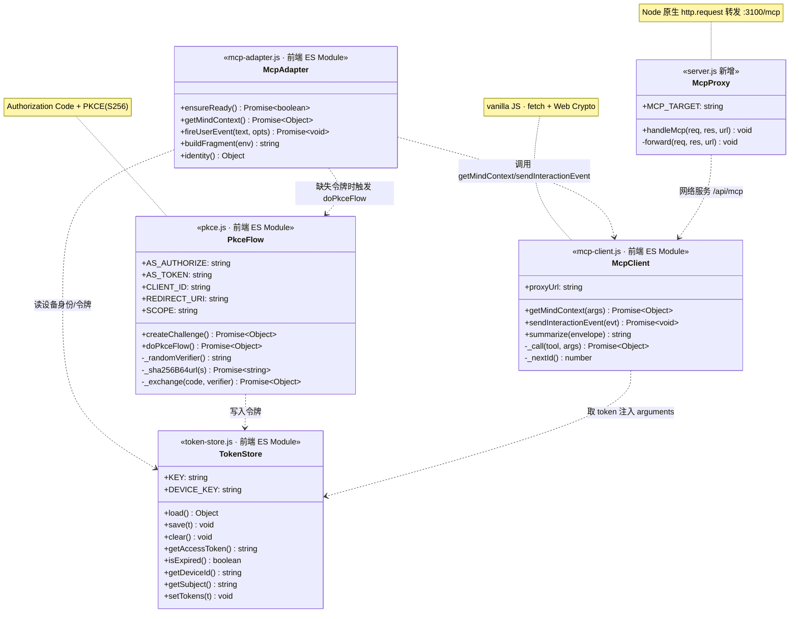
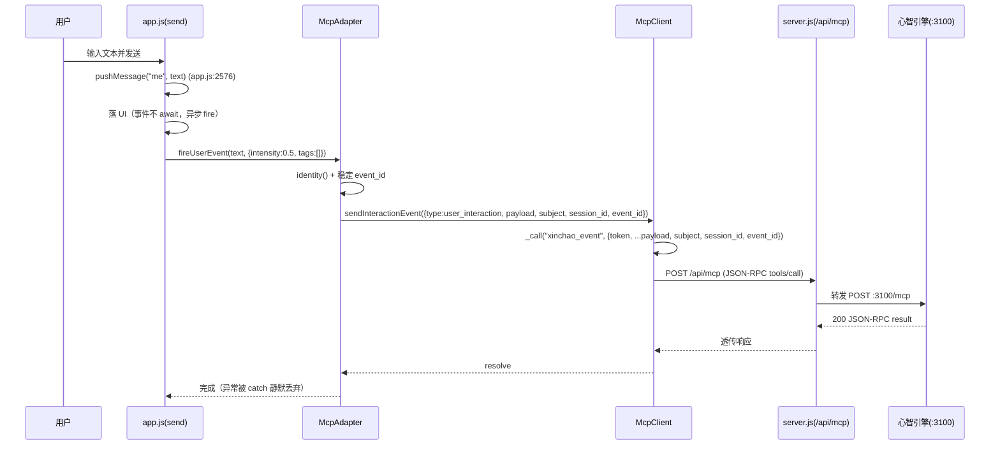
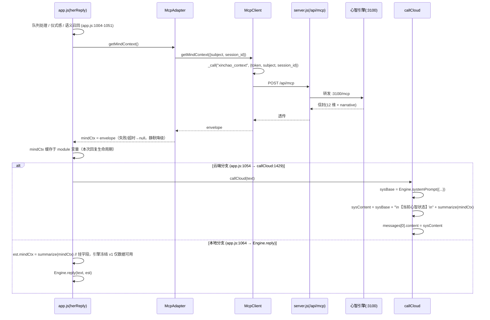
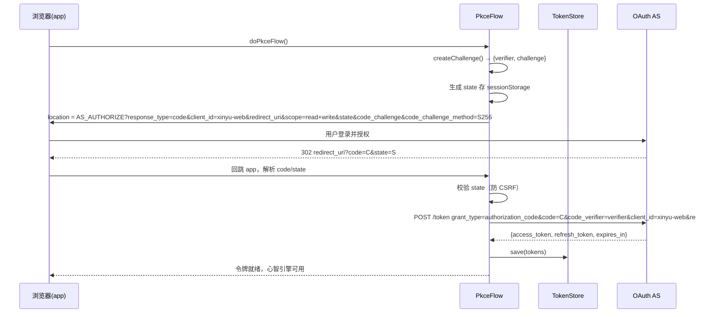
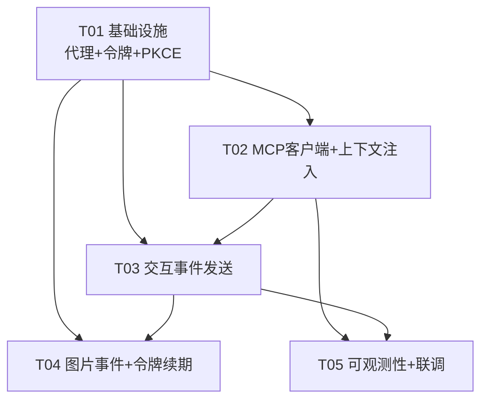

# 心屿前端对话层接入自研心智引擎 MCP · 系统架构 + 任务分解

> 架构师：高见远（Gao）｜团队：心屿（产品名：心屿 / 角色名：小暖，不可改名）
> 范围：仅改 `app.js` 与 `server.js`；新增纯前端 ES Module（零依赖）；心智引擎自研 MIT，不引入任何第三方心潮/ombre-brain 项目。
> 基线已与代码核对：`herReply`(app.js:1004)、上下文注入锚点(app.js:1053 上方)、`est`(app.js:1065–1077)、`callCloud`(app.js:1429)/`systemPrompt`(app.js:1444)、`send`(app.js:2560)/`pushMessage`(app.js:2576)。

---

## 1. 实现方案 + 框架选型

### 1.1 技术挑战与选型

| 难点 | 方案 | 理由 |
|------|------|------|
| 跨域 + 端口冲突（MCP express 无 CORS，server.js 与引擎默认都 3000） | `server.js` 新增 **零依赖 `/api/mcp` 代理**（Node 原生 `http.request` 转发到 `:3100/mcp`） | 复用 server.js 既有 `Access-Control-Allow-Origin: *`，浏览器只连同源 `/api/mcp`，规避 CORS 与端口冲突。MCP 引擎部署用 `PORT=3100`。 |
| 前端零依赖（vanilla JS + 原生 fetch + Web Crypto） | 新增前端 **ES Module**（`mcp-client.js` / `pkce.js` / `token-store.js` / `mcp-adapter.js`），由 `app.js` 用动态 `import()` 引导加载 | 不引入框架/打包器；`index.html` 在 4-locks **不可改**，故不能加 `<script>` 标签，改用运行时 `import()`（经典脚本亦可调用动态 `import()`）。 |
| OAuth 令牌获取（无登录、设备级身份） | `PkceFlow` 用 **Web Crypto `crypto.subtle`** 做 PKCE（S256）：`code_verifier`→`SHA-256`→`code_challenge` | 公共客户端 `xinyu-web` 无密钥，PKCE 是必须的安全机制；纯浏览器原生实现，零依赖。 |
| 上下文注入双路径（云端 systemPrompt + 本地 est） | 云端：截取 `Engine.systemPrompt({...})` 返回值，追加摘要片段（**不碰 engine.js**）；本地：在 `est` 上挂 `mindCtx` 字段（引擎冻结，v1 仅建数据可用性） | 遵守 4-locks，`engine.js` 不可改；云端路径通过字符串拼接注入，完全不动引擎。 |
| 失败静默降级 | 所有 MCP 调用包 `try/catch` + 超时；异常/非 2xx → `mindCtx=null` 或事件丢弃，绝不阻塞对话 | 心智引擎是"增强"而非"必需"，必须可降级。 |

### 1.2 架构模式

- **代理模式**：`McpProxy`（server.js）对前端屏蔽 MCP 的 CORS/端口/JSON-RPC 细节。
- **门面模式**：`McpAdapter`（前端）对 `app.js` 暴露 `ensureReady / getMindContext / fireUserEvent / buildFragment`，封装身份、event_id、摘要逻辑。
- **传输与编排分离**：`McpClient` 只做 JSON-RPC 传输；`McpAdapter` 做业务编排。
- 整体为 **前端零依赖 + Node 原生 http 代理** 的极简分层，无状态、可水平替换引擎。

---

## 2. 文件列表及相对路径（位于 `/workspace/ai-girlfriend/`）

| 文件 | 类型 | 职责 |
|------|------|------|
| `server.js` | **改** | 新增 `MCP_TARGET` 常量 + `handleMcp()` 代理分支（POST/GET/DELETE → `:3100/mcp`，透传 body/headers，兼容 JSON/SSE，`CORS *`）。 |
| `app.js` | **改** | ① 模块作用域新增 `let mindCtx = null; let MCP = null;`；② IIFE 内动态 `import()` 引导加载新模块；③ `herReply`(:1053 上方) `await` 拉取 `xinchao_context`；④ `callCloud`(:1444) 注入摘要到 system content；⑤ `est`(:1065–1077) 挂 `mindCtx`；⑥ `send()`(:2576 之后) 异步 fire `xinchao_event`。 |
| `mcp-client.js` | **新** | `McpClient` 类：JSON-RPC Streamable HTTP 传输（`_call`）、`getMindContext`、`sendInteractionEvent`、`summarize`（摘要式提取最强 2–3 维 + narrative）。 |
| `mcp-adapter.js` | **新** | `McpAdapter` 门面：`ensureReady`（PKCE 静默/触发）、`identity()`（subject/session_id=设备 id）、`fireUserEvent`（稳定 event_id）、`buildFragment`。 |
| `pkce.js` | **新** | `PkceFlow` 类：Web Crypto 生成 `code_verifier`/`code_challenge`（S256）、`doPkceFlow()` 全流程（授权跳转→回调解析→token 交换）、`_exchange`。 |
| `token-store.js` | **新** | `TokenStore` 类：localStorage 存取 access/refresh token（`xinyu_oauth_tokens`）、稳定设备身份（`xinyu_device_id`）、过期判断、续期写入。 |

> 4-locks 文件（`engine.js` / `memory.js` / `presence.js` / `texture.js` / `contingency.js` / `index.html` / `style.css` / `manifest.json`）**本次一律不动**。新增文件不在 DENY 名单，由 server.js 静态托管正常下发。

---

## 3. 数据结构与接口（Mermaid 类图）



**关键接口签名（供工程师实现）**

```js
// mcp-client.js
class McpClient {
  constructor({ proxyUrl = "/api/mcp", getToken } = {})
  getMindContext({ subject, sessionId }) -> Promise<envelope|null>   // 调 xinchao_context
  sendInteractionEvent(evt) -> Promise<void>                          // 调 xinchao_event
  summarize(envelope) -> string                                       // 摘要式 NL 片段
  _call(tool, args) -> Promise<object>                               // JSON-RPC tools/call
}

// mcp-adapter.js
class McpAdapter {
  ensureReady() -> Promise<boolean>        // 加载模块 + (无令牌时) PKCE
  getMindContext() -> Promise<envelope|null>
  fireUserEvent(text, { intensity=0.5, tags=[] }) -> Promise<void>
  buildFragment(env) -> string
  identity() -> { subject, sessionId }     // 均取自 TokenStore 设备 id
}

// pkce.js
class PkceFlow {
  createChallenge() -> Promise<{ verifier, challenge }>
  doPkceFlow() -> Promise<{ access_token, refresh_token, expires_at }>
}

// token-store.js
class TokenStore {
  load()/save(t)/clear()/setTokens(t)
  getAccessToken()/isExpired()/getDeviceId()/getSubject()
}
```

---

## 4. 程序调用流程（Mermaid 时序图）

### ④-① `send()` → `xinchao_event` → 代理 → 引擎（失败静默）



### ④-② `herReply` → `xinchao_context` → 代理 → 引擎 → 注入 systemPrompt



### ④-③ PKCE 全流程（浏览器 ↔ OAuth AS）



---

## 5. 任务列表（有序、含依赖、P0/P1；遵循 ≤5 任务 / 每任务 ≥3 文件 / T01 为基础设施）

| Task | 名称 | 源文件 | 依赖 | 优先级 |
|------|------|--------|------|--------|
| **T01** | 基础设施：MCP 代理 + 设备身份/令牌 + PKCE 骨架 | `server.js`（新增 `/api/mcp` 代理）、`token-store.js`（新）、`pkce.js`（新） | 无 | **P0** |
| **T02** | MCP 客户端 + 心智上下文注入 | `mcp-client.js`（新）、`mcp-adapter.js`（新）、`app.js`（herReply 拉取 + callCloud/est 注入 + 动态 import 引导） | T01 | **P0** |
| **T03** | 交互事件发送 | `app.js`（send() 落 UI 后 fire）、`mcp-adapter.js`（stableEventId/event builder）、`mcp-client.js`（sendInteractionEvent） | T02, T01 | **P0** |
| **T04** | 图片事件补发 + 令牌续期（P1） | `app.js`（图片 send 路径补 fire）、`token-store.js`（refresh 续期）、`pkce.js`（refresh_token grant） | T01, T03 | **P1** |
| **T05** | 可观测性与联调收尾（P1） | `app.js`（控制台 mindCtx 注入日志 + DEBUG 开关）、`mcp-adapter.js`（verbose 日志）、`mcp-client.js`（debug flag） | T02, T03 | **P1** |

### 5.1 任务依赖图



### 5.2 各任务落地要点（给工程师的精确锚点）

- **T01**
  - `server.js`：在 `const PORT = ...`(行 32) 附近加 `const MCP_TARGET = process.env.MCP_TARGET || "http://localhost:3100/mcp";`；新增 `handleMcp(req,res,url)`（用既有 `readBody` + `http.request`，透传 method/body/headers，SSE 用 `upstreamRes.pipe(res)`，置 `CORS *`）；在 `createServer`(行 414) 内、`/api/` 分支(行 434) 之前加 `if (url.pathname === "/api/mcp") { res.setHeader("Access-Control-Allow-Origin","*"); return handleMcp(req,res,url); }`。
  - `token-store.js`：`KEY="xinyu_oauth_tokens"`、`DEVICE_KEY="xinyu_device_id"`；`getDeviceId()` 首次用 `crypto.randomUUID()` 落地 localStorage。
  - `pkce.js`：`CLIENT_ID="xinyu-web"`、`SCOPE="read write"`、`createChallenge` 用 `crypto.subtle.digest("SHA-256", verifier)` → base64url。
- **T02**
  - `mcp-client.js`：`_call` 构造 `{jsonrpc:"2.0",id:_nextId(),method:"tools/call",params:{name,arguments:{...args, token}}}`；`getMindContext` 调 `xinchao_context`；`summarize` 取信封 `narrative` + 按值排序的 top 2–3 维生成 NL 片段（字段缺失安全返回 ""）。
  - `mcp-adapter.js`：`ensureReady()` 动态 `import()` 三模块并 `new TokenStore()`；`getMindContext()` 注入身份后调 client；`buildFragment()` 转发 `summarize`。
  - `app.js`：模块作用域加 `let mindCtx=null; let MCP=null;`；IIFE 内 `(async()=>{ MCP = await bootMcp(); })()`；`herReply` 在 **app.js:1051 之后、app.js:1053 之前** 插入 `try { mindCtx = await adapter.getMindContext(); } catch { mindCtx=null; }`；`callCloud`(行 1444) 改为先取 `sysBase=Engine.systemPrompt({...})` 再 `content: sysBase + (mindCtx? "\n\n【当前心智状态】\n"+adapter.buildFragment(mindCtx):"")`；`est`(行 1065–1077) 加字段 `mindCtx: mindCtx? adapter.buildFragment(mindCtx):null,`。
- **T03**
  - `app.js` `send()` 在 **app.js:2576 `pushMessage("me",text)` 之后** 插入 `if (MCP) adapter.fireUserEvent(text, {intensity:0.5, tags:[]}).catch(()=>{});`（不 await，异步 fire）。
  - `mcp-adapter.js` `fireUserEvent`：构造 `{type:"user_interaction", payload:{content:text, intensity:0.5, tags}, subject, session_id, event_id}`，`event_id` 用稳定规则（见共享知识）。
  - `mcp-client.js` `sendInteractionEvent`：调 `xinchao_event`，失败 `console.warn` 后静默。
- **T04（P1）**
  - `app.js` 图片发送路径（与文本 send 同构）补 `fireUserEvent(imgAlt,{intensity:0.5,tags:["image"]})`。
  - `token-store.js` 加 `refresh()`；`pkce.js` 加 `refreshToken(rt)` → 调 AS `/token` `grant_type=refresh_token`。
- **T05（P1）**
  - `app.js` 注入点加 `if (DEBUG) console.info("[xinyu-mcp] mindCtx 注入:", fragment);`；`mcp-adapter.js`/`mcp-client.js` 加 verbose 日志开关。

---

## 6. 依赖包列表（零新增）

```
# 前端：浏览器原生 fetch + Web Crypto(crypto.subtle) + localStorage + 动态 import()
# 后端：Node.js 原生 http / crypto / fs（server.js 既有，无新 require）
# 无任何第三方包 / 无 ombre-brain / 无构建工具
```

> 确认 `package.json` 不新增 `dependencies`；4-locks 文件零改动；新增 4 个 `.js` 均为原生 ES Module。

---

## 7. 共享知识（跨文件约定）

| 约定项 | 值 / 规则 |
|--------|-----------|
| **MCP 代理 URL** | 前端常量 `MCP_PROXY = "/api/mcp"`；server.js 转发目标 `MCP_TARGET = "http://localhost:3100/mcp"`（env 可配）。MCP 引擎部署 `PORT=3100`。 |
| **CORS** | server.js `/api/mcp` 一律回 `Access-Control-Allow-Origin: *`（OPTIONS 预检已在 createServer 全局处理）。 |
| **token localStorage key** | `xinyu_oauth_tokens` → JSON `{access_token, refresh_token, expires_at, token_type}`。 |
| **设备身份 key** | `xinyu_device_id` → 稳定 UUID（首次 `crypto.randomUUID()` 生成落地）。 |
| **subject / session_id** | v1 统一 = `device_id`（无登录，设备级本地身份）；预注册公共客户端 `xinyu-web`。 |
| **event_id 生成规则** | `xinyu-${sessionId}-${Date.now().toString(36)}-${crc32(content).toString(36)}`；同一发送幂等、不重发即不重复；存于发送闭包内，不跨发送复用。 |
| **mindCtx module 变量名** | `app.js` 顶层 `let mindCtx = null;`（per-reply 生命周期缓存，每条用户消息 `herReply` 拉取一次）。 |
| **scope 字符串** | `"read write"`（请求时 URL 编码为 `read+write` / `read%20write`）。 |
| **token 注入位置** | `arguments.token`（v1 Route A），**不放** Authorization header。 |
| **JSON-RPC 形态** | `{jsonrpc:"2.0", id:<前端自增正整数>, method:"tools/call", params:{name:"xinchao_context"\|"xinchao_event", arguments:{...}}}`。 |
| **intensity 取值** | v1 固定常量 `0.5`（预留意图识别动态估算接口）。 |
| **mindCtx 呈现** | v1 摘要式：从信封提取最强 2–3 维 + narrative 摘要 → 一段自然语言片段，追加进 system prompt；**不**塞全量 12 维原始结构。 |
| **失败静默降级** | 所有 MCP 调用 `try/catch` + 超时（建议 ≤8s）；异常/非 2xx/超时 → `mindCtx=null`（上下文路径）或事件丢弃（事件路径），不阻塞对话、不抛 UI；仅 `console.warn` 供调试。 |
| **调用频率** | 每次 `herReply`（每条用户消息）拉取一次 `xinchao_context`，结果缓存于 module 变量 `mindCtx` 至本次回复结束。 |
| **模块加载** | `index.html` 锁死不可改 → `app.js` 在 IIFE 内用动态 `import('./mcp-client.js')` 等引导；新模块为 ES Module（`export` 类），由 server.js 静态托管（MIME `application/javascript`）。 |

---

## 8. 待明确事项（仅剩无法默认的技术决策）

1. **OAuth AS 端点与客户端注册**：`AS_AUTHORIZE` / `AS_TOKEN` 具体地址、以及公共客户端 `xinyu-web` 的登记参数（`redirect_uri` 白名单、`scope=read write` 审批、是否允许 refresh grant）——需主理人/运维提供。v1 暂用 `REDIRECT_URI = location.origin + "/"`（回跳到 app 首页并解析 `?code=&state=`）。
2. **本地引擎消费 mindCtx**：`engine.js` 在 4-locks 中不可改，`Engine.reply(text, est)` 当前不会读取 `est.mindCtx`。v1 仅建立数据可用性（挂字段 + 控制台可观测），**真正影响本地回复需后续解锁 engine.js 或引擎新版本读取该字段**——列为发布后跟进项。
3. **信封 12 维字段契约**：`xinchao_context` 返回的 12 维具体字段名/类型未在本 PRD 给出。`summarize()` 按"最强 2–3 维 + narrative"抽象实现，字段缺失时安全跳过；待引擎契约确定后对齐字段名。
4. **refresh_token 续期时机**：静默后台定时刷新 vs 调用失败重试，以及 AS 是否支持 `refresh_token` grant——P1 实现前需与 AS 侧确认（已在 T04 预留 `refreshToken()`）。
5. **event_id 幂等语义**：引擎侧对相同 `event_id` 的去重策略（丢弃/合并）需引擎方明确；前端保证同一发送不重复发，但重发窗口由引擎决定。

---

### 附录：铁律自检

- ✅ **小暖** 之名未改、未 renamed；产品名 **心屿** 贯穿文档。
- ✅ 100% 自研 MIT；未引入任何第三方心潮 / ombre-brain。
- ✅ 前端零依赖（vanilla JS + 原生 fetch + Web Crypto）；无框架/重型包。
- ✅ 锁定文件纪律：本次仅改 `app.js` 与 `server.js`；新增 4 个前端 ES Module（非锁文件）；`engine.js`/`memory.js`/`presence.js`/`texture.js`/`contingency.js`/`index.html`/`style.css`/`manifest.json` 一律不动。
