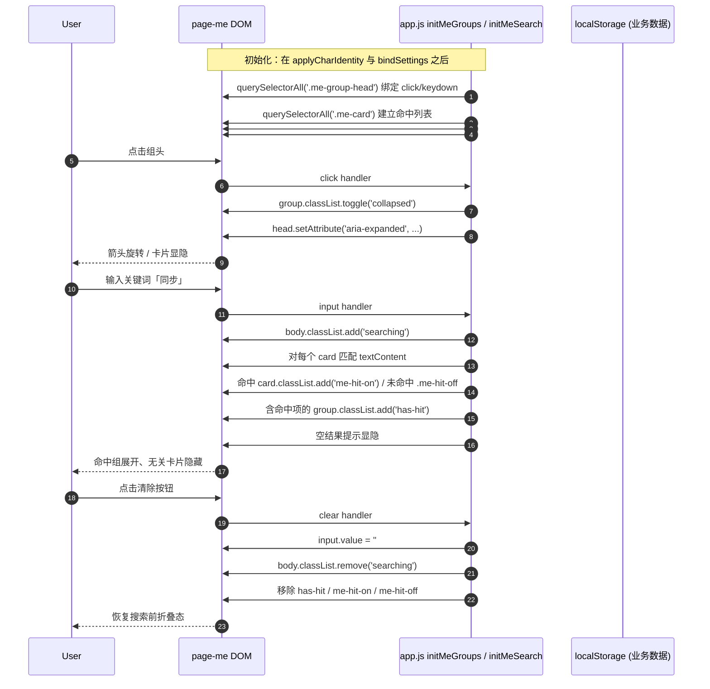
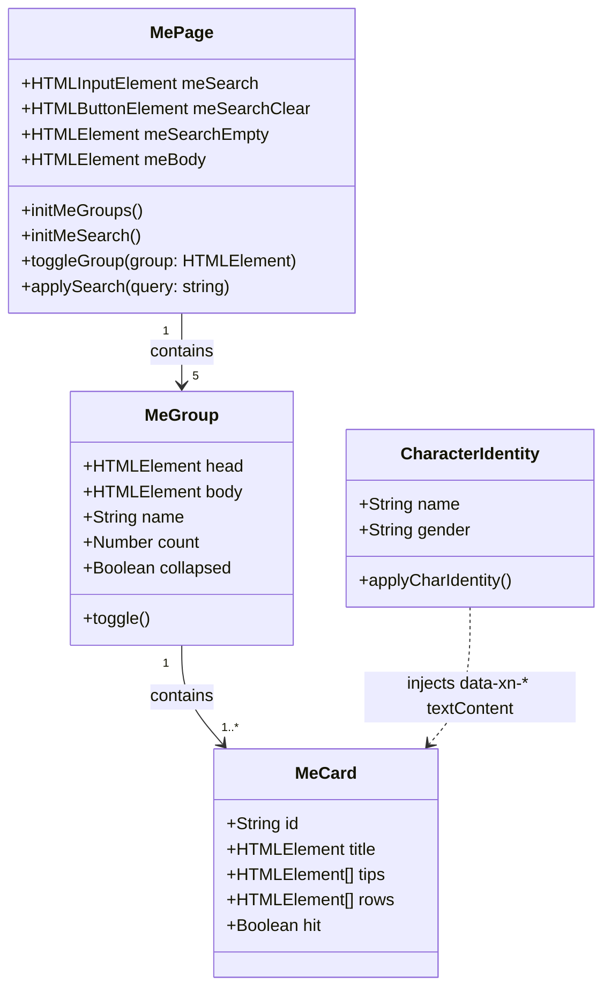
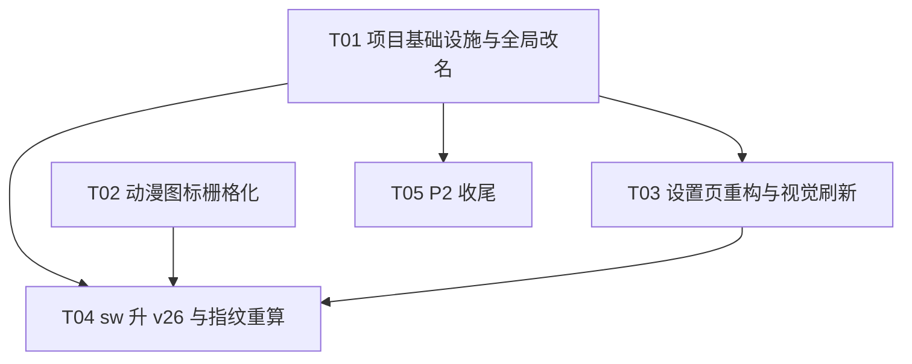

# DESIGN-xinyu-v1 · 「心屿」改名 / 动漫图标 / 设置页中等重构 + 视觉刷新

| 项 | 值 |
|---|---|
| 需求编号 | U-8 |
| 基线 | v22 收线（`xiaonuan-v25` 待发布键 / `released` 锚 `xiaonuan-v23` @ `b36842f`） |
| 设计人 | 高见远（架构师） |
| 状态 | 增量设计 → 交工程师实施 |

> **设计原则**：本轮只换招牌和整理房间，屋里住的人（小暖）一个字都不许动。

---

## 1. 实现方案 + 框架选型

### 1.1 技术栈确认

沿用现有纯前端静态架构：

| 层级 | 技术 |
|---|---|
| 运行 | 原生 HTML/JS/CSS，无构建步骤，Vite 不适用 |
| 服务 | `node server.js` 静态服务器 |
| 离线 | Service Worker（`sw.js`）+ `CacheStorage` |
| 状态 | `localStorage`（`xiaonuan_save_v1` 等 key） |
| 测试 | `node --test` + 独立 probe |

### 1.2 为何零新依赖

- 分组/折叠/搜索全部可用原生 JS + CSS 实现。
- 动效使用 CSS transition/animation，无需引入 GSAP 之类库。
- 图标栅格化使用本机已具备的 ImageMagick（`/usr/bin/convert`），无需 Node 图片库。
- PWA 安装、离线缓存、数据绑定等机制已完整存在，不需要任何新 npm 包。

**结论**：本次不新增任何 npm 依赖。

### 1.3 核心架构决策

| 决策 | 说明 |
|---|---|
| 设置页卡片只包外层容器 | 不改卡片内部 DOM、`id`、`data-xn-*` 属性；所有设置逻辑仍按 `id` 取元素。 |
| 搜索隐藏使用独立 CSS 类 `.me-hit-off` | 避免与全局 `.hidden`（`!important`）冲突，特别是 `sync-body`、`push-body` 等由业务逻辑显隐的元素。 |
| 折叠态写死 HTML 初始 class | 首屏无闪烁；JavaScript 只负责切换。 |
| 搜索态通过父容器 `.searching` 强制展开命中组 | 不修改 `collapsed` 类，清空搜索后自然恢复。 |
| 不缓存索引 | 每次搜索实时读取 `textContent`，避免 `data-xn-*` 重新注入后索引失效。 |

### 1.4 关键源码复核结论

- `app.js` 中对设置页**仅使用 ID 选择器**，没有 `.me-card` / `.me-body` / 父子/兄弟选择器依赖 → 嵌套安全。
- `style.css` 中对 `.me-card` 只用普通类选择器，无 `>`、`+`、`~`、`:first-child`、`:last-child` → 嵌套安全。
- 脚本装载顺序（`index.html:547-558`）**不得改动**（WR-13 三方对齐测试）。

---

## 2. 文件清单（变更文件 + 相对路径）

| 文件 | 变更类型 | 说明 |
|---|---|---|
| `manifest.json` | 修改 2 行 | 产品名、短名 → 心屿 |
| `index.html` | 修改 + 结构调整 | 改名 3 处 + `page-me` 分组/搜索框 + 卡片顺序微调 |
| `app.js` | 修改 + 新增函数 | 运行时标题改一个字 + `initMeGroups()` / `initMeSearch()` |
| `style.css` | 修改 | 分组/搜索样式 + 视觉刷新 token |
| `icon-xinyu.svg` | 已存在，可能微调 | 如目检/不透明需要，可移除底图圆角 |
| `icon-192.png` | 覆盖生成 | 由 SVG 栅格化 |
| `icon-512.png` | 覆盖生成 | 由 SVG 栅格化（同时用于 `purpose: maskable`） |
| `apple-touch-icon.png` | 覆盖生成 | 180×180，不在 ASSETS 内 |
| `sw.js` | 修改 1 处常量 | `CACHE` v25 → v26（前缀 `xiaonuan-` 不变） |
| `test/sw-assets-manifest.json` | 修改 | `cacheVersion` + 7 条 sha256 重算 |
| `package.json` | 可选 1 行 | `description`（P2） |

**不在变更列表**（四锁零消耗）：
`engine.js`、`memory.js`、`presence.js`、`texture.js`、`contingency.js`、`server.js`、`notify.js`、`schedule.js`、`localmodel.js`。

---

## 3. 设置页新 DOM 结构

### 3.1 总体结构

```html
<section class="page" id="page-me">
  <header class="nav her-nav">
    <div class="nav-name-lg">我的</div>
  </header>
  <main class="me-body">
    <!-- 新增：搜索框 -->
    <div class="me-search-wrap">
      <input class="me-search" id="me-search" type="text" placeholder="搜索设置项…" autocomplete="off">
      <button class="me-search-clear" id="me-search-clear" aria-label="清除">×</button>
    </div>
    <div class="me-empty hidden" id="me-search-empty">没有找到相关设置 🥲</div>

    <!-- 组 1：我们的关系 -->
    <div class="me-group" data-group="relation">
      <div class="me-group-head" role="button" tabindex="0" aria-expanded="true">
        <span class="me-group-icon">💞</span>
        <span class="me-group-name">我们的关系</span>
        <span class="me-group-count">2</span>
        <span class="me-group-arrow"></span>
      </div>
      <div class="me-group-body">
        <!-- 原卡片 1：恋爱档案（id 全部保留） -->
        <div class="me-card">...</div>
        <!-- 原卡片 2：表白 & 纪念日 -->
        <div class="me-card">...</div>
      </div>
    </div>

    <!-- 组 2：小暖的样子 -->
    <div class="me-group" data-group="look">
      <div class="me-group-head" role="button" tabindex="0" aria-expanded="true">
        <span class="me-group-icon">🎀</span>
        <span class="me-group-name">小暖的样子</span>
        <span class="me-group-count">2</span>
        <span class="me-group-arrow"></span>
      </div>
      <div class="me-group-body">
        <!-- 原卡片 3：我的昵称 -->
        <div class="me-card">...</div>
        <!-- 原卡片 4：小暖人设 -->
        <div class="me-card">...</div>
      </div>
    </div>

    <!-- 组 3：智能与模型（默认折叠） -->
    <div class="me-group collapsed" data-group="brain">
      <div class="me-group-head" role="button" tabindex="0" aria-expanded="false">
        <span class="me-group-icon">🧠</span>
        <span class="me-group-name">智能与模型</span>
        <span class="me-group-count">4</span>
        <span class="me-group-arrow"></span>
      </div>
      <div class="me-group-body">
        <!-- 原卡片 5：云端大脑（可选） -->
        <div class="me-card">...</div>
        <!-- 原卡片 6：端侧模型（离线 AI） -->
        <div class="me-card">...</div>
        <!-- 原卡片 7：语音（小暖开口说话） -->
        <div class="me-card">...</div>
        <!-- 原卡片 9：语音音色 -->
        <div class="me-card">...</div>
      </div>
    </div>

    <!-- 组 4：连接与同步（默认折叠） -->
    <div class="me-group collapsed" data-group="sync">
      <div class="me-group-head" role="button" tabindex="0" aria-expanded="false">
        <span class="me-group-icon">☁️</span>
        <span class="me-group-name">连接与同步</span>
        <span class="me-group-count">3</span>
        <span class="me-group-arrow"></span>
      </div>
      <div class="me-group-body">
        <!-- 原卡片 8：消息提醒（系统通知） —— 从原位置提到组 4 -->
        <div class="me-card">...</div>
        <!-- 原卡片 10：云同步（自动·端到端加密） -->
        <div class="me-card sync-card">...</div>
        <!-- 原卡片 11：让小暖主动找你（推送到微信） -->
        <div class="me-card push-card">...</div>
      </div>
    </div>

    <!-- 组 5：数据与隐私（默认折叠） -->
    <div class="me-group collapsed" data-group="data">
      <div class="me-group-head" role="button" tabindex="0" aria-expanded="false">
        <span class="me-group-icon">🗄</span>
        <span class="me-group-name">数据与隐私</span>
        <span class="me-group-count">2</span>
        <span class="me-group-arrow"></span>
      </div>
      <div class="me-group-body">
        <!-- 原卡片 12：存档码 -->
        <div class="me-card">...</div>
        <!-- 原卡片 13：重新开始 -->
        <div class="me-card danger">...</div>
      </div>
    </div>

    <div class="me-foot">心屿 v1.2 · 用爱发电 💕</div>
  </main>
</section>
```

### 3.2 关于卡片顺序调整

原 DOM 顺序中，**消息提醒** 位于 **语音** 与 **语音音色** 之间（行 279-288 介于 269 与 290 之间）。按 PRD 分组表，消息提醒应归入「连接与同步」组。为使各组连续，**只需把「语音音色」卡片提前到「语音」之后**，其余 12 张卡片相对顺序保持不变。最终各组边界连续，改动最小。

### 3.3 必须原样保留的内容

- 每张卡片 `.me-card` 的 **全部 `id`**：`me-days`、`me-msgs`、`me-affection`、`me-status`、`me-together`、`me-next-anni`、`btn-propose-me`、`me-nickname`、`save-nickname`、`gender-group`、`tone-group`、`theme-group`、`card-group`、`btn-export-persona`、`btn-import-persona`、`persona-file`、`card-demo`、`provider-group`、`cloud-enabled`、`cloud-base`、`cloud-key`、`cloud-model`、`embed-enabled`、`embed-model`、`save-cloud`、`cloud-status`、`lm-enabled`、`lm-model`、`lm-load`、`lm-progress`、`lm-bar`、`lm-status`、`lm-device`、`tts-enabled`、`notify-enabled`、`btn-notify-test`、`notify-status`、`voice-group`、`sync-enable`、`sync-body`、`sync-token`、`btn-sync-copy`、`btn-sync-new`、`sync-pass`、`sync-auto`、`btn-sync-up`、`btn-sync-down`、`btn-sync-force`、`sync-status`、`sync-meta`、`btn-sync-del`、`push-need-sync`、`push-body`、`push-enable`、`push-channel`、`push-howto`、`push-fields`、`push-twoway`、`push-twoway-en`、`push-callback-url`、`btn-push-copy-url`、`btn-push-save`、`btn-push-test`、`push-status`、`push-meta`、`btn-push-del`、`btn-export`、`btn-copy`、`cloud-export`、`cloud-import`、`btn-import`、`cloud-sync-status`、`btn-reset`。
- 所有 `data-xn-*` 属性及所在元素：`data-xn-prefix`、`data-xn-cloud`、`data-xn-tts`、`data-xn-voice`、`data-xn-cardsub`。
- 卡片内部文案中「小暖」称谓保持原样（人设/语音/推送等）。
- `.sync-body`、`.push-body`、`.hidden` 的既有显隐逻辑不改动。

---

## 4. CSS token / 新增样式

### 4.1 在 `:root` 追加 token（不破坏既有变量）

```css
:root {
  --pink: #ff7b9c;
  --pink-deep: #f25c82;
  --pink-soft: #ffd6e2;
  --pink-bg: #fff5f8;
  /* ... 既有变量 ... */

  /* 新增视觉 token */
  --r-card: 18px;       /* 卡片圆角 */
  --r-ctl: 12px;        /* 按钮/输入框 */
  --r-pill: 999px;      /* chip */
  --gap-xs: 6px;
  --gap-sm: 10px;
  --gap-md: 14px;
  --gap-lg: 18px;
  --ease: cubic-bezier(.4, 0, .2, 1);

  /* 新增层级颜色 */
  --group-head: #c43d66;     /* 组头：最重 */
  --card-title: #4a3540;     /* 卡片标题：维持 */
  --tip-text: #9b7f8a;       /* 提示：更淡 */
  --search-bg: #fff;
  --search-border: rgba(255,123,156,.35);
}
```

### 4.2 新增/调整样式关键片段

```css
/* ============ 我的页（增量样式） ============ */

/* 搜索框 */
.me-search-wrap {
  position: relative;
  margin-bottom: var(--gap-md);
}
.me-search {
  width: 100%;
  border: 1.5px solid var(--search-border);
  border-radius: var(--r-ctl);
  padding: 11px 34px 11px 14px;
  font-size: 15px;
  background: var(--search-bg);
  color: var(--text);
  outline: none;
  transition: border-color .2s var(--ease), box-shadow .2s var(--ease);
}
.me-search:focus {
  border-color: var(--pink);
  box-shadow: 0 0 0 3px rgba(255,123,156,.15);
}
.me-search-clear {
  position: absolute;
  right: 8px;
  top: 50%;
  transform: translateY(-50%);
  width: 26px;
  height: 26px;
  border: 0;
  border-radius: 50%;
  background: transparent;
  color: var(--text-light);
  font-size: 20px;
  line-height: 1;
  cursor: pointer;
  display: none;
}
.me-search-wrap.has-value .me-search-clear {
  display: flex;
  align-items: center;
  justify-content: center;
}
/* 备选：若目标浏览器不支持 JS 动态类，可用 :has() 但需评估兼容性 */
.me-search-wrap:not(:has(.me-search:placeholder-shown)) .me-search-clear {
  display: flex;
  align-items: center;
  justify-content: center;
}
.me-empty {
  text-align: center;
  padding: 28px 12px;
  color: var(--text-light);
  font-size: 14px;
}

/* 分组容器 */
.me-group {
  margin-bottom: var(--gap-md);
}

/* 组头 */
.me-group-head {
  display: flex;
  align-items: center;
  gap: var(--gap-xs);
  padding: 14px 16px;
  background: #fff;
  border-radius: var(--r-card);
  box-shadow: 0 2px 8px rgba(242,92,130,.06);
  border: 1px solid rgba(255,123,156,.12);
  cursor: pointer;
  user-select: none;
  -webkit-tap-highlight-color: transparent;
  transition: background .15s var(--ease), box-shadow .15s var(--ease);
}
.me-group-head:active {
  background: #fff0f4;
  box-shadow: 0 1px 4px rgba(242,92,130,.04);
}
.me-group-icon { font-size: 18px; }
.me-group-name {
  flex: 1;
  font-size: 16px;
  font-weight: 700;
  color: var(--group-head);
}
.me-group-count {
  font-size: 12px;
  font-weight: 600;
  color: var(--text-light);
  background: var(--pink-bg);
  padding: 2px 8px;
  border-radius: var(--r-pill);
}
.me-group-arrow {
  width: 8px;
  height: 8px;
  border-right: 2px solid var(--text-light);
  border-bottom: 2px solid var(--text-light);
  transform: rotate(45deg);
  transition: transform .2s var(--ease);
}

/* 折叠状态 */
.me-group.collapsed .me-group-body {
  display: none;
}
.me-group.collapsed .me-group-arrow {
  transform: rotate(-45deg);
}

/* 搜索态：强制展开命中组，隐藏未命中卡片/空组 */
.me-body.searching .me-group {
  display: none;           /* 先隐藏所有组 */
}
.me-body.searching .me-group.has-hit {
  display: block;          /* 命中组恢复 */
}
.me-body.searching .me-group.has-hit .me-group-body {
  display: block !important; /* 强制展开，但不改 collapsed 类 */
}
.me-body.searching .me-group.has-hit .me-group-arrow {
  transform: rotate(45deg);
}
.me-card.me-hit-off {
  display: none;
}

/* 卡片命中高亮（P2 可选） */
.me-card.me-hit-on {
  /* 轻量视觉提示，不动 innerHTML */
  background: #fff8fa;
  box-shadow: 0 0 0 1.5px rgba(255,123,156,.25);
}

/* 组内卡片间距微调 */
.me-group-body {
  padding-top: var(--gap-sm);
}
.me-group-body .me-card {
  margin-bottom: var(--gap-sm);
  border-radius: var(--r-card);
  box-shadow: 0 2px 8px rgba(242,92,130,.06);
  border: 1px solid rgba(255,123,156,.12);
  background: rgba(255,255,255,.72);
  backdrop-filter: blur(14px) saturate(130%);
  -webkit-backdrop-filter: blur(14px) saturate(130%);
  transition: background .2s var(--ease), box-shadow .2s var(--ease);
}

/* 卡片内部层级 */
.me-title {
  font-size: 15px;
  font-weight: 700;
  color: var(--card-title);
  margin-bottom: 10px;
}
.me-tip {
  font-size: 12px;
  color: var(--tip-text);
  margin-bottom: 10px;
  line-height: 1.6;
}

/* 减弱动画 */
@media (prefers-reduced-motion: reduce) {
  .me-group-head,
  .me-group-arrow,
  .me-search,
  .me-group-body .me-card {
    transition: none;
  }
}
```

### 4.3 关于 `max-height` 过渡的弃用说明

不建议用 `max-height: 0 ↔ 9999px` 做折叠动画，原因：
- `sync-body` / `push-body` 高度动态不可预测，固定 max-height 会截断或产生异常过渡。
- 组内卡片含 `backdrop-filter`，若给 `.me-group-body` 加 `overflow:hidden` 可能裁切阴影/模糊。
- PRD 已要求「隐藏用 CSS 不移 DOM」。

**采用方案**：折叠直接 `display:none`（瞬态），展开时卡片做 240ms 内的 opacity + translateY 淡入（P2 可选），既满足性能又避免布局风险。

---

## 5. 改名精确 edits

> ⚠️ **重要发现**：`app.js:3793` 的原文不含「小暖」字面量，它是 `${ch.name}` 插值。因此本轮 6 处 P0 改名（不含 P2 package.json）实际从源码中移除的「小暖」字面量是 **5 个**，不是 6 个。若把 P2 的 `package.json:description` 也改了，则移除 **6 个**。这是 PRD AC-6 的计数疏漏，需在验收时修正判据：
> - **不做 N-7**：全仓「小暖」净减少量 = 5。
> - **做 N-7**：全仓「小暖」净减少量 = 6。
> 若按 PRD 说的「恰好 = 6 / 7」硬卡，不做 N-7 时会误判工程师实现错误。

### 5.1 P0 改名（6 处）

| # | 文件:行号 | 当前代码片段 | 目标代码片段 |
|---|---|---|---|
| N-1 | `manifest.json:2` | `"name": "小暖 · 你的 AI 女友"` | `"name": "心屿 · 你的 AI 女友"` |
| N-2 | `manifest.json:3` | `"short_name": "小暖"` | `"short_name": "心屿"` |
| N-3 | `index.html:9` | `<title data-xn="title">小暖 · 你的 AI 女友</title>` | `<title>心屿 · 你的 AI 女友</title>` |
| N-4 | `app.js:3793` | `document.title = \`${ch.name} · 你的 AI ${role}\`;` | `document.title = \`心屿 · 你的 AI ${role}\`;` |
| N-5 | `index.html:12` | `<meta name="apple-mobile-web-app-title" data-xn="appname" content="小暖">` | `<meta name="apple-mobile-web-app-title" data-xn="appname" content="心屿">` |
| N-6 | `index.html:426` | `<div class="me-foot">小暖 v1.2 · 用爱发电 💕</div>` | `<div class="me-foot">心屿 v1.2 · 用爱发电 💕</div>` |

### 5.2 P2 可选（1 处）

| # | 文件:行号 | 当前 | 目标 |
|---|---|---|---|
| N-7 | `package.json:5`（PRD 写 `:4`，实际为 `:5`） | `"description": "小暖 · AI 恋人 PWA + 端到端加密同步网关"` | `"description": "心屿 · AI 恋人 PWA（AI 角色：小暖）+ 端到端加密同步网关"` |

> 注意：package.json 中 `"name": "xiaonuan"` 严禁改动。

---

## 6. 图标栅格化命令

### 6.1 前置处理（R-I3 不透明 + R-I2 maskable 安全区）

当前 `icon-xinyu.svg` 的底图矩形带 `rx="112"`，会导致四个角透明。若直接栅格化，产物 `opaque=false`，iOS 可能把透明角渲染成黑色，且 `maskable` 会二次圆角。建议在生成 PNG 前**把底图 `rx="112"` 改为 `rx="0"`**（或直接删除 `rx="112"` 属性）。这是纯资产文件层面的微调，不影响引用路径。

验证命令（先目检 SVG 底图行）：
```bash
grep '<rect x="0" y="0" width="512" height="512"' icon-xinyu.svg
# 应看到 rx 被移除或 rx="0"
```

### 6.2 三条 convert 命令

```bash
# 192×192，manifest 的 any purpose
convert -background none icon-xinyu.svg -resize 192x192 icon-192.png

# 512×512，manifest 的 any + maskable 双 purpose（主体必须在中心 80% 安全区）
convert -background none icon-xinyu.svg -resize 512x512 icon-512.png

# 180×180，Apple 标准，index.html link 引用，不进 sw ASSETS
convert -background none icon-xinyu.svg -resize 180x180 apple-touch-icon.png
```

### 6.3 后验收

- `identify -format '%[opaque]' icon-192.png icon-512.png apple-touch-icon.png` 应全部输出 `true`。
- 人工目检 512 图：渐变无断层、线条无锯齿、人物居中、四角填满背景色。
- 若 ImageMagick 输出质量不合格，改用 Python PIL 渲染或等待真图，**不可硬上**。

---

## 7. sw 升键 + 指纹重算

### 7.1 `sw.js`

```javascript
const CACHE = "xiaonuan-v26";
```

**只改数字，前缀 `xiaonuan-` 严禁动**（R-3）。建议在注释末尾追加本轮升键原因，例如 `// v26 U-8：改名/图标/设置页重构`，但保持 ASSETS 路径清单逐字不变。

### 7.2 `test/sw-assets-manifest.json`

```json
{
  "cacheVersion": "xiaonuan-v26",
  "released": { /* 逐字不动 */ },
  "assets": {
    "/": "<重算>",
    "/index.html": "<重算>",
    "/style.css": "<重算>",
    "/app.js": "<重算>",
    "/manifest.json": "<重算>",
    "/icon-192.png": "<重算>",
    "/icon-512.png": "<重算>",
    "/localmodel.js": "保持原值",
    "/engine.js": "保持原值",
    "/memory.js": "保持原值",
    "/presence.js": "保持原值",
    "/texture.js": "保持原值",
    "/contingency.js": "保持原值"
  }
}
```

### 7.3 重算命令

等全部源码与图标修改完成后，在仓库根目录执行：

```bash
sha256sum index.html style.css app.js manifest.json icon-192.png icon-512.png
```

其中 `index.html` 的哈希同时写入 `"/"` 和 `"/index.html"` 两个键。

**注意**：`apple-touch-icon.png` 不在 ASSETS 清单，**不需要**写入 `assets`。

### 7.4 `released` 块

**逐字不动**。`released.cacheVersion` 仍为 `xiaonuan-v23`，`provenance` 仍为 `git b36842f（v18 收线提交，即 xiaonuan-v23 的铸键点）`。

---

## 8. 程序调用 / 交互流程

### 8.1 初始化时序

```text
DOMContentLoaded
  └─ init()
       ├─ applyTheme()
       ├─ refreshCharacter() ──▶ applyCharIdentity()  // data-xn-* 注入
       │                            ├─ document.title = `心屿 · 你的 AI ${role}`
       │                            └─ [data-xn="name/title/prefix/ph/...]
       ├─ bindTabs(); bindInput(); ...; bindSettings(); ...
       ├─ bindVoice(); bindNotify(); bindCloudSave(); ...; bindSync(); bindPush();
       └─ initMeGroups(); initMeSearch();              // 新增：必须在 applyCharIdentity 之后
```

### 8.2 新增函数职责

建议在 `app.js` 内新增两个函数，放在 `applyCharIdentity()` 附近或 `bindSettings()` 区域之后：

```javascript
/* ================= 设置页分组 / 搜索 ================= */

function initMeGroups() {
  const body = document.querySelector('.me-body');
  if (!body) return;
  body.querySelectorAll('.me-group-head').forEach(head => {
    const group = head.closest('.me-group');
    const toggle = () => {
      const collapsed = group.classList.toggle('collapsed');
      head.setAttribute('aria-expanded', String(!collapsed));
    };
    head.addEventListener('click', toggle);
    head.addEventListener('keydown', e => { if (e.key === 'Enter' || e.key === ' ') { e.preventDefault(); toggle(); } });
  });
}

function initMeSearch() {
  const body = document.querySelector('.me-body');
  const input = document.getElementById('me-search');
  const clear = document.getElementById('me-search-clear');
  const empty = document.getElementById('me-search-empty');
  if (!body || !input) return;

  const getText = card => (card.textContent || '').toLowerCase();
  const cards = Array.from(body.querySelectorAll('.me-card'));

  const wrap = input.closest('.me-search-wrap');
  const apply = () => {
    const q = input.value.trim().toLowerCase();
    if (wrap) wrap.classList.toggle('has-value', q.length > 0);
    body.classList.toggle('searching', q.length > 0);
    body.querySelectorAll('.me-group').forEach(g => g.classList.remove('has-hit'));
    let any = false;
    cards.forEach(card => {
      const hit = q.length === 0 || getText(card).includes(q);
      card.classList.toggle('me-hit-off', !hit);
      card.classList.toggle('me-hit-on', q.length > 0 && hit);
      const group = card.closest('.me-group');
      if (group && hit) {
        group.classList.add('has-hit');
        any = true;
      }
    });
    if (empty) empty.classList.toggle('hidden', !(q.length > 0 && !any));
  };

  input.addEventListener('input', apply);
  if (clear) clear.addEventListener('click', () => { input.value = ''; input.focus(); apply(); });
}
```

### 8.3 关键时序说明

- `initMeGroups` / `initMeSearch` **必须**在 `applyCharIdentity()` 之后调用。原因：搜索读取的文本包含 `data-xn-*` 注入后的角色文案，若先绑定再注入，首次渲染时索引/文本会过期。但因本方案不缓存索引、每次输入都读 `textContent`，所以即使后续性别切换触发 `applyCharIdentity`，搜索行为也不会异常。
- 两个函数必须在 `bindSettings()` 之后调用，避免折叠/搜索逻辑覆盖业务绑定。
- 组头默认 `collapsed` 类已写在 HTML 中，JS 不设置初始态，避免 FOUC。

### 8.4 不变量保持

- 搜索不使用 `.hidden` 类，避免与 `#sync-body`、`.card-demo` 等业务 `hidden` 混淆。
- 不改动任何 `id`，不改动任何 localStorage key。
- 不清空搜索框时折叠态由 HTML `collapsed` 类决定；清空后移除 `.searching`，组态自然恢复。

---

## 9. 任务清单（有序 + 依赖 + 实现顺序）

> 规则约束：任务按功能模块/层次分组，不按单文件拆分；第一个任务为项目基础设施 + 改名 + 全局安全校验的入口动作。本次合并为 **5 个任务**（达到上限），P2 项 T05 可跳过。

### T01：改名 + 基础设施安全（P0）

| 字段 | 内容 |
|---|---|
| **任务名称** | 项目基础设施与全局改名 |
| **源文件** | `manifest.json`、`index.html`、`app.js` |
| **动作** | 按 §5 映射表完成 6 处 P0 改名；N-3 与 N-4 成对改；确认不做全局替换。本任务覆盖 PWA 配置（manifest）、入口页（index.html）与运行时入口逻辑（app.js:title）。 |
| **依赖** | 无 |
| **验收点** | ① `grep -o '心屿' manifest.json index.html app.js` 命中 5/6 处；② `git diff` 改名 hunk ≤ 6；③ 男版运行时标题为「心屿 · 你的 AI 男友」；④ 角色名「小暖」在四文件中净减少 = 5（不做 P2）或 6（做 P2）。 |

### T02：图标生成与 PWA 资产（P0/P1）

| 字段 | 内容 |
|---|---|
| **任务名称** | 动漫图标栅格化 |
| **源文件** | `icon-xinyu.svg`、`icon-192.png`、`icon-512.png`、`apple-touch-icon.png` |
| **动作** | 按需移除底图圆角；执行 §6 三条 convert 命令；人工目检质量与不透明度。 |
| **依赖** | 无（可与 T01 并行） |
| **验收点** | ① 三 PNG 尺寸正确；② `identify -format '%[opaque]'` 全部 `true`；③ 512 图人物居中、四角填满；④ `manifest.json` 与 `sw.js` ASSETS 路径未改。 |

### T03：设置页分组 / 搜索 / 视觉刷新（P0/P1）

| 字段 | 内容 |
|---|---|
| **任务名称** | 设置页重构与整体视觉刷新 |
| **源文件** | `index.html`、`app.js`、`style.css` |
| **动作** | ① `index.html` 增加搜索框、包 5 个 `.me-group`、微调卡片顺序；② `app.js` 新增 `initMeGroups` / `initMeSearch` 并在 `init()` 末尾调用；③ `style.css` 新增 §4 token 与样式。 |
| **依赖** | T01（标题改名逻辑已完成，但结构上可与 T01 同时开发） |
| **验收点** | ① 13 张卡全部入组；② 默认组 1/2 展开、3/4/5 折叠；③ 搜索「同步」命中云同步并自动展开；④ 清空恢复；⑤ 所有 id 与存储 key 未改；⑥ 设置项读写行为与改前一致；⑦ 无新增阻断样式。 |

### T04：Service Worker 升键与清单指纹（P0）

| 字段 | 内容 |
|---|---|
| **任务名称** | sw 升 v26 与指纹重算 |
| **源文件** | `sw.js`、`test/sw-assets-manifest.json` |
| **动作** | ① `sw.js` `CACHE` → `xiaonuan-v26`；② 等 T01/T02/T03 全部落地后，用 `sha256sum` 重算 7 条资产指纹并写入 manifest。 |
| **依赖** | T01、T02、T03（所有会改变被缓存资产内容的任务完成后才可算指纹） |
| **验收点** | ① `node test/qa-v21-sw-guard.js` 全绿；② `released` 块无 diff；③ 缓存键前缀仍为 `xiaonuan-`；④ 四锁五文件不在 `git diff --stat`。 |

### T05：P2 项与变更日志（可选，P2）

| 字段 | 内容 |
|---|---|
| **任务名称** | P2 收尾 |
| **源文件** | `package.json`、`docs/CHANGELOG.md` |
| **动作** | ① 可选改 `package.json:description`；② 在 `CHANGELOG.md` 末尾追加 U-8 条目（仅追加，不改历史记录）。 |
| **依赖** | T01 |
| **验收点** | 仅做 N-7 时，「小暖」净减少量从 5 变 6，需在 AC-6 验收口径中同步更新。 |

---

## 10. 依赖包列表

无新增依赖。

---

## 11. 共享知识（跨文件约定）

1. **`xiaonuan-` 前缀 = 技术层标识**：sw 缓存键、存储 key、npm `name` 均不动。产品改名只影响用户可见文案。
2. **`data-xn` 初始化顺序**：`applyCharIdentity()` 在 `init()` 中通过 `refreshCharacter()` 调用；设置页分组/搜索初始化必须在其后。
3. **搜索/折叠初始化须晚于 `data-xn` 注入**：避免角色文案注入覆盖搜索索引或折叠状态。
4. **隐藏卡片用 `.me-hit-off`，不用 `.hidden`**：`.hidden` 是全局 `!important`，会干扰 `sync-body` / `push-body` 等业务显隐。
5. **角色名零误伤红线**：严禁全局替换；改名点逐行核对 §5 映射表。
6. **四锁配额零消耗**：`engine.js` / `memory.js` / `presence.js` / `texture.js` / `contingency.js` 源码 diff 必须为 0。
7. **`released` 块冻结**：`test/sw-assets-manifest.json` 的 `released` 对象在 CI 中受 F1-F6 守护，本轮不可改。

---

## 12. 待明确事项

1. **AC-6 的「净减少量」判据需修正**：PRD 写「恰好 = 6 / 7」，但实测 6 处 P0 中只有 5 处含「小暖」字面量（`app.js:3793` 是 `${ch.name}` 插值）。建议验收口径改为：不做 N-7 时净减少 5，做 N-7 时净减少 6。否则工程师正确实现后 QA 会误判失败。
2. **设置页折叠态持久化（M-10）本轮不做**：已按 PRD Q3 建议列为 P2 不实施，确认主理人是否同意。
3. **图标占位图是否本轮合入**：建议按 PRD Q2 合入；若目检不通过则本轮跳过图标，T02 内容降级为「不改图标」，但仍需完成 T01/T03/T04。请主理人确认。

---

## 附录 A：设置页搜索/折叠交互序列图



## 附录 B：设置页分组结构类图



## 附录 C：任务依赖图


