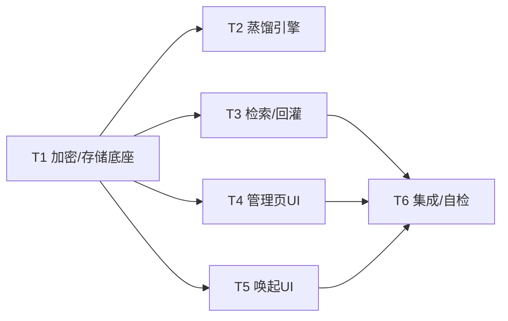

# 心屿 xinyu · 长期记忆 / 跨会话记忆沉淀 — 系统架构设计 + 任务分解

> **团队**：心屿 `software-xinyu-v3-memory`　|　**架构师**：高见远（Gao）
> **上游 PRD**：许清楚（Xu）·《简单 PRD — 候选 A：长期记忆 / 跨会话记忆沉淀》
> **基线约束**：v2 已收口，**不得破坏** `engine.js` / `sw.js` / `test/baseline.js` 三条冻结线。
> **铁律**：小暖(Xiaonuan) 固定人名不更名；心屿 产品名；隐私优先 100% 本地、零上报、零训练、可彻底清除；**前端零依赖**（原生 JS + 原生 fetch + Web Crypto，禁新增 npm 依赖）；后端 Node/TS 同样禁新增依赖。

---

## 0. 冻结线声明（务必先行）

本设计**明确不改动**以下既有文件，其既有语义与体积保持不变：

| 文件 | 状态 | 说明 |
|------|------|------|
| `ai-girlfriend/engine.js` | ❄️ 冻结 | 约 251068 字节，v3 不改动核心逻辑与体积；仅作为 `est` 的**消费方**（忽略 `longTermMemories` 字段，见 §8 假设 A1）。 |
| `ai-girlfriend/sw.js` | ❄️ 冻结 | v14 缓存键 = 19，v3 不改动。 |
| `ai-girlfriend/test/baseline.js` | ❄️ 冻结 | 含 `BASE`/`PREV`/`V14` 常量，v3 不改动其既有语义。 |
| `ai-girlfriend/memory.js` | 不改（主动隔离） | 管理 `(subject,session_id)` 会话层事实；v3 长期记忆**独立存储、互不污染**，故不改动。 |
| `ai-girlfriend/server.js` | 不改 | 静态服务 + MCP 代理；长期记忆纯客户端、零网络，无新路由。 |
| `ai-girlfriend/mcp-client.js` / `token-store.js` | 不改 | v3 仅**消费**其暴露的 `subject`/`sessionId`。 |
| `src/**`（后端 OAuth2.1 / `MemoryStore`） | 不改 | 长期记忆为浏览器本地，不落地服务端；`src/storage/MemoryStore` 是服务端 JSONL，与 v3 解耦。 |

---

## 1. 实现方案 + 框架选型（前端零依赖落地）

### 1.1 技术挑战
1. **本地加密持久化**：浏览器原生持久化 + AES-GCM 加密，**零依赖**。
2. **跨会话检索 ≤200ms**：纯本地、无向量库，用「分词 + 标签 + 时间衰减」近似相似度。
3. **与 12 维 mindCtx 协同**：回灌为**补充字段**，冲突时 mindCtx(实时) 优先，**绝不覆盖**。
4. **隐私边界过滤**：蒸馏阶段硬性拦截密码/支付/身份核验类内容，零上报。
5. **与冻结引擎共存**：不能改 `engine.js`，唤起能力需借道云端/本地模型分支 + 宿主级 UI 气泡。

### 1.2 框架 / 库选型（**全部零新增依赖**）
| 关注点 | 选型 | 理由 |
|--------|------|------|
| 语言/构建 | 原生 ES（IIFE 挂 `window.LTM`），**无构建步骤** | 与 `ai-girlfriend/` 既有风格一致；铁律禁新增 npm 依赖。 |
| 持久化 | **IndexedDB**（主）+ **localStorage**（兜底） | 原生、结构化、异步不阻塞、配额大；localStorage 兜底保证老环境可用。**独立 DB `xinyu_ltm`，以 `subject` 为归属键**，与 `(subject,session_id)` 会话层互不污染。 |
| 加密 | **Web Crypto**（AES-GCM-256 + PBKDF2 派生密钥） | 浏览器/Node20+ 原生；CryptoKey `extractable:false`。 |
| 检索 | 自研零依赖 `tokenize` + Jaccard/词袋 + 标签加权 + 时间衰减 | 不引向量库；200 条解密 + 打分远低于 200ms。 |
| 测试 | 原生 `node --test` + Node WebCrypto + 内存后端桩 | 不新增测试框架；复用既有黑盒范式。 |

### 1.3 架构模式
- **分层 + 门面（Facade）**：`LTMStore`（存储抽象）/ `LTMcrypto` / `PrivacyFilter` / `Distiller` / `Retriever` 为底层能力；`LTManager`（= `window.LTM`）为对外门面；`LTMUI` 为视图层。
- **存储后端可注入**：`IdbBackend` / `LocalStorageBackend` / `MemoryBackend(测试)`，统一 `StorageBackend` 接口 → 逻辑与介质解耦、可测。
- **宿主回写约定**（沿用 v2 口径）：长期记忆的"使用"在 `app.js`（调用方）完成，引擎不写状态。

---

## 2. 文件列表及相对路径

### 2.1 新建文件（全部 `ai-girlfriend/`）
| 路径 | 作用 | 体积预估 |
|------|------|----------|
| `ai-girlfriend/longterm-memory.js` | 核心模块：加密、存储后端、PrivacyFilter、Distiller、Retriever、LTManager 门面；挂 `window.LTM` | ≤ 18 KB |
| `ai-girlfriend/ltm-ui.js` | 记忆管理页 + 对话唤起气泡/角标/可折叠侧注 + 总开关/彻底清除交互 | ≤ 12 KB |
| `ai-girlfriend/test/ltm.test.js` | 黑盒单测：crypto 往返、隐私过滤、蒸馏/合并、检索打分、容量淘汰、CRUD、持久化 | — |

### 2.2 修改文件
| 路径 | 改动范围 |
|------|----------|
| `ai-girlfriend/app.js` | ① 会话初始化：取 `subject` → `LTM.retrieveForSession` → 挂 `est.longTermMemories` + 云端/本地模型分支注入 `memoryFragment` + 唤起 UI；② 回合/会话结束：`LTM.distillFromTurns(turns, subject, sessionId)`；③ 挂载管理页入口与总开关持久化；④ 暴露 `window.LTM` 供 UI 调用。 |
| `ai-girlfriend/index.html` | 新增记忆管理页容器（`<section id="ltm-manage">`）、对话唤起角标（`#ltm-corner`）、总开关控件；按需引入 `longterm-memory.js` / `ltm-ui.js`。 |
| `ai-girlfriend/style.css` | 管理页布局、列表项、气泡、可折叠侧注、角标、二次确认弹窗样式。 |
| `ai-girlfriend/xinyu-mcp-selftest.mjs` | 扩展端到端自检：覆盖"蒸馏→持久化→新会话回灌→唤起 UI"链路（沿用既有 self-test 范式）。 |

### 2.3 不改动（重申）
`engine.js` ❄️ · `sw.js` ❄️ · `test/baseline.js` ❄️ · `memory.js` · `server.js` · `mcp-client.js` · `token-store.js` · `src/**`。

---

## 3. 数据结构与接口（类图 + 字段表）

> 类图见同目录 `class-diagram-xinyu-v3-memory.mermaid`；时序图见 `sequence-diagram-xinyu-v3-memory.mermaid`。

### 3.1 类图（Mermaid）
```mermaid
classDiagram
    class MemoryItem {
        +string id
        +string subject
        +("fact"|"preference"|"agreement") type
        +string content
        +number created_at
        +number updated_at
        +string source_session
        +number confidence
        +string[] tags
    }
    class EncryptedRecord {
        +string id
        +string subject
        +("fact"|"preference"|"agreement") type
        +string iv
        +string ct
        +number created_at
        +number updated_at
    }
    class LTMcrypto {
        +deriveKey(subject, salt) Promise~CryptoKey~
        +encrypt(obj, key) Promise~{iv,ct}~
        +decrypt(rec, key) Promise~object~
        +genSalt() string
    }
    class PrivacyFilter {
        +shouldBlock(text) ~{blocked,reason}~
        +sanitize(text) string
    }
    class Distiller {
        +extractItems(text, ctx) MemoryItem[]
        +merge(existing, candidates) ~{merged,added,updated}~
        +distill(turns, subject, sessionId) MemoryItem[]
    }
    class Retriever {
        +score(item, query) number
        +retrieve(subject, query, opts) ScoredMemory[]
    }
    class StorageBackend {
        <<interface>>
        +open()
        +put(rec)*
        +getAllBySubject(s)*
        +delete(id)*
        +deleteBySubject(s)*
        +clearAll()*
        +countBySubject(s)*
    }
    class IdbBackend
    class LocalStorageBackend
    class MemoryBackend
    class LTManager {
        +init() Promise~void~
        +isEnabled() bool
        +setEnabled(b) void
        +distillFromTurns(turns, subject, sid) Promise~void~
        +retrieveForSession(subject, query) Promise~MemoryItem[]~
        +list(subject, filter) Promise~MemoryItem[]~
        +get(id) Promise~MemoryItem~
        +update(id, content) Promise~void~
        +remove(id) Promise~void~
        +clearSubject(subject) Promise~void~
        +clearAll() Promise~void~
        +buildMemoryFragment(items) string
        +exportEncrypted(subject) Promise~Blob~
        +importEncrypted(blob) Promise~void~
    }
    class LTMUI {
        +renderManagePage()
        +renderRecallBubble(items, anchor)
        +renderCornerBadge(count)
        +bindToggle()
        +confirmWipe(scope)
    }

    MemoryItem "1" -- "1" EncryptedRecord : 加密存储
    StorageBackend <|.. IdbBackend
    StorageBackend <|.. LocalStorageBackend
    StorageBackend <|.. MemoryBackend
    LTManager o-- LTMcrypto
    LTManager o-- PrivacyFilter
    LTManager o-- Distiller
    LTManager o-- Retriever
    LTManager o-- StorageBackend
    Distiller ..> MemoryItem : produces
    Retriever ..> MemoryItem : scores
    LTMUI ..> LTManager : calls
    app.js ..> LTManager : host wiring
```

### 3.2 长期记忆条目 `MemoryItem`（明文逻辑结构）
| 字段 | 类型 | 说明 |
|------|------|------|
| `id` | string | `ltm_` + hash(subject+type+content)，幂等去重键 |
| `subject` | string | 归属键（来自 `mcp-client.identity()`），**独立**于 session_id |
| `type` | `"fact"`\|`"preference"`\|`"agreement"` | 事实 / 偏好 / 约定 |
| `content` | string | 记忆正文（**加密落盘**） |
| `created_at` | number | 毫秒时间戳 |
| `updated_at` | number | 毫秒时间戳（编辑留痕） |
| `source_session` | string | 来源会话（`conv-<deviceId>`） |
| `confidence` | number | [0,1]，蒸馏置信度 |
| `tags` | string[] | 轻量分类标签（如 `吃`/`家`/`工作`） |

### 3.3 落盘密文 `EncryptedRecord`（IndexedDB/localStorage 实际存储）
| 字段 | 类型 | 说明 |
|------|------|------|
| `id` | string | 同 MemoryItem.id |
| `subject` | string | 明文（归属键，用于隔离检索） |
| `type` | enum | 明文（低敏，支持快速筛选） |
| `iv` | string(base64) | AES-GCM 初始向量 |
| `ct` | string(base64) | AES-GCM 密文（含 `content`+`tags`+`confidence`+`source_session`） |
| `created_at` / `updated_at` | number | 明文（用于 LRU/淘汰，非敏感） |

> 设计取舍：`content` 加密、`subject`/`type`/时间戳明文 —— 兼顾"内容零泄露"与"列表/淘汰可不解密全量"。

### 3.4 核心接口签名（TS 风格，实现为原生 JS）
```js
// 门面 window.LTM
LTM.init(): Promise<void>
LTM.isEnabled(): boolean
LTM.setEnabled(b: boolean): void
LTM.distillFromTurns(turns: Turn[], subject: string, sessionId: string): Promise<{added:number, updated:number}>
LTM.retrieveForSession(subject: string, query: string, opts?: {topK?:number, minConf?:number}): Promise<MemoryItem[]>
LTM.list(subject: string, filter?: {type?:string, q?:string}): Promise<MemoryItem[]>
LTM.get(id: string): Promise<MemoryItem|null>
LTM.update(id: string, content: string): Promise<void>   // 留痕 updated_at
LTM.remove(id: string): Promise<void>
LTM.clearSubject(subject: string): Promise<void>          // 不可逆
LTM.clearAll(): Promise<void>                             // 不可逆
LTM.buildMemoryFragment(items: MemoryItem[]): string      // 供云端/本地模型分支
LTM.exportEncrypted(subject: string): Promise<Blob>       // P2-1
LTM.importEncrypted(blob: Blob): Promise<void>            // P2-1
```

---

## 4. 调用流程（Mermaid 时序图）

> 完整图见 `sequence-diagram-xinyu-v3-memory.mermaid`（含 ①蒸馏 ②回灌 ③管理页 CRUD 三段）。

关键序列摘要：

- **① 蒸馏**：`app.js(回合/会话结束)` → `LTM.distillFromTurns` → `PrivacyFilter.shouldBlock`（护栏）→ `Distiller.extractItems`（规则抽取 fact/preference/agreement）→ `Distiller.merge`（与既有去噪去重合并）→ `LTMcrypto.encrypt` → `StorageBackend.put` → 更新内存索引。
- **② 回灌**：新会话 `app.js(herReply 前)` → 取 `subject` → `LTM.retrieveForSession` → `Retriever.score`（分词+标签+时间衰减）→ 返回 topK → 挂 `est.longTermMemories` + `buildMemoryFragment` 注入云端/本地模型分支；冻结本地引擎忽略该字段；UI 渲染唤起气泡/角标。
- **③ 管理页 CRUD**：`LTMUI` → `LTM.list/get/update/remove/clearSubject/clearAll` → 解密展示 / 编辑留痕 / 删除 / 彻底清除（二次确认不可逆）。

---

## 5. 有序任务列表（T1–T6，按实现顺序 + 依赖）

> 分组原则：按功能模块/层次聚合，**不为单文件拆任务**；尽量并行，仅依赖基座 T1。

| 任务 | 名称 | 源文件（新建/改） | 依赖 | 优先级 |
|------|------|-------------------|------|--------|
| **T1** | 加密与本地存储底座 | `longterm-memory.js`（crypto/StorageBackend/CRUD/隐私/容量骨架）、`test/ltm.test.js` | — | P0 |
| **T2** | 蒸馏引擎（抽取+合并+隐私护栏） | `longterm-memory.js`（Distiller/PrivacyFilter 实现）、`test/ltm.test.js` | T1 | P0 |
| **T3** | 检索与回灌（含 mindCtx 协同） | `longterm-memory.js`（Retriever/`buildMemoryFragment`）、`app.js`（注入 `est.longTermMemories` + 云端/本地模型片段）、`test/ltm.test.js` | T1 | P0 |
| **T4** | 记忆管理页 UI | `ltm-ui.js`、`index.html`、`style.css` | T1 | P0 |
| **T5** | 对话唤起 UI（气泡+角标+侧注） | `ltm-ui.js`、`index.html`、`style.css` | T1 | P1 |
| **T6** | 集成与端到端自检 | `app.js`（全链路接线）、`xinyu-mcp-selftest.mjs`（扩展）、`ai-girlfriend/test/ltm.test.js`（黑盒回归） | T3,T4,T5 | P0/P1 |

**任务依赖图**


**实现顺序建议**：T1 →（T2‖T3‖T4‖T5 并行）→ T6。

---

## 6. 依赖包列表（**零新增**）

前端 `ai-girlfriend/package.json` 与后端根 `package.json` **均不新增任何依赖**。

- 运行时依赖：**无**（仅浏览器/Node 原生 `IndexedDB` / `localStorage` / `Web Crypto` / `fetch`）。
- 开发依赖：**无新增**；测试沿用已装的 `node --test`（前端黑盒）与 `vitest`（后端，本特性后端无改动故不触发）。
- 明确声明：本特性**不引入**任何 npm 包、不引入向量库 / NLP 库 / 加密库（Web Crypto 原生）。

---

## 7. 共享知识（跨文件约定）

> 所有跨文件一致遵循以下常量与约定（集中定义于 `longterm-memory.js` 顶部常量区，UI/集成层引用同一来源）。

### 7.1 加密密钥派生
- 算法：`PBKDF2(SHA-256, iterations=120000)` → `AES-GCM-256` CryptoKey（`extractable:false`）。
- 输入：`salt`（本地随机，存 `localStorage["xinyu_ltm_salt"]`，**非秘密**）+ `subject`。
- 每次 `deriveKey` 沿用同一盐；登出不清数据（仅断会话），换设备天然不可见（纯本地）。

### 7.2 存储键命名
| 键 | 介质 | 说明 |
|----|------|------|
| DB `xinyu_ltm` / store `records` | IndexedDB | keyPath `id`；索引 `by_subject`(subject)、`by_subject_updated`([subject,updated_at]) |
| `xinyu_ltm_<subject>` | localStorage（兜底） | 该 subject 密文记录数组 |
| `xinyu_ltm_salt` | localStorage | 设备级派生盐（非秘密） |
| `xinyu_ltm_enabled` | localStorage | 总开关 boolean |

### 7.3 与 12 维 mindCtx 合并约定
- 回灌字段名：`est.longTermMemories`（**补充**，绝不覆盖 `mindCtx`/`mindProfile`）。
- 冲突裁决：**mindCtx(实时) 优先**；`buildMemoryFragment` 构建时剔除与 mindCtx 当前维度相矛盾的 LTM 项。
- 冻结引擎消费：本地 `Engine.reply` 忽略 `longTermMemories`（见 §8 A1）；唤起经云端/本地模型分支 + UI 气泡实现。

### 7.4 隐私边界过滤清单
- **HARD_BLOCK（永不存储，记录 reason）**：`密码|口令|passwd|pin码|支付密码|银行卡|信用卡|cvv|身份证号|身份证件|人脸|实名|身份核验|短信验证码|验证码登录|token|密钥|私钥`。
- **SOFT_WARN（默认不存储）**：`手机号|电话|邮箱|家庭住址|精确定位`；命中默认丢弃并记录 `privacy_soft`。
- **首次开启需显式同意一次**（弹窗说明边界），同意后总开关默认开。

### 7.5 容量 / 淘汰常量
| 常量 | 值 | 说明 |
|------|----|------|
| `LTM_MAX` | 200 | 单 subject 上限（PRD 建议） |
| `LTM_RECALL_MIN_CONF` | 0.5 | 回灌最低置信（对齐 memory.js 召回门） |
| `LTM_BACKFILL_CAP` | 6 | 单会话回灌条数上限（防过载） |
| `LTM_RETRIEVE_TOPK` | 3 | 检索默认返回（对齐 `retrieveFacts` k=3） |
| `LTM_MERGE_SIM` | 0.82 | 蒸馏相似度≥此值则合并 |
| 淘汰分 | `0.5*conf + 0.5*exp(-ageDays/30)` | 超限时最低分先走（LRU+置信） |

### 7.6 其他
- 所有 `console` 输出可降级；任何异常吞掉并返回安全默认（不阻塞回复）。
- 彻底清除：删 `xinyu_ltm_*` 全部 localStorage 键 + IndexedDB store（subject 或全库）+ 内存索引 + 对象 URL 缓存，**不可逆**。

---

## 8. 待明确事项：Q1–Q8 默认决策（零依赖 / 隐私优先下最合理默认）

> 每个决策给出**默认采纳值**与**是否可经用户否决**。除标注"不可否决"外，均可在评审时调整。

### Q1 存储介质
- **默认**：独立加密 store（采纳 PRD 推荐）；**IndexedDB 为主 + localStorage 兜底**；以 `subject` 为归属键，独立于 `(subject,session_id)` 会话隔离层，不写 `memory.js`。
- **可否决**：若团队偏好纯 localStorage（更简单/同步），可改；但默认 IndexedDB（配额/异步/结构化更优）。

### Q2 蒸馏触发时机
- **默认**：**会话结束**（用户切走 / 新会话开启 / `visibilitychange`→hidden）+ **手动「立即整理」**按钮；**后台静默 + 事后审阅**（管理页可见来源 session/时间）。**不每轮**（噪声+性能）。
- **可否决**：是否改为每轮 / 定时 / 或需用户逐条确认（默认否，静默+审阅）。

### Q3 检索相似度
- **默认**：`subject` 过滤 + **关键词/规则分词 + 标签命中 + 时间衰减加权**（无向量库）。
- **可否决**：是否未来引轻量向量（需新增依赖，**违反铁律**，默认否）。

### Q4 容量上限与淘汰
- **默认**：上限 **200**；淘汰 = 最低 `(0.5*conf + 0.5*recency)` 先走；蒸馏时相似度 ≥0.82 合并。
- **可否决**：上限数值（建议 200）。

### Q5 与 12 维 mindCtx 优先级与合并
- **默认**：冲突时 **mindCtx(实时) 优先**；LTM 作补充字段 `longTermMemories` 注入，**绝不覆盖**；回灌片段构建时剔除与 mindCtx 矛盾的 LTM 项。本地引擎冻结不消费该字段（见 A1）。
- **可否决**：是否允许 LTM 在 mindCtx 缺失时"提升"为事实（默认仅作回忆气泡，不提升）。

### Q6 隐私边界清单 + 显式同意
- **默认**：HARD 禁记 = 密码/支付/身份核验/验证码等（见 §7.4）；SOFT 默认不记 = 手机/电话/邮箱/住址；**首次开启需显式同意一次**。
- **可否决**：SOFT 项是否也改为硬禁，或允许用户选择记录（默认 SOFT 软禁）。

### Q7 加密密钥来源
- **默认**：**独立设备密钥**，PBKDF2 由（本地随机盐 + subject）派生 AES-GCM-256，CryptoKey 不可提取；盐存 localStorage 非秘密；登出不清数据，换设备天然不可见（纯本地无同步）。
- **可否决**：是否复用 SSO scrypt 派生（需后端/网络，**违反零上报** → 默认否）。

### Q8 彻底清除粒度
- **默认**：支持 **「当前 subject」与「全部 subject」两档**，均二次确认、不可逆；清 store + 索引 + 缓存 + localStorage 键。
- **可否决**：是否仅允许清当前 subject（默认给两档）。

### 额外假设（非 Q 列表，但关键）
- **A1（重要）**：`engine.js` 冻结，**无法消费 `longTermMemories` 做本地回复塑形**。v3 "唤起"通过两条路径实现：① 云端/本地模型分支注入 `buildMemoryFragment`（app.js 可控）；② **宿主级 UI 唤起气泡 + 角标 + 可折叠侧注**（P1-4/US-6）。`longTermMemories` 仍作为 `est` 字段注入，保证接口完整与可测。≥80% 唤起指标在云端/本地模型路径 + UI 唤起面 measurable。
- **A2**：`subject` 取自既有 `mcp-client.identity()`（SSO 真实 sub 或降级设备 id），v3 不重新定义身份体系。
- **A3**：长期记忆**不写入**服务端 `src/storage/MemoryStore`（那是服务端 JSONL），百分百浏览器本地，满足零上报。

---

## 9. 验收映射（对齐 PRD 目标）
| PRD 目标 | 设计落点 |
|----------|----------|
| 跨会话连贯 ≥80% | T3 回灌 + A1 双路径唤起 |
| ≤2 次点击查看/编辑/删除 | T4 管理页 |
| 总开关即时生效 | §7.2 `xinyu_ltm_enabled` + T4 |
| 100% 本地/零上报/可清除 | §7.1/7.4/7.6 + T4 彻底清除 |
| 误记率 ≤10% | T2 规则抽取 + 隐私护栏 + 置信门 |
| 检索+回灌 ≤200ms | §1.2 本地解密+打分（200 条远低于阈值） |
