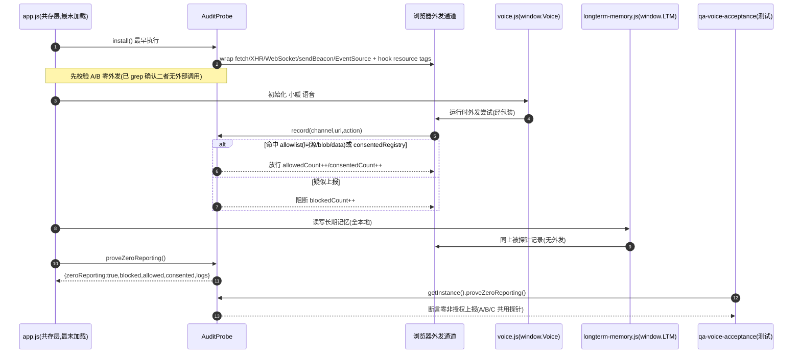
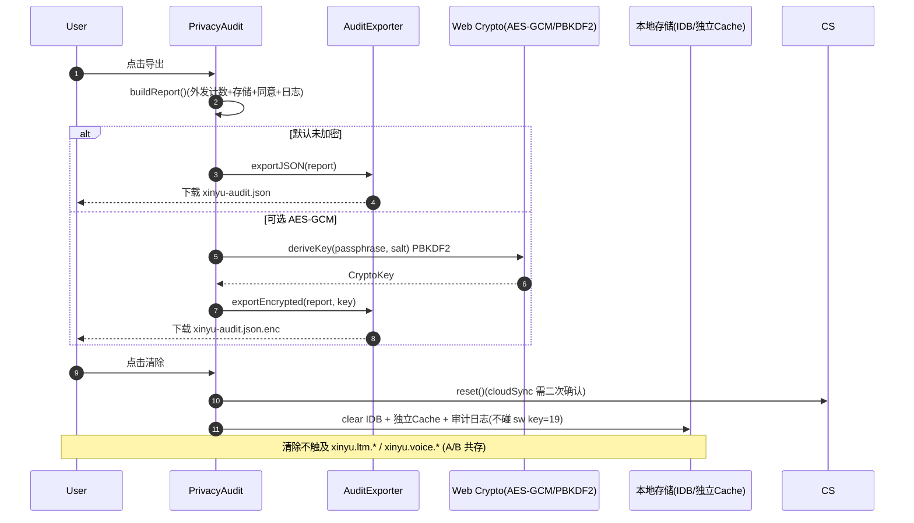
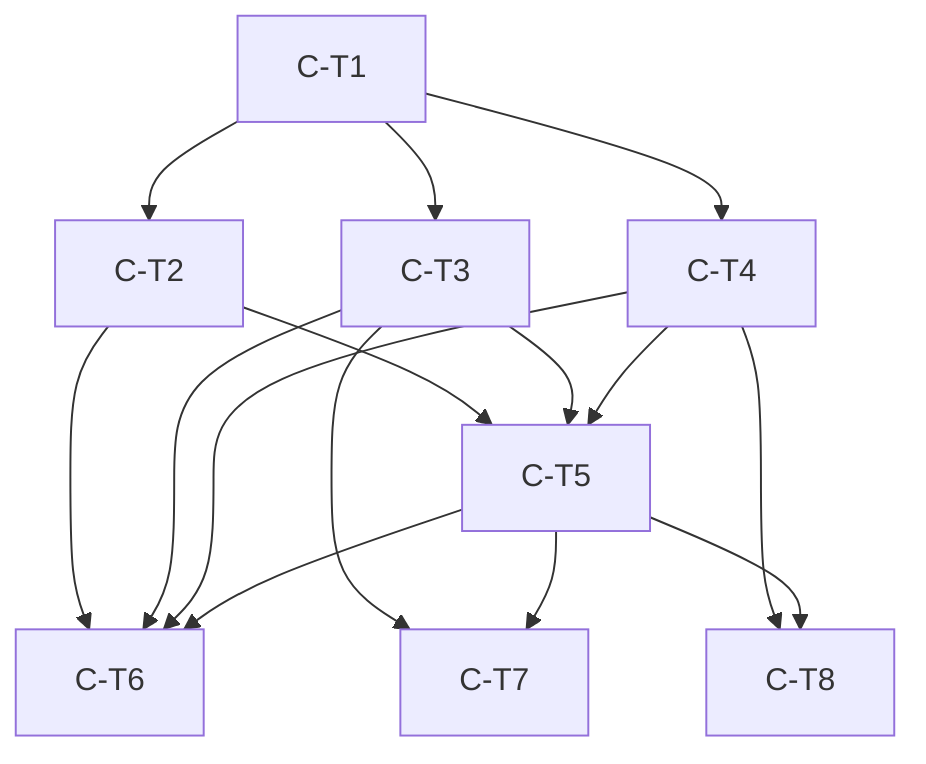

# 心屿 Xinyu v3 隐私/端侧增强（候选 C）架构设计

> 文档归属：候选 C（隐私/端侧增强），顺序于 v2 + 候选 A（长期记忆，提交 3833226）+ 候选 B（多模态语音，提交 94dd82b）之后开发；main 已同步 gitee。
> 产出方：架构师 高见远(Gao)；中转：主理人 齐活林；落地：工程师。
> 铁律贯穿：小暖 不更名/不替换/不意译；隐私优先、默认零上报；前端零依赖、零新增 npm 依赖；冻结线 `engine.js` / `sw.js` / `test/baseline.js` / `memory.js` 零改动；A/B 复用共存不退化。

## 文档对应声明（避免与 A/B 混淆）
- **A 设计文档**：`ai-girlfriend/docs/`（长期记忆 `longterm-memory.js` + `ltm-ui.js`，见 `DESIGN-xinyu-v3-memory.md` 等）。
- **B 设计文档**：`/workspace/docs/`（多模态语音 `voice.js`，见 `system_design_voice_B.md` 等）。
- **本候选 C 三份文档统一落在 `ai-girlfriend/docs/`**：
  - `ai-girlfriend/docs/DESIGN-xinyu-v3-privacy.md`（本文）
  - `ai-girlfriend/docs/class-diagram-xinyu-v3-privacy.mermaid`
  - `ai-girlfriend/docs/sequence-diagram-xinyu-v3-privacy.mermaid`

---

## 1. 实现方案概述 + 框架选型

### 1.1 框架选型（铁律确认）
- **纯原生 JavaScript（经典 `<script>` + `window` 全局，零打包器、零运行时外部依赖）**。现有代码库即采用该模式（`engine.js`/`localmodel.js`/`voice.js` 均 IIFE 挂 `window`），候选 C 完全沿用，不引入任何构建链或 npm 包。
- 仅依赖浏览器原生能力：`fetch` / `XMLHttpRequest` / `WebSocket` / `navigator.sendBeacon` / `EventSource` / `Cache API` / `IndexedDB` / `localStorage` / `Web Crypto(AES-GCM/PBKDF2)` / `Web Speech API(TTS/ASR)` / `navigator.onLine`。
- 新模块统一以 IIFE 挂 `window`（如 `window.AuditProbe`），经 `index.html` 在 `app.js` 之前按序引入，`app.js`（最后加载）做共存编排。

### 1.2 现有接缝核实（避免设计出不存在的接口）
- **`engine.js`**：纯本地规则引擎，暴露 `Engine.reply(text, state)` 等，**源码无任何 `fetch`/外部调用**，且**没有 provider 注册接口**。→ C2 的「云端→本地」路由只能在 `app.js` 共存层实现，天然满足「不修改 engine.js」。
- **云端对话边界**：位于 `app.js` 的 `S.cloud`（OpenAI/DeepSeek 兼容 `fetch`，约 line 1355/1452/1508/1561/1657）。`LocalModel`（`localmodel.js`，**已存在**，`window.LocalModel.load/reply`）为既有端侧推理模块。
- **`voice.js` / `longterm-memory.js`**：经 grep 确认**零 `fetch`/`XHR`/`WebSocket`/`sendBeacon`/`import()` 外部调用** → C1「先校验 A/B 零外发」可直接通过。
- **既有 `test/qa-voice-acceptance.test.js`** 已实现 `fetch/XHR/sendBeacon` 计数包装与「源文件无外发字面」断言，正是零上报探针的雏形，C 直接复用其模式。
- **加载顺序（`index.html`）**：`engine → memory → presence → texture → contingency → localmodel → caption → LTM → ltm-ui → voice → app.js`。`app.js` 最末，故 `AuditProbe` 在 `app.js` 最早位置注入即可覆盖其后全部运行时外发（各模块仅在用户交互时 `fetch`，加载期不联网）。

### 1.3 P0 目标技术路径
- **C1 零上报强化（统一外发拦截探针）**：新增 `audit-probe.js`（`window.AuditProbe`），在 `app.js` 最早处 `install()`，对 `fetch/XHR/WebSocket/sendBeacon/EventSource` 做原型/构造器包装，并对 `img/script/link` 等 `createElement` 做资源标签钩子，统一经 `record(channel,url,action)` 收集。三类处置：
  1. `allowlist`（同源 / `blob:` / `data:`）→ 放行，`allowedCount++`；
  2. `consentedRegistry`（用户显式开启的端点，如 `S.cloud` base、云同步/推送 base，由 `app.js` 注册）→ 放行并 `consentedCount++`，在审计面板可见；
  3. 其余（疑似上报/第三方追踪）→ **阻断**，`blockedCount++`。
  `proveZeroReporting()` 返回 `{zeroReporting, blocked, allowed, consented, logs}`，断言 **blocked(非授权上报)==0**。先对 `voice.js`/`longterm-memory.js` 跑该证明（必过），再覆盖全应用。探针实例 `getInstance()` 对 A/B/C 与 `qa-voice-acceptance` 测试共用。
- **C2 本地模型热切换（绕开 engine.js）**：新增 `reply-router.js`（`window.ReplyRouter`）+ `local-heuristic.js`（原生启发式兜底，零外部依赖），**复用既有 `localmodel.js`**（仅作 adapter 基座，不改其语义）。三者均实现设计态契约 `ReplyProvider.generate(prompt,ctx)/isAvailable()`：`CloudChatProvider`（包装 `app.js` 的 `S.cloud` fetch）、`LocalModelAdapter`（包装 `window.LocalModel`）、`LocalHeuristic`（原生）。`app.js` 调用 `ReplyRouter.registerProviders([cloud, local, heuristic])` 表达优先级 `[cloud→local→heuristic]`；路由层承担 **8s 超时 / 连续 2 次失败 / 401 立即降级**，触发时转交 `LocalModelAdapter`，再失败转 `LocalHeuristic`。`engine.js` 全程零改动。
- **C3 离线 PWA 加固（绕开冻结 sw.js）**：**严禁改动 `sw.js`（v14，缓存键=19）与 `manifest` 指纹**。`offline-probe.js`（`window.OfflineProbe`）用 `navigator.onLine` + 同源探测判定 `online/degraded/offline` 三态；`cache-warmer.js` 经 **独立命名空间 Cache（如 `xinyu-edge-v1`）** 预热关键静态资源，**绝不读写 key=19**；`offline-indicator.js` 顶栏展示三态。所有离线能力绕开 sw，由独立策略层驱动。
- **C4 隐私审计面板**：`privacy-audit.js`（`window.PrivacyAudit`）聚合 `AuditProbe`（外发计数）、`ConsentStore`（TTS/ASR/LTM/云同步同意）、`OfflineProbe`（离线态）、`getStorageUsage()`（IndexedDB 估算 + localStorage 字节 + 独立 Cache 字节），渲染用户可见面板，提供导出（默认未加密 JSON，可选 AES-GCM）与清除。
- **C5 冻结合规 + A/B 回归基线**：冻结线 `engine.js/sw.js/test/baseline.js/memory.js` 零改动；`app.js` 仅叠加共存逻辑；A/B 功能不退化。新增独立回归 `test/c-regression.js`（**不触碰冻结的 baseline.js**），复用 `AuditProbe` 与 `qa-voice-acceptance` 模式断言零上报与 A/B 不退化。

### 1.4 关键决策与澄清（必读）
- **D1（`localmodel.js` 的 CDN/transformers.js 与铁律「仅原生浏览器 API」的张力）**：既有 `localmodel.js` 通过 `import(https://cdn.jsdelivr.net/.../transformers@4.2.0)` 下载 Qwen2.5-0.5B 权重，属**运行时用户主动发起的本地资源拉取**（非 npm 依赖，满足「零新增 npm 依赖」），但与「仅原生浏览器 API / 平台不下载外部模型」的精神有冲突。裁定（建议采纳）：
  - **默认离线兜底 = `LocalHeuristic`（原生 JS 启发式，零外部依赖）**，彻底满足铁律；
  - `localmodel.js` 的 transformers.js 路径保留为**可选、显式同意门控的「用户自导权重」模式**：仅在用户于本地模型管理 UI 主动点击加载时触发，属用户主动发起的本地资源拉取（非上报），在 `AuditProbe` 中登记为 `consented` 并记入审计，绝不自动运行、绝不上报。
  - 若主理人要求**彻底移除** transformers.js/外部下载路径，则候选 C 将 `localmodel.js` 收敛为仅 `LocalHeuristic` 包装，并删除 CDN `import`（仍属非冻结文件，可改）。
- **D2（「默认零上报」的语义边界）**：`app.js` 现存 `S.cloud` 云端对话、`syncBase()` 云同步、`pushBase()` 推送均为**用户显式开启的功能**，非默认开启的埋点。裁定：默认态下 小暖 走本地 `engine.js`+`LocalHeuristic`，**无隐式外发**；任何外发均为 consented 且面板可见 → 满足「默认零上报、不采集、不共享、不上云」。建议将 `S.cloud` 默认置关（属 `app.js` 配置默认值调整，允许），以最严格契合铁律；若保留默认开，须在审计面板显著标注其为用户已授权外发。
- 以上 D1/D2 已按 PRD Q1–Q8 默认决策精神给出建议裁定；如无异议即落地。

---

## 2. 文件列表及相对路径

### 2.1 新增文件（候选 C）
- `ai-girlfriend/audit-probe.js` — 零上报统一拦截探针（C1）
- `ai-girlfriend/reply-router.js` — 云端→本地优先级路由（C2，共存层）
- `ai-girlfriend/local-heuristic.js` — 原生启发式本地推理（C2 默认兜底，零外部依赖）
- `ai-girlfriend/offline-probe.js` — 离线探测与三态（C3）
- `ai-girlfriend/cache-warmer.js` — 独立 Cache 命名空间预热（C3/C9）
- `ai-girlfriend/privacy-audit.js` — 隐私审计面板控制器（C4）
- `ai-girlfriend/privacy-audit.css` — 审计面板与指示灯样式（C4/C11）
- `ai-girlfriend/consent-store.js` — 同意状态存储（共享，C4/C8）
- `ai-girlfriend/csp-inject.js` — CSP report-only 注入（C6）
- `ai-girlfriend/local-model-ui.js` — 本地模型管理 UI（C7）
- `ai-girlfriend/consent-ui.js` — 精细同意开关 UI（C8）
- `ai-girlfriend/audit-export.js` — 审计日志导出 JSON / AES-GCM（C10）
- `ai-girlfriend/offline-indicator.js` — 离线三态指示灯动效（C11）
- `ai-girlfriend/privacy-score.js` — 本地隐私评分（C12）
- `ai-girlfriend/diagnostic-report.js` — 本地诊断报告（仅本地，C14）
- `ai-girlfriend/test/c-regression.js` — C 冻结合规 + A/B 回归（不碰 baseline.js）
- `ai-girlfriend/docs/DESIGN-xinyu-v3-privacy.md`
- `ai-girlfriend/docs/class-diagram-xinyu-v3-privacy.mermaid`
- `ai-girlfriend/docs/sequence-diagram-xinyu-v3-privacy.mermaid`

### 2.2 改动文件（仅共存叠加 / 配置，不覆盖 B 逻辑、不碰冻结线）
- `ai-girlfriend/app.js` — 最早注入 `AuditProbe.install()`；注册 `ReplyRouter` 优先级与 `CloudChatProvider`；启动 `OfflineProbe`/`PrivacyAudit`/`ConsentStore`；挂载面板与指示灯；注册 consented 端点；可选将 `S.cloud` 默认置关。**仅叠加，不删除/改写 B 已合入逻辑。**
- `ai-girlfriend/index.html` — 在 `app.js` 之前新增 C 模块的 `<script>` 引入（`audit-probe`/`offline-probe`/`privacy-audit`/`consent-store`/`cache-warmer`/`offline-indicator` 等）。**仅追加 `<script>` 标签，不改动既有加载顺序与冻结文件引用。**
- `ai-girlfriend/localmodel.js` — **已存在，候选 C 默认不复写其语义**；仅作为 `LocalModelAdapter` 基座被 `reply-router` 包装。仅在 D1 采纳「彻底移除外部下载」时做收敛修改（非冻结，可改）。

### 2.3 复用但不改动（A/B 源码，共存）
- `voice.js`（B，多模态语音，`window.Voice`）
- `longterm-memory.js`（A，长期记忆，`window.LTM`）
- `ltm-ui.js`（A，长期记忆 UI，`window.LTMUI`）
- `caption.js`（既有视觉描述，零改）
- `engine.js` 的 `Engine.reply` 等纯函数被 `app.js` 继续调用，候选 C 不改动 engine。

### 2.4 冻结线（**不出现在任何改动清单中**）
- `ai-girlfriend/engine.js`（无 provider 接口，C2 完全绕开）
- `ai-girlfriend/sw.js`（v14，缓存键=19）
- `ai-girlfriend/test/baseline.js`（git 差分基线模块）
- `ai-girlfriend/memory.js`
- `ai-girlfriend/manifest.*`（指纹冻结）
> 任何方案若触及上述文件一律否决。C2/C3 已通过「共存层路由 + 独立 Cache 命名空间」绕开。

---

## 3. 数据结构与接口（类图）
（完整 Mermaid 见 `class-diagram-xinyu-v3-privacy.mermaid`；下方为同一图嵌入，便于单文件审阅）

```mermaid
classDiagram
    direction TB

    class AuditProbe {
        +Number blockedCount
        +Number allowedCount
        +Number consentedCount
        +Array~ProbeLog~ probeLog
        +Set~String~ allowlist
        +Set~String~ consentedRegistry
        +install() void
        +wrapFetch() void
        +wrapXHR() void
        +wrapWebSocket() void
        +wrapSendBeacon() void
        +wrapEventSource() void
        +hookResourceTags() void
        +record(channel, url, action) void
        +registerConsented(pattern) void
        +proveZeroReporting() Object
        +getReport() Object
        +reset() void
        +getInstance() AuditProbe
    }

    class ReplyProvider {
        <<interface>>
        +generate(prompt, ctx) Promise~String~
        +isAvailable() Boolean
    }

    class CloudChatProvider {
        +String base
        +String model
        +Number timeoutMs
        +Number failCount
        +generate(prompt, ctx) Promise~String~
        +isAvailable() Boolean
    }

    class LocalModelAdapter {
        +Boolean enabled
        +generate(prompt, ctx) Promise~String~
        +isAvailable() Boolean
        +ensureLoaded() Promise~void~
    }

    class LocalHeuristic {
        +generate(prompt, ctx) Promise~String~
        +isAvailable() Boolean
        +ruleReply(text) String
    }

    class ReplyRouter {
        +Array~ReplyProvider~ providers
        +registerProviders(list) void
        +route(prompt, ctx) Promise~String~
        +onDegrade(cb) void
    }

    class OfflineProbe {
        +String state
        +Number lastCheck
        +String cacheName
        +Number checkInterval
        +start() void
        +checkConnectivity() Promise~String~
        +warmCache(resources) Promise~void~
        +getState() String
        +onChange(cb) void
    }

    class CacheWarmer {
        +String cacheName
        +warm(list) Promise~void~
        +preloadCritical() Promise~void~
    }

    class ConsentStore {
        +Boolean tts
        +Boolean asr
        +Boolean ltm
        +Boolean cloudSync
        +String version
        +load() void
        +save() void
        +get(key) Boolean
        +set(key, val) void
        +isGranted(key) Boolean
        +reset() void
    }

    class PrivacyAudit {
        +AuditProbe probe
        +ConsentStore consent
        +OfflineProbe offline
        +render(container) void
        +refreshMetrics() Promise~void~
        +exportLogs(format, encrypt, pass) Promise~void~
        +clearAll() Promise~void~
        +getStorageUsage() Promise~Object~
    }

    class AuditExporter {
        +exportJSON(report) Blob
        +exportEncrypted(report, key) Promise~Blob~
        +deriveKey(passphrase, salt) Promise~CryptoKey~
    }

    class ConsentUI {
        +render(container) void
        +bindSwitch(key, el) void
    }

    class LocalModelUI {
        +render(container) void
        +toggleModel() void
        +showWeights() void
    }

    class CspInjector {
        +injectReportOnly() void
        +handleReport(e) void
    }

    class OfflineIndicator {
        +mount(anchor) void
        +setState(state) void
        +animate() void
    }

    class PrivacyScore {
        +compute(metrics) Number
        +grade(score) String
    }

    class DiagnosticReport {
        +build() Object
        +shareLocal() void
    }

    ReplyProvider <|.. CloudChatProvider : 实现
    ReplyProvider <|.. LocalModelAdapter : 实现
    ReplyProvider <|.. LocalHeuristic : 实现
    ReplyRouter o-- ReplyProvider : 持有优先级列表
    PrivacyAudit --> AuditProbe : 读外发计数
    PrivacyAudit --> ConsentStore : 读同意态
    PrivacyAudit --> OfflineProbe : 读离线态
    PrivacyAudit --> AuditExporter : 导出
    PrivacyAudit --> ConsentUI : 内嵌开关
    PrivacyAudit --> PrivacyScore : 评分
    PrivacyAudit --> DiagnosticReport : 诊断
    OfflineProbe --> CacheWarmer : 预热独立Cache
    OfflineProbe --> OfflineIndicator : 驱动三态
    LocalModelUI --> LocalModelAdapter : 管理
    CspInjector ..> AuditProbe : 违规进本地审计
    ConsentStore ..> ConsentUI : 绑定
```



---

## 4. 程序调用流程（时序图）
（完整 Mermaid 见 `sequence-diagram-xinyu-v3-privacy.mermaid`；下方为 4 条关键流程）

### 4.1 ① 零上报拦截与证明（C1）


### 4.2 ② 本地模型热切换降级（C2）
```mermaid
sequenceDiagram
    autonumber
    participant App as app.js
    participant Router as ReplyRouter(共存层)
    participant Cloud as CloudChatProvider(S.cloud fetch)
    participant Local as LocalModelAdapter(window.LocalModel)
    participant Heur as LocalHeuristic(原生启发式)
    participant Probe as AuditProbe

    App->>Router: registerProviders([cloud, local, heuristic])
    Note over App,Router: 优先级 cloud→local→heuristic;engine.js 零改动
    App->>Router: route(prompt, ctx) 小暖 对话
    Router->>Cloud: generate(prompt,ctx) 8s 超时
    Cloud->>Probe: record(外发, S.cloud base, consented)
    alt 超时/401/连续2次失败
        Cloud-->>Router: reject
        Router->>Router: failCount++; 401或连续2次→降级
        Router->>Local: generate(prompt,ctx)
        alt LocalModel 已加载
            Local-->>Router: 端侧回复
        else 未加载/失败
            Router->>Heur: generate(prompt,ctx)
            Heur-->>Router: 原生启发式回复(零外部依赖)
        end
        Router-->>App: 降级响应(degraded 标记)
    else 云端正常
        Cloud-->>Router: 云端回复(online 标记)
    end
    Router-->>App: 响应 + online/degraded
```

### 4.3 ③ 离线状态探测与面板刷新（C3/C4）
```mermaid
sequenceDiagram
    autonumber
    participant App as app.js
    participant Off as OfflineProbe
    participant Cache as Cache API(独立命名空间)
    participant UI as PrivacyAudit(面板)
    participant Probe as AuditProbe
    participant CS as ConsentStore
    participant Ind as OfflineIndicator

    App->>Off: start(interval)
    loop 周期探测(绕开 sw.js)
        Off->>Off: checkConnectivity()(onLine+同源探测)
        Off->>Cache: 仅读独立 ns(如 xinyu-edge-v1),不碰 sw key=19
        Off->>Off: setState(online/degraded/offline)
        Off->>Ind: setState(state)
        Ind->>Ind: animate() 三态动效
    end
    App->>UI: render(面板)
    UI->>Probe: getReport()→外发计数
    UI->>CS: get(tts/asr/ltm/cloudSync)
    UI->>Off: getState()
    UI->>UI: getStorageUsage()(IDB估算+localStorage+独立Cache)
    UI->>UI: refreshMetrics() 渲染
    Note over App,UI: sw.js(v14)与 manifest 指纹未改动
```

### 4.4 ④ 审计导出 / 清除（C4/C10）


---

## 5. 任务列表（有序、含依赖、按实现顺序）

任务按模块/阶段分组（非单文件拆分），P0 优先且满足冻结约束。命名 `C-T1…C-T8`，第一组为基础设施。

### C-T1：共存基础设施与冻结合规挂载点（P0 基础）
- **目标**：在 `app.js` 建立共存叠加层；最早注入 `AuditProbe` 安装点；在 `index.html` 追加 C 模块 `<script>`；建立 `ConsentStore`；校验冻结线零改动。
- **产出文件**：`app.js`（改动）、`index.html`（改动）、`consent-store.js`（新增）
- **依赖**：无
- **验收点**：
  - git diff 证明 `engine.js/sw.js/test/baseline.js/memory.js/manifest` 未被修改；
  - `app.js` 最早期调用 `AuditProbe.install()`，且位于 `voice.js`/`longterm-memory.js` 运行时外发之前；
  - `index.html` 仅追加 `<script>`，既有顺序（含 B 已合入）不动；
  - B 已合入逻辑完整保留（语音/对话可用）；`ConsentStore` 默认 TTS/ASR/LTM=true、cloudSync=false 且需二次确认。

### C-T2：C1 零上报统一拦截探针（P0）
- **目标**：实现 fetch/XHR/WebSocket/sendBeacon/EventSource/资源标签统一拦截；先验证 `voice.js`、`longterm-memory.js` 零外发，再覆盖全应用；提供运行时证明。
- **产出文件**：`audit-probe.js`（新增）、`app.js`（挂载 install + 注册 consented 端点）、`index.html`（追加 script）
- **依赖**：C-T1
- **验收点**：
  - 六大外发通道全部被包装，第三方资源标签被钩子监控；
  - `proveZeroReporting()` 对 A/B 模块返回 `zeroReporting=true`、`blocked==0`；
  - 同源/blob/data 放行计 allowed；疑似上报阻断计 blocked 并进入审计；
  - `qa-voice-acceptance` 与新增 `test/c-regression.js`（不改动 baseline.js）可 import 同一 `AuditProbe` 实例断言。

### C-T3：C2 本地模型热切换 adapter（P0）
- **目标**：新增 `reply-router.js` + `local-heuristic.js`，复用 `localmodel.js` 作 adapter 基座；`app.js` 注册优先级 `[cloud→local→heuristic]` 与弹性降级（8s 超时/连续 2 次失败/401 立即降级）。
- **产出文件**：`reply-router.js`（新增）、`local-heuristic.js`（新增）、`app.js`（注册 provider + CloudChatProvider 包装 S.cloud）、`localmodel.js`（默认不改动；若 D1 采纳移除外部下载则收敛）
- **依赖**：C-T1
- **验收点**：
  - `engine.js` 零改动；云端对话边界为 `app.js` 的 `S.cloud` fetch，由 `CloudChatProvider` 包装；
  - 云端 8s 超时触发降级；连续 2 次失败触发降级；401 立即降级；
  - `LocalHeuristic` 原生启发式可用（零外部依赖），小暖 在降级/离线态仍可持续对话；
  - 平台不自动下载外部模型；transformers.js 路径（若存在）仅用户显式同意下触发并记 consented。

### C-T4：C3 离线 PWA 绕开策略层（P0）
- **目标**：新增 `offline-probe.js` + `cache-warmer.js`（独立 Cache 命名空间）；实现 online/degraded/offline 三态，绕开冻结 sw。
- **产出文件**：`offline-probe.js`（新增）、`cache-warmer.js`（新增）、`index.html`（追加 script）、`app.js`（start）
- **依赖**：C-T1
- **验收点**：
  - `sw.js`（v14 key=19）与 `manifest` 指纹零改动；
  - 新增独立 Cache 命名空间（如 `xinyu-edge-v1`），绝不读写 key=19；
  - 三态判定（onLine + 同源探测）正确；`CacheWarmer` 可预热关键同源静态资源。

### C-T5：C4 隐私审计面板（P0）
- **目标**：新增 `privacy-audit.js` + `privacy-audit.css` + `consent-ui.js`；聚合外发计数/存储占用/同意状态/离线态，提供导出与清除入口。
- **产出文件**：`privacy-audit.js`、`privacy-audit.css`、`consent-ui.js`（新增）、`index.html`（追加 script）、`app.js`（挂载面板）
- **依赖**：C-T2、C-T3、C-T4
- **验收点**：
  - 面板展示外发计数（来自 AuditProbe）、IndexedDB/localStorage/独立 Cache 占用、TTS/ASR/LTM/云同步同意态；
  - 导出（默认未加密 JSON）、清除功能可用且清除不碰 sw key=19、不触及 `xinyu.ltm.*`/`xinyu.voice.*`；
  - 小暖 身份/名称未在任何 UI 文案中被改写。

### C-T6：C5 冻结合规 + A/B 回归基线（P0 收尾）
- **目标**：以冻结 `test/baseline.js`（不改动）+ 新增 `test/c-regression.js` 复用 `AuditProbe` 断言；确认 A/B 功能不退化、冻结线零改动、app.js 共存叠加。
- **产出文件**：`test/c-regression.js`（新增，不碰 baseline.js）；无源码改动
- **依赖**：C-T2、C-T3、C-T4、C-T5
- **验收点**：
  - 冻结四文件 git diff 为空；
  - A（长期记忆读写/ltm-ui）、B（语音 TTS/ASR）端到端回归通过；
  - 零上报断言在 A/B/C 共用探针上通过；独立 QA 验收签字。

### C-T7：P1 增强（C6 CSP / C7 本地模型 UI / C9 缓存预热并入 / C10 导出加密）
- **目标**：`csp-inject.js` 注入 CSP report-only 并回传本地审计；`local-model-ui.js` 管理本地模型开关/权重；`cache-warmer` 预热策略完善；`audit-export.js` 支持 AES-GCM 可选加密。
- **产出文件**：`csp-inject.js`、`local-model-ui.js`、`audit-export.js`（新增）；`cache-warmer.js`（扩展）；`privacy-audit.js`（接 export）；`index.html`（追加 script）
- **依赖**：C-T3、C-T5
- **验收点**：
  - CSP report-only 注入，违规上报进入本地审计而非外发；
  - 本地模型 UI 可切换/查看权重（含 D1 的 transformers 路径门控）；
  - 导出默认未加密 JSON，勾选后 AES-GCM 加密（PBKDF2 派生密钥），密钥不落地。

### C-T8：P2 增强（C11 指示灯动效 / C12 隐私评分 / C13 ltm-ui 共存 / C14 诊断报告）
- **目标**：`offline-indicator.js` 三态动效；`privacy-score.js` 本地评分；与 `ltm-ui.js` 共存整合；`diagnostic-report.js` 本地诊断报告分享（绝不上云）。
- **产出文件**：`offline-indicator.js`、`privacy-score.js`、`diagnostic-report.js`（新增）；`privacy-audit.js`（接入评分/报告）；`privacy-audit.css`（动效）；`index.html`（追加 script）
- **依赖**：C-T4、C-T5
- **验收点**：
  - 顶栏常驻在线/降级/离线三态指示灯带动效；
  - 本地隐私评分可计算并展示；
  - 与 `ltm-ui.js` 共存无冲突；
  - 诊断报告仅本地生成/分享，代码中无任何上云路径。

### 任务依赖图


---

## 6. 依赖包列表
**空。零新增 npm 依赖。** 仅使用浏览器原生 API（fetch / XHR / WebSocket / sendBeacon / EventSource / Cache API / IndexedDB / localStorage / Web Crypto / Web Speech API / navigator.onLine）。
> 说明：既有 `localmodel.js` 对 transformers.js 的 `import()` 属运行时用户主动发起的本地资源拉取（非 npm 依赖）；按 D1 裁定，默认离线兜底改为零依赖的 `LocalHeuristic`，`localmodel.js` 外部下载路径仅用户显式同意下启用。

---

## 7. 共享知识（跨文件约定）

### 7.1 localStorage / IndexedDB 命名空间约定
- `xinyu.consent` — ConsentStore（TTS/ASR/LTM/cloudSync 同意态，JSON）。
- `xinyu.audit` — AuditProbe 计数器与最近日志摘要。
- `xinyu.ltm.*` — A（`longterm-memory.js`）长期记忆，**只读共存**，C 不写入。
- `xinyu.voice.*` — B（`voice.js`）语音状态，**只读共存**，C 不写入。
- `xinyu.offline` — OfflineProbe 最近三态缓存。
- `xinyu.localmodel` — 本地模型权重/预热态（用户自导权重时落盘）。
- `xinyu.audit.export.*` — 审计导出缓存（清除时可清）。
> 任何 C 模块禁止写入 `xinyu.ltm.*` / `xinyu.voice.*`，确保 A/B 不被污染。

### 7.2 统一外发拦截器安装点与拦截接口
- **安装点**：`app.js` 最早期（其 `<script>` 已在 `app.js` 之前引入）调用 `window.AuditProbe.install()`，须早于 `voice.js`/`longterm-memory.js` 的任意运行时外发。
- **拦截接口**（供所有模块隐式复用，无需各自实现）：
  - `record(channel: 'fetch'|'xhr'|'ws'|'beacon'|'eventsource'|'resource', url: string, action: 'allowed'|'consented'|'blocked'): void`
  - `allowlist: Set<string>` — 仅含同源、`blob:`、`data:`；其余进入 consented/blocked 判定。
  - `consentedRegistry: Set<pattern>` — 由 `app.js` 注册用户显式开启的端点（S.cloud base、syncBase、pushBase）。
- 探针实例通过 `AuditProbe.getInstance()` 单例暴露，A/B/C 与测试共用同一实例。

### 7.3 ReplyProvider 契约（C2 路由，不涉及 engine.js）
- 设计态契约（非 engine.js 接口）：`generate(prompt: string, ctx?: object): Promise<string>` 与 `isAvailable(): boolean`。
- 实现者：`CloudChatProvider`（包装 `app.js` 的 `S.cloud` fetch）、`LocalModelAdapter`（包装既有 `window.LocalModel`）、`LocalHeuristic`（原生启发式）。
- `ReplyRouter.registerProviders([cloud, local, heuristic])` 表达优先级；路由层持有超时/失败计数与降级判定，**不写入 engine.js**。

### 7.4 零上报断言复用（A/B/C 共用探针）
- `AuditProbe.proveZeroReporting()` 返回 `{ zeroReporting: boolean, blocked: number, allowed: number, consented: number, logs: ProbeLog[] }`。
- 现有 `test/qa-voice-acceptance.test.js`（非冻结）已用同类计数包装；候选 C 新增 `test/c-regression.js` 通过 `AuditProbe.getInstance().proveZeroReporting()` 断言零非授权上报，并校验 A/B 不退化；冻结的 `test/baseline.js` 保持不动。

### 7.5 独立 Cache 命名空间约定（绕开 sw key=19）
- 新增 Cache 名：`xinyu-edge-v1`（语义化版本），**绝不读写 `sw.js` 的 key=19**。
- 预热资源清单由 `cache-warmer.js` 维护，仅含同源静态资源（JS/CSS/图标/字体）。

### 7.6 同意默认与二次确认
- TTS/ASR/LTM 默认 `true`（隐私优先但功能可用）；cloudSync 默认 `false`，开启需二次确认弹窗。
- 清除操作：清除审计/本地模型数据不碰 `sw key=19` 与 A/B 命名空间；cloudSync 相关数据清除需二次确认。
- D1 的 transformers.js 权重加载：仅用户于本地模型 UI 主动触发，且事先明确告知「将从 HuggingFace CDN 拉取权重（一次性本地缓存）」，记 consented。

---

## 8. 待明确事项
- **已采纳 PRD Q1–Q8 默认决策**：
  - 热切换：超时 8s / 连续 2 次失败降级 / 401 立即降级；
  - 允许新增独立 Cache 不碰 key=19；
  - 导出默认未加密 JSON、可选 AES-GCM；
  - 运行时拦截器证明 + CSP report-only 报表（本地审计）；
  - 平台不托管/不下载外部模型（内置轻量启发式本地推理或用户自导权重）；
  - localmodel 作 adapter，engine.js 公开接口不变（注：核实 engine.js 无 provider 接口，路由改在 app.js 共存层，更彻底满足「不修改 engine.js」）；
  - TTS/ASR/LTM 默认开、云同步默认关需二次确认；
  - 顶栏常驻在线/降级/离线三态指示灯。
- **需主理人拍板（建议按 D1/D2 裁定落地，无阻塞）**：
  - **D1**：默认离线兜底采用零依赖 `LocalHeuristic`、transformers.js 路径保留为可选同意门控（推荐）；或彻底移除外部下载路径。
  - **D2**：`S.cloud` 默认置关（最严格契合铁律，推荐）；或保留默认开但面板显著标注为已授权外发。
- 其余无待澄清项；若后续调整热切换阈值，仅需改 `app.js`/`reply-router.js` 共存层常量，不触及冻结线。
