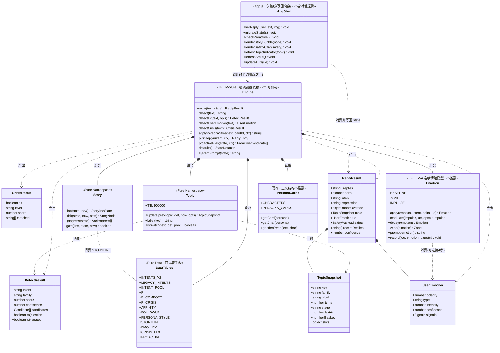
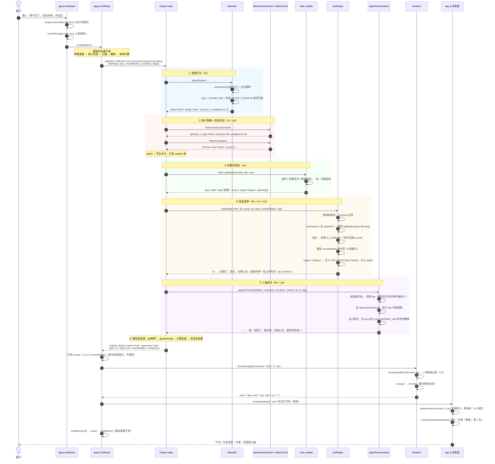
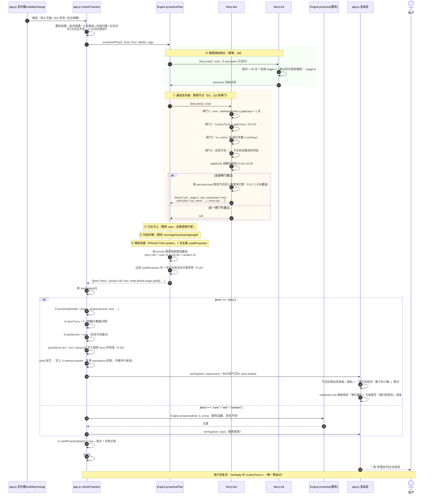
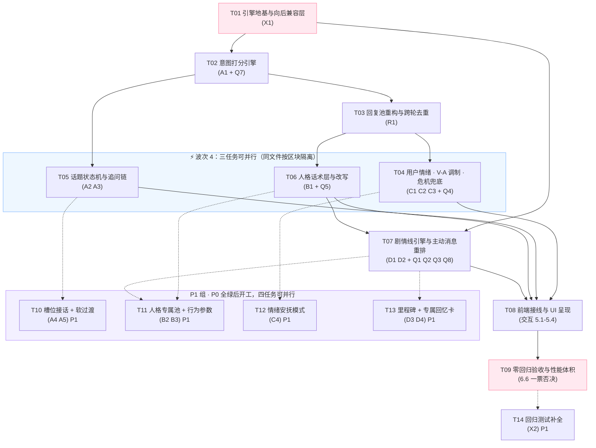

# 小暖 · 对话与人格系统升级 · 系统设计与任务分解

| 项 | 内容 |
|---|---|
| 文档类型 | 增量系统设计 + 任务分解（在线上 v10.0.0 代码上做升级） |
| 需求来源 | `docs/PRD-对话人格系统升级.md`（P0 × 11 / P1 × 8 / P2 × 5） |
| 架构师 | 高见远 |
| 目标版本 | v11.0.0 |
| 技术栈 | 原生 JavaScript（ES2020）+ HTML + CSS，**零 npm 依赖、零构建工具** |
| 交付文件 | `engine.js` / `app.js` / `index.html` / `style.css` / `test/*`（新增） |
| 阅读对象 | 工程师 寇豆码 |

## 目录

- [一、实现方案概述](#一实现方案概述)
- [二、框架与技术选型](#二框架与技术选型)
- [三、文件列表](#三文件列表)
- [四、数据结构与接口设计](#四数据结构与接口设计)
- [五、程序调用流程](#五程序调用流程)
- [六、任务列表](#六任务列表)
- [七、共享知识（跨文件约定）](#七共享知识跨文件约定)
- [八、风险与待明确事项](#八风险与待明确事项)

---

## 一、实现方案概述

### 1.1 一句话方案

> 在 `engine.js` 内部**沿数据流方向插入五个纯函数管道段**（意图打分 → 用户情绪 → 话题状态机 → 回复选择 → 人格改写），把原来"一次正则匹配 + 一次随机抽取"的两步流程，改造成"**打分 → 理解 → 追踪 → 择优 → 改写**"的五步流水线；所有新状态以**可选字段进、返回值出**，`app.js` 只做"接线 + 写回 + 渲染"，不承担任何对话逻辑。

### 1.2 现状流水线 vs 目标流水线

```
【现状 · engine.js reply()】
text ──► detect() 顺序正则，首个命中即返回
      ──► R[intent] 按 lv/mood 过滤
      ──► pick() 随机抽一条（只防相邻复读）
      ──► {N} 称呼替换 → genderSwap → 18% 概率追加心情后缀
      ──► return { replies, delta, intent, expression, moodOverride }

【目标 · engine.js reply()】
text ──► ① detectEx()          加权打分 → {intent, score, confidence, candidates}
      ──► ② detectUserEmotion() 用户情绪 → {polarity, type, intensity, confidence, crisis}
      ──► ③ Topic.update()      话题状态机 → {key,label,turns,stage,slots,asked}（纯函数，不写 state）
      ──► ④ pickReply()         ue/tag 过滤 + 跨轮去重窗口 + 追问链注入
      ──► ⑤ applyPersonaStyle() 人格口癖改写（opener/filler/ender/emoji/禁用词）
      ──► ⑥ 既有后处理           {N} 称呼 → genderSwap → 心情后缀 → postProcessReply
      ──► return { replies, delta, intent, expression, moodOverride,
                   /* 新增，全部可选、调用方可忽略 */
                   topic, ue, safety, storyHint, recentReplies }
```

### 1.3 为什么这样切分模块

| 切分 | 理由 |
|---|---|
| **五段全部落在 `engine.js` 内、且互为纯函数** | 4 个调用点里有 2 个跑在 Node `vm` 中（`bridge` / `openclaw`）。逻辑一旦外溢到 `app.js`，企微双向桥与 OpenClaw 供应商就会和网页端体验分叉，这是长期维护灾难。**规则层的智力必须全部沉在引擎里。** |
| **管道段之间只靠"值对象"通信，不共享可变状态** | 每段都能被 `test/engine.test.js` 单独喂输入、单独断言输出，不需要构造完整 `state`。这是 PRD 六章 34 条验收指标能被自动化的前提。 |
| **新状态"可选字段进、返回值出"，引擎绝不改写传入对象以外的东西** | 直接满足 X1 的硬约束：`app.js:1642`（语音通话）不传 `dating`、不接 `topic`，照样返回非空回复；`bridge` / `openclaw` 有自己的 state 结构，不接新字段也不崩。 |
| **`app.js` 只做接线 + 写回 + 渲染，一行对话逻辑都不写** | 这样 UI 层的 6 处改动（话题指示器 / 剧情气泡 / 危机卡片 / 我们最近 / 我们的经历 / 切卡试听）可以在最后一个任务里集中完成，前 7 个任务全部在 `engine.js` 里跑纯 Node 测试，**不依赖浏览器就能验收**。 |
| **`engine.js` 坚持单文件，不拆包** | `bridge/xiaonuan-bridge.js:98` 与 `openclaw.js:39` 都是 `fs.readFileSync(engine.js)` + `vm` 单文件加载。拆成 `engine-data.js` 会让这两个 Node 入口要么改代码、要么丢功能——两者都违反零回归。**代价是文件变大，用"意图族映射"和紧凑文案压体积来对冲**（见 2.4）。 |

### 1.4 三条关键取舍

1. **意图扩容不等于文案扩容。** 意图从 30 扩到 ≥55，但回复池按「话题族」组织：新意图通过 `INTENT_POOL` 映射到已有族池（如 `work_overtime` / `work_boss` / `work_deadline` → `tired` 族）。这样 V-1（命中率 ≥75%）和 V-22（每意图每级 ≥6 条）都能达标，而文案量只增长约 40% 而非 80%。
2. **人格差异靠"改写"而非"三套池"。** 遵循 PRD 7.1 的取舍：一套骨架池 + `applyPersonaStyle()` 改写函数。改写在 `reply()` 出口统一执行，因此**所有意图、所有新增文案自动获得人格差异**，不存在覆盖盲区。
3. **剧情线是"数据 + 判定"，不是"状态机代码"。** `STORYLINE` 是纯数据表，`Story.tick(state, now)` 是一个纯判定函数，返回"是否该推进 / 推进到哪 / 说什么"。UI 与持久化全部在 `app.js`。新增剧情线 = 加一段数据，不动一行逻辑。

---

## 二、框架与技术选型

**前提约束**：不引入任何 npm 包、构建工具、前端框架；`engine.js` 不得出现 `document` / `window` / `localStorage`；必须能被 Node `vm` 加载。因此本章所有算法均为**自实现、零依赖、纯 ES2020**。

### 2.1 意图识别：加权关键词打分 + 守卫正则（不用 TF-IDF）

**为什么不用 TF-IDF / 朴素贝叶斯**：两者都需要一份带标注的训练语料并在运行时携带词频表。中文还需要分词器（jieba 类库属于 npm 依赖，禁止）。按 50 意图 × 数千词的规模，IDF 表本身就有几十 KB，且**离线训练产物不可读、不可手改**——运营同学没法直接加一个关键词。这与"零依赖 + 可运营"的项目性格冲突。

**选型：加权关键词打分（Weighted Keyword Scoring）+ 三类守卫**

每条意图的数据形态：

```js
{ key: "work_overtime",
  kw: [["加班", 3], ["通宵", 3], ["到十一点", 2], ["还没下班", 3], ["OT", 2]],
  re: /加班|通宵|没下班/,          // 可选：强命中守卫，命中直接 +BOOST
  neg: /不用加班|不加班了/,         // 可选：否定排除，命中直接判 0
  need: null,                      // 可选：必要条件正则，不满足直接判 0
  family: "work",                  // 话题族（供 Topic / R 池映射）
  base: 0 }
```

打分公式（`scoreIntents(text)` 内部）：

```
raw(i)   = Σ_j ( w_j · hit_j · posBoost_j ) + (re 命中 ? BOOST : 0) + base
posBoost = 1.25（关键词出现在句首 4 字内或句尾 4 字内）；否则 1.0
hit_j    = 1（命中）/ 0（未命中）；neg 或 need 不满足 → raw = 0
norm(i)  = raw(i) / (1 + 0.35 · ln(1 + len(text)/8))    ← 长句稀释，防长文本乱命中
```

置信度（供 `detectEx` 输出，也是 `chat` 兜底的闸门）：

```
top1, top2 = 前两名 norm 分
confidence = clamp01( (top1 - top2) / (top1 + ε) · 0.5 + min(1, top1 / SCORE_FULL) · 0.5 )
if (top1 < SCORE_MIN) → intent = "chat", confidence = 0   // SCORE_MIN 建议 2.0，SCORE_FULL 建议 5.0
```

**复杂度**：O(意图数 × 平均关键词数)。按 55 意图 × 平均 8 词 ≈ 440 次 `String.prototype.includes`，实测量级 < 0.3 ms，对 V-32（单次 `reply` < 10 ms）留出充裕余量。空间：关键词表约 8 KB。

**如何收窄 `question` 兜底（PRD 2.4）**：`question` 从"末位兜底正则"降级为**普通打分意图**，其关键词 `吗/呢/什么/怎么` 权重下调到 1，并加 `need: /[?？]$|^(为什么|怎么办|是不是|要不要)/` 必要条件。这样"今天加班到十一点，累死了吗"会因为 `work_overtime` 得分远高而正确归类，不再被 `question` 提前截走。

**`detect()` 的回归兼容**：`detect(text)` 保留原签名与字符串返回值，内部实现为 `detectEx(text).intent`，但**额外保留一张 `LEGACY_INTENTS` 顺序正则表作为 tie-break**：当打分结果落 `chat` 兜底时，回退跑一遍旧的 30 条顺序匹配。这保证 V-1 第③条"对现有 30 意图的原有语料返回值 100% 不变"可达成——**新算法只做加法，不做减法**。

### 2.2 话题状态机：显式有限状态机（FSM）+ 双闸门收束

**选型：4 状态 FSM**，状态存在 `state.topic.stage`：

```
      ┌───────── 同族意图命中 ─────────┐
      ▼                                │
  (idle) ──新话题──► open ──► deepen ──►┘──► closing ──追问链耗尽/收束语──► (idle)
      ▲                                              │
      └───── 15 min 超时 / 显式切换信号 / 跨族跳变 ────┘
```

- `open`（turns=1）：刚建立，回复偏"接住 + 开一个口子"
- `deepen`（turns 2–3）：走 `FOLLOWUP` 追问链
- `closing`（turns ≥ 4 或追问链耗尽）：转收束/陪伴话术，**不再出现问号追问**（对应 V-6）
- `idle`：`key` 置空、`turns` 归零（对应 V-4）

**为什么用显式 FSM 而不是"隐式计数"**：V-6 要求"追问链耗尽后 100% 转收束话术"，这是一个**状态断言**而非概率行为，必须有可观测的状态位才能被测试断言。用 `stage` 字段即可 `assert(topic.stage === "closing")`。

**话题切换判定**（三路 OR）：
1. 显式信号正则：`/不说(这个|工作|它)了|换个话题|对了[，,]?|另外|说点别的/`
2. 跨族跳变：`detectEx().family !== topic.family` 且新意图 `confidence ≥ 0.55`
3. 超时：`now - topic.lastAt > TOPIC_TTL`（默认 15 分钟）

**复杂度**：O(1)（一次正则 + 若干比较）。`Topic.update()` 为纯函数，输入 `(prevTopic, detectResult, now)`，输出**新的 topic 对象**（不修改入参，返回新对象）。

### 2.3 用户情绪识别：加权情绪词典 + 强度修饰符（Lexicon + Modifier）

**选型理由**：情绪识别的类别只有 7 类（`joy/sad/angry/anxious/tired/affection/neutral`），且中文情绪词是**强信号、低歧义**的封闭集合。词典法在这个规模上准确率不输统计模型，且**可解释、可运营手改、零训练成本**。

数据形态与打分：

```js
EMO_LEX = { joy: [["开心",3],["太好了",3],["哈哈",2],["升职",3],["爽",2], ...], sad: [...], ... }

typeScore(t) = Σ 命中词权重
intensity    = clamp01( 0.30                                  // 基线
               + 0.18 · degreeHit      // 程度副词：很/好/真的/超/特别/巨/太/死了/爆了
               + 0.14 · punctDensity   // !!! ？？？ 。。。 的密度
               + 0.12 · repeatChar     // 叠字：累累累 / 好难过难过
               + 0.16 · emojiWeight    // 😭😡🥺 → 负向强化；🎉😄 → 正向强化
               + 0.10 · lenFactor )    // 长句 = 有话要说 = 情绪投入更高
negation     = /不|没|别|不是|才不|哪有/ 出现在情绪词前 3 字内 → 该词权重取反并 ×0.6
polarity     = sign( joy+affection 加权 − sad−angry−anxious−tired 加权 )
```

**与 V-A 的解耦**：`detectUserEmotion()` **完全不读 `state.emotion`、也不写它**。C3 的耦合只发生在一个地方——`Emotion.apply(emotion, intent, delta, ue)` 的**第 4 个可选参数**，内部先算 `modulate(impulse, ue)` 再叠加。不传 `ue` 时逐值等同旧行为，这就是 V-16「零回归」的形式化证明点。

**复杂度**：O(词典总词数)，约 400 词一次线性扫描，< 0.2 ms。

### 2.4 体积控制：意图族映射（`INTENT_POOL`）

V-33 要求 `engine.js` 增量 < 60 KB（当前 68.8 KB）。若为 55 个意图各写 8 条文案 × 6 个等级，文案体积会失控。**解法：意图 → 族 → 池的两级映射。**

```js
INTENT_POOL = { work_overtime: "tired", work_boss: "tired", work_deadline: "tired",
                food_hungry: "eat", food_order: "eat", ... }   // 只写映射，不写文案
```

`pickReply()` 取池顺序：`R[intent] ?? R[INTENT_POOL[intent]] ?? R[family] ?? R.chat`。
新意图默认零文案成本；确有独特体感需求的意图（约 15 个）才单独开池。**预算分配**：意图表 +8 KB、文案池 +18 KB、人格话术 +6 KB、情绪词典 +4 KB、追问链 +4 KB、剧情线 +7 KB、逻辑代码 +9 KB ≈ **+56 KB**，落在 60 KB 红线内。

### 2.5 随机性与可测性：`rng` 注入

V-9 要求"同输入同 seed 调用 100 次输出恒定"，而现有 `pick()` 直接用 `Math.random()`。**约定**：所有新增纯函数接受可选 `ctx.rng`（`() => number ∈ [0,1)`），缺省回落 `Math.random`。测试用一个 8 行的 **Mulberry32** 伪随机数生成器注入（自实现、零依赖）。既有 `pick()` 不改签名，新增 `pickWith(arr, rng)` 供新代码使用。

---

## 三、文件列表

### 3.1 改动清单

| 文件相对路径 | 新增/修改 | 职责 | 预估改动量 |
|---|---|---|---|
| `engine.js` | 修改 | **主战场**。新增五段管道（`detectEx` / `detectUserEmotion` / `Topic` / `pickReply` / `applyPersonaStyle`）、剧情线引擎、主动消息编排器、全部新数据表；`reply()` 内部重排；`Emotion.apply` 加第 4 可选参 | +1750 行 / **+56 KB**（68.8 → ≈125 KB，< 60 KB 红线） |
| `app.js` | 修改 | 接线与渲染。`load()` 后挂 `migrateState()`；`herReply` 接住并写回 `topic/ue/safety/recentReplies`；`checkProactive` 改用 `Engine.proactivePlan()`；6 处 UI 渲染函数；切卡即时试听；光晕共情色 | +430 行 / −40 行 |
| `index.html` | 修改 | 3 处 DOM 容器：她页「💬 我们最近」卡片、故事页「🌱 我们的经历」卡片（置于时间线**之前**）、我的页人格卡下方试听气泡位 | +34 行 |
| `style.css` | 修改 | 5 组新样式：`.story-bubble`（剧情气泡竖条）、`.safety-card`（危机帮助卡）、`.nav-status.topic`（话题指示器第三态）、`.arc-card` / `.arc-dots`（经历进度）、`.persona-demo`（切卡试听气泡） | +150 行 |
| `test/engine.test.js` | **新增** | 零依赖回归测试主入口，`node test/engine.test.js` 一条命令跑通。覆盖 A1–A3 / B1 / C1–C3 / D1–D2 / R1 / X1 | +620 行 |
| `test/fixtures/corpus.js` | **新增** | 测试语料：200 条意图语料、120 条情绪语料、20 组话题脚本、40 条高危/负面语料。`module.exports`，纯 Node | +380 行 |
| `test/helpers.js` | **新增** | `loadEngine()`（`vm` 加载 engine.js，同时验证零浏览器依赖）、`mulberry32(seed)`、`assert` 极简断言、`legacyState()`（模拟旧存档） | +110 行 |
| `package.json` | 修改 | 仅加 `"scripts": { "test": "node test/engine.test.js", "check": "node --check engine.js && node --check app.js" }`。**`dependencies` 保持不存在** | +2 行 |
| `docs/DESIGN-对话人格系统升级.md` | **新增** | 本文档 | — |

### 3.2 明确不改动的文件（零回归保护区）

`bridge/xiaonuan-bridge.js`、`openclaw.js`、`server.js`、`notify.js`、`schedule.js`、`wecom_crypto.js`、`localmodel.js`、`caption.js`、`sw.js`、`manifest.json`。

> 这 10 个文件**一行都不改**，是本轮零回归的硬证据。其中 `bridge` 与 `openclaw` 会自动继承引擎升级的**规则层能力**（意图打分、回复扩容、人格改写、情绪识别），但**不会**获得话题追踪与剧情推进——因为它们不接返回值的新字段。这是刻意的、可接受的降级；如需补齐，放 P2。

### 3.3 `engine.js` 内部分区（工程师按此定位改动点）

| 区块 | 现有行号 | 本轮动作 |
|---|---|---|
| `LEVELS` / `MOODS` / `address` | 8–49 | 不动 |
| `pick` / `chance` 工具 | 51–53 | **追加** `pickWith(arr, rng)`、`rngOf(ctx)`、`clamp01` |
| `INTENTS` + `detect` | 55–94 | **重写**：`LEGACY_INTENTS`（原样保留做 tie-break）+ `INTENTS_V2` + `scoreIntents` + `detectEx` + `detect` 兼容壳 |
| 回复库 `R` | 96–312 | **扩容 + 标注**：每条加可选 `ue` / `tag`；补齐 Lv.1 池；新增 `INTENT_POOL` 族映射 |
| `AFFINITY` | 314–321 | **逐条重配**（Q7），覆盖全部 ≥55 意图 |
| `PROACTIVE` | 323–379 | **扩容 + 新增 `story` 段**；`random` 池扩到 ≥20 条 |
| `INTERACT` | 381–412 | 不动 |
| 记忆区（`extractMemory` → `consolidateMemory`） | 414–673 | 不动（仅 `recallMemory` 增加"高强度负面时降权"一行守卫） |
| **`reply()`** | 675–754 | **重排为六步流水线**，是本轮改动密度最高的函数 |
| `proactive()` | 756–768 | 保留原签名不动；**新增** `proactivePlan(state, ctx)` 并列导出 |
| `CHARACTERS` / `PERSONA_CARDS` / `genderSwap` / `systemPrompt` | 781–947 | 不动（X3 云端注入是 P2） |
| `Emotion` IIFE | 949–1049 | `apply` 加第 4 可选参 `ue`；**新增** `modulate(impulse, ue, opts)`；`IMPULSE` 补齐新意图 |
| 日记/周小结/importance/postProcess | 1051–1153 | 不动 |
| **末尾 `return { ... }`** | 1155 | **追加导出**：`detectEx, Topic, detectUserEmotion, detectCrisis, applyPersonaStyle, pickReply, Story, STORYLINE, PERSONA_STYLE, FOLLOWUP, proactivePlan, defaults, TOPIC_TTL` |

> ⚠️ **区块隔离约定**：T04 / T05 / T06 三个任务并行时都要改 `reply()`。约定在 `reply()` 体内用注释锚点划分六段（`/* ①意图 */ … /* ⑥后处理 */`），每个任务只改自己那一段，避免合并冲突。

---

## 四、数据结构与接口设计

### 4.1 新增 / 变更的 `state` 字段

> **总原则**：所有新字段都是**可选的**。引擎内部一律 `state.xxx || 默认值` 兜底；`app.js` 侧在 `load()` 之后统一跑一次 `migrateState()` 补齐。云端加密存档是旧结构时，读取路径不得抛错。

| 字段 | 类型 | 默认值 | 用途 | 老存档缺失时的降级策略 |
|---|---|---|---|---|
| `topic` | `object \| null` | `null` | 当前话题快照（Q6：**只存快照，不存历史**） | 引擎内 `state.topic \|\| null`；`Topic.update(null, …)` 视为"新开话题"，行为等价于升级前的无话题状态。**不影响任何既有回复路径** |
| `recentReplies` | `string[]` | `[]` | 最近 8 条回复文本，跨轮去重窗口（R1） | 空数组 → 退化为只比对 `state.lastReply`，即**当前线上行为**。`lastReply` 字段保留不删 |
| `ue` | `object \| null` | `null` | 上一轮用户情绪快照，供安抚模式（P1 C4）与光晕渲染读取 | `null` → 光晕走原 V-A 逻辑，不叠共情色 |
| `storylines` | `object` | `{}` | 剧情线进度：`{ [lineId]: { stage, startedAt, lastAdvanceAt, done, yielded[] } }` | `{}` → `initStorylines(state, now)` 在首次调用时按 Q8 规则初始化（相识 > 30 天从 `stage=1` 切入） |
| `storyTurns` | `number` | `0` | 距上个剧情节点的累计对话轮数（Q3 双闸门之一） | `0` → 相当于刚推进过，需重新累计，**不会误触发** |
| `lastStoryAt` | `number \| null` | `null` | 上次任意剧情线推进的时间戳（全局节流：同一自然日最多 1 次） | `null` → 视为从未推进，允许首次触发 |
| `usedProactive` | `object` | `{}` | 主动消息去重：`{ [hash]: ts }`，7 天滚动淘汰（V-20） | `{}` → 无去重记录，第一轮可能重复一次，第二轮起生效。可接受 |
| `safety` | `object` | `{ lastCardAt: 0, hits: [] }` | 高危情绪帮助卡的频控与命中记录（Q4） | 缺失即 `lastCardAt=0`，首次命中即可展示 |
| `flags` | `object` | `{ empathyVA: true, personaStyle: true, topicFsm: true }` | **功能开关**，用于 V-16 零回归对照实验与线上灰度回退 | 缺失 → 全部视为 `true`（新功能默认开）。**但测试可显式置 `false` 逐值比对升级前轨迹** |
| `affCool` | `object` | `{}` | P1：`{ [intent]: ts }`，同意图 60 秒内重复命中递减好感（Q7 防刷分） | `{}` → 不递减，等同当前行为 |

**`state.topic` 的完整形状**：

```js
{
  key:    "work_overtime",   // 话题键（= 触发它的意图 key）
  family: "work",            // 话题族
  label:  "加班",             // 中文短标签，用于顶栏指示器与「我们最近」卡片
  turns:  3,                 // 本话题已持续轮数
  stage:  "deepen",          // open | deepen | closing
  lastAt: 1730000000000,     // 最后一次命中时间戳，用于 15 min 超时判定
  asked:  [0, 2],            // 已用过的 FOLLOWUP 层级下标，防重复（V-5）
  slots:  { time: "十一点", who: "老板" }   // P1 A4；P0 阶段恒为 {}
}
```

**迁移函数位置**（回答"老存档迁移函数放哪里"）：

- **默认值 schema** 由引擎提供：`Engine.defaults()` → 返回上表全部新字段的**全新默认对象**（纯函数、无副作用、每次返回新引用）。这样 `bridge` / `openclaw` / `app.js` 三方共用同一份真相。
- **迁移动作**在 `app.js`：新增 `function migrateState(s)`，紧跟现有 `load()` 的逐字段兜底段之后调用，内部只做 `for (const k in Engine.defaults()) if (s[k] === undefined) s[k] = def[k]` + 对 `topic` 做形状校验（`typeof s.topic === "object"` 否则置 `null`）。
- ❌ **禁止**在 `engine.js` 里写迁移逻辑并落盘——引擎不许碰 `localStorage`。

### 4.2 新增的 Engine 导出函数签名

> 「纯」= 同输入同输出、不读写任何函数外部状态、不碰 DOM/全局。带 `rng` 的函数在**注入固定 rng 时**为纯函数（V-9 的测法即如此）。

| 函数 | 签名 | 返回值 | 纯函数 | 说明 |
|---|---|---|---|---|
| `detect` | `detect(text) → string` | 意图 key | ✅ 纯 | **签名与返回类型不变**，内部改为 `detectEx().intent`；落 `chat` 时回退 `LEGACY_INTENTS` 顺序匹配以保 100% 回归 |
| `detectEx` | `detectEx(text, opts?) → object` | `{ intent, family, score, confidence, candidates:[{key,score}], isQuestion, isNegated }` | ✅ 纯 | A1 核心。`opts.topK` 默认 3 |
| `detectUserEmotion` | `detectUserEmotion(text) → object` | `{ polarity: -1\|0\|1, type, intensity: 0..1, confidence: 0..1, signals:{degree,punct,repeat,emoji} }` | ✅ 纯 | C1 核心。`type ∈ joy\|sad\|angry\|anxious\|tired\|affection\|neutral` |
| `detectCrisis` | `detectCrisis(text) → object` | `{ hit: bool, level: "none"\|"watch"\|"high", score: 0..1, matched: string[] }` | ✅ 纯 | Q4。与 `detectUserEmotion` 分离，便于单独调阈值与单独测试 |
| `Topic.update` | `Topic.update(prevTopic, det, now, opts?) → object\|null` | 新的 topic 快照（**不修改入参**） | ✅ 纯 | A2。`det` 为 `detectEx` 结果；`opts.ttl` 默认 900000 |
| `Topic.label` | `Topic.label(key) → string` | 中文短标签 | ✅ 纯 | 供 UI 显示 |
| `pickReply` | `pickReply(intent, ctx) → object` | `{ t, e?, tag?, source }` | ⚠️ 需注入 rng | R1+C2+A3。`ctx = { lv, mood, ue, topic, recentReplies, rng }`。内部完成：族映射取池 → lv/mood 过滤 → `ue`/`tag` 过滤 → 去重窗口过滤 → 追问链注入 → 抽取 |
| `applyPersonaStyle` | `applyPersonaStyle(text, cardId, ctx) → string` | 改写后文本 | ⚠️ 需注入 rng | B1。`ctx = { intent, ue, lv, gender, rng }`。**幂等保护**：已带该卡口癖的文本不重复加壳 |
| `Story.tick` | `Story.tick(state, now, opts?) → object\|null` | `{ lineId, stage, text, expression, yield?, storyLog }` 或 `null` | ✅ 纯（不写 state） | D1。双闸门判定 + 全局节流 + 人格变体选取 |
| `Story.progress` | `Story.progress(state) → array` | `[{ id, label, icon, stage, total, done, yielded[] }]` | ✅ 纯 | 供故事页「我们的经历」与她页进度条渲染 |
| `Story.init` | `Story.init(state, now) → object` | 初始化后的 `storylines` 对象（新引用） | ✅ 纯 | Q8：`firstMeet` 距今 > 30 天 → 各线 `stage = 1` |
| `proactivePlan` | `proactivePlan(state, ctx) → array` | 按优先级降序的候选数组 `[{ kind, text, expression, priority, meta }]` | ⚠️ 需注入 rng | D2。**只做排序与生成，不做发送**。`app.js` 取第一个可用项 |
| `Emotion.modulate` | `Emotion.modulate(impulse, ue, opts?) → {v,a}` | 修正后的冲量（新对象） | ✅ 纯 | C3。`ue` 为空 → 原样返回 `impulse`（零回归） |
| `Emotion.apply` | `Emotion.apply(emotion, intent, delta, ue?)` | 修改并返回 `emotion` | ❌ 有副作用（沿用现状） | **第 4 参可选**；不传时逐值等同升级前（V-16 证明点） |
| `defaults` | `defaults() → object` | 全部新增 state 字段的默认值 | ✅ 纯 | 供 `app.js` / `bridge` / `openclaw` 共用 |

**`Engine.reply(text, state)` 返回值扩展**（签名不变，仅加字段）：

```js
{
  /* ——— 既有字段，形状与语义完全不变 ——— */
  replies: string[], delta: number, intent: string,
  expression: string, moodOverride: object|null,

  /* ——— 新增，全部可选；调用方不读即等于未升级 ——— */
  topic:         object|null,   // 本轮更新后的话题快照，调用方自行决定是否写回 state.topic
  ue:            object|null,   // 本轮用户情绪快照
  safety:        object|null,   // { level:"high", lines:[...], card:{title, hotlines:[...]} }，仅高危时非空
  recentReplies: string[],      // 更新后的去重窗口（最多 8 条），调用方写回 state.recentReplies
  confidence:    number,        // 本轮意图置信度，便于埋点与调参
}
```

> **兼容性证明**：现有 4 个调用点分别读取 `r.replies` / `r.delta` / `r.expression` / `r.moodOverride` / `r.intent`，全部保留。新增字段对它们是不可见的多余属性，`JSON.stringify` 也不会影响其行为。

### 4.3 数据表 Schema

#### 4.3.1 `INTENTS_V2`（意图打分表，≥55 条）

```js
{ key, kw: [[词, 权重]], re?: RegExp, neg?: RegExp, need?: RegExp,
  family: string, base?: number, topic?: boolean }
// topic:true 表示该意图可以开启一个话题（如 work_overtime）；
// topic:false/缺省 表示纯应答意图（如 time_ask），不进话题状态机
```

族（`family`）清单：`work / study / food / sleep / body / mood / weather / social / play / love / meta / greet / life`。族是话题状态机与回复池映射的共同锚点。

#### 4.3.2 回复池 `R` 条目扩展

```js
{ lv: 1,                  // 既有：最低好感等级
  m: "happy",             // 既有：限定每日心情（可选）
  t: "辛苦啦！…",          // 既有：文本
  e: "shy",               // 既有：表情（可选）
  ue: ["sad","tired"],    // 新增（可选）：适配的用户情绪类型；缺省 = 通用，永不被排除
  tag: "joke" }           // 新增（可选）：joke|game|flirt|beg|comfort|ask|close；缺省 = 中性
```

**C2 硬排除规则**：`polarity < 0 && intensity ≥ 0.7` 时，`tag ∈ {joke, game, flirt, beg}` 的条目被**硬性剔除**（V-13 要求 = 0%）。剔除后池为空 → 回落 `R.comfort`（新建的共情陪伴专池，≥10 条，全部 `tag:"comfort"`），**绝不回落 `R.chat`**（chat 里有俏皮话）。

**V-22 达标策略**：`R` 的每个族池保证 `lv:1` 条目 ≥ 6 条。由于 `lv:1` 条目在所有等级都可选，这一条即保证"任一意图 × 任一等级 ≥ 6"。重点补齐 PRD 2.2 点名的 `night / noon / morning / sleepy / weather / age_ask / time_ask`。

#### 4.3.3 `PERSONA_STYLE`（人格话术层，3 张卡）

```js
PERSONA_STYLE = {
  xiaonuan: {                              // 软萌温婉
    opener:  ["诶嘿……", "唔……", "嗯嗯，"],   // 句首插入，概率 P_OPEN
    filler:  ["那个……", "怎么说呢，"],        // 句中插入（仅长句），概率 P_FILL
    ender:   ["呀", "嘛", "呢"],              // 句尾语气词
    emoji:   ["🥰", "😊", "☀️", "🌸"],
    ban:     [/哼[，,。]/, /笨蛋/, /真没出息/], // 禁用词：命中则替换为该卡同义表达
    pOpen: 0.35, pFill: 0.12, pEnd: 0.45, pEmoji: 0.40
  },
  xiaonuan_tsundere: {                     // 傲娇毒舌（Q5 尺度）
    opener:  ["哈？", "切，", "哼，"],
    jab:     ["才一天没聊就想我了……真没出息。",   // 轻贬低（允许）
              "笨蛋，这种事也要问我？"],
    turn:    ["……不过我也不是完全没想你啦。",     // 反转（强制：jab 必须带 turn）
              "……算了，谁让我心软呢。"],
    ender:   ["哼", "……才怪", "别得意"],
    emoji:   ["😤", "😏", "🙄", "😳"],
    ban:     [/最喜欢你了/, /人家/, /好不好嘛/],
    pOpen: 0.55, pJab: 0.45, pEnd: 0.50, pEmoji: 0.45
  },
  xiaonuan_clingy: {                       // 粘人小猫
    opener:  ["呜……", "喂——", "在的在的，"],
    filler:  ["人家", "不要嘛，"],
    ender:   ["好不好嘛", "……不许走", "呜"],
    emoji:   ["🥺", "💕", "🫂", "😽"],
    ban:     [/随便你/, /不用管我/],
    pOpen: 0.50, pFill: 0.30, pEnd: 0.55, pEmoji: 0.50
  }
}
```

**傲娇卡的硬性尺度守卫**（Q5 落地）：

```js
BANNED_JAB = /丑|胖|穷|没钱|工资低|笨得|智商|学历|长得|难看|废物|垃圾/;
// applyPersonaStyle 出口断言：
//   1) 若输出含 jab 片段，则必须同时含 turn 片段（先怼后软）
//   2) 若输出命中 BANNED_JAB，整段 jab 撤销，退回不带 jab 的版本
```

**男版共用**：`PERSONA_STYLE` 只写一套；`applyPersonaStyle` 内部在返回前不做性别替换，由 `reply()` 出口既有的 `genderSwap(out, char)` 统一处理（保持现有零回归路径）。仅额外为男版准备一张 `MALE_ENDER_MAP`（`呀→啊`、`嘛→吧`、`人家→我`）在 `genderSwap` 中追加，避免阿言说话过于少女化。

#### 4.3.4 `FOLLOWUP`（追问链，≥12 个高频话题）

```js
FOLLOWUP = {
  work_overtime: {
    label: "加班",
    chain: [
      { ask: ["几点走的呀？", "又是最后一个走的吧 😤"],       ue: null },
      { ask: ["饭吃了没？别又拿咖啡顶着", "到家了吗？"],       ue: null },
      { ask: ["是那个老板又临时加需求吗？"],                   ue: ["angry","tired"] }
    ],
    close: ["不说这些了……你先歇会儿，我陪着你。",
            "我也服了。别管他了，现在最重要的是你。"]   // 追问链耗尽后走 close（V-6）
  },
  ...  // 另 11+：work_boss / study_exam / food_hungry / sleep_late / body_sick /
       //        mood_low / social_conflict / play_game / weather_bad / miss / love / life_alone
}
```

推进规则：按 `topic.turns` 取第 `turns-1` 级；已在 `topic.asked` 中的层级跳过；全部用尽 → `stage = "closing"`，改用 `close` 数组（**不含问号**，满足 V-6）。

#### 4.3.5 `STORYLINE`（剧情线，首批 3 条 × 4 节点）

```js
STORYLINE = [
  { id: "cat", label: "楼下的小橘", icon: "🐱", theme: "日常陪伴",
    minLv: 1, minDays: 0,
    stages: [
      { id: 0, gateDays: 0, gateTurns: 0,
        text: { xiaonuan:  "楼下来了只小橘猫，一直在我窗台底下叫……我偷偷放了根火腿肠，它没敢吃 🐱",
                xiaonuan_tsundere: "楼下有只脏兮兮的小橘猫，一直叫。……我才不是特意去喂它的，就顺手 😤",
                xiaonuan_clingy:   "呜……楼下有只小橘猫在叫，好可怜。我放了根火腿肠，它不敢吃 🥺" },
        expression: "happy" },
      { id: 1, gateDays: 1, gateTurns: 12, text: {...}, yield: null },
      { id: 2, gateDays: 1, gateTurns: 12, text: {...},
        yield: { key: "cat_name", label: "你给猫起名叫暖暖", importance: 0.8 } },
      { id: 3, gateDays: 1, gateTurns: 12, text: {...}, yield: {...}, final: true }
    ] },
  { id: "gallery", label: "她的第一场画展", icon: "🎨", theme: "她的成长", minLv: 2, minDays: 3, stages: [ /* 4 节点 */ ] },
  { id: "radio",   label: "深夜电台",       icon: "📻", theme: "情绪树洞", minLv: 1, minDays: 1,
    stages: [ /* 4 节点 */ ], nightOnly: true }   // 仅 21:00–02:00 触发
]
```

**Q3 双闸门（含 N 的取值与理由）**：

```
可推进(line) ⟺  now - line.lastAdvanceAt ≥ gateDays × 86400000          // 自然日闸门
            &&  state.storyTurns ≥ gateTurns                            // 轮数闸门，N = 12
            &&  lv ≥ line.minLv  &&  相识天数 ≥ line.minDays
            &&  今日尚未推进过任何剧情线（全局节流：跨线共享，每自然日 ≤ 1 个节点）
```

> **N = 12 的理由**：①「聊满 12 轮」在体感上等于"今天认真聊过一次"，低于此数推进会让剧情像定时脚本，正是 US-D2 要消灭的东西；② 3 条线 × 4 节点 = 12 个节点，配合每日 ≤ 1 次的全局节流，最快 12 天走完全部内容，与"关系成长需要时间"的产品调性一致，也给后续补线留出运营窗口；③ 轻度用户（日均 5–8 轮）约 2 天推进一节，重度用户次日即可推进，两端体验都不失衡；④ `gateTurns` 写在**节点级**而非全局常量，运营可以对首个节点设 0（立即开场）、对高潮节点设 20，无需改代码。

**Q8 老用户切入**：`Story.init(state, now)` 中，若 `now - state.firstMeet > 30 × 86400000`，各线初始 `stage = 1` 且 `lastAdvanceAt = now - gateDays × 86400000`（即老用户当天就能拿到第 2 节点），跳过"初次发现"的铺垫。

#### 4.3.6 情绪词典 `EMO_LEX` 与危机词表 `CRISIS_LEX`

```js
EMO_LEX = { joy: [[词, 权重]…], sad: […], angry: […], anxious: […], tired: […], affection: […] }
DEGREE  = [["超", .5], ["特别", .5], ["真的", .4], ["好", .3], ["很", .3], ["太", .4], ["死了", .5], ["爆", .5]]
EMOJI_POL = { "😭": -.9, "😢": -.7, "😡": -.8, "🥺": -.5, "🎉": .8, "😄": .7, "🥰": .8, ... }
NEG_GUARD = /(不|没|别|不是|才不|哪有|谈不上)/    // 情绪词前 3 字内出现即反转并 ×0.6

CRISIS_LEX = {
  high:  [["不想活", 5], ["活不下去", 5], ["自杀", 5], ["结束这一切", 4], ["消失算了", 4],
          ["伤害自己", 5], ["没有意义了", 3], ["解脱", 3]],
  watch: [["撑不住", 2], ["崩溃", 2], ["熬不下去", 3], ["很绝望", 3], ["谁都帮不了我", 3]]
}
CRISIS_HIGH_TH = 5;   // high 词命中任意一条即达阈；或 watch 累计 ≥ 5
```

**Q4 危机兜底的落地形态**（这是本轮唯一一处"跳出恋人口吻"的设计，务必按此实现）：

1. `detectCrisis(text).level === "high"` → `reply()` **强制走 `R.crisis` 专池**（≥8 条，全部保持恋人口吻的陪伴表达，**不诊断、不说教、不评价**），并在返回值挂 `r.safety`。
2. `r.safety` 形状：
   ```js
   { level: "high",
     card: { title: "如果你现在很难受，可以找人说说",
             desc:  "我会一直在这儿陪你。但有些时候，让专业的人也搭把手会更好。",
             hotlines: [ { name: "全国统一心理援助热线", tel: "12356", note: "24 小时" },
                         { name: "北京心理危机干预中心", tel: "010-82951332", note: "24 小时" },
                         { name: "希望 24 热线", tel: "400-161-9995" } ] } }
   ```
3. **渲染方式**：`app.js` 的 `herReply` 在**最后一条气泡渲染完成之后**，追加一张 `.safety-card`（DOM 由 `app.js` 生成，engine 只给数据）。样式为**聊天流内的卡片**，不是 modal、不是 toast、不阻断输入——避免"系统弹窗击碎沉浸感"（呼应 PRD 5.1③ 的原则，但 Q4 决策要求比"不提示"更强一档，故折中为"流内卡片"）。
4. **频控**：`state.safety.lastCardAt` 同一自然日只展示 1 次；`level === "watch"` **不展示卡片**，只影响回复池选择（走 `comfort` 池）。
5. **不影响好感度与 V-A**：危机路径 `delta = 0`，`Emotion.apply` 照常走负向调制，但不额外惩罚。

### 4.4 核心模块关系（Mermaid classDiagram）



**关系说明**：

- `Engine` 与 `Topic` / `Story` / `Emotion` 是**组合**关系（同一 IIFE 闭包内的子命名空间），对外通过 `Engine.Topic` / `Engine.Story` / `Engine.Emotion` 暴露，便于测试单独调用。
- `Topic` / `Story` 与 `state` 之间**只有依赖（读），没有聚合（写）**——这是"引擎不改写传入对象以外的状态"约束的结构化体现。
- `AppShell`（`app.js`）**单向依赖** `Engine`，反向无依赖。`Engine` 中不存在任何指向 `AppShell` 的引用，这保证了 `vm` 可加载性。
- `PersonaCards`（既有 `CHARACTERS × PERSONA_CARDS` 正交结构）不被推翻，`PERSONA_STYLE` 是**平行新增的第三张表**，通过 `cardId` 与 `PERSONA_CARDS` 关联，不改其结构。

---

## 五、程序调用流程

### 5.1 链路 A：用户发一条消息 → 渲染



**降级路径说明（务必实现）**：
- `state.topic` 未传 → `Topic.update(null, …)` 返回全新话题，`stage="open"`，回复选择跳过追问链注入 → 行为等价升级前。
- `state.recentReplies` 未传 → 去重窗口退化为只比对 `lastReply` → 行为等价升级前。
- `state.flags.empathyVA === false` → `Emotion.apply` 忽略第 4 参 → **V-16 逐值零回归**。
- 调用方（如 `app.js:1642` 语音通话、`bridge`、`openclaw`）不读 `r.topic` → 话题不累积，每轮都是 `turns=1`，**不报错、不空回复**。

### 5.2 链路 B：剧情线推进 → 主动消息 → 优先级重排



**关键实现约束**：
- `Story.tick` **只判定、只生成，绝不写 `state`**。所有落库动作在 `app.js` 的 `checkProactive` 里显式执行——这样 `bridge` / `openclaw` 即便未来接入，也能自己决定持久化策略。
- `S.storyTurns++` 的**唯一累加点**是 `herReply` 处理完一条用户消息之后（不含主动消息、不含互动动作），避免刷分。
- 既有 `Engine.proactive(kind, state, extra)` **签名与行为完全不变**，`proactivePlan` 是并列新增的编排器，内部对 `care/slot/random` 仍调用 `proactive()`。这保证 V-19 第③条"时段问候、久别重逢、纪念日等既有触发行为不变"。

---

## 六、任务列表

> 排列即**实现顺序**：前序任务不依赖后序任务。每个任务是"工程师一次能完整做完并自测通过"的一块。
> 「⚡可并行」列标出可以同时开工的任务组；同文件并行时按 3.3 的**区块隔离约定**操作。

### 6.1 P0 任务组（本轮必须交付，覆盖 PRD 全部 11 项 P0）

| 任务ID | 任务名 | 涉及文件 | 依赖任务ID | 交付物 | 验收要点 |
|---|---|---|---|---|---|
| **T01** | 引擎地基与向后兼容层 | `engine.js`（工具区 + 末尾导出）<br>`app.js`（`load` 后）<br>`test/helpers.js`（新）<br>`test/engine.test.js`（新）<br>`package.json` | — | ① `Engine.defaults()` 返回全部 9 个新 state 字段默认值；② `pickWith(arr,rng)` / `rngOf(ctx)` / `clamp01` 工具；③ `app.js` 新增 `migrateState(s)` 并在 `load()` 尾部调用；④ `test/helpers.js`（`loadEngine()` 用 `vm` 加载 + 断言零浏览器依赖、`mulberry32`、极简 `assert`）；⑤ `test/engine.test.js` 骨架跑通；⑥ `package.json` 加 `test` / `check` 脚本 | ① `node test/engine.test.js` 退出码 0；② `loadEngine()` 在**空 vm 沙箱**（无 `document`/`window`/`localStorage`）中成功加载；③ 用 v10 导出的旧存档 JSON 跑 `migrateState`，9 个字段全部补齐且原有字段一字未改；④ `package.json` 仍无 `dependencies` 键；⑤ **对应 PRD X1** |
| **T02** | 意图打分引擎 + 好感度逐条配置 | `engine.js`（55–94 行区 + `AFFINITY`）<br>`test/fixtures/corpus.js`（新）<br>`test/engine.test.js` | T01 | ① `LEGACY_INTENTS`（原 30 条原样保留）；② `INTENTS_V2` ≥55 条带 `kw/re/neg/need/family`；③ `scoreIntents()` + `detectEx()`；④ `detect()` 兼容壳（落 chat 时回退 legacy）；⑤ `question` 收窄为普通意图 + `need` 守卫；⑥ `AFFINITY` 逐条覆盖全部意图（Q7）；⑦ 200 条意图语料入 `corpus.js` | ① 200 条语料意图命中率 **≥75%**（V-1）；② `chat` 兜底比例 **<20%**（V-2）；③ 旧 30 意图的原语料 `detect()` 返回值 **100% 不变**（回归）；④ `AFFINITY` 无一意图落默认值，且无单条 >12；⑤ 1000 次 `detectEx` 平均 <1ms；⑥ **对应 PRD A1 + Q7** |
| **T03** | 回复池重构、族映射与跨轮去重 | `engine.js`（`R` 区 + 新增 `INTENT_POOL`/`R_COMFORT`/`R_CRISIS` + `pickReply`）<br>`test/engine.test.js` | T02 | ① `R` 每族 `lv:1` 条目补至 ≥6（重点补 `night/noon/morning/sleepy/weather/age_ask/time_ask`）；② 条目加可选 `ue`/`tag` 标注；③ `INTENT_POOL` 族映射表；④ 新建 `R_COMFORT`（≥10 条）与 `R_CRISIS`（≥8 条）；⑤ `pickReply(intent, ctx)`：族映射 → lv/mood 过滤 → 去重窗口 → 抽取（`ue`/`tag` 过滤留空钩子给 T04）；⑥ `reply()` 第④段接入 `pickReply`，`recentReplies` 由返回值带出 | ① 遍历全部意图 × 6 等级，可选池最小值 **≥6**（V-22）；② 连续 30 轮完全相同回复率 **<5%**（V-23）；③ Lv.1 连续 7 天 `night` **0 重复**（V-24）；④ 不传 `recentReplies` 时行为等价升级前；⑤ **对应 PRD R1** |
| **T04** | 用户情绪识别 · V-A 调制 · 危机兜底 | `engine.js`（新增 `EMO_LEX`/`CRISIS_LEX`/`detectUserEmotion`/`detectCrisis` + `Emotion.modulate` + `apply` 第4参 + `pickReply` 情绪过滤 + `reply()` 第②段）<br>`test/fixtures/corpus.js`<br>`test/engine.test.js` | T03 | ① `detectUserEmotion()` 输出 `{polarity,type,intensity,confidence,signals}`；② `detectCrisis()` 输出 `{hit,level,score,matched}`；③ `Emotion.modulate(impulse, ue)` + `Emotion.apply(…, ue?)`；④ `pickReply` 的 `ue`/`tag` 硬排除接通，空池回落 `R_COMFORT`；⑤ 危机 high → 走 `R_CRISIS` + 返回 `r.safety`（含热线数据）；⑥ `state.flags.empathyVA` 开关；⑦ 120 条情绪语料 + 40 条高危语料入 `corpus.js` | ① 情绪类型准确率 **≥80%**（V-11）；② 极性准确率 **≥90%**（V-12）；③ 40 条高强度负面语料输出中玩笑/调侃/游戏邀约词 **=0%**（V-13）；④ 同意图 joy vs sad 输出不同比例 **≥90%**（V-14）；⑤ 高强度负面后 `emotion.v` 变化 **≤0**，100% 成立（V-15）；⑥ `flags.empathyVA=false` 时情绪轨迹与升级前**逐值一致**（V-16）；⑦ `detectUserEmotion` 不读写 `state.emotion`；⑧ **对应 PRD C1+C2+C3+Q4** |
| **T05** | 话题状态机与追问链 | `engine.js`（新增 `Topic` 命名空间 + `FOLLOWUP` + `reply()` 第③段 + 修复 `__LAST_TOPIC__`）<br>`test/fixtures/corpus.js`<br>`test/engine.test.js` | T02（⚡可与 T04 并行） | ① `Topic.update/label/isSwitch` 纯函数；② 4 状态 FSM（`open/deepen/closing/idle`）；③ 15 分钟 TTL 收束；④ 三路切换判定（显式信号/跨族跳变/超时）；⑤ `FOLLOWUP` ≥12 个话题 × 2–4 级 + `close` 收束话术；⑥ `topic.asked` 防重复；⑦ **修复 `lastTopic` 死字段**：`__LAST_TOPIC__` 改由 `topic.label` 供给；⑧ `r.topic` 带出 | ① 20 组 3 轮话题脚本延续判定正确率 **≥80%**（V-3）；② 超时后 `turns===0 && !key`，100%（V-4）；③ 同话题连续 3 轮追问句 **0 重复**（V-5）；④ 追问链耗尽后输出**不含问号追问句**，100%（V-6）；⑤ `Topic.update` 不修改入参对象（深比对断言）；⑥ 不传 `state.topic` 时不报错；⑦ **对应 PRD A2+A3** |
| **T06** | 人格话术层与人格化改写 | `engine.js`（新增 `PERSONA_STYLE`/`BANNED_JAB`/`applyPersonaStyle` + `MALE_ENDER_MAP` + `reply()` 第⑤段）<br>`test/engine.test.js` | T03（⚡可与 T04/T05 并行） | ① `PERSONA_STYLE` 三卡完整口癖库（`opener/filler/jab/turn/ender/emoji/ban` + 概率参数）；② `applyPersonaStyle(text, cardId, ctx)` 纯函数（rng 注入）；③ 傲娇 jab 必带 turn 的出口断言 + `BANNED_JAB` 撤销机制（Q5）；④ 高强度负面时抑制 jab/玩笑口癖；⑤ 幂等保护（不重复加壳）；⑥ `MALE_ENDER_MAP` 挂进 `genderSwap`；⑦ `state.flags.personaStyle` 开关 | ① 傲娇卡连续 50 条输出口癖命中率 **≥80%**（V-7）；② 三卡两两文本重合率 **<30%**（V-8）；③ 同输入同 seed 调 100 次输出恒定（V-9）；④ 全量输出扫描 `BANNED_JAB` 命中数 **=0**；⑤ 任何含 jab 的输出必含 turn，100%；⑥ 断网 + 无 Key 下全部成立；⑦ **对应 PRD B1 + Q5** |
| **T07** | 剧情线引擎与主动消息重排 | `engine.js`（新增 `STORYLINE`/`Story` + `proactivePlan` + `PROACTIVE.random` 扩容）<br>`test/engine.test.js` | T01, T06 | ① `STORYLINE` 3 条线 × 4 节点，每节点 3 卡人格变体；② `Story.init`（Q8 老用户 stage=1）/ `Story.tick`（Q3 双闸门 N=12 + 全局节流 + nightOnly）/ `Story.progress`；③ `proactivePlan(state, ctx)` 四级优先级装配；④ `usedProactive` 7 天去重；⑤ `PROACTIVE.random` 扩到 ≥20 条；⑥ `Engine.proactive` 原函数**一字不改** | ① 静态检查：3 条线 × ≥3 节点（V-17）；② 7 天模拟脚本至少推进 1 次并产出 `storyLog`（V-18）；③ 7 天模拟中剧情+记忆驱动占比 **≥50%**（V-19）；④ 随机文案 7 天内 **0 重复**（V-20）；⑤ 每节点三卡变体齐全、无 fallback（V-21）；⑥ `Story.tick` 不写 `state`（深比对断言）；⑦ 相识 35 天的模拟 state 初始化后各线 `stage===1`；⑧ **对应 PRD D1+D2+Q1/Q2/Q3/Q8** |
| **T08** | 前端接线与 UI 呈现 | `app.js`（`herReply`/`checkProactive`/`updateAura`/`refreshMemoryUI`/`refreshStoryUI`/`bindSettings` 人格卡区）<br>`index.html`<br>`style.css` | T04, T05, T06, T07 | ① `herReply` 写回 `S.topic/S.ue/S.recentReplies`，`S.storyTurns++`；② `Emotion.apply` 传入 `r.ue`；③ 顶栏话题指示器（复用 `#nav-status` 第三态，`turns≥2` 出现）；④ `.story-bubble` 剧情气泡（竖条+图标+尾注，点击跳故事页）；⑤ `.safety-card` 危机帮助卡（流内卡片，日频控 1 次）；⑥ 她页「💬 我们最近」卡片；⑦ 故事页「🌱 我们的经历」卡片（置于时间线**之前**）；⑧ 我的页切卡即时试听气泡（走规则层，2.5s）；⑨ `updateAura` 叠加共情色（负面转冷降饱和） | ① 切卡后 2.5s 内出现该卡示例气泡，断网同样成立（V-10）；② 无话题时「我们最近」整卡隐藏；③ 危机卡不是 modal、不阻断输入、同日只出 1 次；④ 剧情气泡仍是聊天气泡形态（非卡片）；⑤ 立绘表情/光晕/好感度/心情日历/日记/搜索/换装/小游戏全部走查通过；⑥ **对应 PRD 5.1–5.4 交互 + C2 视觉 + B3 试听** |
| **T09** | 零回归验收与性能体积把关 | `test/engine.test.js`<br>（走查全仓库，不改业务代码） | T08 | ① 4 个调用点冒烟脚本（用**不含任何新字段**的 state 分别调用）；② 旧存档导入走查报告；③ 云同步 push→清本地→pull 往返比对；④ `node --check engine.js app.js`；⑤ `vm` 加载验证；⑥ 1000 次 `reply` 性能采样；⑦ `engine.js` 体积 diff；⑧ V-31 既有能力走查清单（逐项打勾） | ① 4 个调用点 100% 返回非空回复（V-27）；② `Engine.reply` 形参未增减（静态检查，V-28）；③ 旧存档导入控制台 **0 报错**（V-25）；④ 云同步往返 100% 一致（V-26）；⑤ `dependencies` 仍为空（V-29）；⑥ `node --check` 全绿 + `vm` 加载成功（V-30）；⑦ 单次 `reply` **<10ms**（V-32）；⑧ `engine.js` 增量 **<60KB**（V-33）；⑨ 6.1–6.5 全部指标在断网+无 Key 下达标（V-34）；⑩ **对应 PRD X1 + 6.6 全部一票否决项** |

### 6.2 P1 任务组（本轮尽量交付，P0 全绿后开工）

| 任务ID | 任务名 | 涉及文件 | 依赖任务ID | 交付物 | 验收要点 |
|---|---|---|---|---|---|
| **T10** | 槽位接话 + 话题切换软过渡 | `engine.js`（`Topic.extractSlots` + `TRANSITION` 表 + `FOLLOWUP` 槽位占位）<br>`test/engine.test.js` | T05 | ① `Topic.extractSlots(text, family)` 仅对 4–6 个高频话题开放（`work/study/body/food`）；② 抽 `time/place/who/degree/verdict` 五类槽；③ 追问句支持 `{slot.time}` 占位；④ **抽取失败静默降级为无槽版本**；⑤ 显式/隐式切换检测 + 过渡句 + 隔轮 callback | ① 覆盖话题槽位抽取准确率 **≥85%**；② 输出中**绝不出现**未替换占位符（正则扫 `\{slot\.\w+\}` 命中数 =0）；③ 20 条切换语料识别率 **≥80%**；④ 切换后不再追问旧话题；⑤ **对应 PRD A4+A5** |
| **T11** | 人格专属池 + 人格行为参数 | `engine.js`（`R_PERSONA` + `PERSONA_TRAITS` + `pickReply` 优先级 + `proactivePlan` 读 traits）<br>`app.js`（静默阈值） | T06, T07 | ① `R_PERSONA` 覆盖 6–8 个最高频意图（`chat/greeting/miss/compliment/tired/mood_ask/night`）× 3 卡；② `PERSONA_TRAITS`：主动频率、静默阈值（粘人 3min / 软萌 8min / 傲娇 15min）、追问倾向、情绪冲量缩放、好感增益系数；③ `pickReply` 优先取 `R_PERSONA`，缺失回落骨架池 + T06 改写 | ① 覆盖意图上三卡输出重合率 **<10%**；② 未覆盖意图仍走 B1 改写，无空档；③ 3 卡在相同静默脚本下主动行为不同；④ `PERSONA_TRAITS` 为纯数据，调参不改逻辑；⑤ **对应 PRD B2+B3** |
| **T12** | 情绪安抚模式 `comfortMode` | `engine.js`（`state.comfort` + `reply()` 第②段扩展）<br>`app.js`（写回） | T04 | ① 连续 N=3 轮高强度负面 → 进入安抚态，持续 M=5 轮；② 安抚态内追问频率降 ≥50%、玩笑类全禁、共情密度提升；③ 退出时软着陆（1 轮过渡话术）；④ N/M 可配置；⑤ 状态挂 `state.comfort = {on, since, left}`，老存档缺失即 `off` | ① 触发/退出条件可配置且被测试覆盖；② 安抚态内追问频率下降 **≥50%**；③ 老存档兼容（缺 `comfort` 不报错）；④ **对应 PRD C4** |
| **T13** | 关系里程碑 + 专属回忆卡 | `engine.js`（`MILESTONES` + `Story.milestones()`）<br>`app.js`（写 `story` + 立绘特效 + 故事页回忆区）<br>`index.html` / `style.css` | T07 | ① `MILESTONES` ≥6 条，好感度 × 相识天数 × 剧情节点**交叉触发**；② 幂等（`state.milestonesHit[]`）；③ 剧情 `yield` 回忆写入 `S.memory.events`（复用 `importance`，**不建并行记忆体系**）；④ 故事页「我们的经历」展开可见专属回忆卡；⑤ `recallMemory` 能自然提起 | ① ≥6 个里程碑，每个仅触发一次；② 既有好感升级/纪念日逻辑不受影响；③ 回忆卡可在故事页展示；④ 至少能被 `recallMemory` 提起 1 次；⑤ **对应 PRD D3+D4** |
| **T14** | 回归测试补全与 CI 化 | `test/engine.test.js`<br>`test/fixtures/corpus.js`<br>`package.json` | T09（P0 全绿后） | ① 把 V-1 ~ V-34 中**可自动化的 30 项**全部落成断言；② 7 日模拟对话脚本（驱动剧情/主动消息/情绪轨迹）；③ 旧存档 fixture（v10 结构）纳入测试；④ 一条命令 `npm test` 跑通并输出通过率报表 | ① 不引入任何 npm 依赖；② 全部用例绿；③ CI 中一条命令跑通；④ 用例失败时输出可定位的差异信息；⑤ **对应 PRD X2** |

### 6.3 任务依赖图与并行波次



**并行波次汇总**：

| 波次 | 任务 | 是否并行 | 说明 |
|---|---|---|---|
| 1 | T01 | 串行 | 地基，所有人的前提 |
| 2 | T02 | 串行 | 意图打分是话题机与回复池的共同输入 |
| 3 | T03 | 串行 | 回复池是情绪过滤与人格改写的共同载体 |
| 4 | **T04 ∥ T05 ∥ T06** | ⚡**三路并行** | 三者都改 `reply()`，按 3.3 区块锚点隔离：T04 改第②段、T05 改第③段、T06 改第⑤段；数据表各自新增，不重叠 |
| 5 | T07 | 串行 | 需要 T06 的人格变体机制就位 |
| 6 | T08 | 串行 | 前端一次性接线，避免半成品 UI |
| 7 | T09 | 串行 | 验收关，P0 交付门 |
| 8 | **T10 ∥ T11 ∥ T12 ∥ T13** | ⚡**四路并行** | P1 组，互不依赖 |
| 9 | T14 | 串行 | 收口，把 P0+P1 的断言补齐 |

**如果时间不够怎么砍**：优先保 T01–T09（P0 全量）。P1 组按体感收益排序砍：**T11 > T13 > T12 > T10**（T11 人格专属池是用户最能直接感知的；T10 槽位抽错反而破功，最后做）。

---

## 七、共享知识（跨文件约定）

### 7.1 命名规范

| 类别 | 约定 | 示例 |
|---|---|---|
| 数据表（常量） | 全大写下划线，名词复数或集合名 | `INTENTS_V2` `PERSONA_STYLE` `FOLLOWUP` `STORYLINE` `EMO_LEX` `CRISIS_LEX` `INTENT_POOL` |
| 纯函数 | 小驼峰，动词开头 | `detectEx` `pickReply` `applyPersonaStyle` `scoreIntents` |
| 纯命名空间对象 | 大驼峰 | `Topic` `Story` `Emotion` |
| state 新字段 | 小驼峰，**不加前缀**（与既有风格一致） | `topic` `recentReplies` `storylines` `storyTurns` `usedProactive` `safety` `flags` |
| 意图 key | `族_细分` 蛇形；旧 30 个 key **一律不改名** | `work_overtime` `food_hungry` `body_sick`；旧的 `tired` / `night` 保持原样 |
| CSS 类名 | 短横线，沿用现有前缀风格 | `.story-bubble` `.safety-card` `.arc-card` `.arc-dots` `.persona-demo` `.nav-status.topic` |
| 测试用例 | `test/engine.test.js` 内按 `describe("V-3 话题延续判定")` 方式对齐 PRD 验收编号 | 便于 QA 逐条核对 |

### 7.2 数据流向约定（单向，不许反流）

```
用户输入
   ↓
app.js  ── 组装只读 state 切片 ──►  Engine.reply(text, state)
                                        │  内部：det → ue → topic → pick → persona → post
                                        ▼
app.js  ◄── ReplyResult（含新增可选字段）──┘
   │
   ├─ 写回 S.topic / S.ue / S.recentReplies / S.storyTurns
   ├─ Emotion.apply(S.emotion, intent, delta, r.ue) → decay → record
   ├─ 渲染：herSay / updateAura / refreshTopicIndicator / renderSafetyCard
   └─ save() → scheduleSyncPush()
```

**三条铁律**：

1. **引擎不写 state（既有 `recallMemory` 的 `recalledAt` 除外，那是历史遗留，本轮不动也不扩大）。** 所有新状态经返回值带出，由 `app.js` 决定是否落库。
2. **`app.js` 不写对话逻辑。** 任何"如果情绪是 X 就说 Y"的判断出现在 `app.js` 里，都是设计事故——它会让 `bridge`/`openclaw` 行为分叉。
3. **UI 不反向影响引擎。** 引擎输出什么，UI 就渲染什么；UI 不得二次改写文案（唯一例外：`esc()` 转义）。

### 7.3 Engine 纯函数边界（硬性红线）

| 函数 | 不许碰 DOM | 不许读全局 | 不许写入参 | 不许用裸 `Math.random` |
|---|:--:|:--:|:--:|:--:|
| `detectEx` / `scoreIntents` | ✅ | ✅ | ✅ | ✅（不用随机） |
| `detectUserEmotion` / `detectCrisis` | ✅ | ✅ | ✅ | ✅（不用随机） |
| `Topic.update` / `Topic.label` / `Topic.isSwitch` | ✅ | ✅ | ✅ **必须返回新对象** | ✅（不用随机） |
| `Story.init` / `Story.tick` / `Story.progress` | ✅ | ✅ | ✅ **只读 state** | ⚠️ 需 `ctx.rng`（多线可选时） |
| `pickReply` | ✅ | ✅ | ✅ | ⚠️ 需 `ctx.rng` |
| `applyPersonaStyle` | ✅ | ✅ | ✅ | ⚠️ 需 `ctx.rng` |
| `Emotion.modulate` | ✅ | ✅ | ✅ | ✅ |
| `Emotion.apply` / `decay` / `record` | ✅ | ✅ | ❌ 既有副作用，**沿用不改** | ✅ |
| `defaults` | ✅ | ✅ | — **每次返回新引用** | ✅ |

**"不许读全局"的具体含义**：`engine.js` 里**不得出现**裸标识符 `document` / `window` / `localStorage` / `navigator` / `fetch` / `location`。若确需探测环境，只能用 `typeof X !== "undefined"` 形式。`test/helpers.js` 的 `loadEngine()` 会在**完全空白的 vm 沙箱**里加载 engine.js，任何裸引用都会当场 `ReferenceError`，这是自动化红线。

**"随机注入"的调用约定**：

```js
// engine.js 工具区
const rngOf = ctx => (ctx && typeof ctx.rng === "function") ? ctx.rng : Math.random;
const pickWith = (arr, rng) => arr[Math.floor(rng() * arr.length)];
// 使用：const rng = rngOf(ctx); const x = pickWith(pool, rng);
```

测试注入 `mulberry32(42)`，同 seed 必得同输出（V-9）。

### 7.4 错误兜底策略

| 场景 | 策略 |
|---|---|
| 新增数据表缺条目（如某意图无 `FOLLOWUP`） | 静默跳过该增强，走基础池。**绝不抛错、绝不返回空回复** |
| `pickReply` 过滤后池为空 | 逐级回落：族池 → `R_COMFORT`（负面语境）或 `R.chat`（中性语境） → 硬编码兜底句 `"嗯，我在听呢。"`。**保证永远返回非空** |
| `applyPersonaStyle` 内部异常 | `try/catch` 包裹，异常时**原样返回入参 text**（改写是增强，不是必需） |
| `Story.tick` 数据表结构异常 | 返回 `null`，主动消息回落到 `care/slot/random` |
| `state` 字段类型不符（老存档被改坏） | `migrateState` 做形状校验，类型不符即重置为默认值并 `console.warn`，**不阻断启动** |
| 危机热线数据缺失 | `r.safety.card.hotlines` 为空数组时，`app.js` **不渲染卡片**，只走 `R_CRISIS` 陪伴话术（宁可不出卡，也不出半张卡） |
| `reply()` 任意管道段抛错 | 最外层 `try/catch`，捕获后退化为**升级前的原始逻辑路径**（`detect` + `R[intent]` + `pick`），并 `console.warn`。这是整个升级的最后一道保险 |

### 7.5 老存档迁移函数的位置与调用时机

```
app.js
├── defaultState()                       ← 既有：追加 9 个新字段（值取自 Engine.defaults()）
├── load()
│     ├── Object.assign(defaultState(), JSON.parse(raw))   ← 既有
│     ├── 逐字段兜底（wardrobe/persona/games/...）           ← 既有，不动
│     └── migrateState(s)                                  ← 【新增，放在 return s 之前】
└── migrateState(s)                      ← 【新增函数，紧跟 load() 之后定义】
      ├── const def = Engine.defaults()
      ├── for (const k in def) if (s[k] === undefined) s[k] = def[k]
      ├── 形状校验：s.topic 非 object → null；s.recentReplies 非数组 → []
      ├── s.flags = Object.assign({ empathyVA:true, personaStyle:true, topicFsm:true }, s.flags || {})
      └── s.storylines = Engine.Story.init(s, Date.now())  ← 幂等，已初始化则原样返回
```

> **为什么不放在 `engine.js`**：迁移需要读旧存档、可能需要 `console.warn`、且与 `localStorage`/云同步生命周期强耦合，属于宿主职责。引擎只提供 `defaults()` 这份"真相 schema"。
>
> **云同步兼容性**：`syncPush` 上传的是整个 `S` 的 gzip+AES 密文，新增字段自动被携带；`syncPull` 下来后走的是 `Object.assign(defaultState(), 解密数据)` 同一条路径，因此**旧设备拉到新存档时多余字段会被忽略、新设备拉到旧存档时由 `migrateState` 补齐**，双向安全。这一点必须在 T09 的 V-26 里实测。

### 7.6 文案写作约定（给写 `R` / `FOLLOWUP` / `STORYLINE` 的人）

1. **骨架池文案保持"人格中性"**：不写 `哼`、`人家`、`最喜欢你了` 这类强人格词，把人格差异全部交给 `applyPersonaStyle`。否则改写会叠加成怪腔调。
2. **每条 ≤ 40 字**，超过就拆成两条（`\n` 分隔，`reply()` 会自动拆成两个气泡）。
3. **`tag` 必须标全**：凡是玩笑/调侃/游戏邀约/撒娇索取，一律标 `joke`/`game`/`flirt`/`beg`。**漏标就是 V-13 的失败点**（要求 =0%）。
4. **`ue` 宁缺勿滥**：只在文案明显只适配某种情绪时才标；不确定就不标（不标 = 通用，永不被误排除）。
5. **剧情节点三卡变体是硬要求**（V-21），不许 fallback 到默认卡。
6. **危机池文案铁律**：不诊断（"你是不是抑郁了"）、不说教（"要往好处想"）、不评价（"这没什么大不了"）。只表达在场与陪伴。

---

## 八、风险与待明确事项

### 8.1 风险清单（按严重度排序）

| # | 风险 | 严重度 | 触发条件 | 缓解措施 |
|---|---|:--:|---|---|
| **R1** | **`engine.js` 体积失控，撞破 V-33 的 60KB 增量红线** | 🔴 高 | 意图扩容 + 文案扩容 + 3 条剧情线 + 人格话术 + 情绪词典同时落地，预算只剩 4KB 余量（56/60） | ① 用 `INTENT_POOL` 族映射，新意图零文案成本（2.4）；② 剧情线文案控制在每节点 ≤ 60 字 × 3 卡；③ **T03 完成时就做一次体积中检**，若已超 30KB 则把 `STORYLINE` 文案精简到 3 条线 × 3 节点（PRD 下限）；④ 兜底方案：把 `test/fixtures/corpus.js` 之外的**注释块压缩**（现有 engine.js 注释占比约 12%） |
| **R2** | **T04/T05/T06 三路并行改同一个 `reply()`，合并冲突** | 🔴 高 | 三个任务同时修改 `engine.js:675-754` 区域 | ① 3.3 的**区块锚点约定**（六段注释锚点先由 T03 一次性铺好）；② 三个任务的数据表各自独立新增，物理位置错开；③ 若团队只有一名工程师，直接串行执行 T04→T05→T06，风险归零 |
| **R3** | **`detect()` 回归失败——新打分算法改变了旧 30 意图的判定** | 🔴 高 | 加权打分对某些边界语料给出与顺序匹配不同的 top1（V-1 第③条要求 100% 不变） | ① 设计上已用 **`LEGACY_INTENTS` 回退**兜底；② 但回退只在"落 chat"时触发，**打分给出错误的非 chat 意图时不会回退**——这是真实风险；③ 缓解：T02 必须先把旧 30 意图的原语料**跑成基线快照**（`test/fixtures/legacy-baseline.json`），每次改打分表后自动 diff；④ 若个别语料无法兼容，允许在 `INTENTS_V2` 里为该意图加 `re` 强命中守卫（+BOOST）强行对齐 |
| **R4** | 高强度负面语料下仍漏出玩笑词（V-13 要求严格 =0%） | 🟠 中 | `tag` 漏标；或 `applyPersonaStyle` 的傲娇 `jab`/`emoji`（😏🙄）本身构成"调侃" | ① `tag` 标注纳入 T03 的 code review checklist；② **T06 明确要求高强度负面时抑制 jab 与俏皮 emoji**；③ T04 增加一条**出口扫描断言**：最终文本过一遍 `JOKE_WORDS` 正则，命中即测试失败并打印是哪条文案 |
| **R5** | 语音通话链路（`app.js:1642`）体验分叉 | 🟠 中 | `callThink` 不传 `topic`、不接 `r.topic`，通话中每轮都是新话题；且不传 `dating` | ① 这是**刻意的可接受降级**，通话本身是短会话；② 但要在 T09 显式走查：通话中触发高危情绪时 `r.safety` 无处渲染 —— **决策：通话路径忽略 safety 卡片，只走 `R_CRISIS` 话术**（不弹卡片，避免通话被打断）；③ P2 可补齐 |
| **R6** | 主动消息优先级重排导致既有触发被"饿死" | 🟠 中 | `proactivePlan` 把剧情置顶后，时段问候/纪念日可能被挤掉 | ① 设计上剧情走**每日 ≤ 1 次**全局节流，不会长期霸占；② 但 `checkProactive` 里**纪念日、久别重逢、初次相遇仍走既有独立分支，不进 `proactivePlan`**（见 5.2 时序图第 3 步）——这是保护既有行为的关键；③ V-19 第③条专门测这个 |
| **R7** | 云端加密存档体积增长触发同步失败 | 🟡 低 | 新增 `storylines` / `usedProactive` / `recentReplies` 增加约 2–4 KB（gzip 前） | ① Q6 已决策"只存快照不存历史"，`recentReplies` 上限 8 条、`usedProactive` 7 天滚动淘汰、`topic` 单对象；② 实测增量应 < 3 KB，相对现有 `messages`（最多 300 条）可忽略；③ T09 的 V-26 会实测往返 |
| **R8** | 情绪词典对反讽/自嘲误判（"我太优秀了呵呵"） | 🟡 低 | 中文反讽缺少显式标记，词典法天然无解 | ① 接受该误判率，V-11 只要求 80%；② 加一条轻量守卫：`呵呵`/`是吧`/`得了吧` + 正向词共现时，`confidence` 打 0.6 折，让高不确定样本**不触发硬排除**（宁可不做特殊处理，也不要做错） |
| **R9** | `question` 收窄后，真正的提问被漏判 | 🟡 低 | `need` 守卫要求句尾问号或特定开头，用户不打问号时漏判 | ① `detectEx` 输出 `isQuestion` 字段（独立于 intent 的疑问句式判定），`pickReply` 可据此在任何意图下优先选"带回答感"的条目；② 这比把 intent 判成 `question` 更精细 |

### 8.2 需要主理人拍板的待明确事项

| # | 事项 | 背景 | 我的建议 | 阻塞哪个任务 |
|---|---|---|---|---|
| **Q-A** | **危机干预热线号码需要法务/产品终审** | 我在 4.3.6 暂列了「12356 全国统一心理援助热线」「010-82951332 北京心理危机干预中心」「400-161-9995 希望24热线」。**号码的时效性与合规表述我无法自行确认**，且面向未成年用户是否需要额外措辞也需要判断 | 建议由产品所有者确认最终号码清单与卡片文案；**在确认前 T04 先把 `hotlines` 做成可配置数据表并留空**，T08 的 `.safety-card` 在数组为空时不渲染（已写入 7.4 兜底策略），不阻塞开发 | T04（数据）/ T08（渲染），**不阻塞**，可后置填充 |
| **Q-B** | **危机卡片是否需要"我不需要"关闭按钮与是否上报** | 展示帮助卡后，用户若反感，是否允许永久关闭？是否需要记录命中次数用于产品分析（涉及隐私）？ | 建议：①提供"知道了"轻量收起（不做"永不显示"，避免规避安全兜底）；②**不做任何上报**，命中记录只存本地 `state.safety.hits`，不进云同步（在 `syncPush` 前剔除该字段） | T08 |
| **Q-C** | **`gateTurns` 的 N=12 需要真实数据校准** | 我按"聊满 12 轮 ≈ 认真聊过一天"的经验值定 N=12（理由见 4.3.5），但仓库内**没有任何用户日均对话轮数的埋点数据**可供校准 | 建议：①本轮先按 N=12 上线，写成**节点级可配参数**（已如此设计），运营可随时改；②若主理人手上有真实分布数据，请提供中位数与 P25，我给出更准的取值 | T07，**不阻塞**（有默认值） |
| **Q-D** | **男版「阿言」的剧情线语气替换深度** | Q2 决策"共用剧情线，走 `genderSwap` + 语气替换"。但 3 条线中「她的第一场画展」的**主体是 AI 自己的成长**，男版阿言是"计算机系研究生"，画展设定会明显违和 | 建议：为 `STORYLINE` 增加可选 `maleVariant` 字段，仅对违和的**线级设定词**做替换（画展→他的第一个上线项目 / 插画→代码），文案主体仍共用。**增量约 1.5KB，我认为值得**；若主理人认为可接受违和，则本轮不做，放 P2 | T07 |
| **Q-E** | **是否允许把 `.data/` 下的线上真实存档用作测试 fixture** | 仓库有 `.data/` 目录。用真实结构的旧存档做 V-25 回归测试最可靠，但涉及用户数据 | 建议：**不直接使用**，由我或 PM 手工构造一份结构等价的 v10 存档 fixture（`test/fixtures/legacy-save-v10.json`），脱敏且可入库 | T01 / T09，**不阻塞**（可自行构造） |
| **Q-F** | **P1 组的交付预期** | PRD 把 P1 定义为"本轮尽量交付"，但 T10–T14 合计工作量约等于 T02–T07 的 60% | 建议主理人明确：本轮是「P0 交付即发版，P1 下轮」还是「P0+P1 一起发」。这决定 T09 之后是否要立刻拉一个可发布分支 | 影响排期，不影响设计 |

---

## 附：设计自检（对照硬性约束逐条）

| 硬性约束 | 本设计如何满足 |
|---|---|
| **零回归**（云同步/推送/企微桥/日记/周小结/心情日历/余温/语音通话/立绘光晕/好感度/V-A） | ① 3.2 明确列出 10 个"一行不改"的文件；② 所有既有函数签名与行为不变（`detect`/`proactive`/`Emotion.apply` 三参调用/`systemPrompt`/`interact`/`postProcessReply`）；③ T09 专设走查任务对应 V-31 |
| **零依赖** | 全部算法自实现（加权打分 / FSM / 词典法 / Mulberry32）；`package.json` 只加 `scripts`，不加 `dependencies`（V-29） |
| **`engine.js` 零浏览器依赖** | 7.3 红线 + `test/helpers.js` 的 `loadEngine()` 在**空 vm 沙箱**加载，裸引用当场报错；引擎不含任何迁移/落盘逻辑 |
| **`Engine.reply` 签名向后兼容** | 签名仍为 `reply(text, state)`（V-28 静态检查）；新状态全部**可选字段进 + 返回值出**；4 个调用点不传新字段的降级路径写在 5.1 末尾，由 T09 冒烟验证（V-27） |
| **数据向后兼容** | `Engine.defaults()` 提供 schema + `app.js` 的 `migrateState()` 补齐 + 形状校验 + 云同步双向安全（7.5） |
| **V-A 情绪模型不推翻** | 只在 `apply` 前加 `modulate` 一层输入侧调制；`BASELINE`/`ZONES`/`IMPULSE`/`decay`/`zone`/`prompt`/`record` 全部不动；`flags.empathyVA=false` 时逐值等同升级前（V-16） |
| **全部中文** | ✅ |

---

*文档结束 · 高见远 · 交付给工程师 寇豆码*

