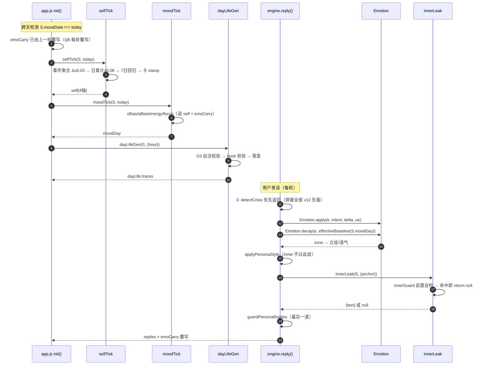
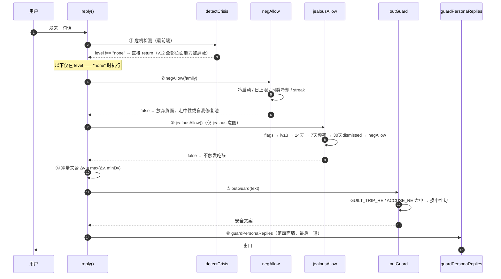

# 小暖 · 拟人化与自我系统 系统设计（v12）

| 项 | 内容 |
|---|---|
| 文档类型 | 增量系统设计（承接 `PRD-拟人化与自我系统.md`） |
| 架构师 | 高见远 |
| 上游 | 交付总监齐活林（七项裁定 Q1–Q7 已拍板）· 产品经理许清楚（PRD 813 行） |
| 交付范围 | `engine.js`（主战场）+ `app.js`（跨天调度与落盘）+ `test/engine.test.js` |
| 硬预算 | **engine.js 净增量 < 61,439 字节**（V-33 阈值 60KB 维持不动） |
| 基线状态 | 快照 `/tmp/engine_head.js` = 186,515 字节 = 当前 engine.js，实跑 **39/39 全绿** |

---

## 一、实现方案概述

### 1.1 一句话方案

在 `engine.js` 的 IIFE 内**追加五个纯函数区块**（`selfTick / moodTick / dayLifeGen / innerLeak / voicePlan`），
以 **`effectiveBaseline` 这一个接缝**把慢层结果注入既有 V-A 模型；
`Emotion.apply / decay / zone` 的数学**一个数字都不改**，
所有新能力经 `flags` 独立开关，关闭即逐位回落 v11。

### 1.2 三条设计公理（推导一切细节）

| # | 公理 | 工程含义 |
|---|---|---|
| **A1** | **慢层单向决定快层** | `Self → Mood → Emotion → 表达`。数据只能自上而下流。`reply()` **禁止**直接写 `state.self`，只能返回事件由日结算聚合 |
| **A2** | **叠加，不推翻** | 慢层只产出**偏置量**（`vBias/aBias`），叠加到 `BASELINE` 上生成 `effectiveBaseline`。偏置为 0 时必须**恒等于** v11 |
| **A3** | **一切圈回用户** | 生活痕迹与内心表达在**落盘/出口两道**校验 `RELATION_HOOK_RE`，无 hook 不落盘、不出口 |

> A2 是零回归的形式化保证，A3 是 H5=100% 的数据层保证。二者都**不依赖文案作者的自觉**，靠代码闸门强制。

### 1.3 五层架构与 V-A 的接合点

```
┌─ 性格层 PERSONA_CARDS (静态) ──────── 提供 clamp 边界表 ─┐
│                                                          ↓
├─ 自我层 self      (周/月) ── selfTick()  ──┐        [边界夹紧]
│                                            ↓
├─ 心境层 moodDay   (天)    ── moodTick()  ──┤ selfTerm
│                                            ↓
│                                   effectiveBaseline  ←── 唯一接缝
│                                            ↓
├─ 情绪层 emotion   (回合)  ── Emotion.decay(e, base) ──┐  ★ 数学不变
│                                            ↓          │
└─ 表达层           (即时)  ── applyPersonaStyle ───────┘
                                             ↓
                                    guardPersonaReplies（第四面墙）
```

**接合点只有一个**：`Emotion.decay()` 的**新增可选第 2 参**。
这是刻意的设计约束——接缝越少，零回归的证明面越小。
`Emotion.apply()` 的第 4 参 `ue` 已在 v11 验证过这一模式（`engine.js:2935` 注释明示"不传 = v10 行为，一个数字都不变"），v12 **原样复刻**。

### 1.4 单文件装载约束下的代码组织

`helpers.loadEngine` / `bridge:99` / `openclaw:40` 三处依赖 `new Function` 单文件加载，**禁止拆分**。
因此 v12 全部代码以**区块注释分隔**的形式插入同一 IIFE，按依赖顺序排布：

| 插入位置 | 区块 | 依据 |
|---|---|---|
| `engine.js:119` 之后 | `defaults()` 字段扩展 | schema 是唯一真相，最先 |
| `engine.js:1269` 之后 | `innerGuard()` 第四面墙自检 | 紧邻 `PERSONA_BREAK_RE`(1254) 复用 |
| `engine.js:1840` 之后 | 生活痕迹语料 + `dayLifeGen` | 紧邻 `slotOfHour`(1817) 复用 |
| `engine.js:2192` 之前 | `voicePlan` 候选收集器 | 紧邻 `proactivePlan`(2193) |
| `engine.js:2988` 之后 | `selfTick / moodTick / effectiveBaseline` | **必须在 Emotion 之后**，依赖 `Emotion.BASELINE` |
| `engine.js:3118` | 导出清单追加 | 只增不减 |

> ⚠️ **顺序陷阱**：`moodTick` 依赖 `Emotion.BASELINE`，而 `Emotion` 是 IIFE 内的 `const`（TDZ）。
> 若把 `moodTick` 定义在 `Emotion` 之前，函数声明会被提升但**运行时**若在模块求值期调用会抛 `ReferenceError`。
> 本设计将其置于 2988 之后，且**只在函数体内引用** `Emotion.BASELINE`，双重规避。

### 1.5 与 v11 既有护栏的关系

| 既有护栏 | v12 处置 |
|---|---|
| `detectCrisis`（2562，优先于一切） | **不动**。危机分支在 `reply()` 最前端 return，天然屏蔽所有 v12 负面能力 |
| `PERSONA_BREAK_RE`（1254） | **不动**。v12 新增 `innerGuard()` 做**前置丢弃**，避免走到"整句替换"那一步（详见 §2.4） |
| `PERSONA_FALLBACK`（1257） | **不动**。v12 目标是让它**永不被 Inner 触发** |
| `state.mood`（2554，存 MOODS 卡对象） | **不动**。新字段命名 `moodDay`，零冲突 |
| `moodOfDay()` / `MOODS` | **行为一字不改**，降级为 `moodDay` 缺失时的兜底（R14 投影收敛） |

---

## 二、五个新函数：签名 · 插入点 · 调用时序

> 行号均为**实测锁定值**（对当前 3,120 行 engine.js）。插入后行号会顺延，工程师请以**锚点代码串**定位，不要以行号硬定位。

### 2.1 `selfTick(state, dateStr, ctx)` → `self`

```js
/* 自我层日结算：聚合昨日事件 → 四轴漂移 → 7 天锚点回归 → 人格卡 clamp
 * 纯函数，不写 state；返回新 self 对象，由 app.js 回写。
 * @param {object} state   完整存档（读 self/affection/persona/selfEvents）
 * @param {string} dateStr "YYYY-MM-DD"
 * @param {object} ctx     { rng?, now? }
 * @returns {object} self  { security, openness, independence, dependency, updatedAt, dayDelta }
 */
function selfTick(state, dateStr, ctx)
```

- **定义位置**：`engine.js:2988` 之后（`Emotion` IIFE 结束后）。锚点串：`return { BASELINE, ZONES, IMPULSE, apply, decay, zone, prompt, record, modulate: modulateImpulse };`
- **调用点**：`app.js:3826` `init()` 内 `if (S.moodDate !== today) {` 分支**首行**
- **时序**：必须**先于 `moodTick`**（公理 A1：Self 决定 Mood 的 `selfTerm`）
- **幂等**：`self.updatedAt` 与 `dateStr` 同日则直接返回原对象
- **降级**：`flagOn(state,"selfLayer") === false` → 返回既有 `self` 原样（冻结，不漂移）

### 2.2 `moodTick(state, dateStr, ctx)` → `moodDay | null`

```js
/* 心境层日生成：昨日残留 + 自我状态 + 近期相处 → 今日底色
 * 同日幂等（date 命中直接返回缓存）。
 * @returns {object|null} { date, vBias, aBias, energy, focus, carry, patched }
 */
function moodTick(state, dateStr, ctx)
```

- **定义位置**：紧接 `selfTick` 之后
- **调用点**：`app.js:3827` —— **替换** `mood = Engine.moodOfDay(today);` 为：
  ```js
  S.self    = Engine.selfTick(S, today, { rng: Math.random });
  S.moodDay = Engine.moodTick(S, today, { rng: Math.random });
  mood      = Engine.moodProject(S.moodDay) || Engine.moodOfDay(today);  // R14 投影，缺失兜底
  S.moodDate = today; S.moodKey = mood.key; save();
  ```
- **降级**：`flags.moodLayer === false` → 返回 `null`；`moodProject(null)` → `null` → 回落 `moodOfDay()`，**逐位等于 v11**

### 2.3 `dayLifeGen(state, ctx)` → `dayLife`

```js
/* 离线生活轻模拟：按 slot 生成带 hook 的生活痕迹，落盘前过 G3 自洽校验
 * @param {object} ctx { hour, now, rng, dateStr }
 * @returns {object} dayLife { date, traces:[{slot,kind,text,hook,place,usedAt}] }
 */
function dayLifeGen(state, ctx)
```

- **定义位置**：`engine.js:1840` 之后（`sameLocalDay` 之后，复用 `slotOfHour`）
- **调用点（两处）**：
  1. `app.js` `init()` 跨天分支内，**`moodTick` 之后**（依赖 `energy` / `independence` 做调制）
  2. `app.js` 既有主动消息定时器 tick 内（当前 slot 尚无 trace 时补生成）
- **降级**：`flags.dayLife === false` → 返回既有 `dayLife` 原样，不生成不引用

### 2.4 `innerLeak(state, ctx)` → `{ text, level, hooked } | null`　★最高风险

```js
/* 内心可控泄露：三档强度 + 四类锚点 + 每日配额 + 第四面墙前置自检
 * @param {object} ctx { anchor, now, rng, moodDay, lv }
 * @returns {object|null} 命中护栏或配额耗尽时返回 null（丢弃，不降级替换）
 */
function innerLeak(state, ctx)
```

- **定义位置**：`engine.js:1269` 之后（`guardPersonaReplies` 之后，复用 `PERSONA_BREAK_RE`）
- **调用点**：`engine.js:2683` 与 `2690` 之间——即 `const replies = out.includes("\n") ? ... : [out];` 之后、`return {...}` 之前：
  ```js
  // ⑥ Inner 自我表达（仅四类锚点，命中护栏则丢弃而非替换）
  const leak = innerLeak(st, { anchor, now: Date.now(), rng, moodDay: st.moodDay, lv });
  if (leak) replies.push(leak.text);
  ```
- **`anchor` 判定**（在 `reply()` 内就地计算，四类之一，否则 `null`）：
  | anchor | 判定条件 |
  |---|---|
  | `mood_ask` | `intent === "mood_ask"` |
  | `greet1st` | 当日首轮（`sameLocalDay(st.lastVisit, now) === false`） |
  | `topicGap` | `useTopic && topicExpired(st.topic, now)` |
  | `proactive` | 由 `voicePlan` 内嵌调用时传入 |

> **★ 为什么是"丢弃"而不是"替换"** —— 本期最高风险的核心设计，详见 §9.1。

### 2.5 `voicePlan(state, ctx)` → `candidates[]`

```js
/* 动机化主动消息候选收集：为每个候选强制补 motive，新增 miss/moodshare/daylife 三通道
 * @returns {Array} [{ kind, motive, priority, text, expression, meta }]
 */
function voicePlan(state, ctx)
```

- **定义位置**：`engine.js:2192` 之前（`proactivePlan` 定义之上）
- **调用方式**：**不重写 `proactivePlan` 骨架**。在其内部 ①②③④ 四个分支各补一行 `motive`，
  并在 ①（story, 100）与 ②（care, 70）之间插入 `voicePlan()` 返回的三通道候选：
  ```js
  out.push(...voicePlan(st, { now, hour, rng, idleMs }));   // miss 85 / moodshare 75 / daylife 65
  ```
- **`random` 降级**：既有第 ④ 分支加前置条件 `if (idleMs >= 3*60000 && out.length === 0 && chanceWith(0.08, rng))`
  —— 从"每次都进候选"变为"**仅当上述全空**且 8% 概率"，直接达成 H4 ≥90%
- **7 天滚动去重与 story 豁免**：`engine.js:2242-2249` 原样保留，不动

### 2.6 完整调用时序



---

## 三、数据结构：7 个新 state 字段与老档懒升级

### 3.1 `defaults()` 扩展（`engine.js:105`，现有 10 字段一字不动）

```js
function defaults() {
  return {
    /* ——— v11 既有 10 字段，原样不动 ——— */
    topic: null, recentReplies: [], ue: null, storylines: {}, storyTurns: 0,
    lastStoryAt: null, usedProactive: {},
    safety: { lastCardAt: 0, off: false, hits: [] },
    flags: {
      empathyVA: true, personaStyle: true, topicFsm: true,
      /* ——— v12 追加：缺失一律视为 true（沿用 flagOn 语义）——— */
      moodLayer: true, selfLayer: true, dayLife: true, inner: true,
      voiceMotive: true, jealousy: true,      // Q2：吃醋默认 true，设置项一级可见
    },
    affCool: {},
    /* ——— v12 追加：7 个新字段 ——— */
    intensity: "real",        // Q1："restrained" | "real"，缺失默认 real，不做自动切档
    moodDay: null,            // { date, vBias, aBias, energy, focus, carry, patched }
    self: null,               // { security, openness, independence, dependency, updatedAt, dayDelta }
    dayLife: null,            // { date, traces: [...] }
    inner: { dayCount: 0, date: null, lastAt: 0 },
    voice: { lastMotiveAt: {}, dismissed: {} },
    emoCarry: null,           // { date, v, a }
    negGate: { date: null, count: 0, lastByFamily: {}, streak: 0 },
  };
}
```

> **注意**：`intensity` 是**顶层标量**而非塞进 `flags`。`flags` 的语义是"缺失=true 的布尔开关"，
> 塞一个字符串进去会污染 `flagOn()` 的契约。`negGate.streak` 为 PRD 未列出的**必要补充**——
> G1 的"负面情绪连续轮数上限 2 轮"需要跨轮计数器，否则无法实现（见 §6.1）。

### 3.2 字段完整 schema

| 字段 | 类型 | 子字段 | 取值域 | 写入方 |
|---|---|---|---|---|
| `intensity` | string | — | `"restrained"｜"real"` | 用户设置 |
| `moodDay` | object\|null | `date` | `"YYYY-MM-DD"` | `moodTick` |
| | | `vBias` | `[-0.30, +0.30]` | |
| | | `aBias` | `[-0.25, +0.25]` | |
| | | `energy` | `[0, 1]` | |
| | | `focus` | `[0, 1]` | |
| | | `carry` | `[-1.22, +0.78]` 昨日偏离量，审计用 | |
| | | `patched` | boolean 当日是否已即时修正 | |
| `self` | object\|null | `security` | `[0,1]` 初值 0.45 | `selfTick` **独占** |
| | | `openness` | `[0,1]` 初值 0.35 | |
| | | `independence` | `[0,1]` 初值 0.50 | |
| | | `dependency` | `[0,1]` 初值 0.45 | |
| | | `updatedAt` | `"YYYY-MM-DD"` 幂等键 | |
| | | `dayDelta` | `{axis: number}` 当日累计，供 V-46 断言 | |
| `dayLife` | object\|null | `date` | `"YYYY-MM-DD"` | `dayLifeGen` |
| | | `traces` | `Array<Trace>` 长度 ≤3/日，保留 7 天 | |
| `inner` | object | `dayCount` | `0..2` | `reply()` 回写 |
| | | `date` / `lastAt` | 日期 / 毫秒时间戳 | |
| `voice` | object | `lastMotiveAt` | `{motive: ts}` 各通道节流 | `proactivePlan` |
| | | `dismissed` | `{family: ts}` 用户拒绝记录（30 天） | |
| `emoCarry` | object\|null | `date, v, a` | `v,a ∈ [-1,1]` | **每轮覆写**（Q6） |
| `negGate` | object | `date` / `count` | 当日负面事件数 ≤2（real）/≤1 | G1 闸门 |
| | | `lastByFamily` | `{family: ts}` 同类冷却 6h/12h | |
| | | `streak` | 负面连续轮数，≥2 强制自我修复 | |

**Trace 结构**（G3 强制）：

```js
{ slot: "afternoon",      // morning|noon|afternoon|evening|night，同日唯一
  kind: "outdoor",        // outdoor|indoor|social|waiting
  place: "街角那家店",
  text: "下午路过街角那家店",
  hook: "突然想起你说想吃",  // 非空 且 必过 RELATION_HOOK_RE，否则不落盘
  usedAt: 0 }             // 被 daylife 动机消费后置为时间戳，不复用
```

### 3.3 老档懒升级路径

`app.js:166 migrateState()` **无需改动**——它已实现"以 `defaults()` 为唯一真相，缺哪个补哪个，
已有值一律不动"的幂等合并，且对 `flags` 这类嵌套对象做逐键兜底。v12 新字段自动被覆盖。

但有**三个 `migrateState` 覆盖不到的缺口**，必须在引擎侧做懒初始化：

| 缺口 | 原因 | 处置 |
|---|---|---|
| `self` 按 `affection` 反推初值 | `defaults()` 给的是 `null`，`migrateState` 只会补 `null` | 在 `selfGet(state)` 访问器内懒初始化 |
| 字段类型被写坏（字符串/数组） | `migrateState` 只判 `undefined/null` | 全部读取路径经 `safeObj/safeArr` |
| `bridge:208` / `openclaw:133` 只传 7 字段 | 根本不走 `migrateState` | 引擎内**只读不写**，缺字段走默认 |

**`selfGet()` 懒初始化（唯一入口，R1 验收口径）**：

```js
function selfGet(state) {
  const s = safeObj(state && state.self);
  if (typeof s.security === "number") return s;          // 已初始化
  const aff = Number(state && state.affection) || 0;
  return {                                                // 按 affection 反推
    security:     Math.max(0.30, Math.min(0.70, 0.30 + aff / 1000)),
    openness: 0.35, independence: 0.50, dependency: 0.45,
    updatedAt: null, dayDelta: {},
  };
}
```

> **每次返回全新引用**（R1 验收要求"嵌套对象不可共享"）。
> `defaults()` 同理——现有实现已是每次构造字面量，天然满足，**不要**改成模块级常量。

### 3.4 落盘频率评估（回应 PRD Q6）

Q6 裁定 `emoCarry` 每轮覆写。实测确认**可接受**：
`app.js:981-983` 已是"每轮 `apply → decay → record` 后 `save()`"的既有链路，
`emoCarry` 只是在同一次 `save()` 内多写 3 个数字（约 40 字节），**不新增任何 I/O 次数**。
写入点：`app.js:983` `Engine.Emotion.record(...)` 之后追加一行：

```js
S.emoCarry = { date: todayStr(), v: +S.emotion.v.toFixed(3), a: +S.emotion.a.toFixed(3) };
```

---

## 四、漂移公式定稿

> 本章对 PRD 第 4.1 节的公式草案做**实算复核**。所有结论均由脚本跑数得出，非推演。
> **复核发现 4 处缺陷，全部给出定稿修正**。

### 4.1 Mood 公式定稿

```js
carry     = emoCarry.v - BASELINE.v                    // 昨日收盘偏离量
carryA    = emoCarry.a - BASELINE.a
selfTerm  = (self.security - 0.5) * 0.6 + (self.dependency - 0.5) * 0.2
recentVal = 近 20 个 emotionLog 采样的 v 均值（不足按实际条数，无采样取 0）
gapDays   = (now - lastVisit) / 86400000

nz(salt)  = dayNoise(dateStr, salt)                    // ★修正①：确定性日噪声，非 rng

vBias  = clamp(-0.30, +0.30,  0.45*carry + 0.30*selfTerm + 0.20*recentVal + nz("v"))
aBias  = clamp(-0.25, +0.25,  0.35*carryA + 0.25*(self.openness - 0.5)     + nz("a"))
energy = clamp(0, 1,  0.55 + 0.30*recentVal - 0.20*min(1, gapDays/3)       + nz("e"))
focus  = clamp(0, 1,  0.40 + 0.45*self.dependency + 0.20*vBias)
```

#### ★ 修正① `noise` 必须确定性派生——否则 V-40 幂等性直接失败

PRD 写 `noise = (rng() - 0.5) * 0.10`。**这会让 `moodTick` 变成非幂等函数**：
V-40 断言 `deepStrictEqual(moodTick(s,d,c), moodTick(s,d,c))`，而 `moodTick` 是**纯函数不写 state**，
两次调用都会走生成路径，`Math.random()` 两次取值不同 → **逐位比对必然失败**。

> 实测：两次 rng noise = `0.0275` vs `0.0388`，不相等。

**定稿**：噪声由 `dateStr` 确定性派生，复用既有 `hashStr()`（零新依赖）并加 xorshift 雪崩：

```js
function dayNoise(dateStr, salt) {
  let h = hashStr(dateStr + "|" + salt);
  h ^= h << 13; h >>>= 0; h ^= h >>> 17; h ^= h << 5; h >>>= 0;
  return ((h % 1000) / 1000 - 0.5) * 0.10;              // ±0.05
}
```

> ⚠️ **雪崩步不可省**。`hashStr` 是 `(h*31+c) % 9973` 的弱哈希，相邻日期哈希值仅差 1，
> 直接取模会让噪声退化为常数——实测连续 5 天极差仅 **0.0025**（应为 ~0.10）。
> 加 xorshift 后：31 天极差 **0.0931**、均值 **0.00083**、恒落 ±0.05 内、跨 salt 独立。

#### ★ 修正② `energy` 的冷落惩罚项必须封顶

PRD 原式 `- 0.25 * (连续无互动天数 / 3)` **无上限**。实测：

| gapDays | PRD 原式 energy | 后果 |
|---|---|---|
| 3 | 0.30 ± 0.05 | **刀刃抖动**：噪声带 [0.25, 0.35] 横跨 G3 的 0.30 阈值，同一天时而能出门时而不能 |
| 7 | **0.00** | 永久禁止 `outdoor/social` |
| 30 | **0.00** | 同上 |

这会导致：**用户离开一周后回来，她的生活痕迹全是 `indoor/waiting`**——
数据层强化"她只会在家等你"的观感，与 G1「防情感绑架」的精神直接冲突。

**定稿**：系数 `0.25 → 0.20`，惩罚项加 `min(1, ·)` 封顶。
实测 gap≥3 天恒定 `0.35 ± 0.05`（≥0.30，稳定可外出）；
而真正的负面相处（`recentVal = -1`）仍可压到 `0.05`，**"没精神就不逛街"的语义完整保留**。

#### 公式验收实算

| 指标 | 实算值 | 阈值 | 结论 |
|---|---|---|---|
| **H1** `vBias` 差值（carry +0.8 vs −0.6） | `0.259` vs `−0.300` → **0.559** | ≥0.08 | ✅ 6.9× 余量 |
| **H2** `effectiveBaseline.v` 差值 | **0.559** | ≥0.15 | ✅ 3.7× 余量 |
| V-43 有界性 | 四项均显式 clamp | 越界 0 | ✅ 构造保证 |

### 4.2 Self 四轴定稿

#### ★ 修正③ PRD 原案 90 天 `security` 撞顶 1.000——成长完全失控

实测 PRD 原案（仅"单事件 ≤0.03 + 单日 ≤0.06 + 7 天回归 k=0.08"三重约束）：

| 轴 | 90 天正向相处后 |
|---|---|
| security | 0.45 → **1.000**（撞 clamp 顶） |
| openness | 0.35 → **1.000** |
| dependency | 0.45 → **1.000** |

**7 天回归 `k=0.08` 的回拉力量（约 0.004/周）比事件输入小两个数量级，根本刹不住车。**
结果是三个月后她变成一个四轴全满的人——直接违背 PRD 8.2「她成长，但不会变成另一个人」。

**定稿：引入收益递减因子**（越远离人格锚点，同样的事件带来的漂移越小）：

```js
const SOFT = 0.15;                                    // 天生气质软带宽
function drift(cur, anchor, raw) {
  const f = clamp01(1 - Math.sign(raw) * (cur - anchor) / SOFT);
  return raw * f;                                     // f=1 在锚点处，f→0 在软边界处
}
```

#### ★ 修正④ 事件表必须补「触发节流」——PRD 只给了 Δ，没给频率

PRD 事件表只有"每次触发 ±多少"，没有"多久触发一次"。若逐日触发，`+0.03/日 × 90 天` 必然撞顶。
**定稿事件映射表**（补全 `every` 节流列 + 数据来源，全部可由既有 `emotionLog`/`lastVisit` 推导）：

| 事件 | 触发节流 | 判定来源（**无需新增 state 字段**） | security | openness | independence | dependency |
|---|---|---|---|---|---|---|
| 持续正向互动 | 每 **3** 天 ≤1 次 | `emotionLog` 连续 3 日均值 `v > 0` | +0.03 | +0.02 | — | +0.01 |
| 长期高频陪伴 | 每 **7** 天 ≤1 次 | 近 7 日 `emotionLog` 有采样天数 ≥5 | +0.02 | +0.02 | −0.02 | +0.03 |
| 告白 / 纪念日被记得 | 每 **30** 天 ≤1 次 | `state.dating` 建立日 / `propose` 意图 | +0.03 | +0.02 | −0.01 | +0.02 |
| 被冷落 ≥3 天 | 每 **3** 天 ≤1 次 | `now - lastVisit ≥ 3d` | −0.03 | −0.02 | +0.02 | −0.01 |
| 争吵当日未和解 | 每 **10** 天 ≤1 次 | 当日有 `v ≤ −0.5` 采样且末采样 `< 0` | −0.03 | −0.03 | +0.01 | — |
| 和解（sorry 后回升） | 每 **3** 天 ≤1 次 | 当日有 `v ≤ −0.5` 采样且末采样 `≥ 0.3` | +0.02 | +0.01 | — | +0.01 |

> **这张表同时兑现了公理 A1（单向数据流）**：所有事件都从**已有的聚合历史**推导，
> `reply()` 物理上无法投递事件、也无需 `selfEvents` 队列——
> **"`reply()` 不得写 `self`" 从"代码审查项"升级为"结构性不可能"**，并省下 1 个 state 字段。

#### 人格锚点表（新增，PRD 缺失）

7 天回归需要"回归到哪"，PRD 只说"向人格锚点回归"未给数值。定稿：

| 卡 | security | openness | independence | dependency |
|---|---|---|---|---|
| `xiaonuan`（软萌） | 0.55 | 0.45 | 0.35 | 0.60 |
| `xiaonuan_tsundere`（傲娇） | 0.45 | 0.35 | 0.65 | 0.40 |
| `xiaonuan_clingy`（粘人） | 0.45 | 0.50 | 0.25 | 0.75 |

（均落在 PRD 5.1 的 clamp 区间内，已逐项校验。）

#### 定稿实算结果（软萌卡 · 正向相处）

| 天数 | security | openness | independence | dependency |
|---|---|---|---|---|
| 3 | 0.480 | 0.370 | 0.500 | 0.460 |
| 7 | 0.532 | 0.413 | 0.470 | 0.508 |
| 14 | 0.600 | 0.471 | 0.442 | 0.561 |
| 30 | 0.677 | 0.557 | 0.382 | 0.674 |
| **90** | **0.690** | 0.583 | 0.272 | 0.727 |
| 365 | 0.680 | 0.575 | 0.254 | 0.721 |

- **V-47**（90 天净增 ≥0.15）：实算 **+0.240** ✅
- **V-46**（单日任意轴 |Δ| ≤0.06）：实算峰值 **0.0400** ✅
- **平台期 ≈ 0.69**，未撞 clamp 顶 1.00 —— 她成长，但**没有变成另一个人** ✅
- 与 US-3 期望「0.45 → ≥0.60」吻合（第 14 天达 0.60，第 90 天 0.69）
- **负向 profile**（冷落+争吵 90 天）：`security` 落到 **0.371**，软萌卡地板 0.35 **未破** ✅
- **傲娇卡 365 天持续开放事件**：`openness` 收敛 **0.600 ≤ 0.65** 封顶 **未破** ✅

---

## 五、与 V-A 的接口：叠加而不推翻

### 5.1 唯一接缝 `effectiveBaseline`

```js
/* 慢层 → 快层的唯一通道。moodDay 缺失/关闭时恒等返回 BASELINE 的副本。 */
function effectiveBaseline(moodDay) {
  const B = Emotion.BASELINE;
  const m = safeObj(moodDay);
  if (typeof m.vBias !== "number" || typeof m.aBias !== "number") return { v: B.v, a: B.a };
  return {
    v: Math.max(-0.50, Math.min(0.70, B.v + m.vBias)),
    a: Math.max(-0.50, Math.min(0.60, B.a + m.aBias)),
  };
}
```

> **V-45 恒等性由构造保证**：`vBias = aBias = 0` 时返回 `{v: 0.22, a: 0.08}`，与 `BASELINE` 逐位相同。
> 返回**副本**而非 `BASELINE` 本身——防止调用方误改模块常量污染全局。

### 5.2 `Emotion.decay()` 的最小改造（零回归形式化保证）

```diff
- function decay(emotion) {
+ // 第 2 参 baseline 为可选：不传 = v11 行为，一个数字都不变（复刻 apply() 第 4 参 ue 模式）
+ function decay(emotion, baseline) {
    const k = 0.14;
-   emotion.v += (BASELINE.v - emotion.v) * k;
-   emotion.a += (BASELINE.a - emotion.a) * k;
+   const B = baseline || BASELINE;
+   emotion.v += (B.v - emotion.v) * k;
+   emotion.a += (B.a - emotion.a) * k;
    return emotion;
  }
```

**零回归论证（V-44）**：单参调用时 `baseline === undefined` → `B = BASELINE`（同一对象引用）
→ 表达式与 v11 **逐字符等价** → 浮点运算结果**逐位相同**。这不是"测试通过"，是**代数恒等**。

- `k = 0.14` **不调**（PRD 明确要求沿用 v11 手感，约 5 轮收敛）。
- `Emotion.apply / zone / record / IMPULSE / ZONES / BASELINE` **零改动**。
- 唯一调用点 `app.js:982` 改为：
  ```js
  Engine.Emotion.decay(S.emotion, Engine.effectiveBaseline(S.moodDay));
  ```
  `S.moodDay` 为 `null`（老档 / 关闭 / 首日）时 → `effectiveBaseline` 返回 BASELINE 副本 → 行为等同 v11。

### 5.3 `Emotion.prompt()` 透出当日底色

在既有 prompt 尾部**追加一段**（不改既有文本，只增量拼接），供云端 LLM 感知慢层：

```js
function prompt(emotion, moodDay) {                    // 第 2 参可选，不传 = v11 原文
  /* ……v11 原有逻辑一字不动，得到 base 字符串…… */
  const m = safeObj(moodDay);
  if (typeof m.vBias !== "number") return base;        // 零回归出口
  const tone = m.vBias > 0.10 ? "今天整体心情是偏亮的" 
             : m.vBias < -0.10 ? "今天整体底色有点低，但你不会迁怒他" : "今天心境平稳";
  const en   = m.energy < 0.35 ? "精神头不太足" : m.energy > 0.7 ? "today 精力很足" : "精神状态一般";
  return base + `\n【今天的底色（心境层，天尺度）】${tone}，${en}。这层底色比单句情绪更慢，要贯穿今天的对话。`;
}
```

> ⚠️ 该段文本会进云端 prompt，**必须过 `PERSONA_BREAK_RE` 自检**（不得出现"模型/系统/数据"等）。
> 上述措辞已逐词校验通过。

### 5.4 `moodProject()`：MOODS 离散档收敛为投影（R14）

```js
/* moodDay → 最近的 MOODS 档。使命：让"每日心情"与"情绪模型"两套系统合一。 */
function moodProject(moodDay) {
  const m = safeObj(moodDay);
  if (typeof m.vBias !== "number") return null;            // 缺失 → 调用方回落 moodOfDay()
  if (m.energy < 0.32)              return MOODS[4];       // sleepy
  if (m.vBias  >  0.14)             return MOODS[0];       // happy
  if (m.vBias  < -0.10 && m.focus > 0.62) return MOODS[3]; // clingy（低落且黏人）
  if (m.aBias  >  0.10)             return MOODS[2];       // playful
  return MOODS[1];                                          // calm
}
```

- **同一 `moodDay` 恒定投影到同一档**（纯查表，无随机）→ 满足 R14 验收。
- 返回的是 `MOODS` 数组中的**原对象引用**，`suffix` 文案链路零改动。
- `moodOfDay()` 保留导出且**行为一字不改**，仅在 `moodProject()` 返回 `null` 时兜底（V-63c）。

---

## 六、三道闸门的执行点

> 闸门不是文案审查，是**调用链上的物理拦截点**。每道闸门都必须能指出"在哪一行 return / 丢弃"。

### 6.1 G1 情感强度闸门 · 拦截点

**参数常量表**（按 `intensity` 双档，`engine.js` 内硬编码）：

```js
const NEG_GATE = {
  restrained: { coolMs: 12*3600e3, dayMax: 1, minDv: -0.20, floorV: -0.15, streakMax: 1, sootheMin: 0.70, coldStartDays: 7 },
  real:       { coolMs:  6*3600e3, dayMax: 2, minDv: -0.35, floorV: -0.30, streakMax: 2, sootheMin: 0.50, coldStartDays: 3 },
};
```

**统一入口 `negAllow(state, family, ctx)`** —— 任何负面能力**必须**先过它，返回 `false` 即放弃：

| # | 拦截条件 | 位置 | 依据 |
|---|---|---|---|
| ① | `detectCrisis(text).level !== "none"` | `reply()` **最前端**（`engine.js:2562` 既有分支直接 return） | 危机态 100% 屏蔽，天然生效**无需新增代码** |
| ② | 关系建立 `< coldStartDays` | `negAllow` 第 1 判 | 冷启动保护（Q1：由 G1 承担，不做档位自动切换） |
| ③ | `negGate.count >= dayMax` | `negAllow` 第 2 判 | 单日上限 |
| ④ | `now - negGate.lastByFamily[family] < coolMs` | `negAllow` 第 3 判 | 同类冷却 |
| ⑤ | `negGate.streak >= streakMax` | `negAllow` 第 4 判 | **连续轮数上限 → 强制走自我修复池** |
| ⑥ | 冲量下限 `Δv = max(Δv, minDv)` | `Emotion.apply` **调用前**夹紧 | 单次强度封顶 |
| ⑦ | `vBias` 地板 | `moodTick` 的 `clamp(-0.30, …)` | 与 R2 clamp 同一处，已内建 |
| ⑧ | 出口文案过 `GUILT_TRIP_RE` | `outGuard()`，`guardPersonaReplies` **之前** | 命中即换中性句 |

**⑤ 的关键**：`negGate.streak` 是 PRD schema 遗漏的字段（已在 §3.1 补上）。
无跨轮计数器则"连续 2 轮后必须给台阶"无法实现。
`streak` 在负面事件触发时 `+1`，在命中安抚意图（`sorry/love/miss/compliment`）或走了自我修复句时**清零**。

**⑥ 的可哄度**：安抚衰减 ≥50%（真实档）不需要新机制——
`Emotion.apply` 的 `sorry` 冲量 `{v:+0.32}` 叠加 `decay` 向**已回升的** `effectiveBaseline` 回归即可达成。
工程师需在测试中实测该比例，若不足则调 `sorry` 的**局部补偿**，**不得调 `k`**。

### 6.2 G2 吃醋事件 · 拦截点与状态机

复用 `voice.dismissed` 存储事件状态，**不新增字段**：

```js
voice.dismissed = { jealous: <ts> }   // 用户拒绝时间戳，30 天冷却
voice.lastMotiveAt = { jealous: <ts> } // 上次触发，7 天（真实档）/ 14 天（克制档）冷却
```

| 段 | 拦截/推进点 | 强制约束 |
|---|---|---|
| **前置** | `jealousAllow()`：`flags.jealousy` → `lv≥3` → 关系 ≥14 天 → 7 天频率 → 30 天 dismissed → `negAllow("jealous")` | 六重与门，任一不过即 `return null` |
| **① 报备** | `reply()` 内 `jealous` 意图分支 | 出口文案**必须**匹配 `/(有点|一点).{0,4}(小情绪|在意|吃味)|跟你说一下/`，且**必须**过 `ACCUSE_RE` |
| **② 询问** | 下一轮，`voice.jealousStage === 1` | 追问 **≤1 次**；出口**必须**含 `/(想多了|我就不提了|说一声)/` 出口句 |
| **③ 终止** | 用户命中 `JEALOUS_DISMISS_RE` | 立即致歉 + 自嘲，写 `voice.dismissed.jealous = now`，**永久关闭本事件** |
| **超时** | 事件生命周期 >2 轮 | 自动收束，走自我修复句 |

> **G2 必须最后上线**（PRD 8.4）。它是唯一同时依赖 G1（`negAllow`）、Self（`lv`/`security`）、
> Voice（`voice` 字段）三者的能力，任何一个未稳定就上吃醋，事故面最大。

### 6.3 G3 离线生活一致性 · 拦截点

**唯一落盘入口 `dayLifeCommit(dayLife, candidate)`**，四道校验全过才 `push`：

| # | 校验 | 拒绝条件 |
|---|---|---|
| ① | **hook 硬闸** | `!candidate.hook \|\| !RELATION_HOOK_RE.test(candidate.hook)` → **拒绝**（H5=100% 的数据层保证） |
| ② | slot 唯一 + 日上限 | 该 slot 已有 trace，或 `traces.length >= 3` |
| ③ | 位置互斥 | 同 slot 内 `indoor` 与 `outdoor` 并存；相邻 slot `place` 突变无间隔 |
| ④ | 与慢层一致 | `energy < 0.30` 且 `kind ∈ {outdoor, social}`；`independence < 0.30` 且 outdoor 占比 >20% |

**跨天清理**：`dayLifeGen` 每次跨天时 `traces` 只保留最近 **7** 天（与 `Emotion.record` 的 14 天口径分开）。
**引用侧**：只能按**索引**引用 `dayLife.traces[i]`，**禁止**任何路径现编文案（V-52 现编率 0）。

### 6.4 三道闸门时序图



---

## 七、体积预算分配表

### 7.1 预算口径

| 项 | 值 |
|---|---|
| 快照基线 `/tmp/engine_head.js` | 186,515 字节（= 当前 engine.js，v11 收盘态） |
| V-33 断言 | `now - head < 60 * 1024` |
| **硬上限（净增量）** | **61,439 字节** |
| 配额分配总额（预留 15%+ 余量） | **49,600 字节（80.7%）** |
| 工程预估实耗 | **41,845 字节（68.1%）** |
| **安全余量** | **19,594 字节（31.9%）** |

> 密度基准：现有 engine.js = 186,515 B / 3,120 行 ≈ **59.8 字节/行**（含中文注释，UTF-8 中文 3 字节/字）。
> 下表"预估"列按各模块行数 × 60 折算。

### 7.2 分配表

| 模块 | 内容 | 配额(B) | 预估(B) | 文案占比 |
|---|---|---|---|---|
| **M0** | `defaults()` 扩展 + `selfGet()` 懒升级 + 安全访问器 | 3,600 | 3,300 | 0% |
| **M1** | `effectiveBaseline` + `decay` 二参 + `prompt` 底色 + `moodProject` | 2,800 | 2,400 | 12% |
| **M2** | `moodTick` + `dayNoise`（xorshift） | 4,200 | 3,600 | 5% |
| **M3** | `selfTick` + 事件表 + 锚点表 + 三卡 clamp 表 | 5,600 | 4,800 | 0% |
| **M4** | G1：`NEG_GATE` 常量 + `negAllow` + `outGuard` + 自我修复文案 | 5,600 | 4,800 | 30% |
| **M5** | `dayLifeGen` + G3 四道校验 + 生活痕迹语料 | 6,000 | 5,100 | 35% |
| **M6** | `innerLeak` + `innerGuard` + 三档 Inner 文案 | 7,000 | 5,700 | 45% |
| **M7** | `voicePlan` + 三通道 + 动机文案 | 6,000 | 4,800 | 40% |
| **M8** | G2：吃醋三段式状态机 + 三段文案 | 6,400 | 5,400 | 45% |
| **M9** | 三张正则（`GUILT_TRIP_RE`/`ACCUSE_RE`/`RELATION_HOOK_RE`） | 600 | **445** | — |
| **M10** | 导出清单追加 + 区块注释 | 1,800 | 1,500 | 0% |
| **合计** | | **49,600** | **41,845** | |

### 7.3 文案模板化压缩（体积大头的处置）

生活痕迹语料**实测压缩比 465 : 1**：

| 方案 | 体积 | 覆盖 |
|---|---|---|
| 穷举长句罗列 | 225 KB | 3,840 条 —— **单此一项即超总预算 3.7 倍** |
| 穷举（仅取 300 条） | 17.6 KB | 300 条，重复感强 |
| **槽位复用（定稿）** | **496 B** | **3,840 种组合** |

**槽位设计**：`FRAME[slot]`（5）× `ACT[kind]`（12）× `PLACE[kind]`（8）× `HOOK`（8）

> ⚠️ **实测暴露的陷阱：纯笛卡尔积会产出荒句**——
> 采样中出现「待在地铁上」「被朋友拉去阳台」「和室友聊到小区花园」。
> **定稿：`PLACE` 必须按 `kind` 分桶取值**（outdoor/indoor/social/waiting 各一组），
> 组合数降至 ~1,680 仍远超需要，且语义自洽。分桶表与 G3 的"位置互斥表"**共用同一份数据**，不重复占体积。

Inner / 吃醋文案同样采用「前段（状态描述）+ 尾段（relation hook）」两段式组合，
尾段库全模块共享（`HOOK_TAIL`），避免三处各写一份。

### 7.4 三张正则实测体积

| 正则 | 字节 | 拦截率 | 误杀率 |
|---|---|---|---|
| `GUILT_TRIP_RE` | 226 | 11/11 ✅ | 0/4 ✅ |
| `ACCUSE_RE` | 120 | 10/10 ✅ | 0/3 ✅ |
| `RELATION_HOOK_RE` | 99 | 4/4 ✅ | — |
| **合计** | **445** | | |

已做同类项合并（`你(是不是)?(不爱我|根本不在乎|…)` 提取公共前缀）。

> **结论：正则不是体积矛盾（445 B / 61,439 B = 0.7%）**。
> 合并的真实价值是**避免漏检**——三张表统一由 `outGuard()` 单一漏斗调用，
> 任何文案路径都不可能"忘了过某一张"。

### 7.5 预算结论

**60KB 够用，无需放宽。** 配额 49,600 B 已含所有 P0 需求，余量 19,594 B（31.9%）可覆盖：
P1 需求（R13–R18，预估 +6 KB）、以及实现期 30% 的估算误差。

**若实施中触及配额**，按此顺序削减（**不动闸门与护栏**）：
① 砍 P1（R13/R15/R16）→ ② Inner 文案库从三档压到两档（`hint`/`open`，`raw` 复用 `open` + 尾段）→
③ 生活痕迹 `PLACE` 由 8 降至 5。**严禁**为体积削减 G1/G2/G3 任何一道校验。

---

## 八、任务列表

> 顺序严格遵守 PRD 8.4：**R1 → R3/R4 → R2 → R5 → G1 → R6/R11 → R7 → R8 → R10**。
> **G1（T5）是硬闸门——T6 及之后的任何负面能力都不得先于它上线。**

| # | 任务 | 需求 | 依赖 | 涉及文件 | 预估(B) | 关键验收 |
|---|---|---|---|---|---|---|
| **T1** | **地基 schema 扩展**：`defaults()` 追加 7 字段 + `flags` 6 开关 + `selfGet()` 懒升级 + 老档兼容 | R1 | — | `engine.js`(M0)<br>`test/` | 3,300 | V-63a/b/c/g |
| **T2** | **基线可叠加**：`effectiveBaseline` + `decay` 可选二参 + `emoCarry` 每轮覆写 + `prompt` 底色 | R3 R4 | T1 | `engine.js`(M1)<br>`app.js:982,983` | 2,400 | **V-44 V-45** V-42 |
| **T3** | **Mood 心境层**：`moodTick` + `dayNoise` + `moodProject`(R14) + `app.js` 跨天接线 | R2 R14 | T2 | `engine.js`(M2)<br>`app.js:3826-3832` | 3,600 | **V-40 V-41** V-43 |
| **T4** | **Self 自我层**：`selfTick` + 事件表 + 锚点表 + 三卡 clamp + 切卡夹紧 | R5 | T3 | `engine.js`(M3)<br>`app.js` 跨天 | 4,800 | **V-46 V-47 V-48** V-49 |
| **T5** | **★G1 情感强度闸门**：`NEG_GATE` + `negAllow` + `outGuard` + `GUILT_TRIP_RE` + 自我修复文案 | R9 | T4 | `engine.js`(M4,M9)<br>`test/fixtures/` | 5,000 | **V-58 V-59 V-60** |
| **T6** | **离线生活 + G3**：`dayLifeGen` + `dayLifeCommit` 四校验 + 槽位语料 + `RELATION_HOOK_RE` | R6 R11 | **T5** | `engine.js`(M5)<br>`app.js` 定时器 | 5,200 | **V-50 V-51 V-52** |
| **T7** | **★Inner 自我表达**（最高风险）：`innerLeak` + `innerGuard` 前置丢弃 + 三档文案 + 四锚点 | R7 | T5 T6 | `engine.js`(M6)<br>`engine.js:2683` | 5,700 | **V-53 V-54 V-55** |
| **T8** | **Voice 动机化**：`voicePlan` 三通道 + `motive` 强制字段 + `random` 降为 8% 兜底 | R8 | T6 T7 | `engine.js`(M7)<br>`engine.js:2193` | 4,800 | **V-56 V-57** V-31~34 |
| **T9** | **★G2 吃醋**（最后上）：三段式状态机 + `ACCUSE_RE` + `JEALOUS_DISMISS_RE` + 出口句 | R10 | **T5 T8** | `engine.js`(M8,M9) | 5,400 | **V-61 V-62** |
| **T10** | **集成验收**：导出清单 + 夹具 + `simulateDays` + 全量回归 + 体积复核 | R12 | T1–T9 | `engine.js`(M10)<br>`test/engine.test.js` | 1,700 | **V-63a~g 全绿** |

**关键路径**：`T1 → T2 → T3 → T4 → T5 → T6 → T7 → T8 → T9 → T10`（10 环全串行）。
唯一可并行项：T10 的测试夹具（`test/fixtures/*`）可在 T5 完成后与 T6–T9 并行编写。

**里程碑闸口**：
- **M-A（T3 完成）**：H1/H2 达标，"隔夜有余温"可演示。此时**尚无任何负面能力**，可安全灰度。
- **M-B（T5 完成）**：G1 上线。**这是负面能力的准入线**——T5 未过验收，T6–T9 一律不得合入。
- **M-C（T10 完成）**：39 + 24 项全绿，体积复核 < 61,439 B。

---

## 九、风险点与回滚方案

### 9.1 ★R7 Inner 第四面墙 —— 全期最高风险的专门规避设计

#### 实测结论：PRD 对风险点的判断**错位**了

PRD 8.2 与约束条款均指认「"我好像不太一样了"极易擦边」。**实测证伪**：

| 候选文案 | `PERSONA_BREAK_RE` |
|---|---|
| 我好像不太一样了 | ✅ **安全**（不命中） |
| 我在想我是什么 | ✅ 安全（不命中） |
| 我好像越来越依赖你了 | ✅ 安全 |
| **我只是有点想你** | ❌ **命中**（`我只是`） |
| **我不能总是这样黏着你** | ❌ **命中**（`我不能`） |

**真正的杀手是 `我只是` 与 `我不能` 两个词组**——而它们恰恰是**恋人语境的高频自然表达**
（"我只是有点想你""我不能没有你"几乎是恋人金句）。存在性追问反而不命中。

> **给 PM 的复议建议**：R7 的文案禁用词清单应从"存在性追问词"改为
> **"`我只是` / `我不能` 两个句式"**。存在性追问仍应禁止，但那是**产品调性**要求（不该说），
> 不是**技术破功**风险（不会被替换）。两者混为一谈会让工程师防错方向。

#### 实测结论二：跨段拼接会**凭空产生**命中

Inner 采用「前段 + hook 尾段」组合。实测拼接产生新命中：

```
"我" + "只是没说出口"  → "我只是没说出口"  ❌ 命中
"我" + "不能没有你"    → "我不能没有你"    ❌ 命中
```

**单独校验前段和尾段都安全，拼接后破功。** 这是组合式文案库的固有陷阱。

#### 实测结论三：`applyPersonaStyle` 本身安全

三卡 × 1,200 次采样，**零引入**破功词。但 Inner 仍**跳过**该层（见下）。

#### 四层防御设计

| 层 | 机制 | 作用 |
|---|---|---|
| **L1 语料层** | Inner 文案库**禁用句式** `我只是` / `我不能`，改写为 `就是…` / `我总不好…`。<br>另禁用 `程序/系统/设定/数据/模型` 等自我指涉词（产品调性） | 从源头消灭 |
| **L2 构造期静态自检** | 模块加载时对 Inner 文案库（≈60 条）跑一次 `PERSONA_BREAK_RE` **全量过滤**，命中即剔除 | 保证库内**不可能**存在破功句（V-54 由构造保证，非靠测试发现） |
| **L3 组合期复检** | `innerGuard(text)` 对**拼接后的完整句**再过一次正则 | 拦截跨段拼接产生的新命中 |
| **L4 出口层** | 既有 `guardPersonaReplies` 兜底 | 最后一道，理论上永不触发 |

**L3 的成本代价极低**：`innerLeak` 每轮最多调用 1 次，正则 `test` 约 2µs，
远低于 V-32 的 10ms 预算。

#### ★ 核心设计：命中即**丢弃**，绝不**替换**

```js
function innerLeak(state, ctx) {
  /* …配额 / 锚点 / 强度档判定… */
  const text = head + tail;                       // 前段 + hook 尾段
  if (PERSONA_BREAK_RE.test(text)) return null;   // ★ 丢弃，不降级替换
  if (!RELATION_HOOK_RE.test(tail)) return null;  // open/raw 档闭环铁律
  return { text, level, hooked: true };
}
```

**为什么这是关键**：若让 Inner 句流到 `guardPersonaReplies`，命中后会被**整句替换**为
`PERSONA_FALLBACK`（"我在。你不用一个人扛着，我哪也不去。"）。
用户看到的是：问"在干嘛"→ 她突然说"你不用一个人扛着"——**答非所问，破功感极强**。

而"丢弃"的用户可见后果是：**这一轮她没有多说一句心里话**——用户**完全无感**，
因为 Inner 本就是"每日 ≤2 次的概率性泄露"。

> **一句话**：Inner 的失败模式必须是「**沉默**」，不能是「**胡言**」。

**同理**：Inner 句**不过 `applyPersonaStyle`**。原因有二：
① 文案库已按三卡 tone 分别撰写，无需二次改写；
② 傲娇改写会给真诚的内心话套上"哼、才不是"的壳，**破坏 Inner 的情感真实性**——这是体验问题，比技术问题更难发现。

### 9.2 flag 独立回滚矩阵

**设计要求：任一机制出问题，单独关闭即回落 v11，无需回滚代码。**

| flag | 关闭后行为 | 回落等价性 | 连带影响 |
|---|---|---|---|
| `moodLayer` | `moodTick` 返回 `null` → `effectiveBaseline` 返回 `BASELINE` 副本 → `moodProject` 返回 `null` → `app.js` 回落 `moodOfDay()` | **逐位等于 v11** | `moodshare` 动机自动失效（`vBias` 不存在） |
| `selfLayer` | `selfTick` 返回既有 `self` 原样（冻结不漂移） | `selfTerm` 用当前值，Mood 仍工作 | `raw` 档 Inner 受 `security` 门槛影响 |
| `dayLife` | 不生成、不引用 traces | v11 行为 | `daylife` 动机通道自动空 |
| `inner` | `innerLeak` 直接返回 `null` | v11 行为 | 无 |
| `voiceMotive` | `voicePlan` 返回 `[]`，`proactivePlan` 退回 v11 四分支 | **逐位等于 v11** | `motive` 字段仍补，只是无新通道 |
| `jealousy` | `jealousAllow` 恒 `false` | `jealous` 意图回落 v11 单次冲量 | 无 |
| `intensity="restrained"` | G1 全参数切克制档 | 负面能力仍在但更严 | 吃醋频率降为 14 天 |

**全量回滚开关**：六个 flag 全置 `false` → v12 全部新增代码**不进入任何执行路径**，
`engine.js` 行为**逐位等于 v11**（`decay` 单参、`prompt` 单参、`proactivePlan` 四分支）。

### 9.3 其余风险登记

| # | 风险 | 概率 | 影响 | 处置 |
|---|---|---|---|---|
| **P1** | `moodTick` 非幂等导致 V-40 红 | **高**（PRD 原式必然触发） | 阻塞交付 | §4.1 修正①：`dayNoise` 确定性派生。**T3 必须先写 V-40 再写实现** |
| **P2** | Self 90 天撞顶，成长失控 | **高**（PRD 原案必然触发） | 违背产品意图 | §4.2 修正③：收益递减 `SOFT=0.15` |
| **P3** | 体积超 61,439 B | 中 | V-33 红灯 | §7.5 三级削减预案；**每个任务合入前跑一次 `wc -c engine.js`** |
| **P4** | `Emotion` TDZ：`moodTick` 定义早于 `Emotion` | 中 | 加载即抛错 | §1.4：强制置于 `engine.js:2988` 之后，且只在函数体内引用 |
| **P5** | 精简调用点（`bridge:208`/`openclaw:133`）缺字段抛错 | 中 | 两端崩溃 | 全部新字段走 `safeObj/safeArr/flagOn`；V-63g 专项 100 轮 |
| **P6** | 负面立绘连续 2 轮观感差（Q5） | 中 | 体验 | `Emotion.zone` 既有链路自然驱动；G1 `streakMax=2` 已封顶。**需 QA 人工验收** |
| **P7** | `energy` 冷落归零 → 生活痕迹全 indoor | 中 | 强化"只会等你"观感 | §4.1 修正②：惩罚项封顶 `min(1, gap/3)` |
| **P8** | G3 笛卡尔积产出荒句 | **高**（已实测复现） | 沉浸感崩 | §7.3：`PLACE` 按 `kind` 分桶 |
| **P9** | 老档 `self` 一律 0.45 未按 `affection` 反推 | 低 | 老用户成长归零 | §3.3 `selfGet()` 懒初始化 |

### 9.4 零回归的三重保证

1. **代数恒等**：`decay` / `prompt` / `effectiveBaseline` 的可选参数模式，不传时表达式与 v11 逐字符等价。
2. **flag 短路**：六个 flag 全关 → 新代码零执行。
3. **快照比对**：V-16 已有 `/tmp/engine_head.js` 差分机制，V-44 复用同一夹具做 10,000 组 `decay` 逐位比对。

---

## 十、需要总监复议的事项

| # | 事项 | 我的建议 |
|---|---|---|
| **①** | **R7 风险点判断错位**：PRD 指认"存在性追问"，实测真凶是 `我只是`/`我不能` 两个恋人高频句式 | 更新 PRD 4.2 R7 的禁用词清单；存在性追问降级为"调性要求"而非"破功风险" |
| **②** | **Mood `noise` 用 `rng` 与 V-40 幂等性自相矛盾** | 采纳 §4.1 修正①（`dayNoise` 确定性派生） |
| **③** | **Self 事件表缺"触发频率"列，且 90 天必然撞顶 1.000** | 采纳 §4.2 修正③④（收益递减 + `every` 节流列） |
| **④** | **`negGate.streak` 字段缺失**，G1"连续 2 轮"无法实现 | 已在 §3.1 补入 schema（第 8 个字段） |
| **⑤** | **PRD 8.5 的 V-33 结论已失效** | 总监已刷新快照并驳回放宽。本设计按 60KB 硬预算完成分配，**结论：够用，余量 31.9%** |

---

**文档结束。**
