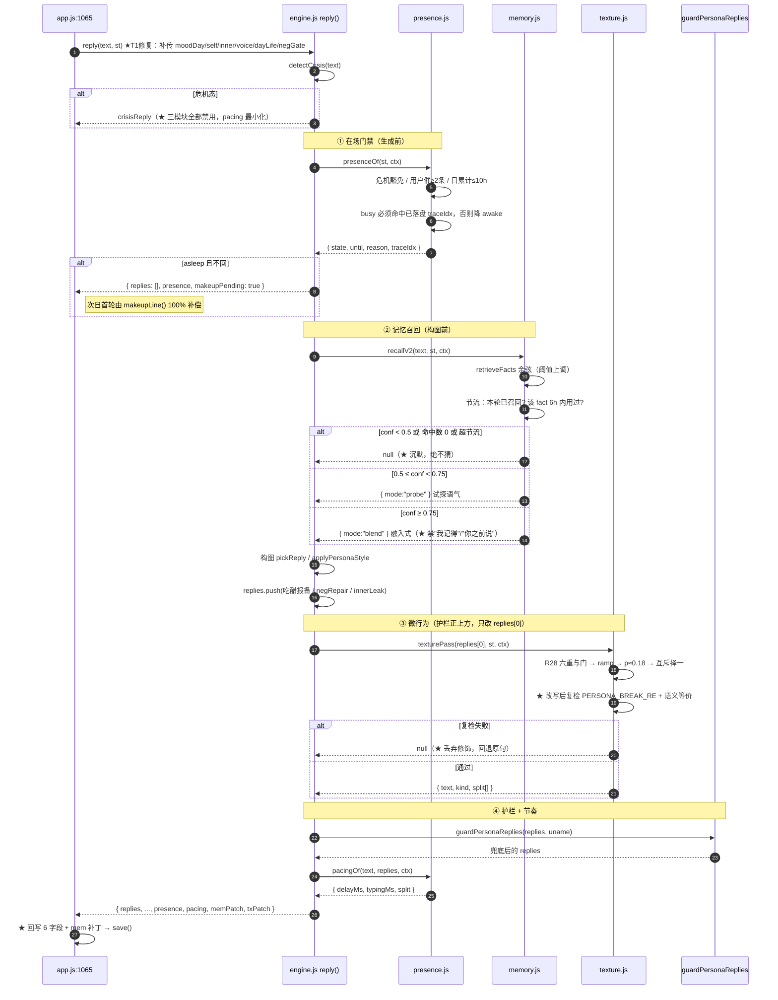
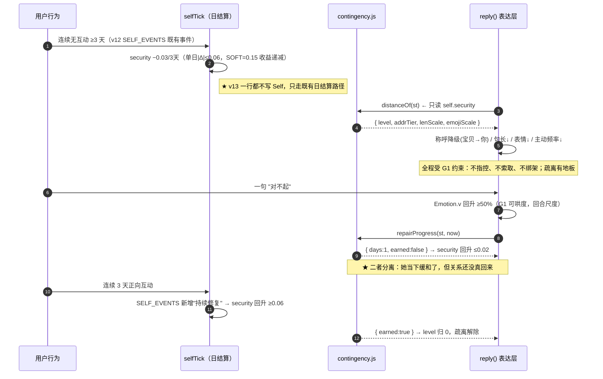
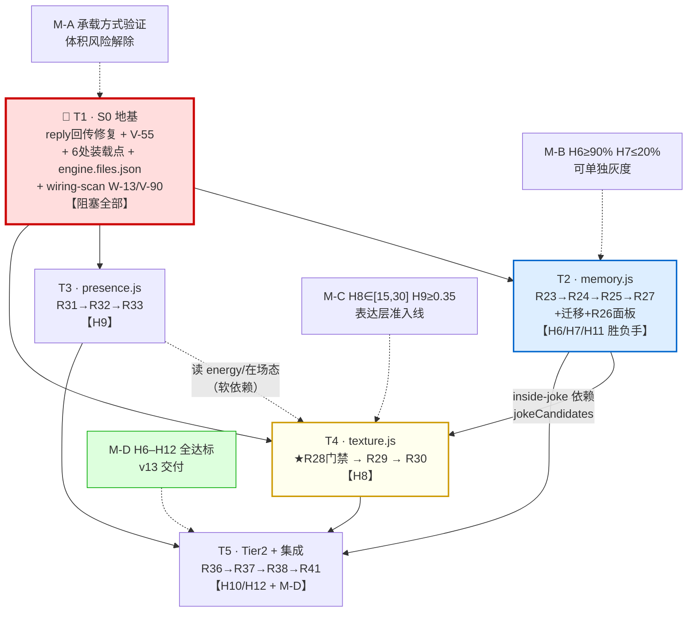
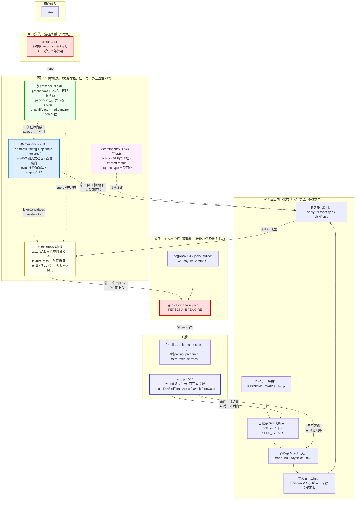

# 小暖 · 真人感优化 / 去机器痕迹 DESIGN（v13 增量）

| 项 | 内容 |
|---|---|
| 文档类型 | 增量系统设计（承接 `PRD-真人感优化.md`，构建于 `DESIGN-拟人化与自我系统.md` v12 五层架构） |
| Language | 中文 |
| Programming Language | 原生 JavaScript（ES2020）+ HTML + CSS，**零构建工具、零 npm 依赖** |
| Project Name | `xiaonuan_human_realness_v13` |
| 架构师 | 高见远 |
| 版本 | v13（当前线上 v12） |
| 上游 | 许清楚 `PRD-真人感优化.md`（915 行）；主理人已拍板任务序与 S0 优先级 |
| 下游 | 工程师（按第七章任务表实施） |

---

## 一、方案概述

### 1.1 一句话方案

> 在 v12 五层内心架构**之上叠加三个横切模块**（`memory.js` / `presence.js` / `texture.js`），
> 全部以**旁路增强**方式接线：任一模块缺失或关闭，行为**逐位回落 v12**。
> `engine.js` 只做**薄接线**（净增 ≤2.0KB），语料与算法一律外置。

### 1.2 三个核心技术难点与解法

| # | 难点 | 解法 |
|---|---|---|
| **D1** | `engine.js` 仅剩 ≈2.2KB 余量，P0 三项需 ≈16KB（差 7 倍） | **独立模块文件 + 拼接装载**（PRD Q0 方案 A）。6 处装载点用统一 `engine.files.json` 真相源 |
| **D2** | Node `new Function` 拼接 与 浏览器多 `<script>` 对「引用后置模块」**语义分歧**：前者 TDZ 抛 `ReferenceError`，后者得 `undefined`。同一份 `engine.js` 两处行为不一致 = 线上炸、测试绿 | **跨模块一律走注册表** `Engine.use(name,mod)` / `Engine.mod(name)`。engine.js **永不直接书写后置模块标识符**，只在**调用时刻**做一次 `mod("memory")` 查表。两种装载方式行为完全一致 |
| **D3** | texture 的错字/碎句会**凭空造出破功词**（v12 DESIGN §9.1 已实测：`我` + `只是没说出口` 拼接后命中 `PERSONA_BREAK_RE`） | 插入点选在 `guardPersonaReplies(...)` **正上方**（replies 数组成型后、护栏前），**改写后对全句复检**，命中即**丢弃修饰回退原句**（沿用 Inner「失败即沉默」范式，绝不替换为 `PERSONA_FALLBACK`） |

### 1.3 六条关键设计决策（已核实，直接落地）

| # | 决策 | 依据 |
|---|---|---|
| **K1** | **S0 第一优先 = 修复 `app.js:1065` `reply()` 状态回传缺陷**，高于 V-55 本身 | 见 §1.4。v13 三模块的频控**全部**依赖此链路，不修则 memory/texture/presence 的日配额一律恒失效 |
| **K2** | 跨模块通信走 **`Engine.use` / `Engine.mod` 注册表**，禁止直接标识符引用 | D2。`Engine` 单向向上词法可见，模块可直接读 `Engine.*`；engine 读模块必须查表 |
| **K3** | `engine.js` 补导出 `safeObj/safeArr/flagOn/tokenize/vec/cosine`（≈60B）+ 注册表（≈120B） | 三模块共用这 6 个工具，外置会重复实现 3 份，反而更费体积 |
| **K4** | texture 插入点 = `engine.js:3032` `return { replies: guardPersonaReplies(replies, uname), ... }` **正上方**，**只改写 `replies[0]`** | Inner 泄露句 / 吃醋报备句 / `negRepair` 台阶句都是 `replies.push()` 追加的**真心话**，v12 已定「不过改写层」 |
| **K5** | `ENGINE_FILES` 真相源 = **`engine.files.json`**；Node 三处直接读该文件；`index.html` / `sw.js` 静态展开 + `wiring-scan` 断言逐项比对 | 浏览器侧不能异步读 JSON 再排 `<script>`（会破坏同步顺序语义），只能静态展开；用测试锁死漂移 |
| **K6** | 半更新态（engine 新、模块缺）**必须静默降级**：`Engine.mod("memory")` 返回 `null` → 走原 `recallMemory` | PRD §6.4。绝不白屏、绝不抛错 |

### 1.4 🔴 S0 根因：`app.js:1065` reply() 状态回传缺陷（v12 线上缺陷）

**实测**（`app.js:1065-1081`）：

```js
const r = Engine.reply(text, {
  affection: S.affection, nick: S.nick, mood, memory: S.memory, persona: S.persona,
  dating: S.dating, lastReply: S.lastReply,
  topic: S.topic, recentReplies: S.recentReplies, ue: S.ue,
  safety: S.safety, flags: S.flags,          // ← 仅 12 字段
});
result = { replies, delta, expression, moodOverride, intent, intentEx,
           topic, recentReplies, ue, safety };   // ← 仅回写 4 个状态字段
```

**缺失字段**：`moodDay` / `self` / `inner` / `voice` / `dayLife` / `negGate` **既未传入、也未回写**。

**三条线上后果**（v12 已经在错，不是 v13 引入）：

| # | 后果 | 机理 |
|---|---|---|
| ① | **Inner 日配额恒失效** | `innerLeak` 读写的 `st.inner.dayCount` 落在每轮新建的**临时字面量对象**上，函数返回即被 GC。下一轮 `inner` 又是 `undefined` → 配额永远从 0 开始 |
| ② | **`innerLeak` tier 恒为 `hint`** | `innerLeak(st, { moodDay: st.moodDay, ... })` 中 `st.moodDay` 为 `undefined`（未传入），tier 判定拿不到 energy/valence → 恒退最低档 |
| ③ | **`jealousTick` 的 `voice.jealousStage` 不落盘** | 吃醋阶段机每轮重置，G2 闸门的阶段推进形同虚设 |

**修复方向（T1 交付）**：`reply()` 调用点补齐传入 6 字段 + 返回对象补齐回写 6 字段，**签名只增不减**（PRD R34）。
**这是 v13 三模块频控的地基**——`memory` 的「同一 fact 6h 不重复」、`texture` 的「错字 ≤2次/日」、`presence` 的「日累计不可用 ≤10h」全部依赖同一条「引擎不写 state、宿主回写落盘」链路。

### 1.5 V-55 的真实成因（测试侧缺陷，非引擎缺陷）

**实测** `test/persona-v12-batch2.test.js:18` `const now0 = Date.now();`，`:80` 探针步进 `now0 + i * 91 * 60000`。
i = 0 / 1 / 2 → **0 / 91min / 182min**。当 `now0` 落在当地时间 21:00 之后，第 3 根探针 `+182min` **跨过本地午夜** → `innerLeak` 的按日配额**合法重置** → 实得 3 次，断言期望 2 次 → 红灯。

- **性质**：**测试基准时间未固定**，属测试侧缺陷；引擎按日重置逻辑本身正确。
- **修复**：把 `now0` 钉死到当地某个安全时刻（如当日 09:00），或改用固定 UTC 基准 + 显式 `dayKey` 断言。
- **注意**：修完 V-55 **不等于** Inner 配额在线上生效——线上失效的根因是 §1.4 的 ①，必须由 T1 的 `reply()` 回传修复解决。**二者是两个独立缺陷，PRD Q3 只看见了后者。**

---

## 二、模块导出契约

### 2.1 通用约定（三模块共同遵守）

| 约定 | 内容 |
|---|---|
| **A. 文件形态** | 每个模块是一个 IIFE：`(function (E) { ... E.use("name", API); })(typeof Engine !== "undefined" ? Engine : null);`。**无 `export`、无 `require`、无全局变量泄露**（除注册表内） |
| **B. 向上可见** | 模块内可**直接读** `Engine.*`（`E.safeObj` / `E.PERSONA_BREAK_RE` / `E.clamp01` …）。engine.js 先于所有模块求值，无 TDZ 风险 |
| **C. 向下查表** | engine.js **禁止**书写 `Memory` / `Texture` / `Presence` 标识符，只能 `const M = mod("memory"); if (M) ...`。**这是 D2 的唯一解** |
| **D. 单向依赖** | 依赖序 `engine → memory → presence → texture [→ contingency]`。**禁止反向**：`memory.js` 不得 `mod("texture")` |
| **E. 纯函数** | 模块函数**不写 `state`**（沿用 v12 公理 A1）。所有状态变更以**返回补丁对象**形式交回 `reply()`，由 app.js 回写落盘 |
| **F. 静默降级** | 模块首行 `if (!E \|\| typeof E.use !== "function") return;`。engine 是老版本时**不注册**，engine 侧查表得 `null` → 走 v12 路径 |
| **G. 零浏览器依赖** | 不得触碰 `document/window/localStorage/navigator/self/location`（`loadEngineTrapped()` 沙箱会抛错） |
| **H. 失败即沉默** | 任一模块内部异常，`try/catch` 吞掉并返回 `null`，**绝不向上抛**。宁可这轮没有增强，不可这轮没有回复 |

### 2.2 `engine.js` 侧新增（薄接线，合计 ≈180B）

**① 注册表（≈120B）** —— 插在 IIFE 内、`return {...}` 之前：

```js
/* v13 模块注册表：跨模块一律查表，绝不直接引用后置标识符。
 * 理由：Node 走 new Function 拼接（后置 const 处于 TDZ，直接引用抛 ReferenceError），
 * 浏览器走多 script（后置 const 读到 undefined）—— 语义分歧。查表使两侧行为一致。 */
const _mods = Object.create(null);
function use(name, m) { if (name && m) _mods[name] = m; return m; }
function mod(name) { return _mods[name] || null; }
```

**② 导出补充（≈60B）** —— 追加到 `engine.js:3930` 的 `return {}` 块尾：

```js
/* ——— v13 新增：模块注册表 + 三模块共用工具（T1） ——— */
use, mod, safeObj, safeArr, flagOn, tokenize, vec, cosine,
```

> `safeObj:142` / `safeArr:141` / `flagOn:136` / `tokenize:2763` / `vec:2770` / `cosine:2775` 均已存在于 engine.js，**只是此前未导出**。补导出是纯增量，零行为变更。

**③ 三处调用点接线**（详见第四章时序）：`recallV2` 挂 memory、`texturePass` 挂 `engine.js:3032` 正上方、`presenceOf/pacingOf` 挂 `reply()` 首尾。

### 2.3 `memory.js` 导出契约（≤8KB）

```js
E.use("memory", {
  /* —— 写入侧（返回补丁，不写 state） —— */
  extractFacts(text, state, ctx) -> { facts: [FactPatch], moments: [MomentPatch] } | null,
  applyPatch(mem, patch)         -> mem2,          // 纯函数，宿主回写用
  detectCorrection(text, state)  -> { factId, kind:"deny"|"revise", value } | null,  // R27

  /* —— 读取侧 —— */
  retrieveFacts(query, state, k) -> [{ fact, score }],   // 复用 E.tokenize/vec/cosine
  recallV2(text, state, ctx)     -> { line, mode:"blend"|"probe", factId } | null,   // R25 融入式召回

  /* —— 维护侧 —— */
  evict(mem, now)                -> mem2,          // R23/R24 淘汰，见第五章
  migrateV12(state)              -> { mem, migrated:Number },  // R35 老档迁移，幂等

  /* —— 面板 API（R26，供 app.js 调用） —— */
  listFacts(state)               -> [{ id, label, tone:"sure"|"maybe", text }],  // ★不露 conf 数值
  editFact(mem, id, value)       -> mem2,          // conf 置 1.0
  deleteFact(mem, id)            -> mem2,          // 硬删 + 墓碑 negatedAt

  /* —— 供 texture 消费（R38 inside-joke） —— */
  jokeCandidates(state, ctx)     -> [{ token, momentId, score }],
});
```

**状态读写边界**：

| 对象 | 权限 | 说明 |
|---|---|---|
| `state.mem`（新增顶层字段） | **读 + 返回补丁** | `{ facts:[], moments:[], v:13, migratedAt }`。**旁挂**，不碰 `state.memory.events`（PRD N3，4 处消费点依赖它） |
| `state.memory.events` | **只读** | 迁移时读取，**不删不改**（双写过渡） |
| `Mood` / `Self` / `Inner` | **只读** | 记忆是横切料源，**禁止**写内心三层（v12 公理 A1） |
| `state.topic` / `ue` / `lv` | **只读** | 供召回时机门与置信度门判定 |

**被 Engine 调用方式**（`reply()` 内，构图前）：

```js
const M = mod("memory");
const rc = (M && flagOn(st, "memory2")) ? M.recallV2(text, st, { rng, lv, now }) : null;
// rc 为 null → 完全走 v12 recallMemory 路径（逐位一致）
```

### 2.4 `presence.js` 导出契约（≤4KB）

```js
E.use("presence", {
  /* —— 在场状态机（R31） —— */
  presenceOf(state, ctx)   -> { state:"awake"|"busy"|"asleep"|"away", until, reason, traceIdx },
  sleepWindow(state, day)  -> { from, to },        // 人格卡 + moodDay.energy + 日抖动(σ≥15min)

  /* —— 响应节奏（R32） —— */
  pacingOf(userText, reply, ctx) -> { delayMs, typingMs, split:Boolean },

  /* —— 不可用与补偿（R33） —— */
  unavailAllow(state, ctx) -> Boolean,             // 日累计≤10h / 不连续2天 / 用户催即false
  makeupLine(state, ctx)   -> { text, motive:"makeup" } | null,   // 100% 补偿，过 GUILT_TRIP_RE
  presenceAfterTurn(state, p) -> patch,            // 宿主回写：累计不可用时长、补偿待办
});
```

**硬约束（写进实现，不靠自觉）**：

| 约束 | 实现点 |
|---|---|
| **危机豁免** | `presenceOf` 首行：`if (E.detectCrisis(text).level !== "none") return { state:"awake" }`。危机态延迟一律最小化（P99 ≤1s） |
| **trace 同源（G3 不现编）** | `busy` 态**必须**携带有效 `traceIdx` 指向一条**已落盘** `dayLife.traces[i]`；取不到 → **降级 `awake`** |
| **用户优先于拟真** | 不可用期间用户发 ≥2 条 → 立即 `awake`（R33） |
| **高方差** | `delayMs = 阅读(userLen) + 思考(f(情绪,难度)) + 打字(replyLen×每字) + 抖动`，CV ≥0.35，普通态 P99 ≤8s |
| **老前端兼容** | `pacing` 为**新增返回字段**；app.js 未消费时走原固定策略（PRD R32 验收） |

### 2.5 `texture.js` 导出契约（≤4KB）

```js
E.use("texture", {
  textureAllow(state, ctx) -> { ok:Boolean, banTypo:Boolean, ramp:Number },  // R28 六重与门
  texturePass(text, state, ctx) -> { text, kind, split:[String] } | null,    // R29 六类互斥择一
  textureAfterTurn(state, hit) -> patch,           // R30 冷却/配额回写（依赖 §1.4 的 reply 回传修复）
  TYPO_TABLE, TIC_TABLE,                           // 错字白名单 / 人格卡口头禅（只读常量，供测试断言）
});
```

**R28 六重与门**（任一不过 → 返回 `null`，输出完美句）：

| # | 门 | 判定 |
|---|---|---|
| ① | 总闸 | `flagOn(st,"texture") !== false` |
| ② | 能力已确立 | `getLevel(af).lv ≥ 2` **且** 累计有效轮数 ≥30 |
| ③ | 安全语境 | `detectCrisis(text).level === "none"` |
| ④ | 非严肃语境 | `ue` 非负面高唤醒（`UE_POLARITY<0 && UE_AROUSAL 高` → 拒） |
| ⑤ | 非关键信息 | 本轮回复含时间/数字/承诺 → `banTypo = true`（**仅禁错字类，其余仍可用**） |
| ⑥ | 配额与冷却 | 单类 ≥5 轮不重复；错字 ≤1/20轮 且 ≤2/日；`ramp` = 升级后 7 天线性爬坡系数 |

**六类微行为**：犹豫 / 改口 / **碎句（主力）** / 错字自纠 / 口头禅 / 话题漂移。**单轮至多命中 1 类**（互斥择一，防叠加成噪声）。

**关键实现约束**：

- 命中概率 `p ≈ 0.18 × ramp × energyAdj`，落在 H8 区间 [15%,30%] 中部；**不得**改为「每 N 轮必触发」（那是节拍器，不是人 —— PRD §7.2）。
- **话题漂移**必须引用**已落盘** `dayLife.trace` 且命中 `RELATION_HOOK_RE`（v12 A3 公理：一切圈回用户），否则放弃本次修饰。
- **错字**只能取自 `TYPO_TABLE` 白名单（拼音/形近，可辨认、不产生歧义），且**必须有后续更正**（只错不改是 bug，不是真人感）。
- **改口/碎句**切分点**只能在标点或连词处**，还原后与原句**字符集等价**（允许新增虚词，不允许删除实词）。
- **inside-joke（R38）**：通过 `mod("memory").jokeCandidates()` 取词条 —— 这是 texture 必须排在 memory **之后**装载的原因。

### 2.6 `contingency.js` 导出契约（Tier2，≤4KB，可选）

```js
E.use("contingency", {
  distanceOf(state)          -> { level:0|1|2, addrTier, lenScale, emojiScale },  // R36 疏离降档
  applyDistance(text, d)     -> text,              // 称呼降级 / 句长缩短 / 表情减少
  repairProgress(state, now) -> { days, earned:Boolean },  // R37 earned repair
  respondType(state, ctx)    -> "stable"|"expand"|"challenge"|"boundary",  // R41 四型
});
```

**铁律**：`contingency` **只读 `Self`，绝不写 `Self`**。疏离的产生只能走「事件 → `selfTick` 日结算」路径（PRD §1.4 明令：不得为了让疏离更快生效而开后门）。
**地板保护**：`level` 上限为 2，且不得低于最低可对话温度；用户任何一次示好**必得正向回应**，只是回得慢（N6 不做冷战）。
**危机豁免**：`detectCrisis !== "none"` → `level` 立即归 0，全量解除疏离。

---

## 三、`engine.files.json` 与 6 处装载点改造

### 3.1 为什么真相源是 JSON 而不是 JS 常量

PRD §6.4 建议「抽一个 `ENGINE_FILES` 常量数组，6 处共享」。**但 JS 常量做不到 6 处共享**：

- Node 三处（`test/helpers.js` ×2、`bridge`、`openclaw`）可以 `require` 同一个 `.js`；
- 但 `index.html` 的 `<script>` 顺序**必须静态**（异步读 JSON 再插 script 会破坏同步执行顺序，且引入竞态）；
- `sw.js` 的 `ASSETS` 在 Service Worker 作用域，**不能 `require`**。

**结论**：真相源用 **`engine.files.json`**（纯数据，Node 侧 `JSON.parse` 直接读，SW/HTML 侧静态展开），**用测试断言锁死漂移**（§3.4）。这是「单一真相源 + 静态展开 + 自动化比对」的标准解法。

```json
// engine.files.json（项目根，新增）
{
  "order": ["engine.js", "memory.js", "presence.js", "texture.js"],
  "optional": ["contingency.js"],
  "note": "依赖序即装载序，禁止调整。engine 最先（提供工具与注册表），texture 最后（消费 memory 与 presence）。"
}
```

> `optional` 中的文件**允许缺失**（Tier2 未交付时不阻塞）；`order` 中的文件**缺一即报错**（除 engine.js 外，缺失走静默降级由运行时兜底）。

### 3.2 Node 侧统一装载函数（三处共用同一范式）

```js
// 共用逻辑（test/helpers.js 内定义一次，bridge/openclaw 各自内联同款 6 行）
function engineSources(root) {
  const cfg = JSON.parse(fs.readFileSync(path.join(root, "engine.files.json"), "utf8"));
  return cfg.order.concat(cfg.optional || [])
    .map(f => path.join(root, f))
    .filter(p => fs.existsSync(p))                       // optional 缺失 → 跳过
    .map(p => fs.readFileSync(p, "utf8"))
    .join("\n;\n");                                      // ★ 分号防 ASI 粘连
}
```

**★ 关键：仍然是「单次 `new Function` 求值」** —— 4 份源码 concat 成**一段**交给**同一个** `new Function`，各模块处于**同一词法作用域**，`const Engine` 对后续模块可见。这是本方案能零改动复用现有加载范式的根本。

### 3.3 六处装载点改造清单

| # | 位置 | 现状 | 改造 | 增量 |
|---|---|---|---|---|
| **1** | `test/helpers.js:19` `loadEngine()` | `const src = fs.readFileSync(ENGINE_PATH,"utf8");`<br/>`new Function(src+"\nreturn Engine;")()` | `const src = engineSources(ROOT);` 其余不变 | 1 行改 + 8 行新函数 |
| **2** | `test/helpers.js:34` `loadEngineTrapped()` | 同上（毒化沙箱版，6 个形参注入） | 同上；**新模块同样跑毒化沙箱**（G 约定） | 1 行改 |
| **3** | `bridge/xiaonuan-bridge.js:98` | `fs.readFileSync(ENGINE_PATH,"utf8")` | 同款 6 行内联；`--engine` 参数语义改为**目录**或保持文件并取其 `dirname` 作为 root | 6 行 |
| **4** | `openclaw.js:39` | `fs.readFileSync(path.join(__dirname,"engine.js"),"utf8")` | 同款 6 行内联，root = `__dirname` | 6 行 |
| **5** | `index.html:547` | `<script src="engine.js"></script>` | 追加 3 行，**顺序即依赖序**（见下） | 3 行 |
| **6** | `sw.js:2` `CACHE` + `:3` `ASSETS` | `"xiaonuan-v16"`，9 项资产 | `CACHE` → **`"xiaonuan-v17"`**（必须 +1）；`ASSETS` 追加 3 项 | 2 行 |

**index.html:547 改造后**（`localmodel.js` / `caption.js` / `app.js` 顺序不变，三模块插在 engine 与 localmodel 之间）：

```html
<script src="engine.js"></script>
<script src="memory.js"></script>     <!-- v13：顺序即依赖序，禁止调整 -->
<script src="presence.js"></script>
<script src="texture.js"></script>
<script src="localmodel.js"></script>
<script src="caption.js"></script>
<script src="app.js"></script>
```

**sw.js 改造后**：

```js
const CACHE = "xiaonuan-v17";   // v17：v13 三模块（memory/presence/texture）加入外壳缓存；必须递增否则老用户拿不到新代码
const ASSETS = [
  "/", "/index.html", "/style.css", "/engine.js",
  "/memory.js", "/presence.js", "/texture.js",     // v13 新增
  "/app.js", "/localmodel.js",
  "/manifest.json", "/icon-192.png", "/icon-512.png"
];
```

> ⚠️ **`CACHE` 版本号漏改是本期最高频的低级致命错误**：老用户拿到新 `index.html`（引用了 4 个 script）但 SW 缓存里没有三模块 → 三个 404 → 半更新态。虽有静默降级兜底（不白屏），但 v13 全部能力静默消失且无人察觉。**T1 验收钩子必须显式检查这一行。**

### 3.4 `wiring-scan.js` 新增断言（锁死顺序漂移）

在 `test/wiring-scan.js`（现 150 行）追加一条 **W-13 装载序一致性**断言：

```js
/* W-13：engine.files.json 是唯一真相源，index.html 与 sw.js 必须逐项比对一致 */
const cfg  = JSON.parse(read("engine.files.json"));
const want = cfg.order.concat(cfg.optional.filter(f => exists(f)));   // 实际应装载的清单

// ① index.html：按出现顺序抽取 <script src="X.js">，过滤出引擎侧文件，必须与 want 逐项相等
const inHtml = [...read("index.html").matchAll(/<script\s+src="([^"]+\.js)"/g)]
  .map(m => m[1]).filter(f => want.includes(f));
assert.deepStrictEqual(inHtml, want, "index.html script 顺序与 engine.files.json 漂移");

// ② sw.js ASSETS：必须包含每个模块（顺序不敏感，缓存表无序）
const swSrc = read("sw.js");
for (const f of want) assert.ok(swSrc.includes(`"/${f}"`), `sw.js ASSETS 缺 ${f}`);

// ③ sw.js CACHE 版本必须 ≥ v17（v13 递增证据）
const ver = /xiaonuan-v(\d+)/.exec(swSrc);
assert.ok(ver && Number(ver[1]) >= 17, "sw.js CACHE 未递增到 v17，老用户将拿不到新模块");
```

**为什么顺序敏感只对 `index.html`**：浏览器靠 `<script>` **顺序执行 + 共享全局词法环境**达成与 Node concat 等价的效果，顺序错则 `texture.js` 先于 `memory.js` 求值 —— 虽有注册表兜底不会抛错，但 inside-joke 静默失效。SW 的 `ASSETS` 只是缓存清单，无序。

---

## 四、插入时序（四个新函数的挂载点与调用序）

### 4.1 `reply()` 内的四个插入点（总览）

| 序 | 插入点 | 位置（v12 行号） | 新函数 | 失败行为 |
|---|---|---|---|---|
| **①** | 危机检测之后、构图之前 | `reply()` 前段（`detectCrisis` 之后） | `presenceOf` | 降级 `awake` |
| **②** | 构图前（回复池选句之前） | 意图判定之后 | `recallV2` | **沉默**（走 v12 `recallMemory`） |
| **③** | replies 数组成型后、护栏前 | **`engine.js:3032` 正上方** | `texturePass` | **回退原句** |
| **④** | return 对象组装时 | `engine.js:3032` | `pacingOf` | 不加 `pacing` 字段 |

### 4.2 主时序图



### 4.3 texture 插入点的精确代码形态（K4）

**改造前**（`engine.js:3030-3032`）：

```js
const recentReplies = pushRecent(window, tplKey);

return { replies: guardPersonaReplies(replies, uname), delta, intent, intentEx, expression, moodOverride, recentReplies, ue, topic };
```

**改造后**（净增 ≈8 行）：

```js
const recentReplies = pushRecent(window, tplKey);

// v13 ③ 微行为层：只改写 replies[0]（首句）。Inner/吃醋/negRepair 追加句是"真心话"，
// v12 已定不过改写层；且必须在 guardPersonaReplies 之前完成，由护栏做最后兜底。
let tx = null;
const _T = mod("texture");
if (_T && replies.length && flagOn(st, "texture")) {
  try { tx = _T.texturePass(replies[0], st, { rng, lv, ue, intent, intentEx, crisis: false, dayLife: st.dayLife }); }
  catch (e) { tx = null; }                    // 失败即沉默，绝不向上抛
  if (tx && tx.text) replies[0] = tx.text;    // 复检已在模块内完成，此处只接受成品
  if (tx && tx.split && tx.split.length) replies.splice(0, 1, ...tx.split);  // 碎句：拆成多条
}
const _P = mod("presence");
const pacing = _P ? _P.pacingOf(text, replies, { st, ue, crisis: false }) : undefined;

return { replies: guardPersonaReplies(replies, uname), delta, intent, intentEx, expression, moodOverride, recentReplies, ue, topic, pacing, tx: tx ? { kind: tx.kind } : undefined };
```

> **三点设计意图**：
> ① `replies[0]` 之外一律不碰 —— 保住 Inner 真心话的真实性；
> ② `try/catch` 包住 —— texture 是每轮必过路径，任何异常都不能吃掉用户的回复；
> ③ `tx.kind` 作为**新增返回字段**回传，供 app.js 回写冷却计数（R30 配额落盘，依赖 §1.4 修复）。

### 4.4 记忆召回的置信度门（②号点细则）

```
retrieveFacts 命中
   ├─ 0 条                        → 沉默
   ├─ 本轮已召回 / 该 fact 6h 内用过 → 沉默（节流：单轮至多 1 次）
   └─ 有效命中
        ├─ conf < 0.50            → 沉默（★ 绝不主动说出口）
        ├─ 0.50 ≤ conf < 0.75     → 试探语气："你是不是……来着？"
        └─ conf ≥ 0.75            → 融入式：作为从句/称谓/关切点
                                     ★ 禁出现"我记得"/"你之前说"（H7 胜负手）
```

**H11 记忆幻觉率 = 0%（一票否决）的实现保证**：`recallV2` 返回的每一句**必须携带 `factId`**，且该 id 必须能在 `state.mem.facts[]` 中按 id 回溯到一条 `negatedAt == null` 的条目。**槽位只允许填充该条目的 `value` 字段原文，禁止任何生成式改写**。测试侧对每次召回做 id 回溯断言。

### 4.5 contingency 接线（Tier2）



---

## 五、记忆淘汰算法与老档迁移

### 5.1 为什么必须替换 v12 的 `consolidateMemory`

**实测** `engine.js:2832`：

```js
const kept = events.filter(e => !e.at || now - e.at < 30 * 86400000);  // 30 天过期
mem.events = dedup.slice(-8);                                          // 只留最后 8 条
```

这是**按时间**淘汰：把三个月前的告白删了、留下昨天的"晚安"。**恰是连续性错觉的反向操作**（PRD §7.3）。
v13 改为**按价值**淘汰：`conf`（可信度）+ `peak`（情绪峰值）+ 时间衰减 + 使用反馈 的复合评分。

> ⚠️ **`consolidateMemory` 本身不删除、不改签名**（PRD N3：`memory.events` 4 处消费点依赖它）。v13 的 `evict()` **只作用于新库 `state.mem`**，二者并行，双写过渡。

### 5.2 semantic 事实库淘汰（R23）

**容量**：`MAX_FACTS = 200`（约 12KB JSON，本地存储无压力）。**不设时间过期** —— 这是 H6（90 天召回率 ≥90%）的前提。

**评分函数**（库满时对全表打分，升序淘汰最低的若干条）：

```js
function factScore(f, now) {
  const ageDays  = (now - (f.lastSeenAt || f.since)) / 86400000;
  const idleDays = (now - (f.lastUsedAt || f.since)) / 86400000;
  return f.conf * 1.00                               // ① 置信度：主权重
       + Math.min(f.hits || 0, 5) * 0.08             // ② 复述次数（封顶，防刷）
       + (IMPORTANT_KEYS[f.key] ? 0.30 : 0)          // ③ 关键域加权：健康/家人/工作/学业/纪念日
       - Math.min(idleDays / 180, 1) * 0.25          // ④ 闲置衰减（180 天封顶 −0.25）
       - Math.min(ageDays  / 365, 1) * 0.10;         // ⑤ 陈旧衰减（365 天封顶 −0.10）
}
```

**淘汰规则**（保证 PRD 验收「被淘汰条目 100% 满足 `conf` 低于中位数 **或** 超 N 天未命中」）：

```js
function evictFacts(facts, now) {
  const live = facts.filter(f => !f.negatedAt);              // 墓碑不占容量
  if (live.length <= MAX_FACTS) return facts;
  const med = median(live.map(f => f.conf));
  // ★ 候选池：只有"低于 conf 中位数"或"闲置 >90 天"的条目才可被淘汰
  const cand = live.filter(f => f.conf < med || idleDays(f, now) > 90);
  const safe = live.filter(f => !cand.includes(f));
  cand.sort((a, b) => factScore(a, now) - factScore(b, now));
  const drop = cand.slice(0, live.length - MAX_FACTS);       // 从最低分开始丢
  return facts.filter(f => !drop.includes(f));
}
```

- **保护带**：`conf ≥ 中位数` 且 90 天内命中过的条目 **永不被淘汰**（即使库满也优先丢候选池）。
- **候选池不足**时（极端情况：全表都是高 conf 高频），放宽到全表按分数升序丢 —— 但先触发**告警日志**，说明 `MAX_FACTS` 设小了。
- **墓碑**（`negatedAt != null`）：不参与检索、不占容量，保留 90 天防止被 `extractFacts` 重新抽回，之后物理删除。

### 5.3 episodic 时刻库淘汰（R24）

**容量**：`MAX_MOMENTS = 120`。**入库门槛**（保证入库率 ≤15%）：

```
|Δv| ≥ 0.25  或  命中里程碑意图（告白/纪念日/和解/剧情节点）
```

**保留评分（峰终定律：人记住的是峰值与结尾，不是全过程）**：

```js
function momentScore(m, now) {
  return Math.abs(m.peak) * 1.00                     // ① 情绪峰值：主权重（★ 高峰长期保留）
       + (MILESTONE[m.kind] ? 0.40 : 0)              // ② 里程碑加权
       + Math.min(m.jokeScore || 0, 1) * 0.20        // ③ 梗潜力
       - Math.min(ageDays(m, now) / 540, 1) * 0.30   // ④ 陈旧衰减（540 天封顶）
       - overusePenalty(m);                          // ⑤ 过度复读惩罚
}
function overusePenalty(m) {                          // 30 天内引用 >2 次 → 降权
  const recent = (m.usedAt || []).filter(t => Date.now() - t < 30 * 86400000).length;
  return recent > 2 ? 0.35 : 0;
}
```

**验收对齐**：高 `peak`（|peak| ≥0.6）条目在 180 天模拟后留存率 ≥95% —— 由 ①(≥0.60) − ④(180/540×0.3 = 0.10) = 0.50 的净分保证其**恒高于**低 peak 条目（≈0.2），排序上永远靠后被淘汰。
**防复读**：同一 moment 30 天内引用 ≤2 次，由 `overusePenalty` + 召回侧 `usedAt` 硬检查**双重保证**。

### 5.4 老档迁移（R35，幂等）

```js
function migrateV12(state) {
  const mem = E.safeObj(state.mem);
  if (mem.v === 13) return { mem, migrated: 0 };            // ★ 幂等闸：已迁移直接返回
  const facts = [], moments = [];
  const events = E.safeArr(E.safeObj(state.memory).events);

  for (const ev of events) {
    const id = "m_" + E.hashStr((ev.topic || "") + "|" + (ev.text || "") + "|" + (ev.at || 0));
    if (ev.kind === "like" || ev.kind === "fact" || ev.topic) {
      facts.push({ id, subject: "用户", key: ev.topic || "偏好", value: ev.text || ev.topic,
                   conf: 0.6,                                // ★ 老档降置信：v12 无 conf 概念，不敢当既定事实
                   since: ev.at || Date.now(), lastSeenAt: ev.at || Date.now(),
                   lastUsedAt: 0, hits: 1, src: "migrate_v12", negatedAt: null });
    }
    if (typeof ev.dv === "number" && Math.abs(ev.dv) >= 0.25) {
      moments.push({ id: "t_" + id, at: ev.at || Date.now(), kind: ev.kind || "chat",
                     gist: ev.text || "", emo: { v: ev.dv, a: 0 }, peak: Math.abs(ev.dv),
                     tags: ev.topic ? [ev.topic] : [], usedAt: [], jokeScore: 0 });
    }
  }
  // 情绪日志补充 episodic（v12 emotionLog 的高唤醒片段）
  for (const e of E.safeArr(state.emotionLog)) {
    if (Math.abs(e.v || 0) >= 0.5) moments.push({ /* 同构，peak = |e.v| */ });
  }
  return { mem: { v: 13, facts: dedupById(facts), moments: dedupById(moments),
                  migratedAt: Date.now() }, migrated: facts.length + moments.length };
}
```

**五条迁移铁律**：

| # | 铁律 | 保证 |
|---|---|---|
| ① | **`state.memory.events` 原字段不删不改** | 4 处消费点（`buildMemoryBlock`/`retrieveMemories`/`systemPrompt`/app.js）继续工作，云端 prompt 不受损 |
| ② | **幂等**：`mem.v === 13` 即短路返回 | 重复迁移不产生重复条目（PRD R35 验收） |
| ③ | **id 由内容 hash 生成**（非随机） | 二次迁移即使绕过幂等闸，`dedupById` 仍能去重 |
| ④ | **老档 `conf` 一律 0.6** | 落在 `[0.5, 0.75)` 试探区 → 老事实**只以试探语气提**（"你是不是……来着？"），不当既定事实陈述。**这是防止迁移噪声变成记忆幻觉的关键** |
| ⑤ | **迁移时机**：app.js 启动时调一次，**非 `reply()` 内** | 200 条事件的迁移 ≈ 数十 ms，不能压进每轮 10ms 性能预算（V-32） |

**降级**：`typeof Engine.mod !== "function"` 或 `mod("memory") === null` → **跳过迁移**，老档原样保留，行为 = v12。**用户档在任何情况下都不丢。**

---

## 六、体积配额与 V-90 断言

### 6.1 分项配额表（对齐 PRD 第六章总额）

| 文件 | 配额 | 承载内容 | 行数软约束 |
|---|---|---|---|
| `engine.js` **净增量** | **≤ 2,048 B** | 注册表 ≈120B + 导出补充 ≈60B + 四处接线 ≈900B + 注释 ≈700B。**严禁放语料与算法** | +40 行 |
| `memory.js` | **≤ 8,192 B** | semantic 库 + episodic 库 + 融入式召回 + 纠错 + 淘汰 + 迁移 + 面板 API | ≤250 |
| `presence.js` | **≤ 4,096 B** | 在场状态机 + 睡眠窗 + pacing + 不可用补偿 | ≤250 |
| `texture.js` | **≤ 4,096 B** | 六类微行为 + 六重门禁 + 错字白名单 + 口头禅表 + 频控 | ≤250 |
| **P0 三模块合计** | **≤ 16,384 B** | 硬顶 | — |
| `contingency.js`（Tier2） | **≤ 4,096 B** | 疏离降档 + earned repair + 四型回应 | ≤250 |
| **全引擎侧合计** | **≤ 272,384 B（266 KB）** | = 245,737（现状） + 2,048 + 16,384 + 4,096 + 余量 | — |

**现状核验**：`engine.js` 实测 **245,737 B**；V-33 硬顶 ≈247,955 B；余量 ≈2,218 B。**净增 2,048 B 后余量剩 ≈170 B** —— 通过，但**几乎贴顶**。

> ⚠️ **T1 完成后必须立即复测 `engine.js` 体积**。若净增超 2,048 B，优先把接线注释外移到本 DESIGN（注释占 ≈700B，是唯一可无损压缩的部分）。

### 6.2 V-90 模块体积断言（实现点：`test/wiring-scan.js`）

与 V-33（仅约束 `engine.js`，**维持不变**）并列新增：

```js
/* V-90：v13 模块分项体积 + 合计硬顶。与 V-33 并列，V-33 语义不变（仍只约束 engine.js） */
const QUOTA = { "memory.js": 8192, "presence.js": 4096, "texture.js": 4096, "contingency.js": 4096 };
const P0 = ["memory.js", "presence.js", "texture.js"];

let sum = 0;
for (const [f, q] of Object.entries(QUOTA)) {
  if (!exists(f)) continue;                                   // 未交付的模块跳过（Tier2 可选）
  const n = Buffer.byteLength(read(f), "utf8");
  assert.ok(n <= q, `V-90 ${f} 体积 ${n}B 超配额 ${q}B`);
  if (P0.includes(f)) sum += n;
}
assert.ok(sum <= 16384, `V-90 P0 三模块合计 ${sum}B 超 16384B`);

/* V-90b：engine.js 本期净增量 ≤2048B（对齐 v13 基线快照） */
const ENGINE_BASE_V12 = 245737;
const cur = Buffer.byteLength(read("engine.js"), "utf8");
assert.ok(cur - ENGINE_BASE_V12 <= 2048,
  `V-90b engine.js 净增 ${cur - ENGINE_BASE_V12}B 超 2048B —— 语料/算法必须外置到模块`);

/* V-90c：全引擎侧合计 ≤266KB */
assert.ok(cur + sum + optionalSize() <= 272384, "V-90c 全引擎侧超 266KB");
```

### 6.3 若触及预算的削减顺序（PRD §6.5，架构师确认可执行）

| 序 | 动作 | 可回收 | 代价 |
|---|---|---|---|
| ① | 砍 Tier2 R38（inside-joke） | ≈0.8KB | 失去"我们的梗"，US-6 落空 |
| ② | episodic 容量减半（120 → 60） | ≈0.3KB（代码）+ 存储 | 长期回忆密度下降 |
| ③ | texture 六类砍到四类（**砍错字 + 改口**） | ≈1.2KB | 保留碎句/犹豫/口头禅/话题漂移。**错字与改口风险最高、收益最低**，优先砍 |
| ④ | 语料改槽位复用（沿用 v12 DESIGN §7.3 的 465:1 压缩范式） | ≈1.5KB | 文案多样性下降 |

**严禁为体积削减**：任何门禁（R28 六重门）、任何护栏（`PERSONA_BREAK_RE` 复检、`GUILT_TRIP_RE`）、置信度门、危机豁免、H11 的 factId 回溯。**这五项是安全底线，不是功能。**

---

## 七、任务分解（5 个主任务，阶段作有序子项）

> **任务序 = PRD §10.2**：S0 → memory → 面板 → presence → texture → Tier2。
> **memory 先行**的三条理由：① H6/H7 是本期胜负手；② texture 的 inside-joke 依赖 memory 的 `jokeCandidates`；③ 记忆是留存问题（记忆故障卸载归因 63%），不是体验优化。

### 7.1 所需第三方包

```
（无）—— dependencies 必须保持为空，V-63e 继续断言。
运行时：Node ≥18（node:test 内置）+ 现代浏览器。零构建工具、零 npm 依赖。
```

### 7.2 任务表

#### 🔴 T1 · S0 地基：reply 回传修复 + 装载点改造　【P0，阻塞全部后续】

| 项 | 内容 |
|---|---|
| **改动文件** | `app.js`（:1065 区）、`engine.js`（注册表 + 导出 + 空接线）、`engine.files.json`（新建）、`test/helpers.js`（:19/:34）、`bridge/xiaonuan-bridge.js`（:98）、`openclaw.js`（:39）、`index.html`（:547）、`sw.js`（:2/:3）、`test/wiring-scan.js`、`test/persona-v12-batch2.test.js` |
| **依赖** | 无 |
| **优先级** | **P0（最高）** |

**有序子项**：

1. **🔴 S0-a `reply()` 状态回传修复（最高优先，高于 V-55）** —— `app.js:1065` 传入补 `moodDay/self/inner/voice/dayLife/negGate` 6 字段；`result` 组装补同 6 字段回写；`save()` 落盘。**签名只增不减**。
2. **S0-b V-55 测试基准时间修复** —— `test/persona-v12-batch2.test.js:18` 的 `now0` 钉死到安全时刻（当日 09:00），消除 `+182min` 跨本地午夜导致的合法配额重置。
3. **S0-c `engine.files.json`** 新建 + Node 三处 `engineSources()` 改造（helpers ×2 / bridge / openclaw）。
4. **S0-d 浏览器侧** —— `index.html:547` 追加 3 个 `<script>`（依赖序）；`sw.js` `CACHE` v16 → **v17** + `ASSETS` 追加 3 项。
5. **S0-e engine 接线** —— 注册表 `use/mod` + 导出 `safeObj/safeArr/flagOn/tokenize/vec/cosine` + 四处**空接线**（`mod()` 恒返回 `null` 时逐位等于 v12）。
6. **S0-f 空模块占位** —— 三个模块文件各写一个空 IIFE（只注册、不实现），验证 6 处装载点全绿。
7. **S0-g** `wiring-scan.js` 增 **W-13**（装载序一致性）+ **V-90** 骨架。

**验收钩子**：
- ✅ `npm test` 全绿（V-1 ~ V-63，**V-55 由红转绿**）。
- ✅ Inner 日配额**线上生效**证据：连续 3 轮 `reply()` 后 `st.inner.dayCount` 单调累加且被 app.js 落盘（**新增 V-91**）。
- ✅ `innerLeak` tier 不再恒为 `hint`（传入 `moodDay` 后可取到 `warm`/`deep` 档）。
- ✅ 6 处装载点全部可加载；`loadEngineTrapped()` 沙箱通过。
- ✅ **全 flag 关闭 → 输出逐位等于 v12**（快照比对）。
- ✅ **M-A 闸口达成**：承载方式验证通过，体积风险解除。

#### T2 · memory.js：语义/情景双库 + 融入式召回 + 面板　【P0】

| 项 | 内容 |
|---|---|
| **改动文件** | `memory.js`（新建）、`engine.js`（②号点接线 ≈15 行）、`app.js`（迁移调度 + 记忆面板逻辑）、`index.html`（面板 DOM，嵌入「👧 小暖」页）、`style.css`、`test/memory-v13.test.js`（新建） |
| **依赖** | **T1** |
| **优先级** | P0 |

**有序子项**：R23 semantic 库 → R24 episodic 库 → **R25 融入式召回（胜负手）** → R27 口头纠错 → §5.4 老档迁移 → **R26 记忆面板**（UI，可与 T3 并行）。

**验收钩子**：
- ✅ **H6 ≥90%**：90 天前写入的事实第 91 天仍可命中（1000 条模拟）。
- ✅ **H7 ≤20%**：1000 次召回采样模板句式占比 ≤20%；**v12 那两句固定模板出现次数 = 0**。
- ✅ **H11 = 0%（一票否决）**：每次召回的 `factId` 100% 可回溯到已落盘、未墓碑的条目。
- ✅ `conf < 0.5` 主动陈述次数 = 0（10000 次采样）；`[0.5,0.75)` 召回 100% 命中试探语气正则。
- ✅ 单轮召回 ≥2 次 = 0；同一 fact 6h 内不重复。
- ✅ episodic 入库率 ≤15%；高 peak 条目 180 天留存 ≥95%；同一 moment 30 天引用 ≤2 次。
- ✅ 迁移幂等；老档 200 轮 `reply()` 零抛错；`memory.events` 原字段未被删改。
- ✅ 面板 0 条 / 500 条渲染 <100ms；删除后 10000 轮召回次数 = 0。
- ✅ V-90：`memory.js` ≤8192B。
- ✅ **M-B 闸口达成**。

#### T3 · presence.js：在场状态机 + 节奏 + 补偿　【P0】

| 项 | 内容 |
|---|---|
| **改动文件** | `presence.js`（新建）、`engine.js`（①④号点接线 ≈10 行）、`app.js`（消费 `pacing`、不可用 UI 表现、`makeup` motive 接入 voicePlan）、`test/presence-v13.test.js`（新建） |
| **依赖** | **T1**（**不依赖 T2**，可与 T2 并行） |
| **优先级** | P0 |

**有序子项**：R31 在场状态机 + 睡眠窗 → R32 pacing 节奏模型 → **R33 不可用 + 强制补偿（★ 必须与 R31 同期上线）**。

**验收钩子**：
- ✅ **H9 ≥0.35**：10000 次采样 `CV = σ/μ ≥ 0.35`；延迟与回复长度相关系数 ≥0.6。
- ✅ 普通态延迟 P99 ≤8s；**危机态 P99 ≤1s**。
- ✅ 1000 天模拟：`busy` 态 100% 携带有效 `traceIdx`，与当日 trace 冲突数 = 0。
- ✅ 入睡时刻标准差 ≥15 分钟（日抖动）。
- ✅ 日累计不可用 >10h 的天数 = 0；连续 2 天整段未响应 = 0。
- ✅ **补偿发出率 100%**；补偿文案 100% 过 `GUILT_TRIP_RE`。
- ✅ 用户连发 2 条后仍不响应 = 0；危机态不可用 = 0。
- ✅ `pacing` 缺失时 app.js 走原固定策略（老前端不改也能跑）。
- ✅ `flags.presence === false` → 恒 `awake`，逐位回落 v12。V-90：≤4096B。

#### T4 · texture.js：六重门禁 + 六类微行为 + 频控　【P0，门禁先行】

| 项 | 内容 |
|---|---|
| **改动文件** | `texture.js`（新建）、`engine.js`（③号点接线 ≈8 行，见 §4.3）、`app.js`（`tx.kind` 冷却回写、Q5 用户开关）、`test/texture-v13.test.js`（新建） |
| **依赖** | **T1、T2**（inside-joke 依赖 `memory.jokeCandidates`）；建议 T3 已完成（读 energy） |
| **优先级** | P0 |

**有序子项**：**★ R28 六重门禁（必须先于 R29 独立验收通过）** → R29 六类微行为 → R30 频率与渐进曲线。

> **R-T1 / R-T2 顺序铁律**：门禁失败的代价是"这轮她说得很完美"（用户无感）；门禁缺失的代价是"她好像有点傻"（**不可逆**的印象损伤）。**R28 未过验收，R29 一行都不得合入。**

**验收钩子**：
- ✅ **R28 独立验收（先）**：`lv<2` 或轮数 <30 时 texture 命中数 = 0（10000 轮）；危机态 / 用户负面高唤醒态命中数 = 0；含数字/时间的回复错字注入 = 0；六门任一关闭输出**逐位相同**。
- ✅ **H8 ∈ [15%, 30%]**（双侧断言）；单轮命中 ≥2 类 = 0。
- ✅ 错字 10000 次：100% 来自白名单、100% 有后续更正、产生歧义词次数 = 0。
- ✅ 碎句/改口 10000 次还原后与原句**字符集等价**（允许加虚词，不许删实词）。
- ✅ **texture 改写后 `PERSONA_BREAK_RE` 命中数 = 0**（命中即回退原句，故出口恒为 0）。
- ✅ 话题漂移 100% 可回溯到已落盘 trace，`RELATION_HOOK_RE` 命中率 100%。
- ✅ 单次 `texturePass` ≤1ms（V-32 预算内）；单类冷却违例 = 0；错字 ≤1/20轮 且 ≤2/日。
- ✅ 升级后第 0 天强度 = 0（**逐位等于 v12**），第 7 天 = 100%，中间单调不减。
- ✅ V-90：≤4096B。**M-C 闸口达成**。

#### T5 · Tier2 + 集成验收　【P1】

| 项 | 内容 |
|---|---|
| **改动文件** | `contingency.js`（新建，可选）、`texture.js`（R38 消费）、`engine.js`（`SELF_EVENTS` 补"持续修复"事件）、`app.js`、`test/contingency-v13.test.js`、`test/hrs2-integration.test.js`（新建） |
| **依赖** | **T2、T3、T4** |
| **优先级** | P1 |

**有序子项**：R36 疏离表达 → R37 earned repair → R38 inside-joke → R39 适度反呛 → R40 真诚自我暴露 → R41 四型回应 → **S6 集成验收**。

**验收钩子**：
- ✅ **H10 ≥0.12**：冷落 7 天 vs 热络 7 天 `security` 差值 ≥0.12，且四项表达指标（称呼档/均句长/表情密度/主动频率）**全部**呈现可断言差异。
- ✅ earned repair：一句 `sorry` 后 `security` 回升 **≤0.02**（回合 `Emotion.v` 仍按 G1 回升 ≥50%，**二者分离**）；连续 3 天正向后回升 ≥0.06。
- ✅ **用户每次示好必得正向回应（无响应次数 = 0）**；疏离有地板。
- ✅ **H12**：滚动 20 轮内四型均 >0；最长同型游程 ≤4；任一型占比 ≤70%。危机态恒稳定型；G1/G2/G3 命中时不选挑战/边界。
- ✅ R38：梗复现 ≤1次/3天；跨语境误用 = 0；单梗生命周期 ≤60 天。
- ✅ **v13 一行都不写 `Self`**（静态断言：`contingency.js` 内无 `state.self =` / `self.` 赋值）。
- ✅ **M-D 闸口**：H6–H12 全达标 + V-1~V-63 全绿 + 体积 ≤266KB + R2-A5b/R2-B4 红灯不比当前更差。

### 7.3 任务依赖图



> **T2 与 T3 可并行**（都只依赖 T1）；**T4 必须等 T2**（inside-joke 词条）；T3 → T4 是软依赖（读 `energy`，缺失时用默认值降级）。

---

## 八、风险表与处置

### 8.1 五项主要风险

| # | 风险 | 触发条件 | 影响 | 处置（写进代码，不靠自觉） |
|---|---|---|---|---|
| **R-1** | **半更新态**（engine 新、模块缺） | `sw.js` `CACHE` 漏递增；CDN 缓存不同步；模块 404 | v13 能力**静默全失**；最坏白屏 | ① `sw.js` `CACHE` v16→**v17**（T1 硬性验收项）；② engine 侧一律 `mod("x")` 查表，`null` 即走 v12 路径；③ 模块首行 `if (!E \|\| typeof E.use !== "function") return;`；④ **W-13 断言**检查 `CACHE ≥ v17`；⑤ app.js 启动时 `typeof Memory === "undefined"` → 走原 `recallMemory`，**绝不白屏** |
| **R-2** | **模块顺序漂移** | `index.html` 手改 script 顺序；新人只改 `engine.files.json` 忘改 HTML | `texture` 先于 `memory` 求值 → inside-joke 静默失效（**不报错，最难查**） | ① `engine.files.json` 为**唯一真相源**；② **W-13 逐项 `deepStrictEqual`** 比对 HTML script 顺序；③ 注册表使顺序错也**不抛错**（降级而非崩溃）；④ HTML 内加 `<!-- v13：顺序即依赖序，禁止调整 -->` 注释 |
| **R-3** | **体积超预算** | 语料膨胀；注释过多；Tier2 全量交付 | V-33 / V-90 红灯，无法合入 | ① **V-90 三档断言**（分项/合计/净增）在 CI 每次跑；② T1 完成即复测 `engine.js`（余量仅剩 ≈170B）；③ 按 §6.3 **固定削减顺序**执行：R38 → episodic 减半 → **砍错字与改口** → 槽位复用；④ **严禁**削减门禁/护栏/置信度门/危机豁免/factId 回溯 |
| **R-4** | **记忆幻觉**（H11 一票否决） | 抽取误判；槽位拼接生成不存在的事实；老档迁移噪声 | **一次矛盾击穿全部连续性信任**（PRD §1.3.1 ④） | ① 每次召回**必带 `factId`**，必须回溯到未墓碑条目，**槽位只填 `value` 原文，禁任何生成式改写**；② `conf<0.5` 沉默；③ **老档迁移 `conf` 一律 0.6** → 只以试探语气提；④ R27 口头纠错 + R26 面板双通道纠错；⑤ 硬删带**墓碑** `negatedAt`（90 天）防重抽；⑥ 宁可说"我好像记不太清了"，**绝不编** |
| **R-5** | **texture 破功回退不正确** | 错字/碎句跨段拼接**凭空造出**破功词（v12 §9.1 实测：`我`+`只是没说出口`）；回退逻辑漏改 `split` 分支 | 人格破功直出用户面前，或被 `PERSONA_FALLBACK` **整句替换**（比不改更糟） | ① 插入点在 `guardPersonaReplies` **正上方**，护栏做最后兜底；② **改写后对全句（含 split 拼接后的每一条）复检 `PERSONA_BREAK_RE`**；③ 命中即**丢弃修饰、回退原句**，**绝不替换为 FALLBACK**（沿用 Inner 失败即沉默）；④ 只改 `replies[0]`，不碰 Inner/吃醋/negRepair 追加句；⑤ `try/catch` 兜底，异常即 `null`；⑥ 验收断言「出口 `PERSONA_BREAK_RE` 命中数 = 0」 |

### 8.2 次级风险

| # | 风险 | 处置 |
|---|---|---|
| **R-6** | **S0 修复引入回归** —— 补传 `moodDay/self/inner` 后，此前"恒失效"的配额**突然生效**，Inner 泄露频率下降、吃醋阶段真正推进 | 这是**修复正确性的证据**，不是回归。但**用户可感知**：需在 T1 验收时快照对比行为差异并确认符合 v12 设计意图；若 Inner 变得过于稀少，调 `INNER` 配额参数而非退回缺陷 |
| **R-7** | **模块间隐式耦合** —— 同一词法作用域下容易互相乱引用 | 单向依赖约定（§2.1 D）+ 静态断言：`memory.js` 内不得出现 `mod("texture")` |
| **R-8** | **性能预算** —— texture 每轮必过，memory 每轮检索 | `texturePass` ≤1ms；`retrieveFacts` 对 200 条做余弦 ≈0.2ms；迁移放启动期不进 `reply()`。V-32 10ms 总预算继续断言 |
| **R-9** | **presence 双重缺席** —— 疏离（R36）叠加不可用（R33），体感是"她不理我了" | PRD Q6 已定 B 档（不含"偶尔不回消息"）。实现上：`distanceOf().level > 0` 时 `unavailAllow()` **收紧一档**，二者互斥不叠加 |
| **R-10** | **老档 `conf=0.6` 导致老用户全是试探语气** | 老事实被用户**确认一次**即升 `conf ≥0.9`（`hits` 累加）；面板编辑即置 1.0。两轮交互内即可脱离试探区 |

---

## 九、Shared Knowledge（工程师须知的横切约定）

```
1. 数据流：慢层单向决定快层。reply() 永不写 state；所有变更以补丁返回，app.js 回写落盘。
2. 模块通信：engine 读模块一律 Engine.mod("name")；模块读 engine 直接 Engine.*。禁止反向依赖。
3. 失败范式：一切增强的失败模式是"沉默/回退原句"，绝不是"乱加/整句替换"。
4. 危机优先：detectCrisis !== "none" → memory 召回降级、texture 全禁、presence 恒 awake 且延迟最小化、
   contingency 疏离归 0。用户需要她时，拟真让位于责任。
5. 闸门不动：negAllow(G1) / jealousAllow(G2) / dayLifeCommit(G3) / detectCrisis / PERSONA_BREAK_RE
   零改动，且新能力必须继续通过它们。v13 新增的第四道闸门叫「闸门 G4-SAFE」，禁止简写为 G4。
6. 命名：目标为 G4/G5/G6；闸门为 G1/G2/G3 + G4-SAFE。二者不得混用。
7. 状态字段：新库旁挂 state.mem，绝不改写 state.memory.events（4 处消费点依赖）。
8. 返回对象：只增字段不减字段。新增 pacing / presence / memPatch / txPatch，老调用点不消费也能跑。
9. 零依赖：package.json dependencies 恒为空；不得触碰 document/window/localStorage/navigator/self/location。
10. 体积：语料与算法一律放模块，engine.js 只放薄接线（净增 ≤2048B）。
11. 时间：一律用 Engine.dayKey / dayIndex 做日界比较，禁止字典序比较日期字符串（见 PRD Q8 的 R2-B4）。
12. 概率：texture 命中是概率性的（p≈0.18），禁止改成"每 N 轮必触发"——那是节拍器，不是人。
```

---

## 十、架构图：v12 五层 + v13 三模块叠加



**装载依赖序（强制）**：

```
engine.js  →  memory.js  →  presence.js  →  texture.js  [→ contingency.js]
   工具+注册表      被 texture 消费      被 texture 消费        最后（消费前两者）
```

---

## 十一、Anything UNCLEAR（待主理人 / 用户拍板）

### 11.1 架构师已自行裁定（无需拍板，记录依据）

| # | 事项 | 裁定 | 依据 |
|---|---|---|---|
| A1 | `ENGINE_FILES` 载体 | 用 **`engine.files.json`** 而非 JS 常量 | 浏览器侧 `<script>` 顺序必须静态；SW 不能 `require`。用 W-13 断言锁死漂移 |
| A2 | 跨模块通信 | **注册表 `use/mod`**，engine 侧禁止直接书写模块标识符 | Node TDZ vs 浏览器 undefined 的语义分歧（D2），这是唯一能让两侧行为一致的方案 |
| A3 | texture 插入点 | `engine.js:3032` **正上方**，**只改 `replies[0]`** | Inner/吃醋/negRepair 是"真心话"，v12 已定不过改写层 |
| A4 | 老档迁移 `conf` | 一律 **0.6**（试探区） | 防止迁移噪声升级为记忆幻觉（H11 一票否决） |
| A5 | 迁移时机 | app.js **启动期**调用，不进 `reply()` | 200 条迁移 ≈数十 ms，会击穿 V-32 的 10ms 每轮预算 |
| A6 | V-55 与 S0 关系 | **两个独立缺陷**：V-55 是测试基准时间问题；线上配额失效是 `reply()` 回传缺陷 | 见 §1.4 / §1.5。PRD Q3 只看见了后者 |

### 11.2 ⚠️ 需主理人拍板（阻塞相应任务，不阻塞 T1）

| # | 问题 | 选项 | 架构师倾向 | 阻塞 |
|---|---|---|---|---|
| **Q-A** | **`bridge` 的 `--engine` 参数语义变更** —— 现为「engine.js 文件路径」，改造后需要**目录**才能找到同级模块与 `engine.files.json` | ① 保持文件路径，取其 `dirname` 作为 root（**向后兼容**）<br/>② 改为目录参数（更清晰，但**破坏既有用户命令行**） | **①**。bridge 是外部用户直接用 `curl` 下载部署的，破坏兼容会造成静默失败 | T1-c |
| **Q-B** | **bridge / openclaw 的模块分发** —— 二者文档让用户 `curl -O engine.js` 单文件部署，现在要下 5 个文件 | ① 文档改为下载 5 个文件 + `engine.files.json`<br/>② 提供一个 `build-single.js` 把 5 份 concat 成单文件（**但这近似引入构建工具，触碰 N9**）<br/>③ bridge/openclaw **只加载 engine.js**，明确不支持 v13 增强 | **①**（最诚实、不触碰 N9）。若用户抱怨再考虑 ② | T1-c |
| **Q-C** | **PRD Q3 的处置口径** —— V-55 修完后仍不等于 Inner 配额线上生效 | ① 按本设计：S0-a（reply 回传）+ S0-b（V-55）**都做**，并新增 **V-91** 断言"配额在宿主回写链路上真实生效"<br/>② 只修 V-55（测试绿，线上仍失效） | **①**。②会让测试绿灯掩盖线上缺陷，是更危险的状态 | T1-a/b |
| **Q-D** | **`engine.js` 余量仅剩 ≈170B** —— 若 T1 接线超预算 | ① 把接线注释外移到本 DESIGN（可回收 ≈700B）<br/>② 申请把 V-33 硬顶调高 2KB（PRD Q0 的 B 方案，主理人此前已否） | **①**。②会让已极限的 engine.js 更脆弱 | T1-e |

### 11.3 ⚠️ 需用户（产品侧）拍板 —— 继承自 PRD 未决项

| # | 问题 | 状态 |
|---|---|---|
| **Q2** | 记忆面板入口层级；**是否允许用户主动新增事实**（PM 倾向不允许，本设计按"不允许"实现，`listFacts/editFact/deleteFact` **无 `addFact`**） | 阻塞 **T2** 的 R26 子项 |
| **Q4** | presence 不可用的可感知程度 —— 是否接受"用户在补偿前的那段时间感到困惑"（PM 倾向 C：静默 + 事后补偿） | 阻塞 **T3** 的 R33 子项 |
| **Q5** | texture 是否提供用户可见开关（PM 倾向 B：设置项「更真实的说话方式」，默认开，成本 <200B） | 阻塞 **T4** 的 app.js 子项 |
| **Q6** | contingence 疏离地板档位 —— B 档四项表达指标是否够"可感知" | 阻塞 **T5** 的 R36 子项 |
| **Q1** | Tier3（R42 关系阶段 / R43 多模态）是否进本期（PM 倾向均不进，本设计**未纳入**） | 不阻塞 |
| **Q7** | 竞品清单是否含国内同类、是否允许引用其数据 | 不阻塞（仅影响对外材料） |
| **Q8** | R2-A5b / R2-B4 两项 v12 遗留 `todo` 是否搭车（PM 倾向 B：不搭车，但需断言"不比当前更差"） | 不阻塞，已写入 T5 验收钩子 |

> **T1 不被任何待拍板项阻塞**（除 Q-A/Q-B 的 bridge 细节，可先按倾向①实现），**可立即开工**。

---

**文档结束。**

