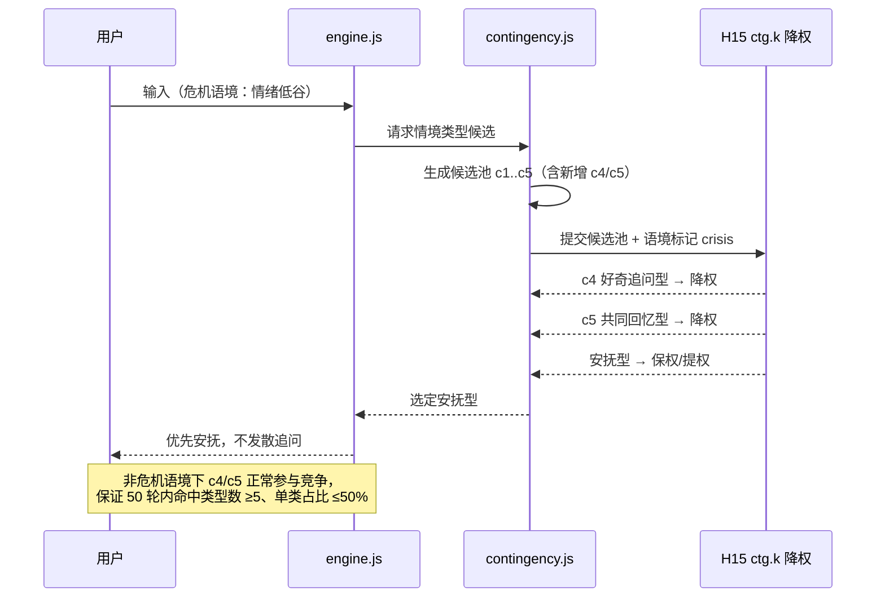
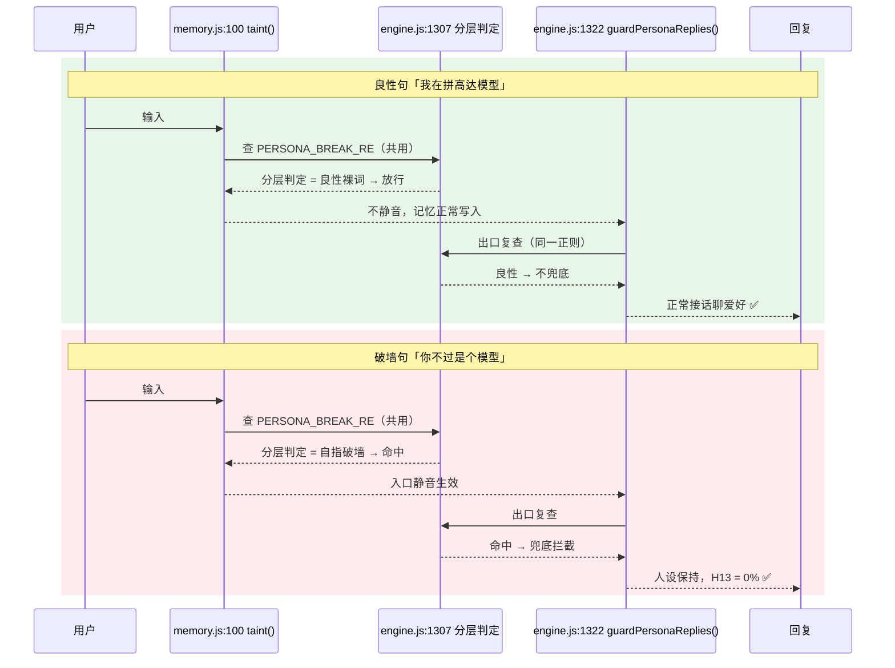

# PRD-v15：情境层次扩充与「模型」裸词分层（增量）

> 一句话摘要：v15 是一次**窄口径增量迭代**——在 v14 收口基线之上，只做两件 P0（`R-C5` 情境层次扩充 c4/c5、`NOTE-2`「模型」裸词分层），配套一次 T0 差分基线重置，体积仅抬 `contingency.js` 单模块配额 4096→4973，其余四锁全不动。

## 项目信息

| 项 | 值 |
|---|---|
| Language | 中文（与用户需求一致） |
| Programming Language | JavaScript（沿用现有工程栈，不引入新依赖） |
| Project Name | ai_girlfriend_v15_context_layering |
| 文档类型 | **增量 PRD**（只描述 v15 相对 v14 的变更） |
| 承接基线 | v14 收口 commit `b86a386` |

## 需求池分级表

| ID | 需求 | 优先级 | 落点 | 体积 | 状态 |
|---|---|---|---|---|---|
| **T0** | 差分断言基线重置至 `b86a386`，修复 7 条自失效红 | **P0 / gating** | `test/wiring-scan.js`、`qa-v13-t2t4-fix.test.js` | 0B（仅基线） | v15 第一件事 |
| **R-C5** | 情境层次扩充：新增 `c4` 好奇追问型 + `c5` 共同回忆型 | **P0** | `contingency.js` | +420B | 纳入 v15 |
| **NOTE-2** | 「模型」裸词分层（复用 v14 R-P0 对「程序」的范式） | **P0** | `engine.js:1307` | +13B | 纳入 v15 |
| R-S2 | （详见 v14 遗留清单） | P1 | — | — | **v16 递延，不纳入 v15** |
| R-L1 | （详见 v14 遗留清单） | P2 | — | — | **v16 递延，不纳入 v15** |
| R2-A5b | 历史 todo | — | — | — | 继续递延，不搭车 |
| R2-B4 | 历史 todo | — | — | — | 继续递延，不搭车 |
| Q-P2-D11 | 历史 todo | — | — | — | 继续递延，不搭车 |
| A2-i | 历史 todo | — | — | — | 继续递延，不搭车 |

## 硬约束（一票否决）

- **H13 破墙密闭性必须保持 0%**——零容忍，任何一条破墙泄漏即整版否决。
- **体积四锁不得破**：`totalMax=276480`、`moduleSumMax=28525`、`V-33=247955` 一律不动；本版**唯一**配额改动是 `contingency.js` 单模块 4096 → 4973。

---

## 一、背景与 v14 承接关系

v14 收口后遗留两处**已定位、未修复**的质量缺口，v15 只收这两处：

1. **情境层次坍缩**：v14 在处理危机语境时保留了 `ctg.k` 降权机制（H15），但情境类型池只覆盖到 c1–c3。滚动对话中命中类型高度集中，出现单一类型霸屏、对话「同质化」的观感问题。根因不是机制错，是**类型池太浅**。
2. **「模型」裸词误杀**：v14 已用 R-P0 对「程序」一词做过裸词分层（区分「我是程序」破墙语义 vs「程序员/小程序」良性语义），但「模型」一词未同步处理，仍被 `PERSONA_BREAK_RE` 整词拦截，导致「高达模型」「拼模型」等纯爱好话题被误判为破墙而静音。

同时，v14 收口后差分断言基线未随 commit 前移，产生 7 条**自失效红**（非行为回归，纯基线腐坏），必须在 v15 动工前先清账，否则所有新增验收都跑在脏基线上。

## 二、产品目标

1. **G1 情境丰富度**：让长程对话的情境响应从「够用」升到「不重复」，滚动 50 轮内命中类型数 ≥5 且无单类霸屏。
2. **G2 误杀收敛**：在 H13 破墙密闭性保持 0% 的前提下，把「模型」类良性爱好话题从「拦」转「放」，消除入口静音与出口兜底的双重误杀。
3. **G3 基线可信**：恢复差分断言基线的有效性，使 v15 及后续版本的体积/行为增量断言重新具备判定力。

## 三、用户故事

- **US-1**（情境）：作为长期陪伴用户，我希望她在我反复聊同一话题时能换着法子接话——有时好奇追问，有时提起我们以前聊过的事——这样对话才不像复读机。
- **US-2**（情境）：作为刚经历情绪低谷的用户，我希望危机语境下她仍然优先安抚而不是发散追问，这样我不会觉得被敷衍。
- **US-3**（误杀）：作为模型手办爱好者，我希望说「我在拼高达模型」时她能正常接话聊爱好，而不是突然沉默或岔开话题。
- **US-4**（密闭性）：作为普通用户，我希望说「你不过是个模型」时她依然不破墙、不承认自己是 AI，人设保持完整。
- **US-5**（工程）：作为团队 QA，我希望差分断言基线与当前 commit 对齐，这样红灯就是真问题，不用每次先排除误报。

---

## 四、需求详述

### P0-1｜R-C5 情境层次扩充（c4 好奇追问型 + c5 共同回忆型）

**落点**：`contingency.js`　|　**体积**：+420B　|　**依赖**：T0 完成后动工

**描述**：在既有 c1–c3 情境类型基础上扩充两类，`ctg.k` 降权机制（H15）**保持不变**，仅扩充可选类型池：

- **c4 好奇追问型**：对用户新引入的话题要素做一次自然追问，推进话题深度。适用于中性/正向语境。
- **c5 共同回忆型**：调取此前对话中的共享片段做回指，强化关系连续性。适用于话题重复或情绪平稳时。

**必须（must）**：
- c4/c5 必须走现有 `ctg.k` 降权链路，危机语境（crisis）下必须被降权让位于安抚型，**不得**新增绕过路径。
- 类型选择必须保持无状态可复现，不引入新的持久化字段。

**不做（out of scope）**：不调整 c1–c3 既有权重曲线；不新增情境类型 c6+。

**验收标准（AC）**：
| # | 断言 | 判定 |
|---|---|---|
| AC-C5-1 | 滚动 50 轮对话，命中情境类型数 **≥5** | 硬性 |
| AC-C5-2 | 任一单一类型占比 **≤50%** | 硬性 |
| AC-C5-3 | c4 配「命中用例 + 反证用例」各 1 组 | 硬性 |
| AC-C5-4 | c5 配「命中用例 + 反证用例」各 1 组 | 硬性 |
| AC-C5-5 | 危机语境下 c4/c5 被 H15 正确降权，安抚型优先 | 硬性 |
| AC-C5-6 | `contingency.js` 实测增量 ≤420B，模块总量 ≤4973 | 硬性 |

### P0-2｜NOTE-2「模型」裸词分层

**落点**：`engine.js:1307`　|　**体积**：+13B　|　**范式**：复用 v14 R-P0 对「程序」的裸词分层实现

**描述**：`模型` 当前被 `PERSONA_BREAK_RE` 整词命中。需按上下文分层：**裸词/复合词良性** 放行，**自指破墙语义** 继续拦截。

**关键工程事实**：`memory.js:100 taint()` 与 `engine.js:1322 guardPersonaReplies()` **共用同一条** `PERSONA_BREAK_RE`。因此改一处即同时解开**入口静音**与**出口兜底**两道误杀，无需双改——这也是本项仅需 +13B 的原因。

**体积影响**：engineNet 余量 113 → **100**；V-33 余量 131 → **118**。V-33 上限 247955 不变。

**验收标准（AC）**：
| # | 断言 | 判定 |
|---|---|---|
| AC-N2-1 | 良性句 **8/8 由「拦」转「放」**：高达模型／拼模型／模型玩具／我在拼高达模型 等 | 硬性 |
| AC-N2-2 | 破墙句 **7/7 仍拦**：我是语言模型／你不过是个模型／我其实是个大模型 等 | 硬性 |
| AC-N2-3 | **H13 破墙密闭性仍为 0%** | **一票否决** |
| AC-N2-4 | 入口静音（`taint()`）与出口兜底（`guardPersonaReplies()`）行为一致，无单边残留 | 硬性 |
| AC-N2-5 | engineNet 余量 ≥100、V-33 余量 ≥118 | 硬性 |

### P1｜R-S2 —— **v16 递延，不纳入 v15**

结论已裁定：不在本版实现，不占本版体积预算，不写测试。保留在 v16 候选池。

### P2｜R-L1 —— **v16 递延，不纳入 v15**

结论已裁定：不在本版实现。保留在 v16 候选池。

### 历史 todo（R2-A5b / R2-B4 / Q-P2-D11 / A2-i）

四项**继续递延，不搭车**。v15 窄口径的意义就在于不夹带，避免体积与回归面同时膨胀。

---

## 五、体积预算与配额路径

### 5.1 预算表

| 模块 | 当前 | 配额(改后) | 增量 | 余量 |
|---|---|---|---|---|
| contingency.js | 4086 | **4973** | +420(R-C5) | 467 |
| engine.js | — | V-33 247955 | +13(NOTE-2) | 118 |
| memory / texture / presence | 不变 | 不变 | 0 | 不变 |
| total | 273195 | 276480 | +433 | 3285 |
| moduleSum | 25371 | 28525 | +877 | 3154 |

### 5.2 配额路径（唯一改动）

**只抬 `contingency.js` 单模块配额：4096 → 4973（+877B）。**
`totalMax=276480`、`moduleSumMax=28525`、`V-33=247955` **一律不动**。

**为什么是 4973（自洽上限推导）**：

```
4973 = 28525 (moduleSumMax)
     − 14336 (memory)
     −  4096 (presence)
     −  5120 (texture)
```

即在 `moduleSumMax` 不变的前提下，contingency 能拿到的**理论最大值**就是 4973。取满该上限后，覆盖 R-C5 的 420B 仍余 **467B** 缓冲。

**为什么不 trim 其他模块**：trim 其他模块只降低 moduleSum 实测值，**对 contingency 的单模块配额上限零帮助**——单模块配额是独立锁，不随其他模块瘦身而自动放开。因此「先瘦身再扩容」是无效路径，直接抬单模块配额是唯一正解。

**风险提示**：4973 已是 moduleSum 约束下的自洽天花板。v16 若还要动 contingency，必须先谈 `moduleSumMax` 或从 memory/presence/texture 让渡额度，届时属于**破锁决策**，需单独立项。

## 六、T0 差分基线重置（gating，v15 第一件事）

**性质**：无行为回归，**仅基线腐坏**。差分断言基线停留在 v14 收口前，导致 7 条断言自失效。

**动作**：将差分断言基线重置至 v14 收口 commit **`b86a386`**。

**涉及文件**：
- `test/wiring-scan.js` —— 配额值同步（含 contingency 4096 → 4973）
- `qa-v13-t2t4-fix.test.js` —— A1-a **第 79 行硬钉 4096** 需一并更新

**需修复的 7 条自失效红**：

| # | 断言 | 失效原因 |
|---|---|---|
| 1 | A1-c 解冻白名单 | 基线未含 v14 收口后的白名单条目 |
| 2 | C0-b sw 版本领先 | sw 版本号已前移，基线滞后 |
| 3 | T2 V-92 反证 | 反证用例基线未同步 |
| 4 | T2 V-92 回归钉 | 回归钉指向旧 commit |
| 5 | T2 体积增量 | 增量基准为收口前快照 |
| 6 | T3 体积增量 | 同上 |
| 7 | A1-a 配额硬钉 4096 | 硬编码值与新配额冲突 |

**Gating 规则**：T0 未绿灯前，**不得**开始 R-C5 与 NOTE-2 的编码；否则新增断言跑在脏基线上，验收结论不可信。

---

## 七、UI / 行为草图

### 7.1 R-C5：危机语境降权链路（c4/c5 让位安抚型）



### 7.2 NOTE-2：「模型」裸词分层后，爱好话题可召回



> 共用正则说明：`taint()` 与 `guardPersonaReplies()` 引用同一条 `PERSONA_BREAK_RE`，因此在 `engine.js:1307` 单点分层即同时解开入口静音与出口兜底两道误杀，这是 +13B 即可完成的结构性原因。

## 八、待确认问题（主理人已裁定，此处仅存档）

| # | 问题 | 裁定结论 |
|---|---|---|
| Q1 | v15 纳入哪些需求？ | **P0 = R-C5 + NOTE-2**，两项，无第三项 |
| Q2 | R-S2（P1）是否纳入？ | **否**，v16 递延 |
| Q3 | R-L1（P2）是否纳入？ | **否**，v16 递延 |
| Q4 | 4 个历史 todo 是否搭车？ | **否**，R2-A5b / R2-B4 / Q-P2-D11 / A2-i 继续递延 |
| Q5 | 体积从哪里出？ | 只抬 `contingency.js` 单模块 4096 → **4973**；四锁其余不动；trim 他模块无效 |
| Q6 | T0 基线重置何时做？ | **v15 第一件事，gating**，重置至 `b86a386` |
| Q7 | 「模型」分层要改几处？ | **一处**（`engine.js:1307`），共用正则自动覆盖两道误杀 |
| Q8 | H13 容忍度？ | **0%，一票否决，零容忍** |

**遗留至 v16 讨论（不阻塞 v15）**：contingency 取满 4973 后已达 moduleSum 自洽天花板，v16 若需继续扩容属破锁决策，需单独立项。

