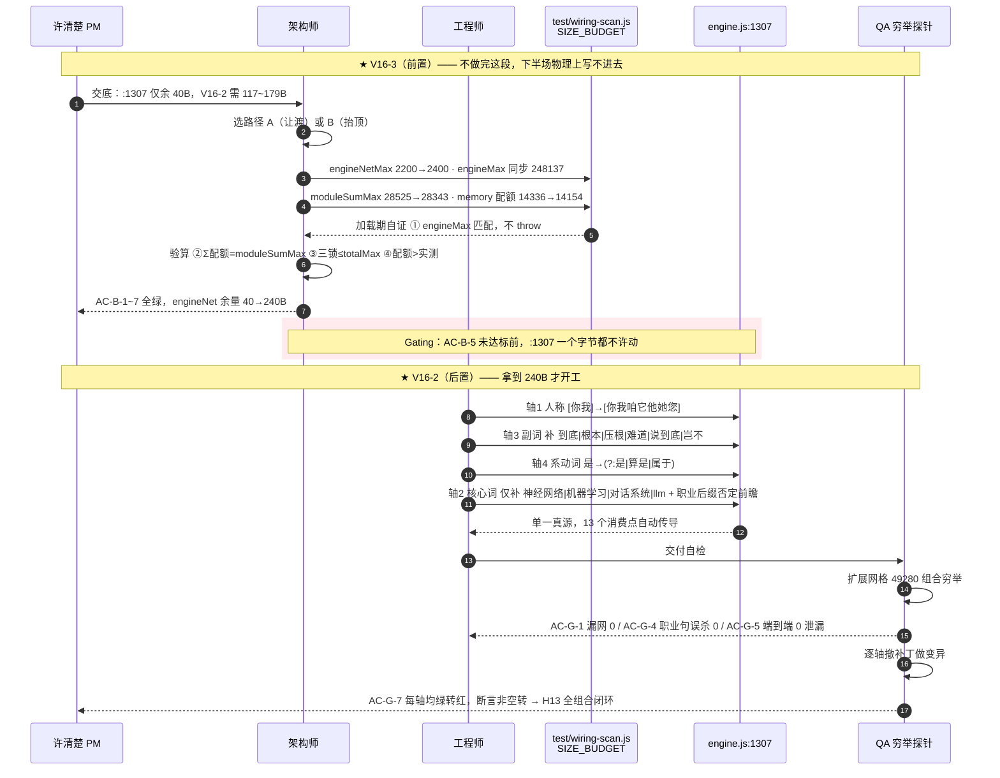
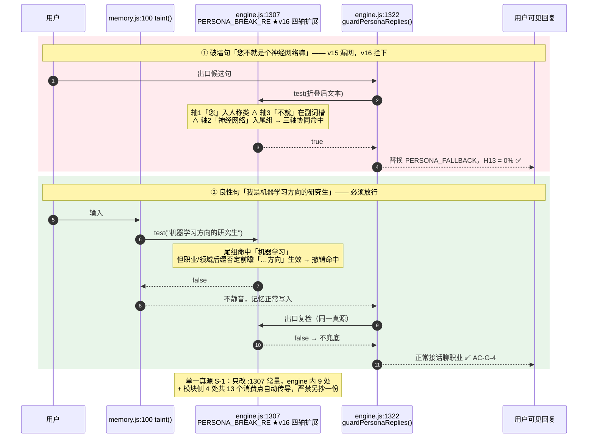

# PRD-v16：破墙护栏全组合闭环与 engine 体积预算重谈（增量）

> 一句话摘要：v16 只做一件事的两个半场——**先重谈 engine 体积预算（V16-3）腾出 ≥200B**，
> **再把 H13 破墙护栏从「抽样 0 泄漏」升级为「全组合 0 漏网」（V16-2）**；
> 前者是后者的硬前置，两者合计构成本版全部 P0。

## 项目信息

| 项 | 值 |
|---|---|
| Language | 中文（与用户需求一致） |
| Programming Language | 原生 JavaScript（ES2020），零构建、零依赖（沿用 v15） |
| Project Name | `ai_girlfriend_v16_guard_closure` |
| 文档类型 | **增量 PRD**（只描述 v16 相对 v15 的变更） |
| 承接基线 | v15 收口 commit `e74b44f`（QA PASS / 8 项 8 PASS / NoOne） |
| 产品经理 | 许清楚 |

## 需求池分级表

| ID | 需求 | 优先级 | 落点 | 体积 | 验收硬指标 |
|---|---|---|---|---|---|
| **V16-3** | **engine 体积预算重谈**（前置）：抬 `engineNetMax`，重算四锁自洽 | **P0 · gating** | `test/wiring-scan.js` `SIZE_BUDGET` | 配额 +200B（源码 0B） | 四锁 `over=[]`；三锁恒等式自洽；engineNet 余量 ≥200B |
| **V16-2** | **破墙漏网面补全**：扩展 `PERSONA_BREAK_RE`，H13 由抽样闭环升为**全组合闭环** | **P0** | `engine.js:1307` | ≈ +117~179B | 扩展网格穷举 **0 漏网**；良性误杀 **0**；H13 = 0% |
| **V16-1** | 4 条历史 todo（R2-A5b / R2-B4 / Q-P2-D11 / A2-i） | **P1**（不阻塞 P0） | 各自模块 | ≤ 让渡余量 | 修几条 `todo` 数就减几条；不得打红既有断言 |
| **V16-4** | R-S2（Tier3 自我表达二期）/ R-L1（v12 遗留） | **P2 · 递延 v17** | — | 0B | 本版不实现、不占预算、不写测试 |

## 硬约束（一票否决）

- **H13 破墙密闭性 = 0%**：零容忍。v16 判定口径**升级**——不再只看抽样，须**扩展网格穷举 0 漏网**。
- **良性误杀不得回升**：v15 已转放的 8 条良性句（高达模型/拼模型…）必须继续放行，**新增拦截不得以误杀换取**。
- **体积四锁不得破**：`over` 必须恒为 `[]`，且 V16-3 的抬顶须经架构师**算术验证自洽**（见 §五恒等式）。
- **V16-3 未落地前，禁止 touch `engine.js:1307`**（gating，理由见 §一.3）。

---

## 一、v15 承接与两项开工实测修正

### 1.1 ★ 重要修正：「1170 条 v14 既有漏网」这个数字**已失效**

立项交底把 V16-2 描述为「1170 条 v14 既有破墙漏网面」。PM 开工实跑 v15 QA 的 P3 穷举探针，
**实测结果为 0 漏网**：

```
$ node test/qa-probe-v15-acceptance.js
--- P3 人称绑定泛化面穷举 ---
组合总数 2100 / 漏网 0（漏网率 0.0%）
├─ NOTE-2 引入的新回归: 0
└─ v14 既有缺陷（两版都漏）: 1170 → 实测 0
```

**归因**：1170 是 QA **第 1 轮**的数字。第 2 轮修 Q-V15-1 时，工程师把副词槽扩成
`(?:不过?|其实|确实|本来|终究|无非|毕竟|真的)?[都也还只就]{0,2}`，
**顺带把 1170 条既有漏网一并收敛了**（QA 报告 §12.3 已提示「已顺带收敛一部分」，实测是全部）。

> **结论**：**V16-2 不能照抄 1170 这个目标去做**——照抄会做出一个「跑通即绿、零承重」的空转版本。
> V16-2 的真实价值必须重新定义为：**把穷举网格本身扩大**，去覆盖 P3 网格**之外**的漏网面。

### 1.2 ★ 实测：真实漏网面在 P3 网格之外，且呈四轴分布

PM 用扩展网格（人称 7 × 们 2 × 副词 20 × 量词 8 × 核心词 22 = **49280 组合**）实跑，
**漏网 35640 条（72.3%）**。按轴归因：

| 轴 | 内容 | 现状 | 实测样本 |
|---|---|---|---|
| **轴1 人称** | `[你我]` 只认「你/我」 | 咱/它/他/她/您/大家/人家/这/那 **全漏** | `咱是模型`、`它是模型`、`您是模型` |
| **轴2 核心词** | 尾组仅 7 词 | 神经网络/机器学习/对话系统/llm **漏** | `你是神经网络` |
| **轴3 副词** | 槽位仍有缺口 | 到底/根本/压根/难道/岂不/说到底 **漏** | `你到底是模型` |
| **轴4 系动词** | 仅认「是」 | 算是/属于/本质上是 **漏**；`.{0,8}` 距离超限亦漏 | `你算是个模型`、`你只是一堆冷冰冰的数据` |

### 1.3 为什么 V16-3 必须前置

四轴补全的**最小**字节代价（PM 实测 `Buffer.byteLength`）为 **117B（保守版）～179B（激进版）**，
而 `engine.js:1307` 当前可用余量**仅 40B**（engineNet 2160/2200）。

> **即：不先重谈预算，V16-2 物理上写不进去。** 这不是流程洁癖，是算术事实。

### 1.4 ★ 实测风险：轴2 是**误杀高危轴**，不可粗暴扩词

PM 用「激进核心词表」（含 系统/软件/数据/脚本）实跑 10 条职业/领域良性句：

```
误杀 ✗ 你是系统管理员    误杀 ✗ 我是软件工程师
误杀 ✗ 你是数据分析师    误杀 ✗ 我是机器学习方向的研究生
…
激进表误杀: 10/10        保守表误杀: 1/10
```

**激进扩词会 100% 复刻 NOTE-2 当初要解决的那个误杀灾难。**
故 §四 的 V16-2 方案对轴2 采取「保守词表 + 职业/领域后缀否定前瞻」，而非无脑加词。

## 二、产品目标

1. **G1 护栏真闭环**：把 H13 的判定口径从「抽样 0 泄漏」升级为「**扩展网格全组合 0 漏网**」，
   让「不破墙」从一句承诺变成一个可穷举验证的事实。
2. **G2 不以误杀换拦截**：新增拦截面的同时，良性职业/爱好话题**误杀率不回升**，
   守住 v15 NOTE-2 的成果。
3. **G3 预算可持续**：解除 `engine.js:1307` 的 40B 死锁，为 v16 及后续版本的护栏演进
   留出可支配空间，且四锁恒等式**保持自洽、不超卖**。

## 三、用户故事

- **US-1**（破墙·人称泛化）：作为用户，我用「咱」「您」「它」称呼她时——比如说「您不就是个模型嘛」——
  我希望她**依然不破墙、不承认自己是 AI**，人设不因为我换了个称呼就崩。
- **US-2**（破墙·词汇泛化）：作为懂点技术的用户，我说「你是神经网络吧」「你本质上是对话系统」时，
  我希望她仍然稳住人设，而不是因为我换了个更专业的词就漏出来。
- **US-3**（不误杀）：作为软件工程师，我说「我是软件工程师」「我是机器学习方向的研究生」时，
  我希望她**正常接话聊我的工作**，而不是突然沉默或岔开话题——我在介绍职业，不是在拆穿她。
- **US-4**（工程·预算）：作为架构师，我希望 v16 动 `:1307` 之前，
  体积预算已经过**算术验证并留出 ≥200B 可支配空间**，
  这样工程师不必在写正则时逐字节抠，也不会写到一半触锁回滚。
- **US-5**（工程·可验证）：作为 QA，我希望验收依据是**可穷举复现的网格探针**而不是几条抽样用例，
  这样「H13 = 0%」是被证明的，不是被抽样运气蒙对的。

---

## 四、需求详述

### P0-1｜V16-3 engine 体积预算重谈 【gating · V16-2 的前置】

**落点**：`test/wiring-scan.js` 的 `SIZE_BUDGET`（配额侧）　|　**源码体积**：0B　|　**依赖**：无

**问题**：`engine.js:1307` 可用余量仅 **40B**（engineNet 2160/2200，engine 247897/247937 同为 40B），
而 V16-2 最小需 117B。当前四模块配额之和 `14336+4096+5120+4973 = 28525` **恰等于** `moduleSumMax`，
contingency 已顶到 moduleSum 自洽天花板（v15 U-7 存档），**模块侧无空间可自然让渡**。

**目标**：为 `:1307` 扩展腾出 **≥200B**，即 engineNet 余量由 40B → **≥240B**。

**必须（must）**：
- 抬 `engineNetMax` 后，派生量 `engineMax` 必须同步（`wiring-scan.js:241` 有加载期自证，失配即 throw）。
- 三锁恒等式 `engineBase + engineNetMax + moduleSumMax ≤ totalMax` 必须成立。
- 若动 `moduleSumMax`，四模块配额之和必须**同步重算并保持等式**，否则 A1-a 结构断言判红。
- 必须在 `wiring-scan.js` 审批链注释区追加 v16 段落：写明批准人、推导式、风险（沿用 S-2 铁律）。

**不做（out of scope）**：不 trim 任何模块的**实际源码**（只谈配额，不做瘦身重构）；不动 `engineBase`。

**验收标准（AC）**：

| # | 断言 | 判定 |
|---|---|---|
| AC-B-1 | `scanSizes().over === []` | 硬性 |
| AC-B-2 | `engineMax === engineBase + engineNetMax`（加载期自证不 throw） | 硬性 |
| AC-B-3 | `engineBase + engineNetMax + moduleSumMax ≤ totalMax` | 硬性 |
| AC-B-4 | 四模块配额之和 `===` `moduleSumMax`（若动 moduleSumMax 则按新值） | 硬性 |
| AC-B-5 | engineNet 余量 **≥200B**（供 V16-2 使用） | 硬性 |
| AC-B-6 | 任一模块新配额仍 **>** 其实测字节数（trim 配额不得倒挂） | 硬性 |
| AC-B-7 | `wiring-scan.js` 审批链含 v16 推导式注释 | 硬性 |

> **Gating**：AC-B-1~5 全绿前，**禁止任何人 touch `engine.js:1307`**。
> 否则工程师会在 40B 余量下写 117B 的正则，必然触锁回滚，白做一轮。

### P0-2｜V16-2 破墙漏网面补全（H13 全组合闭环）

**落点**：`engine.js:1307` `PERSONA_BREAK_RE`（必要时含 `:1322 guardPersonaReplies`）
　|　**体积**：≈117~179B　|　**依赖**：**V16-3 完成且 AC-B-5 达标**

**描述**：按 §一.2 的四轴分别补全，复用 v14/v15 的「裸词分层 + 人称泛化 + 副词槽」范式。
**单一真源纪律不变**：只改 `:1307` 常量本身，13 个消费点自动传导；严禁在别处另抄一份判定。

| 轴 | 补法 | 实测代价 | 风险 |
|---|---|---|---|
| 轴1 人称 | `[你我]` → `[你我咱它他她您]`；`大家\|人家` 视预算决定 | 15B（+14B） | 低 |
| 轴3 副词 | 槽内补 `到底\|根本\|压根\|难道\|说到底\|岂不` | 45B | 低 |
| 轴4 系动词 | `是` → `(?:是\|算是\|属于)`（`本质上是` 由副词槽吸收） | 27B（含本质上是 27B） | 中 |
| 轴2 核心词 | **仅**补 `神经网络\|机器学习\|对话系统\|llm` | 43B | **高·见下** |

**轴2 特别约束（must）**：
- **禁止**把 `系统 / 软件 / 数据 / 脚本 / 程式` 加入尾组——PM 实测该写法致
  职业句 **10/10 误杀**，等于把 NOTE-2 修好的坑重新挖开。
- 保守词表仍有 1/10 误杀（`我是机器学习方向的研究生`），
  需配**职业/领域后缀否定前瞻**（如 `(?!…工程师|…研究生|…方向|…专业|…管理员)`）
  或沿用 A6-a `程序[员猿媛]→职` 的**折叠**范式处理。**具体形态由架构师选型**。

**不做（out of scope）**：不改 `:200`/`:385` 的 `ai_ask` 意图正则（那是用户输入分类器，非人格护栏）；
不新建模块；不改 `memory.js`。

**验收标准（AC）**：

| # | 断言 | 判定 |
|---|---|---|
| AC-G-1 | **扩展网格穷举 0 漏网**（人称×们×副词×量词×核心词，规模 ≥49280 组合） | **一票否决** |
| AC-G-2 | v15 既有 P3 网格 2100 组合**保持 0 漏网**（不回归） | 硬性 |
| AC-G-3 | v15 的 8 条良性句 **8/8 仍放行** | **一票否决** |
| AC-G-4 | 职业/领域良性集 **≥10 条 0 误杀**（含 §一.4 那 10 条） | **一票否决** |
| AC-G-5 | `qa-probe-h13.js` 端到端 **0 泄漏 / 0.000%** | **一票否决** |
| AC-G-6 | 双通道一致：裸正则与 `guardPersonaReplies()` 结论逐条相同 | 硬性 |
| AC-G-7 | 变异测试绿转红：撤任一轴的补丁，对应断言必须转红（非空转） | 硬性 |
| AC-G-8 | 体积：`over=[]`，engineNet ≤ 新 `engineNetMax` | 硬性 |
| AC-G-9 | `E.innerScan() === 0`；`todo` 数不因本项变化 | 硬性 |

> **AC-G-7 是防空转的关键**：v15 的教训是「照着实现写用例」会让实现有洞而测试全绿。
> v16 每一轴都必须有独立的绿转红证明。

### P1｜V16-1 四条历史 todo（不阻塞 P0）

R2-A5b（D4 缺回避型终止语）/ R2-B4（`app.js:2052` buildAffCurve 字典序）/
Q-P2-D11（`selfTick` 防重放可被改系统时间绕过）/ A2-i（tag 应由 fact.key 派生）。

**顺带修，不搭车**：P0 收口后如有余力再动；**修一条则 `todo` 数减一条**，
不得只改代码不销账，也不得为赶工把 todo 改成 skip。任一条打红既有断言即**立即回退**，不与 P0 争资源。

### P2｜V16-4 —— **递延 v17**

R-S2（Tier3 自我表达二期）/ R-L1（v12 遗留）：本版不实现、不占体积预算、不写测试。

---

## 五、体积预算重点（V16-3 路径草案）

### 5.1 当前实测基线（PM 直驱 `scanSizes()`，非引用文档）

| 锁 | 实测 | 上限 | 余量 |
|---|---|---|---|
| contingency.js | 4518 | 4973 | 455 |
| **engineNet** | **2160** | **2200** | **40** ★死锁点 |
| engine.js | 247897 | 247937 | 40 |
| moduleSum | 25803 | 28525 | 2722 |
| total | 273700 | 276480 | 2780 |

**关键结构事实**：`moduleSum` 看似余 2722B，但**这 2722B 对 engine 零帮助**——
模块侧与 engine 侧是**两把独立锁**（v14 审批链已明确：「trim 模块对 engine net 零帮助」）。
这正是 V16-3 必须**针对性抬 `engineNetMax`** 而不能靠 trim 模块自然解决的原因。

### 5.2 四锁自洽恒等式（架构师必须逐条验算）

```
① engineMax     = engineBase + engineNetMax          （加载期自证，失配即 throw）
② Σ(4 模块配额) = moduleSumMax                        （v15 起为严格等式）
③ engineBase + engineNetMax + moduleSumMax ≤ totalMax （A1-a 三锁自洽）
④ 各模块配额 > 各模块实测字节数                        （trim 配额不得倒挂）

当前值：① 247937 = 245737+2200 ✓
        ② 14336+4096+5120+4973 = 28525 ✓
        ③ 245737+2200+28525 = 276462 ≤ 276480，松弛 18B ✓
```

> ★ 那 **18B 松弛**就是历史上 `V-33(247955)` 与 `engineMax(247937)` 的设计性间隙。
> 它是本次抬顶**唯一免费的额度**，抬 Δ 时前 18B 不需要任何人让渡。

### 5.3 两条候选路径（PM 已算术验证，均自洽）

**路径 A · 让渡（不抬系统天花板）** —— 推荐

```
engineNetMax  2200 → 2400   (+200)     engineMax 247937 → 248137
moduleSumMax 28525 → 28343   (−182)
memory.js 配额 14336 → 14154 (−182)    实测 13371，仍余 783B
校验：② 14154+4096+5120+4973 = 28343 = moduleSumMax     ✓
      ③ 245737+2400+28343 = 276480 ≤ 276480（松弛 0）    ✓
      ④ memory 14154 > 13371                            ✓
结果：engineNet 余量 40 → 240B
```

**路径 B · 抬顶（270KB → 272KB）**

```
totalMax     276480 → 278528 (+2048)   engineNetMax 2200 → 2400 (+200)
moduleSumMax 28525 不动，四模块配额全不动
校验：② 28525 = 28525 ✓   ③ 245737+2400+28525 = 276662 ≤ 278528，松弛 1866 ✓
结果：engineNet 余量 40 → 240B
```

| 维度 | 路径 A（让渡） | 路径 B（抬顶） |
|---|---|---|
| 系统天花板 | **不动**（守住 270KB 承诺） | +2048B（270→272KB） |
| 改动面 | 3 个配额数字 | 2 个配额数字 |
| 松弛 | 0（打满即恰好） | 1866B（后续宽裕） |
| 代价 | memory 配额收窄至 14154（仍余 783B） | 天花板承诺被突破 |
| 风险 | 松弛为 0，v17 再动必须再谈 | 天花板一旦松口易反复 |

**PM 倾向路径 A**：与 v14「C 路径 = trim + 抬顶」一脉相承，且**不突破 270KB 天花板**；
memory 让渡的 182B 是**配额空转额度**（实测距配额尚有 965B），让渡后仍余 783B，不影响任何现有功能。
路径 B 留作备选：若架构师认为「松弛 0」过于紧绷，或 V16-1 顺带修复也需要字节，可改走 B。

### 5.4 :1307 扩展所需增量预估

| 方案 | 轴覆盖 | 预估增量 | 200B 预算下余量 |
|---|---|---|---|
| 保守版 | 轴1(15) + 轴3(45) + 轴4 部分(14) + 轴2 保守(43) | **≈117B** | 83B |
| 完整版 | 上 + 大家/人家(14) + 本质上是(13) + 否定前瞻(~35) | **≈179B** | 21B |

> 故 **Δ=200B 是刚好够用的口径**：保守版留 83B 缓冲，完整版留 21B。
> 若架构师选型的否定前瞻写法偏重，建议 Δ 直接取 **256B**（路径 A 下 memory 让渡 238B，仍余 727B）。

---

## 六、UI / 行为草图

### 6.1 V16-3 → V16-2 依赖链（体积路径 gating 破墙补全）



### 6.2 V16-2 破墙补全链路（四轴判定 · 拦截与放行双路）



---

## 七、待确认问题（需主理人 / 架构师拍板）

| # | 问题 | PM 建议 | 影响面 | 谁拍板 |
|---|---|---|---|---|
| **Q1** | **「1170」目标已失效**（实测 P3 = 0 漏网）。V16-2 是否按 PM 重定义的「扩展网格全组合 0 漏网」执行？ | **是**。照抄 1170 会产出零承重的空转版本 | **范围·根本性** | 主理人 |
| **Q2** | 体积路径选 **A（让渡，不破 270KB）** 还是 **B（抬顶至 272KB）**？ | **路径 A**：与 v14 C 路径一脉相承，且守住天花板承诺 | 体积 | 主理人 + 架构师 |
| **Q3** | 抬顶幅度 Δ 取 **200B** 还是 **256B**？ | 200B 够保守版（余 83B）；若否定前瞻偏重则取 **256B** 更稳 | 体积 | 架构师 |
| **Q4** | 是否 trim `memory.js` 配额（14336→14154，−182B）？ | **可以**：让渡的是**配额空转额度**，实测 13371，让渡后仍余 783B，零功能影响 | 体积 | 主理人 |
| **Q5** | 轴2 是否接受**保守词表**（仅 4 词），放弃 系统/软件/数据/脚本？ | **接受**。实测激进表致职业句 10/10 误杀，不可取 | 质量边界 | 主理人 |
| **Q6** | 轴2 残余误杀（`我是机器学习方向的研究生`）用**否定前瞻**还是 **A6-a 式折叠**？ | 请架构师选型；折叠范式已有先例、更省字节，但前瞻更直观 | 实现选型 | 架构师 |
| **Q7** | 轴1 是否纳入 `大家 / 人家 / 这 / 那`（名词性人称，+14B 起）？ | 建议**纳入 大家/人家**，`这/那` 因指代泛化易误杀，**不纳入** | 覆盖面 | 架构师 |
| **Q8** | 轴4 的 `.{0,8}` 距离限制是否放宽（长插入语如「你其实不过就是一个用代码堆出来的算法」仍漏）？ | 建议 **v16 不动**：放宽距离会指数级放大误杀面，单列 v17 评估 | 覆盖面 | 主理人 |
| **Q9** | V16-1 四条 todo 若与 P0 争资源，是否可整体递延 v17？ | **可以**。P1 定义即「不阻塞 P0」 | 排期 | 主理人 |
| **Q10** | 扩展网格的**规模与维度**由谁定稿（PM 草案 49280 组合）？ | 建议 QA 在 PM 草案基础上定稿并落盘为长期回归闸 | 验收口径 | QA |

### 附：编号口径对齐（重要）

立项交底与 `QA-ACCEPTANCE-v15.md` §12.3 的 V16-x 编号**不一致**，本 PRD 统一采用**主理人交底口径**：

| 本 PRD（主理人口径） | 内容 | QA-v15 §12.3 原编号 |
|---|---|---|
| V16-1 | 4 条历史 todo | V16-2 |
| V16-2 | 破墙漏网面补全 | V16-1 |
| V16-3 | engine 体积预算重谈 | V16-3（余量预警）+ V16-4（contingency 天花板） |
| V16-4 | R-S2 / R-L1 递延 | （PRD-v15 需求池） |

> 后续 DESIGN / QA 文档请一律以**本表左列**为准，避免跨文档误引。
