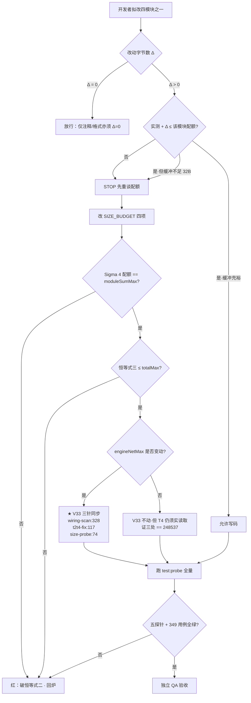

# PRD-v19 配额治理 · 上限书面化 · 黑名单精简

> 本 PRD 为**立项文档**，不含实现方案。所有体积数字均为 2 号基线实测（`fs.statSync().size`），
> 已在起草时对 `engine.js` / 四模块 / `test/wiring-scan.js` / 4 个体积断言文件逐一复算。

---

## 0. T0 实测基线（v19 起点，全绿）

起草时验证：`npm test` = **349 pass / 0 fail**；`npm run test:probe` = **5 探针全 PASS**。

| 文件 | 实测 | v18 配额 | 名义余量 |
|---|---|---|---|
| engine.js | 248395 | 248537 (V33) | 142 |
| memory.js | 13333 | 13365 | **32** |
| presence.js | 3566 | 3598 | **32** |
| texture.js | 4366 | 4398 | **32** |
| contingency.js | 5652 | 6582 | 930（**存疑，见 §1.2**） |
| Σ 四模块 | 26917 | 27943 | 1026 |

engineNet 实测 = 248395 − 245737 = **2658**，上限 2800，余 **142**。

**四锁恒等式 T0 自检（全部成立）**：

```
① engineMax = engineBase + engineNetMax
   248537 = 245737 + 2800                                    ✓
② Σ(4 配额) = moduleSumMax
   13365 + 3598 + 4398 + 6582 = 27943                        ✓（严格等式）
③ engineBase + engineNetMax + moduleSumMax ≤ totalMax
   245737 + 2800 + 27943 = 276480 ≤ 276480                   ✓（slack = 0，打满）
④ 每模块配额 > 实测
   13365>13333 / 3598>3566 / 4398>4366 / 6582>5652           ✓
```

---

## 1. 产品目标 / 本次立项定位

v19 **不新增用户可见功能**。本期是一次**约束系统的自我治理**：把 v18 遗留的三个
「文档说的」与「代码实际执行的」不一致点收敛掉，让 v20+ 的功能空间是**真实可用**的，
而不是账面上存在、一动就红的。

三个正交目标：

- **G1 配额治理可执行化**：把「三模块仅余 32B，增量必须先重谈配额」从 QA 报告里的
  一句建议，升级为**机器可执行的门禁**。人不该靠记性守四锁。
- **G2 上限单一真源化**：消除 contingency 天花板的**三锁背离**（配额 6582 / 残差锁 5671 /
  净增锁 5698），使「配额表写多少」就等于「测试执行多少」。
- **G3 归一化黑名单去误导**：给 `U+FEFF` 冗余项一个**书面裁决**（精简或注释保留），
  杜绝后人「误删承重项」或「照猫画虎继续堆冗余项」。

### 1.1 v19 与 v18 的承接

v18 独立 QA 验收通过，但 §13 沉淀了 4 条不阻断发布的遗留项。v19 立项即为清算它们：
遗留 1（FEFF 冗余）→ G3；遗留 2（32B 缓冲）→ G1；遗留 3（测试名 cosmetic）→ P2-1；
遗留 4（engineNet 余 142B）→ 贯穿 §5 预算影响判断。

### 1.2 ★ 起草期新发现：contingency 的 930B 是「幽灵配额」

立项交底称「v18 A2 路径把 contingency 抬到 6582，为新增语料腾出 ~900B」。
**经复算，这 930B 目前不可用。** 四个测试文件仍在硬钉 5671：

| 位置 | 断言 | 性质 |
|---|---|---|
| `test/qa-rs2-type.test.js:299` | `b <= 5671` | 硬断言（AC-RS2-8） |
| `test/qa-rs2-type.test.js:300` | `b - 4518 <= 1180` | 硬断言（净增顶） |
| `test/qa-v15-t1.test.js:404` | `cur <= 5671` | 硬断言（AC-C5-6） |
| `test/qa-v16-size-probe.js:39` | `<= 5671` | 探针（`test:probe` 在跑） |
| `test/qa-v17-independent-size.js:62` | `<= 5671` | 探针（`test:probe` 在跑） |

**有效天花板 = min(配额 6582, 残差锁 5671, 净增锁 4518+1180=5698) = 5671。**
contingency 实测 5652 ⇒ **真实余量 19B，不是 930B。**

同时 `wiring-scan.js:332` 的配额注释白纸黑字写着「实测 5652，余 930B 为 **v19 语料备粮**」——
这句注释与测试执行结果直接矛盾。任何 v19 开发者信了这句话去写语料，**第 20 个字节就四红**
（2 个 `.test.js` + 2 个探针，且探针在 `test:probe` 全量 CI 内）。

这不是「需要重谈上限」，而是**账实背离**：配额表与断言层各说各话。G2 因此从
「重谈一个数字」升级为「消除背离 + 建立单一真源」。

---

## 2. 用户故事（内部利益相关者视角）

- **作为维护者**，我要在改任一模块前就被工具告知「你还剩几个字节 / 需不需要先重谈配额」，
  以便我不必读完 5 份 DESIGN 才敢下第一行代码。
- **作为维护者**，我要配额表注释里写的余量**就是**测试实际允许的余量，
  以便我不会照着「余 930B 备粮」写了 900B 语料，然后在 CI 上吃四个红。
- **作为 QA**，我要「四模块源码 diff = 0」是一条**可自动判定**的门禁而非口头纪律，
  以便 v19 验收时我能给出机器证据，而不是逐文件肉眼比对。
- **作为安全负责人**，我要求 v19 任何改动后 `PERSONA_BREAK_RE` 的覆盖与误杀**逐位不变**，
  H13 泄漏恒为 0，以便本期「纯治理」不偷偷成为安全回归的入口。
- **作为架构师**，我要 contingency 的天花板只有**一个**数字来源，
  以便下次抬配额时不会漏改第 4 处而在 T0 首日吃两红（v16 §5.0 的 V33 教训重演）。
- **作为后续维护者**，我要知道 `[\u200B\u200C\u200D\uFEFF]` 里哪几个字符**真正承重**，
  以便我既不误删 ZWSP/ZWNJ/ZWJ，也不以为 FEFF 是必需的而在别处继续复制这个模式。

---

## 3. 需求池（P0 / P1 / P2）

### P0 —— 必须，一票否决

#### P0-1 三模块 32B 缓冲的「源码增量 → 先重谈配额」治理流程

**问题**：memory / presence / texture 各仅余 32B。任何一次「顺手加个注释」（≥33B）
即破恒等式 ④。当前唯一防线是 QA 报告里的一句自然语言建议。

**要求**：
1. **硬规则书面化**：v19 交付期内，四模块源码 **diff 必须为 0**。
   若某项工作确需模块侧字节，**必须先走配额重谈**（改 `SIZE_BUDGET` 并同步 ①②③④ 演算），
   再写码；**不允许**「先写码再回头补配额」。
2. **回归门禁**（实现形态待 Q3 拍板）：新增 `test/qa-v19-quota-guard.js`，至少断言：
   - 四模块实测字节 === T0 锚定值（13333 / 3566 / 4366 / 5652），`strictEqual` 硬钉；
   - 四锁 ①②③④ 全成立（复用 `SIZE_BUDGET`，**不得**硬编码任何数字）；
   - 每模块缓冲 ≥ 0 且打印实际缓冲，使余量在 CI 日志中始终可见。
3. **失败信息必须可执行**：断言失败文案须直接给出
   「当前 X B / 配额 Y B / 超 Z B → 请先重谈配额，勿改码」，而非仅 `expected true`。

**验收口径**：故意给 memory.js 追加 40B → 门禁必须红（绿转红自证，反空转）。

#### P0-2 contingency R-S2 独立硬上限的书面重谈

**问题**：见 §1.2，三锁背离，有效余量 19B 而非 930B。

**先厘清两把锁的性质**（这是重谈的推导前提）：

| 锁 | 数值 | 出处 | 性质 |
|---|---|---|---|
| 残差锁 | 5671 | `27943 − (13824+3840+4608)` | **派生量**（v17 配额下的残差） |
| 净增锁 | 1180 | DESIGN-v17 §3.3 | **固有语义约束**（R-S2 特性最多加多少） |

**关键判断**：`5671` **从来不是** contingency 的固有属性，它是 v17 配额表的**残差**——
和 V33 一样是派生量。v18 把三模块配额改成 13365/3598/4398 后，残差自然变成
`27943 − 21361 = 6582`。**5671 是一个陈旧的派生值被硬编码了 4 处**，
与 v16 §5.0「V33 漏同步」是同一类缺陷，同一类修法。

而 `1180`（净增 ≤1180B，基线 4518）是**真正的设计约束**，它约束的是
「R-S2 这个特性允许膨胀多少」，与配额切分无关，不应随配额漂移。

**建议方案（推荐）**：

```
① 残差锁 5671 → 去硬编码，改为读 SIZE_BUDGET["contingency.js"]
   理由：派生量不得二次落地。与 engineMax/V33 的治理口径完全一致。
   影响：4 处（qa-rs2-type.test.js / qa-v15-t1.test.js /
        qa-v16-size-probe.js / qa-v17-independent-size.js）

② 净增锁 1180 → 2064
   推导：2064 = 6582 − 4518 = 配额 − R-S2 前基线
   效果：两把锁在同一天花板 6582 上重合，背离归零。
   现状核对：实测净增 = 5652 − 4518 = 1134 ≤ 2064 ✓（余 930B，与配额余量一致）

③ 结果：contingency 有效天花板 = min(6582, 6582) = 6582，
   实测 5652，真实可用余量 = 930B ——「备粮」注释从此为真。
```

**四锁影响：零。** `SIZE_BUDGET` 四模块配额与 `moduleSumMax` **一个字节都不动**，
Σ 恒为 27943，①②③④ 全部不受影响。本项**只改测试断言层，不改配额、不改源码**。

**备选方案**（若架构师认为 R-S2 语义顶不该随配额走）：保留 1180 不动，
把 contingency 配额下调 6582 → 5698，并把释放的 884B 回填给三个饿模块。
自洽演算见 §5.3。代价：三模块缓冲改善，但 contingency 未来语料空间锁死在 46B。
**产品侧不推荐**——它把「幽灵配额」问题换成了「幽灵语料计划」问题。

### P1 —— 应该

#### P1-1 U+FEFF 冗余黑名单的裁决

**实证**（起草时 Node 实测，非推断）：

```
/\s/.test("\uFEFF") === true      ← ECMA-262 WhiteSpace 含 <ZWNBSP>
/\s/.test("\u200B") === false
/\s/.test("\u200C") === false
/\s/.test("\u200D") === false
```

对 7 组零宽变体（`机器\uFEFF人` / `程\uFEFF序` / `\uFEFF语言模型` / `人工\uFEFF\u200B智能` 等）
逐条比对「含 FEFF 版 pnorm」与「去 FEFF 版 pnorm」，**输出差异数 = 0**。
⇒ 四字符黑名单中**仅 3 个承重**，FEFF 100% 冗余，去留不改变任何拦截行为。

**三个选项与代价**：

| 选项 | 动作 | engine.js 字节 | 评价 |
|---|---|---|---|
| A 精简 | 删 `\uFEFF`（6 字符） | **−6B**（engineNet 2658→2652） | 省字节，但削弱「`\s` 语义若变」的纵深 |
| B 注释保留 | 代码不动 + 加行内注释 | **+40~60B**（吃 142B 余量） | 最直观，但**注释要花 engineNet** |
| C 文档保留（推荐） | 代码不动，写进 DESIGN-v19 + 加回归测试 | **0B** | 零预算、防误删、防误抄 |

**推荐 C**：engine.js 只余 142B 且与 V33 两锁重合（设计性间隙 0），
**不值得为一条注释消耗 engineNet**。改为在 DESIGN-v19 明确记载「FEFF 与 `\s` 覆盖重叠，
显式列出为防御纵深，删之无害但保留无成本」，并在 `qa-v18-zerowidth.test.js` 补一条
「FEFF 变体恒被拦截」的不回归断言（测试文件不占产物预算）。
最终取舍待 Q2 拍板。

#### P1-2 配额注释与实际余量的一致性校验

`wiring-scan.js:332` 的「余 930B 为 v19 语料备粮」是本次背离的直接诱因。
要求：P0-2 落地后**同步订正该注释**；并在 P0-1 门禁中打印真实缓冲，
使「注释宣称」与「CI 实测」可被并排肉眼核对。

### P2 —— 可选（不硬凑，仅收录零风险项）

#### P2-1 `qa-v13-t1.test.js:95` 测试名订正
测试名仍写「≤248137B」，断言体已动态取 `SIZE_BUDGET.engineMax`（248537），
无功能问题（v18 QA §13-3 认定 cosmetic）。v19 顺手修名，**仅改字符串，零风险**。

#### P2-2 `pnorm` 所在行（engine.js:1310）的解冻状态书面确认
冻结约束记载的定点解冻点为 **:1307 / :1322 / :2897**，但 `pnorm` 位于 **:1310**
且在 v17/v18 两次被修改（v18 +42B 零宽剥离）。
建议 v19 在 DESIGN 中**补记 :1310 的解冻授权**，使「实际改过的行」与
「书面允许改的行」对齐。**纯文档项，不动代码。**
> 注：此项若架构师认为 :1310 从未获授权，则应升级为 P0 追认事项——请在 Q5 一并裁决。

---

## 4. 流程设计稿（无 UI，均为脚本 / CI 侧）

### 4.1 配额重谈闸门（P0-1 核心流程）



### 4.2 `test:probe` 门禁编排（建议形态，待 Q3）

```
test:probe:fast  (预提交, 2 探针)
├── qa-probe-h13.js            H13 零泄漏  ← 不动
└── qa-v17-adversarial.js      对抗归一化  ← 不动

test:probe       (全量 CI, 5 → 6 探针)
├── qa-probe-mutation.js       变异·反空转
├── qa-v17-adversarial.js
├── qa-v17-independent-size.js  ← P0-2 改：5671 硬编码 → 读 SIZE_BUDGET
├── qa-probe-h13.js
├── qa-probe-v15-acceptance.js
└── qa-v19-quota-guard.js      ★ 新增（P0-1）
    ├─ 四模块字节 strictEqual T0 锚定值 → diff=0 门禁
    ├─ 四锁 ①②③④ 复算（全部读 SIZE_BUDGET，零硬编码）
    ├─ V33 三针一致性实读（248537 × 3）
    └─ 打印每模块真实缓冲，供注释一致性人工核对
```

> **编排取舍**：`quota-guard` 建议**只进全量 CI，不进 fast**。
> 理由：预提交阶段开发者常处于「改了码还没重谈配额」的中间态，
> 若 fast 即红会诱发 `--no-verify` 绕过，反而废掉门禁。

### 4.3 contingency 天花板收敛前后对照（P0-2）

```
【收敛前 · 三锁背离】
  配额锁    6582  ──┐
  残差锁    5671  ──┼─→ 有效 = 5671   实测 5652   真实余量 = 19B
  净增锁    5698  ──┘                            (注释宣称 930B ✗)

【收敛后 · 双锁重合】
  配额锁    6582  ──┐
  净增锁    6582  ──┴─→ 有效 = 6582   实测 5652   真实余量 = 930B
  (残差锁已去硬编码,改为派生)                     (注释宣称 930B ✓)
```

---

## 5. 预算影响初判

### 5.1 v19 是否触碰四锁？——**默认不触碰**

| 需求 | engineBase | engineNetMax | moduleSumMax | 四模块配额 | totalMax | 结论 |
|---|---|---|---|---|---|---|
| P0-1 门禁 | — | — | — | — | — | **零**（新增测试文件，不入产物） |
| P0-2 上限重谈（推荐案） | — | — | — | — | — | **零**（只改断言层） |
| P1-1 选项 C（推荐） | — | — | — | — | — | **零** |
| P1-1 选项 A（精简） | — | −6B 占用 | — | — | — | 余量 142→148，**不改上限** |
| P1-1 选项 B（注释） | — | +40~60B 占用 | — | — | — | 余量 142→~85，**不改上限** |
| P1-2 / P2-1 / P2-2 | — | — | — | — | — | **零**（注释与文档） |

**结论：按推荐方案（P0-2 推荐案 + P1-1 选项 C），v19 全程不修改 `SIZE_BUDGET` 任何一项，
四锁恒等式 ①②③④ 在 T0 = T4 完全不变，Σ 恒 27943，slack 恒 0。**
这是本期最重要的预算承诺：**v19 是零预算版本**。

### 5.2 Δ 方向（若架构师否决推荐案，走备选路径）

推荐案不需要任何模块「捐/收」字节。仅在采纳 §3 P0-2 **备选方案**时才发生让渡，
方向为 **contingency 捐出 → memory / presence / texture 收**：

```
contingency  6582 → 5698   (−884，与净增锁 4518+1180 对齐)
memory      13365 → 13765  (+400，缓冲 32 → 432)
presence     3598 → 3798   (+200，缓冲 32 → 232)
texture      4398 → 4682   (+284，缓冲 32 → 316)
```

### 5.3 备选方案四锁自洽演算（必须自洽才可提交评审）

```
② Σ = 13765 + 3798 + 4682 + 5698
     = 13765 + 3798 = 17563
     + 4682          = 22245
     + 5698          = 27943  = moduleSumMax          ✓ 严格等式成立
① engineMax 不变：245737 + 2800 = 248537              ✓（engine 侧不参与，V33 三针不翻转）
③ 245737 + 2800 + 27943 = 276480 ≤ 276480             ✓ slack 仍 0
④ 13765>13333 ✓ / 3798>3566 ✓ / 4682>4366 ✓ / 5698>5652 ✓
   （contingency 缓冲收窄至 46B —— 即净增锁 1180 允许的全部余量）
```

备选案同样**不动 engineNetMax / engineBase / totalMax / moduleSumMax**，
故 **V33 三针无需同步**（但 T4 仍须实读取证三处均为 248537，遵 `wiring-scan.js:314` 纪律）。

### 5.4 ★ V33 三针预警

本期推荐案与备选案**均不触碰 `engineNetMax`**，因此 V33 三针**不翻转**。
但须提醒后续实现者，`wiring-scan.js:315` 已留书面警示：

```
V33 是派生常量。一旦哪版动了 engineNetMax，必须同步三处：
  ① test/wiring-scan.js          ~:328   engineMax: 248537
  ② test/qa-v13-t2t4-fix.test.js  :117   const V33 = 248537
  ③ test/qa-v16-size-probe.js     :74    mV33 比对 B.engineMax
漏改任一处 = T0 首日两红（v16 §5.0 教训）。
```

**唯一可能触发 V33 同步的分支是 P1-1 选项 A/B**：二者只消耗/释放 engineNet **占用量**，
不改 `engineNetMax` **上限值**，故仍不触发同步。
只有当选项 B 的注释使 engineNet 占用突破 2800（当前 2658，余 142）时，
才需要抬 `engineNetMax` 并触发三针 —— 此路径本 PRD **明确不推荐**。

### 5.5 H13 一票否决预留可测项

v19 虽为治理版本，仍须为独立 QA 预留以下不回归证据：

- **H13-R1**：`PERSONA_BREAK_RE` 源码字节与内容**逐位不变**（若 P1-1 取 A/B 则单独取证 pnorm 行）。
- **H13-R2**：六维组合网格（130 万+）与异构 86 万网格 leak **恒 = 0**。
- **H13-R3**：216 / 844 零宽组合验证全过；SPLIT 组（`机器\u200B人` / `程\u200D序`）保持红→绿封堵。
- **H13-R4**：若采纳 P1-1 选项 A（删 FEFF），**必须**追加 v18/v19 双引擎对比，
  证明 FEFF 变体拦截行为**完全一致**（起草期已预验差异数 = 0，但需在验收期以真实引擎复现）。
- **H13-R5**：U-5 守卫仍生效——`PERSONA_BREAK_RE` 不得出现裸 `模型训练|`；
  良性句「训练成绩比上周好」不得被误杀。

---

## 6. 待确认问题（需架构师 / 主理人拍板）

| # | 问题 | 产品侧建议 | 阻塞项 |
|---|---|---|---|
| **Q1** | contingency 天花板取哪个方案？**推荐案**（净增锁 1180→2064，配额维持 6582，真实余量 930B）还是**备选案**（配额 6582→5698，让渡 884B 给三饿模块，contingency 余 46B）？ | **推荐案**。5671 是陈旧派生值，不是固有约束；备选案会把 v20 语料计划锁死。 | P0-2 |
| **Q2** | U+FEFF 如何处置？A 精简（−6B）/ B 行内注释（+40~60B）/ C 文档化+回归测试（0B）？ | **C**。engineNet 仅余 142B，不值得为注释花预算；且 C 同时防误删与防误抄。 | P1-1 |
| **Q3** | 是否在 `test:probe` 加「四模块 diff=0」门禁？加在**全量**还是**同时加 fast**？ | **加，且只加全量**。fast 加了会诱发 `--no-verify` 绕过。 | P0-1 |
| **Q4** | diff=0 的判定基准取**字节数 strictEqual** 还是**内容哈希**？ | **字节数**。四锁约束的是体积；哈希会让合法的等长重构误红，且与 `SIZE_BUDGET` 口径不一致。 | P0-1 |
| **Q5** | `engine.js:1310`（pnorm 行）是否属已授权解冻点？冻结清单记载为 :1307/:1322/:2897，但该行 v17/v18 均被改动。 | 请**书面追认**并补入解冻清单；若认定未授权，P2-2 须升级为 P0。 | P2-2 |
| **Q6** | 残差锁去硬编码涉及 4 个测试文件，其中 2 个是 `.test.js`（`npm test` 341 用例内）。是否接受本期修改既有测试文件？ | 接受。这是**消除派生量二次落地**，与 v16 V33 治理同类；不修则背离长期存在。 | P0-2 |
| **Q7** | v19 是否允许**任何**四模块源码改动？若 Q1 取推荐案，则四模块 diff 可严格为 0。 | **严格 0**。本期定位为零预算治理版本，功能增量留给 v20。 | P0-1 |

---

## 7. 交付与验收预留

- **交付物**：`test/qa-v19-quota-guard.js`（新增）、4 处残差锁去硬编码、
  `wiring-scan.js:332` 注释订正、`qa-v13-t1.test.js:95` 测试名订正、
  `DESIGN-v19.md`（FEFF 裁决 + :1310 解冻追认）。
- **不交付**：任何四模块源码字节改动（Q7 取「严格 0」时）。
- **验收门槛**：`npm test` ≥ 349 pass / 0 fail；`npm run test:probe` 6 探针全 PASS；
  四锁 ①②③④ 在 T4 与 T0 **逐位一致**；H13 leak = 0（一票否决）。
- **反空转要求**：`qa-v19-quota-guard.js` 须通过变异测试自证承重
  （人为 +40B → 必红），沿用 `qa-probe-mutation.js` 的 M1/M2/M3 口径。

---

## 8. 风险登记（移交 v20）

| 风险 | 现状 | 处置 |
|---|---|---|
| engineNet 仅余 142B，且与 V33 两锁重合（间隙 0） | 未解 | v20 若动 engine.js 须先评估 `engineNetMax`，触发 V33 三针 |
| slack = 0，totalMax 276480 已打满 | 设计如此 | 任何新增功能都是**零和**：必须有模块让渡 |
| 三模块缓冲即便按备选案改善后仍 < 500B | 取决于 Q1 | 由 P0-1 门禁持续可见化 |

---

*—— 许清楚（产品经理），v19 立项草案，待架构师评审*

---

## 附录 A · 勘误批注（v19 实现期回填）

> **性质说明**：以下 3 条由架构师高见远在 DESIGN-v19 起草期**实跑取证**发现，
> 均属**事实性描述错误**，**不改变** Q1–Q7 任何一条已批准的决策方向，
> 故**不重走审批**，仅在此登记留痕。正文不改，以本批注为准。
> 登记人：工程师 寇豆码（v19 T05）｜依据：`docs/DESIGN-v19.md` §1.3

### 勘误 ① · `qa-v16-size-probe.js` 是**孤儿探针**，不被任何 CI 执行

- **PRD 原述**（§3 表格 / PRD-v19:79）：`test/qa-v16-size-probe.js:39` … 探针（`test:probe` 在跑）。
- **实测更正**：`package.json` 三个 script 实读 ——
  `test` 只吃 `test/*.test.js`（本文件无 `.test.js` 后缀）；
  `test:probe` 的文件清单**不含**本文件；`test:probe:fast` 亦不含。
  全仓 grep 确认它**不被任何 npm script 引用**。DESIGN-v18 §7 已将其归类为
  「历史版本闭合探针」并**刻意排除**出 `test:probe`。
- **影响**：v19 之前实际生效的 `≤5671` 只有 **3 处**而非 4 处；
  第 4 处是**休眠地雷**——今天不响，但任何人把它接进 CI 的那一刻就会炸。
- **v19 处置**：**仍然修它**（拆雷，`:39` 已改读 `SIZE_BUDGET`），
  但**不接进 CI**（沿用 v18 裁定）。是否在 v20 收编，登记为 DESIGN-v19 §13 U-1。

### 勘误 ② · `engine.js:1310` 自 v17 起即为**机器授权**解冻点，Q5 从「追认」降级为「文档对齐」

- **PRD 原述**（§P2-2 / Q5）：冻结清单为 `:1307 / :1322 / :2897`，`:1310` 未获授权，需追认。
- **实测更正**：`test/qa-v13-t2t4-fix.test.js` 的 A1-c 白名单实读为
  `[1307] ∪ [1310, 1322, 1350, 1382, 1393, 1435, 1461, 2488, 2935, 3613, 3636, 3637, 3993]`
  —— `:1310` **在列，且是机器强制的**（v17 §6-T1 主理人已批准）。
  PRD 引用的 `:1307/:1322/:2897` 是 **v14 时代**清单（`DESIGN-v14.md:287`），
  v15 已重置为 `[1307]`（`DESIGN-v15.md:388`），v17 扩容至 14 行 —— **引用了三代之前的陈旧文档**。
- **影响（风险下调）**：Q5 **无需**"追认未授权改动"——那会在审计轨迹上留下一笔**不实记录**。
  正确动作是**建立冻结清单单一真源**、让文档镜像机器清单（已落 DESIGN-v19 §6.3 表）。
- **v19 处置**：`engine.js` 零改动，A1-c 测试零改动（清单已正确，无需扩容）。
  ★ 此语义变化（"追认" → "文档对齐"）建议主理人**知悉确认**（DESIGN-v19 §13 U-4）。

### 勘误 ③ · P2-1 实则已在 v18 闭合，本期为无操作项

- **PRD 原述**（§P2-1）：`qa-v13-t1.test.js:95` 测试名仍写「≤248137B」。
- **实测更正**：该行实读为
  `it("3. V-33：engine.js 字节数 ≤ 248537B（真实硬上限，打印剩余）", …)` —— **已是 248537**，v18 已修。
  同理 PRD §7 所列「`qa-v13-t1.test.js` 读 `SIZE_BUDGET.engineMax`」的诉求，v18 亦已达成。
- **影响**：P2-1 降级为**无操作项**，无独立工作量。
- **v19 处置**：真正陈旧的措辞在别处（`qa-v17-independent-size.js:62`「R-S2 二期载体」、
  `qa-rs2-type.test.js:11/:297`、`qa-v15-t1.test.js:396`），已被 T01/T02 的 G2 改写**自然覆盖**。

### 附带更正 · 交付物命名与用例基数

| PRD 原述 | 实际交付 |
|---|---|
| `test/qa-v19-quota-guard.js` | `test/qa-v19-quota-gate.js`（DESIGN-v19 §4.1 定名，以 DESIGN 为准） |
| `npm test` ≥ 349 pass | 实测 **350 pass / 0 fail**（G3 新增 `AC-ZW-H` 一条） |
| `npm run test:probe` 6 探针 | 实测 **6 探针全 PASS**（新门禁殿后） |


