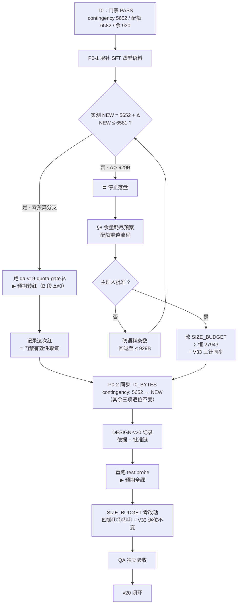
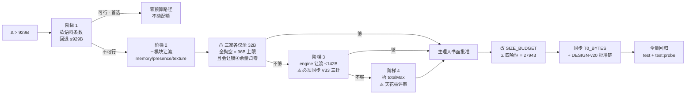

# PRD-v20 · 配额治理成果的首次真实消费（R-S2 语料新增 + 门禁清理）

> 产品经理：许清楚（Xu）
> 版本：v20 立项
> 前置：v19 已闭环（commit `c72228b`，已推送 gitee `b36842f..c72228b main`）
> 状态：待架构师评审 / 待主理人拍板 Q1–Q7

---

## §0 T0 基线（本 PRD 起草期实测取证）

所有数字均为起草时 `fs.statSync().size` 现场实测，非文档转述。

### 0.1 四模块字节 / 配额 / 余量

| 模块 | 实测字节 | 配额（SIZE_BUDGET） | 余量 | 门禁 T0_BYTES 基线 |
|---|---:|---:|---:|---:|
| memory.js | 13333 | 13365 | 32 | 13333 |
| presence.js | 3566 | 3598 | 32 | 3566 |
| texture.js | 4366 | 4398 | 32 | 4366 |
| **contingency.js** | **5652** | **6582** | **930** | **5652** |
| Σ moduleSum | 26917 | 27943 | 1026 | — |

### 0.2 门禁与闸门现状（实跑取证）

- `node test/qa-v19-quota-gate.js` → **PASS**（A/B/C/D/E 全段绿，drift = 0）
- 四锁自证：① `248537 === 245737 + 2800`；② `27943 === 27943`；③ `276480 === 276480`（松弛 0）；④ `13365>13333 / 3598>3566 / 4398>4366 / 6582>5652`；⑧ `4518 + 2064 = 6582`
- `node test/qa-probe-h13.js` → **PASS（0 泄漏）**，H13 人设崩坏率 0%
- V33 = 248537，三针：`wiring-scan.js` / `qa-v13-t2t4-fix.test.js:117` / `qa-v16-size-probe.js`
- 人设真源：`engine.js:1307` `PERSONA_BREAK_RE`（v20 **不触碰**）

### 0.3 R-S2 语料载体现状（`contingency.js:27-31`）

`SFT` 表为 tier×type 正交的四型语料池，当前每型 3 条、共 12 条：

| 型 | 条数 | 触发条件（`sfType`，优先级自上而下） |
|---|---:|---|
| boundary | 3 | `security < .5` ∧ 极性 `< 0` |
| challenge | 3 | `independence ≥ .55` ∧ `lv ≥ 5` ∧ 极性 `≥ 0` |
| expand | 3 | `openness ≥ .5` ∧ 用户句长 `> 19` |
| stable | 3 | 兜底 |

**单条字节成本实测**：12 条含引号与逗号合计 612B，**均值 51.0B/条，最大 57B/条**。SFT 块整体 673B。

---

## §1 项目信息

- **Language**：中文（与需求方一致）
- **Programming Language**：Node.js（CommonJS）+ 原生 `node --test`，无新增依赖
- **Project Name**：`quota_governance_first_consumption`
- **原始需求复述**：v19 完成了配额治理的"机制建设"（三锁归一、配额门禁、单一真源）。v20 要做的是**第一次真正花掉这笔治理红利**——用 v19 打通的 contingency 真实余量写入 R-S2 语料，同时清掉 v19 自己留下的两个 P3 尾巴（R-1 文案、R-2 扫描范围）。

---

## §2 本次立项定位

### 2.1 一句话定位

**v20 是 v19 治理成果的首次真实消费（first real consumption）。**

v19 的价值主张是"把 contingency 的有效天花板从三锁背离（6582/5671/5698）统一为 6582，让 930B 余量从**幽灵**变成**实数**"。但 v19 自身是**零预算**交付——它证明了钱在账上，却一分没花。v20 的任务就是**把这笔钱花出去，并且证明花的过程中账本没乱**。

### 2.2 为什么这次消费本身就是对 v19 的验收

v19 建的机制只有在"真的有人来改模块"时才会被检验。v20 恰好构造了这个场景：

| v19 建的机制 | v20 如何检验它 |
|---|---|
| G2 三锁归一（上限只剩 SIZE_BUDGET 一个可写位置） | 新增语料后，所有上限断言应**自动跟随**，无需改任何第二处数字 |
| G1 配额门禁（diff=0，字节比对） | contingency 一改就**必须转红**；红了之后走基线同步流程再变绿 |
| §4.4 基线更新协议（三件套） | v20 是协议的**首个真实执行者**，跑通即协议有效，跑不通即协议是废纸 |

> **重要认知**：门禁转红在 v20 **不是故障，是设计预期**。PRD 明确要求实现者**同步更新基线**（证明已审视影响），而**不是**绕过、豁免或注释掉门禁。

### 2.3 范围边界（v20 不做什么）

- ❌ 不碰 `engine.js`（人设真源 `PERSONA_BREAK_RE`、V33 三针全部冻结）
- ❌ 不改 `sfType` 选择器逻辑（不新增第 5 个 type，只在现有四型内增补条数）——除非 Q7 另有裁定
- ❌ 不动 `SIZE_BUDGET` 任何配额数字（除非触发 >929B 重谈分支）
- ❌ 不做 UI/前端可见变更（本轮为纯语料与测试治理轮）

---

## §3 产品目标（3 个正交目标）

**G1 · 消费余量，扩充人格表达广度**
把 contingency 的真实余量用于 R-S2 四型语料增补，让"自我表达"（self-disclosure）在 stable/expand/challenge/boundary 四个方向上摆脱"每型仅 3 条"的高复读率，且全程零预算、四锁不翻转。

**G2 · 跑通并固化配额重谈协议**
让 v19 §4.4 的"三件套"协议完成首次真实执行，把"改模块必须同步更新门禁基线"从文档条款变成**已被验证的既定动作**，为 v21+ 建立可复用先例。

**G3 · 消灭门禁盲区，让元防御自身可扩展**
把 D 段扫描从"4 文件硬编码白名单"升级为"全目录扫描 + 显式豁免清单"，使第 5 个文件引入平行字面量时能被自动发现，同时解决升级过程中暴露的**门禁自指误红**问题。

---

## §4 用户故事（内部利益相关者视角）

> 本轮无外部终端用户可见变更，故用户故事以**内部利益相关者**（维护者 / QA / 安全 / 主理人）为主体；仅 US-6 折射到终端用户体验。

**US-1（维护者）**
作为**模块维护者**，我希望在向 contingency.js 增补语料时，**只需要关心"我加了多少字节"这一个问题**，而不必手工核对 4 个测试文件里的 3 个不同上限数字，这样我就能把注意力放在语料质量而非会计对账上。

**US-2（维护者）**
作为**模块维护者**，当我改动模块后门禁转红时，我希望**红色信息直接告诉我下一步该做什么**（走三件套协议、同步哪个基线），而不是让我去猜是不是自己搞坏了什么，这样我就不会产生"绕过门禁"的冲动。

**US-3（QA）**
作为 **QA**，我希望验收时能同时看到"零预算路径成立"的**正向证据**（四锁逐位不变）和"门禁确实会响"的**反向证据**（>929B 时正确转红），这样我才能判断门禁不是个空转的摆设。

**US-4（QA / 安全）**
作为**安全把关人**，我希望新增语料**在构造期就被静态自检过滤**，确保 `PERSONA_BREAK_RE` 覆盖率与 H13 0% 不因语料增补而回退，这样人设崩坏的一票否决线就不会被"看起来无害的文案改动"悄悄侵蚀。

**US-5（未来维护者）**
作为 **v21+ 的维护者**，我希望当我引入**第 5 个**涉及配额的测试文件时，门禁能**自动把它纳入扫描**，而不是因为它不在某个硬编码列表里就成为盲区，这样单一真源就不会随文件增长而逐步失效。

**US-6（终端用户 · 间接）**
作为**终端用户**，我希望小暖在表达自我时**不要总说那几句话**，这样长期陪伴中的"人味"才不会因为语料池太浅而露馅。

---

## §5 预算影响初判【核心演算】

### 5.1 结论先行

> **在 Δ ≤ 929B 区间内：零预算，四锁 ①②③④ 与 V33 三针全部逐位不变，`SIZE_BUDGET` 一个字节不改。**
> **⚠ 安全上限是 929B，不是 930B** —— 详见 5.3 的 off-by-one 裁定。

### 5.2 为什么 Δ ≤ 929B 不破锁（逐锁演算）

设新增字节数为 Δ，contingency 新实测 = `5652 + Δ`。

| 锁 | 表达式 | 是否受 Δ 影响 | 判定 |
|---|---|---|---|
| ① | `engineMax === engineBase + engineNetMax`<br>`248537 === 245737 + 2800` | **否**，纯 engine 侧，与模块无关 | ✅ 逐位不变 |
| ② | `Σ(4 模块**配额**) === moduleSumMax`<br>`13365+3598+4398+6582 === 27943` | **否**，左端是**配额之和**而非实测之和 | ✅ 逐位不变 |
| ③ | `engineBase+engineNetMax+moduleSumMax === totalMax`<br>`245737+2800+27943 === 276480`（松弛 0） | **否**，三项全是配额常量 | ✅ 逐位不变 |
| ④ | 逐模块 `配额 > T0基线`<br>`6582 > 5652+Δ` | **是** | ⚠ 见 5.3，要求 **Δ ≤ 929** |
| ⑧ | `V16_ANCHOR + NET_MAX ≡ 配额`<br>`4518 + 2064 = 6582` | **否**，纯配额派生 | ✅ 逐位不变 |
| V33 | `248537`，三针同步 | **否**，`engine.js` 不动 | ✅ 不翻转 |

**关键机理**：`moduleSumMax` 锁的是**配额之和（27943，固定）**，不是**实测之和**。因此模块实际长胖不会传导到锁 ②③。这正是 v19 三锁归一后"余量成为实数"的直接体现——余量可以真的被花掉，而不会连锁触发天花板重谈。

### 5.3 ⚠ off-by-one 裁定：安全上限是 929B 而非 930B

起草期核查 `qa-v19-quota-gate.js:112` 发现锁 ④ 用的是**严格大于**：

```js
if (!(B[f] > T0_BYTES[f])) q4 = false;   // 严格 >，不是 >=
```

基线同步后 `T0_BYTES["contingency.js"] = 5652 + Δ`，锁 ④ 要求：

```
6582 > 5652 + Δ   ⟹   Δ < 930   ⟹   Δ ≤ 929
```

- **Δ = 929** → 实测 6581，`6582 > 6581` ✅ 通过
- **Δ = 930**（用满"账面余量"）→ 实测 6582，`6582 > 6582` ❌ **锁 ④ 转红**

与之对照，`qa-rs2-type.test.js` 的 AC-RS2-8 用的是 `≤ CEILING`（宽一格），Δ=930 时它仍绿。**两者在 Δ=930 这一点上判定不一致**——门禁比业务测试严 1 字节。

> **裁定**：v20 采用**保守侧**，把零预算安全区间定为 **Δ ≤ 929B**。理由与 v14 取 28525 的保守传统一致：宁可 1B 永不可用，也不留"两把锁判定分歧"的口子。
> 该 off-by-one **不作为缺陷修复项**（锁 ④ 的严格大于是有意的"配额不倒挂"语义，配额等于实测意味着余量归零、下一次改动必然越界，提前 1B 转红是合理预警）。但**必须在 DESIGN-v20 中书面记录**，避免 v21 有人按"930"排预算而首日转红。

### 5.4 容量规划（按最大单条 57B 保守估算）

| 方案 | 每型新增 | 总条数 | 预估字节 | 判定 | 剩余余量（对 929） |
|---|---:|---:|---:|---|---:|
| A | +1 条 | 4 | ≈ 228B | ✅ 零预算 | 701B |
| **B（推荐）** | **+3 条** | **12** | **≈ 684B** | ✅ 零预算 | **245B** |
| C | +4 条 | 16 | ≈ 912B | ⚠ 零预算但仅余 17B | 17B |
| D | +5 条 | 20 | ≈ 1140B | ❌ 超限，须重谈 | −211B |

**推荐方案 B**：每型 +3 条（3→6 条，语料池翻倍），预估 684B，留 245B 缓冲应对语料实际长于均值的情况。方案 C 虽在区间内但缓冲仅 17B，任何一条语料超长即越界，**不建议**。

### 5.5 超 929B 的连锁预警

一旦 Δ > 929B，将触发以下**全部**动作（缺一即违规）：

1. `SIZE_BUDGET["contingency.js"]` 上调 → 但 Σ 四项必须**恒等 27943**，故必须有其他模块**让渡**（memory/presence/texture 各仅余 32B，三家全掏空也只有 96B）
2. 96B 仍不够 → 只能走 **engine 让渡**（≤142B）→ **必须同步 V33 三针**（`wiring-scan.js` / `qa-v13-t2t4-fix.test.js:117` / `qa-v16-size-probe.js`），漏一处即首日两红
3. 再不够 → 抬 `totalMax` → **天花板评审**，主理人批准
4. 门禁 `T0_BYTES` 同步 + DESIGN-v20 记录重谈依据与批准链

> **成本提示**：929B 之上每一个字节的边际成本都极高（要惊动 V33 三针甚至天花板评审）。**强烈建议首批语料控制在 929B 以内**，把重谈留给真正必要的场合。

---

## §6 需求池（P0 = 必须有 / P1 = 应该有 / P2 = 可以有）

### P0 · 必须有（5 项）

---

#### **P0-1 · R-S2 四型语料增补（v20 头条价值）**

**描述**：向 `contingency.js` 的 `SFT` 表增补 R-S2 类型语料，消费 v19 打通的真实余量。v18 的 A2 配额重分配为它腾了 +911B 的位，但当时没写满。

**验收标准**：
- must：在 `stable / expand / challenge / boundary` **现有四型内**增补条数，**不新增第 5 个 type**（不动 `sfType` 选择器 → 无行为变更风险）
- must：新增后 `contingency.js` 实测字节 **≤ 6581**（即 Δ ≤ 929B，见 §5.3）
- must：新增语料通过**构造期静态自检**（`AC-G-9`：`PERSONA_BREAK_RE(pnorm)` 命中数 = 0、`RELATION_HOOK_RE` 100%）
- must：`qa-rs2-type.test.js` 的 `AC-RS2-2a`（四型池互不串）保持绿——新增语料必须归入正确的型池
- should：每型条数**均衡增补**（避免某型 6 条、某型 3 条导致复读率不均）
- should：单条语料字节 ≤ 57B（与现有最大值持平，见 §0.3）

**默认量级**：方案 B，每型 +3 条（共 12 条，≈684B）。最终以 **Q1** 裁定为准。

**分支判定**：

| 分支 | 条件 | 处理 |
|---|---|---|
| **零预算分支（默认）** | Δ ≤ 929B | 不动 `SIZE_BUDGET`；四锁 ①②③④ 与 V33 逐位不变；**仅需**同步门禁基线（P0-2） |
| **重谈分支（例外）** | Δ > 929B | 触发 §8 余量耗尽预案全流程；P0-5 生效 |

---

#### **P0-2 · 配额门禁 T0 基线同步（"改模块必须同步更新门禁基线"）**

**描述**：`qa-v19-quota-gate.js` 的 B 段 diff=0 硬闸会因 contingency 实测变化而**必然转红**。这是**设计预期**，不是缺陷。实现者必须**同步更新基线**以证明"已审视影响"，而非绕过。

**⚠ 显式步骤（不得跳步、不得改序）**：

1. 完成 P0-1 语料增补，**先跑** `node test/qa-v19-quota-gate.js` → 预期**转红**（B 段报 `contingency.js Δ+NNN`）
2. **截图/记录这次红**——它是"门禁确实在工作"的取证，QA 验收需要
3. 实测新字节数 `NEW = fs.statSync("contingency.js").size`
4. 校验 `NEW ≤ 6581`（若 > 6581 → 停止，转 P0-5 重谈流程）
5. 更新 `qa-v19-quota-gate.js` 的 `T0_BYTES["contingency.js"]`：`5652` → `NEW`
6. 在 `DESIGN-v20` 中记录：变更依据（R-S2 语料增补）+ 新旧值 + 主理人批准链
7. 重跑 `npm run test:probe` → 预期**全绿**

**验收标准**：
- must：`T0_BYTES` 中**只有** `contingency.js` 一项变化，其余三项（13333/3566/4366）**逐位不变**
- must：`SIZE_BUDGET` **一个字节不改**（零预算分支下）
- must：**禁止**「先改 `T0_BYTES` 让 CI 变绿，再补流程」——三件套（SIZE_BUDGET 若需变 / T0_BYTES / DESIGN 记录）缺一即违规
- must：**禁止**任何形式的门禁绕过（注释掉、加 skip、加豁免、`--no-verify`）

---

#### **P0-3 · R-1 文案统一（v19 遗留 P3 · R-2 的前置阻塞项）**

**描述**：`test/qa-v13-t2t4-fix.test.js:79` 的失败消息文案仍含 `5671`：

```js
assert.strictEqual(B["contingency.js"], 6582, "v18 批准值 5671→6582（受援方 +911B · 残差式 27943−21361）");
```

断言比较值是 `6582`（正确，**非缺陷**），但**消息文案**与 DESIGN-v19 §3.6「SIZE_BUDGET 单一真源」的行文宽严不一。

**⚠ 为什么它是 P0 而非 P3**：起草期实测预演（见 §7.2）确认——该行位于**断言性行**（含 `assert`），一旦 P0-4 把本文件纳入全目录扫描，`5671` 正则**立即命中转红**。**故 P0-3 必须先于 P0-4 落地**，否则 R-2 一上线就是纯文案红。

**验收标准**：
- must：消除该行文案中的 `5671` 字面量，改为不含裸数字的表述（如「v18 批准的受援方口径」+ 指向 `wiring-scan.js` v18 审批块）
- must：断言**比较值 `6582` 与断言强度 `strictEqual` 逐位不变**——本项是**纯文案**变更，不得顺手改断言语义
- must：文件**其余部分零改动**（`:117` 的 `V33 = 248537` 等历史值不得触碰）
- must：该文件**不属于**四模块，改它**不触发**配额门禁 B 段（B 段只扫 4 个模块源文件）

---

#### **P0-4 · R-2 门禁 D 段改全目录扫描 + 显式豁免清单**

**描述**：`qa-v19-quota-gate.js:126-129` 的 `SCAN_FILES` 硬编码 4 个文件。引入第 5 个含平行字面量的文件时，盲区不会被发现。DESIGN-v19 §4.3-D 已声明改造方向。

```js
const SCAN_FILES = [                                  // ← 硬编码白名单
  "qa-v15-t1.test.js", "qa-rs2-type.test.js",
  "qa-v17-independent-size.js", "qa-v16-size-probe.js",
];
```

**验收标准**：
- must：改为**全目录扫描** `test/*.js`（起草期实测共 **36** 个 `.js` 文件）
- must：配套**显式豁免清单**（`EXEMPT`），每条豁免须携带**理由字段**（不允许裸文件名豁免）
- must：解决**门禁自指误红**（见 §7.2 与 **Q4**）——这是全目录扫描暴露的**必然冲突**，非可选项
- must：保留 v19 既有的两项设计：① 仅扫**断言性行**（`assert|ok(|chk(|<=`）；② 注释经 `W.stripComments` 剥离后再扫（说明性注释允许提及这些数字）
- must：保留**反空转取证**（D 段必须证明真的扫到了内容，不能扫空目录后报绿）
- should：豁免清单为**空**时门禁仍应正常工作（不依赖豁免存在）

---

#### **P0-5 · 余量耗尽预案（条件性 · 仅 Δ > 929B 时激活）**

**描述**：若 P0-1 语料实际超出 929B 安全区间，必须走完整配额重谈流程，**不得**通过删减断言、放宽锁、或"先改基线"来消化。

**验收标准**：见 §8 完整流程。核心红线：
- must：Σ 四模块配额**恒等 27943**（锁 ② 不可破）
- must：动 engine 让渡则**必须同步 V33 三针**
- must：主理人书面批准 + DESIGN-v20 记录批准链

---

### P1 · 应该有（3 项）

**P1-1 · 门禁自指防御的元测试**
D 段改全目录扫描后，门禁**自身**成为被扫对象。须新增一条元断言：证明"豁免机制没有被滥用到把真实违规也豁免掉"。具体形态待 **Q4** 裁定后确定。
- should：若采用豁免清单，须断言豁免项数量 ≤ 约定上限（防止豁免清单沦为垃圾桶）
- should：须有一条**反向取证**——人为构造一个平行字面量，验证门禁能抓到（可用临时字符串在测试内模拟，不落盘）

**P1-2 · 文档与注释同步**
- should：`wiring-scan.js` 的 `contingency.js` 行尾注释更新实测值与真实余量（当前写「实测 5652，真实可用 930B」，语料落地后须改为新值 + 新余量）
- should：`DESIGN-v20` 记录 §5.3 的 **929 vs 930 off-by-one 裁定**，防止 v21 按 930 排预算
- should：`qa-v19-quota-gate.js` 头部的「基线更新协议」注释块补充 v20 的**首次执行记录**

**P1-3 · 回归取证包**
- should：交付时提供并排证据：四锁 ①②③④⑧ 数值**逐位对比表**（v19 T0 vs v20 交付）
- should：`qa-probe-h13.js` 交付后仍 **PASS（0 泄漏）**
- should：`npm test` + `npm run test:probe` 双全绿截图/日志

### P2 · 可以有（3 项）

**P2-1 · 语料质量人工抽检**
- could：四型语气**区分度**人工抽检（boundary 是否真的有边界感、challenge 是否真的在表达不同意见），避免新增语料在语义上与 stable 同质化，导致"条数翻倍但体感没变"

**P2-2 · 豁免清单腐化预警**
- could：为每条豁免项添加"引入版本"字段，超过 N 个版本未复审则门禁打印**警告**（不转红），防止豁免长期沉淀为技术债

**P2-3 · 单条语料字节成本约定**
- could：把「单条语料 ≤ 57B」写入 DESIGN 作为软约定，便于后续按条数快速估算预算，而不必每次实测

---

## §7 流程 / 结构设计稿

> 本轮无 UI 变更。以下为 CI / 脚本 / 配置层的流程示意。

### 7.1 主流程：语料增补 → 门禁转红 → 基线同步 → 全绿



### 7.2 R-2 全目录扫描的**实测冲击面**（起草期预演）

以现有 D 段规则（断言性行 + 剥注释）对 `test/` 全目录 36 个 `.js` 文件做了**干跑预演**，命中如下：

```
qa-v13-t2t4-fix.test.js:79   [5671]  assert.strictEqual(B["contingency.js"], 6582, "v18 批准值 5671→6582…")
qa-v19-quota-gate.js:148     [5671]  chk("4 个测试文件的断言性行中，平行字面量 5671/1180/2064 计数 = 0", …
qa-v19-quota-gate.js:148     [1180]  （同一行，三个被禁数字全在标题字符串里）
qa-v19-quota-gate.js:148     [2064]  （同上）
────────────────────────────────────────────────────────────
全目录命中总数 = 4        涉及文件 = 2        扫描文件总数 = 36
```

**两个命中源，性质完全不同：**

| 命中 | 性质 | 处置 |
|---|---|---|
| `qa-v13-t2t4-fix.test.js:79` | **纯文案**（断言值实为 6582，无缺陷） | **P0-3 改文案**消除 → 不需豁免 |
| `qa-v19-quota-gate.js:148` ×3 | **门禁自指**：`chk()` 标题字符串里必须列出被禁数字才能说清自己在查什么 | **必须豁免或改写** → **Q4** 裁定 |

> **⚠ 关键结论**：`qa-v19-quota-gate.js` 的自指命中是**结构性**的——门禁要向人类说明"我在禁 5671/1180/2064"，就不可避免地要写出这三个数字；而它自己又是 `chk(` 开头的断言性行。**这不是 bug，是自指悖论**。全目录扫描**必须**先解决它，否则 P0-4 上线即自我误红。
>
> 好消息：除这两处外，其余 34 个文件**零命中**——说明 v19 的三锁归一确实做干净了，全目录扫描的**迁移成本极低**。

### 7.3 D 段改造后的结构示意（ASCII）

```
┌─ D 段：单一真源回归扫描（v20 改造后）────────────────────────┐
│                                                              │
│  ① 枚举        fs.readdirSync("test/").filter(*.js)          │
│                  → 36 个文件（自动跟随，新增文件自动纳入）    │
│                                                              │
│  ② 豁免        EXEMPT = [                                    │
│                  { file: "qa-v19-quota-gate.js",             │
│                    line: <自指行> 或 whole-file,             │
│                    why:  "门禁自身：标题须列出被禁数字",      │
│                    since:"v20" }                             │
│                ]                                             │
│                ▲ 每条必须带 why —— 裸文件名豁免不予通过       │
│                                                              │
│  ③ 剥注释      W.stripComments(src)  ← v19 既有，保留        │
│  ④ 断言性行    /assert|\bok\(|\bchk\(|<=/  ← v19 既有，保留  │
│  ⑤ 匹配        BANNED = 5671 / 1180 / 2064                   │
│  ⑥ 反空转      断言"确实扫到了 N>0 个含断言行的文件"          │
│  ⑦ 元防御      P1-1：豁免项数 ≤ 上限 + 反向取证              │
│                                                              │
└──────────────────────────────────────────────────────────────┘
```

### 7.4 门禁转红时的引导文案（沿用 v19，无需改动）

v19 已实现的红色输出会引导使用者走正确路径，v20 **原样保留**：

```
⚠ 检测到**未经重谈的源码 diff**。注意：这不等于超配额 ——
   · contingency.js  Δ+684B，当前仍余 246B 配额（四锁可能仍全绿）
▶ 请走配额重谈流程（DESIGN-v19 §4.4，三件套缺一即违规）：
   ① SIZE_BUDGET 对应项调整（若配额需变；Σ 四项须恒 = 27943）
   ② 本文件 T0_BYTES 对应项同步到新实测值
   ③ DESIGN-vNN 记录重谈依据 + 主理人批准链
   ✗ 禁止「先改 T0_BYTES 让 CI 变绿，再补流程」。
```

---

## §8 余量耗尽预案（Δ > 929B 时的配额重谈流程）

### 8.1 触发条件

`contingency.js` 实测 > **6581B**（即新增 Δ > 929B）。

### 8.2 阶梯式重谈路径（**不得跳步**）



### 8.3 各阶梯的成本与红线

| 阶梯 | 可获字节 | 成本 | 红线 |
|---|---:|---|---|
| **1 · 砍条数** | 不限 | 最低（只是少写几条语料） | —— **首选** |
| **2 · 三模块让渡** | ≤ 96B | 中（三家余量归零，下次谁都动不了） | Σ 必须恒 27943；让渡后锁 ④ 仍须 `配额 > 基线`（严格大于），故实际可让渡 < 96B |
| **3 · engine 让渡** | ≤ 142B | 高（**必须同步 V33 三针**，漏一处首日两红） | `wiring-scan.js` / `qa-v13-t2t4-fix.test.js:117` / `qa-v16-size-probe.js` 三处齐改 |
| **4 · 抬 totalMax** | 不限 | 极高（天花板评审，v16 后已声明"任何字节级扩张都须重新谈"） | 主理人书面批准，DESIGN 记录评审结论 |

### 8.4 绝对禁止的"消化方式"

以下任何一种都视为**违规交付**，QA 一票否决：

- ❌ 删减或放宽任何锁的断言（`strictEqual` → `ok`、`>` → `>=`）
- ❌ 把 contingency 纳入门禁豁免清单
- ❌ 先改 `T0_BYTES` 让 CI 变绿，事后补流程
- ❌ 把语料挪到 `engine.js` 或其他模块以规避 contingency 配额（**尤其禁止**——会污染人设真源）
- ❌ 用等长重构"腾空间"后声称零增长（等长重构本身允许，但不得用于掩盖净增）

---

## §9 待确认问题（需架构师 / 主理人拍板）

| # | 问题 | 背景 | PM 建议 |
|---|---|---|---|
| **Q1** | **R-S2 首批语料写多少 B？每型增补几条？** | 安全区间 Δ ≤ 929B；单条均值 51B、最大 57B | **方案 B：每型 +3 条（共 12 条，≈684B），留 245B 缓冲**。方案 C（+4 条/型，≈912B）仅余 17B，任一条超长即越界，不建议 |
| **Q2** | **是否故意踩 >929B 触发一次重谈演练？** | 可验证 §8 预案真实可用，但会消耗高成本配额动作 | **建议"演练但不落盘"**：在本地临时构造 >929B 的语料，跑门禁**确认正确转红**并截图取证，然后回退到 ≤929B 再提交。既拿到反向证据，又不消耗真实配额。若主理人要求**真实**重谈演练，则单列为 v20 的独立 P0 并预留 V33 三针同步工作量 |
| **Q3** | **R-2 豁免清单怎么列？粒度是文件级还是行级？** | 起草期预演显示实际只需豁免 1 个文件的 1 行 | **建议行级 + 结构化字段**：`{ file, linePattern, why, since }`。文件级豁免会让 `qa-v19-quota-gate.js` 整个文件失去扫描保护（它自己也可能写错平行字面量） |
| **Q4** | **门禁自指命中（`qa-v19-quota-gate.js:148`）如何处置？** | 结构性自指：标题必须列出被禁数字才能说清语义，而该行又是 `chk(` 断言性行。**三个数字全命中** | 三选一，**建议 (b)**：<br>(a) 加入豁免清单（简单，但开了"门禁豁免自己"的口子）<br>**(b) 改写标题，把数字移出断言性行**（如标题写"平行字面量"，具体数字由 `BANNED.map(b=>b.n).join("/")` **动态拼接**）——既消除硬编码又自动跟随，**与单一真源理念一致**<br>(c) 排除门禁自身文件（等于 P0-4 留了个盲区） |
| **Q5** | **P0-3 改完文案后，`qa-v13-t2t4-fix.test.js` 是否纳入 SCAN_FILES？** | 全目录扫描下它**自动纳入**，无需显式列入 | **建议纳入（自动）**。前提是 P0-3 **先**落地。若因故 P0-3 延后，则 P0-4 必须同步延后，**不得**用豁免临时掩盖（否则纯文案问题被永久固化为豁免项） |
| **Q6** | **全目录扫描的目录范围？是否含 `wiring-scan.js`、`helpers.js`、`baseline.js` 等非 `.test.js` 脚本？** | 起草期预演已含全部 36 个 `.js`（含 `wiring-scan.js`），结果零命中（其历史审批数字全在注释里，已被 `stripComments` 剥离） | **建议扫全部 `test/*.js`**，不按 `.test.js` 后缀过滤。理由：`qa-v17-independent-size.js`、`qa-v16-size-probe.js` 等探针本就是 v19 SCAN_FILES 成员，按后缀过滤反而会漏掉它们 |
| **Q7** | **是否允许新增第 5 个 type（如 `repair` / `humor`）？** | 会改动 `sfType` 选择器 → 属**行为变更**，不再是纯数据增补，风险等级跃升 | **建议本轮否**。v20 定位是"消费余量 + 清理治理尾巴"，应保持纯数据增补以隔离风险。新 type 若有需求，单列 v21 并配套 `sfType` 优先级重新论证 + 全套 AC-RS2-1x 触发条件测试 |

---

## §10 QA 独立验收预留项

> 本节为**后续独立 QA 验收**预先定义可测项。实现方交付时须逐条提供证据。

### 10.1 正向可测项（应全绿）

| ID | 验收项 | 判定方法 | 预期 |
|---|---|---|---|
| **AC-V20-1** | 门禁基线同步后 `test:probe` 仍全绿 | `npm run test:probe` | 6 个探针全 PASS，exit 0 |
| **AC-V20-2** | 单元测试全绿 | `npm test` | 全 PASS |
| **AC-V20-3** | 零预算自证：`SIZE_BUDGET` 逐位不变 | `git diff` 对 `wiring-scan.js` 的 `SIZE_BUDGET` 块 | 九个数值**零 diff**（零预算分支下） |
| **AC-V20-4** | 四锁逐位不变 | 门禁 C 段输出对比 v19 T0 | ①`248537===245737+2800` ②`27943===27943` ③`276480===276480`(松弛0) ⑧`4518+2064=6582` **完全一致** |
| **AC-V20-5** | 锁 ④ 仍成立且未倒挂 | 门禁 C 段 | `6582 > NEW` 成立，且 `NEW ≤ 6581` |
| **AC-V20-6** | V33 三针不翻转 | grep `248537` 三处 | 三处**逐位不变**，`engine.js` 字节数不变 |
| **AC-V20-7** | **H13 0% 一票否决线** | `node test/qa-probe-h13.js` | **PASS（0 泄漏）** |
| **AC-V20-8** | 新语料构造期静态自检 | `qa-rs2-type.test.js` AC-G-9 | `PERSONA_BREAK_RE(pnorm)` 命中 = 0、`RELATION_HOOK_RE` 100% |
| **AC-V20-9** | 四型池互不串 | `qa-rs2-type.test.js` AC-RS2-2a | 每型取样 400 次，全部落在本型池内 |
| **AC-V20-10** | `T0_BYTES` 仅一项变化 | `git diff` | 仅 `contingency.js` 项变，其余三项 13333/3566/4366 逐位不变 |
| **AC-V20-11** | R-1 文案已统一 | grep `5671` on `qa-v13-t2t4-fix.test.js` 断言性行 | 命中 = 0，且 `6582` / `strictEqual` 不变 |
| **AC-V20-12** | R-2 全目录扫描生效 | 门禁 D 段输出 | 扫描文件数 ≈ 36（非 4），反空转断言绿 |

### 10.2 **反向**可测项（门禁必须正确转红）

> 这类证据比正向证据更重要——它证明门禁不是空转的摆设。

| ID | 验收项 | 判定方法 | 预期 |
|---|---|---|---|
| **AC-V20-R1** | **>929B 时门禁正确转红** | 临时向 contingency 追加使实测 > 6581，跑门禁 | 锁 ④ **FAIL**（`6582 > 6582` 不成立），总判定 FAIL，exit 1 |
| **AC-V20-R2** | **未同步基线时门禁正确转红** | 改语料但**不改** `T0_BYTES`，跑门禁 | B 段 **FAIL**，打印 Δ 与三件套引导 |
| **AC-V20-R3** | **平行字面量被抓** | 临时在任一非豁免文件的断言行写入 `5671` | D 段 **FAIL**，精确报出文件名:行号 |
| **AC-V20-R4** | **新文件不再是盲区** | 临时新建 `test/zz-probe.js` 含平行字面量断言行 | D 段**自动纳入并 FAIL**（验证 P0-4 核心价值） |
| **AC-V20-R5** | **豁免清单未被滥用** | 检查 `EXEMPT` 条目 | 每条带 `why`，条目数 ≤ 约定上限（P1-1） |

> ⚠ 反向验证**全部在本地临时构造、验证后回退**，不得落盘提交（除非 Q2 裁定要做真实重谈演练）。

---

## §11 交付物与执行纪律

### 11.1 预期改动文件清单（零预算分支）

| 文件 | 改动性质 | 涉及需求 |
|---|---|---|
| `contingency.js` | 新增 SFT 四型语料（Δ ≤ 929B） | P0-1 |
| `test/qa-v19-quota-gate.js` | `T0_BYTES` 同步 + D 段全目录扫描 + 豁免清单 | P0-2 / P0-4 |
| `test/qa-v13-t2t4-fix.test.js` | **纯文案**（消除 `5671`） | P0-3 |
| `test/wiring-scan.js` | **仅行尾注释**（实测值/余量），`SIZE_BUDGET` 数值零改动 | P1-2 |
| `docs/DESIGN-v20.md` | 新建（架构师产出） | P0-2 / P1-2 |
| `docs/PRD-v20.md` | 本文档 | —— |

> **`engine.js` 不在清单内**——若实现过程中出现改动需求，视为**范围越界**，须立即上报。

### 11.2 执行纪律（强制）

- **四锁不可破**：①②③④ 任一转红即停止交付，回退重新演算
- **H13 0% 一票否决**：语料新增不得让 `PERSONA_BREAK_RE`（`engine.js:1307`）覆盖回退或误杀；R-S2 语料属 contingency 模块，**不碰 engine.js 人设真源**
- **git 靶向 add**：**永不** `git add -A`；显式排除 `charts/` 与 `微信_*.md` dump（起草期 `git status` 确认这三项为未跟踪文件，须保持未跟踪）
- **门禁不得绕过**：转红时走三件套协议，禁止 `--no-verify`、禁止注释掉断言、禁止把 contingency 加入豁免
- **QA 独立验收必经**：实现方自测 IS_PASS 后，仍须独立 QA 按 §10 逐条验收

### 11.3 需求汇总统计

| 优先级 | 数量 | 条目 |
|---|---:|---|
| **P0** | **5** | P0-1 R-S2 语料增补 / P0-2 门禁基线同步 / P0-3 R-1 文案统一 / P0-4 R-2 全目录扫描 / P0-5 余量耗尽预案（条件性） |
| **P1** | **3** | P1-1 门禁自指元测试 / P1-2 文档注释同步 / P1-3 回归取证包 |
| **P2** | **3** | P2-1 语料质量抽检 / P2-2 豁免清单腐化预警 / P2-3 单条字节成本约定 |
| 合计 | **11** | —— |

**关键依赖顺序**：`P0-3 → P0-4`（文案不先改，全目录扫描上线即纯文案红）；`P0-1 → P0-2`（先改语料，观察门禁转红，再同步基线——顺序颠倒即违反"禁止先改基线让 CI 变绿"）。

---

## §12 结语：v20 的成败判据

v20 **不是**一次功能迭代，而是对 v19 治理机制的**压力测试**。判定 v20 成功的标准不是"语料变多了"，而是：

1. **有人真的花掉了余量，而账本没有乱**——四锁逐位不变，SIZE_BUDGET 零改动
2. **门禁确实响了，而且响得对**——转红是设计预期，且引导人走对了流程
3. **治理机制不再有盲区**——全目录扫描让第 5 个文件无处藏身
4. **人设底线纹丝不动**——H13 仍是 0%

若这四条同时成立，v19 建立的配额治理体系才算真正**通过了实战检验**。

