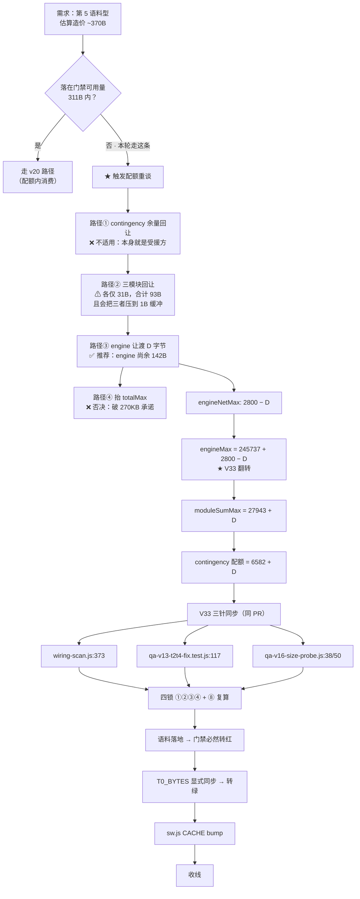
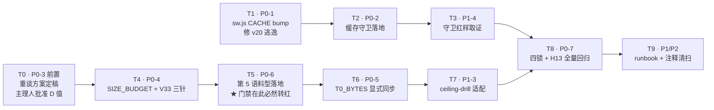

# PRD-v21 · 配额重谈首秀 + C0-b 缓存键守卫

> 产品经理：许清楚（Xu） · 起草日期：v20 收线后 · 状态：**待主理人 Qi 拍板**
> 上游：PRD-v20 / DESIGN-v20 / QA-ACCEPTANCE-v20 · 下游：DESIGN-v21（架构师）

---

## 项目信息

| 项 | 值 |
|----|----|
| Language | 中文（与用户需求一致） |
| Programming Language | 原生 JS（PWA）+ Node 测试栈 —— **沿用现有技术栈，本轮不引入任何新依赖** |
| Project Name | `ai_girlfriend_v21_quota_renegotiation` |
| 原始需求复述 | 用户未点明 v21 方向，要求 PM 基于 v13–v20 现状提出「1 个主推 + 1–2 个备选」，写成完整 PRD 供拍板。启发方向：A 配额重谈首秀 / B 余量内深耕 / C 技术债清扫 |
| 一票否决项 | H13 人设崩坏 0%（`PERSONA_BREAK_RE` @ `engine.js:1307`） |
| 不可破坏项 | 体积四锁 ①②③④ + 锁⑧ |

---

## §0 现状实测快照（起草期实跑取证，非引用文档）

> 取证方式：`npm run test:probe`（6 探针全 PASS）+ `fs.statSync` 实测 + `git show --stat`。
> **本节所有数字均为起草日实测值**，与 `wiring-scan.js` 行尾注释并排可核对。

### 0.1 体积实测表

| 文件 | 实测 | 配额 | 业务锁余量（`≤`） | 门禁锁④可用量（严格 `>`） |
|------|-----:|-----:|------:|------:|
| `memory.js` | 13333 | 13365 | 32 | **31** |
| `presence.js` | 3566 | 3598 | 32 | **31** |
| `texture.js` | 4366 | 4398 | 32 | **31** |
| `contingency.js` | 6270 | 6582 | 312 | **311** |
| `engine.js` | 248395 | 248537（V33） | 142 | —（engine 不在门禁锁④覆盖内） |
| Σ 四模块 | 27535 | 27943 | 408 | — |
| total | 275930 | 276480 | 550 | — |

- `engineNet` = 248395 − 245737 = **2658** / 上限 2800 → **engine 侧尚余 142B**。
- 派生 `NET_MAX` = 6582 − 4518 = **2064**（锁⑧自证通过）。

### 0.2 四锁 + 锁⑧ 现状（门禁 C 段实跑输出）

```
① engineMax = engineBase + engineNetMax   → 248537 === 245737 + 2800      ok
② Σ(4 模块配额) === moduleSumMax          → 27943 === 27943               ok
③ engineBase+engineNetMax+moduleSumMax    → 276480 === 276480（松弛 0）   ok
④ 逐模块配额 > 基线                        → 13365>13333 / 3598>3566 /
                                             4398>4366 / 6582>6270        ok
⑧ V16_ANCHOR + NET_MAX ≡ 配额             → 4518 + 2064 = 6582            ok
```

### 0.3 瓶颈排序复核（DESIGN-v20 §7.2 口径 + 换算到今天）

| 锁 | 以 v19 锚点 5652 起算的 Δ 上限 | **换算到今日（实测 6270）的剩余** |
|----|------:|------:|
| **门禁锁④**（严格 `>`） | **929** ← 全系统真实瓶颈 | **311** |
| 业务锁（`≤`） | 930 | 312 |
| moduleSum | 1026 | 408 |
| total | 1168 | 550 |

**结论：瓶颈排序在 v20 落地后逐位保持不变，门禁锁④ 仍是唯一的第一约束。**
任何 v21 预算必须按 **311B**（而非 312B）排。

### 0.4 ★★ 起草期新发现：v20 存在一个未被任何测试拦住的线上逃逸 ★★

> **这不是纸面推演，是 `git show --stat 5f880ec` + `sw.js` 实读交叉取证的结论。**

| 事实 | 取证 |
|------|------|
| v20 修改了 `contingency.js`（语料 12→24，Δ+618） | `git show --stat 5f880ec` 含 `contingency.js \| 8 +-` |
| `contingency.js` **在 sw.js 的 ASSETS 缓存清单内** | `sw.js` ASSETS 第 4 行 `"/contingency.js"` |
| v20 提交**未包含 `sw.js`** | `git show --name-only 5f880ec \| grep -c sw.js` → **0** |
| `sw.js` CACHE 仍为 `xiaonuan-v23`，最后改动停在 **v18** | `git log -- sw.js` → `b36842f feat(v18)` |

**后果**：已安装 PWA 的老用户 `fetch` 命中旧缓存 `xiaonuan-v23`，
**v20 花掉 618B 预算做的 R-S2 语料四型各 +3 条，对存量用户根本没上线。**

**这正是 `sw.js` 自己的注释里白纸黑字警告的事故类别（v13 C0-b 成因）**：

> 「只要任一被缓存文件的内容变了就升版，不只是清单变了才升
> —— 这正是 v13 C0-b 事故的成因」

**为什么没被拦住（治理缺口，比逃逸本身更重要）**：
现存唯一守卫是 `test/v12-wiring.test.js:216`

```js
assert.ok(L.sw.version >= 17, "sw.js CACHE 版本 v" + L.sw.version + " < v17，...");
```

这是一条**地板断言**（floor），不是**联动断言**（bump-on-change）。
它永远不会因为「改了被缓存文件却没升版」而转红 —— 属于**结构性盲区**，
与 v19/v20 反复治理的「假绿」是同一缺陷家族（v20 R-2 刚修过一次同类：D 段硬编码 4 文件的盲区假绿）。

> 📌 **该发现改变了 v21 的方向排序**，详见 §4。

---

## §1 产品目标

本轮设定 3 个清晰、正交的目标：

| # | 目标 | 度量口径（可机检） |
|---|------|-------------------|
| **G1** | **让"已交付"等于"已上线"** —— 消除被缓存资产改动与缓存键之间的人工记忆依赖 | v20 逃逸被修复（CACHE 升位）；且新增守卫在「改被缓存文件不升版」时**必然转红**（红样取证） |
| **G2** | **让配额重谈从"纸面制度"变成"跑通过的流程"** —— v19 建的 machinery 首次在**超封顶**场景端到端闭环 | 一次真实的配额突破落地后：四锁 ①②③④ + ⑧ 全绿、V33 三针同步无遗漏、门禁基线同步手续留痕 |
| **G3** | **不以牺牲防御强度换取空间** —— 扩容不得稀释既有护栏 | H13 泄漏率 **0.0000%** 不变；`npm test` 全绿；`test:probe` 6 探针全 PASS |

**非目标（本轮明确不做）**：
- ✗ 不抬 `totalMax`（270KB 承诺继续守住）
- ✗ 不动 `engineBase`（永不许动项）
- ✗ 不重构 `engine.js` 业务逻辑（仅在授权解冻点范围内讨论）
- ✗ 不引入新的运行时依赖

---

## §2 本次立项定位

```
v18  配额重分配（模块间挪，Σ 不变）      → 会挪钱了
v19  治理（三锁归一 + 门禁）· 零预算      → 建好了收银台，但没人付过款
v20  配额内消费（Δ+618 落在 6582 内）     → 第一次花钱，但没超预算
────────────────────────────────────────────────────────────
v21  ① 超预算消费（首次真正重谈配额）      → 第一次「申请提额」
     ② 补上「交付≠上线」的结构性缺口       → 第一次证明「花的钱真到了用户手里」
```

**一句话定位**：
> v21 = **首次把 v19 的配额重谈 machinery 拉到红线之外跑一遍**，
> 并顺手补上 v20 暴露出的「预算花了但没送达用户」的交付闭环缺口。

**为什么这两件事必须放在同一轮**：
它们是同一条链的两端 —— G2 的产物（第 5 语料型）会再次修改 `contingency.js`（被缓存资产），
**若不先修 G1，v21 会原样复现 v20 的逃逸**：重谈了配额、花了预算、四锁全绿，
而用户拿到的仍是 `xiaonuan-v23` 的旧语料。**制度上的完备 + 交付上的落空 = 最坏组合。**

---

## §3 用户故事（内部利益相关者）

> 本项目无外部终端用户参与决策，故用户故事以**维护者 / QA / 安全 / 主理人**四类内部角色展开。

| # | 角色 | 用户故事 | 验收信号 |
|---|------|---------|---------|
| **US-1** | 维护者 | As a 维护者, I want 当我修改任何被 sw.js 缓存的文件却忘记升 CACHE 键时 CI 直接转红, so that 我不必依赖记忆力来保证「改动真的能到用户手里」 | 制造「改 contingency.js 不升 CACHE」的红样 → 守卫必红 |
| **US-2** | 维护者 | As a 维护者, I want 一份跑通过的配额重谈 runbook（而不是只写在注释里的三件套）, so that 下次需要提额时我能照着做而不是重新推演一遍恒等式 | DESIGN-v21 产出可复用的重谈步骤表，且 v21 自身就是它的第一个执行样本 |
| **US-3** | QA | As a QA, I want 配额重谈后四锁 ①②③④⑧ 仍能被独立探针一次跑完并逐条打印, so that 我不需要人工核对九个数字的算术 | `test:probe` 输出含重谈后的新数值且全 ok |
| **US-4** | QA | As a QA, I want 「超过新配额 1 个字节」这一场景有可复跑的红样脚本, so that 我能证明新边界是真闸而不是纸面数字 | `test:ceiling-drill` 在新配额下仍能演示「门禁红 / 业务锁绿」的一字节差 |
| **US-5** | 安全 | As a 安全负责人, I want 语料扩容后 H13 泄漏率仍为 0.0000%, so that 扩容不会打开人设崩坏的口子 | `qa-probe-h13.js` 泄漏 0，组合口径不缩水 |
| **US-6** | 主理人 | As a 主理人, I want 每一次配额变更都带着「谁捐字节、Σ 是否仍守恒、V33 是否翻转」的完整演算摆在我面前, so that 我签字时不是在批准一个孤立数字 | PRD §7 演算表 + DESIGN-v21 批准链 |

---

## §4 候选方向对比

### 4.0 候选清单

任务书给出 A/B/C 三个启发方向。起草期实测后，我**新增一个方向 D**，
并据此调整了推荐：

| 方向 | 名称 | 一句话 |
|------|------|--------|
| **A** | 配额重谈首秀 | 设计一个必须突破 contingency 6582 的能力，首次走完重谈流程 |
| **B** | 余量内深耕 | 在 311B 内继续做语料/鲁棒性增强，不重谈配额 |
| **C** | 技术债清扫 | 收 v20 P3 遗留（`qa-v19-quota-gate.js:40` 注释"36 个"）+ 累积项 |
| **D** 🆕 | **C0-b 缓存键守卫** | 修复 v20 线上逃逸 + 补上「改被缓存文件必须升 CACHE」的结构性守卫 |

### 4.1 四方向对比表

| 维度 | A 配额重谈 | B 余量深耕 | C 债务清扫 | **D 缓存守卫** |
|------|-----------|-----------|-----------|--------------|
| 解决的问题 | 制度未经实战验证 | 语料丰富度 | 注释口径漂移 | **已交付内容未送达用户** |
| 问题性质 | 潜在风险 | 体验增量 | 文档卫生 | **线上实际缺陷（已发生）** |
| 紧迫性 | 中 | 低 | 低 | **高 —— v20 的钱已经白花了** |
| 预算消耗 | **超 311B，需提额** | ≤311B | ~0B（注释） | **0B（sw.js 不在四锁口径内）** |
| 触发 V33 翻转 | **是**（若走 engine 让渡） | 否 | 否 | 否 |
| 触发 sw.js bump | 是（改 contingency.js） | 是（改模块） | 否 | **是（这正是它的交付物）** |
| 四锁风险 | 中（需完整演算） | 低 | 无 | **无** |
| 治理价值 | 高（machinery 实战） | 低 | 中 | **高（消除一整类假绿）** |
| 独立可交付 | 是 | 是 | 是 | 是 |

### 4.2 关键论证：为什么 B 单独立项不成立

B 的可用空间是 **311B**（不是 312B —— 门禁锁④用严格 `>`）。
按 v20 实测造价 **~51.5B/条**（618B ÷ 12 条）反推：

```
311B ÷ 51.5B/条 ≈ 6.0 条
```

即 B 全力以赴也只够**再加 6 条语料**，且落地后 contingency 余量归零至个位数，
**下一个版本连一个标点都改不动**。同时三模块各自只剩 31B —— 全系统进入完全冻死状态。

> **B 的本质不是"深耕"，是"把最后一点余量吃干净后把问题留给 v22"。**
> 若选 B，v22 将被迫在**零余量**状态下做首次配额重谈，风险高于现在做。

### 4.3 关键论证：为什么 A 必须配 D 才成立

A 的业务载体（第 5 语料型）会修改 `contingency.js` —— **被缓存资产**。
若不做 D：

```
v21 走完配额重谈三件套 → 四锁全绿 → V33 三针同步 → 门禁基线同步
                                    ↓
                          CACHE 键仍是 xiaonuan-v23
                                    ↓
              老用户拿到的还是 v18 时代的 contingency.js
                                    ↓
        ★ 制度完备度 100%，用户可感知收益 0% ★（v20 的原样复现）
```

**A without D = 一次演习得很漂亮但没有实弹的军演。**

### 4.4 ★ 推荐方案：**A + D 合并轮（D 为 P0 前置闸，A 为业务主体，C 顺风车）**

**推荐理由（按权重排序）**：

1. **D 修的是已发生的线上缺陷，不是假想风险。** v20 的 618B 预算目前对存量用户等于没花。这是四个方向里唯一「已经在流血」的一项，优先级天然最高。
2. **D 的成本极低但价值极高。** `sw.js` **不在体积四锁的口径内**（锁③ 只统计 `engine.js` + 四模块，起草期已实读 `scanSizes()` 确认），因此 D 是**零预算**改动，却能消灭一整类「交付≠上线」的假绿。
3. **A 是 v19 machinery 唯一还没验证过的路径。** v19 建制度、v20 在配额内花钱，**"超封顶"这条分支至今零执行**。制度未经实战的部分就是未知风险，而现在（contingency 尚有 311B 缓冲、engine 尚有 142B 可让渡）是**风险最低的演练窗口**——等到余量归零再被迫重谈，等于在火警时第一次演练消防。
4. **A 与 D 天然共享同一条交付链**，合并做无额外协调成本；拆开做则 D 必须先行、A 必然重复一遍收线流程。
5. **C 是 1 行注释的顺风车**，与 A/D 的「不留第二个可写位置」治理精神同源，纳入 P2 零成本搭车。

**备选方案**：
- **备选一（B）**：若主理人认为 v21 应保守收官、不动配额 → 采纳 B，但**D 仍须作为 P0 保留**（B 同样修改被缓存文件）。
- **备选二（D + C 纯治理轮）**：若主理人认为 v21 应做「零预算纯治理」→ 只做 D + C，把 A 推到 v22。此方案最安全，代价是配额重谈继续押后、余量继续消耗。

> **PM 立场**：推荐 **A + D + C**；若必须削减，削 A 保 D（**D 不可削**）。

---

## §5 需求池（按推荐方案 A + D + C 展开）

> 优先级定义：**P0 = Must have（缺一即不可交付）** / **P1 = Should have** / **P2 = Nice to have**
> 标注 `[D]` `[A]` `[C]` 表示所属方向；`[基础]` 表示与方向无关的收线必备项。

### 5.1 P0 · 必须（7 项）

| # | 需求 | 归属 | 验收口径 |
|---|------|------|---------|
| **P0-1** | **修复 v20 C0-b 逃逸**：`sw.js` CACHE `xiaonuan-v23` → `xiaonuan-v24`，并按既有注释规范写明本轮改动了哪些被缓存文件 | [D] | `sw.js` 实读 CACHE = `xiaonuan-v24`；`v12-wiring.test.js` 地板断言仍绿 |
| **P0-2** | **新增缓存键联动守卫**：将「被缓存资产内容变更 ⟹ CACHE 必须升位」做成**结构性断言**，而非人工记忆。守卫须覆盖 ASSETS 清单内**全部**本地文件（`engine.js` / `app.js` / 四模块 / `index.html` / `style.css` / `localmodel.js` / `manifest.json`） | [D] | ① 正常态全绿；② **红样取证**：改任一被缓存文件不升 CACHE → 守卫必红；③ 守卫**不得**塞进 `wiring-scan.js` 加载期 throw（爆炸半径纪律，见 DESIGN-v19 §4.1③） |
| **P0-3** | **配额重谈工作流端到端首秀**：完成一次真实的 contingency 配额突破（6582 → 6582+D），**严格按 DESIGN-v19 §4.4 三件套执行且不得跳步**：① `SIZE_BUDGET` 调整 ② `T0_BYTES` 同步 ③ DESIGN-v21 记录依据 + 主理人批准链 | [A] | 三件套逐项留痕可审计；**禁止**「先改基线让 CI 变绿再补流程」 |
| **P0-4** | **V33 三针同步**：若重谈路径导致 `engineMax` 变化，必须在**同一个 PR 内**同步三处：`wiring-scan.js:373` / `qa-v13-t2t4-fix.test.js:117` / `qa-v16-size-probe.js`（:38 & :50） | [A] | 三处实读值一致；漏改任一处 → T0 首日转红（v16 §5.0 / v17 P0-3 双重教训） |
| **P0-5** | **门禁基线同步**：`qa-v19-quota-gate.js` 的 `T0_BYTES["contingency.js"]` 6270 → 新落地实测值（`fs.statSync` 实测，非纸面算术） | [A] | 门禁 B 段 diff=0 全绿；同步动作**必须在语料落地之后**独立发生（先红后绿，逼出显式手续） |
| **P0-6** | **第 5 语料型落地**（A 的业务载体）：在 `contingency.js` 的 `SFT` 增加第 5 个 type，并同步 `sfType()` 路由使其可达 | [A] | 新型可被路由命中（非死代码）；沿用 §7.3 语料约定：单条 `cost=3n+3` ≤57B、`x.length≤44`、自带关系钩子、全局唯一且跨型不重复 |
| **P0-7** | **H13 一票否决回归 + 四锁复算全绿** | [基础] | `qa-probe-h13.js` 泄漏 **0.0000%**；四锁 ①②③④ + ⑧ 全绿；`npm test` 全绿；`test:probe` 6 探针全 PASS |

### 5.2 P1 · 应该（5 项）

| # | 需求 | 归属 | 说明 |
|---|------|------|------|
| **P1-1** | **配额重谈 runbook 文档化** | [A] | 把本轮实际走过的步骤沉淀为可复用步骤表（含「谁捐字节」的决策树：contingency 余量回让 → engine 让渡 → 抬 totalMax，**不得跳步**），写入 DESIGN-v21 |
| **P1-2** | **`929` 硬编码口径升级为派生公式** | [A] | 重谈后 929 立即失效。建议**不要**换一个新魔数（那是把问题推给 v22），而是改为派生表述：`安全Δ = 配额 − 1 − 当前基线`。与 v19「不留第二个可写位置」精神一致 |
| **P1-3** | **`test:ceiling-drill` 适配新边界** | [A] | 该脚本已声明「不写任何 929/930/6581/6582 字面量，全部由 SIZE_BUDGET 派生」，需实跑验证其在新配额下自动跟随；若发现残留字面量（如 `5652` 锚点）需一并处理 |
| **P1-4** | **缓存守卫红样取证入包** | [D] | 参照 v20 `qa-v20-ceiling-drill.js` 的自清理模式（**不脏工作区**），为 P0-2 提供可复跑红样 |
| **P1-5** | **v20 逃逸的追溯说明** | [D] | 在 DESIGN-v21 记录：为何 v20 全套 QA（350 测试 + 6 探针）未能拦住；治理缺口分类归档 |

### 5.3 P2 · 可选（4 项）

| # | 需求 | 归属 | 说明 |
|---|------|------|------|
| **P2-1** | **收 v20 P3 遗留**：`qa-v19-quota-gate.js:40` 注释中的「36 个」改为不写具体数字的动态表述（实测已漂移为 **37**） | [C] | QA-ACCEPTANCE-v20 §545 明确建议「可留待 v21 顺手处理」。同步检查 `DESIGN-v20.md` 的 5 处「36 个」是否需加勘误标注（**历史文档块按 §3.4 裁定逐字不动，仅新增勘误**） |
| **P2-2** | **`sw.js` 注释规范化** | [C] | 现行注释为逐版本追加的长单行，可读性差；建议结构化但**不删历史条目** |
| **P2-3** | **门禁 E 段增加 engine 侧缓冲打印** | [C] | 当前 E 段只打印四模块，engine 的 142B 缓冲需人工算；打印出来可降低重谈时的心算负担 |
| **P2-4** | **`BANNED` 清单评估是否纳入新派生值** | [C] | 参照 DESIGN-v20 U-3：若 v21 引入新的派生量，评估是否需加入平行字面量黑名单 |

**数量汇总：P0 = 7 / P1 = 5 / P2 = 4（合计 16 项）**

---

## §6 流程设计稿

> 本轮无 UI 改动（纯 CI / 脚本 / 配置层）。以下为流程与接线设计。

### 6.1 配额重谈工作流（P0-3 主流程）



### 6.2 C0-b 缓存键守卫设计（P0-2）

**问题模型**：

```
现状（地板断言，永不因内容变更转红）
┌────────────────────────────────────────────┐
│  assert(sw.version >= 17)                  │
│      ↑ 只关心「够不够新」                    │
│      ✗ 不关心「改了没升」  ← v20 从这里逃逸  │
└────────────────────────────────────────────┘

目标（联动断言）
┌────────────────────────────────────────────┐
│  被缓存资产内容指纹  ──联动──▶  CACHE 版本   │
│      任一资产指纹变化 ⟹ CACHE 必须已升位      │
└────────────────────────────────────────────┘
```

**候选实现形态**（架构师定夺，见 Q7）：

| 形态 | 机制 | 优点 | 缺点 |
|------|------|------|------|
| **甲** 指纹清单 | 探针内存一张 `{asset: hash/size}` 基线表 + 当前 CACHE 版本；任一资产变化而版本未变 → 红 | 完全自动、零记忆依赖 | 引入第二张受控基线表（与 `T0_BYTES` 同级，需同样的更新协议） |
| **乙** 复用现有基线 | 四模块已有 `T0_BYTES`；只需为 `engine.js` / `app.js` / `index.html` / `style.css` 等补齐，并与 CACHE 版本联动 | 复用既有治理设施，不新增概念 | 需扩展 `T0_BYTES` 语义（从"配额治理"扩到"交付治理"），边界需厘清 |
| **丙** git 联动 | 用 `git diff` 判定本次改动是否触及 ASSETS 文件 | 无需维护基线表 | 依赖 git 状态，CI 环境差异大，且对「已提交但漏升版」的历史逃逸无感 |

> **PM 倾向乙**：不新增治理概念，与 v19「单一真源」一脉相承。
> **但须注意**：`qa-v19-quota-gate.js` 的头注释明确 `T0_BYTES` 是「配额治理」资产，
> 扩展其语义需架构师明确边界，避免一张表承担两种职责（那本身就是新的治理债）。

### 6.3 门禁接线（不变部分需确认）

```
npm run test:probe   （全量 · PR/CI 层）
  ├── qa-probe-mutation.js
  ├── qa-v17-adversarial.js
  ├── qa-v17-independent-size.js
  ├── qa-probe-h13.js            ← H13 一票否决
  ├── qa-probe-v15-acceptance.js
  ├── qa-v19-quota-gate.js       ← 配额门禁（末位）
  └── ??? 新增缓存守卫             ← Q7：进 probe 还是进 npm test？

npm run test:probe:fast  （pre-commit 子集）
  └── 维持现状 —— 配额门禁明确**不进** fast（DESIGN-v19 Q3 裁定：
      避免训练出 --no-verify 肌肉记忆，H13 会被一起绕过）
      → 新增守卫是否同理？见 Q7
```

### 6.4 任务依赖（建议排期）



> ⚠ **T5 → T6 必须是两个独立步骤**（沿用 v20 T01/T03 的设计意图）：
> 语料落地后门禁**必然转红**，工程师必须带着四锁复算取证显式做基线同步。
> **门禁的价值 100% 取决于「改基线比重谈配额更麻烦」。**

---

## §7 预算影响初判

### 7.1 ★ 第一结论：929B 是全系统真实瓶颈，且它今天等价于 311B

**必须重申 DESIGN-v20 §7.2 的瓶颈排序**（起草期已复核，逐位成立）：

```
门禁锁④  929  <  业务锁  930  <  moduleSum  1026  <  total  1168
   ↑ 第一约束（严格 >）      ↑ ≤        ↑            ↑
```

**成因不是缺陷，是两把锁的语义差异**：
- 门禁锁④ `B[f] > T0_BYTES[f]`（严格 `>`）——「配额必须**严格宽于**基线」，**拒绝零余量**（相等 = 下一个字节就击穿的假安全态）；
- 业务锁 `b <= CEILING`（`≤`）——「不许超配额」，用满配额不算违规。

⇒ Δ=930 时门禁判 `6582 > 6582` = false **转红**，业务锁判 `6582 <= 6582` = true **仍绿**。
**业务侧对越界毫无察觉。**

> **换算到今日**：v20 已消耗 618B，故自当前基线 6270 起，
> **实际可用量 = 6581 − 6270 = 311B**（不是 312B）。
> 📌 **v21 排预算一律按 311，不按 312。**

### 7.2 造价估算（第 5 语料型）

以 v20 实测反推单价：**618B ÷ 12 条 = 51.5 B/条**

| 成本项 | 估算 | 说明 |
|--------|-----:|------|
| 6 条语料（与既有四型对称） | ~309 B | 若压到均值 48B/条 → ~288 B（单条硬上限 57B，`cost=3n+3`, n≤18） |
| `SFT` 新 key + 语法开销 | ~13 B | `type名:[...],` |
| `sfType()` 路由分支 | ~40–70 B | 需让新型真实可达，否则是死代码 |
| **合计** | **~356–392 B** | |

**⇒ 356 > 311 ⇒ 突破门禁锁④ ⇒ 必须走配额重谈。** 这正是方向 A 的立项依据。

### 7.3 重谈路径演算（**不得跳步**，按 `wiring-scan.js:322` 既定顺序）

| 路径 | 可得字节 | 判定 |
|------|-------:|------|
| ① contingency 余量回让 | — | ❌ **不适用**：contingency 本身就是受援方 |
| ② 三模块回让（memory/presence/texture） | **≤93** | ⚠ 各仅 31B 可让（须保 `配额 > 实测` 严格成立），让满后三者只剩 1B 缓冲 —— **等于把三模块永久冻死**，且制造了锁④明确要拒绝的"假安全态"。**不推荐** |
| ③ **engine 让渡 D 字节** | **≤142** | ✅ **推荐**：engine 现有 142B 空转缓冲；**须 V33 三针同步** |
| ④ 抬 `totalMax` | — | ❌ **否决**：破 270KB 承诺 |

> 💡 **关键观察**：路径②（93B）与路径③ D=100（100B）**得到的空间几乎相同**，
> 但②的代价是三个模块永久冻结，③的代价只是 engine 缓冲 142→42 + 一次 V33 同步。
> 而**演练 V33 同步恰恰是方向 A 的立项目的之一** —— 路径③ 在成本与价值上双重占优。

### 7.4 路径③ 完整演算（推荐 **D = 100**）

**变更公式**（D = engine 让渡字节数）：

```
engineNetMax   : 2800  →  2800 − D
engineMax      : 248537 → 245737 + (2800 − D) = 248537 − D     ★ V33 翻转
moduleSumMax   : 27943 →  27943 + D
contingency 配额: 6582  →  6582 + D
memory/presence/texture 配额：不动
```

**D 取值对照表**（约束：`engineMax ≥ engine.js 实测 248395` ⇒ **D ≤ 142**）：

| D | engineNetMax | engineMax(V33) | moduleSumMax | contingency 配额 | 门禁可用量 | engine 剩余缓冲 | 造价 356B 后余量 |
|--:|--:|--:|--:|--:|--:|--:|--:|
| 50 | 2750 | 248487 | 27993 | 6632 | 361 | 92 | +5 ⚠ 过紧 |
| **100** ✅ | **2700** | **248437** | **28043** | **6682** | **411** | **42** | **+55** |
| 120 | 2680 | 248417 | 28063 | 6702 | 431 | 22 | +75 ⚠ engine 过紧 |
| 142 | 2658 | 248395 | 28085 | 6724 | 453 | **0** | +97 ❌ engine 零缓冲 |

**推荐 D = 100 的理由**：在「contingency 拿到足够空间（余 55B）」与「engine 保留可用缓冲（42B）」之间取平衡；
D=142 会让 engine 进入零缓冲态，违反 v16 风险登记 R4 的既定教训（"不得再假定反正还有余量"）。

### 7.5 D = 100 情形下的四锁逐条复算

```
① engineMax = engineBase + engineNetMax
     248437 = 245737 + 2700                                    ✓ 成立（加载期自证）

② Σ(4 模块配额) === moduleSumMax
     13365 + 3598 + 4398 + 6682
   = 21361 + 6682 = 28043 === 28043                            ✓ 严格等式成立

③ engineBase + engineNetMax + moduleSumMax === totalMax
     245737 + 2700 + 28043 = 276480 === 276480                 ✓ 松弛仍为 0

④ 逐模块配额 > 基线（同步后新基线 contingency ≈ 6626）
     13365 > 13333  ✓（余 32，未动）
      3598 > 3566   ✓（余 32，未动）
      4398 > 4366   ✓（余 32，未动）
      6682 > 6626   ✓（余 56）★ 唯一右移项

⑧ V16_ANCHOR + NET_MAX ≡ 配额
     NET_MAX 为派生量 = 6682 − 4518 = 2164（无独立可写位置，自动跟随）
     4518 + 2164 = 6682                                        ✓ 自动成立
```

**四锁 + 锁⑧ 全部成立；`Σ(配额)` 从 27943 → 28043（因 moduleSumMax 同步右移，锁② 仍是严格等式）；`slack` 仍为 0。**

> ⚠ **对任务书前提的一处澄清**：任务书问「Σ(配额) 是否仍 = 27943」。
> 答案是 **不再等于 27943，而是等于 28043** —— 但**这不是破锁**。
> 锁② 的真正内容是 `Σ(4 配额) === moduleSumMax`（**两边同步右移**），
> 而 `27943` 只是 v17 批准的一个历史落点。若要求 Σ 恒为 27943，
> 就等于宣布 `moduleSumMax` 永不可变，那样**路径③ 在定义上就不存在**，
> 配额重谈将只剩下路径②（三模块互挪）——那不是重谈，那是 v18 已经做过的重分配。
> **这一点需主理人明确确认（见 Q3）。**

### 7.6 ★ V33 是否翻转 / sw.js 是否 bump —— 直接回答

| 问题 | 答案 | 依据 |
|------|------|------|
| **V33 是否翻转？** | ✅ **是**，`248537 → 248437`（D=100） | `engineMax` 是 `engineBase + engineNetMax` 的派生量，engineNetMax 变则必变。**三针必须同 PR 同步**：`wiring-scan.js:373` / `qa-v13-t2t4-fix.test.js:117` / `qa-v16-size-probe.js:38 & :50` |
| **engine.js 源码是否改字节？** | ❌ **否** | 路径③ 让渡的是**配额空转额度**，不是 trim。V33 是**测试侧常量**，`engine.js` 源文件一个字节都不动 |
| **sw.js 是否需要 bump？** | ✅ **是** —— 但**原因不是 engine.js** | 两个独立原因：① **v20 已欠一次**（contingency.js 已变而 CACHE 未升，§0.4）；② v21 的第 5 语料型会再次修改 `contingency.js`（ASSETS 成员） |
| **sw.js bump 是否消耗预算？** | ❌ **否** | 锁③ 的 `total` 口径 = `engine.js` + 四模块（起草期实读 `scanSizes()` 确认），**`sw.js` 不在四锁任何一把的统计范围内**。故 D 方向是**零预算**改动 |

> 📌 **对任务书假设的修正**：任务书提示「engine.js 若因解冻点变动而改字节会触发 sw.js bump」。
> 本方案下 **engine.js 源码零改动**，故 bump **不由 engine 触发**；
> 但 bump **仍然必须做**，且**本来 v20 就该做而没做**。结论不变，成因不同 —— 这个区别会影响 §6.2 守卫的设计边界，架构师需注意。

### 7.7 H13 影响初判

| 项 | 判定 |
|----|------|
| `PERSONA_BREAK_RE`（`engine.js:1307`）是否变动 | ❌ 否 —— 本轮不触碰该锚点 |
| 新增语料是否可能命中破墙词 | ⚠ **需逐条机检**。第 5 型语料必须过 Q-1~Q-8 质量门；若语义涉及"边界/自我"类表达，尤其需警惕`虚拟`/`我只是`/`我不能`等禁词 |
| 单一真源是否受影响 | ❌ 否 —— `guardPersonaReplies` 与 `memory.js taint()` 仍共享同一真源 |
| **一票否决线** | `qa-probe-h13.js` 泄漏率必须为 **0.0000%**，组合口径（1034880 组合）不得缩水 |

---

## §8 待确认问题（Q1–Q11）

> 🔴 = 阻断性，未拍板则无法进入 DESIGN 阶段；🟡 = 影响方案细节。

| # | 级别 | 问题 | PM 建议 | 需谁拍板 |
|---|------|------|---------|---------|
| **Q1** | 🔴 | **v21 方向拍板**：采纳推荐的 **A+D+C 合并轮**，还是备选一（B+D）/ 备选二（D+C 纯治理轮）？ | **A+D+C**。理由见 §4.4。若须削减，**削 A 保 D** | 主理人 |
| **Q2** | 🔴 | **v20 逃逸的处置方式**：作为独立 hotfix 先行提交，还是并入 v21 一并交付？ | **并入 v21 的第一个任务（T1）**。理由：v21 本就会再次修改 `contingency.js`，拆成两次 bump 反而制造两个缓存键；但**必须在 DESIGN-v21 显式记录这是 v20 欠账**，不得静默混入 | 主理人 |
| **Q3** | 🔴 | **锁② 的解释权**：`Σ(4 配额)` 必须恒等于 **27943**（历史落点），还是恒等于 **`moduleSumMax`**（两边可同步右移）？ | **后者**。前者会让路径③在定义上不存在，配额重谈退化为 v18 式重分配。见 §7.5 澄清 | 主理人 + 架构师 |
| **Q4** | 🔴 | **突破哪个模块配额、增多少 B**：确认 contingency 6582 → **6682**（D=100，engine 让渡）？ | **D = 100**。对照表见 §7.4。D=142 会让 engine 归零缓冲，否决；D=50 落地余量仅 5B，过紧 | 主理人 |
| **Q5** | 🔴 | **V33 同步确认**：接受 `248537 → 248437` 并同步三针？ | **接受**。三针位置已定位：`wiring-scan.js:373` / `qa-v13-t2t4-fix.test.js:117` / `qa-v16-size-probe.js:38 & :50`。⚠ 漏改任一处 = T0 首日转红（v16 §5.0 / v17 P0-3 双重教训） | 主理人 + 架构师 |
| **Q6** | 🔴 | **sw.js CACHE bump 接受确认**：`xiaonuan-v23 → xiaonuan-v24`？ | **接受，且不可选** —— 不 bump 则 v21 的语料与 v20 的语料一起对存量用户不可见。**注意：本轮 bump 不由 engine.js 触发（engine 源码零改动），而由 contingency.js + v20 欠账触发** | 主理人 |
| **Q7** | 🟡 | **缓存守卫的实现形态**：甲（独立指纹清单）/ 乙（扩展 `T0_BYTES`）/ 丙（git 联动）？ | **倾向乙**（不新增治理概念）。但须厘清 `T0_BYTES` 是否应同时承担"配额治理"与"交付治理"两种职责 —— 一表两职本身可能是新的治理债 | 架构师 |
| **Q8** | 🟡 | **缓存守卫的 CI 接线**：进 `test:probe`（PR/CI 层）、进 `npm test`，还是也进 `test:probe:fast`（pre-commit）？ | **进 `test:probe`，不进 fast**。与 DESIGN-v19 Q3 裁定同理：守卫在开发中途会频繁转红（改了文件还没到收线升版的时候），放进 pre-commit 会训练出 `--no-verify` 肌肉记忆 | 架构师 |
| **Q9** | 🟡 | **第 5 语料型的语义与型名**：现有四型为 `stable` / `expand` / `challenge` / `boundary`，第 5 型补什么维度？ | 需产品语义定夺。建议方向：**"修复/回暖"型**（`repair`）—— 现有四型覆盖了稳态、共鸣、异议、设界，**缺一个"冲突之后如何回到亲密"的出口**，而 `boundary` 型触发后正需要它接续。同时须给出 `sfType()` 的路由条件（新型必须真实可达，非死代码） | 主理人 + 架构师 |
| **Q10** | 🟡 | **929 口径的后续处置**：重谈后 929 立即失效，是换成新魔数（1029）还是改为派生公式？ | **改派生公式** `安全Δ = 配额 − 1 − 当前基线`。换魔数等于把同一个问题推给 v22，且违反 v19「不留第二个可写位置」精神 | 架构师 |
| **Q11** | 🟡 | **第 5 型条数与对称性**：既有四型各 6 条（合计 24）。第 5 型取 6 条（合计 30）还是 5 条（29）？ | **6 条**，保持对称。造价 ~356B 在 D=100 的 411B 可用量内，余 55B。须同步更新 `AC-RS2-3` 的计数断言（现为"实测 24"） | 架构师 |

---

## §9 为独立 QA 预留的可测项

> 本节不是验收报告，是**给 QA 的可测性契约** —— PRD 承诺这些项都能被独立验证。

| # | 可测项 | 期望结果 |
|---|--------|---------|
| **AC-1** | 配额重谈后四锁 ①②③④ + ⑧ 全绿 | `test:probe` C 段逐条 ok，打印新数值 |
| **AC-2** | 门禁正确同步基线 | B 段 diff=0 全绿；且能取证「T5 落地后先红、T6 同步后转绿」的两阶段过程 |
| **AC-3** | **超新配额 1 字节 → 门禁必转红** | 在新配额 6682 下，实测达 6682 时门禁锁④ 红、业务锁仍绿（一字节差可复现） |
| **AC-4** | **改被缓存文件不升 CACHE → 守卫必转红** | 红样脚本可复跑，自清理不脏工作区 |
| **AC-5** | V33 三针一致 | 三处实读均为新值；任一处漏改 → 转红 |
| **AC-6** | H13 泄漏 0.0000% | `qa-probe-h13.js` 组合口径不缩水（1034880），泄漏 0 |
| **AC-7** | 第 5 语料型真实可达 | 存在输入使 `sfType()` 返回新型（非死代码）；语料逐条过 Q-1~Q-8 |
| **AC-8** | 全量回归 | `npm test` 全绿（v20 基线 350/0）；`test:probe` 6+ 探针全 PASS |
| **AC-9** | 单一真源无回归 | 门禁 D 段平行字面量计数 = 0；新引入的派生量无独立可写位置 |
| **AC-10** | v20 逃逸确已修复 | `sw.js` CACHE = `xiaonuan-v24`，且 ASSETS 内所有文件与缓存键联动关系成立 |

---

## §10 提交纪律（承自 DESIGN-v20 §7.5）

```
✗ git add -A                        ← 永远禁止
✓ git add <逐个靶向文件>

预期改动面（以 A+D+C 为准）：
  ai-girlfriend/sw.js                          [D · CACHE bump]
  ai-girlfriend/contingency.js                 [A · 第 5 语料型]
  ai-girlfriend/test/wiring-scan.js            [A · SIZE_BUDGET + V33 针①]
  ai-girlfriend/test/qa-v13-t2t4-fix.test.js   [A · V33 针②]
  ai-girlfriend/test/qa-v16-size-probe.js      [A · V33 针③]
  ai-girlfriend/test/qa-v19-quota-gate.js      [A · T0_BYTES 同步；C · "36 个"]
  ai-girlfriend/test/qa-rs2-type.test.js       [A · 计数断言 24→30]
  ai-girlfriend/test/v12-wiring.test.js        [D · 缓存守卫（视 Q7 定夺）]
  ai-girlfriend/test/qa-v21-*.js               [D · 新增守卫红样]
  ai-girlfriend/package.json                   [若新增 npm script]
  ai-girlfriend/docs/PRD-v21.md
  ai-girlfriend/docs/DESIGN-v21.md
  ai-girlfriend/docs/QA-ACCEPTANCE-v21.md
  ai-girlfriend/docs/*-v21.mermaid

排除：ai-girlfriend/charts/      （未跟踪 dump）
      微信_*.md / 小暖*.md       （根目录未跟踪 dump）
```

---

## §11 风险登记

| # | 风险 | 等级 | 缓解 |
|---|------|------|------|
| **R1** | V33 三针漏改一处 → T0 首日转红 | 高 | 已在 P0-4 明确三处行号；DESIGN-v21 须列同步清单逐项打勾（v16/v17 已复发 2 次） |
| **R2** | engine 缓冲降至 42B 后，v22 若需改 engine 将无空间 | 中 | 在 `wiring-scan.js` 行尾注释登记；v22 起 engine 改动须先重谈 |
| **R3** | 第 5 型语料引入破墙词 → H13 转红 | **一票否决** | 逐条机检 + `qa-probe-h13.js` 全量回归；红则立即回滚语料，**不许放宽护栏** |
| **R4** | 缓存守卫设计不当，扩大 `T0_BYTES` 职责造成新治理债 | 中 | Q7 交架构师定夺，要求明确职责边界 |
| **R5** | 「先改基线让 CI 变绿」的捷径诱惑 | 中 | 门禁头注释已明令禁止；QA 须取证 T5→T6 的两阶段先红后绿 |
| **R6** | Σ配额 27943 → 28043 被误读为"破锁②" | 中 | §7.5 已澄清；须经 Q3 主理人确认后写入 DESIGN-v21 |

---

## §12 附录：起草期取证命令

```bash
cd /workspace/ai-girlfriend

# 体积实测
wc -c engine.js memory.js texture.js presence.js contingency.js

# 四锁 + 门禁现状
npm run test:probe          # 6 探针，末位为配额门禁

# V33 三针定位
grep -n "248537" test/wiring-scan.js test/qa-v13-t2t4-fix.test.js test/qa-v16-size-probe.js

# v20 逃逸取证
git show --name-only 5f880ec | grep -c "sw.js"     # → 0
git log --oneline -3 -- sw.js                       # → 最后改动停在 v18
grep -n "CACHE" sw.js | head -1                     # → xiaonuan-v23
```

---

**文档结束** · 等待主理人 Qi 对 Q1–Q6（🔴 阻断项）拍板后转交架构师进入 DESIGN-v21。
