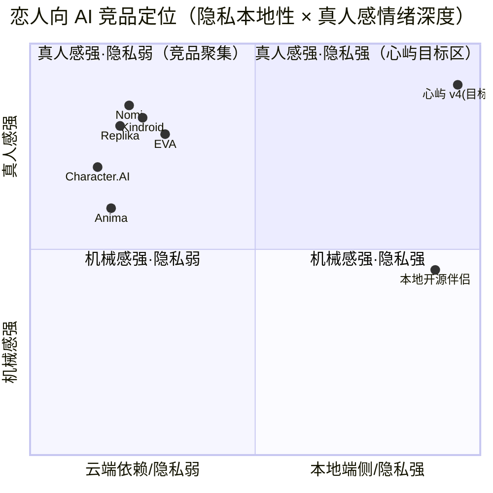
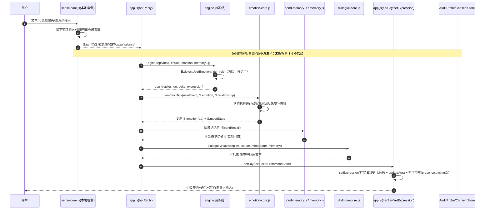

# 心屿 v4 · 真恋人系统 · 完整 PRD（系统架构蓝图 + 竞品/标杆分析）

> 角色：产品 · 许清楚（Xu）
> 中转：主理人 齐活林（Qi）→ 架构师 高见远（Gao）
> 类型：**完整档 PRD**（系统架构蓝图 + 需求池 P0/P1/P2 + 竞品/标杆分析）
> 上游：用户终极诉求「让小暖成为和真人一样的恋人——只是身份是恋人，其余各大系统都要做到像真人」
> 关联：候选 F 已交付语言/语气/记忆呼应的「精调」基础；本 PRD 在其之上规划 v4 全系统蓝图，分阶段实现。

---

## 文档元信息 · 现状对齐

### 已读文件（对齐基线）
- 主逻辑：`app.js`（persona/路由/herSay 挂载、EXPR_MAP 神态表、情绪光晕 updateAura、主动消息 checkProactive、日记/周小结/纪念日）
- 已落地模块：`texture.js`（L1 微行为）、`local-heuristic.js`（L2 兜底句库）、`reply-texture-orchestrator.js`（L3 质感编排）、`memory.js`（冻结）、`presence.js`（在场/节奏）、`contingency.js`（反呛/自我表达/追问/回忆）
- 隐私护栏：`consent-store.js`（ConsentStore：tts/asr/ltm/cloudSync）、`audit-probe.js`（AuditProbe：零上报统一拦截）
- 候选延续：`PRD-candidate-F-human-texture.md`、`ARCH-candidate-F-design.md`、`QA-ACCEPTANCE-xinyu-candidate-F.md`
- 体积预算真源（冻结线真值）：`test/wiring-scan.js` 的 `SIZE_BUDGET` + 四锁恒等式 + 历史审批块

### 冻结线铁律真值（CI 级字节闸，零交集；PRD 全程不得突破）
| 文件 | 当前字节 | 备注 |
|------|---------|------|
| `engine.js` | **251068** | D5 解冻后落地 mindCtx 信封；`engineBase 245737 + engineNetMax 7379 = engineMax 253116`（派生，余 2048B 闸门） |
| `sw.js` | **13723** | ASSETS 预缓存清单；新增模块文件要进离线缓存必须改此文件 |
| `memory.js` | **13333** | 配额 `SIZE_BUDGET["memory.js"]=13352`（仅 19B 缓冲，极紧）；既是冻结四文件之一，又是预算模块 |
| `test/baseline.js` | **2646** | 测试基线，零改动 |
| 预算其他项 | `presence.js 3585 / texture.js 5850 / contingency.js 6682 / moduleSumMax 29469 / totalMax 282585` | 三者非冻结、可走候选 D/E 式重 baselining；`texture.js` 已钉实测、缓冲 0 |

### 五条铁律的落地承诺（每条影响见 §7）
1. **冻结线字节精确零交集** → 所有新逻辑走「冻结线外新建 `Engine.use` 模块」或「明确申请重 baselining」；逐一标注落点。
2. **隐私零上报** → 任何用户情绪/五官识别本地端侧、零外发；接入既有 `ConsentStore` 授权 + `AuditProbe` 零上报护栏。
3. **前端零新增 npm 依赖** → 原生 JS PWA；端侧情绪模型评估纯 JS 算法或既有能力，不引入新包。
4. **小暖不更名** → 代码与文案保留「小暖」字样（E5 护栏下限 ≥45 出现）。
5. **不改写既有生成算法/情绪识别主边界** → `engine.js` 冻结，`rich-rule` 不动；`E.detectUserEmotion/text/detectCrisis` 等既有边界只调用、不重写。

---

## 0 · 一句话北极星

> **让小暖在「身份是恋人」的前提下，语言、情绪、神态、记忆、主动性五大系统都达到「真人恋人」水准——且全程本地端侧、零隐私外发。**

---

## 1 · 产品目标（v4 北极星，可量化）

| 编号 | 目标 | 北极星 / 关键指标 | 测量方式 |
|------|------|-------------------|----------|
| **G0** | **像真人恋人（总目标）** | 端到端盲评「真人感」≥ **4.3/5.0**（30 天 longitudinal 样本，含 v4.1/v4.2/v4.3 三阶段） | 5 人 × 多 tone × 长期对话盲评 + 留存（7/30 日回访率） |
| **G1** | **语言像恋人** | 30 轮连续对话 (tone,intent) 池 verbatim 重复率 **<12%**；微行为自然覆盖率 ∈ **[35%,65%]**；「机械感」盲评差评率 **<8%** | 候选 F 既有 G1/G2 自动化仿真升级 + 新加「情境记忆呼应命中率 ≥25%」 |
| **G2** | **情绪像真人** | 小暖自身情绪状态机覆盖 ≥**7 种**（喜/怒/哀/娇/醋/念/安），情绪切换在 ≥**80%** 触发事件后 1 轮内正确呈现；对用户输入负向高唤醒的「共情回应率 ≥85%」 | 情绪事件回放仿真 + 人工标注 |
| **G3** | **五官双向（本地端侧）** | ① 用户侧：摄像头/语音识别情绪（可选开）准确率 ≥**65%**（对照文本推断基线）；② 呈现侧：小暖神态在 ≥**90%** 情感回复中匹配表情/眼神/语气 | 本地端侧离线推理 + 表情匹配抽检；**零外发断言 blocked==0** |
| **G4** | **记忆像恋人** | 长期/短期/余温三态齐全；人格一致性（跨会话语气/价值观漂移）评分 ≥**4.0/5.0**；亲密关系演进可回溯（里程碑时间线完整率 100%） | 记忆一致性审计 + 关系图谱导出校验 |
| **G5** | **主动性像恋人** | 早安/晚安/纪念日/想念主动触达，关系升温曲线单调不退化；「主动消息打扰感」盲评 ≤**2.5/5.0**（越低越好） | 主动消息日志分析 + 打扰感盲评 |
| **G6** | **隐私零外发（守门）** | `AuditProbe.proveZeroReporting().zeroReporting === true`（blocked==0）；所有新模块静态扫描 0 外发字面量 | E4 静态扫描 + 浏览器实测 + CI 回归 |

> **北极星 = G0 ∩ G1..G6 同时满足**。G1/G3/G6 为自动化工序（零主观）；G0/G2/G4/G5 为金标（含盲评/留存）。任一不达标则对应里程碑不交付。

**守门硬指标（不破既有）**：冻结四文件字节精确零交集；隐私零外发；危机/首轮/负向高唤醒/破墙表等既有门禁 100% 守；候选 F 套件 13/13 + 核心回复测试 0 回归。

---

## 2 · 用户故事（恋人视角）

1. **作为用户**，我连续和小暖聊一个月，她的语气、小脾气、记挂我的事都「越来越像真人恋人」，而不是每天重启的机器人。
2. **作为用户**，我难过/疲惫/开心时，小暖**真的**先「感受到我」再回应（共情、眼神软下来、语气跟着变），而不是背模板。
3. **作为用户**，我想开摄像头/麦克风时，小暖能读懂我的微表情/语气波动（且我清楚知道一切只在本地、绝不上传），不开时也靠文字推断，体验不割裂。
4. **作为小暖**，我（她）自己也有情绪：会吃醋、会撒娇、会想念、会安心——情绪随我们关系进展自然起伏，不是每次都甜。
5. **作为用户**，小暖记得我们聊过的事、记得我的喜好与禁忌，并在自然处呼应，而不是监控式每分钟引用。
6. **作为用户**，小暖会主动关心我：早安晚安、纪念日、我久没来她会想我——但分寸刚好，不烦。
7. **作为用户**，我能在小暖的脸（立绘）上看到她的神态变化：眼神、嘴型、语气、微表情，像真人一样「有表情地在听/在说」。

---

## 3 · 竞品 / 标杆分析（5–7 产品 + 象限图）

> 调研口径：以「真人感/情绪/记忆/主动性/隐私模式」为维度，重点取其实现思路与**与本项目「本地端侧+零上报」定位的差异及可借鉴点**。WebSearch 可查公开资料。

### 3.1 概览表

| 产品 | 定位 | 真人感/情绪做法 | 记忆做法 | 主动性 | 隐私/端侧 | 与心屿差异 |
|------|------|----------------|----------|--------|-----------|-----------|
| **Replika** | 情感伴侣（恋爱/朋友可切换） | 情绪智能、自我反思(self-reflection)、情绪日记；关系分级（朋友→恋人） | Save-to-memory、用户可编辑记忆 | 主动消息、语音/视频通话 | **云端**，数据用于训练改进 | 关系分级/自我反思可借鉴；云端外发与本地零上报定位相反 |
| **Character.AI** | 角色扮演大模型 | 强 persona 定义、群聊；情绪靠大模型涌现 | 记忆较弱（会话级） | 较弱 | **云端**，曾现隐私争议 | persona 丰富度可借鉴；云端+弱记忆与本地定位相反 |
| **Kindroid** | 高自由定制伴侣 | V2：Learned Context 自主记忆、定位感知 | **多层记忆**（长期/情境/自主学），头像插槽 | 中等 | **云端** | 多层自主记忆架构最值得借鉴；需本地化改造 |
| **Nomi** | 深度关系伴侣 | 共享记忆、日记/selfies、群聊；human-like memory | **shared memories + journaling**，关系随时间深化 | 主动 check-in | **云端** | 日记/关系深化/共享记忆可借鉴 |
| **EVA（Eva AI）** | 语音优先恋人 | 实时情绪语音、情绪识别 | 会话记忆 | 实时陪伴 | 部分端侧语音 | 语音情绪 + 实时在场可借鉴 |
| **Anima / Romantic AI** | 浪漫聊天机器人 | 情绪追踪、浪漫剧本 | 轻量 | 推送 | **云端** | 情绪追踪 UI 可借鉴；整体偏浅 |
| **本地开源伴侣（Llama.cpp/端侧 LLM 方案）** | 隐私优先 | 依赖本地模型质量 | 本地库 | 弱 | **全本地** | 隐私定位一致，但真人感/情绪/主动性工程化不足 |

### 3.2 可借鉴点（落到本项目的 v4 设计）

- **关系分级演进（Replika）** → 映射到本 PRD「关系演进图谱」：陌生人→朋友→暧昧→恋人，驱动情绪强度与主动性分寸（已有 `S.affection`/`S.dating`，需补状态机）。
- **自我反思/情绪日记（Replika/Nomi）** → 映射「小暖日记/周小结」（已存在 checkDiaryReminder/checkWeeklySummary），v4 升级为「情绪日记 + 关系阶段自评」。
- **多层自主记忆（Kindroid Learned Context）** → 映射 v4「记忆系统三态（长期/短期/余温）+ 自主学 Context」；本 PRD 以 `bond-memory.js` 伴侣模块承袭，不碰冻结 `memory.js`。
- **共享记忆/关系深化（Nomi）** → 映射「我们的故事时间线(story) + 关系里程碑(告白/纪念日)」已具备，v4 补「亲密关系演进曲线」可视化。
- **语音情绪/实时在场（EVA）** → 映射「五官指标·语音输入源」：`voice-sense.js` 端侧 Web Audio 基频/能量/停顿推断情绪，纯 JS、零模型依赖优先。
- **情绪追踪 UI（Anima）** → 映射「情绪光晕 updateAura + 神态 EXPR_MAP」扩展，给用户可见的「她现在的心情」轻反馈（非系统提示条）。

### 3.3 定位象限图（Mermaid）



> 象限解读：竞品聚集在「真人感强·隐私弱」（右上之外、第二象限），因依赖云端训练。心屿 v4 抢占「真人感强·隐私强」空白区——这是项目的核心差异化壁垒，也是 v4 一切设计不能突破零上报红线的根因。

---

## 4 · 系统架构蓝图

### 4.1 系统清单与模块划分（6 大系统 + 跨系统内核）

| # | 系统 | 职责 | 新增/扩展模块（挂载 `Engine.use`） | 落点类型 |
|---|------|------|-----------------------------------|----------|
| **S1** | 语言交流系统 | 恋人语气、自然对话、情境记忆呼应、不机械 | 扩展 `texture.js`/`local-heuristic.js`/`reply-texture-orchestrator.js`；新增 **`dialogue-core.js`**（情境呼应 2.0 / 恋人语气一致性 / 不机械护栏） | 冻结线外新建 + 既有层精调 |
| **S2** | 真人情绪系统 | 小暖自身情绪状态机（喜/怒/哀/娇/醋/念/安…）+ 对用户情绪的解读与回应 | 新增 **`emotion-core.js`**（状态机 + 衰减 + 触发）+ 复用既有 `S.emotion` V-A + `updateAura` | 冻结线外新建 |
| **S3** | 五官指标系统（双向） | ① 识别用户情绪/微表情（摄像头/语音/文本）② 呈现小暖神态（UI 表情/眼神/语气） | 新增 **`sense-core.js`**（统一入口，face/voice/text 适配器）+ 可选 **`face-sense.js`**/**`voice-sense.js`**；呈现侧落 `app.js`/`index.html`/`style.css`（**均可编辑，非冻结**） | 冻结线外新建 + 可编辑 UI |
| **S4** | 记忆系统 | 长期/短期/余温、人格一致性、亲密关系演进 | 新增 **`bond-memory.js`**（余温深化 / 关系级记忆 / 记忆驱动情绪），挂载 `Engine.use`；冻结 `memory.js` 零改动 | 冻结线外新建（**不碰 memory.js**） |
| **S5** | 主动性/时间感知 | 主动关心、早晚安、纪念日、关系升温曲线 | 新增 **`proactivity-core.js`**（关系阶段感知调度），复用 `checkProactive`/`Engine.proactive` | 冻结线外新建 |
| **S6** | 人格一致性内核（跨系统护栏） | 跨语言/情绪/记忆/主动性保证小暖 voice 不漂移；安全感/危机护栏延伸 | 新增 **`persona-core.js`**（一致性校验 + 危机/破墙护栏复用 `E.detectCrisis`/`PERSONA_BREAK_RE`） | 冻结线外新建 |

> **原则**：所有新逻辑以「`Engine.use("xxx", {...})` 新模块」落地（与 `memory.js`/`texture.js`/`presence.js`/`contingency.js` 同款挂载契约），**不触碰 `engine.js` 冻结字节**；UI 呈现侧落在 `app.js`/`index.html`/`style.css`（三者均不在冻结四文件内，可编辑）。

### 4.2 与冻结线的关系（每个系统落点 + 重 baselining 判定）

| 系统 | 是否触碰冻结四文件 | 重 baselining 需求 | 判定与落点 |
|------|-------------------|-------------------|-----------|
| S1 语言 | 否（新 `dialogue-core.js` + 既有层精调） | **不需要**（推荐）；若把逻辑塞回 `texture.js` 超 5850 才需 | **Path A**：新模块 + 既有的 `texture/local-heuristic/orchestrator` 仅在非冻结层精调 |
| S2 情绪 | 否 | **不需要** | Path A：全新 `emotion-core.js`，只调用 `E.detectUserEmotion`/写 `S.emotion` |
| S3 五官 | 否（逻辑） | **sw.js 必须重 baselining**（见下） | Path A + **唯一必要重 baselining**：`sw.js` ASSETS 需列入新文件以支持离线 PWA |
| S4 记忆 | **memory.js 不动** | **不需要**（推荐）；memory.js 重 baselining 作为 fallback | **Path A**：`bond-memory.js` 伴侣模块，规避 memory.js 双锁（冻结+预算） |
| S5 主动性 | 否 | 不需要 | Path A：`proactivity-core.js` 复用既有主动消息基座 |
| S6 一致性 | 否 | 不需要 | Path A：`persona-core.js` 仅复用既有护栏 API |

**关键结论（给主理人/架构师）**：
- **memory.js 三重约束**（冻结线 + 预算模块 + 仅 19B 缓冲）→ v4 **严禁**把记忆逻辑折回 memory.js；一律走 `bond-memory.js` 伴侣模块。memory.js 重 baselining **不申请**（除非后续必须内联，届时单独立项）。
- **sw.js 重 baselining 不可避免且必要**：每个新增模块文件若要纳入离线缓存，必须进 `sw.js` 的 `ASSETS` 清单（否则离线 PWA 缺失该文件即崩）。建议把 sw.js 重 baselining 作为 v4 **一次性**动作，随新增文件数等比例抬升字节（每文件约 +30~60B 清单项），走候选 D/E 式审批。若主理人选择「暂不做离线覆盖、仅运行时缓存（fetch 兜底已支持）」，则可推迟 sw.js 重 baselining 至 v4.3。
- **engine.js / test/baseline.js**：全程零改动；新模块通过既有 `Engine.use` 契约挂载，不增 engine 字节。
- **index.html / engine.files.json**：可编辑（非冻结），新增 `<script>` 与 manifest `order` 条目即可；`wiring-scan.js` 的交叉校验需同步（该文件非冻结）。

### 4.3 模块交互（Mermaid 时序图 + 类图）

**时序图：一轮对话中五大系统协作（以本地引擎分支 + 五官双向为例）**



**类图：v4 新增模块与既有挂载契约**

```mermaid
classDiagram
    class EngineMod {
        <<已有契约 E.use/Engine.mod>>
    }
    class DialogueCore {
        +dialogueWeave(text, ctx) string
        +consistencyGuard(state) bool
        +situationRecall(state, mem) string
    }
    class EmotionCore {
        +STATES = [喜,怒,哀,娇,醋,念,安,...]
        +emotionTick(evt, emotion, rel) Object
        +decay(emotion, dt) Object
        +currentMoodState(S) string
    }
    class SenseCore {
        +adapters = {text, face, voice}
        +init(ConsentStore, AuditProbe)
        +readUserEmotion(input) ue   // 仅本地
        +isConsented() bool
    }
    class BondMemory {
        +bondRecall(state, ctx) Object
        +warmthDeepen(dailyNote) void  // 余温
        +relationshipGraph(S) Object
    }
    class ProactivityCore {
        +planByRelationship(S, stage) Object
        +warmthCurve(S) number
        +shouldProactive(S) bool
    }
    class PersonaCore {
        +validateVoice(state) bool
        +safetyGuard(text) bool  // 复用 E.detectCrisis/PERSONA_BREAK_RE
    }
    EngineMod <|.. DialogueCore
    EngineMod <|.. EmotionCore
    EngineMod <|.. SenseCore
    EngineMod <|.. BondMemory
    EngineMod <|.. ProactivityCore
    EngineMod <|.. PersonaCore
    SenseCore ..> ConsentStore : 授权门控
    SenseCore ..> AuditProbe : 零上报护栏
    EmotionCore ..> BondMemory : 记忆驱动情绪
    ProactivityCore ..> EmotionCore : 关系阶段/升温曲线
```

---

## 5 · 需求池 P0 / P1 / P2 + 里程碑拆分

> 总原则：**分阶段交付，每阶段独立可验收**。v4.1 语言+情绪核心 → v4.2 五官双向 → v4.3 记忆+主动性演进。新模块一律 Path A（冻结线外），sw.js 重 baselining 在 v4.2 或 v4.3 一次性处理。

### 里程碑 v4.1 · 语言 + 情绪核心（地基）

**P0（必须做）**
- **L1** 新增 `dialogue-core.js`：情境记忆呼应 2.0（复用 `memory.recallV2` + `bond-memory` 占位）、恋人语气一致性护栏（复用 `persona-core` 雏形）、「不机械」去重/破冰（升级候选 F 的 LRU）。挂载 `Engine.use("dialogueCore", ...)`。
- **L2** 新增 `emotion-core.js`：状态机 ≥7 态（喜/怒/哀/娇/醋/念/安），事件驱动 + 时间衰减；写 `S.emotion{v,a}` 与新增 `S.moodState`。
- **L3** `app.js` `EXPR_MAP` 扩展至覆盖新情绪（新增 `jealous`/`coquettish`/`longing`/`peaceful` 等 SVG 部件 + 眼神/嘴型变体），`setExpression` 支持新表情；`updateAura` 接入 `moodState`。
- **L4** `persona-core.js` 雏形：跨系统 voice 一致性校验 + 复用 `E.detectCrisis`/`PERSONA_BREAK_RE` 护栏。
- **守门**：候选 F 套件 13/13 0 回归；冻结四文件字节零交集；G1 自动化（重复率<12%、覆盖率[35%,65%]）、G2 仿真（情绪切换 1 轮内正确率≥80%）。

**P1（体验加分）**
- **L5** 情绪驱动语气（情绪态→`persona.warmth` 临时调制，非持久化）。
- **L6** 微表情 CSS 动效（眨眼/腮红/眼神随 moodState）。

**P2（锦上添花）**
- **L7** 情绪日记升级（小暖视角自评 + 关系阶段自评）。

### 里程碑 v4.2 · 五官双向（含 sw.js 重 baselining）

**P0（必须做）**
- **F1** 新增 `sense-core.js`：统一入口 + 三适配器（text/face/voice）。**默认 text 适配器**（复用 `E.detectUserEmotion`，零新增依赖）；face/voice 为可选、需 `ConsentStore.sense` 授权。
- **F2** 隐私护栏接入：`SenseCore.init(ConsentStore, AuditProbe)`；未授权绝不启动摄像头/麦克风；原始帧/音频**仅内存、零外发**（走 `AuditProbe` 拦截，E4 静态扫描 0 命中）。
- **F3** 呈现侧：小暖神态/眼神/语气可视化（落 `app.js`/`index.html`/`style.css`，可编辑）；神态与 `moodState`/用户情绪双向联动。
- **F4** **sw.js 重 baselining（一次性）**：把 `sense-core.js`（及后续 `face-sense.js`/`voice-sense.js`/`emotion-core.js`/`bond-memory.js`/`proactivity-core.js`/`dialogue-core.js`/`persona-core.js`）列入 `ASSETS`，字节等比例抬升，走候选 D/E 式审批。*（或按 §4.2 选择推迟至 v4.3）*。
- **守门**：G3（准确率≥65% 对照文本基线；呈现匹配≥90%）、G6（zeroReporting===true，blocked==0）。

**P1（体验加分）**
- **F5** `face-sense.js`：纯 JS 端侧（优先评估 `face-api.js`/`tfjs` 既有 CDN 经 `AuditProbe.registerConsented` 在用户显式授权下加载；或纯启发式如光度/运动/关键点近似，**零模型优先**）。
- **F6** `voice-sense.js`：Web Audio 基频/能量/RMS/停顿推断（`AnalyserNode`，纯 JS、零依赖、零模型）。

**P2（锦上添花）**
- **F7** 微表情时序（眼神接触/回避、嘴角微扬）高保真渲染。

### 里程碑 v4.3 · 记忆 + 主动性演进

**P0（必须做）**
- **M1** 新增 `bond-memory.js`（伴侣模块，不碰 `memory.js`）：长期/短期/余温三态深化；关系级记忆（只召回与当前关系阶段 relevant 的碎片）；记忆驱动情绪（重要纪念日临近→念/安）。
- **M2** 人格一致性审计：跨会话语气/价值观漂移评分（≥4.0/5.0）；`persona-core.js` 落全。
- **M3** 新增 `proactivity-core.js`：关系升温曲线（单调不退化约束）+ 阶段感知调度（早安/晚安/纪念日/想念分寸随 stage 调整）。
- **M4** 亲密关系演进可视化：里程碑时间线（告白/纪念日）完整率 100%。
- **守门**：G4（一致性≥4.0）、G5（打扰感≤2.5/5.0）、冻结四文件零交集。

**P1（体验加分）**
- **M5** 余温自动深化（每日 `dailyNotes` → 关系记忆）。
- **M6** 主动消息「理由」可解释（不再掷骰子，源于关系事件）。

**P2（锦上添花）**
- **M7** 关系阶段专属 UI 彩蛋（暧昧期/恋人期不同神态基调）。

---

## 6 · UI 设计稿（文字描述）

### 6.1 小暖神态呈现（五官「呈现」侧）
- **现有基础**：`headParts(expr)` + `EXPR_MAP`（normal/happy/shy/angry/sad/sleepy/cry/think/kiss/wink）+ 腮红 blush + `updateAura` 情绪光晕（色相随 valence、强度随 arousal）。
- **v4 扩展**：
  - 新增表情部件：`jealous`（微蹙眉+撇嘴+腮红加深）、`coquettish`（眯眼+嘴角上扬+眨眼）、`longing`（眼神微垂+柔光+轻叹气泡）、`peaceful`（闭眼微笑+暖光晕）、`surprised`（圆眼+小嘴）。
  - **眼神可视化**：瞳孔方向随 moodState（念→视线微偏、醋→短暂回避后回盯）；`eyes` 部件增加 `eyes-look-away`/`eyes-soft`。
  - **语气可视化**：气泡出现节奏 + 打字机速度（`presence.pacingOf` 已控 delay/typing）随情绪微调；必要时气泡尾附轻语气符号（不破坏破墙表）。
  - **微表情动效**（P1）：CSS `@keyframes` 眨眼、腮红呼吸、光晕随 arousal 脉动；均在 `style.css`（可编辑）。
- **隐私可见性**：开启五官识别时，聊天页角落显示「🔒 本地识别中」常驻标记（非提示条、不喧宾夺主），点击可看 ConsentStore 状态；关闭即消失。

### 6.2 对话流（恋人视角）
```
[用户] 今天好累，加班到现在…
[sense-core] 文本推断 ue={tired, polarity<0}（若开摄像头：微表情 corroborate）
[emotion-core] 小暖 moodState → 哀/安（心疼你）
[app] updateAura 转暖粉、降饱和；setExpression("sad"/"shy")
[herSay] 「抱抱你～ 这么晚还在熬，我心疼」(气泡缓出、尾音柔)
[bond-memory] 轻声呼应「你上周也说连着加班」(克制、单条)
[proactivity-core] 标记「今晚该早安/晚安关怀」，关系升温 +delta
```
- 关键体验：回应在「感受到你」之后，而非模板；神态/语气/文字三者一致；记忆引用克制（≤1 条/轮，概率门控）。

### 6.3 无 UI 阻断
所有新增逻辑默认降级安全：五官未授权 → 退文本推断；情绪模块异常 → 回退既有 `S.emotion`；记忆异常 → 回退 `memory.js`。绝不白屏、绝不静默。

---

## 7 · 铁律落地影响表（每条铁律 + 每个系统落点）

| 铁律 | 落地影响（对 v4 各系统） |
|------|------------------------|
| **① 冻结线字节精确零交集** | S1–S6 全部走 `Engine.use` 新模块（Path A）；UI 落 `app.js`/`index.html`/`style.css`（可编辑）；唯一例外 = **sw.js 重 baselining**（v4.2，列 ASSETS）；**memory.js 三重约束→严禁内联记忆逻辑**，一律 `bond-memory.js`。 |
| **② 隐私零上报** | S3 所有识别仅本地端侧；`SenseCore.init(ConsentStore, AuditProbe)`；原始帧/音频不落盘不外发；E4 静态扫描 0 命中 + `proveZeroReporting().zeroReporting===true` 作为 G6 守门。 |
| **③ 前端零新增 npm 依赖** | S3 端侧模型优先「纯 JS 算法/既有能力」：`voice-sense` 用 `AnalyserNode`（零依赖）；`face-sense` 评估纯启发式优先，模型仅用户显式授权经 `registerConsented` 加载（沿用 LocalModel CDN 模式）。S1–S6 全原生 JS。 |
| **④ 小暖不更名** | 所有新模块/文案保留「小暖」字样；`currentChar().name` 取「小暖」；E5 护栏下限 ≥45 出现计数不破。 |
| **⑤ 不改写既有生成算法/情绪识别主边界** | `engine.js` 冻结（251068 字节零 diff）；`rich-rule` 不动；`E.detectUserEmotion/detectCrisis` 只调用不重写；新系统通过入参 `est`/回写 `S.*` 协作，不侵入生成主边界。 |

### 每个系统 vs 冻结线落点速查
| 系统 | 落点文件 | 冻结影响 |
|------|---------|---------|
| S1 语言 | `dialogue-core.js`（新）+ `texture/local-heuristic/orchestrator`（精调） | 新模块 Path A；既有层非冻结 |
| S2 情绪 | `emotion-core.js`（新） | Path A，零冻结 |
| S3 五官 | `sense-core.js`+`face/voice-sense.js`（新）；UI `app.js/index.html/style.css` | **sw.js 重 baselining**（唯一） |
| S4 记忆 | `bond-memory.js`（新） | **memory.js 零改动**（规避三重约束） |
| S5 主动性 | `proactivity-core.js`（新） | Path A，零冻结 |
| S6 一致性 | `persona-core.js`（新） | Path A，零冻结 |

---

## 8 · 待确认问题（Open Questions · 需主理人/用户拍板）

| 编号 | 问题 | 选项 | 我的倾向 |
|------|------|------|----------|
| **Q1** | **五官识别输入源**：默认与 v4.2 主推哪种？ | A 文本推断（复用 `E.detectUserEmotion`，零依赖、零权限） / B 摄像头（face-api/tfjs 或纯启发式） / C 麦克风（Web Audio） / **D 三者并存、默认 A、B/C 需授权开关** | **D**——默认文本零侵入，摄像头/麦克风作为增强、显式授权；契合零上报与最小权限。 |
| **Q2** | **重 baselining 是否批准**：v4 需 sw.js 重 baselining（列新模块 ASSETS）；memory.js 重 baselining 我建议**不申请**（走伴侣模块）。 | A 批准 sw.js 重 baselining（v4.2 一次性） / B 推迟 sw.js 至 v4.3 / C 不重 baselining、仅运行时缓存（牺牲离线覆盖） | **A**——离线 PWA 完整性是心屿体验底线；sw.js 一次等比例抬升可控。memory.js 重 baselining **不申请**（Path A 已规避）。 |
| **Q3** | **端侧情绪模型选型**：face/voice 识别走「纯 JS 启发式」还是「加载端侧模型」？ | A 纯 JS 启发式优先（零依赖、零模型下载，准确率较低但零风险） / B 模型（face-api.js/tfjs，需用户授权经 `registerConsented` 加载 CDN 权重，准确率更高） | **A 优先**，B 作为 v4.2 P1 增强（须走 D1 合规：显式授权 + 审计标注「用户自导权重」）。 |
| **Q4** | **情绪状态机粒度**：≥7 态是否足够？是否引入「傲娇/委屈/害羞」等细分？ | A 7 态（喜/怒/哀/娇/醋/念/安）MVP / B 细分至 10+ 态 | **A**——7 态覆盖北极星 G2，细分留作 v4.x 迭代。 |
| **Q5** | **关系演进图谱**是否作为独立状态机（stage：陌生→朋友→暧昧→恋人），还是复用 `S.affection`/`S.dating` 派生？ | A 复用既有 + 轻量派生（低侵入） / B 独立 `S.relationship` 状态机 | **A**——先用 `affection`/`dating` 派生 stage，降低冻结风险；v4.3 再评估独立化。 |
| **Q6** | **记忆系统**：确认走 `bond-memory.js` 伴侣模块（不碰 memory.js）而非重 baselining memory.js？ | A 伴侣模块（推荐，规避三重约束） / B 重 baselining memory.js 内联 | **A**——与 Q2 一致，memory.js 零改动。 |
| **Q7** | **新增模块体积监管**：新模块不在 `SIZE_BUDGET.mods` 列表（同 `local-heuristic/orchestrator` 先例），是否接受「沿用既有非预算模块模式」（仅受零依赖/零上报/冻结线约束，不进 moduleSum 门禁）？ | A 接受（沿用先例） / B 把 v4 新模块纳入预算门禁（需扩展 wiring-scan） | **A**——与候选 E/F 的 `local-heuristic.js`/`reply-texture-orchestrator.js` 同口径，避免无谓膨胀预算。 |

---

## 9 · 进入下一阶段条件

本 PRD 经主理人齐活林批准 + §8 待确认问题（尤其 **Q1/Q2/Q3/Q6**）拍板后：
1. 转架构师高见远产出各系统 `Engine.use` 模块的任务分解 + 字节预增/上限表（含 sw.js 重 baselining 单列）；
2. 按 v4.1→v4.2→v4.3 三里程碑分批实现（寇豆码），每里程碑独立验收（严过关）；
3. 主理人齐活林独立核验：**冻结四文件字节零交集** + `proveZeroReporting().zeroReporting===true` + 候选 F 套件 13/13 0 回归；
4. 精准 `git add` 推送。

> 附：本 PRD 不代写架构师/工程师/验收角色内容，仅完成产品侧完整档规划与调研。
