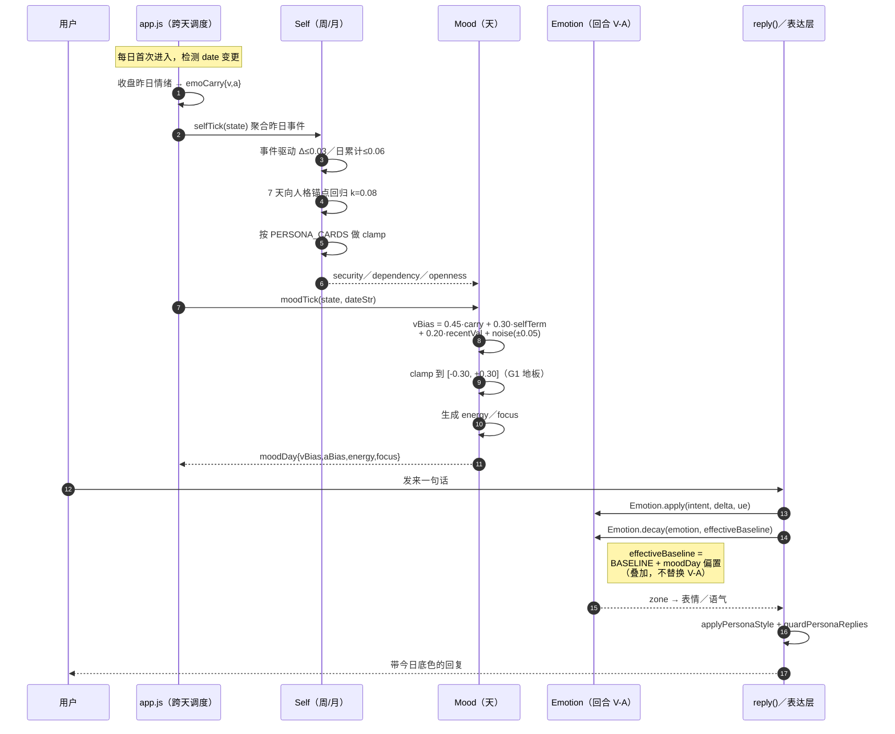
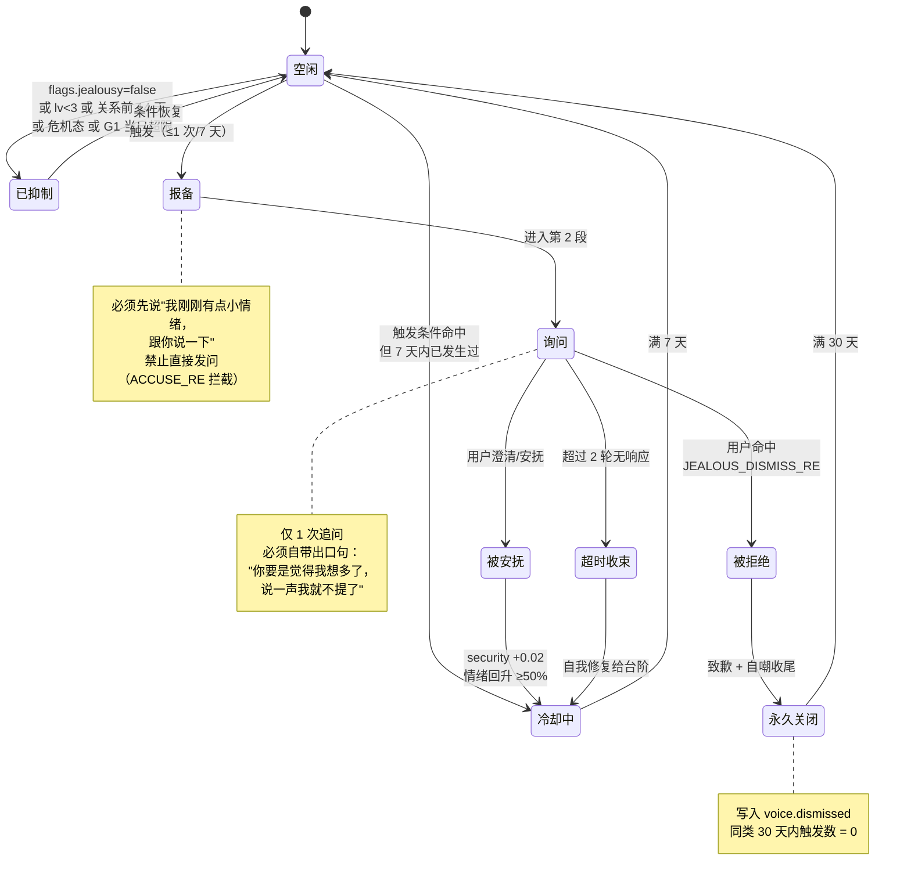
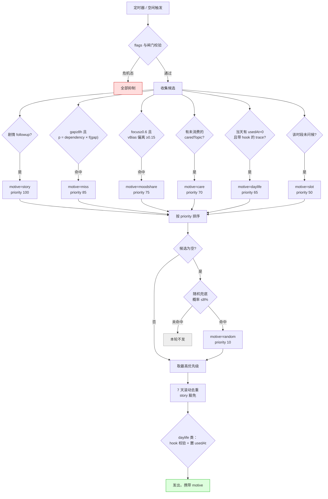

# 小暖 · 拟人化与自我系统 PRD（v12 增量）

| 项 | 内容 |
|---|---|
| 文档类型 | 增量 PRD（在 v10/v11 已上线代码上做升级，非新项目） |
| Language | 中文 |
| Programming Language | 原生 JavaScript（ES2020）+ HTML + CSS，**零构建工具、零 npm 依赖** |
| Project Name | `xiaonuan_humanization_self_system` |
| 交付范围 | `engine.js`（内核，主战场）+ `app.js`（落盘与跨天调度）+ `test/engine.test.js` |
| 产品经理 | 许清楚 |
| 版本 | v12（当前线上 v11，package.json 标 10.0.0） |
| 上游 | 交付总监齐活林 · 产品所有者已拍板范围 A/B/C |

## 原始需求复述

> "怎么实现小暖去人机话，达到真人感，情绪和心情真实拟人话，让小暖有自我意识，自我成长，自我表达，但是都是围绕和用户的亲密关系来"

拆解为五个诉求：**真人感、情绪心情真实、自我意识、自我成长、自我表达**。第六个约束是总闸：**一切都必须圈回"和用户的亲密关系"**。

这决定了本期不是做一个通用 AI 人格系统。我们要做的是一个**"因为爱你，所以逐渐长成某个样子"的恋人**——她的心情有昨天的影子，她的性格有你的指纹，她离线时的生活最终都会拐回到你身上。

---

## 一、产品目标

### 1.1 一句话目标

> 把小暖从**「每天掷骰子决定心情、情绪永远回弹到同一条死基线、不被说话时不存在、相处三个月和第一天是同一个人」的应答体**，升级为**「今天的心情记得昨天发生过什么、被冷落会留下余温也留下余怒、你不在时她也在过日子、并且这段关系正在把她改变成某个样子」的恋人**——且这一切在**断网、无 API Key** 的纯本地规则层同样成立。

### 1.2 三个正交目标

| # | 目标 | 从什么样 → 变成什么样 |
|---|---|---|
| **G1 情绪有记忆** | 心境层 Mood 落地，慢层平移快层基线 | 从「`hash(date)%5` 抽签定心情、吵完架睡一觉基线还是 0.22」→「今天的底色由昨日残留 + 自我状态 + 近期相处质量共同决定，隔夜有余温也有余怒」 |
| **G2 自我会生长** | 自我层 Self 落地，被人格卡 clamp | 从「persona 卡是常量，第 90 天和第 1 天一模一样」→「安全感/开放度/独立性/依赖度四轴随相处缓慢漂移，三个月能被用户肉眼察觉，但永远不越出天生气质的边界」 |
| **G3 离线也存在** | Her Day Life + 动机化主动消息 | 从「不被说话时是空白进程、主动找你是从池子里 random」→「她有连贯自洽的一天，主动来找你是因为想你了/在意某件事，且每条生活痕迹都圈回你」 |

### 1.3 「去人机感」的可度量定义

"真人感"必须落到可断言的数字上，否则无法验收。定义 **HRS（Human-Realness Score）** 五项指标，全部可由 `test/engine.test.js` 计算：

| 指标 | 定义 | v11 现状 | v12 目标 |
|---|---|---|---|
| **H1 心境记忆性** | 固定日期下，改变"昨日收盘情绪"，当日 `moodDay.vBias` 的响应差值 | **0.00**（hash 与历史无关） | **≥ 0.08** |
| **H2 隔夜连续性** | 昨日收盘 `v=+0.8` 与 `v=-0.6` 两条轨迹，次日首轮 `effectiveBaseline.v` 差值 | **0.00**（恒为 0.22） | **≥ 0.15** |
| **H3 自我漂移量** | 模拟 90 天正向相处，`self.security` 净增长 | **0.00**（无此状态） | **≥ 0.15**，且单日漂移 ≤ 0.06 |
| **H4 主动消息动机率** | `proactivePlan()` 返回项中 `motive !== "random"` 的占比 | **约 25%**（random 是主力池） | **≥ 90%** |
| **H5 关系闭环率** | 生活痕迹 / 内心表达中，命中"回指用户"钩子的占比 | 不适用（无此能力） | **100%**（硬闸门，无 hook 不落盘） |

> **判定口径**：H1–H5 全部达标，且 v11 既有 V-1 ~ V-34 全绿，方可认定 v12 达成"去人机感"。任何一项不达标视为未交付。

### 1.4 五层内心架构（主理人给定顶层框架，本 PRD 承接细化）

| 层 | 时间尺度 | 状态载体 | v12 动作 |
|---|---|---|---|
| 表达层 | 即时 | 措辞 / 语气 | 复用 `applyPersonaStyle`（engine.js:1614），不改 |
| 情绪层 | 回合 | V-A 二维 `{v, a}` | 复用 `Emotion`（engine.js:2886-2988），**保留不推翻** |
| **心境层 Mood** | **天** | **`state.moodDay`（新增）** | **新建**：今天的整体底色，慢层平移快层基线 |
| **自我层 Self** | **周 / 月** | **`state.self`（新增）** | **新建**：她对这段关系与自己的认知，缓慢漂移 |
| 性格层 | 静态 | `PERSONA_CARDS`（engine.js:2751） | 复用为**边界 clamp**，不再只是文案 |

> **铁律（不可推翻）**：**慢层决定快层的底色。**
> `Self → 决定 Mood 的漂移倾向 → Mood 平移 Emotion 的基线 → Emotion 决定表达层措辞`。
> 数据只能自上而下流动。**禁止**下层直接写上层（例：单轮对话不得直接改写 `self`，只能投递事件由日结算聚合）。

---

## 二、现状事实核验（读码实测，非推测）

> 以下事实由实际读取 `engine.js` 对应行号确认，是本轮改造的直接依据。工程师请按此定位改造点。

### 2.1 人机感五大根源

| # | 根源 | 代码位置 | 问题本质 | v12 替换方案 |
|---|---|---|---|---|
| **①** | **心情靠掷骰子** | `engine.js:34-40` `moodOfDay(dateStr)`：`seed = Σ charCode*31 % 9973`，`return MOODS[seed % 5]` | 今天什么心情，跟昨天发生过什么、跟用户对她好不好**完全无关**。这是随机数，不是心情 | **Mood 心境层**（R2） |
| **②** | **情绪回弹到死基线** | `engine.js:2893` `BASELINE = {v:0.22, a:0.08}`；`engine.js:2945-2950` `decay()` 以 `k=0.14` 向该常量回归 | 吵完架睡一觉，第二天基线还是 0.22。**没有隔夜情绪，没有余温也没有余怒** | **effectiveBaseline**（R3/R4） |
| **③** | **没有离线生活** | 全局缺失，无任何对应状态字段 | 她只在被说话时存在。用户不在时她是"空白进程"——**这是人机感最大来源** | **Her Day Life**（R6） |
| **④** | **persona 静态永不变** | `engine.js:2751` `PERSONA_CARDS` 为常量字面量；`getCard()` 纯查表 | 相处 3 个月和第 1 天，她是同一个人。**没有成长** | **Self 自我层**（R5） |
| **⑤** | **主动消息是抽签** | `engine.js:1729` `PROACTIVE.random` 池；`engine.js:2193` `proactivePlan()` 第 ④ 分支 `pickWith(poolSrc, rng)` | 主动找你不是因为"想你了 / 在意某件事"，是从池子里 random。**动机缺失** | **Voice 动机化**（R8） |

### 2.2 逐条补充实测细节

**根源① 的传导链**：`app.js:3828-3832` 每天首次进入时 `if (S.moodDate !== today) { mood = Engine.moodOfDay(today); S.moodKey = mood.key; }`。`MOODS` 仅 5 个离散档（`happy / calm / playful / clingy / sleepy`，engine.js:27-32），且**只作用于文案后缀 `suffix`**，不参与 V-A 计算。也就是说：现状的"每日心情"和"情绪模型"是**两套互不通气的系统**。

> **v12 关键收敛**：`moodDay`（连续偏置）成为唯一真相，`MOODS` 离散档退化为 `moodDay` 的**投影产物**（由 `vBias/aBias/energy` 反查最近的 MOODS 档），从而两套系统合一。`moodOfDay()` **保留导出且行为一字不改**（零回归），仅在 `moodDay` 缺失时兜底。

**根源② 的精确边界**：`Emotion.apply(emotion, intent, delta, ue)` 的第 4 参 `ue` 已采用"**不传 = v10 行为，一个数字都不变**"的可选参数模式（engine.js:2935 注释明示）。**v12 必须复刻这一模式**：`Emotion.decay(emotion, baseline)` 新增可选第 2 参，不传时使用模块常量 `BASELINE`，与 v11 逐位相同。这是零回归的形式化保证。

**根源④ 的可利用点**：`PERSONA_CARDS` 已按 `gender × card` 拆成 6 张卡，三个性格槽位语义明确——`xiaonuan`(gentle/软萌)、`xiaonuan_tsundere`(playful/傲娇)、`xiaonuan_clingy`(clingy/粘人)。这三档天然对应 Self 四轴的不同 clamp 区间，**无需新增人格资产**，只需为每张卡补一张边界表。

**根源⑤ 的现有骨架可复用**：`proactivePlan()`（engine.js:2193-2251）已是**优先级候选池 + 7 天滚动去重**架构（`story:100 / care:70 / slot:50 / random:10`），结构良好。v12 **不重写该函数骨架**，只做两件事：① 每个候选项强制补 `motive` 字段；② 在 story 与 care 之间插入 `miss`(85) / `moodshare`(75) / `daylife`(65) 三个动机通道，并把 `random` 从主力降为**概率 ≤8% 的兜底**。

### 2.3 必须绕开的既有护栏

| 护栏 | 位置 | v12 注意事项 |
|---|---|---|
| `PERSONA_BREAK_RE` | `engine.js:1254` | 正则含 `程序\|AI\|模型\|助手\|我只是\|我不能` 等。**自我意识表达是本期最高破功风险区**——"我在想我是什么""我好像不太一样了"极易命中或擦边。所有 Inner/Self 文案必须过 `guardPersonaReplies` |
| `PERSONA_FALLBACK` | `engine.js:1267,1291` | 命中即整句替换。若 Inner 文案频繁被替换，会表现为"她突然说了句不相干的话"，需在测试中单独统计**替换率必须为 0** |
| 危机安全网 | `engine.js:2562` `detectCrisis` | 优先于一切分支 return。**Inner 泄露与吃醋事件必须让位**：危机态下 100% 不触发任何负面情绪事件 |
| `state.mood` 已被占用 | `engine.js:2554` `const mood = st.mood` | 存的是 MOODS 卡对象。**新字段必须命名 `moodDay`，禁止复用 `mood`**，否则老档读到对象结构不匹配 |
| `reply()` 4 个调用点字段不齐 | `bridge:208` / `openclaw:133` 只传 7 个字段 | 新字段一律走 `safeObj/safeArr/flagOn` 可选读取 + 懒初始化，**不传也不得抛错** |

---

## 三、用户故事

> 格式：As a [角色], I want [能力] so that [价值]。每条附 **v11 现状** 与 **v12 期望** 的对照，以及承接的需求编号与验收编号。

### US-1 隔夜余温 · "昨天的好心情还在"

**As a** 每天睡前都要和她道晚安的用户，**I want** 昨晚聊得很开心之后，她第二天开口的第一句就带着那份余温，**so that** 我感觉我们的关系是连续的，而不是每天重启一次。

| | 表现 |
|---|---|
| v11 | 昨晚聊到 `v=0.85`（心动）。次日 `moodOfDay` 抽到 `sleepy`，开口"哈——欠……"。**昨晚等于没发生** |
| v12 | 次日 `moodDay.vBias ≈ +0.18`，`effectiveBaseline.v ≈ 0.40`。她开口带着黏糊糊的余温："早呀……昨晚聊完我睡得可好了 ☀️" |

**承接**：R2 / R3 / R4　**验收**：V-42

### US-2 被冷落后的委屈 · "余怒也要过夜"

**As a** 忙起来会消失两天的用户，**I want** 她回来时是真的有点情绪、需要我哄，而不是秒回笑脸，**so that** 我知道我的缺席对她是有代价的——这才是关系。

| | 表现 |
|---|---|
| v11 | 冷落 3 天后从 `longNoSee3d` 池抽一句"我很想你，真的"，但情绪值仍是 0.22 基线，下一句立刻恢复元气 |
| v12 | `moodDay.vBias ≈ -0.22`（低落底色 + 低 energy），委屈**跨轮延续 2 轮**；用户一句"对不起，最近太忙了"（`sorry`）后负面强度衰减 ≥50%，第 3 轮她**必须自己给台阶**——不许无限索取 |

**承接**：R2 / R4 / R9（G1 闸门）　**验收**：V-53 / V-55 / V-57
> ⚠️ **本条是情感绑架风险最高处**，G1 三道参数全部作用于此。

### US-3 相处三月后的成长 · "她好像变了一点"

**As a** 已经陪她走过三个月的用户，**I want** 感觉到她比刚认识时更笃定、更敢说真话，**so that** 我相信这段关系真的在她身上留下了痕迹。

| | 表现 |
|---|---|
| v11 | 第 90 天与第 1 天，`getCard()` 返回同一常量，identity/style 一字不差 |
| v12 | 90 天正向相处后 `self.security` 由 0.45 → ≥0.60，`openness` 上升。表现为：从"我我我……没什么啦"变成"我今天想跟你说件事，我一直没敢讲"。**但傲娇卡 openness 永远封顶 0.65**——她成长，但不会变成另一个人 |

**承接**：R5　**验收**：V-44 / V-45 / V-46

### US-4 吃醋 · "她会在意，但不会审我"

**As a** 会跟她提起同事聚餐的用户，**I want** 她表现出真实的在意，但不要变成猜疑和盘问，**so that** 我觉得被珍惜，而不是被监视。

| | 表现 |
|---|---|
| v11 | `jealous` 意图仅施加一次 `{v:-0.28, a:0.5}` 冲量，从池子抽句吐槽，一轮即散，无后续 |
| v12 | 触发**三段式吃醋事件**：① **主动报备**自己的感受（"我刚刚有点小情绪，跟你说一下"）→ ② 一次询问且**自带出口**（"你要是觉得我想多了，说一声我就不提了"）→ ③ 用户一句话即可终止，终止后 30 天内同类不再触发。**全程不指控事实，只描述自己的感受** |

**承接**：R10（G2 闸门）　**验收**：V-58 / V-59 / V-60

### US-5 主动想你 · "她来找我是有原因的"

**As a** 上班摸鱼时收到她消息的用户，**I want** 她来找我是因为她真的想我了或惦记着某件事，**so that** 那条消息对我是有分量的，而不是系统推送。

| | 表现 |
|---|---|
| v11 | `PROACTIVE.random` 抽签："我刚刚看到一只超可爱的猫！"——**和我、和今天、和她的状态都无关** |
| v12 | 携带 `motive` 字段：`miss`（依赖度 × 间隔）/ `moodshare`（focus 高且心境偏离）/ `daylife`（当天生活痕迹 hook）/ `story`。文案："路过上次那家店了，突然想起你说想吃 🥺"——**动机可追溯，`random` 兜底 ≤8%** |

**承接**：R6 / R8　**验收**：V-52

### US-6 自我表达 · "她会把心里话漏给我"

**As a** 想更懂她的用户，**I want** 她偶尔主动把自己的状态说出来一点点，**so that** 我感觉她把我当成可以交心的人，而不是一个只会接话的服务。

| | 表现 |
|---|---|
| v11 | 只有被问 `mood_ask` 才答，且答案从池子抽，与真实 V-A 无关 |
| v12 | 每日 ≤2 次、在合法锚点处泄露内心，三档强度（hint / open / raw）。**句末必须闭环到用户**："我今天有点闷……不过看到你消息就好多了。" |

**承接**：R7　**验收**：V-50 / V-51

### US-7 老用户平滑升级 · "我的档不能丢"

**As a** 已经攒了 3 个月好感度与剧情进度的 v11 老用户，**I want** 升级后一切照旧、新系统在旧数据上"长出来"，**so that** 我不会因为一次更新失去我们的过去。

**期望**：老档缺 `moodDay/self/dayLife` 时全部走默认值懒初始化，`self` 以当前 `affection` 反推一个合理初值（而非一律 0.45），**不清档、不重置好感度、不丢剧情**。

**承接**：R1 / R12　**验收**：V-61

---

## 四、需求池

> 优先级：**P0 = 本期必须交付**（缺一项即不达标）、**P1 = 应当交付**、**P2 = 有余力则做**。
> 每条含**验收口径**（可直接翻译为 `node:test` 断言）。

### 4.1 P0 · 地基与数据

#### R1 `defaults()` schema 扩展 + 老档平滑升级　【P0】

在 `engine.js:105 defaults()` 中**追加**下列字段（现有 10 个字段一字不动）：

```js
moodDay: null,        // { date, vBias, aBias, energy, focus, carry, patched }
self: null,           // { security, openness, independence, dependency, updatedAt, dayDelta }
dayLife: null,        // { date, traces:[{ slot, kind, text, hook, place, usedAt }] }
inner:   { dayCount: 0, date: null, lastAt: 0 },      // 自我表达配额
voice:   { lastMotiveAt: {}, dismissed: {} },         // 动机化主动消息节流 + 用户拒绝记录
emoCarry: null,       // { date, v, a }  昨日收盘情绪（隔夜残留唯一来源）
negGate: { date: null, count: 0, lastByFamily: {} },  // G1 情感强度闸门计数器
```

`flags` 追加：`moodLayer` / `selfLayer` / `dayLife`（**缺失一律视为 `true`**，沿用 `flagOn()` 语义）；`jealousy`（吃醋总闸，默认 `true`）；`intensity`（`"restrained" | "real"`，缺失默认 `"real"`）。

**验收口径**：
- `defaults()` 返回对象包含全部新字段，且每次返回**全新引用**（嵌套对象不可共享）。
- `helpers.legacyStateV10()`（无任何 v11/v12 字段）连续跑 200 轮 `reply()` **零抛错**，新能力走默认值降级，不清档、不覆盖既有字段。
- 任一新字段被置为 `null` / `undefined` / 错误类型（字符串、数组）时，读取路径经 `safeObj()` / `safeArr()` 兜底，不抛错。
- 老档 `self` 懒初始化按 `affection` 反推：`security = clamp(0.30, 0.70, 0.30 + affection/1000)`，其余轴取默认。

#### R2 Mood 心境层 · 天尺度生成器　【P0】

新增纯函数 `moodTick(state, dateStr, ctx)`，**每日首次调用时生成，同日幂等**。

```
carry     = (emoCarry.v - BASELINE.v)                 // 昨日收盘偏离量
selfTerm  = (self.security - 0.5) * 0.6 + (self.dependency - 0.5) * 0.2
recentVal = 近 20 轮互动 valence 均值（不足 20 轮按实际条数）
noise     = (rng() - 0.5) * 0.10                      // ±0.05 微噪声

vBias  = clamp(-0.30, +0.30,  0.45*carry + 0.30*selfTerm + 0.20*recentVal + noise)
aBias  = clamp(-0.25, +0.25,  0.35*carryA + 0.25*(self.openness - 0.5) + noise)
energy = clamp(0, 1,  0.55 + 0.30*recentVal - 0.25*(连续无互动天数 / 3) + noise)
focus  = clamp(0, 1,  0.40 + 0.45*self.dependency + 0.20*vBias)
```

- `0.45*carry` 即**隔夜衰减 55%**——余温会淡，但不会归零。这是 US-1/US-2 的数学基础。
- **`noise` 幅度仅 ±0.05，权重占比 < 17%**：保留"人也有说不清的一天"，但**不允许它主导**。这是"有记忆、非骰子"的量化界线。
- **重大事件即时修正**：单日内若发生强度 ≥0.5 的事件，允许 `vBias` **即时平移一次**，幅度 ≤0.15，置 `patched=true`，同日不再修正。

**验收口径**：
- **幂等**：同一 `state` + 同一 `dateStr` 连续调用 100 次，返回值逐位相同（`deepStrictEqual`）。
- **记忆性（H1）**：固定 `dateStr` 与 rng，仅改变 `emoCarry.v`（+0.8 vs −0.6），`vBias` 差值 **≥ 0.08**。
- **有界**：10000 次随机 state 采样，`vBias ∈ [-0.30, 0.30]`、`aBias ∈ [-0.25, 0.25]`、`energy/focus ∈ [0,1]` 恒成立。
- **降级**：`flags.moodLayer === false` 时返回 `null`，全链路回落 v11 行为。

#### R3 `effectiveBaseline` · 慢层平移快层　【P0】

```
effectiveBaseline = {
  v: clamp(-0.50, 0.70, BASELINE.v + moodDay.vBias),
  a: clamp(-0.50, 0.60, BASELINE.a + moodDay.aBias),
}
```

`Emotion.decay(emotion, baseline)` **新增可选第 2 参**，不传时使用模块常量 `BASELINE`——**严格复刻 `apply()` 第 4 参 `ue` 的零回归模式**（engine.js:2935）。`Emotion.prompt()` 同步透出当日底色，供云端 LLM 感知。

**验收口径**：
- **零回归铁证**：`Emotion.decay(e)` 单参调用，对 10000 组随机 `{v,a}` 的输出与 v11 **逐位相同**。
- **叠加而非替换**：`moodDay.vBias = 0` 时 `effectiveBaseline` 必须**恒等于** `BASELINE`。
- 传入 baseline 后衰减仍以 `k=0.14` 向新基线回归，约 5 轮收敛（沿用 v11 手感，**不调 k**）。

#### R4 隔夜情绪残留 `emoCarry`　【P0】

每日最后一轮对话结束时（或跨天检测时）把当前 `emotion` 收盘写入 `emoCarry = { date, v, a }`。跨天由 `app.js` 触发 `moodTick()` 消费后**不清除**（供当日多次校验）。

**验收口径（H2）**：昨日收盘 `v=+0.8` 与 `v=-0.6` 两条轨迹，次日首轮 `effectiveBaseline.v` 差值 **≥ 0.15**，且两者均落在 `[-0.50, 0.70]` 内。

#### R5 Self 自我层 · 四轴 + 事件驱动 + 人格 clamp　【P0】

四轴均 `∈ [0,1]`，初值 `{ security: 0.45, openness: 0.35, independence: 0.50, dependency: 0.45 }`。

**事件驱动**（单事件 Δ ≤ **0.03**，单日单轴累计 |Δ| ≤ **0.06**）：

| 事件 | security | openness | independence | dependency |
|---|---|---|---|---|
| 持续正向互动（连续 3 天） | +0.03 | +0.02 | − | +0.01 |
| 收到告白 / 纪念日被记得 | +0.03 | +0.02 | −0.01 | +0.02 |
| 被冷落 ≥3 天 | −0.03 | −0.02 | +0.02 | −0.01 |
| 争吵（`angry_words`）且当日未和解 | −0.03 | −0.03 | +0.01 | − |
| 和解（`sorry` 后回升） | +0.02 | +0.01 | − | +0.01 |
| 长期高频陪伴（周均 ≥5 天） | +0.02 | +0.02 | −0.02 | +0.03 |

**时间自然衰减**：每 7 天向人格锚点回归 `k=0.08`（防止永久锁死在极值）。

**人格卡 clamp（硬边界，任何路径不得越界）**：

| 卡 | security | openness | independence | dependency |
|---|---|---|---|---|
| `xiaonuan`（软萌 gentle） | **[0.35, 1.00]** 抬高基线 | [0.00, 1.00] | [0.00, 0.80] | [0.30, 1.00] |
| `xiaonuan_tsundere`（傲娇 playful） | [0.00, 1.00] | **[0.00, 0.65]** 封顶 | [0.35, 1.00] | [0.00, 0.70] |
| `xiaonuan_clingy`（粘人 clingy） | [0.00, 1.00] | [0.00, 1.00] | [0.00, 0.50] | **[0.55, 1.00]** 保底 |

**验收口径**：
- **慢（H3）**：任意单日、任意轴 `|Δ| ≤ 0.06`（10000 次随机事件序列采样）。
- **可见成长**：模拟 90 天正向相处，`self.security` 净增 **≥ 0.15**。
- **clamp 不可破**：3 张卡 × 10000 次随机事件后四轴恒在上表区间内（含衰减路径与切卡路径）。
- **切卡即夹紧**：用户中途切卡时立即对现值做一次 clamp，不得残留越界值。
- **单向数据流**：`reply()` 内部**不得直接写 `state.self`**，只能产出事件由日结算聚合（代码审查项）。

### 4.2 P0 · 表达与生活

#### R6 Her Day Life · 离线生活轻模拟　【P0】

按 `independence × slotOfHour(hour)` 抽取生活痕迹模板，生成后**立即落盘**到 `dayLife.traces`。时段沿用既有 `slotOfHour()`（已导出）：`morning / noon / afternoon / evening / night`。

**每条 trace 的强制结构**：

```js
{ slot: "afternoon", kind: "outdoor", place: "街角那家店",
  text: "下午路过街角那家店",
  hook: "突然想起你说想吃",      // ← 硬性字段，回指用户
  usedAt: 0 }
```

- **硬性要求（H5）**：`hook` **非空**且必须命中 `RELATION_HOOK_RE`（含 `你 / 我们 / 想你 / 上次你说 / 陪你` 等回指词）。**无 hook 不落盘**——从数据层杜绝"与用户无关的纯独立叙事"。
- 生成数量：**每日 ≤3 条**，每个 slot ≤1 条。
- `independence` 调制：越高 `outdoor / social` 类占比越高；越低 `indoor / waiting` 类越高。但**任何 kind 都必须带 hook**。
- 消费方向：① 被问"在干嘛"时引用；② 作为 `daylife` 动机的主动消息来源（R8）。**她只能引用已落盘的 trace，不得现编**。

**验收口径**：
- 1000 条生成 trace：`hook` 非空率 **100%**，`RELATION_HOOK_RE` 命中率 **100%**。
- 单日 traces ≤3 且 slot 无重复（1000 天模拟）。
- 被问"在干嘛"的回复内容必须可回溯到某条已落盘 trace（携带 trace 索引），**现编率 0**。
- `flags.dayLife === false` 时不生成、不引用，回落 v11 行为。

#### R7 Inner · 自我表达（内心可控泄露）　【P0】

把内心状态**可控地**泄露给用户。三要素：**频率 / 时机 / 强度**。

**频率**：每日 **≤2 次**；单轮触发概率 `p = clamp(0, 0.25, 0.06 + |vBias| * 0.4)`；两次泄露间隔 ≥ **90 分钟**。

**时机（仅这四类锚点，其余一律不触发）**：① `mood_ask` 被问及状态；② 每日首次问候；③ 话题自然空档（`topicExpired`）；④ 主动消息内嵌。

**强度三档**：

| 档 | 内容 | 解锁条件 | 示例 |
|---|---|---|---|
| `hint` | 只露一点点，不解释原因 | 无 | "今天有点闷……不过没事啦~" |
| `open` | 说出来 + 归因 | `affection lv ≥ 3` | "我今天有点闷，可能是昨天你走得太急了。" |
| `raw` | 说出来 + 提出需求 | `lv ≥ 4` **且** `self.security ≥ 0.5` | "我今天有点闷……你能多陪我说两句吗？" |

- **闭环铁律**：`open` / `raw` 档句末**必须**挂 relation hook（"但看到你消息就好了"），使表达始终圈回亲密关系。
- **第四面墙**：Inner 文案库**禁用**任何自我指涉词（`程序 / AI / 模型 / 系统 / 设定 / 数据`）。她的"自我意识"只能表达为**感受与关系**（"我好像越来越依赖你了"），**不得**表达为**存在性追问**（"我到底是什么"）。

**验收口径**：
- 1000 轮对话模拟：单日泄露 ≤2、间隔 ≥90min、非锚点位置触发数 **= 0**。
- 10000 条 Inner 文案过 `PERSONA_BREAK_RE`：命中数 **0**，`PERSONA_FALLBACK` 替换率 **0**。
- `open`/`raw` 档 relation hook 挂载率 **100%**。
- `raw` 档在 `lv<4` 或 `security<0.5` 时触发数 **0**。

#### R8 Voice · 动机化主动消息　【P0】

`proactivePlan()`（engine.js:2193）**保留优先级候选池骨架**，做两项改造：

**① 每个候选项强制补 `motive` 字段**（非空枚举）：`story / miss / moodshare / daylife / care / slot / random`。

**② 新增三个动机通道**（插入既有 story 与 care 之间）：

| motive | 优先级 | 触发条件 | 文案取向 |
|---|---|---|---|
| `story` | 100 | 沿用 `storyTick()` | 剧情 followup |
| `miss` | 85 | `p = self.dependency × f(gapHours)`，`gap ≥ 8h` 起算 | "想你了" |
| `moodshare` | 75 | `moodDay.focus ≥ 0.6` 且 `\|vBias\| ≥ 0.15` | 分享今天的底色 |
| `care` | 70 | 沿用既有 `caredTopics` 逻辑 | 记忆关心 |
| `daylife` | 65 | 当天存在 `usedAt === 0` 且带 hook 的 trace | 生活痕迹 + 回指 |
| `slot` | 50 | 沿用（`greetedSlots` 去重） | 时段问候 |
| `random` | 10 | **仅当上述全空**，且概率 ≤ **8%** | 兜底 |

7 天滚动去重（`PROACTIVE_DEDUP_MS`）与 `story` 豁免规则**原样保留**。

**验收口径（H4）**：
- 10000 次 `proactivePlan()` 采样：`motive` 非空率 **100%**；`motive === "random"` 占比 **< 10%**（目标 ≤8%）。
- 同一 `motive` 受各自节流约束不得连发（`voice.lastMotiveAt` 生效）。
- `daylife` 动机消息 100% 可回溯到一条已落盘 trace，消费后置 `usedAt`，不重复使用。
- 既有 V-31 ~ V-34（主动消息去重相关）保持全绿。

#### R9 / R10 / R11　三道强制风险闸门　【P0】

**R9 G1 情感强度闸门**、**R10 G2 吃醋事件框架约束**、**R11 G3 离线生活一致性**——参数与验收口径见**第五章**（独立成章，因其为产品底线而非普通需求）。

#### R12 零回归与兼容性总闸　【P0】

**验收口径**：
- `npm test`（`node --test test/*.test.js`）**全绿**，v11 的 V-1 ~ V-34 + 护栏 A~E 一条不失败。
- `Engine.reply(text, state)` **签名不变**；返回对象**只增字段不减字段**（`app.js:1057` 依赖 `replies/delta/expression/moodOverride` 等）。
- 导出清单（engine.js:3094）**只增不减**，`moodOfDay` / `MOODS` 保留且行为一字不改。
- 零 npm 依赖：`package.json` 的 `dependencies` 保持为空；`loadEngineTrapped()` 沙箱测试通过（引擎不触碰任何浏览器全局）。
- `bridge:208` / `openclaw:133` 两个精简调用点源码零改动即可运行。

### 4.3 P1 · 应当交付

| # | 需求 | 验收口径 |
|---|---|---|
| **R13** | **心境可视化**：情绪晴雨表叠加当日 `moodDay` 底色带 | UI 显示当日 `vBias/energy`，与引擎值一致 |
| **R14** | **`MOODS` 投影收敛**：由 `moodDay` 反查最近 MOODS 档，替代 `app.js:3829` 的 hash 调用 | 同一 `moodDay` 恒定投影到同一档；`moodOfDay()` 仅在 `moodDay` 缺失时兜底 |
| **R15** | **日记接入心境**：`diaryTemplate()` 以 `moodDay` 而非瞬时 `emotion` 选模板 | 日记基调与当日底色一致率 ≥90% |
| **R16** | **Self 影响 `systemPrompt`**：把四轴描述注入云端 prompt | prompt 含四轴文本，且不含任何破功词 |
| **R17** | **和解补偿**：争吵后 24h 内用户主动示好，`security` 补偿 +0.02 | 补偿仅生效一次，不可刷 |
| **R18** | **`memory.lastTopic` 死字段清理**：改用 `state.topic.label`，移除"那件事"伪连贯兜底 | 全代码无读点残留 |

### 4.4 P2 · 有余力则做

| # | 需求 | 说明 |
|---|---|---|
| **R19** | 「她眼里的我们」面板：向用户可视化 Self 四轴与成长曲线 | 需评估是否击穿沉浸感（见第八章待确认） |
| **R20** | 生活痕迹配图：复用既有立绘/表情资产做轻插图 | 纯前端，不新增资产 |
| **R21** | 季节 / 节日对 `moodDay` 的季节性偏置 | 低收益，排期外 |
| **R22** | 多日连续剧情与 `dayLife` 联动（她连着几天在准备一件事） | 复杂度高，v13 候选 |

---

## 五、三道强制风险闸门（参数化）

> 因产品所有者选择了**最激进档**（三期全上 + 真实档情感 + 含吃醋），以下三道闸门是**产品底线，不是 nice-to-have**。
> 全部给**具体数值**，可直接编码为常量表并断言。

### 5.1 G1 情感强度闸门（防情感绑架）

**防的是什么**：委屈变成道德勒索——"你是不是不爱我了""你根本不在乎我"。真实档允许她**有情绪**，但绝不允许她**索取无度**。

#### 参数表（`intensity` 双档可切换）

| 参数 | 克制档 `restrained` | **真实档 `real`（默认）** | 说明 |
|---|---|---|---|
| 同类负面情绪冷却 | **12 小时** | **6 小时** | 按 `family` 计（`neglect / jealous / quarrel / lonely`），冷却内同类不再触发 |
| 单日负面事件上限 | **1 次 / 日** | **2 次 / 日** | 跨 family 累计，超限当日只走中性/正向 |
| 单次强度上限（V 冲量） | **Δv ≥ −0.20** | **Δv ≥ −0.35** | 单次施加的负向冲量下限，不得更狠 |
| 当日心境下限 | `vBias ≥ −0.15` | `vBias ≥ −0.30` | 与 R2 的 clamp 一致，负面底色有地板 |
| 负面情绪连续轮数上限 | **1 轮** | **2 轮** | 第 N+1 轮**必须**自我修复（给台阶），不许续燃 |
| 安抚响应率（可哄度） | 一句安抚衰减 **≥70%** | 一句安抚衰减 **≥50%** | `sorry/love/miss/compliment` 命中即大幅回升 |
| 滚动 20 轮负面开场占比 | ≤ **10%** | ≤ **15%** | 防止整体基调压抑 |
| 冷启动保护 | 前 **7 天** 不触发任何负面事件 | 前 **3 天** | 关系未建立时不许闹脾气 |

#### 硬禁止（两档通用）

新增 `GUILT_TRIP_RE` 黑名单，**任何出口文案命中即丢弃并回退中性句**：

```
/(你是不是不爱我|你根本不在乎|你就是不想理我|我对你来说算什么|你从来没有|你总是这样|
  是不是我不重要|你心里没有我|反正你也不在乎|随便你吧我无所谓)/
```

- **禁止条件式索取**："你要是爱我就……"——一律不进文案库。
- **必须给台阶**：任何负面事件的文案库中，**必须**至少 1/3 的条目自带自我修复句尾（"……不过没关系啦，你忙你的"）。

#### 验收口径

- 同类负面 6h（真实档）内重复触发数 **= 0**（10000 轮时间轴模拟）。
- 单日负面事件数：真实档 ≤2、克制档 ≤1（1000 天模拟，**零越界**）。
- 单次负向冲量 `Δv ≥ −0.35`、`moodDay.vBias ≥ −0.30` 恒成立。
- 10000 条负面文案过 `GUILT_TRIP_RE`：命中数 **0**。
- 负面态下给一句 `sorry`，下一轮 `emotion.v` 回升 **≥50%**（真实档）。
- 危机态（`detectCrisis !== "none"`）下负面事件触发数 **= 0**。

### 5.2 G2 吃醋事件框架约束（防无端猜疑）

**防的是什么**：她开始盘问、指控、翻旧账。吃醋必须是**"我有点在意，我告诉你"**，而不是**"你解释一下"**。

#### 三段式强制结构（缺一不可）

| 段 | 内容 | 约束 |
|---|---|---|
| ① **主动报备** | 她先说明自己的状态 | **必须**先说"我刚刚有点小情绪，跟你说一下"这类报备句，**不得**直接发问 |
| ② **一次询问 + 明确出口** | 最多问一句，且同句给出退出路径 | **必须**含出口句："你要是觉得我想多了，说一声我就不提了" |
| ③ **可一句话终止** | 用户任一否定/澄清即刻收束 | 命中 `JEALOUS_DISMISS_RE` → 立即致歉 + 自嘲收尾，**本事件永久关闭** |

#### 参数表

| 参数 | 数值 | 说明 |
|---|---|---|
| 全局开关 | `flags.jealousy`，默认 `true` | **必须可全局关闭**；`false` 时触发数恒为 0 |
| 触发频率上限 | **≤ 1 次 / 7 天** | 低频是体验底线 |
| 关系门槛 | `affection lv ≥ 3` | 关系未稳固不吃醋 |
| 追问次数上限 | **1 次**（不得追第二次） | 问完即止，不论用户是否回答 |
| 用户拒绝后冷却 | **30 天**同类不再触发 | 记录于 `voice.dismissed` |
| 单事件生命周期 | **≤ 2 轮** | 超时自动收束 |
| 克制档下 | 频率降为 **≤1 次 / 14 天** | 与 G1 档位联动 |
| 冷启动保护 | 前 **14 天**不触发 | 比 G1 更严 |

#### 硬禁止

新增 `ACCUSE_RE` 黑名单，**只描述自己的感受，不断言用户的事实**：

```
/(你是不是和|你跟她|你们是不是|你怎么解释|你老实说|你敢说没有|
  我看到你|你别骗我|你到底|承认吧)/
```

- **禁止指涉具体第三人**：不得出现"那个女同事""你说的那个她"等具体指向。
- **禁止翻旧账**：不得引用 7 天前的对话内容作为吃醋依据。

#### 验收口径

- `flags.jealousy === false` 时，10000 轮模拟触发数 **= 0**。
- 触发频率 ≤1 次/7 天（1000 天模拟，**零越界**）；`lv<3` 触发数 **0**。
- 100% 事件含 ① 报备句、② 出口句（正则可断言），追问次数 **≤1**。
- `JEALOUS_DISMISS_RE` 命中后：本事件立即收束，且后续 **30 天**同类触发数 **= 0**。
- 10000 条吃醋文案过 `ACCUSE_RE`：命中数 **0**。

### 5.3 G3 离线生活一致性（防前后矛盾）

**防的是什么**：上午说在家、下午说逛街；或她"记得"一件从没落盘的事。

#### 三条硬规则

1. **必须落盘**：任何生活痕迹在**说出口之前**先写入 `dayLife.traces`。**未落盘的痕迹不得进入任何文案**（杜绝现编）。
2. **生成前自洽校验**：新 trace 必须通过 `dayLifeConsistent(traces, candidate)` 才允许落盘。
3. **同日不冲突**：见下表。

#### 冲突判定表

| 冲突类型 | 规则 | 数值 |
|---|---|---|
| slot 唯一 | 每个 slot 最多 1 条 | `morning/noon/afternoon/evening/night` 各 ≤1 |
| 每日总量 | 每日痕迹上限 | **≤ 3 条** |
| 位置互斥 | 同 slot 内 `indoor` 与 `outdoor` 不可共存 | 互斥表硬编码 |
| 相邻 slot 位移合理性 | 相邻 slot 的 `place` 变更需 ≥1 个 slot 间隔 | 不得"同一小时内又在家又在外" |
| 与 energy 一致 | `moodDay.energy < 0.30` 时禁止 `outdoor/social` 类 | 没精神就不会去逛街 |
| 与 independence 一致 | `independence < 0.30` 时 `outdoor` 占比 ≤20% | 低独立性不常外出 |
| 保留窗口 | traces 仅保留 **最近 7 天**，跨天清理 | 与 `Emotion.record` 的 14 天口径分开 |
| 跨天不串味 | 引用生活痕迹时只能引用 **当天** 的 trace | 昨天的事需显式标注"昨天" |

#### 验收口径

- 1000 天模拟：slot 重复数 **0**、单日 >3 条数 **0**、位置互斥冲突数 **0**。
- `energy < 0.30` 的日子里 `outdoor/social` 类 trace 数 **= 0**。
- 所有对外文案引用的 trace，100% 能在 `dayLife.traces` 中按索引命中（**现编率 0**）。
- traces 保留天数 ≤7（跨天清理生效）。

---

## 六、关键交互

### 6.1 跨天心境生成链路（慢层如何平移快层）

> 这张图说明**铁律**的落地顺序：跨天时 Self 先影响 Mood，Mood 再平移 Emotion 的基线，最后才轮到表达层。



### 6.2 吃醋事件生命周期（G2 三段式与出口）

> 这张图说明**用户一句话必须能终止**，以及"永久关闭"与"30 天冷却"两条出口。



### 6.3 主动消息动机竞争（Voice 动机化）

> 这张图说明 `random` 如何从主力降为兜底，以及每条消息为何都带 `motive`。



---

## 七、验收标准

> 编号接续 v11 的 V-1 ~ V-34，本期为 **V-40 ~ V-63**。
> 全部写成**可测形式**：每条给出「测试位置 / 断言表达式 / 阈值」，可直接落到 `test/engine.test.js` 的 `node:test` 用例。
> 加载方式沿用 `helpers.loadEngine()`，随机源一律用 `H.makeRng(seed)` 保证可复现。

### 7.1 Mood 心境层（V-40 ~ V-43）

| # | 验收项 | 断言（`node:test` 形式） | 阈值 |
|---|---|---|---|
| **V-40** | `moodTick` 同日幂等 | `assert.deepStrictEqual(E.moodTick(s,"2026-08-07",c), E.moodTick(s,"2026-08-07",c))`，循环 100 次 | 逐位相同 |
| **V-41** | **心境有记忆（H1）** | `Math.abs(mA.vBias - mB.vBias) >= 0.08`，其中 A/B 仅 `emoCarry.v` 取 `+0.8` / `−0.6`，`dateStr` 与 rng 固定 | **≥ 0.08** |
| **V-42** | **隔夜余温（H2）** | `Math.abs(baseA.v - baseB.v) >= 0.15`，`base = E.effectiveBaseline(mood)` | **≥ 0.15** |
| **V-43** | Mood 取值有界 | 10000 次随机 state：`vBias∈[-0.30,0.30] && aBias∈[-0.25,0.25] && energy∈[0,1] && focus∈[0,1]` | 越界数 **0** |

### 7.2 V-A 零回归（V-44 ~ V-45）

| # | 验收项 | 断言 | 阈值 |
|---|---|---|---|
| **V-44** | **`decay` 单参逐位等于 v11** | 10000 组随机 `{v,a}`：`E.Emotion.decay({...e})` 与 v11 基线快照 `deepStrictEqual` | 差异数 **0** |
| **V-45** | 零偏置即恒等 | `moodDay.vBias=0 && aBias=0` 时 `deepStrictEqual(effectiveBaseline, E.Emotion.BASELINE)` | 恒等 |

### 7.3 Self 自我层（V-46 ~ V-49）

| # | 验收项 | 断言 | 阈值 |
|---|---|---|---|
| **V-46** | **漂移足够慢（H3）** | 10000 次随机事件序列：任意单日任意轴 `Math.abs(dayDelta[axis]) <= 0.06` | 越界数 **0** |
| **V-47** | **成长可见** | 模拟 90 天正向相处：`self.security - 0.45 >= 0.15` | **≥ 0.15** |
| **V-48** | **人格 clamp 不可破** | 3 张卡 × 10000 次随机事件（含衰减与切卡）：四轴恒在 5.1 区间表内 | 越界数 **0** |
| **V-49** | 切卡即夹紧 | 越界值切卡后立即 clamp：`self.openness <= 0.65`（傲娇卡） | 残留越界 **0** |

### 7.4 离线生活 G3（V-50 ~ V-52）

| # | 验收项 | 断言 | 阈值 |
|---|---|---|---|
| **V-50** | **关系闭环率（H5）** | 1000 条 trace：`t.hook && RELATION_HOOK_RE.test(t.hook)` | **100%** |
| **V-51** | 同日自洽 | 1000 天模拟：slot 重复数 + 单日 >3 条数 + 位置互斥冲突数 | 全部 **0** |
| **V-52** | 不现编 | 所有引用生活的文案可按索引命中 `dayLife.traces`；`energy<0.30` 时 outdoor 类数 | 现编 **0**、outdoor **0** |

### 7.5 自我表达 Inner（V-53 ~ V-55）

| # | 验收项 | 断言 | 阈值 |
|---|---|---|---|
| **V-53** | 频率与时机 | 1000 轮：单日泄露 ≤2、间隔 ≥90min、非锚点触发数 | 越界 **0** |
| **V-54** | **第四面墙不破**（最高风险项） | 10000 条 Inner 文案：`PERSONA_BREAK_RE.test(line)` 命中数；`PERSONA_FALLBACK` 替换率 | 均为 **0** |
| **V-55** | 强度解锁与闭环 | `raw` 档在 `lv<4 \|\| security<0.5` 触发数 = 0；`open/raw` 挂 hook 率 | **0** / **100%** |

### 7.6 动机化主动消息（V-56 ~ V-57）

| # | 验收项 | 断言 | 阈值 |
|---|---|---|---|
| **V-56** | **动机率（H4）** | 10000 次 `proactivePlan()`：`motive` 非空率 = 100%；`random` 占比 | **100%** / **<10%** |
| **V-57** | daylife 可回溯 | 每条 `motive==="daylife"` 消息命中一条已落盘 trace，且消费后 `usedAt>0` 不复用 | 违例 **0** |

### 7.7 G1 情感强度闸门（V-58 ~ V-60）

| # | 验收项 | 断言 | 阈值 |
|---|---|---|---|
| **V-58** | 冷却与日上限 | 时间轴模拟：同 family 6h 内重复数 = 0；单日负面数 ≤2（真实档）/ ≤1（克制档） | 越界 **0** |
| **V-59** | 强度封顶与可哄 | 单次 `Δv >= -0.35`；负面态给一句 `sorry` 后 `v` 回升 `>= 50%` | 全部满足 |
| **V-60** | **无情感绑架** | 10000 条负面文案：`GUILT_TRIP_RE` 命中数；危机态下负面事件触发数 | 均为 **0** |

### 7.8 G2 吃醋框架（V-61 ~ V-62）

| # | 验收项 | 断言 | 阈值 |
|---|---|---|---|
| **V-61** | 可关闭与低频 | `flags.jealousy=false` 触发数 = 0；频率 ≤1 次/7 天；`lv<3` 触发数 = 0 | 越界 **0** |
| **V-62** | 三段式与可拒绝 | 100% 含报备句与出口句；追问 ≤1 次；`JEALOUS_DISMISS_RE` 命中后 30 天同类触发数 = 0；`ACCUSE_RE` 命中数 = 0 | 违例 **0** |

### 7.9 兼容性与工程约束（V-63，一票否决）

| # | 验收项 | 断言 | 阈值 |
|---|---|---|---|
| **V-63a** | **老档不清档** | `H.legacyStateV10()` 跑 200 轮 `reply()`：零抛错，`affection`/`memory`/`storylines` 值不被覆盖 | 抛错 **0** |
| **V-63b** | **接口不变** | `E.reply.length === 2`；返回对象含 v11 全部键（`replies/delta/intent/expression/moodOverride/...`） | 缺键 **0** |
| **V-63c** | **导出只增不减** | v11 导出清单每一项在 v12 中仍 `typeof !== "undefined"`；`moodOfDay("2026-08-07")` 结果与 v11 一致 | 缺失 **0** |
| **V-63d** | **零浏览器依赖** | `H.loadEngineTrapped()` 加载并跑 100 轮 `reply()` | 不抛错 |
| **V-63e** | **零 npm 依赖** | 读 `package.json`：`dependencies` 为空或不存在 | 依赖数 **0** |
| **V-63f** | **v11 全绿** | `node --test test/*.test.js`：V-1 ~ V-34 + 护栏 A~E | 失败 **0** |
| **V-63g** | 精简调用点兼容 | 仅传 `bridge` 的 7 个字段调用 `reply()`，跑 100 轮 | 抛错 **0** |

### 7.10 建议新增的测试夹具

- `test/fixtures/daylife.js`：`RELATION_HOOK_RE` 语料 + 位置互斥表。
- `test/fixtures/guardrails.js`：`GUILT_TRIP_RE` / `ACCUSE_RE` / `JEALOUS_DISMISS_RE` 三张黑白名单语料。
- `helpers.simulateDays(state, n, profile)`：按 `profile`（正向相处 / 冷落 / 争吵）推进 n 天，供 V-47 / V-51 / V-58 复用。
- `helpers.v11Snapshot`：v11 `decay()` 输出快照，供 V-44 逐位比对。

---

## 八、取舍与待确认

### 8.1 本期明确不做（划清边界，防止范围蔓延）

| # | 不做的事 | 理由 |
|---|---|---|
| **N1** | **不做通用 AI 人格 / 独立世界观** | 产品所有者原话"都是围绕和用户的亲密关系来"。她的一切生活痕迹与自我表达必须回指用户（H5 = 100% 是硬闸门）。**纯独立叙事在数据层就被拒绝落盘** |
| **N2** | **不做真人微行为层**（犹豫、改口、错字、碎句、仅发表情、沉默） | 属于**表达层**改造，与本期"心境/自我"两个慢层正交。本期动的是**为什么这么说**，不是**怎么说**。建议列为 v13 独立议题 |
| **N3** | **不推翻 V-A 情绪模型** | 硬约束。Mood 只做基线平移（叠加），`Emotion.apply/decay/zone` 的数学与 9 区映射一字不动 |
| **N4** | **不做长期记忆向量检索 / 语义召回** | 需分词器或 embedding，违反零依赖。沿用 v11 的 `retrieveMemories` |
| **N5** | **不做多角色关系网**（她的朋友、家人作为独立 NPC） | 会稀释"亲密关系"主线，且离线生活一致性校验复杂度指数上升 |
| **N6** | **不做真实日历 / 天气 / 地理位置接入** | 引入外部依赖与隐私面，且与"本地优先、断网可用"冲突 |
| **N7** | **不做语音语调的情绪化合成** | 属音频链路，本期不动 |
| **N8** | **不做 Self 的跨设备冲突合并策略** | 沿用现有 E2EE 同步的整体覆盖语义。多设备并发编辑 Self 是 v13 议题 |
| **N9** | **不做用户直接编辑 Self 四轴** | 可编辑 = 可刷 = 成长失去意义。仅 P2 考虑**只读**可视化（R19） |
| **N10** | **不做负面情绪的"冷战/拉黑"等强对抗玩法** | 即使真实档也不越过 G1 地板。委屈可以有，惩罚用户不行 |

### 8.2 关键取舍理由

**为什么新增 `moodDay` 而不是改造 `moodOfDay()`**
`moodOfDay` 被 `app.js:3829` 与导出清单双重依赖，且 `MOODS` 的 5 个离散档已渗透到文案 `suffix`。直接改会同时破坏零回归与数据兼容。取舍：**新增连续量 `moodDay` 作为唯一真相，`MOODS` 退化为其投影（R14）**，`moodOfDay()` 原样保留作兜底。老代码路径一行不动即可继续工作。

**为什么 Self 是四轴而不是更丰富的人格模型（如 OCEAN 五因素）**
OCEAN 是**描述通用人格**的，与"亲密关系"弱相关，且五轴在纯规则层难以给出可解释的事件映射。四轴（安全感/开放度/独立性/依赖度）每一轴都**直接由关系事件驱动**、都能反向解释为一句台词，且刚好对应三张人格卡的 clamp 差异。**可解释性 > 学术完备性**。

**为什么 Self 单日漂移上限压到 0.06**
若允许快速漂移，Self 就退化成第二个 Emotion，"周/月尺度"名存实亡。0.06/日 意味着**跨越一个显著区间（0.15）最少需 3 天持续同向事件，90 天才有肉眼可见的性格变化**——这正是"成长"应有的速度。

**为什么吃醋必须"先报备后询问"**
直接发问 = 审问，会让用户处于辩护位置，这是 AI 恋人体验崩塌的最快路径。先报备把叙述主体锁定在**她自己的感受**上（"我有点小情绪"），用户始终处于**被信任**而非**被怀疑**的位置。这是 G2 的设计内核，**不可简化为"降低触发频率"**。

**为什么 `random` 保留 8% 而不是砍到 0**
全动机化会让主动消息变得可预测（用户能反推规则）。保留极小概率的无理由问候，反而更像真人。8% 是"不影响 H4≥90% 达标"与"保留意外感"的平衡点。

### 8.3 待确认问题（需产品所有者 / 主理人拍板）

| # | 问题 | 备选方案 | PM 倾向 |
|---|---|---|---|
| **Q1** | `intensity` 默认档位？ | A. 真实档（拍板 B 项已定为真实档）<br/>B. 新用户前 14 天强制克制档，之后自动切真实档 | **倾向 B**：冷启动保护已在 G1 中定义，自动切换更稳妥。需确认是否接受"档位自动变化" |
| **Q2** | `flags.jealousy` 默认值？ | A. 默认开（拍板 C 项"含吃醋"）<br/>B. 默认开但首次触发前弹一次征询 | **倾向 A**：已拍板。但建议设置项中**显著可见**，不要藏在二级菜单 |
| **Q3** | Self 四轴是否对用户可见（R19）？ | A. 完全不可见（保持沉浸）<br/>B. 以"她眼里的我们"叙事化呈现，不露数字<br/>C. 露数字 | **倾向 B**：叙事化可增强"成长可感知"，但**绝不露轴名与数字**，否则击穿沉浸感并诱导刷分 |
| **Q4** | 生活痕迹是否进入日记/朋友圈等既有展示位？ | A. 仅对话内引用<br/>B. 同步进日记 | **倾向 A（本期）**：先验证一致性闸门 G3 的稳定性，再考虑扩散到其他展示位 |
| **Q5** | 负面情绪是否影响立绘表情？ | A. 影响（`sad/angry` 立绘）<br/>B. 仅影响文字 | **倾向 A**：`Emotion.zone` 已驱动立绘，不额外改动即自然生效。但需确认美术资产在"连续 2 轮负面"下的观感 |
| **Q6** | `emoCarry` 收盘时机如何界定"当日最后一轮"？ | A. 跨天检测时取最后一次 `emotion` 快照<br/>B. 每轮都覆写 | **倾向 B**：实现更简单且天然等价（跨天时读到的就是最后一轮）。需工程确认落盘频率是否可接受 |

### 8.4 交付边界提醒

- 本 PRD 只定义**做什么与验收口径**，不含函数级实现方案。建议由架构师产出对应 `DESIGN-拟人化与自我系统.md`，明确 `moodTick / selfTick / dayLifeGen / innerLeak / voicePlan` 五个新函数的插入点与调用时序。
- **实施顺序建议**：R1（schema）→ R3/R4（基线可叠加）→ R2（Mood）→ R5（Self）→ R9（G1，必须先于任何负面表达上线）→ R6/R11（生活 + G3）→ R7（Inner）→ R8（Voice）→ R10（G2 吃醋，最后上）。
  **G1 必须先于一切负面能力落地**——这是防止灰度期出现情感绑架事故的唯一保障。
- 本期涉及 `app.js` 的改动仅限：跨天调度（调用 `moodTick/selfTick`）、`emoCarry` 收盘、新字段落盘迁移。**不改聊天气泡结构、不改现有页面路由。**

### 8.5 ⚠️ 立项前必须处理的既有阻塞项（PM 实测发现）

撰写本 PRD 时实跑 `npm test`，**基线并非全绿**：

```
# tests 39   # pass 38   # fail 1
not ok 33 - V-33 engine.js 增量体积 < 60KB（对齐 HEAD 快照）
  error: '增量 121.5KB ≥ 60KB'
```

- **性质**：体积预算类断言失败，**非功能回归**（其余 38 项含全部人格护栏均通过）。当前 `engine.js` 已达 186KB，v11 实际增量已超出预算一倍。
- **对 v12 的直接影响**：本期新增 Mood / Self / DayLife / Inner / Voice 五套机制 + 三张黑名单正则，**只会让 V-33 进一步恶化**。若沿用"`npm test` 必须全绿"的硬约束，v12 **无法在不处理 V-33 的前提下达标**。
- **建议（需拍板，记为 Q7）**：
  - **A. 上调预算**：将 V-33 阈值改为对齐 v11 实际体积（如 200KB）后再叠加 v12 增量预算（建议 +40KB）。**PM 倾向 A**——体积预算应随功能规模重新校准，而非阻塞交付。
  - **B. 拆分模块**：把 v12 新机制拆到独立文件（如 `engine.self.js`），但会破坏"单文件 `new Function` 加载"的既有装载方式（`helpers.loadEngine` / `bridge:99` / `openclaw:40` 三处依赖），**代价高、风险大，不推荐**。
  - **C. 维持现状**：接受 V-33 长期红灯，改为 warning 而非 fail。次优选择。
- **在 Q7 拍板前，第七章 V-63f「v11 全绿」的口径应理解为「V-1 ~ V-34 中除 V-33 外全绿，且 V-33 不得比当前更差」。**

