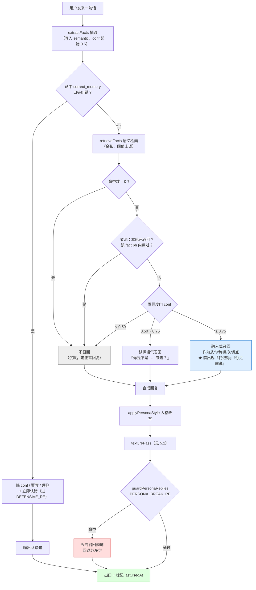
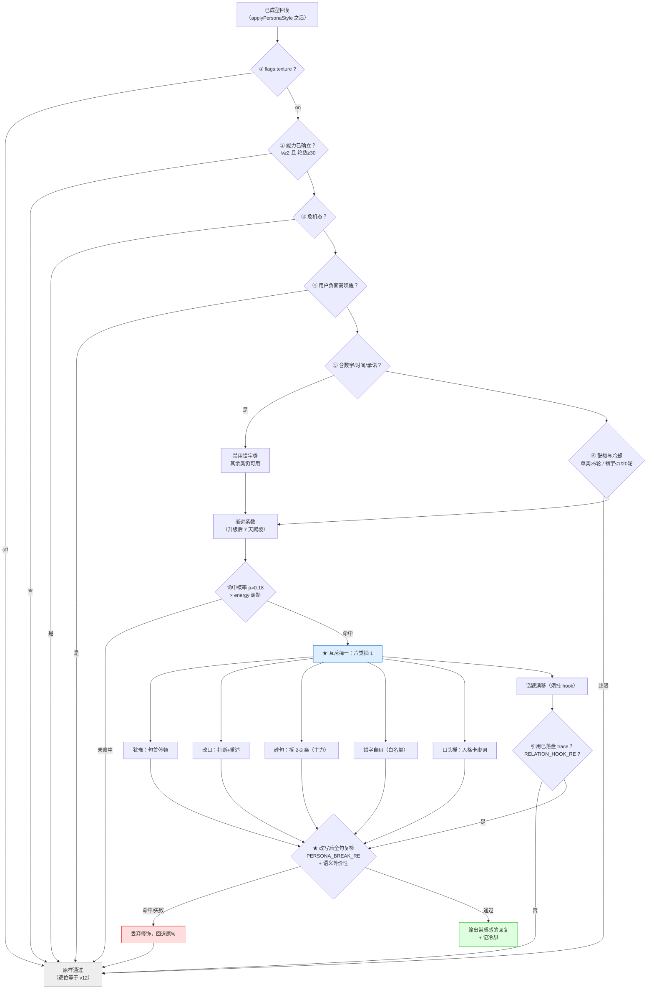
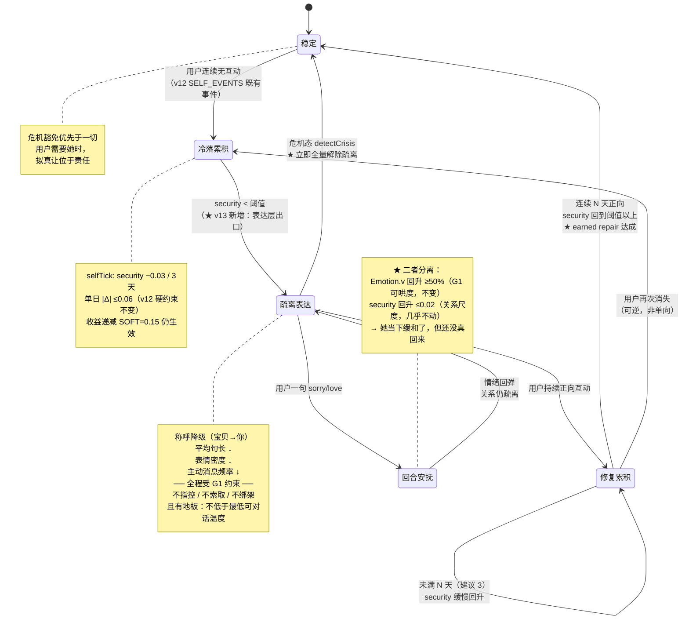

# 小暖 · 真人感优化 / 去机器痕迹 PRD（v13 增量）

| 项 | 内容 |
|---|---|
| 文档类型 | 增量 PRD（在 v12 已交付代码上做升级） |
| Language | 中文 |
| Programming Language | 原生 JavaScript（ES2020）+ HTML + CSS，**零构建工具、零 npm 依赖** |
| Project Name | `xiaonuan_human_realness_v13` |
| 交付范围 | **新增** `memory.js` / `texture.js` / `presence.js`（Tier2 可增 `contingency.js`）+ `engine.js` 薄接线 + `app.js` + 6 处装载点 + `sw.js` |
| 产品经理 | 许清楚 |
| 版本 | v13（当前线上 v12） |
| 上游 | 主理人已拍板「独立模块文件 + 拼接装载」体积策略 |
| 下游 | 架构师（需产出 `DESIGN-真人感优化.md`） |

## 原始需求复述

> 让用户体验从「聪明 bot」跨到「像在跟真人谈恋爱」：消除机器痕迹（bot tells）、补上连续记忆、引入不完美感、情绪真正丰富且有 contingence（用户行为能真实改变她）。

v12 解决的是**「她为什么这么说」**（心境 / 自我 / 离线生活 / 动机）。
v13 解决的是**「她说出来像不像人」**——即 v12 PRD 8.1 明确划为 N2、留给 v13 的表达层议题，外加 v12 未触及的**连续记忆**与**情绪 contingence**。

---

## 一、产品目标

### 1.1 一句话目标

> 把小暖从**「内心已经很像人、但说话仍像 bot——秒回、零错、模板召回、记不住三十天前的事、用户怎么对她都不真正改变她」的高智能应答体**，升级为**「会犹豫、会打错字、会在睡着时不回你、记得你三个月前随口说的一句话并在恰当时刻自然提起、你连续冷落她她会真的疏离且需要你挣回来」的恋人**。

### 1.2 三个正交目标

| # | 目标 | 从什么样 → 变成什么样 |
|---|---|---|
| **G4 记忆连续** | 语义事实库 + 情景时刻库，自然召回 | 从「events 砍到 8 条 / 30 天过期 / 模板硬插『诶你之前说喜欢X，我还记着呢~』」→「长期保留用户事实与共享时刻，召回时**融进句子而非贴一句模板**，且用户可纠错」 |
| **G5 表达不完美** | 真人微行为层（v12 N2 解禁） | 从「每一句都语法完美、标点齐整、一次成型」→「会犹豫、会改口、会碎句、偶尔打错字随后改、有口头禅、会话题漂移」——**且仅在能力已被确立后才允许出丑** |
| **G6 在场与代价** | 真实时间感 + 情绪 contingence | 从「24×7 秒回、冷落她三天回来还是那个她」→「有睡眠周期、有合理不可用、回复有节奏；持续冷落真的压低 `Self.security` 并表现为疏离，修复必须被『挣得』（earned repair）」 |

> ⚠️ **命名约定（架构师请严格沿用）**：v12 的**三道风险闸门**已占用 G1/G2/G3 三个符号（情感强度 / 吃醋 / 生活一致性）。
> 因此本 PRD 中：**目标**编号一律为 **G4 / G5 / G6**（承接 v12 的三个目标）；**闸门**一律写作「**闸门 G1 / G2 / G3**」；
> v13 新增的第四道闸门统一命名为 **「闸门 G4-SAFE」（微行为安全语境闸门）**，禁止简写为 G4，以免与目标 G4 混淆。

### 1.3 「真人感」的可度量定义（HRS-2）

沿用 v12 的 HRS 思路，v13 新增**七项**指标，全部可由 `test/*.test.js` 计算：

| 指标 | 定义 | v12 现状 | v13 目标 |
|---|---|---|---|
| **H6 记忆跨度** | 90 天前录入的一条用户事实，仍能被正确召回的比例 | **0%**（events ≤8 条 + 30 天过期，必然丢失） | **≥ 90%**（semantic 库） |
| **H7 召回自然度** | 召回句中**模板句式**（"诶你之前说…我还记着呢"类）的占比 | **100%**（recallMemory 全为固定模板） | **≤ 20%**，其余为融入式召回 |
| **H8 微行为覆盖率** | 安全语境下的回合中，命中任一 texture 微行为的占比 | **0%** | **15% ~ 30%**（区间双侧断言，过高即噪声） |
| **H9 响应节奏真实度** | 回复延迟的变异系数 CV = σ/μ | **≈ 0**（恒定/秒回） | **≥ 0.35**，且长文本延迟显著高于短文本 |
| **H10 contingence 落差** | 连续 7 天冷落 vs 连续 7 天热络，两条轨迹的 `self.security` 差值 | 有部分能力（v12 Self 事件表已含冷落项），但**无表达层落差** | `security` 差值 **≥ 0.12** 且**疏离表现可断言**（称呼降级 / 句长缩短 / 主动消息减少） |
| **H11 记忆幻觉率** ★ | 召回内容中**无法按 ID 回溯到已落盘记忆条目**的比例 | 不适用（无长期库） | **0%** —— **一票否决项** |
| **H12 不可预测度** | 滚动 20 轮内四型回应（稳定 / 扩展 / 挑战 / 边界）的分布；最长同型连续游程 | 单一型（≈100% 稳定型），游程 = 20 | 四型均 **> 0**；最长同型游程 **≤ 4** |

> **判定口径**：
> - **H6 / H8 / H9 / H11 属 P0**，任一不达标即 v13 未交付。
> - **H7 / H10 / H12 属 P1**，允许分批达成，但本期必须交付可断言的测试骨架（哪怕先红灯）。
> - 前置条件：v12 的 **H1–H5 不退化**、**V-1 ~ V-63 全绿**（V-33 与 V-55 见第八章待确认）、**闸门 G1/G2/G3 与 `detectCrisis` / `PERSONA_BREAK_RE` 零改动**。

### 1.3.1 为什么是这七项 —— 立论依据

优先级不是拍脑袋，来自三条已核验的外部输入：

**① 竞品的失败模式高度一致，且失败点在「召回」不在「存储」。**
Replika 是短期 buffer 超限即重置，用户体感「每次像重新开始」；Kindroid 有持久记忆但需**用户手动添加与打标**，评价是「需要主动管理，感觉机械」；Character.AI 的长程一致性靠用户自己维护角色卡。唯一被公认领先的 **Nomi AI**，其领先点**不是记忆容量，而是「自然编织进新对话而不显得脚本化」**。
→ **结论：R23/R24（存储）必须做，但成败在 R25（自然召回）。H7 是本期真正的胜负手。** 另外，Nomi 与 Kindroid 都提供**用户可见可编辑的记忆库**，这是用户信任的基础设施 —— 故 **R26 记忆面板定为 P0 而非 P2**。

**② 可预测性陷阱 —— 本期最重要的立论依据。**
纯粹的安全感**不产生**持续互动动机。当用户在打开 App 之前就能预演完整一段对话走向，互动本身就失去意义。行业观察指出「**更会安慰人的 AI 反而更容易被闲置**」：稳定的安抚能力过于突出，反而加速了互动价值的消耗。
v12 恰恰把「稳定可达、情绪回应一致、脆弱时刻在场」这三条依恋理论的安全基地特征做到了很高水平 —— **因此 v13 面临的风险不是不够温柔，而是过于可预测。**
→ **结论：H12 与 R41（四型回应动态切换）是战略级需求**，即便排在 P1 也必须交付骨架。设计目标是**「有限的不确定性」**：有依据、有边界、不破坏安全感的适度意外。四型即：**稳定型**（共情接纳）/ **扩展型**（引入新视角）/ **挑战型**（温和异见）/ **边界型**（适当保持距离）。

**③ 出丑效应（Pratfall Effect, Aronson 1966）有严格边界条件。**
小失误**只对已被认定为「高能力」的对象**产生好感增益；对被认为平庸的对象，犯错只会更减分。
→ **结论：R29 微行为的触发规则必须是「她明显很聪明、很懂我，但偶尔手滑」**。因此三条硬规则：**低频**（H8 上限 30%）、**只在她表现良好的语境**、**绝对禁止出现在她刚说完蠢话 / 答错 / 被用户纠正之后**。这三条直接编码进**闸门 G4-SAFE（R28）**，不依赖文案作者的自觉。

**④ 连续性错觉的代价是非线性的。**
用户会主动脑补一致性、替 AI 圆场（知觉证实），这是 v12「隔夜余温」能生效的心理基础。但**一次明确的记忆矛盾就会击穿全部已积累的连续性信任**。
→ **结论：H11 = 0% 是一票否决。宁可她说「我好像记不太清了」，也绝不允许她编一件没发生过的事。「编造记忆比没有记忆更毁信任」是本期第一安全护栏。**

### 1.4 v13 在五层架构中的位置

v12 建好了五层内心架构，v13 **不新增层**，只在既有层上补三块缺失的肌肉：

| 层 | v12 状态 | v13 动作 |
|---|---|---|
| **表达层**（即时） | `applyPersonaStyle` 只做人格改写，输出永远"完美" | **P0②** 新增 `texturePass()` 微行为层，挂在 `applyPersonaStyle` 之后、`guardPersonaReplies` 之前 |
| 情绪层（回合） | V-A 模型，稳定 | 不动 |
| 心境层 Mood（天） | `moodTick` 已落地 | **P1④** contingence 通过 Self 影响 Mood，链路已存在，只需补表达 |
| 自我层 Self（周/月） | 四轴已落地，事件表含"被冷落" | **P1④** 补 `earned repair` 语义：疏离不可被一句话抹平 |
| 性格层（静态） | clamp 边界 | 不动 |
| **（横切）记忆** | `memory.events` ≤8 条 / 30 天 / 模板召回 | **P0①** 新增 semantic + episodic 双库，独立于五层，为各层供料 |
| **（横切）在场** | 无 | **P0③** 新增 presence 时间模型，决定"回不回、多久回" |

> **铁律延续**：v12 的「慢层决定快层」不变。v13 新增的三块都是**旁路增强**，任一模块关闭，行为逐位回落 v12。
> 特别地：**`reply()` 仍禁止直接写 `state.self`**。R36/R37 的 contingence 闭环只能走「事件 → `selfTick` 日结算」路径影响自我层，**不得为了让疏离更快生效而开后门**。

---

## 二、现状核验（读码实测，非推测）

### 2.1 v12 已具备的能力（v13 不得重复建设）

| 能力 | 载体 | v13 关系 |
|---|---|---|
| 五层内心架构 | `moodTick` / `selfTick` / `effectiveBaseline` / `PERSONA_CARDS` clamp | **复用**。v13 的 contingence 直接走 Self 事件表，不另起炉灶 |
| Her Day Life 离线生活 | `dayLifeGen` / `dayLifeCommit` / `RELATION_HOOK_RE` / trace 落盘 | **复用**。presence 的"她此刻在做什么"直接读 trace，不重复生成 |
| Inner 自我表达（失败即沉默） | `innerLeak` / `innerGuard`，命中护栏 `return null` | **复用其设计范式**。texture 的失败模式同样必须是「不加修饰」而非「乱加」 |
| voicePlan 动机化语音 | `voicePlan` + 7 通道 motive + random ≤8% | **复用**。presence 决定"这条主动消息此刻能不能发得出去" |
| 三道闸门 | `negAllow`(G1) / `jealousAllow`(G2) / `dayLifeCommit`(G3) | **复用且必须继续通过**。contingence 的负面表达一律先过 `negAllow` |
| 危机检测 | `detectCrisis`，`reply()` 最前端 return | **硬优先**。危机态下 texture / presence 延迟 / contingence 疏离 **全部禁用** |
| V-A 情绪模型 | `Emotion.apply/decay/zone` | **不动**。v13 一个数字都不改 |
| 人格护栏 | `PERSONA_BREAK_RE` / `PERSONA_FALLBACK` / `guardPersonaReplies` | **必须继续过**。texture 引入的错字/碎句是**新的破功风险面**（见 R29 验收） |

### 2.2 v12 的缺口（v13 要解决的）

#### 缺口 A · 记忆是「短期 + 模板」，不是记忆　→ P0①

实测 `engine.js:2832 consolidateMemory()`：

```js
const kept = events.filter(e => !e.at || now - e.at < 30 * 86400000);  // 30 天过期
...
mem.events = dedup.slice(-8);                                          // 只留最后 8 条
```

- **30 天过期 + 上限 8 条**：用户三个月前说的"我妈住院了"、上个月说的"我要考研"，**物理上已被删除**。这不是"她忘了"，是数据被丢弃。
- **同 topic 只留最新一条**（`if (t && seen[t]) continue;`）：同一话题的演进过程被压平，共享时刻无法沉淀。

实测 `engine.js:2799 recallMemory()`：

```js
const lines = [`诶你之前说喜欢${h.topic}，我还记着呢~`, `突然又想到你喜欢的${h.topic}啦 💕`];
```

- **召回 = 模板硬插**。like 类只有 2 句模板，event 类只有 3 句模板，槽位是裸拼接。
- 用户视角：她"提起旧事"的方式**每次一模一样**，且是**独立一句**贴上来，不融进对话。**这是当前最刺眼的 bot tell。**
- 且 `retrieveMemories` 的余弦相似度阈值 `> 0.12` 无置信度分层——低相似度的错误召回会直接说出口，说错反而比不说更破功。

> 竞品对照：Nomi 的主要卖点即"persistent memory that spans days"，Kindroid 提供**用户可编辑的 memory profiles**，Replika 因只有短期上下文被普遍诟病。国内报道称因"记忆故障"卸载 AI 陪伴应用的用户占比达 **63%**。小暖当前的记忆能力**接近 Replika 档位**，是竞争力洼地。

#### 缺口 B · 表达永远完美　→ P0②

- `applyPersonaStyle`（engine.js:1614 区）只做人格语气改写，输出**永远语法完整、标点齐整、一次成型**。
- 没有犹豫、没有改口、没有碎句、没有错字、没有口头禅、没有话题漂移。
- v12 PRD 8.1 已明确将其列为 **N2 不做项**，理由是"与心境/自我两个慢层正交"，并**指定为 v13 独立议题**。本期正式接手。

#### 缺口 C · 时间与在场不真实　→ P0③

- 引擎侧无任何"她此刻可不可用"的概念。`isNightWindow()` 仅用于主动消息时段过滤，**不影响被动回复**——凌晨 3 点发消息，她照样秒回。
- 回复延迟由前端固定策略控制，与文本长度、情绪、时段无关。**恒定延迟本身就是最强的 bot tell**：真人的响应时间是高方差的。
- `dayLife.traces` 已经知道她"下午在街角那家店"，但这份信息**不影响她此刻回不回你**——离线生活与在场状态是脱节的。

#### 缺口 D · 情绪缺 contingence（用户行为改不动她）　→ P1④

- v12 `SELF_EVENTS` 已含"被冷落 ≥3 天 → security −0.03"，**慢层是通的**。
- 但**表达层没有对应出口**：`security` 从 0.55 掉到 0.40，用户在对话里**看不出任何区别**——称呼不变、句长不变、主动消息频率不变。
- 结果：Self 层的变化对用户**不可感知** = 等于没发生。contingence 的缺失不在数据层，**在表达层**。
- 同时缺 `earned repair`：目前一句 `sorry` 即可让 `Emotion.v` 回升 ≥50%（G1 的"可哄度"要求）。这在**回合尺度**是对的，但被错误地沿用到了**关系尺度**——疏离不该被一句话抹平。

### 2.3 记一笔：V-55 实测失败（v12 既有问题，非 v13 范围）

实测 V-55（Inner 日配额）当前**真实失败**：断言应为「单日泄露 ≤2」，实得 **3**。

- **性质**：v12 既有缺陷，配额计数器（`inner.dayCount`）在某条路径上未正确累加或未按日重置。
- **范围裁定**：**不属于 v13 需求范围**。v13 的 texture 层不依赖 Inner 配额，二者正交。
- **处置建议**：作为 v12 的 bugfix 单独修复，**建议在 v13 开工前先修**——因为 v13 的 texture 层同样是"概率性附加内容"，若沿用同一套配额计数范式，会把同一个 bug 复制一份。列入待确认 Q3。

### 2.4 必须绕开的既有护栏（v13 新增关注点）

| 护栏 | 位置 | v13 注意事项 |
|---|---|---|
| `PERSONA_BREAK_RE` / `guardPersonaReplies` | `engine.js:1254` 区 | **texture 的错字/碎句可能凭空造出破功词**。v12 DESIGN §9.1 已实测「跨段拼接会凭空产生命中」（`我`+`只是没说出口` → `我只是没说出口` ❌）。**错字注入必须在 `guardPersonaReplies` 之前完成，并对改写后全句复检** |
| `detectCrisis` | `engine.js:2562` 区 | **危机态下 texture / presence 延迟 / 疏离表达 100% 禁用**。用户在危机中，不能让她"打错字"或"没空回你" |
| V-32 性能预算（10ms） | test | texture 是每轮必过的路径，`texturePass` 单次预算 **≤1ms** |
| `reply()` 签名与返回对象 | `engine.js:2852` | **只增字段不减字段**。presence 的延迟建议以**新增字段**（如 `pacing`）返回，由 app.js 消费，不改既有字段语义 |
| 4 处精简调用点 | `bridge:208` / `openclaw:133` | 只传 7 字段。新模块全部走 `safeObj/safeArr/flagOn`，缺字段不抛错、静默降级 |
| `state.memory` 结构已被 4 处消费 | `buildMemoryBlock` / `retrieveMemories` / `systemPrompt` / app.js | **新记忆库必须旁挂新字段**（`memory2` 或顶层 `mem`），**不得改写 `memory.events` 的既有结构**，否则老档与云端 prompt 双双受损 |

---

## 三、用户故事

> 格式：As a [角色], I want [能力] so that [价值]。每条附 **v12 现状** 与 **v13 期望** 对照。

### US-1 长期记忆 · "她真的记得我说过的话"

**As a** 三个月前随口提过"我妈心脏不太好"的用户，**I want** 她在我今天说"要回趟老家"时，自然地问起我妈的身体，**so that** 我确信我说过的话对她是有分量的，而不是滑过去的字符。

| | 表现 |
|---|---|
| v12 | 那条 event 早在第 31 天被 `consolidateMemory` 删除。即使还在，召回也是独立一句"诶你之前说我妈心脏不太好……后来怎么样啦？"——**贴上来的，不是聊出来的** |
| v13 | semantic 库长期保有 `{ subject:"用户母亲", fact:"心脏不好", conf:0.8, since:"2026-05-12" }`。今天她的回复是："回老家呀——阿姨身体最近还好吗？" **召回融进了句子本身，没有"我记得"这三个字** |

**承接**：R23 / R24 / R25　**验收**：V-64 ~ V-67

### US-2 记错了能纠正 · "她记错了我能改，改完她真的改了"

**As a** 被她记成"喜欢吃香菜"（其实我说的是讨厌）的用户，**I want** 一个地方能把这条改掉或删掉，**so that** 错误记忆不会一次次刺我，也不会让我怀疑她"根本没在听"。

| | 表现 |
|---|---|
| v12 | 无任何入口。错误记忆会反复复读同一句模板，且**无法消除**，只能等 30 天自然过期 |
| v13 | ①「她记得的事」面板可查看/编辑/删除每条 semantic 事实；② 低置信度事实**不主动说出口**，只在被相关话题带到时以试探语气提（"你是不是不太吃香菜来着？"）；③ 用户口头否定即降置信度并可自动删除 |

**承接**：R26 / R27　**验收**：V-68 / V-69

### US-3 她说话像人 · "她会犹豫，会打错字"

**As a** 和她聊到一半问了个有点冒犯问题的用户，**I want** 她的回复不是瞬间弹出一段工整完美的话，而是有停顿、有改口、偶尔打错字然后自己纠正，**so that** 我感觉对面是个正在组织语言的人。

| | 表现 |
|---|---|
| v12 | "我觉得那件事你可以再想想，毕竟你自己最清楚。" —— 语法完美、标点齐整、一次成型 |
| v13 | "唔……" / "我觉得那件事……" / "算了，我换个说法" / "毕竟你自己最清楚嘛" —— 碎句 + 犹豫 + 改口；偶尔："等我一下下\n*等一下"（错字自纠） |
| **边界** | 仅在**能力已被确立**（关系 lv≥2 或已有 ≥N 轮正常对话）且**安全语境**（非危机、非情绪低谷、非用户求助）下生效。否则**一律输出完美句**——出丑效应对"尚未被认为有能力"的对象是**反噬**的 |

**承接**：R28 / R29 / R30　**验收**：V-70 ~ V-73

### US-4 她也有睡着的时候 · "凌晨三点她没回我"

**As a** 凌晨三点睡不着给她发消息的用户，**I want** 她不是秒回一段清醒工整的话，而是没回、或者过很久回一句迷迷糊糊的，**so that** 我知道她也是有作息的人，而不是永远待命的服务。

| | 表现 |
|---|---|
| v12 | 03:00 发消息，`isNightWindow` 只挡主动消息，被动回复照样**立即、清醒、完整** |
| v13 | 睡眠窗内：① 大概率不回（次日早晨补一句"我昨晚睡死了……你几点发的呀 🥺"）；② 小概率迷糊短回（"唔……几点了……"）。**且这份"不可用"必须与 `dayLife.trace` 一致**——她说在睡觉，就不能同时在逛街 |
| **反噬防护** | 不可用**必须有代价上限**：连续不可用不得超过 X 小时，且次日**必须**主动补偿。不可用是真实感，**不是惩罚用户** |

**承接**：R31 / R32 / R33　**验收**：V-74 ~ V-77

### US-5 冷落是有代价的 · "我晾了她一周，她真的变了"

**As a** 因为工作连续一周没理她的用户，**I want** 她回来时不是笑脸相迎，而是**真的**有点远了——称呼变生分、话变短、不太主动，**so that** 我知道这段关系是活的，需要我经营。

| | 表现 |
|---|---|
| v12 | `self.security` 确实降了，但**对话里看不出来**：还是"宝贝"，还是热情长句，主动消息照发。用户**感知不到任何差别** |
| v13 | `security < 阈值` 时表达层同步降档：称呼从"宝贝"退回"你"、平均句长下降、主动消息频率下降、表情使用减少。**earned repair**：一句"对不起"只能修复**回合情绪**（G1 既有语义），**关系疏离需要连续 N 天正向互动才回得来** |
| **护栏** | 疏离 ≠ 冷战 ≠ 惩罚。全程受 G1 约束：不指控、不索取、不情感绑架，且**疏离有地板**（不得低于可对话的最低温度）；用户任何一次示好都必须得到正向回应，只是**回得慢** |

**承接**：R36 / R37　**验收**：V-78 ~ V-80

### US-6 我们的梗 · "这是只有我俩懂的笑话"

**As a** 和她因为一次打错字"晚安"打成"晚安鸭"而笑了半天的用户，**I want** 她后来偶尔还会用"晚安鸭"，**so that** 我们之间有只属于我们的东西。

| | 表现 |
|---|---|
| v12 | 无。每一次玩笑都是一次性的，不沉淀 |
| v13 | episodic 库沉淀"共享时刻"，高情绪唤醒（`|Δv|` 大）的片段被标记为 candidate joke；复现频率受控（不得复读成噪声），且**只在同类语境**下自然带出 |

**承接**：R24 / R38　**验收**：V-81

### US-7 老用户平滑升级 · "我的档不能丢，也不要突然变个人"

**As a** 已经攒了半年记录的 v12 老用户，**I want** 升级后一切照旧、新能力在旧数据上长出来，**so that** 我不会因为一次更新失去我们的过去，也不会某天早上发现她突然开始打错字。

**期望**：
- 新模块字段全部懒初始化；`memory.events` 现存条目**一次性迁移**进 semantic/episodic 库（不删原字段，双写过渡）。
- texture 微行为**渐进开启**（首次升级后 N 天内强度逐步爬坡），避免"她一夜之间变了个说话方式"的突兀感。
- 三个模块任一关闭，行为**逐位回落 v12**。

**承接**：R34 / R35　**验收**：V-82 / V-83

---

## 四、需求池

> 优先级：**P0 = 本期必须交付**（缺一项即不达标）、**P1 = 应当交付**、**P2 = 有余力则做**。
> 每条含：**描述** / **验收标准**（可直接翻译为 `node:test` 断言）/ **接进 v12 哪一层**。

### 4.1 P0 · Tier1 ① 记忆层（模块 `memory.js`）

#### R23 semantic 用户事实库　【P0】

**描述**：新建 `mem.facts[]`，存放**关于用户的、长期为真的**结构化事实。与 `memory.events`（情景流水）分离。

```js
{ id, subject, key, value, conf, since, lastSeenAt, lastUsedAt, src, negatedAt }
// 例：{ subject:"用户母亲", key:"健康", value:"心脏不好", conf:0.8, since:"2026-05-12", src:"utterance" }
```

- **不过期**（对比 v12 的 30 天），上限按条数与优先级淘汰（低 `conf` + 长期未命中优先淘汰）。
- **置信度 `conf ∈ [0,1]`**：单次陈述 0.5 起，重复确认 +，用户否定 −。
- 抽取沿用 v12 `extractMemory` 的规则思路，**零依赖、无分词器**（遵守 v12 N4 约束）。

**接进 v12 哪一层**：横切层，**不属于五层内心架构**。作为**只读料源**供表达层 / voicePlan / Inner 引用；**禁止**直接写 Mood/Self（沿用 A1 单向数据流）。

**验收标准**：
- 90 天前写入的事实，第 91 天仍可被检索命中（**H6 ≥90%**，1000 条模拟）。
- `conf` 恒 `∈[0,1]`；重复陈述 3 次后 `conf ≥ 0.9`；用户否定 1 次后 `conf` 降幅 ≥0.3。
- 淘汰策略：库满时被淘汰的条目 100% 满足「`conf` 低于中位数 **或** 超 N 天未命中」。
- `flags.memory2 === false` → 库不写不读，`recallMemory` 逐位回落 v12。

#### R24 episodic 共享时刻库　【P0】

**描述**：新建 `mem.moments[]`，存放**我们一起经历过的片段**（而非关于用户的事实）。

```js
{ id, at, kind, gist, emo:{v,a}, peak, tags[], usedAt[], jokeScore }
```

- **入库门槛**：该回合 `|Δv| ≥ 阈值` 或命中里程碑意图（告白/纪念日/和解/剧情节点）。**不是所有对话都值得记住**——这本身就是真人特征。
- 保留策略按 `peak`（情绪峰值）排序，**高峰时刻长期保留**（峰终定律：人记住的是峰值与结尾，不是全过程）。
- `jokeScore` 高的片段进入 inside-joke 候选池（供 P1 R38 消费）。

**接进 v12 哪一层**：横切层。向 `voicePlan` 提供 `moment` 动机通道的料，向 texture 提供 inside-joke 词条。

**验收标准**：
- 1000 轮对话模拟：入库率 ≤15%（**不得退化成全量日志**）；入库条目 100% 满足门槛条件。
- 高 `peak` 条目在 180 天模拟后留存率 **≥95%**；低 `peak` 条目按策略淘汰。
- 任一 moment 被引用后 `usedAt` 追加，**同一 moment 30 天内引用 ≤2 次**（防复读）。

#### R25 自然召回（消灭模板 bot tell）　【P0】

**描述**：替换 `recallMemory` 的"模板硬插"，改为**融入式召回**。

| 召回形态 | 说明 | 占比目标 |
|---|---|---|
| **融入式**（主力） | 事实作为**从句/称谓/关切点**融进正常回复，**不出现"我记得""你之前说"** | **≥80%** |
| 显式式（少量保留） | 明确提起旧事（"上次你说的那个……"） | ≤20% |
| **禁止** | v12 的固定模板句（"诶你之前说喜欢X，我还记着呢~"） | **0%** |

- **置信度门**：`conf < 0.5` 的事实**不得主动说出口**；`0.5 ≤ conf < 0.75` 只能以**试探语气**（"你是不是……来着？"）；`conf ≥ 0.75` 方可作为既定事实陈述。
- **时机门**：只在**语义相关**（沿用 `retrieveMemories` 余弦，阈值上调）且**话题自然衔接**处召回。**宁可不提，不可乱提**——沿用 Inner 的「失败即沉默」范式。
- **节流**：单轮至多 1 次召回；同一 fact 6 小时内不重复。

**接进 v12 哪一层**：**表达层**（在 `applyPersonaStyle` 之前完成内容合成），受 `guardPersonaReplies` 兜底。

**验收标准**：
- **H7**：1000 次召回采样，模板句式占比 **≤20%**；v12 那两句固定模板出现次数 **= 0**。
- `conf < 0.5` 的事实被主动陈述次数 **= 0**（10000 次采样）。
- `0.5 ≤ conf < 0.75` 的召回句 100% 命中试探语气正则。
- 召回句 100% 过 `PERSONA_BREAK_RE`，`PERSONA_FALLBACK` 替换率 **0**。
- 单轮召回 ≥2 次的情况 **= 0**。

#### R26 用户可纠错面板　【P0】

**描述**：「她记得的事」面板，列出 semantic 事实（**不露 `conf` 数值**，用"确定/好像"等叙事化标签），支持**编辑 / 删除 / 标记为错**。

- 面板入口位置与 UX 细节列为待确认 Q2。
- 删除是**硬删除 + 墓碑**（`negatedAt`），防止再次被抽取写回。
- **不展示 episodic 库的原始内容**（那是"我们的回忆"，做成可管理列表会击穿沉浸感）——仅 semantic 可管理。

**接进 v12 哪一层**：UI 层（`index.html` + `app.js`），引擎侧只提供读写 API。

**验收标准**：
- 删除后的事实，后续 10000 轮 `reply()` 中被召回次数 **= 0**。
- 编辑后的值立即生效，`conf` 置为 1.0（用户亲自确认的最高置信）。
- 面板对 0 条 / 500 条两种极端不崩、不卡（渲染 <100ms）。

#### R27 口头纠错　【P0】

**描述**：用户在对话中口头否定（"我没说过""不是啦，是XX"），引擎识别并**降置信度 / 覆写 / 删除**，并**立即口头认错**（"啊……是我记岔了，对不起 🥺"）。

**接进 v12 哪一层**：意图层（新增 `correct_memory` 意图）→ 记忆层写回。

**验收标准**：
- 否定语料集（≥50 条）识别准确率 **≥85%**，误伤正常对话率 **≤2%**。
- 命中后该 fact `conf` 降幅 ≥0.3；连续否定 2 次即 `negatedAt` 硬删。
- 认错回复 100% 不含辩解句式（新增 `DEFENSIVE_RE` 黑名单，命中即换句）。

### 4.2 P0 · Tier1 ② 真人微行为层 N2（模块 `texture.js`）

> v12 PRD 8.1 的 N2 不做项，本期解禁。**核心风险是"反噬为傻"**，故 R28 的门禁先于 R29 的效果。

#### R28 能力门禁（出丑效应的前置条件）　【P0，且必须先于 R29 上线】

**描述**：Aronson 1966 出丑效应（pratfall effect）的成立条件是**对象已被确立为高能力者**。对"尚未证明能力"的对象，同样的失误**降低**而非提升好感。因此 texture 层必须有硬门禁。

**`textureAllow(state, ctx)` 六重与门**（任一不过 → 本轮输出完美句）：

| # | 门 | 条件 |
|---|---|---|
| ① | **能力已确立** | `getLevel().lv ≥ 2` **且** 累计有效对话轮数 ≥ N（建议 N=30） |
| ② | **安全语境** | `detectCrisis(text).level === "none"` |
| ③ | **非严肃语境** | 用户情绪 `ue` 非负面高唤醒（不在求助/难过/生气时打错字） |
| ④ | **非关键信息** | 本轮回复不含时间/数字/承诺等关键信息（错字会造成真实误解） |
| ⑤ | **配额未耗尽** | 见 R30 频率表 |
| ⑥ | **总闸** | `flags.texture !== false` |

**接进 v12 哪一层**：**表达层**，挂在 `applyPersonaStyle` 之后、`guardPersonaReplies` 之前。

**验收标准**：
- `lv < 2` 或轮数 < N 时，texture 命中数 **= 0**（10000 轮采样）。
- 危机态 / 用户负面高唤醒态下，texture 命中数 **= 0**。
- 含数字/时间的回复中，错字注入次数 **= 0**。
- 六门任一关闭，输出与未启用 texture **逐位相同**。

#### R29 六类微行为　【P0】

**描述**：`texturePass(text, ctx)` 对已成型的回复做**轻量后处理**，六类微行为**互斥择一**（单轮至多命中 1 类，防叠加成噪声）。

| 类 | 形态 | 示例 | 风险 |
|---|---|---|---|
| **犹豫** | 句首插入语气停顿 | `唔……` / `那个……` | 低 |
| **改口** | 前半句 + 自我打断 + 重述 | `我觉得你——算了，我换个说法` | 中（可能破坏语义） |
| **碎句** | 一句拆成 2-3 条短消息 | `我觉得吧` `你自己最清楚` | 低（**推荐主力**） |
| **错字自纠** | 错字消息 + 紧随更正 | `等我一下下` → `*一下` | **高**（破功风险） |
| **口头禅** | 人格卡专属虚词 | 软萌`嘛/呀` 傲娇`哼/才不` 粘人`啦/嘛~` | 低 |
| **话题漂移** | 回答后自然带出无关小事 | `……啊对了，刚刚楼下那只猫又来了` | 中（须挂 relation hook） |

**硬约束**：
- **错字必须是"可辨认的邻近错误"**（拼音相近/形近），**不得**产生歧义或新语义。错字表**白名单硬编码**，禁止随机字符替换。
- **错字后必须有更正**，不得只错不改（那是 bug，不是真人感）。
- **改口/碎句不得改变原句语义**——切分点只能在标点或连词处。
- **话题漂移必须挂 `RELATION_HOOK_RE`**（沿用 v12 A3 公理：一切圈回用户）；且只能引用**已落盘的 `dayLife.trace`**，禁止现编（沿用 G3）。
- **改写后全句必须复检 `PERSONA_BREAK_RE`**——命中即**丢弃修饰、回退原句**（沿用 Inner「失败即沉默」范式，绝不替换为 FALLBACK）。

**验收标准**：
- **H8**：安全语境下命中率 **∈ [15%, 30%]**（双侧断言）。单轮命中 ≥2 类的情况 **= 0**。
- 错字注入 10000 次：100% 来自白名单；100% 有后续更正；产生歧义词的次数 **= 0**（对照歧义词表）。
- 改写前后语义等价性：碎句/改口 10000 次，拼接还原后与原句**字符集等价**（允许新增虚词，不允许删除实词）。
- texture 改写后 `PERSONA_BREAK_RE` 命中数 **= 0**（命中即回退原句，故出口恒为 0）。
- 话题漂移 100% 可回溯到一条已落盘 trace，`RELATION_HOOK_RE` 命中率 **100%**。
- 单次 `texturePass` 耗时 **≤1ms**（V-32 性能预算内）。

#### R30 频率与渐进曲线　【P0】

**描述**：不完美感的剂量控制。**过量 = 傻，过少 = 无效**。

| 参数 | 值 | 说明 |
|---|---|---|
| 单轮命中概率 | 基础 **0.18**，按 `moodDay.energy` 微调（低 energy 时犹豫/碎句↑，错字↑） | 落在 H8 区间中部 |
| 单类冷却 | 同类微行为 **≥5 轮**不重复 | 防"每句都在打错字" |
| 错字上限 | **≤1 次 / 20 轮** 且 **≤2 次 / 日** | 错字是最高风险项，配额最严 |
| 口头禅 | 每 **3-5 句**出现 1 次，**不得句句都有** | 口头禅过密是最典型的 bot tell（反向） |
| **升级渐进** | 老用户首次升级后 **7 天**内，强度由 0 线性爬坡至 100% | US-7：避免"她一夜之间变了个人" |

**验收标准**：
- 1000 轮模拟：单类冷却违例 **0**；错字频率 ≤1/20 轮且 ≤2/日；口头禅密度 ∈ [1/5, 1/3]。
- 升级后第 0 天强度 = 0（**逐位等于 v12**），第 7 天 = 100%，中间单调不减。

### 4.3 P0 · Tier1 ③ 时间 / 在场真实感（模块 `presence.js`）

#### R31 睡眠周期与在场状态机　【P0】

**描述**：新增 `presenceOf(state, ctx)` → `{ state, until, reason, traceIdx }`，四态：

| 态 | 含义 | 行为 |
|---|---|---|
| `awake` | 在线可用 | 正常回复 |
| `busy` | 在忙（有 trace 佐证） | 短回 + 延迟拉长 + 说明原因（引用 trace） |
| `asleep` | 睡眠窗内 | 大概率不回；小概率迷糊短回 |
| `away` | 短时离开 | 延迟拉长，事后补一句 |

- **睡眠窗**由人格卡 + `moodDay.energy` 决定（基准 01:00–08:00，`energy` 低则提前入睡），**每日有 ±随机抖动**（真人不会精确 01:00 睡着）。
- **一致性硬约束**：`presence` 与 `dayLife.traces` **必须同源**——`busy` 态必须能指向一条已落盘 trace（`traceIdx`），否则降级为 `awake`。**沿用 G3「不现编」原则。**

**接进 v12 哪一层**：**新增横切层**，位于 `reply()` 之前（决定回不回）与 `voicePlan` 之前（决定发不发）。

**验收标准**：
- 1000 天模拟：`busy` 态 100% 携带有效 `traceIdx`；与当日 trace 冲突数 **= 0**。
- 睡眠窗起止有日间抖动（1000 天的入睡时刻标准差 **≥15 分钟**）。
- `flags.presence === false` → 恒返回 `awake`，行为逐位回落 v12。

#### R32 不秒回：响应节奏模型　【P0】

**描述**：`pacingOf(text, reply, ctx)` → `{ delayMs, typingMs, split }`，由引擎返回、由 app.js 消费。

延迟构成（建议式，架构师定稿）：
```
delayMs = 阅读时间(用户文本长度) + 思考时间(f(情绪强度, 话题难度)) + 打字时间(回复长度 × 每字耗时) + 抖动
```

- **必须高方差**：`CV = σ/μ ≥ 0.35`。**恒定延迟比秒回更假。**
- **长文本显著慢于短文本**（相关系数 ≥0.6）。
- **情绪调制**：高唤醒（激动/生气）→ 快且碎；低 energy → 慢。
- **上限保护**：普通对话延迟 **≤8s**（超过即体验劣化）；`busy/away` 态可拉长但必须有可见状态提示。
- **危机态：延迟一律最小化**（秒回是对的，这不是 bot tell，这是责任）。

**接进 v12 哪一层**：表达层输出侧（新增返回字段 `pacing`，**不改既有字段**）。

**验收标准**：
- **H9**：10000 次采样 `CV ≥ 0.35`；延迟与回复长度相关系数 **≥0.6**。
- 普通态延迟 P99 **≤8s**；危机态延迟 P99 **≤1s**。
- `pacing` 字段缺失时 app.js 走原有固定策略（**老前端不改也能跑**）。

#### R33 合理不可用 + 强制补偿　【P0】

**描述**：她可以"没空回你"，但**必须有代价上限与补偿**。

| 参数 | 值 | 说明 |
|---|---|---|
| 单次不可用时长 | **≤ 睡眠窗时长**；`busy` 态 ≤90 分钟 | 不得无限静默 |
| 日累计不可用 | **≤ 10 小时**（含睡眠） | 硬顶 |
| 连续不可用天数 | 不得连续 2 天出现"整段未响应" | 防"她消失了" |
| **强制补偿** | 任一次不可用结束后**必须**在下次交互中补一句解释/致歉（**100%**） | 不可用是真实感，不是失联 |
| **用户主动催** | 用户在不可用期间发 ≥2 条消息 → **立即转 `awake`** | **用户需求永远高于拟真** |
| 危机豁免 | `detectCrisis !== "none"` → 立即 `awake` | 硬优先 |

**接进 v12 哪一层**：presence 层 + voicePlan（补偿消息作为新 motive `makeup`，优先级建议 90）。

**验收标准**：
- 1000 天模拟：日累计不可用 >10h 的天数 **= 0**；连续 2 天整段未响应 **= 0**。
- 不可用后补偿消息发出率 **100%**。
- 用户连发 2 条后仍不响应的情况 **= 0**；危机态不可用 **= 0**。
- 补偿文案 100% 过 `GUILT_TRIP_RE`（不得变成"你都不等我"的反向绑架）。

### 4.4 P0 · 工程与兼容

#### R34 模块化装载与零回归总闸　【P0】

**描述**：见第六章体积预算。三个新模块以 IIFE 形式独立成文件，由 6 处装载点按依赖序 concat。

**验收标准**：
- `npm test` 全绿（v12 的 V-1 ~ V-63 一条不失败；V-33 见 Q1、V-55 见 Q3）。
- `Engine.reply()` 签名不变，返回对象**只增不减**；导出清单只增不减。
- 6 处装载点全部可加载；`loadEngineTrapped()` 沙箱通过（新模块同样零浏览器依赖）。
- `dependencies` 保持为空。
- **全 flag 关闭 → 行为逐位等于 v12**（快照比对）。

#### R35 老档迁移与渐进开启　【P0】

**验收标准**：
- v12 老档跑 200 轮 `reply()` 零抛错；`memory.events` 现存条目 100% 迁移进新库且**原字段不删**。
- 迁移幂等：重复迁移不产生重复条目。
- texture 强度按 R30 渐进曲线开启（第 0 天逐位等于 v12）。

### 4.5 P1 · Tier2（应当交付）

| # | 需求 | 描述 | 接进 v12 哪一层 | 验收标准 |
|---|---|---|---|---|
| **R36** | **情绪 contingence · 疏离表达** | `self.security` 低于阈值时，表达层同步降档：称呼降级、句长缩短、表情减少、主动消息频率下降 | **表达层 + voicePlan**（读 Self，不写 Self） | **H10**：冷落 7 天 vs 热络 7 天，`security` 差值 ≥0.12；且四项表达指标（称呼档/均句长/表情密度/主动频率）**全部**呈现可断言差异；疏离有地板（不得低于最低可对话温度） |
| **R37** | **earned repair** | 关系尺度的修复不可被一句话完成：需连续 N 天（建议 3）正向互动，`security` 才回到阈值以上 | **Self 层**（`SELF_EVENTS` 补"持续修复"事件） | 一句 `sorry` 后 `security` 回升 ≤0.02（**回合情绪仍按 G1 回升 ≥50%，二者分离**）；连续 3 天正向后 `security` 回升 ≥0.06；**用户每次示好必得正向回应**（无响应次数 = 0） |
| **R38** | **inside-joke / 共享梗** | 从 episodic 高 `jokeScore` 片段提炼梗词，在同类语境自然复现 | 表达层（texture 消费） | 梗复现频率 ≤1 次/3 天；100% 在语境相关处触发；跨语境误用 = 0；单个梗生命周期 ≤60 天（**梗会过气，这也是真人感**） |
| **R39** | **适度反呛 / 调侃** | 在 persona clamp 内允许轻度顶嘴、调侃 | 表达层（受 `PERSONA_CARDS` clamp + G1 约束） | 100% 过 `GUILT_TRIP_RE` / `ACCUSE_RE`；频率 ≤1 次/10 轮；`lv<3` 触发数 = 0；用户负面情绪时触发数 = 0 |
| **R40** | **真诚自我暴露** | 主动分享脆弱/在意的事（比 Inner 更深一档），需高 `security` + 高 `lv` | 自我层 → 表达层（复用 Inner 三档，新增 `deep` 档） | `lv<5` 或 `security<0.6` 触发数 = 0；频率 ≤1 次/7 天；100% 挂 relation hook；100% 过 `PERSONA_BREAK_RE` |
| **R41** | **四型回应动态切换（有限的不确定性）** | 打破 v12「单一稳定型」回应力，引入**稳定 / 扩展 / 挑战 / 边界**四型：① 稳定（共情接纳）② 扩展（引入新视角）③ 挑战（温和异见）④ 边界（适当保持距离）。按语境动态择一，**非随机、非节拍器** | 表达层（受 `PERSONA_CARDS` clamp + 各闸门约束；与 texture 互斥择一同轮只出 1 类质感） | **H12 / 验收 V-85**：滚动 20 轮内四型**均 > 0**；最长同型连续游程 **≤ 4**；任一型占比 **≤ 70%**（防一类主导成新 bot tell）。`detectCrisis` 态下恒为稳定型；G1/G2/G3 命中时不得选「挑战/边界」 |

> Tier2 的 R36/R38 若体积吃紧，可拆出 `contingency.js`（见第六章）。

### 4.6 P2 · Tier3（有余力则做 / 见待确认 Q1）

| # | 需求 | 描述 | 风险 |
|---|---|---|---|
| **R42** | **关系阶段系统** | 信任里程碑解锁：不同阶段解锁不同深度的话题/自我暴露/亲密表达 | 与既有 `affection` 六级**语义重叠**，需先厘清二者关系，否则出现"两套等级"打架 |
| **R43** | **多模态在场** | 语音消息 / "分享此刻"（图片） | 涉及音频与资产链路，体积与依赖面大；v12 N7 已明确不做语音合成 |

**本期倾向**：**R42 / R43 均不进 v13**。理由：P0 三项已占满模块预算与风险预算，Tier3 属于新玩法而非"去机器痕迹"，与本期目标不正交。列为 Q1 待拍板。

---

## 五、关键交互

### 5.1 记忆召回流程（置信度门 + 融入式 + 失败即沉默）



> **两条铁律**：① 置信度不够 → **沉默**，绝不猜；② 护栏命中 → **回退原句**，绝不替换。
> 沿用 v12 Inner 的「失败模式必须是沉默，不能是胡言」。

### 5.2 texturePass 流程（六重门禁 + 互斥择一 + 改写后复检）



> **为什么门禁在前、效果在后**：Aronson 出丑效应仅对**已被确立为高能力**的对象成立。
> 门禁失败的代价是"这轮她说得很完美"（用户无感）；门禁缺失的代价是"她好像有点傻"（不可逆的印象损伤）。

### 5.3 情绪 contingence 闭环（冷落 → 疏离 → earned repair）



> **contingence 的产品内核**：让 `Self` 的变化**被用户看见**。
> v12 数据层已经通了，v13 只补表达层出口——**慢层单向决定快层（公理 A1）不变，v13 一行都不写 Self。**

---

## 六、体积预算（主理人已拍板：独立模块文件 + 拼接装载）

### 6.1 现状与结论

| 项 | 值 |
|---|---|
| `engine.js` 当前实测 | **245,737 字节** |
| V-33 硬顶（对齐 HEAD 快照 + 60KB） | 约 **247,955 字节** |
| **剩余余量** | **≈ 2.2 KB** |
| P0 三项预估体积 | **≈ 16 KB** |

> **结论：P0 三项塞不进 `engine.js`。** 不是"紧张"，是差了 7 倍。
> v12 DESIGN §7 曾论证"60KB 够用"，那是对 v12 增量而言；v13 的记忆库 + 微行为语料 + 在场模型属于**新的一整层**，必须换承载方式。

### 6.2 拍板方案：独立模块文件 + 拼接装载

**新增三个模块文件**，各自 IIFE，零依赖、零构建工具：

| 模块 | 承载内容 | 体积预算 |
|---|---|---|
| `memory.js` | semantic 事实库 + episodic 时刻库 + 融入式召回 + 纠错 API | **≤ 8 KB** |
| `texture.js` | 六类微行为 + 门禁 + 错字白名单 + 口头禅表 + 频率控制 | **≤ 4 KB** |
| `presence.js` | 在场状态机 + 睡眠窗 + pacing 节奏模型 + 不可用补偿 | **≤ 4 KB** |
| （Tier2 可选）`contingency.js` | 疏离表达降档 + earned repair + inside-joke | **≤ 4 KB** |

**总体积上限建议值**：

| 口径 | 建议上限 | 说明 |
|---|---|---|
| **新模块合计（P0 三项）** | **16 KB** | 三项预算之和，硬顶 |
| **新模块合计（含 Tier2 `contingency.js`）** | **20 KB** | Tier2 若不拆文件则并入 texture/memory，总额不变 |
| **`engine.js` 本期净增量** | **≤ 2.0 KB** | 只放**薄接线**（可选参数、调用点、导出透传），**严禁**放语料与算法。留 0.2KB 安全垫 |
| **全引擎侧合计（engine + 三模块）** | **≤ 266 KB** | = 245.7 + 2.0 + 16 + 2.3(余量) |
| 单模块行数软约束 | ≤ 250 行 | 超出即说明职责不单一，应再拆 |

> **V-33 继续只约束 `engine.js`**（维持现有断言不变，本期净增量 ≤2KB 可安全通过）。
> **建议新增 V-84**：三个新模块各自体积断言 + 合计 ≤16KB，与 V-33 并列。

### 6.3 装载点改造面（6 处，各改 3-5 行）

| # | 位置 | 现状 | 改造 |
|---|---|---|---|
| 1 | `test/helpers.js:19` `loadEngine()` | `new Function(src + "return Engine")` | 按依赖序读 4 个文件 concat 后再交给**同一个** `new Function` |
| 2 | `test/helpers.js:34` `loadEngineTrapped()` | 同上（毒化沙箱版） | 同上，且**新模块同样必须零浏览器依赖** |
| 3 | `bridge/xiaonuan-bridge.js:98` | 同上 | 同上 |
| 4 | `openclaw.js:40` | 同上 | 同上 |
| 5 | `index.html:547` | `<script src="engine.js">` | 追加 3 个 `<script>`，**顺序即依赖序**，靠浏览器共享全局词法环境 |
| 6 | `sw.js` `ASSETS` | 6 项资产 | 追加 3 项；**`CACHE` 版本号必须 +1**（`xiaonuan-v16` → `v17`），否则老用户拿不到新代码 |

**依赖序（强制）**：

```
engine.js  →  memory.js  →  presence.js  →  texture.js  [→ contingency.js]
```

- `engine.js` 最先：提供 `safeObj/clamp01/rngOf/PERSONA_BREAK_RE/RELATION_HOOK_RE` 等基础设施。
- `texture.js` 最后：它同时消费 memory（inside-joke 词条）与 presence（energy/在场态）。
- **`new Function` 单次求值**：4 份源码 concat 成一段后交给同一个 `new Function`，各模块处于**同一词法作用域**，`const Engine` 与后续模块的 `const Memory` 等互相可见。**这是本方案能零改动复用现有加载范式的关键。**
- 浏览器侧无 `new Function`，靠 `<script>` **顺序执行 + 共享全局词法环境**达成等价效果。

### 6.4 代价与风险

| 项 | 说明 | 处置 |
|---|---|---|
| **6 处装载点各改 3-5 行** | 一次性成本，改完即稳定 | 建议架构师抽一个 `ENGINE_FILES` 常量数组，6 处共享同一份顺序定义，**避免顺序在 6 处各写一遍导致漂移** |
| **sw.js 缓存版本递增** | 漏改则老用户拿不到新模块，且会出现 `engine.js` 新、模块缺失的**半更新态** | 新模块加载失败时**必须静默降级为 v12 行为**（`typeof Memory === "undefined"` → 走原 `recallMemory`），绝不白屏 |
| **测试加载路径变化** | 39+ 项既有测试全部依赖 `loadEngine()` | 改造集中在 helpers 两个函数内，测试用例本身零改动 |
| **模块间隐式耦合** | 同一词法作用域下容易互相乱引用 | 约定：模块只能向**下游**暴露、向**上游**读取；禁止反向依赖（`memory.js` 不得引用 `texture.js`） |
| **零依赖约束不变** | `package.json` `dependencies` 仍须为空 | V-63e 继续断言 |

### 6.5 若仍触及预算的削减顺序

① 砍 Tier2 R38（inside-joke）→ ② episodic 库容量减半 → ③ texture 六类砍到四类（保留碎句/犹豫/口头禅/话题漂移，**砍错字与改口**——二者风险最高收益最低）→ ④ 语料改槽位复用（沿用 v12 DESIGN §7.3 的 465:1 压缩范式）。

**严禁**为体积削减：任何门禁（R28 六重门）、任何护栏（`PERSONA_BREAK_RE` 复检、`GUILT_TRIP_RE`）、置信度门、危机豁免。

---

## 七、心理学护栏（不可为体积或工期妥协）

> 这一章不是理论综述，是**四条会直接反噬体验的红线**。每条都对应一个具体的产品约束。

### 7.1 出丑效应有前置条件（Aronson, Willerman & Floyd, 1966）

**原始发现**：一个**能力出众**的人犯了个小错（打翻咖啡），好感度**上升**；一个**能力平庸**的人犯同样的错，好感度**下降**。

**产品含义**：不完美感**不是**普适的加分项。它是"高能力"这个前提的**放大器**——前提为负时，它放大的是负值。

**落地约束**：
- R28 六重门禁**必须先于** R29 上线，且门禁失败时输出完美句。
- "能力已确立"的操作化定义：`lv ≥ 2` 且累计有效轮数 ≥30。**新用户前 30 轮，她必须表现得完美无瑕。**
- 错字必须**自纠**——自纠动作本身就是"我有能力发现错误"的信号，这是把 pratfall 从"傻"拉回"可爱"的关键。

### 7.2 依恋理论的「可预测性陷阱」

**原理**：安全依恋需要**可预测的可获得性**，但**完全可预测**会消解互动动机——间歇性强化（intermittent reinforcement）才维持接近行为。二者是一对张力，不是二选一。

**产品含义**：不能把 `moodTick` 做成纯函数，也不能把 presence 做成固定时刻表。

**落地约束**：
- v12 的 `dayNoise`（±0.05 确定性日噪声）**保留**，v13 不得为"可测试性"取消。
- 睡眠窗必须有**日间抖动**（入睡时刻标准差 ≥15 分钟，R31 已断言）。
- texture 命中是**概率性**的（p≈0.18），不得改为"每 N 轮必触发"——那是节拍器，不是人。
- **但张力的另一端同样是红线**：不可预测性**只作用于形式**（何时回、怎么说），**绝不作用于承诺**（会不会回、在不在乎）。R33 的"强制补偿 100%"和"用户连发 2 条即转 awake"就是这条线。

### 7.3 连续性错觉（illusion of continuity）

**原理**：人对"关系连续"的判断，依赖的是**少量高显著性锚点**（记得关键的事、记得峰值时刻），而非全量记录。峰终定律同理。

**产品含义**：**不需要记住一切，只需要在对的地方记住对的事。**

**落地约束**：
- R24 入库率 ≤15%——**全量记忆反而不像人**（真人不会记得你上周二说的"嗯"）。
- 保留策略按 `peak` 排序，高情绪峰值长期保留。
- 反面案例：v12 的 `slice(-8)` 是按**时间**淘汰，把三个月前的告白删了、留下昨天的"晚安"——**这是连续性错觉的反向操作**。

### 7.4 知觉证实 / 期望确认（perceptual confirmation）

**原理**：用户一旦形成"她是个人"的期望，会**主动为模糊信号补上人性解释**（她没回是在忙）；反之一旦形成"这是个 bot"的期望，会**主动为正常表现找机械解释**（这句是模板吧）。

**产品含义**：**bot tell 的杀伤是不对称的**——一次明显的机器痕迹，会污染此后大量正常交互的解读。

**落地约束**：
- 优先级排序的依据：**先消灭 bot tell，再增加人性亮点**。这就是为什么 P0 是"记忆模板/完美表达/秒回"三个**减法**，而 Tier2/Tier3 的加法排在后面。
- R25 的"禁止出现『我记得』『你之前说』"看似苛刻，实则是本期性价比最高的一条——**那两句模板是当前最容易触发"这是个 bot"判定的信号**。
- 同理 R32：恒定延迟比秒回更致命，因为它是**可被用户测量出来的规律**。

### 7.5 竞品扫描（只取支撑优先级的部分）

| 产品 | 与本期相关的事实 | 对 v13 的启示 |
|---|---|---|
| **Nomi** | 主打 persistent long-term memory，可跨天引用；被普遍认为是记忆能力标杆 | 记忆是**这个品类的核心竞争维度**，不是加分项 → 支撑 P0① 排第一 |
| **Kindroid** | 提供**用户可编辑的 memory profiles**，用户可定义"应该记住什么" | 支撑 **R26 用户可纠错面板**——可控性本身是卖点，且能对冲抽取误差 |
| **Replika** | 单会话内上下文良好，**跨会话大量遗忘**；因记忆问题长期被诟病 | 小暖当前（8 条 / 30 天）**接近 Replika 档位** → 明确的竞争洼地 |
| **Character.AI** | 用户抱怨"角色记忆不超过 N 条对话"；平台头部角色 17/20 具亲密关系属性，日均使用 2.3 小时 | ① 记忆抱怨是**跨平台通病**，谁先解决谁得分；② 亲密关系是品类主线，验证 v12「一切圈回用户」的方向 |
| **星野 / 国内同类** | 用户吐槽集中在"失忆""重复""违禁词误伤"；有报道称因**记忆故障卸载**的用户占比达 63% | 记忆故障是**卸载的首要归因** → P0① 是留存问题，不是体验优化 |

> **扫描结论**：五家的共同短板都在记忆，且都在**云端大模型**路线上受 context window 限制。
> 小暖走**本地规则层 + 结构化记忆库**，在"跨 90 天记住一条事实"这个具体能力上**反而有结构性优势**——
> 因为我们不需要把记忆塞进 context，只需要在对的时候检索出来。**这是 v13 最值得押注的差异点。**

---

## 八、待确认问题

> 以下为待确认 / 已拍板确认事项。**体积决策**主理人已于第六章拍板（`engine.js` 净增量 ≤2KB + 独立模块合计 ≤16KB），此处作为 **Q0** 记录 PM 倾向与备选路径；其余 Q1–Q8 为尚需拍板项。

| # | 问题 | 备选方案 | PM 倾向 |
|---|---|---|---|
| **Q0** | **体积决策（已拍板，记录 PM 倾向与备选）** | A. **【已拍板】** 独立模块文件 + 拼接装载：`engine.js` 净增量 ≤2KB，新模块合计 ≤16KB（P0 三项）；V-33 维持仅约束 `engine.js`<br/>B. 申请调高 V-33 硬顶（如 61,440B → ~70KB），把 v13 逻辑塞回 `engine.js`<br/>C. 砍 Tier2，仅交 P0 三项（模块总额降至 16KB） | **倾向 A**（主理人已拍板）。理由：① 保留 v12 的「零构建、零依赖、`new Function` 装载范式」根基不动，风险最低；② B 方案会让 v12 已极限的 `engine.js` 更脆弱，且 2.2KB 余量经实测不可信，调高顶只能治标；③ C 直接牺牲 P1 的 contingence/inside-joke，与"像真人"目标冲突。**若架构师评估 6 处装载点改造成本 > 模块拆分收益，则回退到 B 报批** |
| **Q1** | **Tier3（R42 关系阶段系统 / R43 多模态在场）是否进本期？** | A. 均不进 v13，留 v14<br/>B. 只做 R42（关系阶段）<br/>C. 全做 | **倾向 A**。理由：① P0 三项已占满 16KB 模块预算与全部风险预算；② R42 与既有 `affection` 六级**语义重叠**，硬上会出现"两套等级"打架，需先做一轮概念收敛；③ R43 涉及音频/资产链路，与 v12 N7「不做语音合成」的既有裁定冲突，需单独立项。**Tier3 不是"去机器痕迹"，是新玩法** |
| **Q2** | **记忆面板 UX 形态？** | A. 独立页面「她记得的事」，列表 + 编辑/删除<br/>B. 嵌入现有「👧 小暖」页作为一个卡片区<br/>C. 不做面板，只做口头纠错（R27） | **倾向 B**。理由：① 独立页面会让"管理她的记忆"成为一个**显性的运维动作**，击穿沉浸感（同 v12 Q3 对 Self 面板的判断）；② 嵌入 Her 页，语境是"了解她"而非"配置她"；③ **不露 `conf` 数值**，用"她很确定 / 她好像记得"的叙事化标签；④ episodic 库**不可见**——回忆做成可删列表，情感上是灾难。<br/>**需拍板项**：入口层级、是否允许用户**主动新增**事实（PM 倾向**不允许**——用户手填等于自己写剧本，会消解"她记住了"的惊喜） |
| **Q3** | **V-55 实测失败（Inner 日配额实得 3，应为 2）如何处置？** | A. v13 开工前作为 v12 bugfix 单独修复<br/>B. 并入 v13 一起改<br/>C. 暂记红灯，v13 不处理 | **倾向 A**。理由：① 这是 v12 既有缺陷，**不属于 v13 范围**；② 但 v13 的 texture 层同样是"概率性附加内容 + 日配额"，若沿用同一套计数范式，等于**把同一个 bug 复制一份**；③ 先修再抄，成本最低。<br/>**若选 C**，则 v13 的验收口径应明确写为「V-1~V-63 中除 V-33、V-55 外全绿，且二者不得比当前更差」 |
| **Q4** | **presence「不可用」的用户可感知程度？** | A. 完全静默（她就是没回）<br/>B. 显示状态提示（"小暖似乎睡着了"）<br/>C. 静默 + 事后补偿说明 | **倾向 C**。A 有"是不是坏了"的歧义风险（用户会怀疑 app 出 bug 而非她在睡觉）；B 的系统化提示本身就是 bot tell（真人不会给你一个"对方忙碌中"的状态栏）。C 用**她自己的话**解释缺席，既真实又消歧。已写入 R33 的"强制补偿 100%"。**需确认**：是否接受"用户可能在补偿前的那段时间感到困惑" |
| **Q5** | **texture 是否提供用户可见开关？** | A. 不提供，纯内部<br/>B. 设置项提供「更真实的说话方式」开关，默认开<br/>C. 提供三档强度 | **倾向 B**。理由：错字/碎句是**强主观偏好**项，一定有用户觉得"她怎么突然变笨了"。给一个可关的开关，成本 <200B，能挡住这类差评；且与 v12 `flags` 体系天然兼容。**不倾向 C**——三档强度会让用户去调参，反而把注意力引向"这是个可配置系统"|
| **Q6** | **contingence 疏离的地板设在哪？** | A. 保守：仅称呼与句长变化<br/>B. 中等：+ 主动消息频率下降<br/>C. 激进：+ 偶尔不回消息 | **倾向 B**（已按 B 写入 R36）。C 与 presence 的"不可用"叠加会产生**双重缺席**，用户体感是"她不理我了"而非"她有点远了"，越过 v12 N10「不做冷战/惩罚用户」的既有红线。**需总监确认 B 档的四项表达指标是否够"可感知"** |
| **Q7** | **竞品范围：H6–H12 的真人感基准以谁为对标？** | A. 仅对标**海外标杆**（Nomi / Kindroid / Replika / Character.AI），作为"真人感上限"参照<br/>B. 海外标杆 + **国内同类**（星野 / 筑梦岛 / 话炉）作为"竞争洼地"参照<br/>C. 不引用外部，纯以 v12 自身为基线做增量 | **倾向 B**。理由：① §7.5 已实测五家海外产品的共同短板都在记忆（小暖走本地结构化库反而有结构性优势），这是 v13 的核心卖点论据，必须保留对标；② 但**国内同类（星野等）才是直接竞品与卸载归因来源**（记忆故障卸载占比 63%），其"失忆/重复/误伤"吐槽是 v13 P0① 留存论的硬证据，不可丢；③ H6/H7/H9/H11 这类**可度量**指标建议**不依赖竞品**而用绝对阈值（≥90% / ≤20% / ≥0.35 / 0%），竞品只用于**定性叙事**（"我们比 Replika 强在哪"）。**需拍板：竞品清单是否含国内同类、是否允许在 PRD/对外材料引用其数据** |
| **Q8** | **两项 v12 遗留 P2 TODO 是否随 v13 一并收口？** | A. 随 v13 一并修复（搭车）<br/>B. 维持 `todo` 红灯，单独立项<br/>C. 直接关闭（判定非关键） | **倾向 B（维持 `todo`，不搭车）**，但需在 v13 验收时**确认二者不被新模块破坏**。<br/>① **R2-A5b**（test/qa-r2-regression.test.js:111，`todo`）：话题回避型终止语（别提了/不说这个了/换个话题/打住/不聊了/这事翻篇）召回仅 ~25%，D4 六类覆盖缺「回避型」一类，与出口句承诺的"不想聊就说一声"不匹配。属**吃醋/终止语模块（G2 域内）**，与 v13 三模块正交，**搭车无协同**。<br/>② **R2-B4**（test/qa-r2-regression.test.js:254，`todo`）：`app.js:2052 buildAffCurve` 用**字典序**排感情曲线点，老档 "2026-9-30" 会排到 "2026-10-01" 之后，跨月升级用户看到时间轴倒错；应改用 `Engine.dayIndex` 比较器。属 **app.js 展示层**，与 v13 引擎三模块无关。<br/>**处置建议**：二者均不进 v13 需求池；但 v13 的 R35 老档迁移与 S0 装载点改造会触碰同批老档，须加一条回归断言「R2-A5b / R2-B4 红灯状态不比当前更差（即不因 v13 而由红转黑或引入新失败）」 |

---

## 九、本期明确不做（划清边界）

| # | 不做的事 | 理由 |
|---|---|---|
| **N1** | 不推翻 V-A 情绪模型 / 不改 `Emotion` 数学 | 沿用 v12 N3。v13 一个数字都不改 |
| **N2** | 不做 embedding / 向量检索 / 分词器 | 沿用 v12 N4 零依赖约束。记忆检索继续用既有 unigram+bigram 余弦 |
| **N3** | 不改 `memory.events` 既有结构 | 4 处消费点依赖它。新库**旁挂新字段，双写过渡** |
| **N4** | 不做用户主动新增记忆条目 | 用户手填 = 自己写剧本，消解"她记住了"的价值（见 Q2） |
| **N5** | 不做 episodic 库的可视化管理 | 回忆做成可删列表，情感上是灾难 |
| **N6** | 不做冷战 / 拉黑 / 惩罚用户 | 沿用 v12 N10。疏离有地板，示好必有回应 |
| **N7** | 不做随机字符错字 | 错字必须来自白名单、必须可辨认、必须自纠 |
| **N8** | 不做 Tier3（关系阶段 / 多模态） | 见 Q1 |
| **N9** | 不引入构建工具 / 打包器 | 拼接装载已足够，引入 bundler 会破坏 `new Function` 加载范式与 4 个精简调用点 |

---

## 十、交付边界与实施顺序建议

### 10.1 交付边界

- 本 PRD 只定义**做什么与验收口径**，不含函数级实现方案。
- **需架构师产出 `DESIGN-真人感优化.md`**，至少明确：
  ① 三个模块的导出契约与跨模块引用规则；
  ② 6 处装载点的 `ENGINE_FILES` 统一定义方式；
  ③ `presenceOf / pacingOf / texturePass / recallV2` 四个新函数的插入点与调用时序；
  ④ 记忆库的淘汰算法与迁移脚本；
  ⑤ 各模块体积的分项配额（对齐第六章总额）。
- `app.js` 改动限于：消费 `pacing` 字段、presence 态下的 UI 表现、记忆面板、迁移调度。**不改聊天气泡结构、不改页面路由。**

### 10.2 实施顺序建议

```
S0  V-55 修复（若 Q3 选 A）+ 装载点改造（6 处，先跑通空模块）
 ↓
S1  memory.js —— R23 → R24 → R25（融入式召回）→ R27（口头纠错）
 ↓
S2  R26 记忆面板（UI，可与 S3 并行）
 ↓
S3  presence.js —— R31 → R32 → R33（★ 补偿机制必须与不可用同期上线）
 ↓
S4  texture.js —— ★ R28 门禁先行 → R29 六类 → R30 频率与渐进
 ↓
S5  Tier2 —— R36 → R37（earned repair）→ R38/C4/C5
 ↓
S6  集成验收：H6–H12 + v12 全量回归 + 体积复核
```

**三条硬性先后约束**：
1. **R28（门禁）必须先于 R29（微行为）上线** —— 无门禁的不完美感会直接反噬为"她变傻了"，且是不可逆的印象损伤。等价于 v12「G1 必须先于一切负面能力」。
2. **R33（补偿）必须与 R31/P2（不可用）同期上线** —— 只有缺席没有补偿，用户体感是"失联"不是"真实"。
3. **装载点改造（S0）必须先跑通** —— 6 处装载点未全部验证前，任何模块代码都不得合入；半更新态（engine 新、模块缺）必须静默降级为 v12 行为。

### 10.3 里程碑闸口

| 闸口 | 条件 | 意义 |
|---|---|---|
| **M-A** | S0 完成：6 处装载点全绿，空模块可加载，v12 全量回归不变 | 承载方式验证通过，**此时体积风险已解除** |
| **M-B** | S1 完成：H6 ≥90%、H7 ≤20% | 最刺眼的 bot tell 消除，可单独灰度 |
| **M-C** | S4 完成：H8 ∈[15%,30%]、H9 ≥0.35，且门禁验收全绿 | **表达层改造准入线**——R28 未过验收，R29 一律不得合入 |
| **M-D** | S6 完成：H6–H12 全达标 + V-1~V-63 全绿 + 体积 ≤266KB | v13 交付 |

---

**文档结束。**
