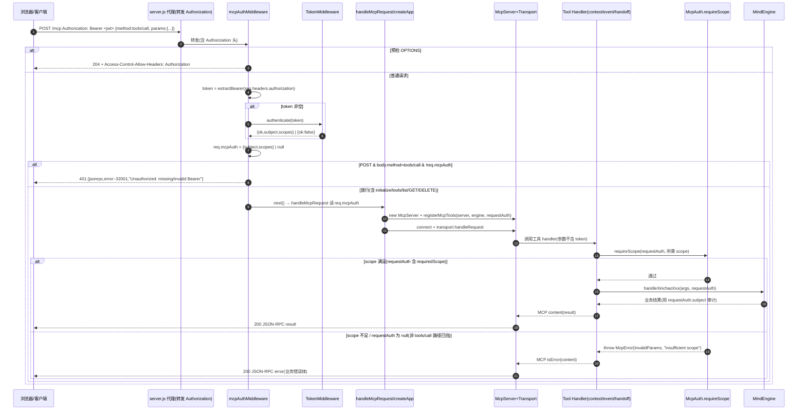

# 心屿 · Route B 鉴权升级 — 系统设计文档

> 架构师：高见远（Gao）｜ 产品名：心屿 ｜ 心智体：小暖（不可改名）
> 铁律：100% 自研 MIT；不使用 ombre-brain / 第三方「心潮」；零新增依赖（仅用既有 `jsonwebtoken` / `node:crypto` / MCP SDK / express）。
> 不破坏 `/authorize` `/token` `/introspect` `/revoke` `/health`；保留 3 个 MCP 工具的 `read`/`write` scope 语义。

---

## 1. 实现方案（含请求级 auth 传递方案的选定与理由）

### 1.1 技术难点与选型

| 难点 | 方案 |
|---|---|
| 每请求新建 `McpServer`+`transport` 的无状态模型下，如何把"已验证身份"传给工具 handler | **闭包捕获（closure capture）**：HTTP 中间件在 `handleMcpRequest` 之前完成 Bearer 校验，把 `{subject, scopes}` 作为 `requestAuth` 参数传入 `registerMcpTools(server, engine, requestAuth)`，工具 handler 闭包读取 `requestAuth`。 |
| 鉴权从"工具参数 `args.token`"迁移到"标准 `Authorization: Bearer <jwt>` 请求头" | 在 `src/mcp/middleware.ts` 新增 Express 中间件：从 `req.headers.authorization` 提取 Bearer → `auth.authenticate(token)` → 挂到 `req.mcpAuth`；对 `tools/call` 缺失/非法令牌直接 401。 |
| 保持 `read`/`write` scope 强制、不破坏既有 OAuth 端点 | 工具 handler 内 `requireScope(requestAuth, SCOPE_READ\|SCOPE_WRITE)` 替代 `verify(args.token, scope)`；`TokenMiddleware.verify` 保留供 `/introspect` 等他用。 |
| 测试"call 工具"且零新增依赖 | MCP SDK 1.30.0 已内置 `InMemoryTransport.createLinkedPair()`；Node 18 自带 `fetch`。用二者分别做工具层与 HTTP 层验证，**不引入 supertest**。 |

**架构模式**：无状态每请求 MCP + Express Bearer 中间件（请求级 auth 上下文 → 闭包注入工具 handler）。依旧是「传输层装配」风格，与现有 `index.ts` 一致。

### 1.2 请求级 auth 传递方案 —— 选定「闭包捕获」（决策）

**选定**：`registerMcpTools(server, engine, requestAuth)`，工具 handler 闭包捕获 `requestAuth`。

**理由**：
1. `handleMcpRequest` 每请求新建 `McpServer`+`transport`，`registerMcpTools` 也在该请求作用域内调用，把已验证的 `requestAuth` 作为参数传入即可被各 handler 闭包捕获 —— 最简单、零样板。
2. **完全版本无关**：不耦合 MCP SDK 内部的 `extra.authInfo` / `authProvider` 机制。SDK 的 `authInfo` 需同时在 `McpServer` 与 `StreamableHTTPServerTransport` 上装配 `OAuthServerProvider` 实现（接口随 1.x 小版本变动），对自研 HS256 JWT 属于过度工程且易碎。
3. 自定义 JWT 校验（签名+exp+iss）完全自控，与 `TokenMiddleware` 单一来源一致；零新增依赖。
4. `extra` 仍可在未来需要时作为 SDK 原生通道，但本 v1 不依赖。

**调用链（选定方案）**：
```
浏览器/代理 POST /mcp (Authorization: Bearer <jwt>, body.method=tools/call)
  → mcpAuthMiddleware
      ├─ extractBearer(req.headers.authorization)        // TokenMiddleware
      ├─ auth.authenticate(token) -> {ok, subject, scopes} // TokenMiddleware（仅验令牌，不验 scope）
      ├─ req.mcpAuth = {subject, scopes} | null
      └─ method=tools/call 且 !req.mcpAuth → res 401（JSON-RPC error 体）
  → handleMcpRequest(req,res)
      ├─ const requestAuth = req.mcpAuth
      ├─ new McpServer(...)
      ├─ registerMcpTools(server, engine, requestAuth)    // 闭包捕获
      │     └─ handler: requireScope(requestAuth, SCOPE_X) // 工具级 scope 校验
      │            └─ engine.handleXinchaoXxx(args, requestAuth) // 用 requestAuth.subject 审计
      └─ transport.handleRequest(...)
```

**备选（未采用）**：`extra.authInfo`。需在 server/transport 装配 `authProvider`、实现 `OAuthServerProvider`（getClient、startAuthorization、completeAuthorization、registerClient 等），并依赖 SDK 具体版本的形状；对自研 JWT 收益为零、风险为正。故弃。

---

## 2. 文件列表及相对路径

| 文件 | 变更 | 说明 |
|---|---|---|
| `src/auth/token.ts` | 改 | 新增 `authenticate(token)`；`verify` 重构复用 `authenticate`；保留 `issue`/`issueAccessToken`/`introspectToken`/`extractBearer`。 |
| `src/types/index.ts` | 改 | 新增 `RequestAuth` 接口（与既有 `AuthResult` 共存）。 |
| `src/mcp/middleware.ts` | 新 | `mcpAuthMiddleware` / `resolveRequestAuth` / `sendUnauthorized`；OPTIONS 预检放行；`tools/call` 无令牌→401。 |
| `src/mcp/auth.ts` | 新 | `RequestAuth` 再导出 + `requireScope` + `getRequiredScope` + `{context:read, event/handoff:write}` 映射。 |
| `src/mcp/tools.ts` | 改 | `registerMcpTools(server, engine, requestAuth)` 改为编排器；3 工具 schema 移除 `token`；引擎方法去 `token`、改收 `requestAuth` 用于审计。 |
| `src/mcp/tools/context.ts` | 新 | `registerContextTool(server, engine, requestAuth)`（read）。 |
| `src/mcp/tools/event.ts` | 新 | `registerEventTool(server, engine, requestAuth)`（write）。 |
| `src/mcp/tools/handoff.ts` | 新 | `registerHandoffNoteTool(server, engine, requestAuth)`（write）。 |
| `src/app.ts` | 新 | 抽出 `createApp(engine, auth)`：装配 OAuth + `/health` + `/mcp`（含中间件接线与路由）。供 `index.ts` 与测试复用。 |
| `src/index.ts` | 改 | `bootstrap` 改用 `createApp`；保留监听/日志；删除内联 `handleMcpRequest` 的重复装配（迁移到 `createApp`）。 |
| `src/__tests__/mcp.test.ts` | 改 | 重写为"经工具层 call 工具、不再传 token"；保留 11 用例全绿；新增无 Bearer / scope 不足拒绝用例。 |
| `src/__tests__/helpers/registerMcpToolsForTest.ts` | 新 | 封装 `registerMcpTools` + `InMemoryTransport`+`ClientSession`，返回可 `callTool` 的客户端。 |
| `src/__tests__/helpers/mcpTestClient.ts` | 新 | `InMemoryTransport` 链接对 + `ClientSession` 的通用封装（T03 产出，T04 复用）。 |
| `src/__tests__/fixtures/mcpTokens.ts` | 新 | 用 `auth.issueAccessToken` 铸造：有效/过期/越权（仅 read）/非法 四类 JWT。 |
| `src/__tests__/mcp.http.test.ts` | 新 | 零依赖（`fetch`）打 `/mcp`：验证 401 门禁 + OPTIONS 预检放行。 |

---

## 3. 数据结构与接口（Mermaid 类图）

```mermaid
classDiagram
    direction LR

    class TokenMiddleware {
        <<src/auth/token.ts · 改>>
        -secret: string
        -issuer: string
        +issue(subject, scopes): string
        +issueAccessToken(subject, scope): IssuedAccessToken
        +verify(token, scope): AuthResult
        +introspectToken(token): TokenClaims|null
        +extractBearer(authHeader): string|null
        +authenticate(token): AuthResult2
    }

    class AuthResult {
        <<src/types/index.ts · 既有>>
        +ok: boolean
        +code: string
        +subject: string
        +scopes: string[]
    }

    class RequestAuth {
        <<src/types/index.ts · 新增 interface>>
        +subject: string
        +scopes: string[]
    }

    class McpAuthMiddleware {
        <<src/mcp/middleware.ts · 新>>
        +resolveRequestAuth(req): RequestAuth|null
        +sendUnauthorized(res, id): void
        +mcpAuthMiddleware(req,res,next): void
    }

    class McpAuth {
        <<src/mcp/auth.ts · 新>>
        +requireScope(auth, scope): void
        +getRequiredScope(toolName): string
    }

    class McpTools {
        <<src/mcp/tools.ts · 改>>
        +registerMcpTools(server, engine, requestAuth): void
    }

    class ToolRegistrar {
        <<src/mcp/tools/{context,event,handoff}.ts · 新>>
        +registerContextTool(server, engine, requestAuth)
        +registerEventTool(server, engine, requestAuth)
        +registerHandoffNoteTool(server, engine, requestAuth)
    }

    class MindEngine {
        <<src/mcp/tools.ts · 改>>
        -state / memory / idem / bridge / builder / audit
        +handleXinchaoContext(args, requestAuth): ContextEnvelope
        +handleXinchaoEvent(args, requestAuth): EventResult
        +handleHandoffNote(args, requestAuth): HandoffResult
    }

    class ExpressRequest {
        <<express.Request 扩展>>
        +mcpAuth: RequestAuth|null
    }

    TokenMiddleware ..> AuthResult : produces
    TokenMiddleware ..> RequestAuth : produces(authenticate)
    McpAuthMiddleware --> TokenMiddleware : extractBearer + authenticate
    McpAuthMiddleware ..> ExpressRequest : sets mcpAuth
    McpAuthMiddleware ..> RequestAuth : resolves
    McpTools --> ToolRegistrar : delegates
    McpTools ..> RequestAuth : captures(closure)
    ToolRegistrar ..> RequestAuth : reads in handler
    ToolRegistrar --> McpAuth : requireScope
    ToolRegistrar --> MindEngine : calls(handleXinchaoXxx)
    MindEngine ..> RequestAuth : uses subject for audit
```

**关键类型定义（草案）**
```ts
// src/types/index.ts
export interface RequestAuth {
  subject: string;   // = JWT sub
  scopes: string[];  // 归一化后的 scope 数组（优先取 claims.scopes，回退 claims.scope 拆分）
}

// src/auth/token.ts
export type AuthResult2 =
  | { ok: true; subject: string; scopes: string[] }
  | { ok: false; error: string };
```

---

## 4. 调用流程（Mermaid 时序图）



> 说明：`initialize`/`tools/list`/`resources`/`ping` 及 GET(SSE)/DELETE 不要求令牌，中间件对 `!req.mcpAuth` 一律放行；仅 `tools/call` 三个工具触发 401 门禁与 handler 级 scope 校验。

---

## 5. 任务列表（有序、含依赖、标注 P0）

> 遵循：≤5 任务、每任务 ≥3 文件、T01 为基础设施（P0）。

### T01 · P0 · 鉴权基础设施（authenticate + RequestAuth 类型 + HTTP 中间件模块）
- **源文件**：`src/auth/token.ts`、`src/types/index.ts`、`src/mcp/middleware.ts`
- **依赖**：无
- **内容**：
  1. `TokenMiddleware.authenticate(token)`：`jwt.verify` 验签名+exp+iss，归一化 `scopes`（优先 `claims.scopes`，回退 `claims.scope` 拆分），返回 `{ok,subject,scopes}`/`{ok:false,error}`。
  2. `verify(token, scope)` 重构为复用 `authenticate` + scope 包含判断（保持 `AuthResult` 形状，供 `oauth.test.ts` 等他用）。
  3. `src/types/index.ts` 新增 `RequestAuth`。
  4. `src/mcp/middleware.ts`：`resolveRequestAuth(req)`（extractBearer→authenticate→`req.mcpAuth`）、`sendUnauthorized(res,id)`（401 + JSON-RPC 错误体）、`mcpAuthMiddleware`（OPTIONS 放行并补 `Access-Control-Allow-Headers: Authorization`；`tools/call` 无令牌→401）。

### T02 · P0 · 工具层闭包改造（移除 token、requestAuth 传递、scope 校验）
- **源文件**：`src/mcp/auth.ts`、`src/mcp/tools.ts`、`src/mcp/tools/context.ts`、`src/mcp/tools/event.ts`、`src/mcp/tools/handoff.ts`
- **依赖**：T01
- **内容**：
  1. `src/mcp/auth.ts`：`requireScope(auth, scope)`（null→抛 `McpError`；不含→`McpError(InvalidParams)`）、`getRequiredScope(name)`（`context→SCOPE_READ`，`event`/`handoff_note→SCOPE_WRITE`）。
  2. `src/mcp/tools.ts`：`registerMcpTools(server, engine, requestAuth)` 改为编排器；3 工具 schema 删除 `token` 字段；引擎 3 方法去掉 `token` 参数、改收 `requestAuth` 并以其 `subject` 审计。
  3. 拆分 3 个 per-tool 模块，handler 闭包读取 `requestAuth` → `requireScope` → `engine.handleXinchaoXxx(args, requestAuth)`。

### T03 · P1 · 入口接线与可测 app 抽出
- **源文件**：`src/app.ts`、`src/index.ts`、`src/__tests__/helpers/mcpTestClient.ts`
- **依赖**：T01（中间件已建，此处应用）
- **内容**：
  1. `src/app.ts` 新增 `createApp(engine, auth)`：装配 OAuth 端点、`/health`、在 `/mcp`（POST/GET/DELETE）串接 `mcpAuthMiddleware` + `handleMcpRequest`，从 `req.mcpAuth` 取 `requestAuth` 传入 `registerMcpTools`。
  2. `src/index.ts` 的 `bootstrap` 改用 `createApp`，仅保留存储/引擎构建、监听与日志。
  3. `mcpTestClient.ts`：封装 `InMemoryTransport.createLinkedPair()` + `ClientSession`，供 T04 零依赖 call 工具。

### T04 · P1 · 测试重构与端到端验证
- **源文件**：`src/__tests__/mcp.test.ts`、`src/__tests__/helpers/registerMcpToolsForTest.ts`、`src/__tests__/fixtures/mcpTokens.ts`、`src/__tests__/mcp.http.test.ts`
- **依赖**：T02、T03
- **内容**：
  1. `mcp.test.ts` 重写：用 `registerMcpTools(server, engine, {subject, scopes})` + `mcpTestClient` 经工具层 call 工具（不再传 token）；保留 11 用例（信封/软上限/event 校验/幂等/记忆/handoff 长度/unicode + 新增无 Bearer、scope 不足拒绝）全绿。
  2. `registerMcpToolsForTest.ts`：一行式注册+建客户端 helper。
  3. `mcpTokens.ts`：铸造有效/过期/越权/非法四类 JWT。
  4. `mcp.http.test.ts`：零依赖 `fetch` 打 `/mcp`，验证 401 门禁与 OPTIONS 放行；确认 `oauth`/`state`/`bridge` 38 例其余 27 个不被破坏。

---

## 6. 依赖包列表（零新增）

```
# 本次升级不新增任何依赖。
# 复用既有：
#   @modelcontextprotocol/sdk ^1.30.0  -> 提供 InMemoryTransport（测试 call 工具，无需 supertest）
#   express ^4.19.2                     -> Bearer 中间件与路由
#   jsonwebtoken ^9.0.2                 -> HS256 验签（authenticate）
#   zod ^3.23.8                         -> 工具入参 schema（移除 token 字段）
#   node:crypto / node:fs / node:os     -> 既有
#   运行时自带 fetch (Node >=18)         -> HTTP 层测试，无需 supertest
```

---

## 7. 共享知识（跨任务约束）

- **Auth 上下文结构**：`RequestAuth = { subject: string; scopes: string[] }`，经 HTTP 中间件挂到 `req.mcpAuth`（Express Request 扩展），再以闭包注入 `registerMcpTools(server, engine, requestAuth)`。
- **Scope 校验约定**：工具级 `requireScope(requestAuth, scope)`；判定 `requestAuth?.scopes.includes(scope)`。`null` requestAuth → 拒；映射 `context→read`、`event`/`handoff_note→write`。`SCOPE_READ`/`SCOPE_WRITE` 常量（`src/config.ts`）保留强制。
- **错误返回形态**：
  - 无/非法 Bearer 且 `method=tools/call` → **HTTP 401**，体为 JSON-RPC 错误：`{jsonrpc:"2.0", id, error:{code:-32001, message:"Unauthorized: missing or invalid Bearer token"}}`。
  - 已认证但 scope 不足 → **MCP 层 `McpError`**（`ErrorCode.InvalidParams`，message 含所需 scope），在正常 200 响应内以 JSON-RPC error 返回（不破坏 MCP 契约）。
  - `initialize`/`tools/list`/GET/DELETE → 无令牌也放行（中间件不挡）。
- **JWT claim 约定**：HS256；claim 含 `sub`(subject)、`scope`(字符串, 空格分隔) 与 `scopes`(数组, 优先)、`exp`、`iss`。`authenticate` 归一化为 `scopes: string[]`。
- **测试注册 helper 约定**：`registerMcpToolsForTest(server, engine, {subject, scopes})` 用给定 `requestAuth` 注册；测试**不再传 token**；`mcpTokens` fixture 用 `auth.issueAccessToken(subject, scope)` 铸造有效/过期/越权/非法 JWT；工具层用 `mcpTestClient`（InMemoryTransport）call 工具，HTTP 层用 `fetch` 打 `createApp` 起的临时端口。
- **CORS/预检**：`mcpAuthMiddleware` 对 `OPTIONS` 直接 `next()` 并补 `Access-Control-Allow-Headers: Authorization`；本 v1 经 `server.js` 代理转发 Authorization，引擎侧非强制但建议保留。

---

## 8. 待明确事项（仅剩无法默认的技术决策）

1. **scope 不足的返回形态（已选定但请最终确认）**：本设计默认 scope 不足返回 **MCP 层 `McpError`**（而非 HTTP 403），以契合 JSON-RPC 契约、且令牌本身有效。若未来存在"直连（非代理）客户端"需以 HTTP 403 显式拒绝，请在 v2 再扩展；本 v1 维持 MCP 错误。
2. **GET(SSE)/DELETE 是否要求 Bearer**：本设计默认**不要求**（无状态每请求 + 代理场景，`req.mcpAuth=null` 仍可建立 SSE/终止会话）。若安全基线要求所有 `/mcp` 方法均带令牌，请明确，我将把 401 门禁从"仅 tools/call"扩为"全部 POST/GET/DELETE"。
3. **旧 `args.token` 引擎测试的整体处置**：`mcp.test.ts` 中原"缺少/无效令牌拒绝"的用例将**整体迁移**为 handler 层（无 Bearer / scope 不足）用例；引擎方法不再含 token 参数。如希望保留一份"引擎层无鉴权、纯业务"的隔离测试（不经由 `registerMcpTools`），请确认，我会额外保留一组直调 `engine.handleXinchaoXxx(args, requestAuth)` 的纯单元用例。

> 以上 3 项均为产品/安全基线层面的确认项；技术实现路径（闭包捕获、authenticate、中间件 401、InMemoryTransport/fetch 零依赖测试）均已确定，可立即开工。
