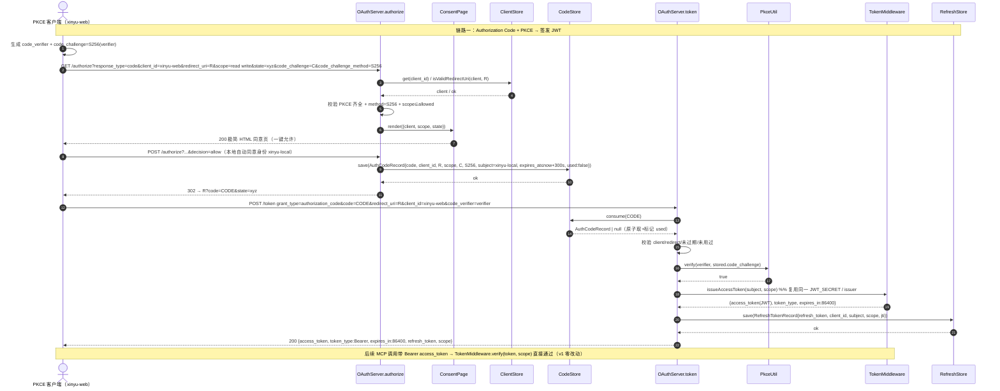
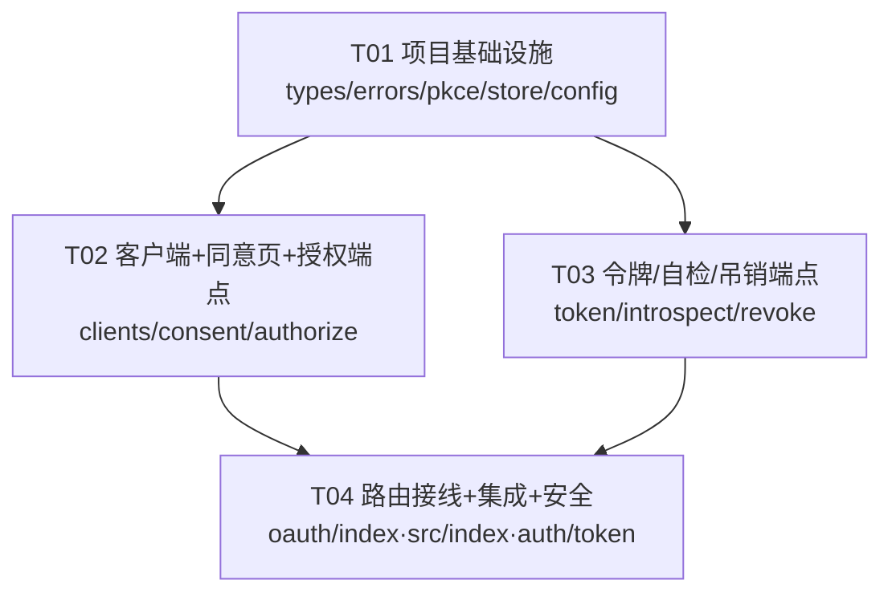

# 心屿「标准 OAuth 2.1 授权服务器」系统架构设计 + 任务分解

> 架构师：高见远（Gao） ｜ 产品名：**心屿** ｜ 伴侣名：**小暖**（不可改名、不可 renamed）
> 协议：MIT ｜ 代码 100% 自有，完全从零自研，不依赖/不 fork 任何第三方「心潮（xinchao）」项目，不使用 `ombre-brain`。
> 配套图：`docs/class-diagram.mermaid`、`docs/sequence-diagram.mermaid`

## 铁律校验（交付前置）
- ✅ **小暖**之名不在本设计中改动（本服务不触碰伴侣名，仅鉴权）。
- ✅ **100% 自研 MIT**：新增代码全部落在 `src/oauth/`，不引入任何第三方 OAuth 库；如需加密原语一律用 Node 内置 `node:crypto`。
- ✅ **不破坏 `/mcp` 与 3 个 MCP 工具**：新签发的 `access_token` 复用同一 `JWT_SECRET`、同一 `issuer=xinyu-mind-engine`、并**同时携带 `scopes` 数组**（兼容现有 `TokenMiddleware.verify`），3 个工具的 `verify(args.token, SCOPE_READ/WRITE)` 调用点 **v1 零改动**。现有 `index.ts` 的非标准 `/token` 被移除以避免双签发。

---

## Part A：系统设计

### 1. 实现方案 + 框架选型

#### 1.1 核心难点
1. **PKCE(S256) 强制**：授权码流程必须校验 `code_challenge` + `code_challenge_method=S256`，且 `code_verifier` 在 `/token` 端做 SHA256 比对。
2. **一次性、短生命 auth code**：绑定 `client / redirect_uri / scope / code_challenge`，TTL≤5min，单次可用（consume 即标记）。
3. **access_token 与既有验签完全兼容**：这是最难也最关键的一点——既要是标准 OAuth JWT（claim 含 `scope` 字符串），又要能被现有 `TokenMiddleware.verify`（读 `decoded.scopes` **数组**）直接验过。
4. **refresh_token 可吊销 + 轮换**：服务端存储、可吊销；P1 用即废。
5. **不破坏既有 MCP 路径**：`/mcp` 路由与 3 个工具的 `args.token` 校验逻辑保持不变。

#### 1.2 框架与库选型（仅 MIT / 宽松协议，预期零新增依赖）
| 用途 | 选型 | 协议 | 说明 |
|------|------|------|------|
| HTTP 路由 | `express`（已有） | MIT | 承载 `/authorize` `/token` `/introspect` `/revoke` |
| JWT 签发/验签 | `jsonwebtoken`（已有） | MIT | HS256，`JWT_SECRET` 同现有；复用 `TokenMiddleware` 实例保证密钥/issuer 一致 |
| PKCE / SHA256 | Node 内置 `node:crypto` | MIT（运行时自带） | `crypto.randomBytes` + `crypto.createHash('sha256')` + base64url，无需库 |
| 入参校验 | `zod`（已有） | MIT | `/token` `/introspect` `/revoke` body 校验 |
| 配置加载 | `dotenv`（已有） | BSD-2-Clause（宽松） | 读 `.env` |
| 测试 | `vitest`（已有） | MIT | 端点 + PKCE 单测 |

> **结论：无需新增任何第三方依赖**。所有密码学原语均来自 Node 运行时 + 现有 `jsonwebtoken`，完全符合 MIT/宽松铁律。

#### 1.3 架构模式
**分层 + 组合根（Composition Root）**：
- **传输层**：`src/oauth/*.ts` 内的 Express handlers（`authorize/token/introspect/revoke`）。
- **领域服务层**：`ClientStore`（客户端注册/白名单）、`CodeStore`（auth code 内存存储）、`RefreshStore`（refresh token 内存存储）、`PkceUtil`（无状态工具）、`ConsentPage`（极简 HTML 渲染）。
- **共享签发层**：复用既有 `src/auth/token.ts` 的 `TokenMiddleware`（同一 secret/issuer）做 access_token 签发与 introspect 验签——**单一密钥来源**，杜绝密钥分叉。
- **组合根**：`src/oauth/index.ts` 的 `OAuthServer.register(app)`，在 `src/index.ts` 中装配，接收既有的 `TokenMiddleware` 实例。

#### 1.4 ⚠️ 关键兼容决策（必读）
现有 `src/auth/token.ts` 的 `verify` 实现：
```ts
const decoded = jwt.verify(token, this.secret, { issuer: this.issuer }) as TokenClaims;
const scopes: string[] = Array.isArray(decoded.scopes) ? decoded.scopes : [];
if (!scopes.includes(scope)) return { ok:false, code: ERROR_CODES.E1102 };
```
它读的是 **`decoded.scopes`（数组）**。PRD 写的新 access_token claim 是 `scope`（字符串）。若只发 `scope` 字符串，`verify` 会得到 `scopes=[]` → 越权失败（3 个 MCP 工具断签）。

**因此 access_token 的 JWT claim 必须同时包含：**
```jsonc
{
  "sub": "xinyu-local",        // 资源所有者（本地自动同意的固定身份）
  "scope": "read write",       // OAuth RFC 标准：空格分隔字符串（供 /introspect 返回）
  "scopes": ["read","write"],  // ★ 兼容桥：与 verify 读取的字段一致，3 工具零改动
  "token_type": "Bearer",
  "jti": "<uuid>",             // 供 /revoke 级联吊销 access
  "iss": "xinyu-mind-engine",
  "exp": 1735689600
}
```
> 实现方式：在 `TokenMiddleware` 上**新增** `issueAccessToken(subject, scope)` 与 `introspectToken(token)` 两个方法（3 个 MCP 工具不调用它们，故仍属「零改动」）。签发走同一 `secret/issuer`，`exp=86400`。

---

### 2. 文件列表（相对路径）

新增代码统一在 `src/oauth/` 下；两处既有文件做最小接线改动。

```
心屿心智引擎/
├── src/
│   ├── index.ts                 # 【改动】移除旧 /token(44-50)；挂载 OAuthServer；保留 /mcp + /health
│   ├── config.ts                # 【改动】新增 OAUTH 常量（TTL/scope/LOCAL_SUBJECT/CORS）
│   ├── auth/
│   │   └── token.ts             # 【改动】新增 issueAccessToken() / introspectToken()（3 工具不变）
│   └── oauth/                   # ★ 全部新增
│       ├── types.ts             # 共享类型/接口：OAuthClient / AuthCodeRecord / RefreshTokenRecord / OAuthError / TokenResponse / IntrospectResponse
│       ├── errors.ts            # RFC6749/7662/7009 错误码 + HTTP 状态 + 错误响应构造
│       ├── pkce.ts              # PkceUtil：S256 challenge / verify / randomToken / jti
│       ├── store.ts             # CodeStore + RefreshStore + RevocationStore（内存；预留 JSONL 落盘接口）
│       ├── clients.ts           # ClientStore：xinyu-web 预置 + 多客户端预留 + redirect_uri 白名单
│       ├── consent.ts           # ConsentPage：渲染极简 HTML 同意页
│       ├── authorize.ts         # GET /authorize（校验+渲染） + POST /authorize（一键允许→发 code→302）
│       ├── token.ts             # POST /token：authorization_code + refresh_token；CORS；签发 JWT
│       ├── introspect.ts        # POST /introspect（RFC7662）
│       ├── revoke.ts            # POST /revoke（RFC7009）
│       └── index.ts             # OAuthServer 组合根：register(app) 挂载全部路由
└── docs/
    ├── system_design.md
    ├── class-diagram.mermaid
    └── sequence-diagram.mermaid
```

---

### 3. 数据结构与接口（Mermaid 类图）

> 完整文件见 `docs/class-diagram.mermaid`。

```mermaid
classDiagram
    direction TB

    class TokenMiddleware {
        <<existing: src/auth/token.ts>>
        -secret: string
        -issuer: string
        +issue(subject, scopes): string
        +verify(token, scope): AuthResult
        +issueAccessToken(subject, scope): TokenResponse  %% 新增（3 工具不调用）
        +introspectToken(token): TokenClaims|null          %% 新增
    }

    class OAuthServer {
        -clientStore: ClientStore
        -codeStore: CodeStore
        -refreshStore: RefreshStore
        -pkce: PkceUtil
        -consent: ConsentPage
        -auth: TokenMiddleware
        +register(app: Express): void
        -mountAuthorize(app)
        -mountToken(app)
        -mountIntrospect(app)
        -mountRevoke(app)
    }

    class ClientStore {
        -clients: Map~string, OAuthClient~
        +register(client: OAuthClient): void
        +get(clientId: string): OAuthClient|undefined
        +isValidRedirectUri(client: OAuthClient, uri: string): boolean
        +isPublic(clientId: string): boolean
    }

    class CodeStore {
        -codes: Map~string, AuthCodeRecord~
        +save(rec: AuthCodeRecord): void
        +consume(code: string): AuthCodeRecord|null   %% 原子取+标记 used
        +revoke(code: string): void
        +sweep(): void                                 %% TTL 定时清理
    }

    class RefreshStore {
        -tokens: Map~string, RefreshTokenRecord~
        +save(rec: RefreshTokenRecord): void
        +get(token: string): RefreshTokenRecord|undefined
        +revoke(token: string): void
        +revokeByJti(jti: string): void                %% 级联标记关联 access
        +rotate(old: RefreshTokenRecord): RefreshTokenRecord  %% P1 用即废
    }

    class RevocationStore {
        -denylist: Set~string~   %% access jti 黑名单（最佳努力）
        +add(jti: string): void
        +isRevoked(jti: string): boolean
    }

    class PkceUtil {
        +generateVerifier(): string
        +challengeS256(verifier: string): string
        +verify(verifier: string, challenge: string): boolean
        +randomToken(bytes: number): string
        +jti(): string
    }

    class ConsentPage {
        +render(view: ConsentView): string   %% 返回极简 HTML
    }

    class OAuthClient {
        +client_id: string
        +client_secret: string|null
        +redirect_uris: string[]
        +token_endpoint_auth_method: "none"|"client_secret_post"|"client_secret_basic"
        +name: string
        +allowed_scopes: string[]
    }

    class AuthCodeRecord {
        +code: string
        +client_id: string
        +redirect_uri: string
        +scope: string
        +code_challenge: string
        +code_challenge_method: "S256"
        +subject: string
        +created_at: number
        +expires_at: number
        +used: boolean
    }

    class RefreshTokenRecord {
        +refresh_token: string
        +client_id: string
        +subject: string
        +scope: string
        +jti: string
        +created_at: number
        +expires_at: number
        +revoked: boolean
    }

    OAuthServer --> ClientStore : 依赖
    OAuthServer --> CodeStore : 依赖
    OAuthServer --> RefreshStore : 依赖
    OAuthServer --> PkceUtil : 依赖
    OAuthServer --> ConsentPage : 依赖
    OAuthServer --> TokenMiddleware : 复用签发/验签
    OAuthServer ..> RevocationStore : 复用(吊销)

    ClientStore "1" *-- "0..*" OAuthClient : 持有
    CodeStore "1" *-- "0..*" AuthCodeRecord : 存储
    RefreshStore "1" *-- "0..*" RefreshTokenRecord : 存储
    RefreshStore ..> RevocationStore : 吊销时联动
```



#### 3.1 关键接口契约（TypeScript 签名摘录）
```ts
// src/oauth/types.ts
export interface OAuthClient {
  client_id: string;
  client_secret: string | null;            // public client = null
  redirect_uris: string[];                  // 严格白名单
  token_endpoint_auth_method: 'none' | 'client_secret_post' | 'client_secret_basic';
  name: string;
  allowed_scopes: string[];                 // 该 client 可申请的 scope 上界
}

export interface AuthCodeRecord {
  code: string; client_id: string; redirect_uri: string; scope: string;
  code_challenge: string; code_challenge_method: 'S256';
  subject: string; created_at: number; expires_at: number; used: boolean;
}

export interface RefreshTokenRecord {
  refresh_token: string; client_id: string; subject: string; scope: string;
  jti: string; created_at: number; expires_at: number; revoked: boolean;
}

export interface TokenResponse {
  access_token: string; token_type: 'Bearer'; expires_in: number;
  refresh_token?: string; scope: string;
}
export interface IntrospectResponse {
  active: boolean; scope?: string; sub?: string; exp?: number;
  iss?: string; client_id?: string;
}
export interface OAuthError { error: string; error_description?: string; state?: string; }

// src/auth/token.ts（新增，3 工具不调用）
// issueAccessToken(subject, scope: string): TokenResponse
//   -> jwt.sign({ sub, scope, scopes: scope.split(' '), token_type:'Bearer', jti }, secret, { issuer, expiresIn:'24h' })
// introspectToken(token): TokenClaims | null  -> jwt.verify(token, secret, { issuer }) 或 null
```

---

### 4. 程序调用流程（Mermaid 时序图）

> 完整文件见 `docs/sequence-diagram.mermaid`（含三条链路：授权码+PKCE、/introspect、/revoke）。



---

### 5. 任务列表（有序、含依赖、标注 P0/P1）

> 规则遵循：≤5 任务；每任务 ≥3 文件；T01 为基础设施；任务尽量仅依赖 T01 或浅层聚合（T02/T03 可并行，均只依赖 T01 的接口契约）。

#### T01 ｜ 项目基础设施（类型 + 错误 + PKCE + 存储骨架 + 配置）— P0
- **Source Files**：`src/oauth/types.ts`、`src/oauth/errors.ts`、`src/oauth/pkce.ts`、`src/oauth/store.ts`、`src/config.ts`（新增 OAUTH 常量块）
- **Dependencies**：无（基线任务）
- **Priority**：P0
- **说明**：冻结所有接口契约（`OAuthClient/AuthCodeRecord/RefreshTokenRecord/TokenResponse/IntrospectResponse/OAuthError`）与 PKCE 工具（S256/verify/randomToken/jti）；实现内存 `CodeStore/RefreshStore/RevocationStore`（预留 `persist()` 接口以便 v2 换 JSONL）；`config.ts` 增加 `AUTH_CODE_TTL_SECONDS=300`、`REFRESH_TOKEN_TTL_SECONDS=2592000`、`LOCAL_SUBJECT='xinyu-local'`、`CORS_ALLOWED_ORIGINS`。

#### T02 ｜ 客户端注册 + 同意页 + 授权端点 — P0
- **Source Files**：`src/oauth/clients.ts`、`src/oauth/consent.ts`、`src/oauth/authorize.ts`
- **Dependencies**：T01（依赖 `types.ts` 接口与 `pkce.ts`）
- **Priority**：P0
- **说明**：`ClientStore` 预置 `xinyu-web`（public client：`client_id`、`redirect_uris`、`token_endpoint_auth_method=none`），多客户端预留 `register()`；`ConsentPage` 渲染极简 HTML（含「允许」表单，POST 回 `/authorize`）；`authorize.ts` 完成 P0-1（校验 client/redirect 白名单/PKCE 齐全→渲染）与 P0-6（一键允许→`CodeStore.save`→302 `?code=&state=`）。可与 T03 并行。

#### T03 ｜ 令牌签发 + 自检 + 吊销端点 — P0 / P1
- **Source Files**：`src/oauth/token.ts`、`src/oauth/introspect.ts`、`src/oauth/revoke.ts`
- **Dependencies**：T01（依赖 `types.ts` / `store.ts` / `pkce.ts` 接口；`ClientStore` 接口由 T01 冻结、T02 提供实现，运行时在 T04 接线）
- **Priority**：P0（authorization_code + refresh_token + /introspect + /revoke）/ P1（`/token` 启用 CORS、refresh 轮换）
- **说明**：`token.ts` 实现 P0-2 两 grant（校验 code+verifier PKCE+client → 调 `TokenMiddleware.issueAccessToken` 签 JWT + 存 refresh；refresh grant 换新，P1 用即废 `RefreshStore.rotate`）；内联 CORS 中间件（无新依赖）。`introspect.ts` 实现 P0-3（RFC7662，access 走 `introspectToken`，refresh 走 `RefreshStore.get`）。`revoke.ts` 实现 P0-4（RFC7009，access 入 `RevocationStore`、refresh 调 `RefreshStore.revoke`+`revokeByJti`）。

#### T04 ｜ 路由接线 + 集成 + 安全收尾 — P0 / P1
- **Source Files**：`src/oauth/index.ts`、`src/index.ts`、`src/auth/token.ts`
- **Dependencies**：T02、T03
- **Priority**：P0（接线/保留 /mcp + /health）/ P1（安全收尾）
- **说明**：`oauth/index.ts` 的 `OAuthServer.register(app)` 组合全部服务并挂载 4 条路由；`src/index.ts` **移除旧非标准 `/token`**、接收既有 `TokenMiddleware` 实例传入 `OAuthServer`、`/mcp` 与 `/health` 保持不变；`src/auth/token.ts` 新增 `issueAccessToken()` / `introspectToken()`（3 个 MCP 工具的 `verify` 调用点零改动）。生产 `JWT_SECRET` 缺失拒启动逻辑已由既有 `TokenMiddleware` 构造函数覆盖，无需重写。

---

### 6. 依赖包列表（仅 MIT / 宽松；预期零新增）

```
# 现有依赖（均 MIT / 宽松），本次不新增任何第三方包：
- express@^4.19.2: HTTP 路由（MIT）
- jsonwebtoken@^9.0.2: HS256 JWT 签发/验签（MIT）
- zod@^3.23.8: 端点入参校验（MIT）
- dotenv@^16.4.5: .env 加载（BSD-2-Clause，宽松）
- @modelcontextprotocol/sdk@^1.0.0: MCP 传输（MIT，保持不变）
# 密码学原语（PKCE/S256/随机）：Node 内置 node:crypto，零依赖
# 结论：新增代码不引入任何 npm 依赖，100% 自研 MIT，符合铁律。
```

---

### 7. 共享知识（跨文件约定）

```
# —— Client 结构（src/oauth/types.ts）——
OAuthClient = { client_id, client_secret:null(public), redirect_uris:[], token_endpoint_auth_method:'none', name, allowed_scopes:[] }
v1 预置：xinyu-web（public，redirect_uris 严格白名单，allowed_scopes=['read','write']）

# —— 存储 key ——
auth code：以 code 字符串为 key，存于 CodeStore（Map）；consume 原子取+标记 used。
refresh token：以 refresh_token 字符串为 key，存于 RefreshStore；关联 access 的 jti 用于级联吊销。
access 吊销黑名单：以 jti 为 key，存于 RevocationStore（Set）。仅影响 /introspect，不影响 MCP verify（见待明确）。

# —— JWT claim 字段（access_token，HS256）——
{ sub: LOCAL_SUBJECT, scope: "read write"(字符串), scopes: ["read","write"](数组★兼容桥),
  token_type: "Bearer", jti: <uuid>, iss: "xinyu-mind-engine", exp: now+86400 }
签发统一走 TokenMiddleware.issueAccessToken（同一 JWT_SECRET / issuer）。

# —— scope 常量（沿用 config.ts，禁止改值）——
SCOPE_READ='read'、SCOPE_WRITE='write'；OAuth scope 用空格分隔字符串，签发时 split 成数组写 scopes。

# —— 时间/TTL ——
access_token expires_in=86400；auth code TTL≤300s（AUTH_CODE_TTL_SECONDS）；refresh token TTL=2592000（30d，P1 轮换）。

# —— 资源所有者身份（本地自动同意）——
LOCAL_SUBJECT='xinyu-local'（固定常量；v1 无账号体系，设备/本地单实例自动同意）。

# —— 错误码（RFC6749/7662/7009）——
invalid_request / unauthorized_client / access_denied / unsupported_response_type /
invalid_scope / invalid_grant / unsupported_grant_type / invalid_client
introspect/revoke 错误统一 200 + {active:false} / 200（RFC7009 总是 200）。
OAuth 端点错误响应格式：{error, error_description?, state?}（application/json），与内部 E11xx 区分。

# —— 安全铁律 ——
PKCE 强制 S256；public client 无 secret、token_endpoint_auth_method='none'；
auth code 单次可用 + 短 TTL；生产 JWT_SECRET 缺失由 TokenMiddleware 构造函数抛错拒启动；
不破坏 /mcp 与 3 个 MCP 工具的 args.token 校验（v1 零改动）。
```

---

### 8. 待明确事项（仅剩无法默认的技术决策）

> 以下为**仍需主理人/安全拍板**的点；其余（身份常量、TTL、CORS 白名单、存储内存）均已按主理人默认决策处理。

1. **【核心·需拍板】已签发 access_token 的吊销生效范围**
   JWT 无状态，v1 仅靠 `RevocationStore`（jti 黑名单）对 `/introspect` 生效；但 **3 个 MCP 工具的 `TokenMiddleware.verify` 不查黑名单**，因此已签发的 access_token 在 24h 过期前对 MCP 工具仍可用。
   - 推荐默认（v1 零改动）：**不改动 `verify`**，接受「access 吊销对 MCP 路径最佳努力」，依赖「短 TTL(24h) + refresh 吊销 + 重启即清」即可。
   - 备选：v1 给 `verify` 增加可选黑名单短路（需轻微改 `token.ts`，3 工具调用点仍不变，但引入存储依赖）。
   → 建议采用推荐默认；若安全合规要求「吊销即时全域生效」，则需走备选并在 T04 增加一小步。

2. **【已默认·仅供参考】CORS 允许 origins**：`/token` 的 `CORS_ALLOWED_ORIGINS` v1 默认仅 `http://localhost:3000`（xinyu-web dev），生产由 `.env` 配置；如需放开请指明白名单。

3. **【已默认·仅供参考】多客户端管理形态**：v1 仅配置/内存预置（无 RFC7591 动态注册端点）；未来是否开放动态注册列为 P2 预留。

---

## Part B：任务依赖图（Mermaid）



> 依赖链扁平：T02 与 T03 均可并行（仅依赖 T01 冻结的接口契约），T04 做最终接线，无长线性链。
