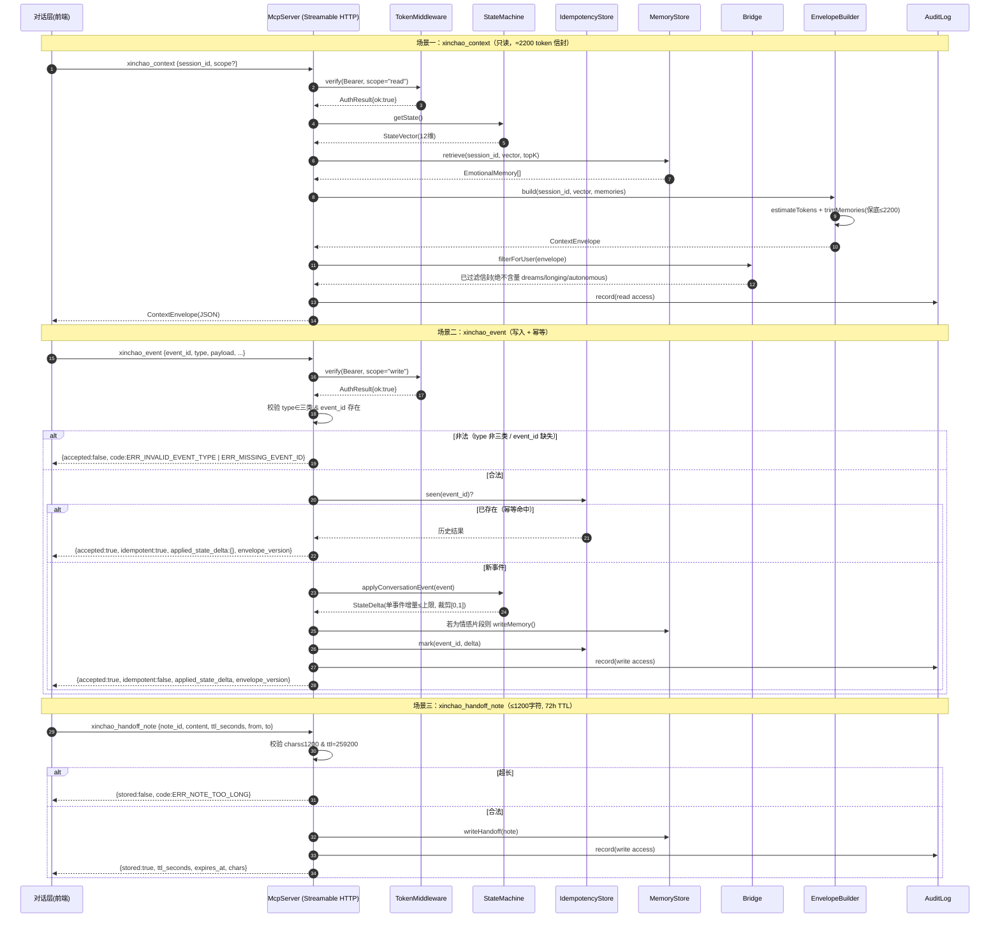
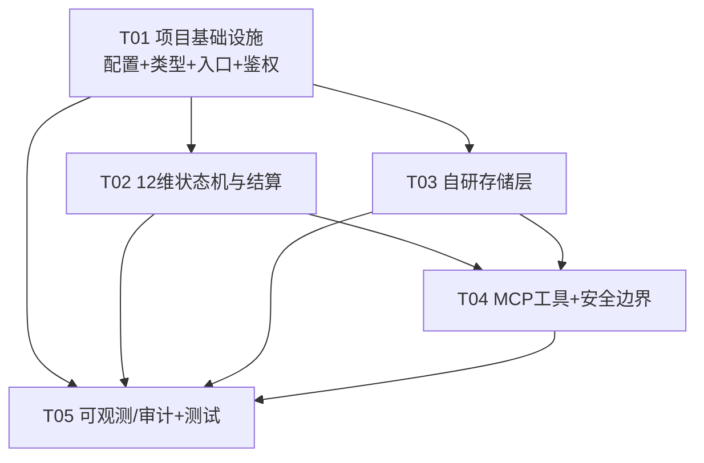

# 心屿自研心智引擎（路线④）— 系统架构设计 + 任务分解

> 架构师：高见远（Gao） ｜ 产品名：心屿 ｜ 伴侣名：**小暖**（不可改名）
> 协议：MIT ｜ 代码 100% 自有，完全从零自研实现，不依赖/不 fork 任何第三方「心潮（xinchao）」项目，不使用 `ombre-brain`。
> 配套图：`docs/class-diagram.mermaid`、`docs/sequence-diagram.mermaid`

---

## Part A：系统设计

### 1. 实现方案 + 框架选型（含架构假设）

#### 1.1 核心难点
1. **12 维心理驱动的动态演化**：衰减—饱和曲线需在数值稳定性与"情绪自然起伏"之间取得平衡，且必须幂等。
2. **Bridge 安全边界**：`dreams / longing / autonomous` 三类**任何代码路径都不得自动注入用户窗口**，需有单元测试覆盖。
3. **2200 token 信封软上限**：`memory_snippets` 需按相关度截断并保底不超包。
4. **幂等写入**：`event_id` 作为幂等键，JSONL 存储下需保证"已处理即返回历史结果"。
5. **OAuth 2.1 最小权限**：`context` 只读、`event / handoff` 写入，Bearer 鉴权。

#### 1.2 框架与库选型（仅 MIT / 宽松协议）
| 用途 | 选型 | 协议 | 说明 |
|------|------|------|------|
| MCP 传输 | `@modelcontextprotocol/sdk`（StreamableHTTPServerTransport） | MIT | 官方 TS SDK，原生支持 Streamable HTTP |
| HTTP 路由 | `express` | MIT | 承载 MCP 端点与 OAuth 端点 |
| 入参校验 | `zod` | MIT | MCP 工具输入契约校验 |
| 鉴权令牌 | `jsonwebtoken` + Node `crypto` | MIT | 轻量 Bearer 自签发/验签 |
| 配置加载 | `dotenv` | BSD-2-Clause | 读取 `.env` |
| 存储 | **自研 JSONL**（零依赖，Node `fs`） | MIT（自有） | v1 落地；预留 `better-sqlite3`(MIT)+向量升级位 |
| 测试 | `vitest` | MIT | 单元/集成测试 |
| 语言/运行时 | TypeScript + Node.js ≥ 18 | Apache-2.0 / MIT | 原生 `stream`/`fetch` |

#### 1.3 架构模式
**分层架构（传输 / 应用 / 领域 / 基础设施）**：
- 传输层：`McpServer`（Streamable HTTP）+ `TokenMiddleware`
- 应用层：`tools.ts`（3 个 MCP 工具 handler）
- 领域层：`StateMachine`（结算逻辑）、`Bridge`（安全边界）、`EnvelopeBuilder`（信封）
- 基础设施层：`JsonlStore` / `MemoryStore` / `IdempotencyStore` / `AuditLog`

#### 1.4 架构假设（对 PRD 待确认问题的默认决策）
- **A1 技术栈**：Node.js + TypeScript + 官方 MCP TS SDK（Streamable HTTP）。
- **A2 存储**：v1 用本地 JSONL（零依赖、MIT 友好），预留 SQLite+轻量向量升级位（接口已抽象）。
- **A3 衰减模型**：`SATURATE_FLOOR=0.65` 为饱和舒适带下限；未受刺激时每轮向基线（默认 `BASELINE=0.20`，可配置）衰减，半衰期 `HALF_LIFE_ROUNDS`（默认 8 轮，可配置）。
- **A4 用户模型**：v1 单用户单会话；`session_id` 由对话层传入，`StateMachine` 预留多会话聚合接口。
- **A5 OAuth 2.1**：内置轻量 Bearer 中间件，读写权限分离（`read` / `write`），后续可接 SSO。
- **A6 信封体积**：2200 token 为软上限，`memory_snippets` 按相关度截断保底不超包；`narrative` 由**状态驱动的确定性模板**生成（**不调用外部 LLM**，保障完全自托管、零外部依赖）。
- **A7 记忆检索**：v1 用启发式相关度（状态向量余弦近似 + tag 命中），不引入外部 embedding 模型；向量升级为 P2。

---

### 2. 文件列表（相对路径，建议 `src/` 下模块化）

```
心屿心智引擎/
├── package.json
├── tsconfig.json
├── .env.example
├── README.md
├── docs/
│   ├── system_design.md
│   ├── class-diagram.mermaid
│   └── sequence-diagram.mermaid
└── src/
    ├── index.ts                     # MCP Streamable HTTP 服务入口（传输层装配）
    ├── config.ts                    # Config：所有常量/维度键/安全通道集中定义
    ├── types/
    │   └── index.ts                 # 共享类型：StateVector / ConversationEvent / ContextEnvelope / SafetyFlag / 错误码
    ├── auth/
    │   └── token.ts                 # TokenMiddleware：OAuth 2.1 Bearer 签发/验签、读写 scope
    ├── state/
    │   ├── dimensions.ts            # DIMENSION_KEYS（12 维，顺序固定）+ 维度→中文语义映射
    │   ├── decay.ts                 # DecayCurve：衰减步进 + 饱和裁剪
    │   └── stateMachine.ts          # StateMachine：settleState / applyConversationEvent
    ├── storage/
    │   ├── jsonlStore.ts            # JsonlStore：零依赖 JSONL 读写（基础设施）
    │   ├── memoryStore.ts           # MemoryStore：长期情感记忆 + handoff 便签（含相关度检索）
    │   └── idempotency.ts           # IdempotencyStore：event_id 幂等
    ├── mcp/
    │   ├── tools.ts                 # McpServer 注册 3 个工具 + handler 编排
    │   ├── bridge.ts                # Bridge：安全边界过滤（dreams/longing/autonomous 永不注入）
    │   └── envelope.ts              # EnvelopeBuilder：~2200 token 信封构建与截断
    ├── observability/
    │   └── auditLog.ts              # AuditLog：可观测与审计日志（JSONL）
    └── __tests__/
        ├── bridge.test.ts           # P0-5 Bridge 不越界单测
        ├── state.test.ts            # P0-1/P0-2 状态机与幂等单测
        └── mcp.test.ts              # P0-3/P0-4 MCP 工具契约单测
```

---

### 3. 数据结构与接口（Mermaid 类图）

> 完整文件见 `docs/class-diagram.mermaid`。核心要点：
> - `Config` 集中所有常量（维度键、饱和带、基线、TTL、阻断通道）。
> - `StateMachine` 持有 `StateVector`，使用 `DecayCurve`，消费 `ConversationEvent`。
> - `McpServer` 编排 `StateMachine / MemoryStore / IdempotencyStore / Bridge / EnvelopeBuilder / TokenMiddleware / AuditLog`，对外只暴露 3 个工具。
> - `Bridge` 对 `ContextEnvelope` 做最终过滤，保证封锁通道内容绝不外泄。

```mermaid
classDiagram
    direction TB

    class Config {
        +DIMENSION_KEYS: string[12]
        +SATURATE_CEIL: number
        +SATURATE_FLOOR: number
        +BASELINE: number
        +HALF_LIFE_ROUNDS: number
        +MAX_DELTA_PER_EVENT: number
        +ENVELOPE_SOFT_TOKEN_CAP: number
        +HANDOFF_MAX_CHARS: number
        +HANDOFF_TTL_SECONDS: number
        +ALLOWED_EVENT_TYPES: string[3]
        +BRIDGE_BLOCKED_CHANNELS: string[3]
        +ENVELOPE_VERSION: string
    }

    class StateVector {
        +possess: number
        +monitor: number
        +crave: number
        +share: number
        +libido: number
        +curiosity: number
        +boredom: number
        +social: number
        +duty: number
        +reflection: number
        +grieve: number
        +anger: number
        +updatedAt: string
        +round: number
    }

    class DecayCurve {
        +decayStep(current: number, baseline: number, halfLife: number): number
        +saturate(target: number): number
    }

    class StateMachine {
        -vector: StateVector
        -decay: DecayCurve
        +getState(): StateVector
        +settleState(): StateVector
        +applyConversationEvent(event: ConversationEvent): StateDelta
        -clamp(v: number): number
    }

    class ConversationEvent {
        +event_id: string
        +session_id: string
        +type: EventType
        +payload: EventPayload
        +timestamp: string
    }

    class EventPayload {
        +content: string
        +intensity: number
        +tags: string[]
    }

    class JsonlStore {
        +append(path: string, record: object): void
        +readAll(path: string): object[]
        +readWhere(path: string, pred): object[]
        +gcExpired(path: string, now): void
    }

    class MemoryStore {
        -store: JsonlStore
        +writeMemory(m: EmotionalMemory): void
        +writeHandoff(n: HandoffNote): void
        +retrieve(sessionId: string, vector: StateVector, topK: number): EmotionalMemory[]
        -relevanceScore(m: EmotionalMemory, v: StateVector): number
    }

    class EmotionalMemory {
        +id: string
        +session_id: string
        +content: string
        +tags: string[]
        +linkedVector: StateVector
        +createdAt: string
        +expiresAt: string
    }

    class HandoffNote {
        +note_id: string
        +content: string
        +from: string
        +to: string
        +ttl_seconds: number
        +expires_at: string
        +chars: number
    }

    class IdempotencyStore {
        -store: JsonlStore
        +seen(event_id: string): boolean
        +mark(event_id: string, result: object): void
        +get(event_id: string): object|null
    }

    class Bridge {
        -BLOCKED: string[3]
        +filterForUser(envelope: ContextEnvelope): ContextEnvelope
        +isAllowedChannel(type: string): boolean
        +redact(vector: StateVector): StateVector
    }

    class EnvelopeBuilder {
        +build(sessionId: string, vector: StateVector, memories: EmotionalMemory[]): ContextEnvelope
        +estimateTokens(env: ContextEnvelope): number
        -trimMemories(env: ContextEnvelope): void
        -renderNarrative(v: StateVector): string
    }

    class ContextEnvelope {
        +envelope_version: string
        +session_id: string
        +generated_at: string
        +state_vector: StateVector
        +narrative: string
        +memory_snippets: object[]
        +safety_flag: SafetyFlag
        +token_estimate: number
    }

    class SafetyFlag {
        +bridge_mode: string
        +blocked_channels: string[3]
    }

    class McpServer {
        -state: StateMachine
        -memory: MemoryStore
        -idem: IdempotencyStore
        -bridge: Bridge
        -builder: EnvelopeBuilder
        -auth: TokenMiddleware
        -audit: AuditLog
        +registerTools(): void
        +handleXinchaoContext(req): ContextEnvelope
        +handleXinchaoEvent(req): EventResult
        +handleHandoffNote(req): HandoffResult
    }

    class TokenMiddleware {
        +verify(token: string, scope: "read"|"write"): AuthResult
        +issue(subject: string, scopes: string[]): string
    }

    class AuditLog {
        -store: JsonlStore
        +record(entry: AuditEntry): void
    }

    StateMachine --> StateVector : holds
    StateMachine --> DecayCurve : uses
    StateMachine ..> ConversationEvent : consumes
    StateMachine ..> EventPayload : consumes
    MemoryStore --> JsonlStore : uses
    MemoryStore ..> EmotionalMemory : manages
    MemoryStore ..> HandoffNote : manages
    IdempotencyStore --> JsonlStore : uses
    Bridge ..> ContextEnvelope : filters
    EnvelopeBuilder ..> ContextEnvelope : builds
    EnvelopeBuilder ..> EmotionalMemory : includes
    McpServer --> StateMachine : uses
    McpServer --> MemoryStore : uses
    McpServer --> IdempotencyStore : uses
    McpServer --> Bridge : uses
    McpServer --> EnvelopeBuilder : uses
    McpServer --> TokenMiddleware : protects
    McpServer --> AuditLog : logs
    McpServer ..> ContextEnvelope : returns
    Config <.. StateMachine : reads constants
    Config <.. Bridge : reads BLOCKED
    Config <.. EnvelopeBuilder : reads cap
```



#### 3.1 关键接口契约（TypeScript 签名摘录）

```ts
// src/types/index.ts
export type DimensionKey =
  | 'possess' | 'monitor' | 'crave' | 'share' | 'libido' | 'curiosity'
  | 'boredom' | 'social' | 'duty' | 'reflection' | 'grieve' | 'anger';

export type StateVector = Record<DimensionKey, number> & {
  updatedAt: string; round: number;
};

export type EventType = 'user_interaction' | 'user_note' | 'scheduled_interaction';

export interface ConversationEvent {
  event_id: string; session_id: string; type: EventType;
  payload: { content: string; intensity: number; tags: string[] };
  timestamp: string;
}

export interface ContextEnvelope {
  envelope_version: string; session_id: string; generated_at: string;
  state_vector: StateVector;
  narrative: string;
  memory_snippets: Array<{ id: string; content: string; tags: string[]; score: number }>;
  safety_flag: { bridge_mode: 'enforced'; blocked_channels: string[] };
  token_estimate: number;
}

// 结算逻辑核心
export interface StateDelta { changed: DimensionKey[]; before: StateVector; after: StateVector; }

// 工具返回
export interface EventResult { accepted: boolean; idempotent: boolean; applied_state_delta: StateDelta | {}; envelope_version: string; code?: string; }
export interface HandoffResult { stored: boolean; ttl_seconds: number; expires_at: string; chars: number; code?: string; }
```

---

### 4. 程序调用流程（Mermaid 时序图）

> 完整文件见 `docs/sequence-diagram.mermaid`。覆盖三条主链路：
> 1. **xinchao_context**（只读 → 拼信封 → Bridge 过滤 → 返回）
> 2. **xinchao_event**（写入 + 幂等 → 结算 → 记忆/幂等落盘）
> 3. **xinchao_handoff_note**（≤1200 字符、72h TTL，超长即拒）



#### 4.1 结算逻辑（衰减—饱和）要点
- **applyConversationEvent**：按 `payload.intensity` 与 `tags` 将相关维度推向目标值；增量 `delta = min(MAX_DELTA_PER_EVENT, saturate(target) - current)`，裁剪到 `[0,1]`；同一 `event_id` 重复提交不二次改写（幂等由 `IdempotencyStore` 保障）。
- **settleState**（每轮/定时触发）：未受刺激的维度向 `BASELINE` 衰减：`next = current + (BASELINE - current) * (1 - 2^(-1/HALF_LIFE))`；已饱和维度（`current >= SATURATE_FLOOR`）在舒适带内缓降，`value = current - (current - SATURATE_FLOOR) * (1 - 2^(-1/HALF_LIFE))`，恰好等于下限时亦稳于带内、不向基线突跌。`saturate()` 仅负责封顶（见下），不参与 settleState 缓降。
- **saturate(target)**：`min(target, SATURATE_CEIL)` —— **仅封顶，不做下限钳制**：高强度刺激封顶 0.80；弱刺激落 `BASELINE~SATURATE_FLOOR` 之间自然过渡，`target = baseline + stim`（stim 已含 `intensity`）直接驱动正向幅度，使强度真正生效。原 `SATURATE_FLOOR=0.65` 下限仅用于 `settleState` 已饱和维缓降分支，不用于正向推动。

---

### 5. 待明确事项（仅剩无法默认的技术决策）

以下问题已用「架构假设 A1–A7」给出默认决策；以下为**仍建议产品/主理人拍板**的事项（不影响 v1 启动）：

1. **session_id 权责**：由对话层生成并传入，还是引擎统一分配？（当前默认：对话层传入，引擎校验存在性。）
2. **narrative 是否允许调用 LLM**：当前 A6 默认"状态驱动确定性模板、零外部调用"以严守自托管承诺；若未来允许本地小模型生成，需重新评估部署形态。
3. **向量升级的真实 embedding**：P2 的"轻量向量检索优化"是否引入本地 ONNX 模型，还是保持启发式？影响 P2 工作量与依赖。
4. **OAuth 2.1 对接形态**：v1 内置自签发 Bearer；生产是否需标准授权服务器 + 重定向回调（影响反向代理与端口规划）。

---

## Part B：任务分解

### 6. 依赖包列表（仅 MIT / 宽松协议）

```
- @modelcontextprotocol/sdk@^1.0.0: 官方 MCP TS SDK，提供 StreamableHTTPServerTransport（MIT）
- express@^4.19.2: HTTP 路由与 MCP 端点承载（MIT）
- zod@^3.23.8: MCP 工具入参契约校验（MIT）
- jsonwebtoken@^9.0.2: OAuth 2.1 Bearer 令牌签发/验签（MIT）
- dotenv@^16.4.5: 读取 .env 配置（BSD-2-Clause，宽松）
- typescript@^5.5.0: 语言编译（Apache-2.0，宽松）
- vitest@^2.0.0: 单元测试/集成测试（MIT）
- @types/node@^20.0.0: Node 类型（MIT）
- @types/express@^4.17.21: Express 类型（MIT）
- 预留（P2）: better-sqlite3@^11.0.0（MIT）+ 自研轻量向量（不引入 ombre-brain）
```

---

### 7. 任务列表（有序、含依赖、标注优先级）

> 规则遵循：≤5 任务；每任务 ≥3 文件；T01 为项目基础设施（配置+类型+入口+鉴权）；任务尽量仅依赖 T01 或浅层聚合。

#### T01 ｜ 项目基础设施（配置 + 类型 + 入口 + 鉴权脚手架）— P0
- **Source Files**：`package.json`、`tsconfig.json`、`.env.example`、`src/index.ts`、`src/config.ts`、`src/types/index.ts`、`src/auth/token.ts`
- **Dependencies**：无（基线任务）
- **Priority**：P0
- **说明**：搭建可运行骨架；`config.ts` 集中全部常量；`types/index.ts` 定义共享类型与错误码；`index.ts` 装配 Streamable HTTP 服务与 OAuth 端点；`token.ts` 提供 Bearer 签发/验签与 `read/write` scope 雏形。

#### T02 ｜ 12 维状态机与结算逻辑 — P0
- **Source Files**：`src/state/dimensions.ts`、`src/state/decay.ts`、`src/state/stateMachine.ts`
- **Dependencies**：T01（`types/index.ts`、`config.ts`）
- **Priority**：P0
- **说明**：实现 P0-1（12 维定义）与 P0-2（`settleState` / `applyConversationEvent` 衰减—饱和、裁剪 [0,1]、单事件增量上限、幂等接口预留）。

#### T03 ｜ 自研 MIT 存储层（JSONL + 记忆 + 幂等）— P0
- **Source Files**：`src/storage/jsonlStore.ts`、`src/storage/memoryStore.ts`、`src/storage/idempotency.ts`
- **Dependencies**：T01（`types/index.ts`、`config.ts`）
- **Priority**：P0
- **说明**：实现 P0-6（自研 JSONL 长期情感记忆 + 相关度检索 + 与 12 维关联）、`handoff` 便签写入/TTL 清理、以及 `event_id` 幂等落盘；接口抽象预留 SQLite+向量升级位。

#### T04 ｜ MCP 工具与安全边界（Bridge + 信封）— P0
- **Source Files**：`src/mcp/tools.ts`、`src/mcp/bridge.ts`、`src/mcp/envelope.ts`
- **Dependencies**：T01、T02、T03
- **Priority**：P0
- **说明**：注册 3 个 MCP 工具（P0-3 `xinchao_context` 只读≈2200 token 信封；P0-4 `xinchao_event` 写入+幂等；P1 `xinchao_handoff_note`）；`bridge.ts` 落实 P0-5 安全边界（dreams/longing/autonomous 永不注入，含单元可测接口）；`envelope.ts` 构建与截断信封。

#### T05 ｜ 可观测/审计 + 单元测试（P0-5 覆盖）— P0/P1
- **Source Files**：`src/observability/auditLog.ts`、`src/__tests__/bridge.test.ts`、`src/__tests__/state.test.ts`、`src/__tests__/mcp.test.ts`
- **Dependencies**：T01、T02、T03、T04
- **Priority**：P0（Bridge 单测）/ P1（审计与全量测试）
- **说明**：`auditLog.ts` 实现 P1 审计日志；`bridge.test.ts` 强制覆盖"封锁通道绝不外泄"；`state.test.ts` 覆盖状态机与幂等；`mcp.test.ts` 覆盖工具契约（拒绝非法 type/缺失 event_id/超长便签）。

---

### 8. 共享知识（跨文件约定）

```
- 维度键名顺序固定：DIMENSION_KEYS = [possess, monitor, crave, share, libido, curiosity,
  boredom, social, duty, reflection, grieve, anger]，序列化/反序列化必须一致。
- StateVector 所有 12 维字段 ∈ [0,1]，缺失维度默认 BASELINE（0.20）。
- 时间戳统一 ISO 8601 UTC 字符串；session_id 由对话层传入，引擎仅校验存在性。
- 常量全部集中 src/config.ts，严禁散落魔法数字（饱和带/基线/半衰期/上限/TTL/阻断通道）。
- 信封版本 ENVELOPE_VERSION 随契约变更递增；所有 MCP 响应（含 event 返回）携带 envelope_version。
- 错误码约定：E10xx 输入/业务（E1001 缺 event_id、E1002 非法事件类型、E1003 便签超长）、
  E11xx 鉴权（E1101 未授权、E1102 越权 scope）。
- 安全契约：Bridge 输出信封仅含 user_interaction/user_note/scheduled_interaction 三类信号；
  blocked_channels = ["dreams","longing","autonomous"]，任何路径不得自动注入。
- 令牌 scope：context→read；event/handoff→write；验签失败统一返回 E1101。
- 存储文件：state.jsonl / memory.jsonl / idempotency.jsonl / handoff.jsonl / audit.jsonl（均本地 JSONL）。
```

---

### 9. 任务依赖图（Mermaid）


