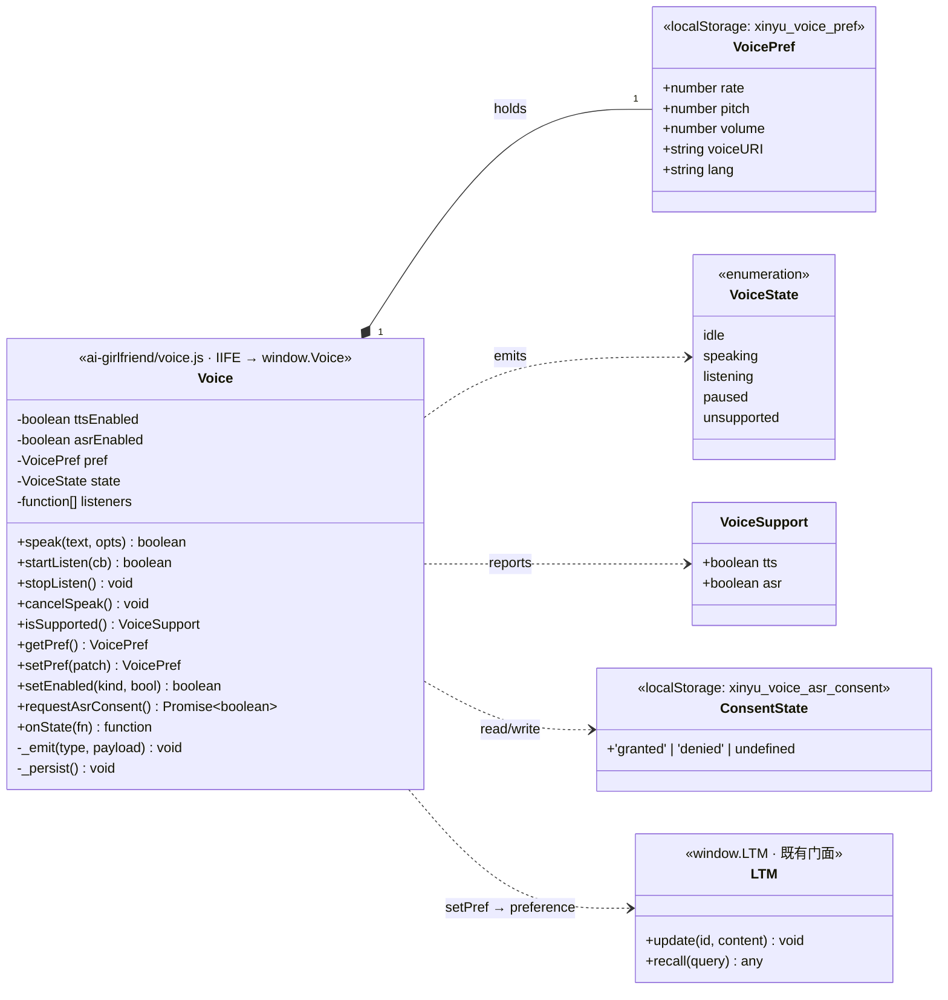
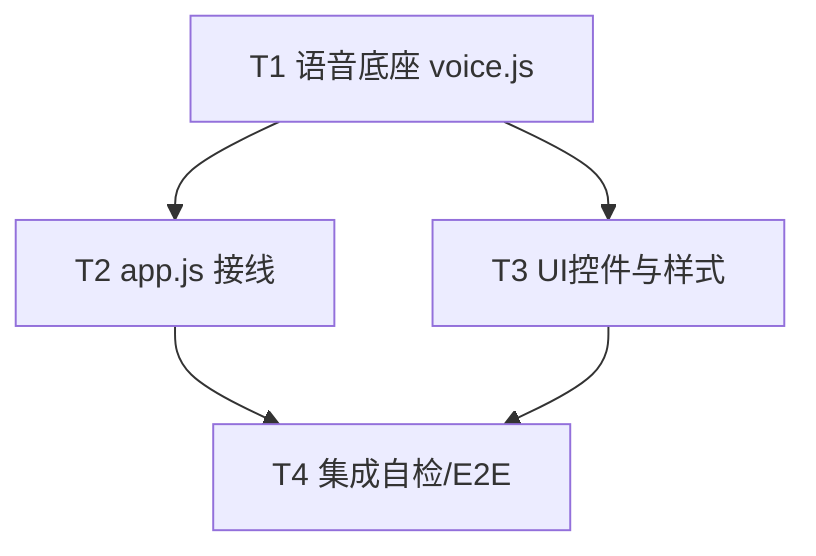

# 心屿 · 候选 B（多模态语音对话）— 系统架构设计 + 任务分解

> 架构师：**高见远（Gao）** ｜ 团队：`software-xinyu-v3-voice`
> 心智体：**小暖（Xiaonuan，固定 AI 女友人设，绝不改名/替换/意译）** ｜ 产品名：**心屿**
> 基线：v3-A 已交付（`window.LTM` 接入 app.js 回复流）；本设计是**叠加层**，不替换文字对话。
> 版本：v3-B ｜ 状态：架构设计稿（待 Engineer 实现）

---

## 0. 铁律与设计红线（不可违背）

| 红线 | 约定 |
|---|---|
| 人设名 | **小暖** 固定；产品名 **心屿**；任何代码/UI/文档不得改名、替换、意译。 |
| 隐私优先 | 语音数据**默认不留存、不上报**；ASR 若走浏览器云端服务，须 UI 显式标注且用户**单独同意**。 |
| 前端零依赖 | 原生 JS + 原生 `fetch` + Web Crypto + Web Speech API；**禁止新增任何 npm 依赖**。 |
| 冻结线（v3 不得改动） | `ai-girlfriend/engine.js`(~251068B 本地心智引擎)、`ai-girlfriend/sw.js`(v14 缓存键=19)、`ai-girlfriend/test/baseline.js`、`ai-girlfriend/memory.js`。**B 只可改 `app.js`/`index.html`/`style.css` 与新增文件**；语音靠运行时 API，无需改 sw.js。 |
| 叠加不破坏 | 语音是叠加层，**绝不替换文字对话**；不破坏 v3-A 的 `window.LTM` 回灌与既有人设。 |

> 本设计所有 `speechSynthesis` / `SpeechRecognition` 调用均包裹 `try/catch`，异常即降级为纯文字、**绝不阻塞对话**。

---

## 1. 实现方案 + 框架选型

### 1.1 技术难点分析

| 难点 | 说明 | 选型 |
|---|---|---|
| TTS 零上报、本地朗读 | 小暖每轮回复 100% 朗读 | 原生 `window.speechSynthesis` + `SpeechSynthesisUtterance`，纯本地、零上报。**默认开**。 |
| ASR 隐私与同意 | 麦克风采集若经浏览器语音服务处理，须显式同意且不留存 | 原生 `window.SpeechRecognition \|\| window.webkitSpeechRecognition`，**默认关 + 首次独立同意弹窗**；转录仅本地发送、绝不落盘/外发。 |
| 双轨并存 | 语音与文字并存，不替换文字 | Voice 为**非侵入叠加层**：app.js 文本流不变，Voice 订阅"回复事件"朗读、订阅"麦克风"事件发送。 |
| 降级 | 不支持 API 的浏览器 | 探测 `'speechSynthesis' in window` 与 `SpeechRecognition`；不支持则回退纯文字（P0-5），支持 TTS 则保留朗读。 |
| 打断 | 朗读中用户插话 | 朗读中用户启动语音即 `speechSynthesis.cancel()` 当前朗读（自然打断）。 |
| 偏好持久 | 音色/语速偏好写入 `window.LTM` | `Voice.setPref()` 显式触发 → `LTM.update('preference', {voice:{...}})`（P1）。 |

### 1.2 框架 / 库选型（零依赖，明确不新增）

- **UI 运行时**：原生 JS（IIFE 封装 `window.Voice`），无框架、无构建步骤新增。
- **语音能力**：Web Speech API —— `SpeechSynthesis`（TTS）+ `SpeechRecognition`/`webkitSpeechRecognition`（ASR）。均为浏览器原生、零依赖。
- **存储**：`localStorage`（开关/同意/偏好）+ `window.LTM`（长期偏好回灌），均为既有能力。
- **加密**：复用既有 `Web Crypto`（LTM 已用），语音路径**不引入**新加密逻辑。
- **断言/测试**：复用既有测试框架（vitest，见 `vitest.config.ts`），**不新增任何依赖**。

> **结论**：依赖包与 v3-A 完全一致，**零新增 npm 依赖**（详见 §5.1）。

### 1.3 架构模式：叠加层（Layered Overlay / 非侵入装饰器）

```
┌─────────────────────────────────────────────┐
│  index.html (语音控件 + 设置页)               │
│  style.css  (控件/波形/状态 样式, 复用 --pink) │
└───────────────┬─────────────────────────────┘
                │ DOM 事件
┌───────────────▼─────────────────────────────┐
│  app.js (回复流集成点, v3-A 已接 LTM)         │
│   - 小暖回复 → Voice.speak()                  │
│   - 麦克风按钮 → Voice.startListen() → 发送    │
│   - 朗读中插话 → Voice.cancelSpeak()          │
└───────────────┬─────────────────────────────┘
                │ 调用
┌───────────────▼─────────────────────────────┐
│  window.Voice (voice.js, IIFE, 新增)          │
│   TTS / ASR / 状态机 / 降级探测 / 偏好持久     │
└───┬───────────────────────┬─────────────────┘
    │ 运行时 API             │ localStorage / window.LTM
┌───▼──────────┐     ┌────────▼──────────────┐
│ SpeechSynthesis│     │ 偏好/同意键 + LTM.preference│
│ SpeechRecognition│   └────────────────────────┘
└──────────────┘
        （下方 engine.js / sw.js / memory.js / baseline.js 冻结，不触碰）
```

### 1.4 TTS / ASR 零上报与降级策略

- **TTS（默认开）**：`speechSynthesis.speak(utterance)`，文本仅在本地合成语音，`lang='zh-CN'`，`rate/pitch/volume` 取自偏好。无任何网络请求。
- **ASR（默认关）**：
  - 首次启用弹**独立同意窗**，明示「浏览器可能经其语音服务处理音频」；
  - 同意后仅**实时识别**，`recognition.continuous=false` 取 `final` 结果再发送；
  - 转录文本仅用于本地发送，**绝不留存 / 绝不存储 / 绝不外发给人设之外**；
  - 即便已同意，也仅实时识别、**不落盘、不存储**。
- **降级矩阵**（见 §8）：缺 TTS → 纯文字；缺 ASR → 纯文字输入；两者皆缺 → 纯文字（P0-5）。

---

## 2. 文件列表及相对路径

| 文件 | 操作 | 说明 |
|---|---|---|
| `ai-girlfriend/voice.js` | **新增** | 语音底座 IIFE，挂 `window.Voice`；封装 TTS/ASR/状态机/降级探测/偏好持久。**唯一核心新增文件**。 |
| `ai-girlfriend/app.js` | 修改 | 回复流接线朗读（小暖回复→`Voice.speak`）；麦克风按钮→`Voice.startListen`→发送；朗读中插话→`Voice.cancelSpeak`；订阅 `Voice.onState` 更新 UI。 |
| `ai-girlfriend/index.html` | 修改 | 对话页底部语音控件（麦克风按钮 / 朗读条+波形 / [暂停][静音] / 状态指示）；设置页"语音与隐私"（零上报声明、同意管理、清除偏好、语速/音色）。 |
| `ai-girlfriend/style.css` | 修改 | 语音控件、波形、状态指示样式；复用既有 token（`--pink`/`--r-card`/`--gap-*`/`--hairline` 等）。 |
| `ai-girlfriend/test/voice.test.js` | **新增** | 单元：接口契约、状态机、`isSupported` 降级探测、偏好读写。 |
| `ai-girlfriend/test/voice-zero-report.test.js` | **新增** | 零上报断言：运行时 monkey-patch `window.fetch`，`speak`/`startListen` 期间断言**无任何外发请求**。 |
| `ai-girlfriend/test/app-voice.test.js` | **新增** | 集成：回复→朗读回调、麦克风→发送等价于键盘、打断。 |
| `ai-girlfriend/test/ui-voice.test.js` | **新增** | UI：控件存在、设置项可切换、降级态渲染。 |
| `ai-girlfriend/test/e2e-voice.test.js` | **新增** | E2E/自检：TTS+ASR 全链路、降级全链路、零上报全链路。 |

### 冻结声明（明确不改动）

以下文件**本设计不触碰**，仅作为运行时依赖被读取：
`ai-girlfriend/engine.js`、`ai-girlfriend/sw.js`、`ai-girlfriend/test/baseline.js`、`ai-girlfriend/memory.js`、`ai-girlfriend/longterm-memory.js`（仅调用其 `update` 门面写入偏好，不改其实现）。

---

## 3. 数据结构与接口（类图 + 字段表）

### 3.1 类图（Mermaid）



> 完整可渲染图见 `docs/class-diagram-voice.mermaid`。

### 3.2 `window.Voice` 接口字段表

| 方法 / 属性 | 签名 | 说明 | 异常/降级 |
|---|---|---|---|
| `speak` | `(text:string, opts?:{lang?:string,rate?:number,pitch?:number,volume?:number}) => boolean` | 朗读文本；返回是否真正开始朗读。内部 `try/catch`，不支持 TTS 返回 `false` 且 `onState('unsupported')`。 | 失败→降级纯文字，不阻塞。 |
| `startListen` | `(onFinal:(text:string)=>void, onInterim?:(text:string)=>void) => boolean` | 启动 ASR（需已同意+已启用）；`continuous=false` 取 `final` 发送。 | 未同意/不支持→`onState('consent_required'\|'unsupported')`，返回 `false`。 |
| `stopListen` | `() => void` | 停止 ASR（`recognition.abort()`）。 | 空操作若未监听。 |
| `cancelSpeak` | `() => void` | `speechSynthesis.cancel()` 打断当前朗读。 | 无朗读时空操作。 |
| `isSupported` | `() => {tts:boolean, asr:boolean}` | 降级探测：`'speechSynthesis' in window` 与 `!!(window.SpeechRecognition \|\| window.webkitSpeechRecognition)`。 | — |
| `getPref` | `() => VoicePref` | 读取偏好（含默认值）。 | — |
| `setPref` | `(patch:Partial<VoicePref>) => VoicePref` | 合并并持久化偏好；**显式触发**时（P1）写入 `LTM.update('preference',{voice})`。 | 写入 LTM 失败不抛错。 |
| `setEnabled` | `(kind:'tts'\|'asr', on:boolean) => boolean` | 切换开关并写 `localStorage`；ASR 开且未同意时返回 `false` 并触发同意流。 | — |
| `requestAsrConsent` | `() => Promise<boolean>` | 弹独立同意窗；`granted` 写 `xinyu_voice_asr_consent`。 | 拒绝→`false`。 |
| `onState` | `(fn:(s:{type:VoiceState, payload?:any})=>void) => ()=>void` | 订阅状态变化，返回取消订阅函数。 | — |

### 3.3 localStorage 键约定（全部前缀 `xinyu_voice_`）

| 键 | 类型 / 值 | 说明 |
|---|---|---|
| `xinyu_voice_tts_enabled` | `'true' \| 'false'`（默认 `'true'`） | TTS 开关（本地零上报，默认开）。 |
| `xinyu_voice_asr_enabled` | `'true' \| 'false'`（默认 `'false'`） | ASR 开关（默认关，需同意）。 |
| `xinyu_voice_asr_consent` | `'granted' \| 'denied' \| undefined` | ASR 独立同意状态。 |
| `xinyu_voice_pref` | JSON 字符串，见 `VoicePref` | 音色/语速/音量/voiceURI/lang。 |

### 3.4 与 `window.LTM` 写入约定（隐私优先）

- **写入字段**：`LTM.update('preference', { voice: { rate, pitch, volume, voiceURI, lang } })`。
- **类型**：`rate:number(0.5–2)`、`pitch:number(0–2)`、`volume:number(0–1)`、`voiceURI:string|null`、`lang:'zh-CN'`。
- **触发时机（P1，关键）**：**仅当用户在设置页显式调节音色/语速并保存时**由 `Voice.setPref` 触发写入；**不静默写入**，避免隐私顾虑。
- **语音内容**：默认**不**把语音转录内容当长期记忆；仅命中既有蒸馏句式时才按 v3-A 既有 `LTM` 蒸馏逻辑纳入（与文字路径一致，不新增逻辑）。
- **零上报自证**：测试断言 `Voice` 与 `app.js` 语音路径**无任何 `fetch` 到语音/音频端点**；运行时可 monkey-patch `window.fetch` 记录调用，`speak`/`startListen` 期间断言调用数 = 0（见 `voice-zero-report.test.js`）。

---

## 4. 调用流程（Mermaid 时序图）

> 完整可渲染图见 `docs/sequence-diagram-voice.mermaid`（含 ① 回复→朗读、② 麦克风→发送、③ 设置同意/降级/偏好 三条流）。

### 4.1 ① 小暖回复 → TTS 朗读

```
app.js (XiaonuanApp) → Voice.speak(replyText)
  Voice: isSupported().tts?
    ├─ 支持: SpeechSynthesisUtterance(text); lang='zh-CN'; rate/pitch/volume=pref
            → speechSynthesis.speak() → onState('speaking') → onend → onState('idle')
    └─ 不支持(降级): onState('unsupported',{tts:false}) → 纯文字展示，不阻塞
```

### 4.2 ② 用户麦克风 → ASR → 文本 → 发送流（与键盘等价）

```
用户单击/长按 麦克风 → Voice.startListen(onFinal)
  Voice: isSupported().asr && asrEnabled && consent?
    ├─ 已同意且支持: recognition.lang='zh-CN'; continuous=false; interimResults=true
            → recognition.start() → onState('listening')
            → onresult: 取 final → onFinal(transcript)
            → app.sendMessage(transcript)  // 与键盘输入完全等价
            → LTM 回灌(既有, 不变) → 小暖回复(文字 + TTS)
    └─ 未同意/不支持(降级): onState('consent_required'|'unsupported') → 回退纯文字输入
```

### 4.3 ③ 设置同意 / 降级 / 偏好持久化

```
用户启用 ASR → Voice.setEnabled('asr', true)
  Voice: 读 xinyu_voice_asr_consent
    ├─ 无同意: onState('consent_required') → 设置页弹独立同意窗(标注浏览器可能处理音频)
            → 用户同意 → xinyu_voice_asr_consent='granted' → setEnabled 再次生效
    └─ 已同意: xinyu_voice_asr_enabled='true'  // 零上报：此过程无任何 fetch
用户调语速/音色 → Voice.setPref({rate,pitch})
    → xinyu_voice_pref=JSON → (P1 显式) LTM.update('preference',{voice:{...}})
```

---

## 5. 有序任务列表（T1..T4）

> **关于"首个任务须为项目基础设施"规则的偏离说明**：本任务是在**已交付的 vanilla-JS 应用**上做**增量叠加层**，无新建构建/脚手架/依赖声明需求（`package.json` 零改动）。因此将"功能基础设施"——即被其余所有任务依赖的**语音底座 `voice.js`**——作为 T1，而非新建配置文件任务。任务总数 4（≤5 上限），每个任务 ≥3 个相关文件，按依赖顺序编排。

### 5.1 依赖包列表（仅现有，无新增）

```
- （无新增 npm 依赖）
- 运行时仅用浏览器原生能力：Web Speech API(SpeechSynthesis/SpeechRecognition)、localStorage、Web Crypto(既有复用)
- 测试复用既有 vitest（见 vitest.config.ts），不新增测试库
- 既有依赖（不新增/不升级）：与 v3-A 完全一致
```

### 5.2 任务表

| TaskID | 任务名 | 源文件（创建/修改） | 依赖 | 优先级 |
|---|---|---|---|---|
| **T1** | 语音底座 `voice.js`（TTS/ASR/状态机/降级探测/偏好持久 + 单测 + 零上报断言） | `ai-girlfriend/voice.js`(新)、`ai-girlfriend/test/voice.test.js`(新)、`ai-girlfriend/test/voice-zero-report.test.js`(新) | 无 | P0 |
| **T2** | `app.js` 接线（回复朗读 / 麦克风发送 / 打断 / 状态订阅） | `ai-girlfriend/app.js`(改)、`ai-girlfriend/voice.js`(T1 消费)、`ai-girlfriend/test/app-voice.test.js`(新) | T1 | P0 |
| **T3** | UI 控件与样式 + 设置页（语音控件/波形/状态/同意管理/偏好） | `ai-girlfriend/index.html`(改)、`ai-girlfriend/style.css`(改)、`ai-girlfriend/test/ui-voice.test.js`(新) | T1 | P0(P0控件)/P1(波形·偏好) |
| **T4** | 集成自检与降级/E2E 验证（零上报全链路 + 降级矩阵） | `ai-girlfriend/test/e2e-voice.test.js`(新)、`ai-girlfriend/app.js`(T2 终态)、`ai-girlfriend/index.html`(T3 终态) | T1,T2,T3 | P0 |

> T1 必须最先完成（其余任务均依赖其接口契约）；T2/T3 可并行（分别依赖 T1）；T4 收口。

### 5.3 任务依赖图（Mermaid）



---

## 6. 共享知识（跨文件约定，供 Engineer）

- **音色/语速偏好存 `window.LTM` 的字段与类型**：
  `LTM.update('preference', { voice: { rate:number(0.5–2), pitch:number(0–2), volume:number(0–1), voiceURI:string|null, lang:'zh-CN' } })`
  仅当用户显式保存时由 `Voice.setPref` 触发；不静默写入。
- **同意状态 localStorage 键**：`xinyu_voice_asr_consent`（`'granted'|'denied'`）、`xinyu_voice_asr_enabled`、`xinyu_voice_tts_enabled`、`xinyu_voice_pref`（JSON）。
- **零上报自证方式**：
  1) 源码 grep 确认 `voice.js`/`app.js` 语音路径**无新增 `fetch` 到语音/音频端点**；
  2) 运行时 monkey-patch `window.fetch` 记录调用，`speak`/`startListen` 期间断言调用数 = 0（`voice-zero-report.test.js`）。
- **降级探测**：
  `const ttsOk = 'speechSynthesis' in window;`
  `const SR = window.SpeechRecognition || window.webkitSpeechRecognition; const asrOk = !!SR;`
- **语言常量**：`const VOICE_LANG = 'zh-CN';` TTS `utterance.lang` 与 ASR `recognition.lang` 统一用 `VOICE_LANG`。
- **状态广播**：所有状态变更经 `Voice.onState`，UI 仅订阅，不直接操作 `speechSynthesis`/`SpeechRecognition`。
- **打断契约**：朗读中用户触发 `startListen` 时，`Voice` 内部先 `cancelSpeak()` 再启动 ASR（自然打断）。
- **冻结线**：`engine.js`/`sw.js`/`baseline.js`/`memory.js` 不得读取改写；`voice.js` 不 import 它们，仅在运行时通过 `window.LTM` 门面交互。

---

## 7. 待明确事项：Q1–Q7 默认决策（逐条，已拍板 + 可否决标注）

> 以下逐条复述主理人（你）对 Q1–Q7 的隐私优先默认决策；我（高见远）**全部采纳**，并标注"可否决项"与简要理由。若你否决，请给理由，我将据此修订。

| # | 议题 | 我的默认决策（采纳主理人） | 可否决？ | 理由 |
|---|---|---|---|---|
| **Q1** | ASR 方案 | **双轨**：TTS 永远本地 `SpeechSynthesis`（零上报，P0 默认开）；ASR 用原生 `SpeechRecognition`（零依赖）但**默认关 + 首次独立同意弹窗 + UI 明示"浏览器可能经其语音服务处理音频"**；转录仅本地发送、绝不留存/存储/外发；离线本地 ASR 列 P2。落地 PRD ①+② 组合。 | 可否决（但我**不否决**） | 隐私代价最低，符合 PRD 与铁律。若否决改纯离线或纯关，需重评 P0 范围。 |
| **Q2** | 流式 vs 整句 | **整句**：`continuous=false`，取 `final` 再发送；`interimResults=true` 仅可选展示 interim，不强求。 | 可否决 | 简单可靠、延迟≤3s 可达。若否决改 `continuous`+interim 累积，复杂度上升，v3 不建议。 |
| **Q3** | 打断 | **朗读中用户语音启动即 `speechSynthesis.cancel()` 当前朗读**（自然打断）。 | 可否决（不否决） | 实现简单、体验自然，且与 Q2 整句模式契合。 |
| **Q4** | 语音与 LTM | 音色/语速偏好作为 `preference` 写入 `window.LTM`（P1，经 `setPref` 显式触发）；**默认不主动把语音内容当长期记忆**，仅命中既有蒸馏句式才纳入。 | 可否决 | 我补充：写入 LTM 须由用户在设置页**显式操作**，避免静默写入引发隐私顾虑。若希望语音内容也蒸馏，需明确开关且默认关。 |
| **Q5** | 默认开关 | **TTS 默认开**（本地零上报安全）；**ASR 默认关**（需同意）；状态存 `localStorage`。 | 可否决（不否决） | 与 Q1/Q6 一致，隐私安全基线。 |
| **Q6** | 端侧留存 | **任何情况不留存音频/转录**；即便云端 ASR 已同意，也仅实时识别、不落盘、不存储。 | **不可否决（铁律）** | 隐私红线，无讨论空间。 |
| **Q7** | 降级 | 不支持 `SpeechRecognition` → 降级纯文字（P0-5）；若 `SpeechSynthesis` 支持则保留朗读。 | 可否决（不否决） | 保证 100% 降级覆盖，不破坏对话。 |

---

## 8. 风险与降级矩阵

| 场景 | 探测 | 行为 | 是否阻断对话 |
|---|---|---|---|
| 无 `speechSynthesis` | `'speechSynthesis' in window === false` | 仅文字，不朗读 | 否 |
| 无 `SpeechRecognition` | `!!(window.SpeechRecognition \|\| webkitSpeechRecognition) === false` | 麦克风按钮禁用/隐藏，纯文字输入 | 否 |
| ASR 未同意 | `xinyu_voice_asr_consent !== 'granted'` | 点击麦克风弹同意窗，拒绝则纯文字 | 否 |
| TTS 抛异常 | `try/catch` 捕获 | `onState('unsupported')`，纯文字 | 否 |
| ASR 抛异常/无结果 | `onerror`/`onnomatch` | `stopListen`，提示重试，纯文字 | 否 |
| 朗读中被打断 | 用户启动 ASR | `cancelSpeak()` | 否 |

---

## 9. 验收口径（对齐 PRD 目标）

- TTS 朗读覆盖 **100%**（每轮小暖回复均触发 `speak`）。
- ASR 显式同意率 **100%**（未同意绝不启动采集）。
- 零上报：**测试断言无任何 fetch 到语音端点**。
- 语音输入延迟 ≤ **3s**（整句 `final` 回传）。
- 降级 **100%**（不支持 API 回退纯文字，不阻断）。
- 语音与文字**双轨并存**，不破坏 `window.LTM` 回灌与既有人设。

> 交付物：`docs/system_design_voice_B.md`（本文件）、`docs/class-diagram-voice.mermaid`、`docs/sequence-diagram-voice.mermaid`。
