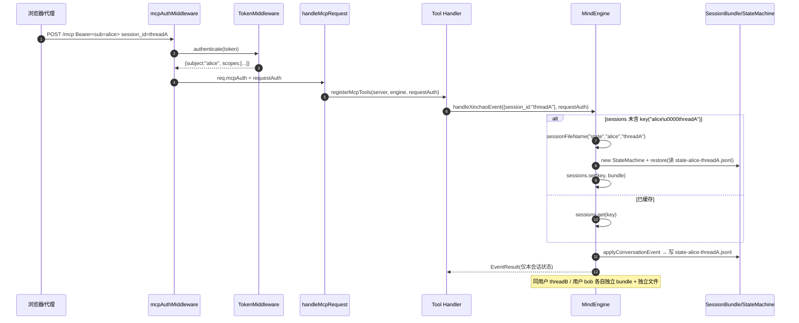
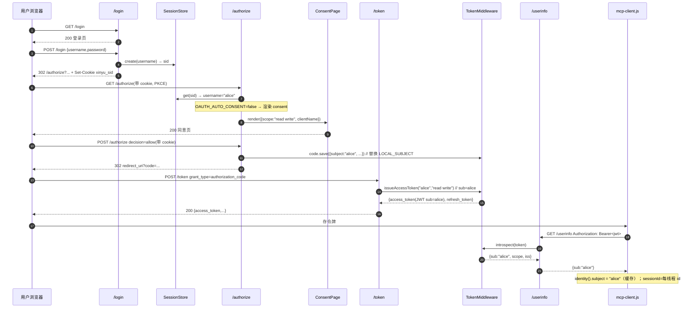
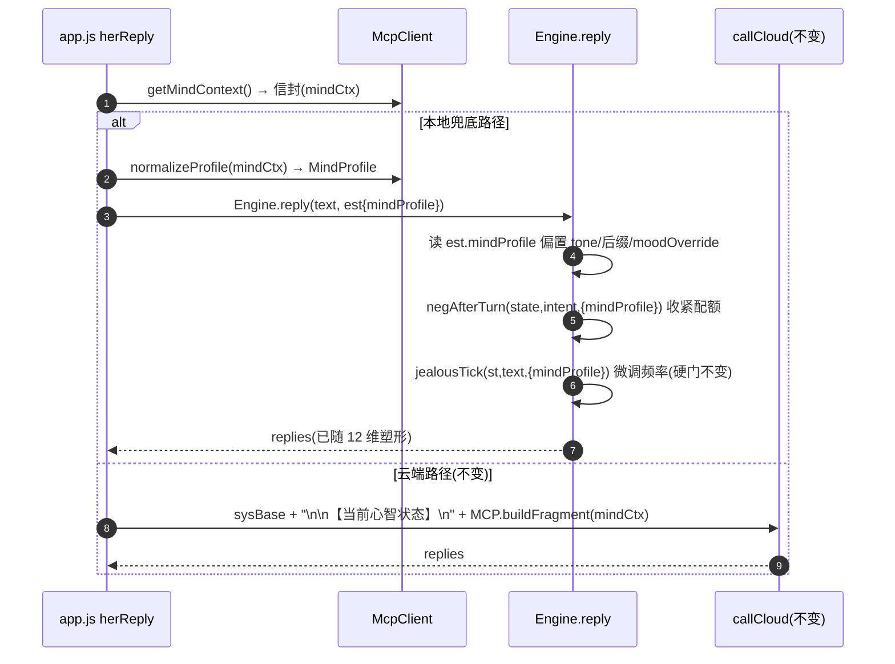
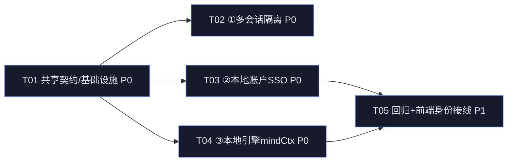

# 心屿 · v2 三特性增强设计文档（① 多会话隔离 / ② 本地账户 SSO / ③ 本地引擎消费 mindCtx）

> 架构师：高见远（Bob / software-architect）｜ 产品名：**心屿** ｜ 心智体：**小暖**（不可改名）
> 铁律（继承）：100% 自研 MIT；不使用 ombre-brain / 第三方「心潮」；**零新增 npm 依赖**；保留 3 个 MCP 工具的 `read`/`write` scope 语义与 `/authorize`/`/token`/`/introspect`/`/revoke`/`/health` 端点。
> 用户已拍板：**三个增强「都做」**（① 多会话隔离、② 真实账户 SSO、③ 本地引擎桥接 12 维 mindCtx）。

---

## 0. 已锁定的决策（直接采用，不再争论）

| # | 决策点 | 取值 |
|---|---|---|
| D1 | ① 会话键 | 复合键 `(subject, session_id)`。`MindEngine` 改为**注册表**，每个条目持有独立 `StateMachine`+`MemoryStore`+`IdempotencyStore`，经 `JsonlStore` 以**命名空间文件名**落盘。 |
| D2 | ② SSO 模型 | 本地自托管账户（**无外部 IdP**）；`node:crypto` scrypt 哈希口令（零新依赖）；`/authorize` 前插入登录；`OAUTH_AUTO_CONSENT` 置 `false` 使 consent 页按账户展现；授权码 `subject` = 真实账户 id。 |
| D3 | ③ mindCtx 缝 | 将 12 维 `state_vector` **归一化为紧凑 `MindProfile`**，注入本地 `Engine.reply(text, state)` / `negAfterTurn(state, intent, ctx)` 做回复塑形偏置；云端 `buildFragment` 注入（app.js:1457）**保持不变**；两套状态系统（MCP 12 维 vs 本地 `S`）**分离但交叉喂送**，最小侵入、不破任何既有护栏。 |
| D4 | 身份链路 | OAuth 登录 → 会话 cookie → `/authorize` 读 cookie 置 `code.subject=账户id` → `/token` 签发 `sub=账户id` 的 HS256 JWT → `mcpAuthMiddleware` 解 `requestAuth.subject` → ① 会话键 `('账户id','threadId')` → ③ 按账户隔离状态。**一套身份贯穿三特性。** |
| D5 | engine.js 冻结解除 | 此前 engine.js 为「T5a 零 diff」冻结态；③ 经用户明确「都做」**有意解除冻结**，仅做**加法式**改动（新增可选字段 + 少量偏置分支），不重命名、不删/松任何危机/NEG/吃醋护栏。 |

---

## 1. 总览

```
                        ② 本地账户 SSO
       浏览器 ──/login──▶ SessionStore(设 xinyu_sid cookie)
              └──/authorize(带 cookie)──▶ ConsentPage(per-account)──▶ code.subject = 账户id
              └──/token──▶ JWT{sub=账户id, scope, scopes, iss, jti}
                                     │
                                     ▼
       ① 多会话隔离        mcpAuthMiddleware ──authenticate──▶ requestAuth.subject=账户id
       浏览器 ──POST /mcp(Bearer, session_id=threadId)──▶ MindEngine.getSession(subject,threadId)
                            └─ Map<sessionKey, {state,memory,idem}>（命名空间文件落盘）
                                     │
                                     ▼
       ③ 本地引擎消费 mindCtx   app.js: MCP.getMindContext() → 信封 → normalizeProfile()
                            → est.mindProfile → Engine.reply(text, est) 读 mp 偏置 tone/NEG/吃醋/mood
                            （云端 callCloud 仍用 MCP.buildFragment 注入 system prompt，不变）
```

---

## 2. ① 多会话隔离

### 2.1 方案与理由

**难点**：`MindEngine` 当前为单例，内部写死一份 `state/memory/idem`（`tools.ts:78-85`），所有流量共享同一 12 维状态；`JsonlStore` 以单文件名（`state.jsonl`/`memory.jsonl`/`idempotency.jsonl`，`config.ts:87-90`）落盘，无法按用户/线程区分。`stateMachine.ts:11` 的 A4 注释已预留「`getState(sessionId)` 后续扩展」。

**选定方案**：把 `MindEngine` 从「单例引擎」改为「**会话注册表**」：
- 保留 `MindEngine` 类名（对 `app.ts`/`middleware.ts`/测试最小改动）。
- 新增 `Map<sessionKey, SessionBundle>`，`sessionKey = subject + "\u0000" + sessionId`（内部键，零歧义）。
- `getSession(subject, sessionId): SessionBundle`：**命中缓存即返回**；未命中则按命名空间文件名新建 `StateMachine`+`MemoryStore`+`IdempotencyStore`，并从对应 `state-<safe>-<sid>.jsonl` 恢复最近状态后缓存。
- **向后兼容（关键，保证既有 `mcp.test.ts` 11 例零改动仍绿）**：`EngineDeps` 中注入的 `state/memory/idem` 作为「首个被解析会话」所采纳的**默认会话包**（沿用旧单例语义），之后**任何不同键**解析出独立、隔离、命名空间落盘的包。理由是既有测试共享同一 `JsonlStore` 目录与固定文件名（`memory.jsonl`），首个会话沿用注入包即可让 harness 的 `h.memory.retrieve` 命中同一底层文件。

**理由**：① 完全延续「无状态每请求 / 引擎单实例共享」的传输层模型（`app.ts` 每请求 `new McpServer` + `registerMcpTools(server, engine, requestAuth)`，引擎是唯一的注册表）；② 跨用户隔离自然由 `subject` 落差分文件实现，同用户不同线程由 `session_id` 落差分文件；③ 工具 handler 签名不变（已收 `session_id` + `requestAuth.subject`），仅内部改走 `getSession`；④ 零新依赖，复用既有 `JsonlStore`/`MemoryStore`/`IdempotencyStore`/`StateMachine`。

### 2.2 文件列表（①）

| 文件 | 变更 | 说明 |
|---|---|---|
| `src/mcp/session.ts` | **新** | `SessionBundle` 接口；`sessionKey(subject, sessionId)`；`sessionFileName(collection, subject, sessionId)`（命名空间规则）；`DEFAULT_SESSION_KEY`/`DEFAULT_SESSION_ID`。 |
| `src/mcp/tools.ts` | 改 | `MindEngine`：删 `state/memory/idem` 写死字段 → 改持 `sessions: Map` + 单 `JsonlStore`(stateStore)；新增 `getSession()`；`handleXinchaoContext/Event/HandoffNote` 改走 `getSession(requestAuth.subject, args.session_id)`；`persistState/restoreState` 改为按会话键落盘/恢复。 |
| `src/storage/memoryStore.ts` | 改 | `MemoryStore` 构造签名加可选 `files?: { memory?: string; handoff?: string }`（缺省回退 `MEMORY_FILE`/`HANDOFF_FILE`），向后兼容 `new MemoryStore(store)`。 |
| `src/storage/idempotency.ts` | 改 | `IdempotencyStore` 构造签名加可选 `file?: string`（缺省 `IDEM_FILE`），向后兼容。 |
| `src/index.ts` | 改 | bootstrap 去掉 `engine.restoreState()` 全局调用（改由 `getSession` 惰性按文件恢复）；其余构造不变。 |
| `src/__tests__/session.test.ts` | **新** | ① 新测试：同用户两会话独立 / 两用户独立 / 跨请求同键复用 / 重启后按文件恢复。 |

---

## 3. ② 本地账户 SSO

### 3.1 方案与理由

**难点**：`authorize.ts:135` 硬编码 `subject: LOCAL_SUBJECT`（设备单身份）；`OAUTH_AUTO_CONSENT` 默认 `true` 跳过 consent；无账户体系；`mcp-client.js#identity()`（line 108-111）用设备 id 当 subject。

**选定方案**（隐私优先、100% 自研、零新依赖）：
- **账户存储** `AccountStore`（`src/oauth/accounts.ts`）：用户名 + `crypto.scryptSync(pw, salt, 64)` 哈希 + salt；方法 `create(username,pw)` / `verify(username,pw)`（`timingSafeEqual`）/ `exists` / `list`。落盘 `.data/accounts.jsonl`（沿用 `JsonlStore`）。**首跑引导**：bootstrap 时若无任何账户，创建默认账户 `owner`（口令取 `XY_OWNER_PASSWORD` 环境变量，未设则随机生成、打印控制台并写入 `.data/owner-credentials.txt`）。
- **登录会话** `SessionStore`（`src/oauth/session.ts`）：`create(username)→sid` / `get(sid)→username|null` / `destroy(sid)`；内存表 + `httpOnly` cookie `xinyu_sid`（无 `Secure` 仅本地，生产可开）。
- **`/login`**（`src/oauth/login.ts` 新）：GET 渲染极简登录页；POST 校验 credential → `SessionStore.create` → `Set-Cookie: xinyu_sid=...; HttpOnly; Path=/; SameSite=Lax` → 302 回 `?redirect=`（`/authorize` 原 URL）。
- **`/authorize` 改造**（`src/oauth/authorize.ts`）：在既有 client/redirect/PKCE/scope 校验**之前**插入登录闸门——若无有效 `xinyu_sid` 会话 → 302 到 `/login?redirect=<原 authorize URL>`；有会话则 `subject = session.username`（替换 `LOCAL_SUBJECT`），其余流程不变；因 `OAUTH_AUTO_CONSENT=false`，渲染 consent 页（per-account，展示申请 scope）。
- **`/token` 无需改逻辑**：`token.ts` 的 `createTokenHandler` 已把 `code.subject` 透传为 JWT `sub`（见 `oauth/token.ts` 既有的 `sub: code.subject`）。只改上游 `authorize` 写入的 `subject` 即可让 `sub` 变成真实账户 id。
- **`/userinfo`**（`src/oauth/userinfo.ts` 新）：`Authorization: Bearer <jwt>` → `introspect` → 返回 `{ sub, scope, iss }`，供前端拿真实 `subject`。
- **`OAUTH_AUTO_CONSENT`**（`config.ts`）：默认值由 `'true'` 改为 `'false'`（`OAUTH_AUTO_CONSENT = (process.env.OAUTH_AUTO_CONSENT ?? 'false') !== 'true'`），使 consent 页按账户展现。
- **前端 `identity()`**（`mcp-client.js`）：`subject` 改为经 `/userinfo` 取令牌 `sub`（缓存一次），`sessionId` 保持每线程 id（见 ③/Open items）。写 `event`/`context` 时仍带 `session_id`（后端用其做内存隔离）；后端本就以 `requestAuth.subject` 为准，`args.subject` 为冗余兼容字段（保留以备调试）。

**理由**：① 不引入任何外部 IdP / 第三方库，满足「零新增依赖 + 100% 自研」；② scrypt 是 Node 内置，抗 GPU 暴力；③ 登录闸门 + consent 双步，隐私优先且合规；④ `sub` 透传链路零改 `token.ts`，与既有 `verify` 兼容桥、中间件 401 门禁完全兼容。

### 3.2 文件列表（②）

| 文件 | 变更 | 说明 |
|---|---|---|
| `src/oauth/accounts.ts` | **新** | `AccountStore`（`create`/`verify`/`exists`/`list`，scrypt，落盘 `accounts.jsonl`）。 |
| `src/oauth/session.ts` | **新** | `SessionStore`（登录会话，内存，cookie 绑定）。 |
| `src/oauth/login.ts` | **新** | `createLoginHandler({ accounts, sessions })`：GET 页 / POST 校验设 cookie。 |
| `src/oauth/authorize.ts` | 改 | 插入登录闸门（`xinyu_sid` 缺失→302 `/login`）；`subject = session.username` 替换 `LOCAL_SUBJECT`；从 `opts` 取 `sessions`。 |
| `src/oauth/userinfo.ts` | **新** | `createUserinfoHandler({ auth })`：`Bearer`→`introspect`→`{sub,scope,iss}`。 |
| `src/oauth/index.ts` | 改 | `OAuthServer` 构造注入 `accounts`+`sessions`；`register` 挂载 `/login`（GET/POST）与 `/userinfo`（Bearer+CORS）。 |
| `src/config.ts` | 改 | `OAUTH_AUTO_CONSENT` 默认 `false`；新增 `XY_OWNER_PASSWORD`/`ACCOUNT_FILE` 常量。 |
| `src/__tests__/oauth-sso.test.ts` | **新** | ② 新测试：真实 `sub` 进 JWT、autoConsent=false 时 consent 必现、账户登录发码、未登录被挡。 |

---

## 4. ③ 本地引擎消费 mindCtx（含 engine.js 冻结解除）

### 4.1 方案与理由

**难点**：云端路径已注入 12 维片段（`app.js:1457` `sysContent = sysBase + "\n\n【当前心智状态】\n" + MCP.buildFragment(mindCtx)`），但**本地引擎** `Engine.reply(text, est)`（`engine.js:2860`）与 `negAfterTurn`（`engine.js:3730`）完全忽略 `mindCtx`（`est.mindCtx` 仅存 console，`app.js:1090`）。本地兜底路径是用户离线/无云端时的主路径，却对 12 维状态「视而不见」。

**选定方案**（最小侵入、加法式）：
- **归一化**（`mcp-client.js#normalizeProfile(envelope)` 新）：从信封 `state_vector`（12 维）算出紧凑 `MindProfile`（见 §8 共享知识），含 `top[]`/`dominant`/`possessive`/`libido`/`negative`/`boredom`/`arousal`/`coherence` 等派生信号。
- **注入**（`app.js`）：本地兜底分支构造 `est` 时新增 `mindProfile: MCP.normalizeProfile(mindCtx)`（`mindCtx` 为已拉取信封，`app.js:1060`）。云端分支**不改**（仍用 `buildFragment`）。
- **消费**（`engine.js`，4-lock lift，纯加法）：
  1. `reply(text, state)` 顶部读 `const mp = state.mindProfile || null;`，派生 `clingyBias=mp?.possessive`、`sootheBias=mp?.negative`、`boredBias=mp?.boredom`。
  2. **tone/后缀**：`suffixPool` 选择时，若 `mp` 存在且 `dominant ∈ {possess,crave,libido,share}` 且 `clingyBias>0.5` → 倾向 `MOODS[3].suffix`（黏人）；若 `sootheBias>0.5` → 额外压低俏皮后缀概率（与既有 `ueSuppressesLevity` 同口径叠加，不替换）。`moodOverride`：`angry_words` 时若 `sootheBias>0.5` 仍走 `MOODS[0]`（更温柔），不删除既有分支。
  3. **吃醋门（G2）**：`jealousTick(st, text, ctx)` 把 `mp` 经 `ctx.mindProfile` 传入；`jealousAllow` 在**硬门（lv≥3 / 关系≥14d / 30d 冷却 / G1 negAllow）全部通过**的前提下，若 `(possessive+crave)/2 > 0.6` 则把 7/14d 频率窗略收紧（更敏感）——**绝不绕过任何硬门**，只调频率这一软参数。
  4. **NEG 给台阶（G1）**：`negAfterTurn(state, intent, { now, mindProfile })` 把 `mp` 透传给 `negAllow`；当 `mp.negative` 偏高（用户 12 维呈 anger/grieve）时，把该家族日配额/同类冷却**略收紧**，使「给台阶」更早触发（正向行为：用户情绪低落时她更快软下来），不删除 `negRepair`/不松 `negAllow` 的拦截语义。
- **护栏**：以上全部为「偏置/增益」式加法；既有危机安全网（`detectCrisis`）、`outGuard`/`PERSONA_BREAK_RE` 漏斗、`negAllow` 拦截、`jealousAllow` 六重与门、`GUILT_TRIP_RE`/`ACCUSE_RE` 出口漏斗**一字不改**；不重命名 `小暖`/任何人格常量；`mp` 为 `null` 时行为与今天逐字节一致（保证 42 前端自测 + 既有关卡测试零回归）。

**理由**：① 两套状态系统职责分离（MCP 12 维为「云端/跨端长期心绪」，本地 `S` 为「当轮对话人格状态」），仅单向交叉喂送，避免状态耦合爆炸；② 归一化到 `MindProfile` 而非裸 12 维，本地引擎无需理解 12 维语义，改动面收敛在 `reply`/`negAfterTurn` 两函数；③ 加法式改动使回归风险可控，且 `mp=null` 完全回退。

### 4.2 文件列表（③）

| 文件 | 变更 | 说明 |
|---|---|---|
| `ai-girlfriend/mcp-client.js` | 改 | 新增 `normalizeProfile(envelope): MindProfile`；`identity()` 改从 `/userinfo` 取 `subject`（缓存）。 |
| `ai-girlfriend/app.js` | 改 | 本地兜底 `est` 注入 `mindProfile: MCP.normalizeProfile(mindCtx)`（`mindCtx` 已拉取）；云端分支不动。 |
| `ai-girlfriend/engine.js` | 改（4-lock lift） | `reply` 顶部读 `state.mindProfile` 做 tone/后缀/moodOverride 偏置；`jealousTick`/`jealousAllow` 经 `ctx.mindProfile` 微调频率；`negAfterTurn` 透传 `mindProfile` 给 `negAllow` 收紧配额。 |
| `ai-girlfriend/test/engine-mindprofile.test.js` | **新** | ③ 新测试：dominant=possess 时回复更黏人 / dominant=anger 时更早给台阶 / mp=null 行为与基线一致。 |
| `src/types/index.ts` | 改 | 新增 `MindProfile` 接口（前端/后端共享形状，见 §8）。 |

---

## 5. 类图（mermaid）

> 完整可渲染版见 `docs/class-diagram.mermaid`（已覆盖 v1 Route B + 以下 v2 新增）。

```mermaid
classDiagram
    direction LR

    %% ---- v1 Route B 既有（精简保留） ----
    class TokenMiddleware {
        <<src/auth/token.ts>>
        +issue(subject, scopes): string
        +issueAccessToken(subject, scope): IssuedAccessToken
        +authenticate(token): AuthOutcome
        +introspectToken(token): TokenClaims|null
    }
    class MindEngine_v1 {
        <<src/mcp/tools.ts · v1 单例>>
        -state / memory / idem
    }

    %% ---- ① 多会话注册表 ----
    class MindEngine {
        <<src/mcp/tools.ts · v2 注册表>>
        -sessions: Map~string, SessionBundle~
        -stateStore: JsonlStore
        +getSession(subject, sessionId): SessionBundle
        +handleXinchaoContext(args, requestAuth)
        +handleXinchaoEvent(args, requestAuth)
        +handleHandoffNote(args, requestAuth)
    }
    class SessionBundle {
        <<src/mcp/session.ts · 新>>
        +state: StateMachine
        +memory: MemoryStore
        +idem: IdempotencyStore
    }
    class SessionHelpers {
        <<src/mcp/session.ts · 新>>
        +sessionKey(subject, sessionId): string
        +sessionFileName(coll, subject, sessionId): string
    }
    class StateMachine {
        <<src/state/stateMachine.ts>>
        +getState(): StateVector
        +applyConversationEvent(e): StateDelta
        +loadState(v): void
    }
    class MemoryStore {
        <<src/storage/memoryStore.ts · 改>>
        +files: {memory?, handoff?}
        +retrieve(sid, v, k): EmotionalMemory[]
    }
    class IdempotencyStore {
        <<src/storage/idempotency.ts · 改>>
        +file?: string
        +get(id): EventResult|null
    }

    %% ---- ② 本地账户 SSO ----
    class AccountStore {
        <<src/oauth/accounts.ts · 新>>
        +create(username, pw): void
        +verify(username, pw): boolean
        +exists(u): boolean
    }
    class SessionStore {
        <<src/oauth/session.ts · 新>>
        +create(username): sid
        +get(sid): username|null
        +destroy(sid): void
    }
    class LoginHandler {
        <<src/oauth/login.ts · 新>>
        +createLoginHandler(opts)
    }
    class AuthorizeHandler {
        <<src/oauth/authorize.ts · 改>>
        -sessions: SessionStore
        +loginGate(): 302 /login
        +subject = session.username
    }
    class UserinfoHandler {
        <<src/oauth/userinfo.ts · 新>>
        +createUserinfoHandler(auth)
    }
    class ConsentPage {
        <<src/oauth/consent.ts>>
        +render(view): string
    }
    class OAuthServer {
        <<src/oauth/index.ts · 改>>
        +register(app): /login /userinfo
    }

    %% ---- ③ 本地引擎 mindCtx 桥 ----
    class McpClient {
        <<ai-girlfriend/mcp-client.js · 改>>
        +normalizeProfile(env): MindProfile
        +identity(): {subject, sessionId}
    }
    class AppJs {
        <<ai-girlfriend/app.js · 改>>
        +est.mindProfile = normalizeProfile(mindCtx)
        +callCloud 不变(buildFragment)
    }
    class Engine {
        <<ai-girlfriend/engine.js · 改·4-lock lift>>
        +reply(text, state): 读 state.mindProfile
        +negAfterTurn(state, intent, ctx): ctx.mindProfile
        +jealousTick(st, text, ctx): ctx.mindProfile
    }
    class MindProfile {
        <<src/types/index.ts · 新>>
        +top: {key,value,label}[]
        +dominant: DimensionKey|null
        +possessive / libido / negative / boredom / arousal / coherence: number
    }

    MindEngine --> SessionBundle : getSession 缓存
    MindEngine ..> SessionHelpers : sessionKey/sessionFileName
    SessionBundle --> StateMachine
    SessionBundle --> MemoryStore
    SessionBundle --> IdempotencyStore
    MindEngine_v1 <|-- MindEngine : 重构为注册表(同名)
    TokenMiddleware ..> MindProfile : JWT sub=账户id

    OAuthServer --> LoginHandler
    OAuthServer --> UserinfoHandler
    OAuthServer --> AuthorizeHandler
    AuthorizeHandler --> SessionStore : 读 xinyu_sid
    AuthorizeHandler --> AccountStore : 隐含(经 session)
    LoginHandler --> AccountStore : verify
    LoginHandler --> SessionStore : create
    AuthorizeHandler --> ConsentPage : autoConsent=false 渲染
    AuthorizeHandler ..> TokenMiddleware : code.subject=账户id
    UserinfoHandler --> TokenMiddleware : introspect

    AppJs --> McpClient : getMindContext / normalizeProfile
    McpClient ..> MindProfile : 产出
    AppJs ..> Engine : reply(text, est.mindProfile)
    Engine ..> MindProfile : 偏置 tone/NEG/吃醋
    TokenMiddleware ..> AccountStore : sub=username
```

---

## 6. 时序图（mermaid）

> 完整可渲染版见 `docs/sequence-diagram.mermaid`（含以下三段）。

### 6.1 ① 多会话隔离（getSession 命中/未命中）



### 6.2 ② 本地账户 SSO（登录 → consent → token → userinfo）



### 6.3 ③ mindCtx → 本地引擎桥



---

## 7. 任务分解（T01..T05，≤5 任务，每任务 ≥3 文件，标注 P0）

> 依赖规则：T01 为共享基础（无依赖）；T02/T03/T04 **可并行**（仅依赖 T01）；T05 依赖 T03+T04 收尾回归。

### T01 · P0 · 共享身份契约与基础设施
- **源文件**：`src/config.ts`、`src/types/index.ts`、`src/mcp/session.ts`、`src/oauth/accounts.ts`、`src/oauth/session.ts`
- **依赖**：无（所有后续任务的基础，建议最先开工）
- **内容**：
  1. `config.ts`：`OAUTH_AUTO_CONSENT` 默认 `false`；新增 `XY_OWNER_PASSWORD`、`ACCOUNT_FILE='accounts.jsonl'`、`SESSION_COOKIE='xinyu_sid'` 常量。
  2. `types/index.ts`：新增 `MindProfile` 接口（§8 形状）；`SessionIdentity = { subject: string; sessionId: string }`；`AccountRecord`。
  3. `mcp/session.ts`：`SessionBundle` 接口；`sessionKey(subject, sessionId)`（null 分隔）；`sessionFileName(collection, subject, sessionId)`（安全字符清洗 + 截断 64）；`DEFAULT_SESSION_ID='default'`。
  4. `oauth/accounts.ts`：`AccountStore`（scrypt `create/verify/exists/list`，落盘 `ACCOUNT_FILE`）。
  5. `oauth/session.ts`：`SessionStore`（内存登录会话，`create/get/destroy`）。

### T02 · P0 · ① 多会话隔离（后端）
- **源文件**：`src/mcp/tools.ts`、`src/storage/memoryStore.ts`、`src/storage/idempotency.ts`、`src/index.ts`、`src/__tests__/session.test.ts`
- **依赖**：T01
- **内容**：`MindEngine` 改注册表（`getSession` + 默认包兼容 + 命名空间落盘/恢复）；`MemoryStore`/`IdempotencyStore` 加可选文件参数（向后兼容）；`index.ts` 去全局 `restoreState`；新增 `session.test.ts`（同用户两会话独立 / 两用户独立 / 重启恢复）。

### T03 · P0 · ② 本地账户 SSO（后端）
- **源文件**：`src/oauth/authorize.ts`、`src/oauth/login.ts`、`src/oauth/userinfo.ts`、`src/oauth/index.ts`、`src/__tests__/oauth-sso.test.ts`
- **依赖**：T01
- **内容**：`authorize.ts` 登录闸门 + `subject=session.username`；新增 `login.ts`/`userinfo.ts`；`index.ts` 挂载 `/login`+`/userinfo` 并注入 `accounts`/`sessions`；新增 `oauth-sso.test.ts`（真实 `sub`、consent 必现、登录发码、未登录被挡）。首跑默认账户引导在 `OAuthServer` 构造或 `index.ts` bootstrap 调用 `accounts.create('owner', ...)`。

### T04 · P0 · ③ 本地引擎消费 mindCtx（前端）
- **源文件**：`ai-girlfriend/engine.js`、`ai-girlfriend/mcp-client.js`、`ai-girlfriend/app.js`、`ai-girlfriend/test/engine-mindprofile.test.js`
- **依赖**：T01（`MindProfile` 形状）
- **内容**：`mcp-client.js` 新增 `normalizeProfile`；`app.js` 本地 `est.mindProfile` 注入（云端不动）；`engine.js` `reply`/`negAfterTurn`/`jealousTick` 加法式消费 `mindProfile`（护栏不变）；新增 `engine-mindprofile.test.js`。

### T05 · P1 · 回归收尾 + 前端身份接线
- **源文件**：`src/__tests__/oauth.test.ts`、`src/__tests__/mcp.test.ts`、`ai-girlfriend/token-store.js`、`ai-girlfriend/test/sso-identity.test.js`
- **依赖**：T03（`/userinfo`/`/login`）、T04（`identity()`）
- **内容**：
  1. `oauth.test.ts` 适配登录闸门：新增 `runPkceFlow` 先 `POST /login` 取 cookie 并携带；PKCE 既有断言保持（autoConsent 在测试 server 传 `true` 以跳过 consent 直接发码，与既有 `location` 解析兼容）——**保证 43 后端全绿**。
  2. `mcp.test.ts` 验证绿（既有 11 例不动；如需可在本文件或 `session.test.ts` 加两会话断言）。
  3. `token-store.js`：新增 `getSubject()/setSubject()` 缓存 `/userinfo` 返回的 `sub`（替换旧设备 id 语义）。
  4. `sso-identity.test.js`：前端 `identity()` 在带令牌时返回真实 `sub`、无令牌时降级。

### 7.1 任务依赖图



> **可并行**：T02 / T03 / T04 互不依赖，可并行开工（仅共享 T01 的类型与辅助函数）；T05 串行收尾。

---

## 8. 共享知识（跨任务硬约束）

- **会话键格式**：`sessionKey = subject + "\u0000" + sessionId`（内部 `Map` 键，零歧义）。
- **文件名命名空间规则**：`sessionFileName(collection, subject, sessionId) = \`${collection}-${safe(subject)}-${safe(sessionId)}.jsonl\``；`collection ∈ {state, memory, idempotency, handoff}`；`safe(s)=String(s).replace(/[^a-zA-Z0-9_-]/g,'_').slice(0,64)`。例：`state-alice-threadA.jsonl`、`memory-bob-threadB.jsonl`。
- **账户存储 schema**：`AccountRecord = { username: string; pwHash: string; pwSalt: string; createdAt: number }`；哈希 `crypto.scryptSync(password, pwSalt, 64)`；校验 `crypto.timingSafeEqual(pwHash, scryptSync(password, pwSalt, 64))`；落盘 `.data/accounts.jsonl`。
- **归一化 12 维 `MindProfile` 形状**（前后端共享，定义在 `src/types/index.ts`）：
  ```
  interface MindProfile {
    top: Array<{ key: DimensionKey; value: number; label: string }>; // 最强 3 维
    dominant: DimensionKey | null;        // 数值最高维 key
    dominantValue: number;                // dominant 对应值
    possessive: number;  // clamp01((possess+monitor+crave)/3)
    libido: number;      // libido
    curiosity: number;   // curiosity
    social: number;      // social
    duty: number;        // duty
    reflection: number;  // reflection
    negative: number;    // clamp01((anger+grieve)/2)  // 负向强度代理
    boredom: number;     // boredom
    arousal: number;     // clamp01((libido+crave+social)/3)  // 唤醒度代理
    coherence: number;   // 0..1 = (max-min) 集中度（越高越「聚焦单一心绪」）
  }
  ```
- **JWT `sub` 契约**：HS256；`sub = 账户 username`（真实身份）；保留 `scope`(字符串)/`scopes`(数组)/`iss`/`jti`/`exp`；`authenticate` 归一化 `scopes`；中间件 401 门禁与 `requireScope` 不变。
- **登录会话 cookie**：`xinyu_sid`（httpOnly、Path=/、SameSite=Lax；生产可加 Secure）；`SessionStore` 内存表，sid 用 `crypto.randomUUID()`。
- **向后兼容铁律**：`MemoryStore(store)` / `IdempotencyStore(store)` 旧构造签名仍可用（文件名缺省回退常量）；`MindEngine` 旧 `EngineDeps` 注入的 `state/memory/idem` 作为首个解析会话的默认包（保证 `mcp.test.ts` 11 例零改动仍绿）；`LOCAL_SUBJECT` 保留为「无账户/降级」兜底 subject，但正常路径不再写入授权码。
- **首跑默认账户**：bootstrap 无账户时建 `owner`，口令 `XY_OWNER_PASSWORD` 或随机（写入 `.data/owner-credentials.txt` + 控制台提示）。

---

## 9. 待明确事项 + 推荐默认值（已给默认，待最终确认）

1. **前端 `session_id` 语义（每线程 vs 每设备）**：默认 = **每对话线程稳定 id**（v2 单设备单主对话 → `conv-<deviceId>` 持久化于存档；预留多对话切换时各自独立 id）。理由：与后端 `(subject, session_id)` 隔离对齐，未来多对话不破结构。
2. **`/userinfo` 是否暴露 `sub` 给前端**：默认 **暴露**（`sub=username`），前端据以在 UI 显示当前账户并作为 `identity().subject`。令牌本身仍仅经 `Authorization` 头发送，不在前端持久化明文口令。
3. **首跑账户引导 UX**：默认 **自动建 `owner` + 随机口令落盘提示**（隐私优先、零外部依赖）；提供 `XY_OWNER_PASSWORD` 环境变量用于可复现部署。可选进阶：首次打开前端弹「设置口令」流程（v2.1 再议，不在本范围）。
4. **`OAUTH_AUTO_CONSENT` 默认**：已定 `false`（per-account consent）。测试 server 局部传 `true` 保既有 PKCE 断言绿。
5. **本地引擎吃醋/NEG 偏置强度**：默认软参数（频率窗 ±，配额 ±），不触硬门；具体系数建议在 T04 实现时以「dominant>0.6 才生效、幅度 ≤20%」为初值，由 `engine-mindprofile.test.js` 锁定。

---

## 10. 测试计划

### 10.1 既有套件保持绿（不可破坏）
- **后端 43 vitest**（`bridge`/`mcp`/`mcp.http`/`oauth`/`state`）：T02 默认包兼容 + T05 改 `oauth.test.ts` 登录步骤，确保全绿。
- **前端 42 自测**（`ai-girlfriend/test/*`）：T04 加法式改动 + `mp=null` 回退保证逐字节一致；`engine-mindprofile.test.js` 为纯增量。
- **`npm run typecheck`** 必须保持 clean（`tsc --noEmit`）；新增 `MindProfile`/`SessionIdentity`/`AccountRecord` 类型与可选构造参数均向后兼容。

### 10.2 ① 新增（多会话隔离）
- 同用户两会话独立：对 `('alice','A')` 与 `('alice','B')` 各发事件，断言二者 `handleXinchaoContext` 状态向量互不污染、记忆互不串。
- 两用户独立：对 `('alice','x')` 与 `('bob','x')` 同样断言隔离（sub 维度落差分文件）。
- 跨请求复用：同键二次调用命中缓存（状态连续）。
- 重启恢复：写状态→新 `MindEngine` 实例 `getSession` 从 `state-<sub>-<sid>.jsonl` 恢复末态。

### 10.3 ② 新增（真实账户 SSO）
- 真实 `sub`：登录后 PKCE 换 token，`/introspect` 的 `out.sub === 账户username`（非 `xinyu-local`）。
- consent 必现：autoConsent=false 且已登录时 `/authorize` 返回 200 同意页（含 scope 列表）。
- 账户登录：正确口令 `/login` → 拿 cookie → 可发码；错误口令拒绝。
- 未登录被挡：无 `xinyu_sid` 访问 `/authorize` → 302 `/login`。
- scrypt 校验：`verify` 正确口令 true、错误 false（`timingSafeEqual`）。

### 10.4 ③ 新增（本地引擎消费 mindCtx）
- dominant=possess/crave 且 `possessive>0.5`：同输入下本地 `reply` 后缀/口吻更黏人（与基线可区分）。
- dominant=anger 且 `negative>0.5`：NEG 给台阶更早触发（`negAfterTurn` 在更短 streak 下返回修复态）。
- `mp=null`：回复与基线逐字节一致（回归护栏）。
- 云端路径不变：仍含 `【当前心智状态】` 片段（独立断言）。

---

## 11. 风险与 guardrails（engine.js 4-lock lift）

- **只加不删**：`reply`/`negAfterTurn`/`jealousTick` 仅新增「读 `mindProfile` + 偏置」分支；既有 `detectCrisis`/`outGuard`/`PERSONA_BREAK_RE`/`negAllow` 六重与门/`jealousAllow` 硬门/`GUILT_TRIP_RE`/`ACCUSE_RE` **一行不改**。
- **不重命名**：`小暖` 及任何人称/人格常量、池名、`MOODS`/`PROACTIVE` 等保持原样。
- **回退保证**：`state.mindProfile` 为 `undefined`/`null` 时，所有偏置分支短路，行为与今日一致 → 42 前端自测 + 关卡测试零回归。
- **最小 churn**：改动收敛在 `engine.js` 三函数内（`reply` 顶部 + 后缀区 + `negAfterTurn`/`jealousTick` 传参），不触碰 `systemPrompt`/模板池/危机网。
- **零新依赖**：② 仅用 `node:crypto`/`node:fs`；前端仅用浏览器原生 `fetch`/`crypto`；不引入任何 npm 包。

---

> 设计完成，可直接交 engineer 执行。任务边界清晰：T01 基础 →（T02∥T03∥T04 并行）→ T05 收尾；共享知识（§8）为跨任务唯一真相源。
